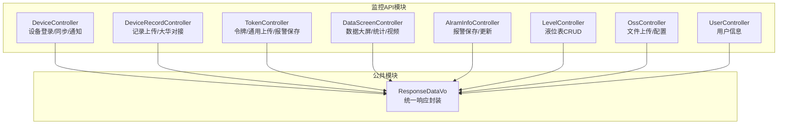
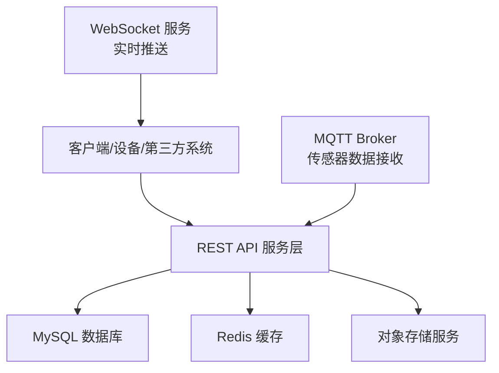
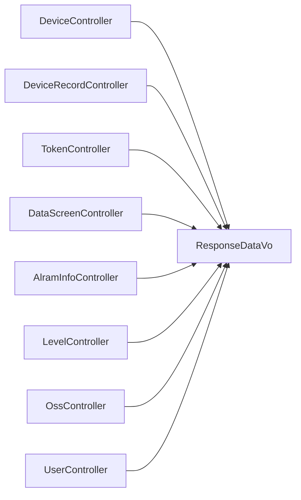

# API参考

<cite>
**本文引用的文件**
- [application.yml](file://monkey-monitor-api/src/main/resources/application.yml)
- [application-prod.yml](file://monkey-monitor-api/src/main/resources/application-prod.yml)
- [DeviceController.java](file://monkey-monitor-api/src/main/java/com/monkey/general/controller/DeviceController.java)
- [DeviceRecordController.java](file://monkey-monitor-api/src/main/java/com/monkey/general/controller/DeviceRecordController.java)
- [TokenController.java](file://monkey-monitor-api/src/main/java/com/monkey/general/controller/TokenController.java)
- [DataScreenController.java](file://monkey-monitor-api/src/main/java/com/monkey/general/controller/DataScreenController.java)
- [AlramInfoController.java](file://monkey-monitor-api/src/main/java/com/monkey/general/controller/AlramInfoController.java)
- [LevelController.java](file://monkey-monitor-api/src/main/java/com/monkey/general/controller/LevelController.java)
- [OssController.java](file://monkey-monitor-api/src/main/java/com/monkey/general/controller/OssController.java)
- [UserController.java](file://monkey-monitor-api/src/main/java/com/monkey/general/controller/UserController.java)
- [ResponseDataVo.java](file://monkey-common/src/main/java/com/monkey/general/common/entity/ResponseDataVo.java)
- [TokenResponse.java](file://monkey-monitor/src/main/java/com/monkey/general/platform/entity/TokenResponse.java)
</cite>

## 目录
1. [简介](#简介)
2. [项目结构](#项目结构)
3. [核心组件](#核心组件)
4. [架构总览](#架构总览)
5. [详细组件分析](#详细组件分析)
6. [依赖分析](#依赖分析)
7. [性能与配额](#性能与配额)
8. [故障排查指南](#故障排查指南)
9. [结论](#结论)
10. [附录](#附录)

## 简介
本文件为安威 fireworks 物联网监控平台的完整API参考文档，覆盖设备管理、监控查询、告警处理、用户管理、文件上传、数据大屏等核心能力。文档提供每个API的HTTP方法、URL路径、请求参数、响应格式、错误码说明，并给出调用示例路径与最佳实践建议。同时说明认证机制、权限控制、WebSocket实时推送、API版本与兼容策略、性能指标与使用限制。

## 项目结构
后端采用Spring Boot微服务风格，API集中在monitor模块的controller包中，统一通过@RestController暴露REST接口；公共响应封装在common模块的ResponseDataVo中；生产环境配置位于application-prod.yml，包含MQTT、WebSocket、第三方对接等关键参数。

图表来源
- [DeviceController.java:31-104](file://monkey-monitor-api/src/main/java/com/monkey/general/controller/DeviceController.java#L31-L104)
- [DeviceRecordController.java:31-103](file://monkey-monitor-api/src/main/java/com/monkey/general/controller/DeviceRecordController.java#L31-L103)
- [TokenController.java:33-350](file://monkey-monitor-api/src/main/java/com/monkey/general/controller/TokenController.java#L33-L350)
- [DataScreenController.java:43-364](file://monkey-monitor-api/src/main/java/com/monkey/general/controller/DataScreenController.java#L43-L364)
- [AlramInfoController.java:23-72](file://monkey-monitor-api/src/main/java/com/monkey/general/controller/AlramInfoController.java#L23-L72)
- [LevelController.java:27-108](file://monkey-monitor-api/src/main/java/com/monkey/general/controller/LevelController.java#L27-L108)
- [OssController.java:35-132](file://monkey-monitor-api/src/main/java/com/monkey/general/controller/OssController.java#L35-L132)
- [UserController.java:22-50](file://monkey-monitor-api/src/main/java/com/monkey/general/controller/UserController.java#L22-L50)
- [ResponseDataVo.java:11-59](file://monkey-common/src/main/java/com/monkey/general/common/entity/ResponseDataVo.java#L11-L59)

章节来源
- [application.yml:1-40](file://monkey-monitor-api/src/main/resources/application.yml#L1-L40)
- [application-prod.yml:1-198](file://monkey-monitor-api/src/main/resources/application-prod.yml#L1-L198)

## 核心组件
- 统一响应封装：所有接口返回统一结构，包含code、msg、data三要素，便于前端解析与错误处理。
- 设备侧接口：提供设备登录、人员同步、云端反馈通知、设备人员批量落库等能力。
- 记录上传接口：支持在线人员/车辆进出、大华设备接入、异常记录、算法事件等上传。
- 数据大屏接口：提供安全天数、告警分析、车/人统计、库存统计、视频播放、设备在线、报警推送列表等。
- 告警接口：提供报警信息保存与批量更新。
- 液位表接口：提供液位数据的分页查询、详情、新增、修改、删除。
- 文件上传接口：提供云存储配置查询/保存、文件上传、删除。
- 用户接口：提供当前登录用户信息查询。
- 认证与权限：基于企业编码进行权限隔离，部分接口以企业编码作为过滤条件。

章节来源
- [ResponseDataVo.java:11-59](file://monkey-common/src/main/java/com/monkey/general/common/entity/ResponseDataVo.java#L11-L59)
- [application-prod.yml:84-86](file://monkey-monitor-api/src/main/resources/application-prod.yml#L84-L86)

## 架构总览
平台通过REST API与设备/第三方系统交互，内部集成MQTT用于传感器数据接收，WebSocket用于实时推送（如人员定位报警），并通过定时任务/作业调度实现数据同步与上报。

图表来源
- [application-prod.yml:30-61](file://monkey-monitor-api/src/main/resources/application-prod.yml#L30-L61)
- [application.yml:1-40](file://monkey-monitor-api/src/main/resources/application.yml#L1-L40)

## 详细组件分析

### 设备管理接口
- 设备登录
  - 方法与路径：POST /device/login
  - 请求体：包含设备序列号 dev_sno
  - 成功响应：返回code=0、success=true、dev_sno、token、mqinfo（包含host/port/username/password/qos/topic等）
  - 失败响应：返回code=-1、success=false、msg
  - 示例路径：[设备登录示例:59-104](file://monkey-monitor-api/src/main/java/com/monkey/general/controller/DeviceController.java#L59-L104)
  - 最佳实践：设备侧需携带正确的dev_sno；若企业状态非正常，将拒绝登录
- 人员信息同步
  - 方法与路径：POST /device/sync_person
  - 请求体：dev_sno、token、path_params.person_list（人员ID列表）
  - 成功响应：返回code=0、success=true、msg、person_list（标准化后的人员信息数组）
  - 失败响应：返回code=-1、success=false、msg
  - 示例路径：[人员同步示例:107-161](file://monkey-monitor-api/src/main/java/com/monkey/general/controller/DeviceController.java#L107-L161)
  - 最佳实践：确保token与设备所属企业一致，且人员ID均存在
- 云端反馈通知
  - 方法与路径：POST /device/notify
  - 请求体：dev_sno、token、data
  - 成功响应：透传第三方处理结果
  - 失败响应：返回code=-1、success=false、msg
  - 示例路径：[云端反馈示例:169-196](file://monkey-monitor-api/src/main/java/com/monkey/general/controller/DeviceController.java#L169-L196)
- 设备人员批量落库
  - 方法与路径：POST /device/get_person_all
  - 请求体：token、dev_sno、person（单条）、person_list（数组）
  - 成功响应：返回code=0、success=true、msg
  - 失败响应：返回code=-1、success=false、msg
  - 示例路径：[批量落库示例:224-265](file://monkey-monitor-api/src/main/java/com/monkey/general/controller/DeviceController.java#L224-L265)

章节来源
- [DeviceController.java:59-104](file://monkey-monitor-api/src/main/java/com/monkey/general/controller/DeviceController.java#L59-L104)
- [DeviceController.java:107-161](file://monkey-monitor-api/src/main/java/com/monkey/general/controller/DeviceController.java#L107-L161)
- [DeviceController.java:169-196](file://monkey-monitor-api/src/main/java/com/monkey/general/controller/DeviceController.java#L169-L196)
- [DeviceController.java:224-265](file://monkey-monitor-api/src/main/java/com/monkey/general/controller/DeviceController.java#L224-L265)

### 记录上传接口
- 在线人员记录上传
  - 方法与路径：POST /record/upload/online
  - 请求体：PersonInOutRecordVo
  - 成功响应：{"code":0,"success":true,"msg":"OK"}
  - 示例路径：[在线人员上传示例:48-57](file://monkey-monitor-api/src/main/java/com/monkey/general/controller/DeviceRecordController.java#L48-L57)
- 车辆进出记录上传
  - 方法与路径：POST /record/upload/access
  - 请求体：包含msgId、service、data
  - 业务分支：INOUT（标准记录）/INOUTUNNORMAL（异常记录）
  - 成功响应：DataResponse(0, "成功")
  - 示例路径：[车辆上传示例:65-103](file://monkey-monitor-api/src/main/java/com/monkey/general/controller/DeviceRecordController.java#L65-L103)
- 大华人员进出记录上传
  - 方法与路径：POST /record/upload/dh/personInout
  - 参数：file（可选）、data（JSON字符串）
  - 成功响应：{"code":0,"success":true,"msg":"OK"}
  - 示例路径：[大华人员上传示例:112-139](file://monkey-monitor-api/src/main/java/com/monkey/general/controller/DeviceRecordController.java#L112-L139)
- 大华人员异常记录上传
  - 方法与路径：POST /record/upload/dh/personInOutUnNormal
  - 参数：file（可选）、data（JSON字符串）
  - 成功响应：{"code":0,"success":true,"msg":"OK"}
  - 示例路径：[大华异常上传示例:146-174](file://monkey-monitor-api/src/main/java/com/monkey/general/controller/DeviceRecordController.java#L146-L174)
- 大华车辆进出记录上传
  - 方法与路径：POST /record/upload/dh/carInout
  - 参数：file（可选）、data（JSON字符串）
  - 成功响应：{"code":0,"success":true,"msg":"OK"}
  - 示例路径：[大华车辆上传示例:181-208](file://monkey-monitor-api/src/main/java/com/monkey/general/controller/DeviceRecordController.java#L181-L208)
- 大华算法事件上传
  - 方法与路径：POST /record/upload/dh/algorithmAlarm
  - 参数：file（可选）、data（JSON字符串）
  - 成功响应：{"code":0,"success":true,"msg":"OK"}
  - 示例路径：[大华算法事件示例:216-242](file://monkey-monitor-api/src/main/java/com/monkey/general/controller/DeviceRecordController.java#L216-L242)
- 大华通道堵塞事件上传
  - 方法与路径：POST /record/upload/dh/carInOutUnNormal
  - 参数：file（可选）、data（JSON字符串）
  - 成功响应：{"code":0,"success":true,"msg":"OK"}
  - 示例路径：[大华通道堵塞示例:252-278](file://monkey-monitor-api/src/main/java/com/monkey/general/controller/DeviceRecordController.java#L252-L278)

章节来源
- [DeviceRecordController.java:48-57](file://monkey-monitor-api/src/main/java/com/monkey/general/controller/DeviceRecordController.java#L48-L57)
- [DeviceRecordController.java:65-103](file://monkey-monitor-api/src/main/java/com/monkey/general/controller/DeviceRecordController.java#L65-L103)
- [DeviceRecordController.java:112-139](file://monkey-monitor-api/src/main/java/com/monkey/general/controller/DeviceRecordController.java#L112-L139)
- [DeviceRecordController.java:146-174](file://monkey-monitor-api/src/main/java/com/monkey/general/controller/DeviceRecordController.java#L146-L174)
- [DeviceRecordController.java:181-208](file://monkey-monitor-api/src/main/java/com/monkey/general/controller/DeviceRecordController.java#L181-L208)
- [DeviceRecordController.java:216-242](file://monkey-monitor-api/src/main/java/com/monkey/general/controller/DeviceRecordController.java#L216-L242)
- [DeviceRecordController.java:252-278](file://monkey-monitor-api/src/main/java/com/monkey/general/controller/DeviceRecordController.java#L252-L278)

### 数据大屏与监控查询接口
- 安全生产天数
  - 方法与路径：GET /screen/safetyDays
  - 成功响应：字符串（YYYY-MM-DD）
  - 失败响应：返回企业信息未完善提示
  - 示例路径：[安全天数示例:95-105](file://monkey-monitor-api/src/main/java/com/monkey/general/controller/DataScreenController.java#L95-L105)
- 告警分析
  - 方法与路径：GET /screen/alarmAnalysis
  - 成功响应：AlarmAnalysisVo（今日告警数、累计告警数、明细列表）
  - 示例路径：[告警分析示例:110-131](file://monkey-monitor-api/src/main/java/com/monkey/general/controller/DataScreenController.java#L110-L131)
- 车辆统计
  - 方法与路径：GET /screen/vehicleStatistics
  - 成功响应：HashMap（键为统计维度，值为计数）
  - 示例路径：[车辆统计示例:137-143](file://monkey-monitor-api/src/main/java/com/monkey/general/controller/DataScreenController.java#L137-L143)
- 人员统计
  - 方法与路径：GET /screen/personnelStatistics
  - 成功响应：HashMap（键为统计维度，值为计数）
  - 示例路径：[人员统计示例:148-155](file://monkey-monitor-api/src/main/java/com/monkey/general/controller/DataScreenController.java#L148-L155)
- 库存统计
  - 方法与路径：GET /screen/stockStatistics
  - 成功响应：StorePersonnelVo（仓库列表与总量）
  - 示例路径：[库存统计示例:159-185](file://monkey-monitor-api/src/main/java/com/monkey/general/controller/DataScreenController.java#L159-L185)
- 视频监控（未处置）
  - 方法与路径：GET /screen/videoMonitoring
  - 成功响应：VideoMonitoringVo列表
  - 示例路径：[视频监控示例:190-196](file://monkey-monitor-api/src/main/java/com/monkey/general/controller/DataScreenController.java#L190-L196)
- 实时监控（湿度）
  - 方法与路径：GET /screen/humidity
  - 成功响应：TemperatureHumidityVo
  - 示例路径：[湿度示例:201-206](file://monkey-monitor-api/src/main/java/com/monkey/general/controller/DataScreenController.java#L201-L206)
- 实时监控（温度）
  - 方法与路径：GET /screen/temperature
  - 成功响应：TemperatureHumidityVo
  - 示例路径：[温度示例:211-216](file://monkey-monitor-api/src/main/java/com/monkey/general/controller/DataScreenController.java#L211-L216)
- 实时监控（液位）
  - 方法与路径：GET /screen/levelInfo
  - 成功响应：TemperatureHumidityVo
  - 示例路径：[液位示例:221-226](file://monkey-monitor-api/src/main/java/com/monkey/general/controller/DataScreenController.java#L221-L226)
- 设备在线情况
  - 方法与路径：GET /screen/deviceOnline
  - 成功响应：DeviceOnlineVo列表
  - 示例路径：[设备在线示例:279-284](file://monkey-monitor-api/src/main/java/com/monkey/general/controller/DataScreenController.java#L279-L284)
- 视频播放
  - 方法与路径：GET /screen/videoPlay
  - 成功响应：视频URL列表
  - 示例路径：[视频播放示例:289-314](file://monkey-monitor-api/src/main/java/com/monkey/general/controller/DataScreenController.java#L289-L314)
- 报警推送列表（带时间窗）
  - 方法与路径：GET /screen/alarmPushList
  - 成功响应：String列表
  - 失败响应：当当前时间不在配置的时间范围内时返回失败
  - 示例路径：[报警推送列表示例:318-350](file://monkey-monitor-api/src/main/java/com/monkey/general/controller/DataScreenController.java#L318-L350)
- 未处置报警列表
  - 方法与路径：GET /screen/alarm/list
  - 成功响应：AlramInfo列表（processing_status=0）
  - 示例路径：[未处置报警列表示例:353-361](file://monkey-monitor-api/src/main/java/com/monkey/general/controller/DataScreenController.java#L353-L361)

章节来源
- [DataScreenController.java:95-105](file://monkey-monitor-api/src/main/java/com/monkey/general/controller/DataScreenController.java#L95-L105)
- [DataScreenController.java:110-131](file://monkey-monitor-api/src/main/java/com/monkey/general/controller/DataScreenController.java#L110-L131)
- [DataScreenController.java:137-143](file://monkey-monitor-api/src/main/java/com/monkey/general/controller/DataScreenController.java#L137-L143)
- [DataScreenController.java:148-155](file://monkey-monitor-api/src/main/java/com/monkey/general/controller/DataScreenController.java#L148-L155)
- [DataScreenController.java:159-185](file://monkey-monitor-api/src/main/java/com/monkey/general/controller/DataScreenController.java#L159-L185)
- [DataScreenController.java:190-196](file://monkey-monitor-api/src/main/java/com/monkey/general/controller/DataScreenController.java#L190-L196)
- [DataScreenController.java:201-206](file://monkey-monitor-api/src/main/java/com/monkey/general/controller/DataScreenController.java#L201-L206)
- [DataScreenController.java:211-216](file://monkey-monitor-api/src/main/java/com/monkey/general/controller/DataScreenController.java#L211-L216)
- [DataScreenController.java:221-226](file://monkey-monitor-api/src/main/java/com/monkey/general/controller/DataScreenController.java#L221-L226)
- [DataScreenController.java:279-284](file://monkey-monitor-api/src/main/java/com/monkey/general/controller/DataScreenController.java#L279-L284)
- [DataScreenController.java:289-314](file://monkey-monitor-api/src/main/java/com/monkey/general/controller/DataScreenController.java#L289-L314)
- [DataScreenController.java:318-350](file://monkey-monitor-api/src/main/java/com/monkey/general/controller/DataScreenController.java#L318-L350)
- [DataScreenController.java:353-361](file://monkey-monitor-api/src/main/java/com/monkey/general/controller/DataScreenController.java#L353-L361)

### 告警处理接口
- 保存报警信息
  - 方法与路径：POST /alramInfo/save
  - 请求体：AlramInfo（自动填充公司编码、时间戳、状态、同步ID等）
  - 成功响应：统一成功响应
  - 示例路径：[保存报警示例:35-61](file://monkey-monitor-api/src/main/java/com/monkey/general/controller/AlramInfoController.java#L35-L61)
- 更新报警信息
  - 方法与路径：POST /alramInfo/update
  - 请求体：无（按公司维度批量更新）
  - 成功响应：统一成功响应
  - 示例路径：[更新报警示例:67-70](file://monkey-monitor-api/src/main/java/com/monkey/general/controller/AlramInfoController.java#L67-L70)

章节来源
- [AlramInfoController.java:35-61](file://monkey-monitor-api/src/main/java/com/monkey/general/controller/AlramInfoController.java#L35-L61)
- [AlramInfoController.java:67-70](file://monkey-monitor-api/src/main/java/com/monkey/general/controller/AlramInfoController.java#L67-L70)

### 液位表接口
- 列表
  - 方法与路径：GET /em/level/list
  - 查询参数：page、limit、key
  - 成功响应：分页包装后的Level列表
  - 示例路径：[列表示例:37-55](file://monkey-monitor-api/src/main/java/com/monkey/general/controller/LevelController.java#L37-L55)
- 详情
  - 方法与路径：GET /em/level/info/{id}
  - 路径参数：id
  - 成功响应：Level对象
  - 示例路径：[详情示例:62-67](file://monkey-monitor-api/src/main/java/com/monkey/general/controller/LevelController.java#L62-L67)
- 保存
  - 方法与路径：POST /em/level/save
  - 请求体：Level（含校验）
  - 成功响应：统一成功响应
  - 示例路径：[保存示例:72-80](file://monkey-monitor-api/src/main/java/com/monkey/general/controller/LevelController.java#L72-L80)
- 修改
  - 方法与路径：POST /em/level/update
  - 请求体：Level（含校验）
  - 成功响应：统一成功响应
  - 示例路径：[修改示例:85-93](file://monkey-monitor-api/src/main/java/com/monkey/general/controller/LevelController.java#L85-L93)
- 删除
  - 方法与路径：POST /em/level/delete
  - 请求体：Long[] ids
  - 成功响应：统一成功响应
  - 示例路径：[删除示例:99-106](file://monkey-monitor-api/src/main/java/com/monkey/general/controller/LevelController.java#L99-L106)

章节来源
- [LevelController.java:37-55](file://monkey-monitor-api/src/main/java/com/monkey/general/controller/LevelController.java#L37-L55)
- [LevelController.java:62-67](file://monkey-monitor-api/src/main/java/com/monkey/general/controller/LevelController.java#L62-L67)
- [LevelController.java:72-80](file://monkey-monitor-api/src/main/java/com/monkey/general/controller/LevelController.java#L72-L80)
- [LevelController.java:85-93](file://monkey-monitor-api/src/main/java/com/monkey/general/controller/LevelController.java#L85-L93)
- [LevelController.java:99-106](file://monkey-monitor-api/src/main/java/com/monkey/general/controller/LevelController.java#L99-L106)

### 文件上传与云存储接口
- 列表
  - 方法与路径：GET /sys/oss/list
  - 查询参数：分页参数
  - 成功响应：分页包装后的Oss列表
  - 示例路径：[列表示例:49-57](file://monkey-monitor-api/src/main/java/com/monkey/general/controller/OssController.java#L49-L57)
- 云存储配置
  - 方法与路径：GET /sys/oss/config
  - 成功响应：CloudStorageConfig
  - 示例路径：[配置示例:63-69](file://monkey-monitor-api/src/main/java/com/monkey/general/controller/OssController.java#L63-L69)
- 保存云存储配置
  - 方法与路径：POST /sys/oss/saveConfig
  - 请求体：CloudStorageConfig（按服务商分组校验）
  - 成功响应：统一成功响应
  - 示例路径：[保存配置示例:75-95](file://monkey-monitor-api/src/main/java/com/monkey/general/controller/OssController.java#L75-L95)
- 上传文件
  - 方法与路径：POST /sys/oss/upload
  - 表单参数：file（multipart）
  - 成功响应：上传后的URL
  - 示例路径：[上传文件示例:101-118](file://monkey-monitor-api/src/main/java/com/monkey/general/controller/OssController.java#L101-L118)
- 删除文件
  - 方法与路径：POST /sys/oss/delete
  - 请求体：Long[] ids
  - 成功响应：统一成功响应
  - 示例路径：[删除文件示例:124-130](file://monkey-monitor-api/src/main/java/com/monkey/general/controller/OssController.java#L124-L130)

章节来源
- [OssController.java:49-57](file://monkey-monitor-api/src/main/java/com/monkey/general/controller/OssController.java#L49-L57)
- [OssController.java:63-69](file://monkey-monitor-api/src/main/java/com/monkey/general/controller/OssController.java#L63-L69)
- [OssController.java:75-95](file://monkey-monitor-api/src/main/java/com/monkey/general/controller/OssController.java#L75-L95)
- [OssController.java:101-118](file://monkey-monitor-api/src/main/java/com/monkey/general/controller/OssController.java#L101-L118)
- [OssController.java:124-130](file://monkey-monitor-api/src/main/java/com/monkey/general/controller/OssController.java#L124-L130)

### 用户管理接口
- 当前登录用户信息
  - 方法与路径：GET /sys/user/info
  - 成功响应：User对象（去除敏感字段）
  - 失败响应：通过企业编码未查询到账号信息
  - 示例路径：[用户信息示例:35-49](file://monkey-monitor-api/src/main/java/com/monkey/general/controller/UserController.java#L35-L49)

章节来源
- [UserController.java:35-49](file://monkey-monitor-api/src/main/java/com/monkey/general/controller/UserController.java#L35-L49)

### 令牌与通用上传接口
- 获取访问令牌
  - 方法与路径：POST /api/Oauth/token
  - 成功响应：TokenResponse（access_token、expires_in、token_type）
  - 示例路径：[获取令牌示例:56-65](file://monkey-monitor-api/src/main/java/com/monkey/general/controller/TokenController.java#L56-L65)
- 通用文件上传
  - 方法与路径：POST /api/common/uploadFile
  - 表单参数：file（multipart）
  - 成功响应：{"code":1,"message":"上传成功","data":{...}}
  - 示例路径：[通用上传示例:68-87](file://monkey-monitor-api/src/main/java/com/monkey/general/controller/TokenController.java#L68-L87)
- 企业信息保存（通用）
  - 方法与路径：POST /api/fire/common/saveInfoCompan
  - 请求体：JSON字符串
  - 成功响应：{"code":1,"message":"上传成功","data":""}
  - 示例路径：[企业信息保存示例:90-106](file://monkey-monitor-api/src/main/java/com/monkey/general/controller/TokenController.java#L90-L106)
- 人员信息保存（通用）
  - 方法与路径：POST /api/fire/common/saveInfoPerson
  - 请求体：JSON字符串
  - 成功响应：{"code":1,"message":"上传成功","data":{"id": "..."}}
  - 示例路径：[人员信息保存示例:108-127](file://monkey-monitor-api/src/main/java/com/monkey/general/controller/TokenController.java#L108-L127)
- 仓库信息保存（通用）
  - 方法与路径：POST /api/fire/common/saveInfoStore
  - 请求体：JSON字符串
  - 成功响应：{"code":1,"message":"上传成功","data":{}}
  - 示例路径：[仓库信息保存示例:130-147](file://monkey-monitor-api/src/main/java/com/monkey/general/controller/TokenController.java#L130-L147)
- 仓间信息保存（通用）
  - 方法与路径：POST /api/fire/common/saveInfoStoreroom
  - 请求体：JSON字符串
  - 成功响应：{"code":1,"message":"上传成功","data":{}}
  - 示例路径：[仓间信息保存示例:150-167](file://monkey-monitor-api/src/main/java/com/monkey/general/controller/TokenController.java#L150-L167)
- 人员统计信息保存（通用）
  - 方法与路径：POST /api/fire/common/saveInfoPersonStatistics
  - 请求体：JSON字符串
  - 成功响应：{"code":1,"message":"上传成功","data":{}}
  - 示例路径：[人员统计保存示例:170-187](file://monkey-monitor-api/src/main/java/com/monkey/general/controller/TokenController.java#L170-L187)
- 设备信息保存（通用）
  - 方法与路径：POST /api/fire/common/saveInfoDevice
  - 请求体：JSON字符串
  - 成功响应：{"code":1,"message":"上传成功","data":{}}
  - 示例路径：[设备信息保存示例:190-207](file://monkey-monitor-api/src/main/java/com/monkey/general/controller/TokenController.java#L190-L207)
- 计算机信息保存（通用）
  - 方法与路径：POST /api/fire/common/saveInfoComputer
  - 请求体：JSON字符串
  - 成功响应：{"code":1,"message":"上传成功","data":{}}
  - 示例路径：[计算机信息保存示例:210-227](file://monkey-monitor-api/src/main/java/com/monkey/general/controller/TokenController.java#L210-L227)
- 人员进出记录保存（通用）
  - 方法与路径：POST /api/fire/common/saveInfoPersonInout
  - 请求体：JSON字符串
  - 成功响应：{"code":1,"message":"上传成功","data":{}}
  - 示例路径：[人员进出保存示例:230-247](file://monkey-monitor-api/src/main/java/com/monkey/general/controller/TokenController.java#L230-L247)
- 车辆进出记录保存（通用）
  - 方法与路径：POST /api//fire/common/saveInfoCarInout（注意路径中的多余斜杠）
  - 请求体：JSON字符串
  - 成功响应：{"code":1,"message":"上传成功","data":{}}
  - 示例路径：[车辆进出保存示例:250-267](file://monkey-monitor-api/src/main/java/com/monkey/general/controller/TokenController.java#L250-L267)
- 人员出入记录保存
  - 方法与路径：POST /api/personInOutInfo/save
  - 请求体：PersonInOutInfo（自动填充UUID）
  - 成功响应：统一成功响应
  - 示例路径：[人员出入保存示例:273-280](file://monkey-monitor-api/src/main/java/com/monkey/general/controller/TokenController.java#L273-L280)
- 车辆出入记录保存
  - 方法与路径：POST /api/carInOutInfo/save
  - 请求体：CarInOutInfo（自动填充UUID）
  - 成功响应：统一成功响应
  - 示例路径：[车辆出入保存示例:286-293](file://monkey-monitor-api/src/main/java/com/monkey/general/controller/TokenController.java#L286-L293)
- 报警推送列表（大屏）
  - 方法与路径：GET /api/alarmPushList
  - 成功响应：String列表
  - 示例路径：[报警推送列表示例:300-308](file://monkey-monitor-api/src/main/java/com/monkey/general/controller/TokenController.java#L300-L308)
- 报警信息保存
  - 方法与路径：POST /api/alramInfo/save
  - 请求体：AlramInfo（自动填充UUID）
  - 成功响应：统一成功响应
  - 示例路径：[报警保存示例:313-325](file://monkey-monitor-api/src/main/java/com/monkey/general/controller/TokenController.java#L313-L325)
- 测试接口
  - 方法与路径：POST /api/test
  - 成功响应："success"
  - 示例路径：[测试接口示例:332-347](file://monkey-monitor-api/src/main/java/com/monkey/general/controller/TokenController.java#L332-L347)

章节来源
- [TokenController.java:56-65](file://monkey-monitor-api/src/main/java/com/monkey/general/controller/TokenController.java#L56-L65)
- [TokenController.java:68-87](file://monkey-monitor-api/src/main/java/com/monkey/general/controller/TokenController.java#L68-L87)
- [TokenController.java:90-106](file://monkey-monitor-api/src/main/java/com/monkey/general/controller/TokenController.java#L90-L106)
- [TokenController.java:108-127](file://monkey-monitor-api/src/main/java/com/monkey/general/controller/TokenController.java#L108-L127)
- [TokenController.java:130-147](file://monkey-monitor-api/src/main/java/com/monkey/general/controller/TokenController.java#L130-L147)
- [TokenController.java:150-167](file://monkey-monitor-api/src/main/java/com/monkey/general/controller/TokenController.java#L150-L167)
- [TokenController.java:170-187](file://monkey-monitor-api/src/main/java/com/monkey/general/controller/TokenController.java#L170-L187)
- [TokenController.java:190-207](file://monkey-monitor-api/src/main/java/com/monkey/general/controller/TokenController.java#L190-L207)
- [TokenController.java:210-227](file://monkey-monitor-api/src/main/java/com/monkey/general/controller/TokenController.java#L210-L227)
- [TokenController.java:230-247](file://monkey-monitor-api/src/main/java/com/monkey/general/controller/TokenController.java#L230-L247)
- [TokenController.java:250-267](file://monkey-monitor-api/src/main/java/com/monkey/general/controller/TokenController.java#L250-L267)
- [TokenController.java:273-280](file://monkey-monitor-api/src/main/java/com/monkey/general/controller/TokenController.java#L273-L280)
- [TokenController.java:286-293](file://monkey-monitor-api/src/main/java/com/monkey/general/controller/TokenController.java#L286-L293)
- [TokenController.java:300-308](file://monkey-monitor-api/src/main/java/com/monkey/general/controller/TokenController.java#L300-L308)
- [TokenController.java:313-325](file://monkey-monitor-api/src/main/java/com/monkey/general/controller/TokenController.java#L313-L325)
- [TokenController.java:332-347](file://monkey-monitor-api/src/main/java/com/monkey/general/controller/TokenController.java#L332-L347)
- [TokenResponse.java:13-24](file://monkey-monitor/src/main/java/com/monkey/general/platform/entity/TokenResponse.java#L13-L24)

## 依赖分析
- 统一响应封装：所有控制器均依赖ResponseDataVo，保证返回一致性。
- 设备侧接口依赖企业与人员信息服务，确保设备与企业状态有效。
- 记录上传接口依赖第三方服务（如擎天、大华），并对请求体进行严格校验。
- 数据大屏接口依赖各类统计服务与配置检查，支持时间窗控制。
- 文件上传接口依赖OSS工厂与配置服务，支持多种云厂商。

图表来源
- [DeviceController.java:31-104](file://monkey-monitor-api/src/main/java/com/monkey/general/controller/DeviceController.java#L31-L104)
- [DeviceRecordController.java:31-103](file://monkey-monitor-api/src/main/java/com/monkey/general/controller/DeviceRecordController.java#L31-L103)
- [TokenController.java:33-350](file://monkey-monitor-api/src/main/java/com/monkey/general/controller/TokenController.java#L33-L350)
- [DataScreenController.java:43-364](file://monkey-monitor-api/src/main/java/com/monkey/general/controller/DataScreenController.java#L43-L364)
- [AlramInfoController.java:23-72](file://monkey-monitor-api/src/main/java/com/monkey/general/controller/AlramInfoController.java#L23-L72)
- [LevelController.java:27-108](file://monkey-monitor-api/src/main/java/com/monkey/general/controller/LevelController.java#L27-L108)
- [OssController.java:35-132](file://monkey-monitor-api/src/main/java/com/monkey/general/controller/OssController.java#L35-L132)
- [UserController.java:22-50](file://monkey-monitor-api/src/main/java/com/monkey/general/controller/UserController.java#L22-L50)
- [ResponseDataVo.java:11-59](file://monkey-common/src/main/java/com/monkey/general/common/entity/ResponseDataVo.java#L11-L59)

## 性能与配额
- 服务端口与环境：默认端口9900，生产环境配置见application-prod.yml。
- 上传文件大小限制：multipart.max-file-size=10MB。
- MQTT与传感器数据接收：提供本地与公网host、用户名、密码、keepalive等参数，支持设备侧连接。
- WebSocket推送：配置了推送地址与密钥，用于实时报警推送。
- Redis缓存：生产配置中提供开关与连接参数，可用于热点数据缓存。
- 第三方对接：包含擎天、大华、云南上报、广西/贵州上传等配置项，便于扩展。

章节来源
- [application.yml:1-40](file://monkey-monitor-api/src/main/resources/application.yml#L1-L40)
- [application-prod.yml:27-48](file://monkey-monitor-api/src/main/resources/application-prod.yml#L27-L48)
- [application-prod.yml:56-61](file://monkey-monitor-api/src/main/resources/application-prod.yml#L56-L61)
- [application-prod.yml:13-26](file://monkey-monitor-api/src/main/resources/application-prod.yml#L13-L26)

## 故障排查指南
- 统一响应错误码：统一使用code字段标识状态，0表示成功，非0为失败；msg提供错误描述。
- 常见失败场景：
  - 设备不存在或企业状态异常：设备登录/同步接口会返回code=-1与明确提示。
  - 请求体为空或缺失必要字段：记录上传接口对data/msgId/service进行严格校验。
  - 上传文件为空：文件上传接口抛出自定义异常。
  - 时间不在配置范围内：数据大屏报警推送接口会在配置时间窗外返回失败。
- 建议排查步骤：
  - 确认请求体结构与字段命名正确。
  - 核对企业编码与设备编码的有效性。
  - 检查MQTT/WS配置是否正确。
  - 查看服务端日志与数据库状态。

章节来源
- [ResponseDataVo.java:11-59](file://monkey-common/src/main/java/com/monkey/general/common/entity/ResponseDataVo.java#L11-L59)
- [DeviceController.java:65-83](file://monkey-monitor-api/src/main/java/com/monkey/general/controller/DeviceController.java#L65-L83)
- [DeviceRecordController.java:69-85](file://monkey-monitor-api/src/main/java/com/monkey/general/controller/DeviceRecordController.java#L69-L85)
- [OssController.java:104-106](file://monkey-monitor-api/src/main/java/com/monkey/general/controller/OssController.java#L104-L106)
- [DataScreenController.java:333-341](file://monkey-monitor-api/src/main/java/com/monkey/general/controller/DataScreenController.java#L333-L341)

## 结论
本API参考文档覆盖了设备管理、监控查询、告警处理、用户管理、文件上传、数据大屏等核心功能，提供了统一的响应格式、严格的参数校验与清晰的错误码说明。结合MQTT与WebSocket能力，平台实现了从设备侧到云端的高效数据流转与实时推送。建议在生产环境中合理配置MQTT/WS/Redis等中间件，并根据业务量调整连接池与缓存策略。

## 附录

### 统一响应结构
- 字段说明
  - code：整型，0表示成功，非0表示失败
  - msg：字符串，消息提示
  - data：任意类型，具体业务数据

章节来源
- [ResponseDataVo.java:11-59](file://monkey-common/src/main/java/com/monkey/general/common/entity/ResponseDataVo.java#L11-L59)

### 认证与权限控制
- 企业编码隔离：多处接口以${monkey.company_code}作为过滤条件，确保数据隔离。
- 设备登录校验：设备登录时校验设备与企业状态，确保合法接入。
- 用户信息查询：基于固定的企业编码查询当前用户信息。

章节来源
- [application-prod.yml:84-86](file://monkey-monitor-api/src/main/resources/application-prod.yml#L84-L86)
- [DeviceController.java:64-83](file://monkey-monitor-api/src/main/java/com/monkey/general/controller/DeviceController.java#L64-L83)
- [UserController.java:37-49](file://monkey-monitor-api/src/main/java/com/monkey/general/controller/UserController.java#L37-L49)

### WebSocket与实时推送
- 配置项：socket.socketUrl、MapId、AppKey、AccessKey
- 使用场景：人员定位报警联动、实时推送通知

章节来源
- [application-prod.yml:56-61](file://monkey-monitor-api/src/main/resources/application-prod.yml#L56-L61)

### API版本与兼容策略
- 当前未发现显式的API版本号字段；建议后续在请求头或URL中引入版本前缀，以保障向后兼容。
- 建议对废弃接口保留过渡期并标注deprecated，避免破坏现有集成。

[本节为通用建议，无需源码引用]

### 接口调用示例路径索引
- 设备登录：[示例:59-104](file://monkey-monitor-api/src/main/java/com/monkey/general/controller/DeviceController.java#L59-L104)
- 人员同步：[示例:107-161](file://monkey-monitor-api/src/main/java/com/monkey/general/controller/DeviceController.java#L107-L161)
- 云端反馈：[示例:169-196](file://monkey-monitor-api/src/main/java/com/monkey/general/controller/DeviceController.java#L169-L196)
- 批量落库：[示例:224-265](file://monkey-monitor-api/src/main/java/com/monkey/general/controller/DeviceController.java#L224-L265)
- 在线人员上传：[示例:48-57](file://monkey-monitor-api/src/main/java/com/monkey/general/controller/DeviceRecordController.java#L48-L57)
- 车辆上传（INOUT/INOUTUNNORMAL）：[示例:65-103](file://monkey-monitor-api/src/main/java/com/monkey/general/controller/DeviceRecordController.java#L65-L103)
- 大华人员上传：[示例:112-139](file://monkey-monitor-api/src/main/java/com/monkey/general/controller/DeviceRecordController.java#L112-L139)
- 大华异常上传：[示例:146-174](file://monkey-monitor-api/src/main/java/com/monkey/general/controller/DeviceRecordController.java#L146-L174)
- 大华车辆上传：[示例:181-208](file://monkey-monitor-api/src/main/java/com/monkey/general/controller/DeviceRecordController.java#L181-L208)
- 大华算法事件：[示例:216-242](file://monkey-monitor-api/src/main/java/com/monkey/general/controller/DeviceRecordController.java#L216-L242)
- 通道堵塞事件：[示例:252-278](file://monkey-monitor-api/src/main/java/com/monkey/general/controller/DeviceRecordController.java#L252-L278)
- 安全生产天数：[示例:95-105](file://monkey-monitor-api/src/main/java/com/monkey/general/controller/DataScreenController.java#L95-L105)
- 告警分析：[示例:110-131](file://monkey-monitor-api/src/main/java/com/monkey/general/controller/DataScreenController.java#L110-L131)
- 车辆统计：[示例:137-143](file://monkey-monitor-api/src/main/java/com/monkey/general/controller/DataScreenController.java#L137-L143)
- 人员统计：[示例:148-155](file://monkey-monitor-api/src/main/java/com/monkey/general/controller/DataScreenController.java#L148-L155)
- 库存统计：[示例:159-185](file://monkey-monitor-api/src/main/java/com/monkey/general/controller/DataScreenController.java#L159-L185)
- 视频监控（未处置）：[示例:190-196](file://monkey-monitor-api/src/main/java/com/monkey/general/controller/DataScreenController.java#L190-L196)
- 实时监控（湿度/温度/液位）：[示例:201-226](file://monkey-monitor-api/src/main/java/com/monkey/general/controller/DataScreenController.java#L201-L226)
- 设备在线情况：[示例:279-284](file://monkey-monitor-api/src/main/java/com/monkey/general/controller/DataScreenController.java#L279-L284)
- 视频播放：[示例:289-314](file://monkey-monitor-api/src/main/java/com/monkey/general/controller/DataScreenController.java#L289-L314)
- 报警推送列表（带时间窗）：[示例:318-350](file://monkey-monitor-api/src/main/java/com/monkey/general/controller/DataScreenController.java#L318-L350)
- 未处置报警列表：[示例:353-361](file://monkey-monitor-api/src/main/java/com/monkey/general/controller/DataScreenController.java#L353-L361)
- 保存报警信息：[示例:35-61](file://monkey-monitor-api/src/main/java/com/monkey/general/controller/AlramInfoController.java#L35-L61)
- 更新报警信息：[示例:67-70](file://monkey-monitor-api/src/main/java/com/monkey/general/controller/AlramInfoController.java#L67-L70)
- 液位表列表/详情/保存/修改/删除：[示例:37-106](file://monkey-monitor-api/src/main/java/com/monkey/general/controller/LevelController.java#L37-L106)
- 云存储配置查询/保存/上传/删除：[示例:49-130](file://monkey-monitor-api/src/main/java/com/monkey/general/controller/OssController.java#L49-L130)
- 当前登录用户信息：[示例:35-49](file://monkey-monitor-api/src/main/java/com/monkey/general/controller/UserController.java#L35-L49)
- 获取访问令牌：[示例:56-65](file://monkey-monitor-api/src/main/java/com/monkey/general/controller/TokenController.java#L56-L65)
- 通用文件上传：[示例:68-87](file://monkey-monitor-api/src/main/java/com/monkey/general/controller/TokenController.java#L68-L87)
- 通用信息保存系列：[示例:90-267](file://monkey-monitor-api/src/main/java/com/monkey/general/controller/TokenController.java#L90-L267)
- 人员/车辆出入记录保存：[示例:273-293](file://monkey-monitor-api/src/main/java/com/monkey/general/controller/TokenController.java#L273-L293)
- 报警推送列表（大屏）：[示例:300-308](file://monkey-monitor-api/src/main/java/com/monkey/general/controller/TokenController.java#L300-L308)
- 报警信息保存：[示例:313-325](file://monkey-monitor-api/src/main/java/com/monkey/general/controller/TokenController.java#L313-L325)
- 测试接口：[示例:332-347](file://monkey-monitor-api/src/main/java/com/monkey/general/controller/TokenController.java#L332-L347)