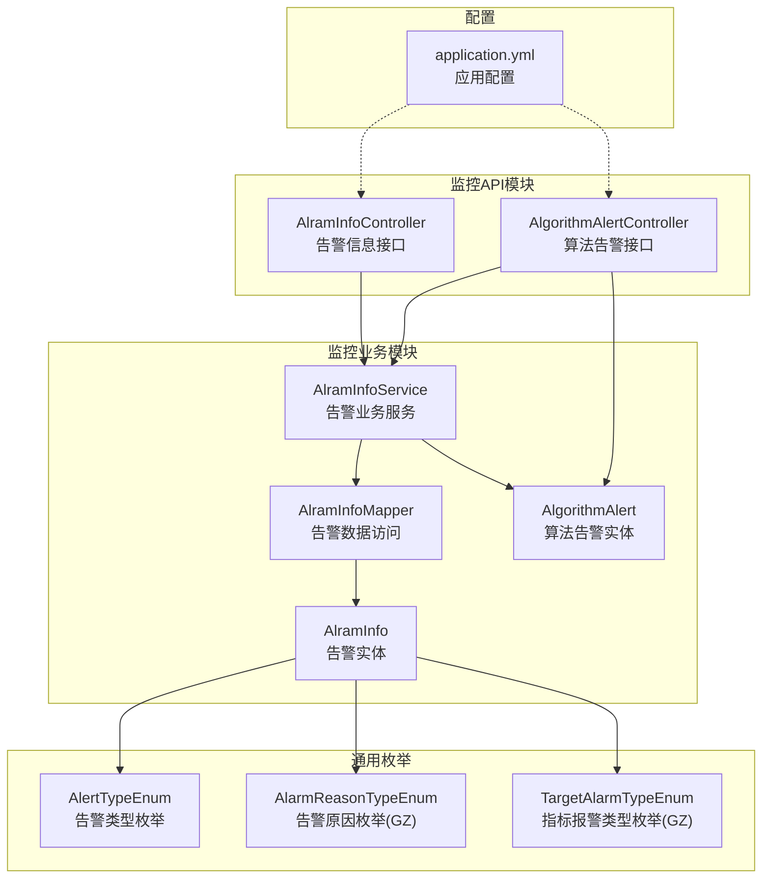
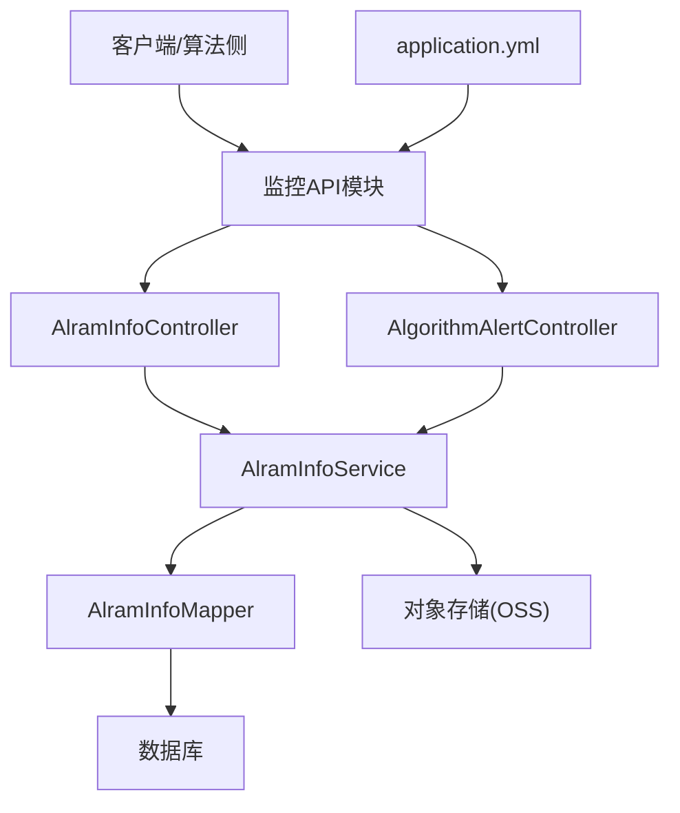
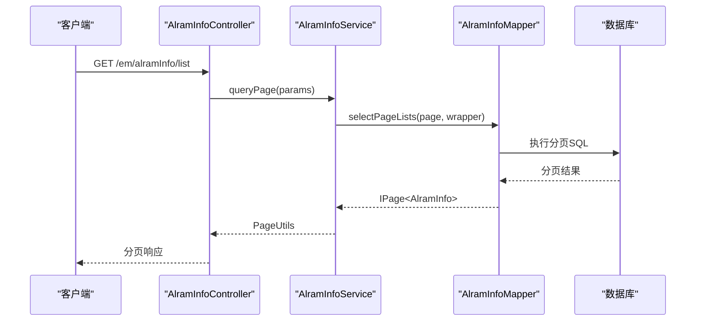
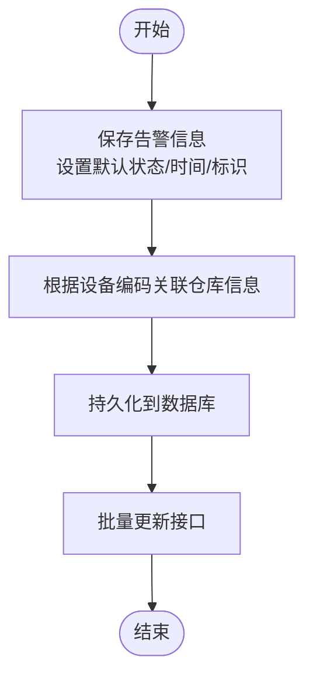
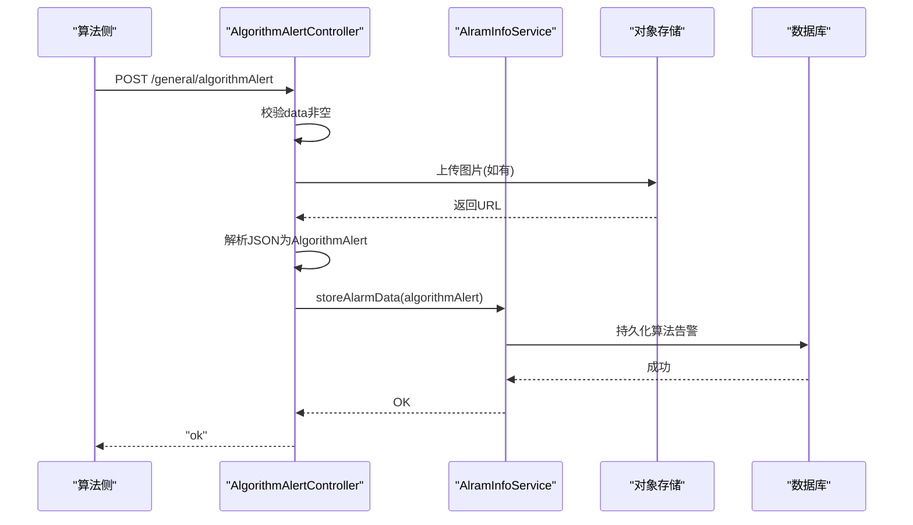
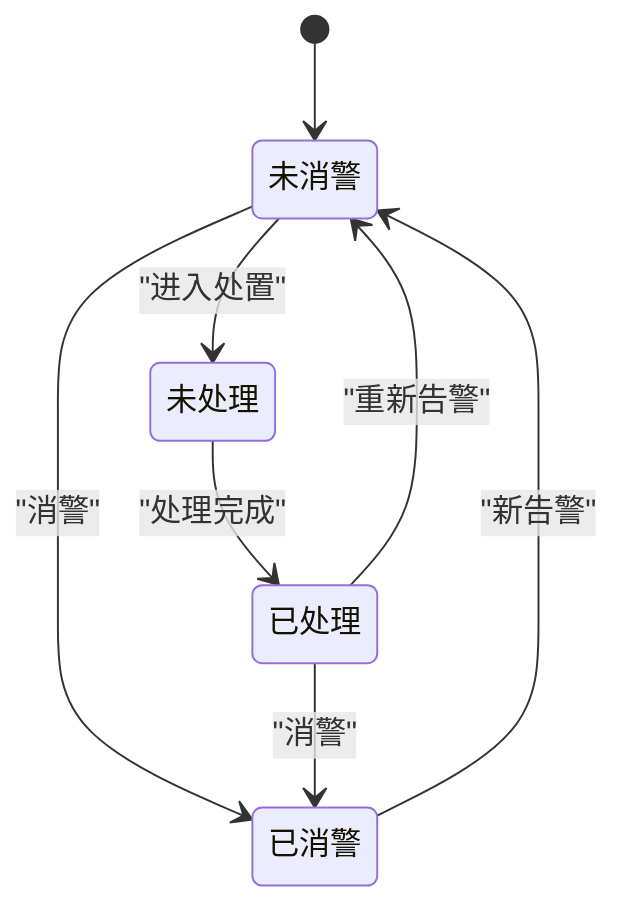
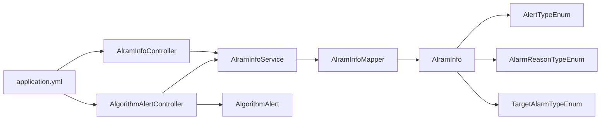

# 告警处理API

<cite>
**本文引用的文件**
- [AlramInfoController.java](file://monkey-monitor-api/src/main/java/com/monkey/general/controller/AlramInfoController.java)
- [AlgorithmAlertController.java](file://monkey-monitor-api/src/main/java/com/monkey/general/controller/AlgorithmAlertController.java)
- [AlramInfo.java](file://monkey-monitor/src/main/java/com/monkey/general/modules/em/entity/AlramInfo.java)
- [AlramInfoService.java](file://monkey-monitor/src/main/java/com/monkey/general/modules/em/service/AlramInfoService.java)
- [AlramInfoMapper.java](file://monkey-monitor/src/main/java/com/monkey/general/modules/em/mapper/AlramInfoMapper.java)
- [AlgorithmAlert.java](file://monkey-service/src/main/java/com/monkey/general/modules/em/entity/AlgorithmAlert.java)
- [AlertTypeEnum.java](file://monkey-common/src/main/java/com/monkey/general/common/enums/AlertTypeEnum.java)
- [AlarmReasonTypeEnum.java](file://monkey-monitor/src/main/java/com/monkey/general/util/gz/entity/enums/AlarmReasonTypeEnum.java)
- [TargetAlarmTypeEnum.java](file://monkey-monitor/src/main/java/com/monkey/general/util/gz/entity/enums/TargetAlarmTypeEnum.java)
- [application.yml](file://monkey-monitor-api/src/main/resources/application.yml)
</cite>

## 目录
1. [简介](#简介)
2. [项目结构](#项目结构)
3. [核心组件](#核心组件)
4. [架构总览](#架构总览)
5. [详细组件分析](#详细组件分析)
6. [依赖关系分析](#依赖关系分析)
7. [性能考虑](#性能考虑)
8. [故障排查指南](#故障排查指南)
9. [结论](#结论)
10. [附录](#附录)

## 简介
本文件面向告警处理API，系统性梳理告警信息查询、告警状态更新、告警处理流程与算法告警接口等核心能力。文档同时明确告警类型与级别定义、状态流转、通知与升级策略、处理时限配置建议，以及告警数据存储格式与查询优化策略，覆盖设备告警、环境告警、系统告警等多种场景。

## 项目结构
告警处理API主要由以下模块构成：
- 控制层（Controller）：对外暴露REST接口，负责接收请求、参数校验与响应封装。
- 业务服务（Service）：封装业务逻辑，协调数据访问与第三方集成。
- 数据访问（Mapper/Entity）：映射数据库表结构，提供分页查询、聚合分析与批量更新等能力。
- 通用枚举与工具：定义告警类型、原因分类、指标报警类型等通用枚举，支撑跨模块一致性。
- 配置文件：定义应用端口、MyBatis配置、时区与日期格式等基础运行参数。

图表来源
- [AlramInfoController.java:1-73](file://monkey-monitor-api/src/main/java/com/monkey/general/controller/AlramInfoController.java#L1-L73)
- [AlgorithmAlertController.java:1-68](file://monkey-monitor-api/src/main/java/com/monkey/general/controller/AlgorithmAlertController.java#L1-L68)
- [AlramInfoService.java:1-49](file://monkey-monitor/src/main/java/com/monkey/general/modules/em/service/AlramInfoService.java#L1-L49)
- [AlramInfoMapper.java:1-40](file://monkey-monitor/src/main/java/com/monkey/general/modules/em/mapper/AlramInfoMapper.java#L1-L40)
- [AlramInfo.java:1-330](file://monkey-monitor/src/main/java/com/monkey/general/modules/em/entity/AlramInfo.java#L1-L330)
- [AlgorithmAlert.java:1-87](file://monkey-service/src/main/java/com/monkey/general/modules/em/entity/AlgorithmAlert.java#L1-L87)
- [AlertTypeEnum.java:1-53](file://monkey-common/src/main/java/com/monkey/general/common/enums/AlertTypeEnum.java#L1-L53)
- [AlarmReasonTypeEnum.java:1-57](file://monkey-monitor/src/main/java/com/monkey/general/util/gz/entity/enums/AlarmReasonTypeEnum.java#L1-L57)
- [TargetAlarmTypeEnum.java:1-69](file://monkey-monitor/src/main/java/com/monkey/general/util/gz/entity/enums/TargetAlarmTypeEnum.java#L1-L69)
- [application.yml:1-40](file://monkey-monitor-api/src/main/resources/application.yml#L1-L40)

章节来源
- [AlramInfoController.java:1-73](file://monkey-monitor-api/src/main/java/com/monkey/general/controller/AlramInfoController.java#L1-L73)
- [AlgorithmAlertController.java:1-68](file://monkey-monitor-api/src/main/java/com/monkey/general/controller/AlgorithmAlertController.java#L1-L68)
- [AlramInfo.java:1-330](file://monkey-monitor/src/main/java/com/monkey/general/modules/em/entity/AlramInfo.java#L1-L330)
- [AlramInfoService.java:1-49](file://monkey-monitor/src/main/java/com/monkey/general/modules/em/service/AlramInfoService.java#L1-L49)
- [AlramInfoMapper.java:1-40](file://monkey-monitor/src/main/java/com/monkey/general/modules/em/mapper/AlramInfoMapper.java#L1-L40)
- [AlgorithmAlert.java:1-87](file://monkey-service/src/main/java/com/monkey/general/modules/em/entity/AlgorithmAlert.java#L1-L87)
- [AlertTypeEnum.java:1-53](file://monkey-common/src/main/java/com/monkey/general/common/enums/AlertTypeEnum.java#L1-L53)
- [AlarmReasonTypeEnum.java:1-57](file://monkey-monitor/src/main/java/com/monkey/general/util/gz/entity/enums/AlarmReasonTypeEnum.java#L1-L57)
- [TargetAlarmTypeEnum.java:1-69](file://monkey-monitor/src/main/java/com/monkey/general/util/gz/entity/enums/TargetAlarmTypeEnum.java#L1-L69)
- [application.yml:1-40](file://monkey-monitor-api/src/main/resources/application.yml#L1-L40)

## 核心组件
- 告警信息控制器（AlramInfoController）
  - 提供告警保存与批量状态更新接口，完成基础字段初始化、设备关联与默认状态设置。
- 算法告警控制器（AlgorithmAlertController）
  - 接收算法侧告警JSON与多张图片文件，上传至对象存储并持久化算法告警实体。
- 告警实体（AlramInfo）
  - 定义企业级告警的完整字段集，包括类型、状态、处理信息、推送状态、贵州平台扩展字段等。
- 算法告警实体（AlgorithmAlert）
  - 定义算法告警的关键字段，如抓拍ID、设备信息、处理结果、扩展信息等。
- 告警业务服务（AlramInfoService）
  - 提供分页查询、报警分析、视频监控列表、告警推送列表、批量更新与算法告警存储等方法。
- 告警数据访问（AlramInfoMapper）
  - 提供分页查询、聚合分析、视频监控查询、批量更新SQL等能力。
- 通用枚举
  - AlertTypeEnum：告警类型与级别映射。
  - AlarmReasonTypeEnum：贵州平台告警原因分类。
  - TargetAlarmTypeEnum：贵州平台指标报警类型。

章节来源
- [AlramInfoController.java:35-70](file://monkey-monitor-api/src/main/java/com/monkey/general/controller/AlramInfoController.java#L35-L70)
- [AlgorithmAlertController.java:35-64](file://monkey-monitor-api/src/main/java/com/monkey/general/controller/AlgorithmAlertController.java#L35-L64)
- [AlramInfo.java:61-329](file://monkey-monitor/src/main/java/com/monkey/general/modules/em/entity/AlramInfo.java#L61-L329)
- [AlgorithmAlert.java:11-85](file://monkey-service/src/main/java/com/monkey/general/modules/em/entity/AlgorithmAlert.java#L11-L85)
- [AlramInfoService.java:21-46](file://monkey-monitor/src/main/java/com/monkey/general/modules/em/service/AlramInfoService.java#L21-L46)
- [AlramInfoMapper.java:23-38](file://monkey-monitor/src/main/java/com/monkey/general/modules/em/mapper/AlramInfoMapper.java#L23-L38)
- [AlertTypeEnum.java:8-15](file://monkey-common/src/main/java/com/monkey/general/common/enums/AlertTypeEnum.java#L8-L15)
- [AlarmReasonTypeEnum.java:6-21](file://monkey-monitor/src/main/java/com/monkey/general/util/gz/entity/enums/AlarmReasonTypeEnum.java#L6-L21)
- [TargetAlarmTypeEnum.java:7-14](file://monkey-monitor/src/main/java/com/monkey/general/util/gz/entity/enums/TargetAlarmTypeEnum.java#L7-L14)

## 架构总览
告警处理API采用典型的分层架构：
- 表现层：Controller接收HTTP请求，进行参数校验与响应封装。
- 领域层：Service编排业务流程，调用Mapper与第三方能力。
- 数据层：Mapper通过MyBatis执行SQL，实现分页、聚合与批量操作。
- 配置层：application.yml统一管理端口、MyBatis配置与时区格式。

图表来源
- [AlramInfoController.java:23-70](file://monkey-monitor-api/src/main/java/com/monkey/general/controller/AlramInfoController.java#L23-L70)
- [AlgorithmAlertController.java:26-64](file://monkey-monitor-api/src/main/java/com/monkey/general/controller/AlgorithmAlertController.java#L26-L64)
- [AlramInfoService.java:19-46](file://monkey-monitor/src/main/java/com/monkey/general/modules/em/service/AlramInfoService.java#L19-L46)
- [AlramInfoMapper.java:20-38](file://monkey-monitor/src/main/java/com/monkey/general/modules/em/mapper/AlramInfoMapper.java#L20-L38)
- [application.yml:1-40](file://monkey-monitor-api/src/main/resources/application.yml#L1-L40)

## 详细组件分析

### 告警信息查询与分页
- 分页查询
  - 通过Mapper提供的分页接口与QueryWrapper组合条件，支持按企业、设备、时间范围等维度筛选。
- 聚合分析
  - 提供报警分析与视频监控列表查询，便于前端展示趋势与待处置项。
- 批量状态更新
  - 支持按公司维度批量更新告警状态，提升批量处置效率。

图表来源
- [AlramInfoController.java:37-54](file://monkey-monitor-api/src/main/java/com/monkey/general/controller/AlramInfoController.java#L37-L54)
- [AlramInfoService.java:21-21](file://monkey-monitor/src/main/java/com/monkey/general/modules/em/service/AlramInfoService.java#L21-L21)
- [AlramInfoMapper.java:23-23](file://monkey-monitor/src/main/java/com/monkey/general/modules/em/mapper/AlramInfoMapper.java#L23-L23)

章节来源
- [AlramInfoController.java:37-54](file://monkey-monitor-api/src/main/java/com/monkey/general/controller/AlramInfoController.java#L37-L54)
- [AlramInfoService.java:21-28](file://monkey-monitor/src/main/java/com/monkey/general/modules/em/service/AlramInfoService.java#L21-L28)
- [AlramInfoMapper.java:23-34](file://monkey-monitor/src/main/java/com/monkey/general/modules/em/mapper/AlramInfoMapper.java#L23-L34)

### 告警状态更新与批量处置
- 单条更新
  - 保存接口会设置默认状态、生成唯一标识，并写入设备关联信息。
- 批量更新
  - 提供按公司维度的批量更新能力，用于统一处置流程。

图表来源
- [AlramInfoController.java:35-70](file://monkey-monitor-api/src/main/java/com/monkey/general/controller/AlramInfoController.java#L35-L70)
- [AlramInfoService.java:44-44](file://monkey-monitor/src/main/java/com/monkey/general/modules/em/service/AlramInfoService.java#L44-L44)

章节来源
- [AlramInfoController.java:35-70](file://monkey-monitor-api/src/main/java/com/monkey/general/controller/AlramInfoController.java#L35-L70)
- [AlramInfoService.java:44-44](file://monkey-monitor/src/main/java/com/monkey/general/modules/em/service/AlramInfoService.java#L44-L44)

### 算法告警接口
- 接口职责
  - 接收算法侧告警JSON与多张图片文件，上传至对象存储，解析第一条告警为AlgorithmAlert实体并持久化。
- 参数与流程
  - data：JSON数组，第一条元素映射为AlgorithmAlert。
  - picture/originPic/facePic/bodyPic/video：可选图片/视频文件，按需上传。
  - 返回“ok”表示处理完成。

图表来源
- [AlgorithmAlertController.java:35-64](file://monkey-monitor-api/src/main/java/com/monkey/general/controller/AlgorithmAlertController.java#L35-L64)
- [AlramInfoService.java:46-46](file://monkey-monitor/src/main/java/com/monkey/general/modules/em/service/AlramInfoService.java#L46-L46)
- [AlgorithmAlert.java:11-85](file://monkey-service/src/main/java/com/monkey/general/modules/em/entity/AlgorithmAlert.java#L11-L85)

章节来源
- [AlgorithmAlertController.java:35-64](file://monkey-monitor-api/src/main/java/com/monkey/general/controller/AlgorithmAlertController.java#L35-L64)
- [AlramInfoService.java:46-46](file://monkey-monitor/src/main/java/com/monkey/general/modules/em/service/AlramInfoService.java#L46-L46)
- [AlgorithmAlert.java:11-85](file://monkey-service/src/main/java/com/monkey/general/modules/em/entity/AlgorithmAlert.java#L11-L85)

### 告警类型与级别定义
- 告警类型（AlertTypeEnum）
  - 包含多种典型告警类型及其对应代码与级别，便于前端与业务侧统一识别。
- 贵州平台扩展
  - AlarmReasonTypeEnum：告警原因分类，如停电、误报、测试等。
  - TargetAlarmTypeEnum：指标报警类型，如高高报、高报、低报、低低报、开关量报警、传感器断线等。

章节来源
- [AlertTypeEnum.java:8-15](file://monkey-common/src/main/java/com/monkey/general/common/enums/AlertTypeEnum.java#L8-L15)
- [AlarmReasonTypeEnum.java:6-21](file://monkey-monitor/src/main/java/com/monkey/general/util/gz/entity/enums/AlarmReasonTypeEnum.java#L6-L21)
- [TargetAlarmTypeEnum.java:7-14](file://monkey-monitor/src/main/java/com/monkey/general/util/gz/entity/enums/TargetAlarmTypeEnum.java#L7-L14)

### 告警处理状态流转
- 状态字段
  - alarmStatus：未消警/已消警。
  - processingStatus：未处理/已处理。
  - pushType：未推送/已推送。
- 流转示意

说明
- 实体中提供状态字符串转换方法，便于前端展示。
- 业务可通过批量更新接口推进状态流转。

章节来源
- [AlramInfo.java:88-146](file://monkey-monitor/src/main/java/com/monkey/general/modules/em/entity/AlramInfo.java#L88-L146)
- [AlramInfoService.java:44-44](file://monkey-monitor/src/main/java/com/monkey/general/modules/em/service/AlramInfoService.java#L44-L44)

### 通知机制、升级策略与处理时限
- 通知机制
  - pushType字段用于标记推送状态；可结合业务在处理完成后更新该字段并触发后续通知。
- 升级策略
  - 建议基于告警类型与持续时间进行自动升级；例如长时间未处理的告警自动升级为更高优先级。
- 处理时限
  - 建议在业务规则中设定不同类型的处理时限（如“超员作业”、“通道堵塞”等），并在系统中进行时效提醒与统计。

说明
- 当前代码未直接体现通知与升级逻辑，建议在Service层或定时任务中补充。

章节来源
- [AlramInfo.java:230-261](file://monkey-monitor/src/main/java/com/monkey/general/modules/em/entity/AlramInfo.java#L230-L261)
- [AlramInfoService.java:31-42](file://monkey-monitor/src/main/java/com/monkey/general/modules/em/service/AlramInfoService.java#L31-L42)

### 告警数据存储格式与查询优化
- 存储格式
  - 告警实体字段覆盖类型、状态、处理信息、推送状态、贵州平台扩展字段等，满足多场景需求。
- 查询优化
  - 使用分页接口与QueryWrapper组合条件，避免全表扫描。
  - 对常用查询字段建立索引（如企业编码、设备编码、告警时间、状态等）以提升查询性能。
  - 聚合分析与视频监控列表通过Mapper独立SQL实现，减少ORM开销。

章节来源
- [AlramInfo.java:23-329](file://monkey-monitor/src/main/java/com/monkey/general/modules/em/entity/AlramInfo.java#L23-L329)
- [AlramInfoMapper.java:23-38](file://monkey-monitor/src/main/java/com/monkey/general/modules/em/mapper/AlramInfoMapper.java#L23-L38)
- [application.yml:14-38](file://monkey-monitor-api/src/main/resources/application.yml#L14-L38)

## 依赖关系分析
- 控制器依赖服务接口，服务接口依赖Mapper与实体。
- 实体依赖通用枚举以保证类型与原因的一致性。
- 配置文件贯穿于启动与数据访问层，确保时区与SQL输出等行为一致。

图表来源
- [AlramInfoController.java:23-70](file://monkey-monitor-api/src/main/java/com/monkey/general/controller/AlramInfoController.java#L23-L70)
- [AlgorithmAlertController.java:26-64](file://monkey-monitor-api/src/main/java/com/monkey/general/controller/AlgorithmAlertController.java#L26-L64)
- [AlramInfoService.java:19-46](file://monkey-monitor/src/main/java/com/monkey/general/modules/em/service/AlramInfoService.java#L19-L46)
- [AlramInfoMapper.java:20-38](file://monkey-monitor/src/main/java/com/monkey/general/modules/em/mapper/AlramInfoMapper.java#L20-L38)
- [AlramInfo.java:17-329](file://monkey-monitor/src/main/java/com/monkey/general/modules/em/entity/AlramInfo.java#L17-L329)
- [AlgorithmAlert.java:8-86](file://monkey-service/src/main/java/com/monkey/general/modules/em/entity/AlgorithmAlert.java#L8-L86)
- [AlertTypeEnum.java:1-53](file://monkey-common/src/main/java/com/monkey/general/common/enums/AlertTypeEnum.java#L1-L53)
- [AlarmReasonTypeEnum.java:1-57](file://monkey-monitor/src/main/java/com/monkey/general/util/gz/entity/enums/AlarmReasonTypeEnum.java#L1-L57)
- [TargetAlarmTypeEnum.java:1-69](file://monkey-monitor/src/main/java/com/monkey/general/util/gz/entity/enums/TargetAlarmTypeEnum.java#L1-L69)
- [application.yml:1-40](file://monkey-monitor-api/src/main/resources/application.yml#L1-L40)

## 性能考虑
- 分页与索引
  - 对高频查询字段建立索引，避免全表扫描。
- SQL优化
  - 使用Mapper提供的分页与聚合SQL，减少ORM复杂度。
- 缓存与异步
  - 对热点数据可引入Redis缓存；对耗时操作（如图片上传）采用异步处理。
- 日志与监控
  - 结合日志与指标监控，定位慢查询与异常。

## 故障排查指南
- 常见问题
  - 请求参数为空：算法告警接口要求data非空，否则抛出自定义异常。
  - 设备不存在：设备登录与同步接口会校验设备与企业状态，返回错误信息。
  - 图片上传失败：确认对象存储配置与权限。
- 排查步骤
  - 检查请求参数与必填字段。
  - 查看服务日志与异常栈。
  - 核对数据库索引与SQL执行计划。
  - 验证对象存储连通性与鉴权配置。

章节来源
- [AlgorithmAlertController.java:45-47](file://monkey-monitor-api/src/main/java/com/monkey/general/controller/AlgorithmAlertController.java#L45-L47)
- [DeviceController.java:64-83](file://monkey-monitor-api/src/main/java/com/monkey/general/controller/DeviceController.java#L64-L83)

## 结论
告警处理API提供了完整的告警信息管理能力，涵盖保存、查询、批量更新与算法告警接入。通过统一的实体与枚举定义，确保了告警类型与原因的标准化。建议在现有基础上完善通知与升级策略、处理时限控制，并结合索引与异步处理进一步优化性能与可靠性。

## 附录
- 配置要点
  - 端口与环境：application.yml中定义端口与激活环境。
  - MyBatis：开启驼峰映射、关闭缓存、配置实体扫描包与逻辑删除字段。
  - 时区与日期格式：统一为GMT+8与指定格式，确保前后端一致。

章节来源
- [application.yml:1-40](file://monkey-monitor-api/src/main/resources/application.yml#L1-L40)