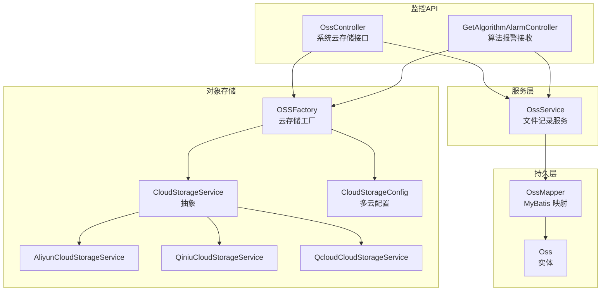
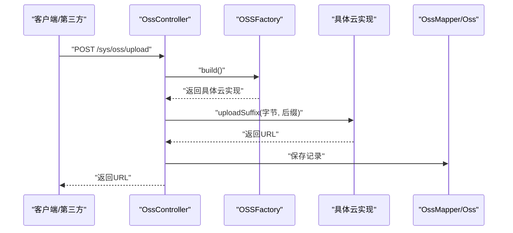
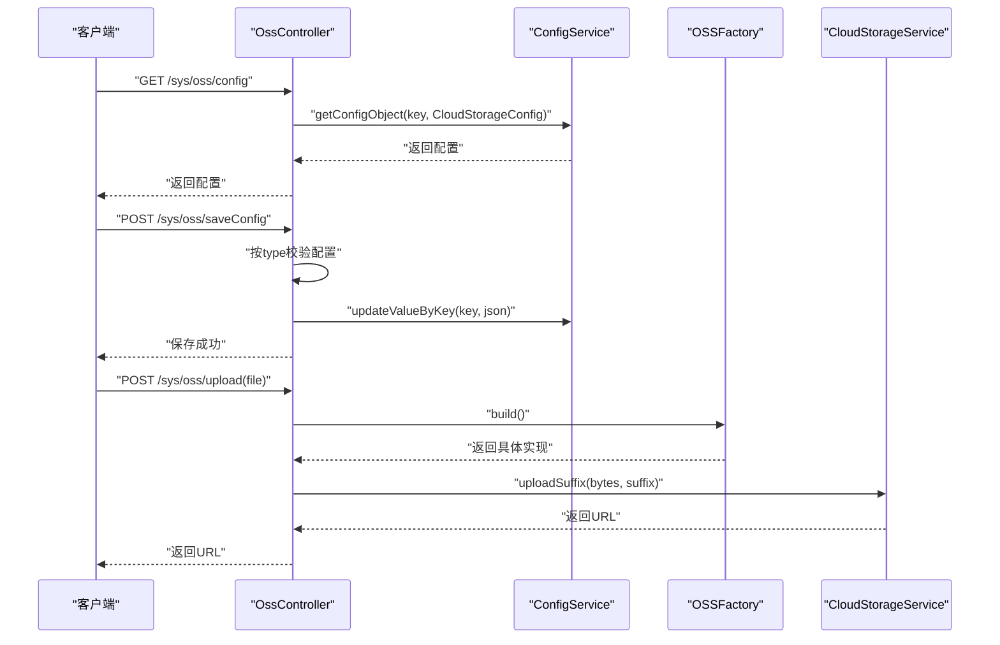
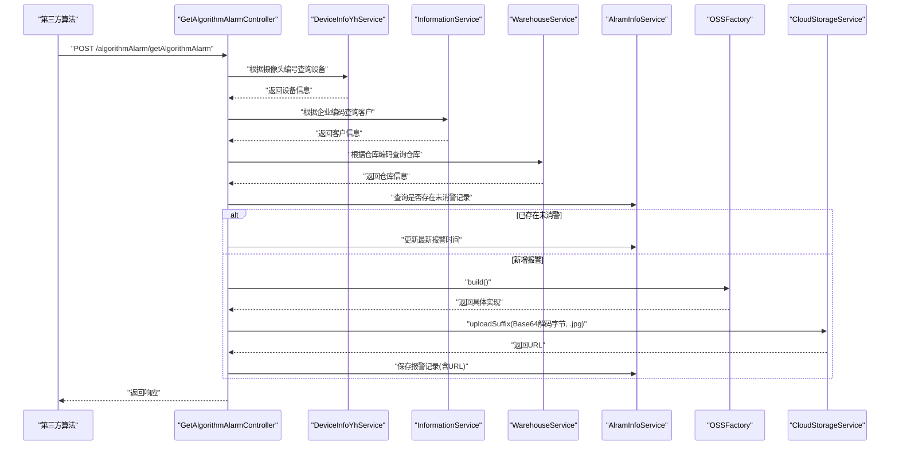
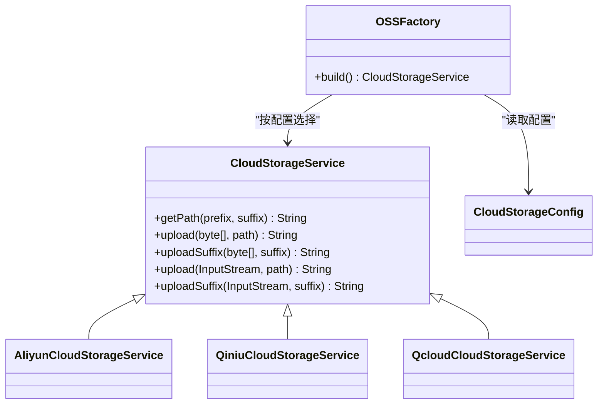
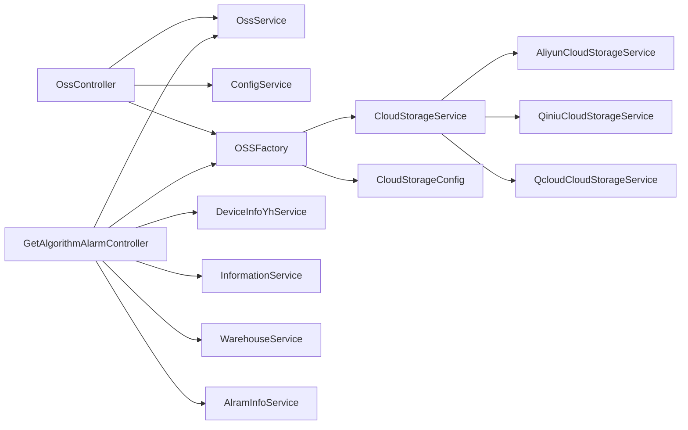
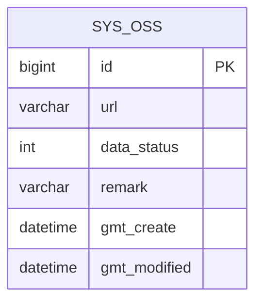

# 数据存储API

<cite>
**本文引用的文件**
- [OssController.java](file://monkey-monitor-api/src/main/java/com/monkey/general/controller/OssController.java)
- [GetAlgorithmAlarmController.java](file://monkey-monitor-api/src/main/java/com/monkey/general/python/GetAlgorithmAlarmController.java)
- [GetAlgorithmAlarm.java](file://monkey-monitor-api/src/main/java/com/monkey/general/python/GetAlgorithmAlarm.java)
- [OSSFactory.java](file://monkey-service/src/main/java/com/monkey/general/modules/oss/cloud/OSSFactory.java)
- [CloudStorageService.java](file://monkey-service/src/main/java/com/monkey/general/modules/oss/cloud/CloudStorageService.java)
- [CloudStorageConfig.java](file://monkey-service/src/main/java/com/monkey/general/modules/oss/cloud/CloudStorageConfig.java)
- [AliyunCloudStorageService.java](file://monkey-service/src/main/java/com/monkey/general/modules/oss/cloud/AliyunCloudStorageService.java)
- [QiniuCloudStorageService.java](file://monkey-service/src/main/java/com/monkey/general/modules/oss/cloud/QiniuCloudStorageService.java)
- [QcloudCloudStorageService.java](file://monkey-service/src/main/java/com/monkey/general/modules/oss/cloud/QcloudCloudStorageService.java)
- [OssService.java](file://monkey-service/src/main/java/com/monkey/general/modules/oss/service/OssService.java)
- [Oss.java](file://monkey-service/src/main/java/com/monkey/general/modules/oss/entity/Oss.java)
- [OssMapper.java](file://monkey-service/src/main/java/com/monkey/general/modules/oss/mapper/OssMapper.java)
- [OssMapper.xml](file://monkey-service/src/main/resources/mapper/oss/OssMapper.xml)
</cite>

## 目录
1. [简介](#简介)
2. [项目结构](#项目结构)
3. [核心组件](#核心组件)
4. [架构总览](#架构总览)
5. [详细组件分析](#详细组件分析)
6. [依赖分析](#依赖分析)
7. [性能考虑](#性能考虑)
8. [故障排除指南](#故障排除指南)
9. [结论](#结论)
10. [附录](#附录)

## 简介
本文件面向“数据存储API”的使用与维护，覆盖以下能力：
- 文件上传与下载（基于OSS）
- 对象存储管理（配置与切换）
- 算法数据处理（图片上传、报警信息落库、结果存储）
- 多云存储集成（阿里云、腾讯云、七牛云）
- 文件命名规则、存储路径管理与访问权限控制
- Python算法数据处理接口的调用方式与数据格式规范

## 项目结构
围绕“数据存储API”，相关模块分布如下：
- 控制层：OssController（系统云存储管理）、GetAlgorithmAlarmController（算法报警接收）
- 业务层：OssService（文件记录管理）
- 实体与映射：Oss（sys_oss 表）、OssMapper
- 存储抽象与实现：CloudStorageService 抽象类及子类（阿里云、七牛云、腾讯云）
- 工厂与配置：OSSFactory（按配置选择具体云实现）、CloudStorageConfig（多云配置）

图表来源
- [OssController.java:35-132](file://monkey-monitor-api/src/main/java/com/monkey/general/controller/OssController.java#L35-L132)
- [GetAlgorithmAlarmController.java:34-136](file://monkey-monitor-api/src/main/java/com/monkey/general/python/GetAlgorithmAlarmController.java#L34-L136)
- [OssService.java:10-18](file://monkey-service/src/main/java/com/monkey/general/modules/oss/service/OssService.java#L10-L18)
- [Oss.java:14-58](file://monkey-service/src/main/java/com/monkey/general/modules/oss/entity/Oss.java#L14-L58)
- [OssMapper.java:7-13](file://monkey-service/src/main/java/com/monkey/general/modules/oss/mapper/OssMapper.java#L7-L13)
- [OSSFactory.java:14-36](file://monkey-service/src/main/java/com/monkey/general/modules/oss/cloud/OSSFactory.java#L14-L36)
- [CloudStorageService.java:11-71](file://monkey-service/src/main/java/com/monkey/general/modules/oss/cloud/CloudStorageService.java#L11-L71)
- [AliyunCloudStorageService.java:11-56](file://monkey-service/src/main/java/com/monkey/general/modules/oss/cloud/AliyunCloudStorageService.java#L11-L56)
- [QiniuCloudStorageService.java:14-70](file://monkey-service/src/main/java/com/monkey/general/modules/oss/cloud/QiniuCloudStorageService.java#L14-L70)
- [QcloudCloudStorageService.java:19-99](file://monkey-service/src/main/java/com/monkey/general/modules/oss/cloud/QcloudCloudStorageService.java#L19-L99)
- [CloudStorageConfig.java:15-86](file://monkey-service/src/main/java/com/monkey/general/modules/oss/cloud/CloudStorageConfig.java#L15-L86)

章节来源
- [OssController.java:35-132](file://monkey-monitor-api/src/main/java/com/monkey/general/controller/OssController.java#L35-L132)
- [GetAlgorithmAlarmController.java:34-136](file://monkey-monitor-api/src/main/java/com/monkey/general/python/GetAlgorithmAlarmController.java#L34-L136)
- [OSSFactory.java:14-36](file://monkey-service/src/main/java/com/monkey/general/modules/oss/cloud/OSSFactory.java#L14-L36)
- [CloudStorageService.java:11-71](file://monkey-service/src/main/java/com/monkey/general/modules/oss/cloud/CloudStorageService.java#L11-L71)
- [CloudStorageConfig.java:15-86](file://monkey-service/src/main/java/com/monkey/general/modules/oss/cloud/CloudStorageConfig.java#L15-L86)
- [Oss.java:14-58](file://monkey-service/src/main/java/com/monkey/general/modules/oss/entity/Oss.java#L14-L58)
- [OssMapper.java:7-13](file://monkey-service/src/main/java/com/monkey/general/modules/oss/mapper/OssMapper.java#L7-L13)

## 核心组件
- 系统云存储接口（OssController）
  - 提供列表、查看配置、保存配置、上传、删除等操作
  - 支持多云配置校验与切换
- 算法报警接收接口（GetAlgorithmAlarmController）
  - 接收第三方算法推送的报警数据，解析并落库，必要时将图片上传至OSS
- 存储工厂与抽象（OSSFactory、CloudStorageService）
  - 根据配置动态选择阿里云/七牛/腾讯云实现
  - 统一上传接口（支持字节数组、输入流、带后缀上传）
- 配置模型（CloudStorageConfig）
  - 统一承载三云的域名、密钥、桶名、前缀、地域等参数
- 文件记录（Oss、OssMapper、OssService）
  - 记录上传后的URL与元信息，支持分页查询与批量删除

章节来源
- [OssController.java:46-130](file://monkey-monitor-api/src/main/java/com/monkey/general/controller/OssController.java#L46-L130)
- [GetAlgorithmAlarmController.java:48-135](file://monkey-monitor-api/src/main/java/com/monkey/general/python/GetAlgorithmAlarmController.java#L48-L135)
- [OSSFactory.java:21-34](file://monkey-service/src/main/java/com/monkey/general/modules/oss/cloud/OSSFactory.java#L21-L34)
- [CloudStorageService.java:16-71](file://monkey-service/src/main/java/com/monkey/general/modules/oss/cloud/CloudStorageService.java#L16-L71)
- [CloudStorageConfig.java:20-86](file://monkey-service/src/main/java/com/monkey/general/modules/oss/cloud/CloudStorageConfig.java#L20-L86)
- [OssService.java:10-18](file://monkey-service/src/main/java/com/monkey/general/modules/oss/service/OssService.java#L10-L18)
- [Oss.java:19-58](file://monkey-service/src/main/java/com/monkey/general/modules/oss/entity/Oss.java#L19-L58)
- [OssMapper.java:7-13](file://monkey-service/src/main/java/com/monkey/general/modules/oss/mapper/OssMapper.java#L7-L13)

## 架构总览
整体流程：前端或第三方通过API提交文件或报警数据；后端根据配置选择对应云厂商SDK进行上传；成功后将URL与元信息写入数据库。

图表来源
- [OssController.java:101-118](file://monkey-monitor-api/src/main/java/com/monkey/general/controller/OssController.java#L101-L118)
- [OSSFactory.java:21-34](file://monkey-service/src/main/java/com/monkey/general/modules/oss/cloud/OSSFactory.java#L21-L34)
- [AliyunCloudStorageService.java:32-50](file://monkey-service/src/main/java/com/monkey/general/modules/oss/cloud/AliyunCloudStorageService.java#L32-L50)
- [QiniuCloudStorageService.java:36-68](file://monkey-service/src/main/java/com/monkey/general/modules/oss/cloud/QiniuCloudStorageService.java#L36-L68)
- [QcloudCloudStorageService.java:52-97](file://monkey-service/src/main/java/com/monkey/general/modules/oss/cloud/QcloudCloudStorageService.java#L52-L97)
- [OssMapper.java:7-13](file://monkey-service/src/main/java/com/monkey/general/modules/oss/mapper/OssMapper.java#L7-L13)

## 详细组件分析

### 系统云存储接口（OssController）
- 接口清单
  - GET /sys/oss/list：分页列出文件记录
  - GET /sys/oss/config：读取当前云存储配置
  - POST /sys/oss/saveConfig：保存云存储配置（按类型校验）
  - POST /sys/oss/upload：上传文件（自动识别后缀并上传）
  - POST /sys/oss/delete：批量删除文件记录
- 关键逻辑
  - 上传时从请求中提取原始文件后缀，交由OSSFactory构建的具体实现上传
  - 上传成功后将URL写入sys_oss表
  - 配置保存时按类型分别校验（七牛、阿里云、腾讯云）

图表来源
- [OssController.java:49-118](file://monkey-monitor-api/src/main/java/com/monkey/general/controller/OssController.java#L49-L118)
- [OSSFactory.java:21-34](file://monkey-service/src/main/java/com/monkey/general/modules/oss/cloud/OSSFactory.java#L21-L34)

章节来源
- [OssController.java:49-130](file://monkey-monitor-api/src/main/java/com/monkey/general/controller/OssController.java#L49-L130)

### 算法报警接收（GetAlgorithmAlarmController）
- 接口：POST /algorithmAlarm/getAlgorithmAlarm
- 功能要点
  - 解析报警数据（包含摄像头编号、报警时间、图片帧Base64、报警类型等）
  - 根据摄像头编号关联客户与仓库信息
  - 若存在未消警记录则更新报警时间，否则新增报警记录
  - 将Base64图片转为字节并上传至OSS，回填URL到报警记录
- 数据模型
  - GetAlgorithmAlarm：定义报警字段
  - AlramInfo：报警记录（与设备、客户、仓库关联）

图表来源
- [GetAlgorithmAlarmController.java:48-135](file://monkey-monitor-api/src/main/java/com/monkey/general/python/GetAlgorithmAlarmController.java#L48-L135)
- [GetAlgorithmAlarm.java:8-15](file://monkey-monitor-api/src/main/java/com/monkey/general/python/GetAlgorithmAlarm.java#L8-L15)
- [OSSFactory.java:21-34](file://monkey-service/src/main/java/com/monkey/general/modules/oss/cloud/OSSFactory.java#L21-L34)

章节来源
- [GetAlgorithmAlarmController.java:48-135](file://monkey-monitor-api/src/main/java/com/monkey/general/python/GetAlgorithmAlarmController.java#L48-L135)
- [GetAlgorithmAlarm.java:8-15](file://monkey-monitor-api/src/main/java/com/monkey/general/python/GetAlgorithmAlarm.java#L8-L15)

### 存储抽象与多云实现
- CloudStorageService
  - 统一路径生成策略：按“日期/UUID”组织目录，可选前缀
  - 抽象方法：支持字节数组、输入流、带后缀的上传
- 具体实现
  - 阿里云：基于OSSClient，返回域名+路径
  - 七牛云：基于UploadManager与鉴权token
  - 腾讯云：基于COSClient，注意路径需以“/”开头
- 工厂选择
  - 根据配置中的type返回对应实现

图表来源
- [CloudStorageService.java:11-71](file://monkey-service/src/main/java/com/monkey/general/modules/oss/cloud/CloudStorageService.java#L11-L71)
- [AliyunCloudStorageService.java:11-56](file://monkey-service/src/main/java/com/monkey/general/modules/oss/cloud/AliyunCloudStorageService.java#L11-L56)
- [QiniuCloudStorageService.java:14-70](file://monkey-service/src/main/java/com/monkey/general/modules/oss/cloud/QiniuCloudStorageService.java#L14-L70)
- [QcloudCloudStorageService.java:19-99](file://monkey-service/src/main/java/com/monkey/general/modules/oss/cloud/QcloudCloudStorageService.java#L19-L99)
- [OSSFactory.java:14-36](file://monkey-service/src/main/java/com/monkey/general/modules/oss/cloud/OSSFactory.java#L14-L36)
- [CloudStorageConfig.java:15-86](file://monkey-service/src/main/java/com/monkey/general/modules/oss/cloud/CloudStorageConfig.java#L15-L86)

章节来源
- [CloudStorageService.java:11-71](file://monkey-service/src/main/java/com/monkey/general/modules/oss/cloud/CloudStorageService.java#L11-L71)
- [AliyunCloudStorageService.java:11-56](file://monkey-service/src/main/java/com/monkey/general/modules/oss/cloud/AliyunCloudStorageService.java#L11-L56)
- [QiniuCloudStorageService.java:14-70](file://monkey-service/src/main/java/com/monkey/general/modules/oss/cloud/QiniuCloudStorageService.java#L14-L70)
- [QcloudCloudStorageService.java:19-99](file://monkey-service/src/main/java/com/monkey/general/modules/oss/cloud/QcloudCloudStorageService.java#L19-L99)
- [OSSFactory.java:14-36](file://monkey-service/src/main/java/com/monkey/general/modules/oss/cloud/OSSFactory.java#L14-L36)
- [CloudStorageConfig.java:15-86](file://monkey-service/src/main/java/com/monkey/general/modules/oss/cloud/CloudStorageConfig.java#L15-L86)

### 文件命名规则与路径管理
- 路径生成策略
  - 默认：yyyyMMdd/UUID（如：20250403/a1b2c3d4e5f67890）
  - 可选前缀：prefix/yyyyMMdd/UUID
- 后缀处理
  - 上传接口会从原始文件名提取后缀用于URL拼接
- 注意事项
  - 腾讯云要求路径以“/”开头
  - 域名与Bucket需与实际配置一致

章节来源
- [CloudStorageService.java:26-37](file://monkey-service/src/main/java/com/monkey/general/modules/oss/cloud/CloudStorageService.java#L26-L37)
- [QcloudCloudStorageService.java:52-58](file://monkey-service/src/main/java/com/monkey/general/modules/oss/cloud/QcloudCloudStorageService.java#L52-L58)
- [OssController.java:109-110](file://monkey-monitor-api/src/main/java/com/monkey/general/controller/OssController.java#L109-L110)

### 访问权限控制
- 配置层面
  - 三云均需提供正确的密钥、域名、桶名、前缀等
  - 保存配置时按类型进行参数校验
- 运行层面
  - 上传失败会抛出自定义异常，便于定位配置问题
- 建议
  - 使用只读/受限密钥，限制Bucket与路径范围
  - 结合网关或中间件进行鉴权与限流

章节来源
- [OssController.java:77-95](file://monkey-monitor-api/src/main/java/com/monkey/general/controller/OssController.java#L77-L95)
- [AliyunCloudStorageService.java:38-44](file://monkey-service/src/main/java/com/monkey/general/modules/oss/cloud/AliyunCloudStorageService.java#L38-L44)
- [QiniuCloudStorageService.java:36-47](file://monkey-service/src/main/java/com/monkey/general/modules/oss/cloud/QiniuCloudStorageService.java#L36-L47)
- [QcloudCloudStorageService.java:69-77](file://monkey-service/src/main/java/com/monkey/general/modules/oss/cloud/QcloudCloudStorageService.java#L69-L77)

### Python算法数据处理接口
- 接口定义
  - POST /algorithmAlarm/getAlgorithmAlarm
  - 请求体：GetAlgorithmAlarm（包含摄像头编号、报警时间、图片帧Base64、报警类型等）
  - 响应：{code, message}
- 数据流转
  - 校验设备、客户、仓库信息
  - 更新或新增报警记录，并将图片上传至OSS
- 调用建议
  - 建议在第三方算法侧对Base64进行合法性校验
  - 建议对重复报警进行去重或合并策略

章节来源
- [GetAlgorithmAlarmController.java:48-135](file://monkey-monitor-api/src/main/java/com/monkey/general/python/GetAlgorithmAlarmController.java#L48-L135)
- [GetAlgorithmAlarm.java:8-15](file://monkey-monitor-api/src/main/java/com/monkey/general/python/GetAlgorithmAlarm.java#L8-L15)

## 依赖分析
- 控制器依赖
  - OssController 依赖 OssService、ConfigService、OSSFactory
  - GetAlgorithmAlarmController 依赖设备、客户、仓库、报警等服务以及OSSFactory
- 存储实现依赖
  - 各云实现依赖对应SDK（OSS、COS、Qiniu）
- 配置依赖
  - OSSFactory 依赖 ConfigService 读取统一配置键
- 数据持久化
  - OssMapper 基于 MyBatis，Oss 实体映射 sys_oss 表

图表来源
- [OssController.java:39-42](file://monkey-monitor-api/src/main/java/com/monkey/general/controller/OssController.java#L39-L42)
- [GetAlgorithmAlarmController.java:39-46](file://monkey-monitor-api/src/main/java/com/monkey/general/python/GetAlgorithmAlarmController.java#L39-L46)
- [OSSFactory.java:14-36](file://monkey-service/src/main/java/com/monkey/general/modules/oss/cloud/OSSFactory.java#L14-L36)
- [CloudStorageService.java:11-71](file://monkey-service/src/main/java/com/monkey/general/modules/oss/cloud/CloudStorageService.java#L11-L71)
- [CloudStorageConfig.java:15-86](file://monkey-service/src/main/java/com/monkey/general/modules/oss/cloud/CloudStorageConfig.java#L15-L86)

章节来源
- [OssController.java:39-42](file://monkey-monitor-api/src/main/java/com/monkey/general/controller/OssController.java#L39-L42)
- [GetAlgorithmAlarmController.java:39-46](file://monkey-monitor-api/src/main/java/com/monkey/general/python/GetAlgorithmAlarmController.java#L39-L46)
- [OSSFactory.java:14-36](file://monkey-service/src/main/java/com/monkey/general/modules/oss/cloud/OSSFactory.java#L14-L36)

## 性能考虑
- 上传策略
  - 优先使用字节数组上传，避免多次IO拷贝
  - 对大文件建议采用分片或直传策略（需结合具体云厂商SDK能力）
- 路径设计
  - 按日期分桶可提升检索与清理效率
- 并发与限流
  - 在网关或控制器层增加限流与熔断，防止突发流量导致存储服务抖动
- 缓存与CDN
  - 建议在域名层开启CDN加速，降低回源压力

## 故障排除指南
- 上传失败
  - 检查配置项是否完整且符合校验规则（域名、密钥、桶名、前缀等）
  - 查看异常日志，确认SDK调用是否成功
- 腾讯云上传路径错误
  - 确认路径以“/”开头
- URL不可访问
  - 检查域名与Bucket绑定是否正确，访问权限是否允许匿名读取
- 报警数据未入库
  - 确认摄像头编号是否匹配，客户与仓库信息是否存在
  - 检查Base64图片是否可正常解码

章节来源
- [OssController.java:77-95](file://monkey-monitor-api/src/main/java/com/monkey/general/controller/OssController.java#L77-L95)
- [QcloudCloudStorageService.java:52-58](file://monkey-service/src/main/java/com/monkey/general/modules/oss/cloud/QcloudCloudStorageService.java#L52-L58)
- [GetAlgorithmAlarmController.java:56-78](file://monkey-monitor-api/src/main/java/com/monkey/general/python/GetAlgorithmAlarmController.java#L56-L78)

## 结论
本数据存储API通过统一的工厂与抽象层实现了对阿里云、七牛云、腾讯云的无缝接入，结合清晰的路径生成规则与严格的配置校验，满足了文件上传、报警数据落库与图片存储等场景需求。建议在生产环境中完善鉴权、限流与CDN策略，并持续监控各云厂商的配额与费用。

## 附录

### API定义与调用示例（路径与说明）
- 系统云存储
  - GET /sys/oss/list：分页查询文件记录
  - GET /sys/oss/config：获取当前云存储配置
  - POST /sys/oss/saveConfig：保存云存储配置（按类型校验）
  - POST /sys/oss/upload：上传文件（multipart/form-data，字段名为file）
  - POST /sys/oss/delete：批量删除记录（JSON数组）
- 算法报警
  - POST /algorithmAlarm/getAlgorithmAlarm：接收报警数据（JSON），返回{code,message}

章节来源
- [OssController.java:49-130](file://monkey-monitor-api/src/main/java/com/monkey/general/controller/OssController.java#L49-L130)
- [GetAlgorithmAlarmController.java:48-135](file://monkey-monitor-api/src/main/java/com/monkey/general/python/GetAlgorithmAlarmController.java#L48-L135)

### 数据模型（sys_oss）

图表来源
- [Oss.java:19-58](file://monkey-service/src/main/java/com/monkey/general/modules/oss/entity/Oss.java#L19-L58)