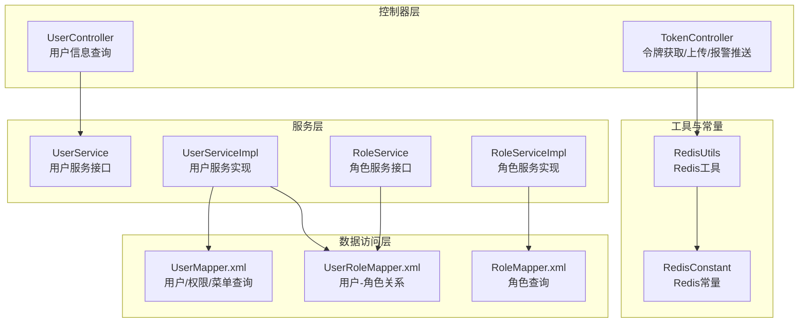
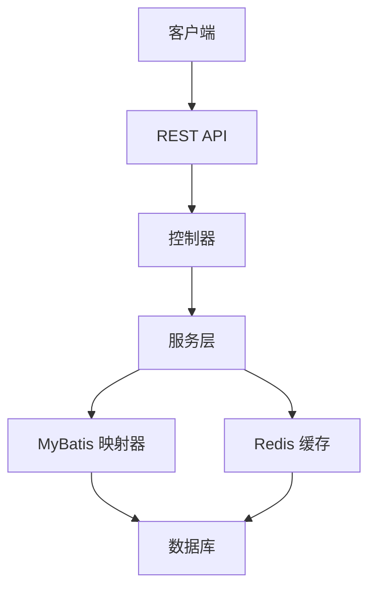
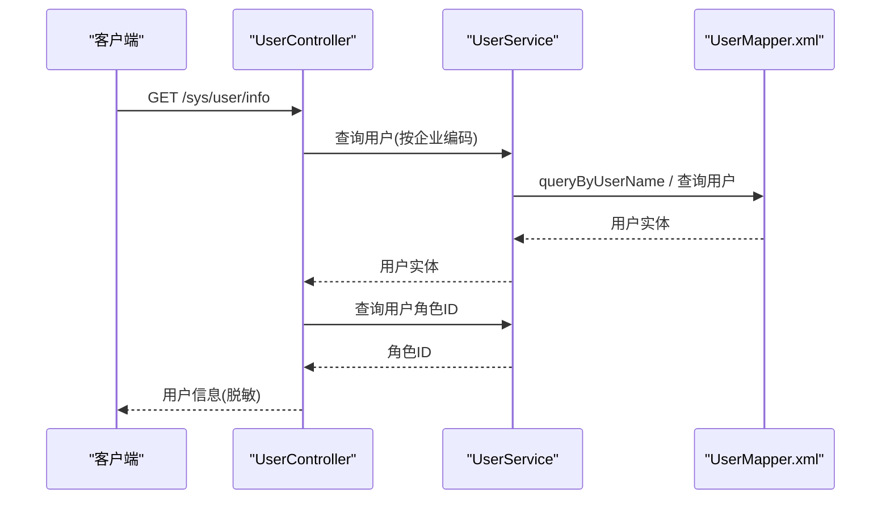
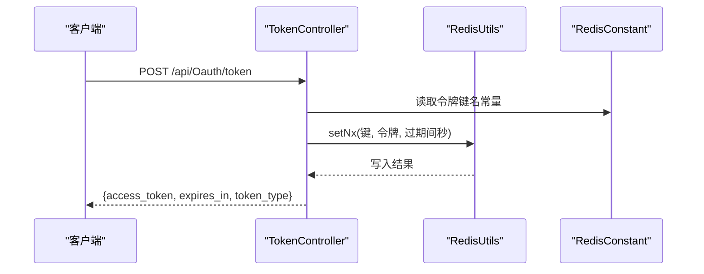
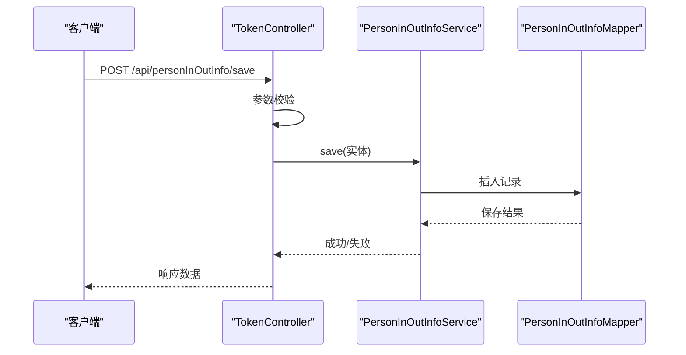
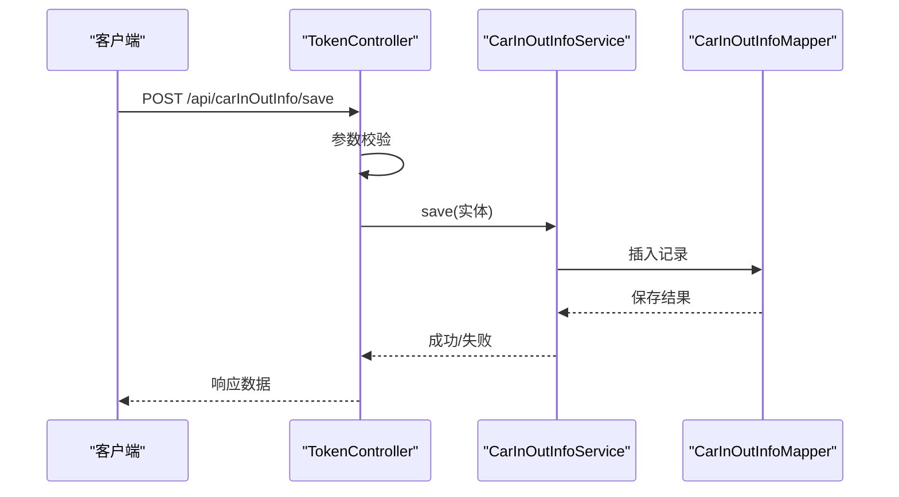
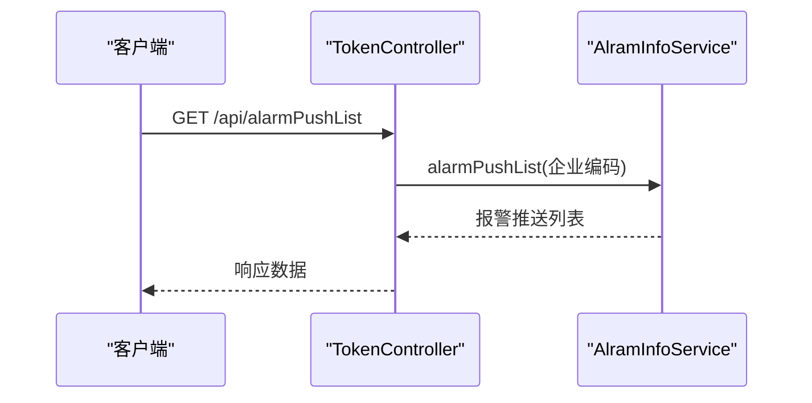
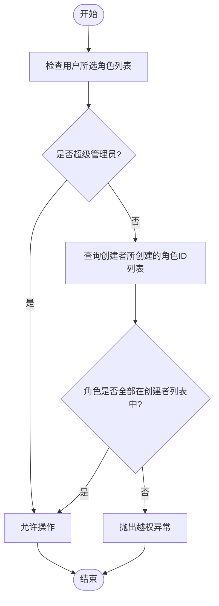
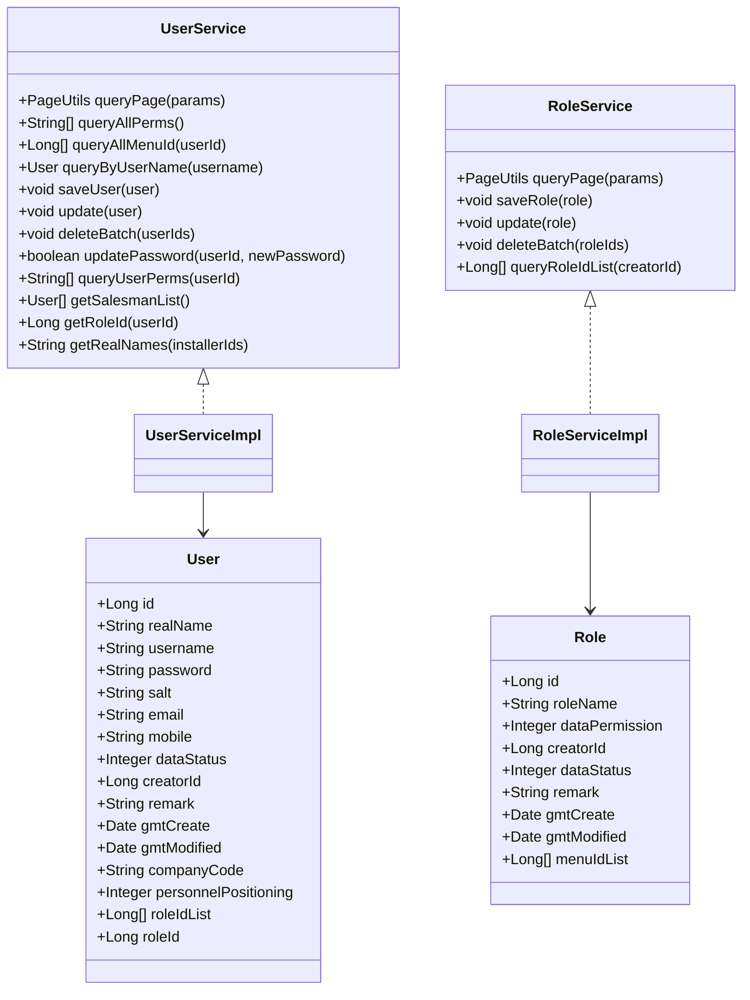
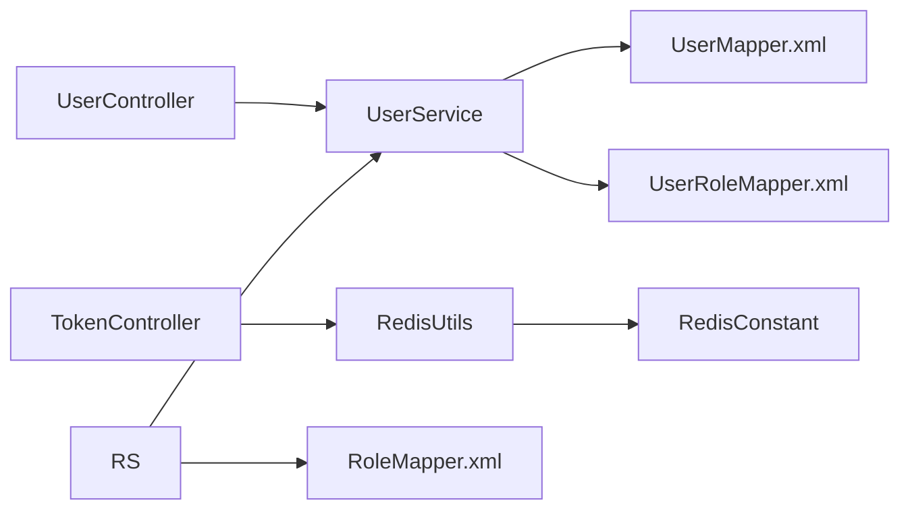

# 用户系统API

<cite>
**本文引用的文件**
- [UserController.java](file://monkey-monitor-api/src/main/java/com/monkey/general/controller/UserController.java)
- [TokenController.java](file://monkey-monitor-api/src/main/java/com/monkey/general/controller/TokenController.java)
- [User.java](file://monkey-service/src/main/java/com/monkey/general/modules/sys/entity/User.java)
- [Role.java](file://monkey-service/src/main/java/com/monkey/general/modules/sys/entity/Role.java)
- [UserService.java](file://monkey-service/src/main/java/com/monkey/general/modules/sys/service/UserService.java)
- [UserServiceImpl.java](file://monkey-service/src/main/java/com/monkey/general/modules/sys/service/impl/UserServiceImpl.java)
- [RoleService.java](file://monkey-service/src/main/java/com/monkey/general/modules/sys/service/RoleService.java)
- [RoleServiceImpl.java](file://monkey-service/src/main/java/com/monkey/general/modules/sys/service/impl/RoleServiceImpl.java)
- [UserMapper.xml](file://monkey-service/src/main/resources/mapper/sys/UserMapper.xml)
- [RoleMapper.xml](file://monkey-service/src/main/resources/mapper/sys/RoleMapper.xml)
- [UserRoleMapper.xml](file://monkey-service/src/main/resources/mapper/sys/UserRoleMapper.xml)
- [RedisUtils.java](file://monkey-service/src/main/java/com/monkey/general/common/utils/RedisUtils.java)
- [RedisConstant.java](file://monkey-common/src/main/java/com/monkey/general/common/constant/RedisConstant.java)
</cite>

## 目录
1. [简介](#简介)
2. [项目结构](#项目结构)
3. [核心组件](#核心组件)
4. [架构总览](#架构总览)
5. [详细组件分析](#详细组件分析)
6. [依赖分析](#依赖分析)
7. [性能考虑](#性能考虑)
8. [故障排查指南](#故障排查指南)
9. [结论](#结论)
10. [附录](#附录)

## 简介
本文件面向“用户系统API”的使用者与维护者，系统性梳理用户管理、权限控制、角色管理、令牌验证与刷新等核心能力。内容覆盖用户注册、登录、权限分配、角色管理、用户信息查询、用户状态管理、权限验证机制、JWT令牌生成与校验、用户操作日志与审计接口说明等。文档以接口规范与数据流为主线，辅以架构图与时序图帮助理解。

## 项目结构
用户系统API主要由以下模块构成：
- 控制器层：提供REST接口，如用户信息查询、令牌获取等
- 服务层：封装业务逻辑，如用户增删改查、角色与权限校验
- 数据访问层：MyBatis映射SQL，实现用户、角色、用户-角色、角色-菜单等查询
- 工具与常量：Redis工具与常量定义，支撑令牌与缓存

图表来源
- [UserController.java:1-51](file://monkey-monitor-api/src/main/java/com/monkey/general/controller/UserController.java#L1-L51)
- [TokenController.java:1-350](file://monkey-monitor-api/src/main/java/com/monkey/general/controller/TokenController.java#L1-L350)
- [UserServiceImpl.java:1-159](file://monkey-service/src/main/java/com/monkey/general/modules/sys/service/impl/UserServiceImpl.java#L1-L159)
- [RoleServiceImpl.java:1-116](file://monkey-service/src/main/java/com/monkey/general/modules/sys/service/impl/RoleServiceImpl.java#L1-L116)
- [UserMapper.xml:1-42](file://monkey-service/src/main/resources/mapper/sys/UserMapper.xml#L1-L42)
- [RoleMapper.xml:1-9](file://monkey-service/src/main/resources/mapper/sys/RoleMapper.xml#L1-L9)
- [UserRoleMapper.xml:1-16](file://monkey-service/src/main/resources/mapper/sys/UserRoleMapper.xml#L1-L16)
- [RedisUtils.java:1-305](file://monkey-service/src/main/java/com/monkey/general/common/utils/RedisUtils.java#L1-L305)
- [RedisConstant.java:1-35](file://monkey-common/src/main/java/com/monkey/general/common/constant/RedisConstant.java#L1-L35)

章节来源
- [UserController.java:1-51](file://monkey-monitor-api/src/main/java/com/monkey/general/controller/UserController.java#L1-L51)
- [TokenController.java:1-350](file://monkey-monitor-api/src/main/java/com/monkey/general/controller/TokenController.java#L1-L350)
- [UserServiceImpl.java:1-159](file://monkey-service/src/main/java/com/monkey/general/modules/sys/service/impl/UserServiceImpl.java#L1-L159)
- [RoleServiceImpl.java:1-116](file://monkey-service/src/main/java/com/monkey/general/modules/sys/service/impl/RoleServiceImpl.java#L1-L116)
- [UserMapper.xml:1-42](file://monkey-service/src/main/resources/mapper/sys/UserMapper.xml#L1-L42)
- [RoleMapper.xml:1-9](file://monkey-service/src/main/resources/mapper/sys/RoleMapper.xml#L1-L9)
- [UserRoleMapper.xml:1-16](file://monkey-service/src/main/resources/mapper/sys/UserRoleMapper.xml#L1-L16)
- [RedisUtils.java:1-305](file://monkey-service/src/main/java/com/monkey/general/common/utils/RedisUtils.java#L1-L305)
- [RedisConstant.java:1-35](file://monkey-common/src/main/java/com/monkey/general/common/constant/RedisConstant.java#L1-L35)

## 核心组件
- 用户实体与字段：包含主键、姓名、用户名、密码、盐、邮箱、手机号、数据状态、创建者ID、备注、创建/更新时间、企业编码、人员定位标识等
- 角色实体与字段：包含主键、角色名称、数据权限、创建者ID、数据状态、备注、创建/更新时间、菜单ID集合
- 用户服务接口与实现：提供分页查询、权限查询、菜单ID查询、按用户名查询、保存/更新用户、删除用户、修改密码、查询用户权限、销售员列表、角色ID查询、真实姓名拼接等
- 角色服务接口与实现：提供分页查询、保存/更新角色、批量删除角色、角色权限校验、查询用户创建的角色ID列表
- 用户-角色关系映射：支持查询用户的角色ID列表、批量删除角色关联
- 权限与菜单映射：支持查询用户所有权限、查询用户所有菜单ID
- Redis工具与常量：提供字符串、有序集合、哈希等操作，以及令牌键名常量

章节来源
- [User.java:1-127](file://monkey-service/src/main/java/com/monkey/general/modules/sys/entity/User.java#L1-L127)
- [Role.java:1-77](file://monkey-service/src/main/java/com/monkey/general/modules/sys/entity/Role.java#L1-L77)
- [UserService.java:1-70](file://monkey-service/src/main/java/com/monkey/general/modules/sys/service/UserService.java#L1-L70)
- [UserServiceImpl.java:1-159](file://monkey-service/src/main/java/com/monkey/general/modules/sys/service/impl/UserServiceImpl.java#L1-L159)
- [RoleService.java:1-32](file://monkey-service/src/main/java/com/monkey/general/modules/sys/service/RoleService.java#L1-L32)
- [RoleServiceImpl.java:1-116](file://monkey-service/src/main/java/com/monkey/general/modules/sys/service/impl/RoleServiceImpl.java#L1-L116)
- [UserRoleMapper.xml:1-16](file://monkey-service/src/main/resources/mapper/sys/UserRoleMapper.xml#L1-L16)
- [UserMapper.xml:1-42](file://monkey-service/src/main/resources/mapper/sys/UserMapper.xml#L1-L42)
- [RedisUtils.java:1-305](file://monkey-service/src/main/java/com/monkey/general/common/utils/RedisUtils.java#L1-L305)
- [RedisConstant.java:1-35](file://monkey-common/src/main/java/com/monkey/general/common/constant/RedisConstant.java#L1-L35)

## 架构总览
用户系统API采用典型的分层架构：
- 表现层：控制器暴露REST接口
- 领域层：服务层封装业务规则与权限校验
- 数据访问层：MyBatis映射SQL，完成用户、角色、权限、菜单等查询
- 缓存层：Redis用于令牌与临时数据存储

图表来源
- [UserController.java:1-51](file://monkey-monitor-api/src/main/java/com/monkey/general/controller/UserController.java#L1-L51)
- [TokenController.java:1-350](file://monkey-monitor-api/src/main/java/com/monkey/general/controller/TokenController.java#L1-L350)
- [UserServiceImpl.java:1-159](file://monkey-service/src/main/java/com/monkey/general/modules/sys/service/impl/UserServiceImpl.java#L1-L159)
- [RoleServiceImpl.java:1-116](file://monkey-service/src/main/java/com/monkey/general/modules/sys/service/impl/RoleServiceImpl.java#L1-L116)
- [RedisUtils.java:1-305](file://monkey-service/src/main/java/com/monkey/general/common/utils/RedisUtils.java#L1-L305)

## 详细组件分析

### 用户信息查询接口
- 接口路径：GET /sys/user/info
- 功能描述：获取当前登录用户信息，按企业编码查询用户，附加当前角色ID，过滤敏感字段
- 关键流程：
  - 读取企业编码配置
  - 查询用户并附加角色ID
  - 清理密码字段后返回

图表来源
- [UserController.java:35-49](file://monkey-monitor-api/src/main/java/com/monkey/general/controller/UserController.java#L35-L49)
- [UserMapper.xml:25-27](file://monkey-service/src/main/resources/mapper/sys/UserMapper.xml#L25-L27)
- [UserServiceImpl.java:123-132](file://monkey-service/src/main/java/com/monkey/general/modules/sys/service/impl/UserServiceImpl.java#L123-L132)

章节来源
- [UserController.java:35-49](file://monkey-monitor-api/src/main/java/com/monkey/general/controller/UserController.java#L35-L49)
- [UserMapper.xml:25-27](file://monkey-service/src/main/resources/mapper/sys/UserMapper.xml#L25-L27)
- [UserServiceImpl.java:123-132](file://monkey-service/src/main/java/com/monkey/general/modules/sys/service/impl/UserServiceImpl.java#L123-L132)

### 令牌获取与刷新接口
- 接口路径：POST /api/Oauth/token
- 功能描述：生成访问令牌，写入Redis并设置过期时间
- 关键流程：
  - 生成随机令牌与过期时间
  - 写入Redis，键名来自常量
  - 返回令牌响应

图表来源
- [TokenController.java:56-65](file://monkey-monitor-api/src/main/java/com/monkey/general/controller/TokenController.java#L56-L65)
- [RedisUtils.java:100-102](file://monkey-service/src/main/java/com/monkey/general/common/utils/RedisUtils.java#L100-L102)
- [RedisConstant.java:17](file://monkey-common/src/main/java/com/monkey/general/common/constant/RedisConstant.java#L17)

章节来源
- [TokenController.java:56-65](file://monkey-monitor-api/src/main/java/com/monkey/general/controller/TokenController.java#L56-L65)
- [RedisUtils.java:100-102](file://monkey-service/src/main/java/com/monkey/general/common/utils/RedisUtils.java#L100-L102)
- [RedisConstant.java:17](file://monkey-common/src/main/java/com/monkey/general/common/constant/RedisConstant.java#L17)

### 用户管理接口
- 接口路径：POST /api/personInOutInfo/save
- 功能描述：保存人员出入记录
- 关键流程：
  - 参数校验
  - 生成唯一ID
  - 调用服务层保存

图表来源
- [TokenController.java:273-280](file://monkey-monitor-api/src/main/java/com/monkey/general/controller/TokenController.java#L273-L280)

章节来源
- [TokenController.java:273-280](file://monkey-monitor-api/src/main/java/com/monkey/general/controller/TokenController.java#L273-L280)

### 角色管理接口
- 接口路径：POST /api/carInOutInfo/save
- 功能描述：保存车辆出入记录
- 关键流程：
  - 参数校验
  - 生成唯一ID
  - 调用服务层保存

图表来源
- [TokenController.java:286-293](file://monkey-monitor-api/src/main/java/com/monkey/general/controller/TokenController.java#L286-L293)

章节来源
- [TokenController.java:286-293](file://monkey-monitor-api/src/main/java/com/monkey/general/controller/TokenController.java#L286-L293)

### 权限与菜单查询
- 接口路径：GET /api/alarmPushList
- 功能描述：获取企业报警推送列表
- 关键流程：
  - 调用服务层查询报警推送列表
  - 返回列表数据

图表来源
- [TokenController.java:300-308](file://monkey-monitor-api/src/main/java/com/monkey/general/controller/TokenController.java#L300-L308)

章节来源
- [TokenController.java:300-308](file://monkey-monitor-api/src/main/java/com/monkey/general/controller/TokenController.java#L300-L308)

### 用户权限与角色校验流程
- 用户保存/更新时的角色越权校验
- 角色保存/更新时的权限越权校验

图表来源
- [UserServiceImpl.java:142-158](file://monkey-service/src/main/java/com/monkey/general/modules/sys/service/impl/UserServiceImpl.java#L142-L158)
- [RoleServiceImpl.java:101-114](file://monkey-service/src/main/java/com/monkey/general/modules/sys/service/impl/RoleServiceImpl.java#L101-L114)

章节来源
- [UserServiceImpl.java:142-158](file://monkey-service/src/main/java/com/monkey/general/modules/sys/service/impl/UserServiceImpl.java#L142-L158)
- [RoleServiceImpl.java:101-114](file://monkey-service/src/main/java/com/monkey/general/modules/sys/service/impl/RoleServiceImpl.java#L101-L114)

### 类关系图（用户/角色/服务）

图表来源
- [User.java:1-127](file://monkey-service/src/main/java/com/monkey/general/modules/sys/entity/User.java#L1-L127)
- [Role.java:1-77](file://monkey-service/src/main/java/com/monkey/general/modules/sys/entity/Role.java#L1-L77)
- [UserService.java:1-70](file://monkey-service/src/main/java/com/monkey/general/modules/sys/service/UserService.java#L1-L70)
- [RoleService.java:1-32](file://monkey-service/src/main/java/com/monkey/general/modules/sys/service/RoleService.java#L1-L32)
- [UserServiceImpl.java:1-159](file://monkey-service/src/main/java/com/monkey/general/modules/sys/service/impl/UserServiceImpl.java#L1-L159)
- [RoleServiceImpl.java:1-116](file://monkey-service/src/main/java/com/monkey/general/modules/sys/service/impl/RoleServiceImpl.java#L1-L116)

## 依赖分析
- 控制器依赖服务层；服务层依赖映射器与工具类
- 用户服务依赖用户-角色关系映射与角色服务
- 角色服务依赖角色-菜单关系映射与用户服务
- 令牌接口依赖Redis工具与常量

图表来源
- [UserController.java:1-51](file://monkey-monitor-api/src/main/java/com/monkey/general/controller/UserController.java#L1-L51)
- [TokenController.java:1-350](file://monkey-monitor-api/src/main/java/com/monkey/general/controller/TokenController.java#L1-L350)
- [UserServiceImpl.java:1-159](file://monkey-service/src/main/java/com/monkey/general/modules/sys/service/impl/UserServiceImpl.java#L1-L159)
- [RoleServiceImpl.java:1-116](file://monkey-service/src/main/java/com/monkey/general/modules/sys/service/impl/RoleServiceImpl.java#L1-L116)
- [UserMapper.xml:1-42](file://monkey-service/src/main/resources/mapper/sys/UserMapper.xml#L1-L42)
- [UserRoleMapper.xml:1-16](file://monkey-service/src/main/resources/mapper/sys/UserRoleMapper.xml#L1-L16)
- [RoleMapper.xml:1-9](file://monkey-service/src/main/resources/mapper/sys/RoleMapper.xml#L1-L9)
- [RedisUtils.java:1-305](file://monkey-service/src/main/java/com/monkey/general/common/utils/RedisUtils.java#L1-L305)
- [RedisConstant.java:1-35](file://monkey-common/src/main/java/com/monkey/general/common/constant/RedisConstant.java#L1-L35)

章节来源
- [UserController.java:1-51](file://monkey-monitor-api/src/main/java/com/monkey/general/controller/UserController.java#L1-L51)
- [TokenController.java:1-350](file://monkey-monitor-api/src/main/java/com/monkey/general/controller/TokenController.java#L1-L350)
- [UserServiceImpl.java:1-159](file://monkey-service/src/main/java/com/monkey/general/modules/sys/service/impl/UserServiceImpl.java#L1-L159)
- [RoleServiceImpl.java:1-116](file://monkey-service/src/main/java/com/monkey/general/modules/sys/service/impl/RoleServiceImpl.java#L1-L116)
- [UserMapper.xml:1-42](file://monkey-service/src/main/resources/mapper/sys/UserMapper.xml#L1-L42)
- [UserRoleMapper.xml:1-16](file://monkey-service/src/main/resources/mapper/sys/UserRoleMapper.xml#L1-L16)
- [RoleMapper.xml:1-9](file://monkey-service/src/main/resources/mapper/sys/RoleMapper.xml#L1-L9)
- [RedisUtils.java:1-305](file://monkey-service/src/main/java/com/monkey/general/common/utils/RedisUtils.java#L1-L305)
- [RedisConstant.java:1-35](file://monkey-common/src/main/java/com/monkey/general/common/constant/RedisConstant.java#L1-L35)

## 性能考虑
- Redis写入：令牌写入使用NX策略，避免重复覆盖，提升并发安全性
- 分页查询：用户与角色均支持分页，建议前端传入合理页码与大小
- 权限查询：通过JOIN一次性获取用户权限与菜单ID，减少多次往返
- 批量删除：角色删除时同时清理角色-菜单与用户-角色关联，降低碎片数据

## 故障排查指南
- 令牌写入失败：检查Redis连接与键名常量，确认setNx参数与过期时间
- 用户查询为空：确认企业编码配置与用户是否存在
- 越权异常：检查创建者ID与角色/权限是否超出自身范围
- 参数校验失败：确保必填字段完整且格式正确

章节来源
- [TokenController.java:56-65](file://monkey-monitor-api/src/main/java/com/monkey/general/controller/TokenController.java#L56-L65)
- [UserController.java:35-49](file://monkey-monitor-api/src/main/java/com/monkey/general/controller/UserController.java#L35-L49)
- [UserServiceImpl.java:142-158](file://monkey-service/src/main/java/com/monkey/general/modules/sys/service/impl/UserServiceImpl.java#L142-L158)
- [RoleServiceImpl.java:101-114](file://monkey-service/src/main/java/com/monkey/general/modules/sys/service/impl/RoleServiceImpl.java#L101-L114)

## 结论
本用户系统API围绕用户、角色、权限与令牌四大核心模块构建，控制器层提供简洁的REST接口，服务层实现业务规则与安全校验，数据访问层通过MyBatis完成高效查询，Redis提供令牌与缓存支持。整体设计清晰、职责明确，具备良好的扩展性与可维护性。

## 附录

### 接口清单与规范

- 用户信息查询
  - 方法：GET
  - 路径：/sys/user/info
  - 认证：需令牌
  - 响应：用户信息（脱敏）

- 令牌获取
  - 方法：POST
  - 路径：/api/Oauth/token
  - 认证：无需
  - 响应：{access_token, expires_in, token_type}
  - 缓存：Redis键名见常量

- 人员出入记录保存
  - 方法：POST
  - 路径：/api/personInOutInfo/save
  - 认证：需令牌
  - 请求体：人员出入记录对象
  - 响应：通用响应数据

- 车辆出入记录保存
  - 方法：POST
  - 路径：/api/carInOutInfo/save
  - 认证：需令牌
  - 请求体：车辆出入记录对象
  - 响应：通用响应数据

- 报警推送列表
  - 方法：GET
  - 路径：/api/alarmPushList
  - 认证：需令牌
  - 响应：报警推送列表

章节来源
- [UserController.java:35-49](file://monkey-monitor-api/src/main/java/com/monkey/general/controller/UserController.java#L35-L49)
- [TokenController.java:56-65](file://monkey-monitor-api/src/main/java/com/monkey/general/controller/TokenController.java#L56-L65)
- [TokenController.java:273-280](file://monkey-monitor-api/src/main/java/com/monkey/general/controller/TokenController.java#L273-L280)
- [TokenController.java:286-293](file://monkey-monitor-api/src/main/java/com/monkey/general/controller/TokenController.java#L286-L293)
- [TokenController.java:300-308](file://monkey-monitor-api/src/main/java/com/monkey/general/controller/TokenController.java#L300-L308)