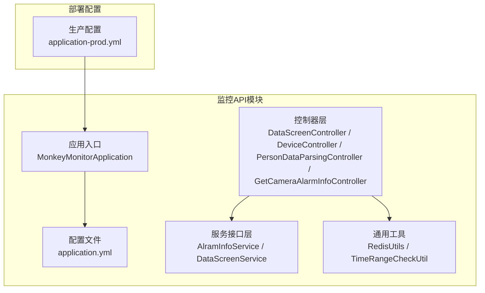
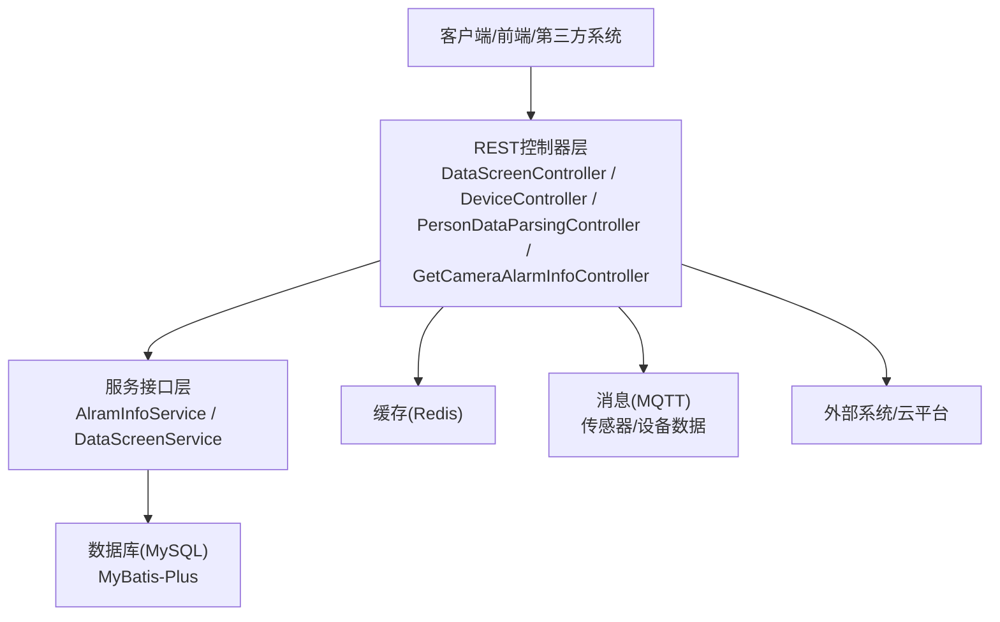
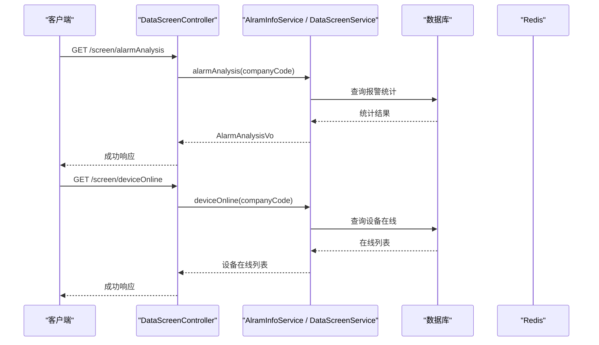
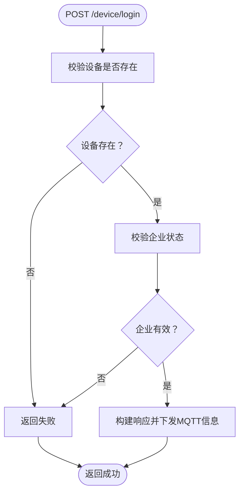
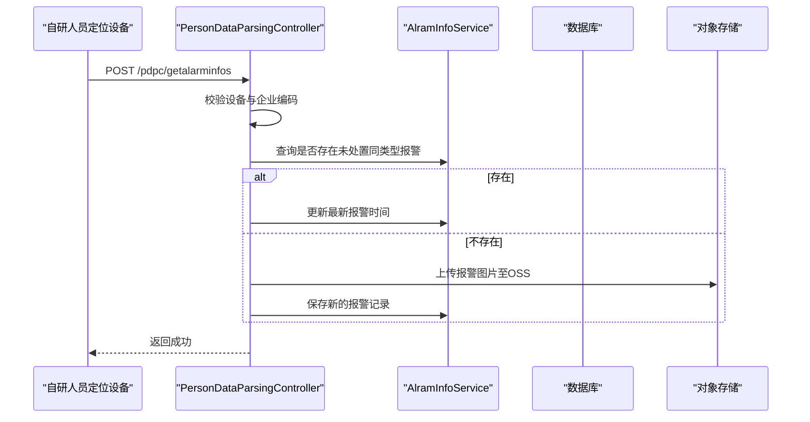
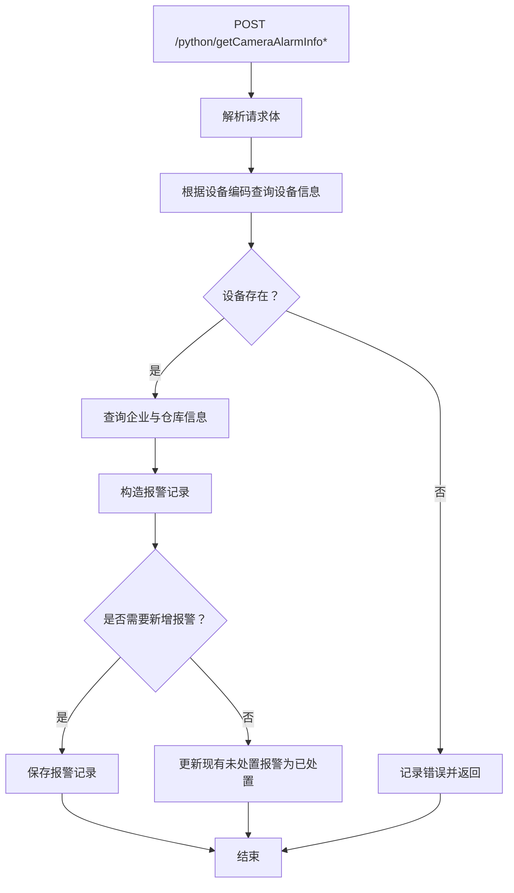
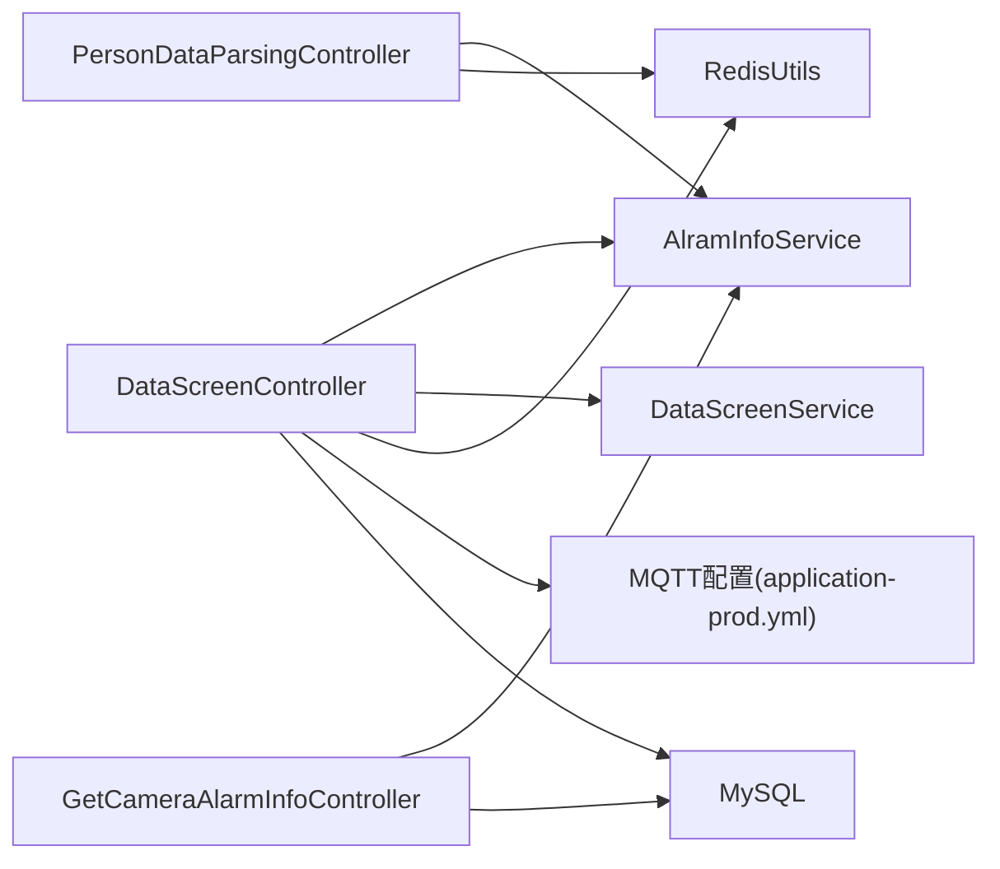

# 监控查询API

<cite>
**本文引用的文件**
- [MonkeyMonitorApplication.java](file://monkey-monitor-api/src/main/java/com/monkey/general/MonkeyMonitorApplication.java)
- [application.yml](file://monkey-monitor-api/src/main/resources/application.yml)
- [DataScreenController.java](file://monkey-monitor-api/src/main/java/com/monkey/general/controller/DataScreenController.java)
- [DeviceController.java](file://monkey-monitor-api/src/main/java/com/monkey/general/controller/DeviceController.java)
- [PersonDataParsingController.java](file://monkey-monitor-api/src/main/java/com/monkey/general/person/PersonDataParsingController.java)
- [GetCameraAlarmInfoController.java](file://monkey-monitor-api/src/main/java/com/monkey/general/python/GetCameraAlarmInfoController.java)
- [TimeRangeCheckUtil.java](file://monkey-monitor-api/src/main/java/com/monkey/general/config/TimeRangeCheckUtil.java)
- [application-prod.yml](file://deploy/config/monitor-api/application-prod.yml)
- [DataScreenService.java](file://monkey-monitor/src/main/java/com/monkey/general/datascreen/service/DataScreenService.java)
- [AlramInfoService.java](file://monkey-monitor/src/main/java/com/monkey/general/modules/em/service/AlramInfoService.java)
- [RedisUtils.java](file://monkey-service/src/main/java/com/monkey/general/common/utils/RedisUtils.java)
</cite>

## 目录
1. [简介](#简介)
2. [项目结构](#项目结构)
3. [核心组件](#核心组件)
4. [架构总览](#架构总览)
5. [详细组件分析](#详细组件分析)
6. [依赖分析](#依赖分析)
7. [性能考虑](#性能考虑)
8. [故障排查指南](#故障排查指南)
9. [结论](#结论)
10. [附录](#附录)

## 简介
本文件面向监控查询API，系统性梳理实时监控数据查询、历史数据检索、监控大屏展示、人员数据解析等接口。重点覆盖以下能力：
- 实时监控：温度、湿度、液位等环境监测数据的聚合查询
- 历史检索：报警数据、出入场记录、设备运行状态的历史查询
- 屏幕展示：安全天数、报警分析、车辆/人员统计、库存统计、视频播放、设备在线情况、报警推送列表等
- 人员数据：自研人员定位设备信息、卡牌信息、核定人员信息、报警接收与展示
- 视频监控：基于海康SDK的视频URL生成与播放
- 高级查询：时间范围控制、区域筛选、设备类型过滤等
- 缓存策略与性能优化：Redis工具类、MQTT配置、定时任务与异步处理

## 项目结构
监控查询API位于独立模块，核心入口为Spring Boot应用，控制器层提供REST接口，服务层负责业务逻辑与数据访问。

图表来源
- [MonkeyMonitorApplication.java:1-20](file://monkey-monitor-api/src/main/java/com/monkey/general/MonkeyMonitorApplication.java#L1-L20)
- [application.yml:1-40](file://monkey-monitor-api/src/main/resources/application.yml#L1-L40)
- [DataScreenController.java:1-365](file://monkey-monitor-api/src/main/java/com/monkey/general/controller/DataScreenController.java#L1-L365)
- [DeviceController.java:1-266](file://monkey-monitor-api/src/main/java/com/monkey/general/controller/DeviceController.java#L1-L266)
- [PersonDataParsingController.java:1-294](file://monkey-monitor-api/src/main/java/com/monkey/general/person/PersonDataParsingController.java#L1-L294)
- [GetCameraAlarmInfoController.java:1-165](file://monkey-monitor-api/src/main/java/com/monkey/general/python/GetCameraAlarmInfoController.java#L1-L165)
- [AlramInfoService.java:1-49](file://monkey-monitor/src/main/java/com/monkey/general/modules/em/service/AlramInfoService.java#L1-L49)
- [DataScreenService.java:1-21](file://monkey-monitor/src/main/java/com/monkey/general/datascreen/service/DataScreenService.java#L1-L21)
- [RedisUtils.java:1-305](file://monkey-service/src/main/java/com/monkey/general/common/utils/RedisUtils.java#L1-L305)
- [TimeRangeCheckUtil.java:1-55](file://monkey-monitor-api/src/main/java/com/monkey/general/config/TimeRangeCheckUtil.java#L1-L55)
- [application-prod.yml:1-203](file://deploy/config/monitor-api/application-prod.yml#L1-L203)

章节来源
- [MonkeyMonitorApplication.java:1-20](file://monkey-monitor-api/src/main/java/com/monkey/general/MonkeyMonitorApplication.java#L1-L20)
- [application.yml:1-40](file://monkey-monitor-api/src/main/resources/application.yml#L1-L40)
- [application-prod.yml:1-203](file://deploy/config/monitor-api/application-prod.yml#L1-L203)

## 核心组件
- 应用入口与启动
  - 应用入口类负责禁用Headless模式，以便在集成大华SDK场景下创建窗口
  - 参考路径：[MonkeyMonitorApplication.java:11-17](file://monkey-monitor-api/src/main/java/com/monkey/general/MonkeyMonitorApplication.java#L11-L17)
- 配置管理
  - 本地开发配置：端口、Jackson时区与日期格式、MyBatis-Plus实体扫描与逻辑删除配置
  - 生产配置：数据库连接、Redis连接、MQTT接入、传感器数据主题、Swagger开关、文件上传地址等
  - 参考路径：
    - [application.yml:1-40](file://monkey-monitor-api/src/main/resources/application.yml#L1-L40)
    - [application-prod.yml:2-55](file://deploy/config/monitor-api/application-prod.yml#L2-L55)
- 控制器层
  - 数据大屏控制器：提供安全天数、报警分析、车辆/人员/库存统计、视频播放、设备在线、报警推送列表等接口
    - 参考路径：[DataScreenController.java:95-361](file://monkey-monitor-api/src/main/java/com/monkey/general/controller/DataScreenController.java#L95-L361)
  - 设备控制器：提供设备登录、人员同步、通知回调等接口
    - 参考路径：[DeviceController.java:59-265](file://monkey-monitor-api/src/main/java/com/monkey/general/controller/DeviceController.java#L59-L265)
  - 人员数据解析控制器：提供人员定位设备信息、卡牌信息、核定人员信息、报警接收与展示等接口
    - 参考路径：[PersonDataParsingController.java:60-291](file://monkey-monitor-api/src/main/java/com/monkey/general/person/PersonDataParsingController.java#L60-L291)
  - AI算法报警控制器：接收第三方算法推送的报警信息并入库
    - 参考路径：[GetCameraAlarmInfoController.java:52-163](file://monkey-monitor-api/src/main/java/com/monkey/general/python/GetCameraAlarmInfoController.java#L52-L163)
- 服务接口层
  - 报警信息服务接口：分页查询、报警分析、视频监控未处置列表、报警推送列表等
    - 参考路径：[AlramInfoService.java:19-47](file://monkey-monitor/src/main/java/com/monkey/general/modules/em/service/AlramInfoService.java#L19-L47)
  - 数据大屏服务接口：湿度、温度、液位数据统计
    - 参考路径：[DataScreenService.java:9-20](file://monkey-monitor/src/main/java/com/monkey/general/datascreen/service/DataScreenService.java#L9-L20)
- 通用工具
  - Redis工具类：封装常用KV、Hash、ZSet操作及过期控制
    - 参考路径：[RedisUtils.java:32-87](file://monkey-service/src/main/java/com/monkey/general/common/utils/RedisUtils.java#L32-L87)
  - 时间范围检查工具：判断当前时间是否在配置的时间段内
    - 参考路径：[TimeRangeCheckUtil.java:20-52](file://monkey-monitor-api/src/main/java/com/monkey/general/config/TimeRangeCheckUtil.java#L20-L52)

章节来源
- [DataScreenController.java:1-365](file://monkey-monitor-api/src/main/java/com/monkey/general/controller/DataScreenController.java#L1-L365)
- [DeviceController.java:1-266](file://monkey-monitor-api/src/main/java/com/monkey/general/controller/DeviceController.java#L1-L266)
- [PersonDataParsingController.java:1-294](file://monkey-monitor-api/src/main/java/com/monkey/general/person/PersonDataParsingController.java#L1-L294)
- [GetCameraAlarmInfoController.java:1-165](file://monkey-monitor-api/src/main/java/com/monkey/general/python/GetCameraAlarmInfoController.java#L1-L165)
- [AlramInfoService.java:1-49](file://monkey-monitor/src/main/java/com/monkey/general/modules/em/service/AlramInfoService.java#L1-L49)
- [DataScreenService.java:1-21](file://monkey-monitor/src/main/java/com/monkey/general/datascreen/service/DataScreenService.java#L1-L21)
- [RedisUtils.java:1-305](file://monkey-service/src/main/java/com/monkey/general/common/utils/RedisUtils.java#L1-L305)
- [TimeRangeCheckUtil.java:1-55](file://monkey-monitor-api/src/main/java/com/monkey/general/config/TimeRangeCheckUtil.java#L1-L55)

## 架构总览
监控查询API采用典型的分层架构：控制器层负责HTTP请求与响应封装，服务层承载业务逻辑，持久层由MyBatis-Plus与数据库交互，缓存层使用Redis，消息层通过MQTT接入传感器与设备数据。

图表来源
- [DataScreenController.java:46-361](file://monkey-monitor-api/src/main/java/com/monkey/general/controller/DataScreenController.java#L46-L361)
- [DeviceController.java:35-265](file://monkey-monitor-api/src/main/java/com/monkey/general/controller/DeviceController.java#L35-L265)
- [PersonDataParsingController.java:36-291](file://monkey-monitor-api/src/main/java/com/monkey/general/person/PersonDataParsingController.java#L36-L291)
- [GetCameraAlarmInfoController.java:37-163](file://monkey-monitor-api/src/main/java/com/monkey/general/python/GetCameraAlarmInfoController.java#L37-L163)
- [AlramInfoService.java:19-47](file://monkey-monitor/src/main/java/com/monkey/general/modules/em/service/AlramInfoService.java#L19-L47)
- [DataScreenService.java:9-20](file://monkey-monitor/src/main/java/com/monkey/general/datascreen/service/DataScreenService.java#L9-L20)
- [application-prod.yml:14-48](file://deploy/config/monitor-api/application-prod.yml#L14-L48)

## 详细组件分析

### 数据大屏接口
- 接口概览
  - 安全生产天数：按企业创建时间计算安全天数
    - 路径：[DataScreenController.java:95-105](file://monkey-monitor-api/src/main/java/com/monkey/general/controller/DataScreenController.java#L95-L105)
  - 告警分析：统计今日与累计告警数量，支持按类型汇总
    - 路径：[DataScreenController.java:110-131](file://monkey-monitor-api/src/main/java/com/monkey/general/controller/DataScreenController.java#L110-L131)
  - 车辆统计：按类型统计进出车次数
    - 路径：[DataScreenController.java:137-143](file://monkey-monitor-api/src/main/java/com/monkey/general/controller/DataScreenController.java#L137-L143)
  - 人员统计：按状态统计人员数量
    - 路径：[DataScreenController.java:147-155](file://monkey-monitor-api/src/main/java/com/monkey/general/controller/DataScreenController.java#L147-L155)
  - 库存统计：按仓库/库房统计药量与总量
    - 路径：[DataScreenController.java:159-185](file://monkey-monitor-api/src/main/java/com/monkey/general/controller/DataScreenController.java#L159-L185)
  - 视频监控未处置：按企业筛选未处置报警对应的视频监控数据
    - 路径：[DataScreenController.java:189-196](file://monkey-monitor-api/src/main/java/com/monkey/general/controller/DataScreenController.java#L189-L196)
  - 实时监控数据：湿度、温度、液位统计
    - 路径：
      - [DataScreenController.java:201-206](file://monkey-monitor-api/src/main/java/com/monkey/general/controller/DataScreenController.java#L201-L206)
      - [DataScreenController.java:211-216](file://monkey-monitor-api/src/main/java/com/monkey/general/controller/DataScreenController.java#L211-L216)
      - [DataScreenController.java:221-226](file://monkey-monitor-api/src/main/java/com/monkey/general/controller/DataScreenController.java#L221-L226)
  - 设备在线情况：温湿度传感器在线率、摄像头在线列表
    - 路径：
      - [DataScreenController.java:231-273](file://monkey-monitor-api/src/main/java/com/monkey/general/controller/DataScreenController.java#L231-L273)
      - [DataScreenController.java:279-284](file://monkey-monitor-api/src/main/java/com/monkey/general/controller/DataScreenController.java#L279-L284)
  - 视频播放：根据企业摄像头生成播放URL
    - 路径：[DataScreenController.java:289-314](file://monkey-monitor-api/src/main/java/com/monkey/general/controller/DataScreenController.java#L289-L314)
  - 报警推送列表：在配置的时间范围内返回报警推送列表
    - 路径：[DataScreenController.java:318-350](file://monkey-monitor-api/src/main/java/com/monkey/general/controller/DataScreenController.java#L318-L350)
  - 未处置报警列表：按企业筛选未处置报警
    - 路径：[DataScreenController.java:353-361](file://monkey-monitor-api/src/main/java/com/monkey/general/controller/DataScreenController.java#L353-L361)

图表来源
- [DataScreenController.java:110-131](file://monkey-monitor-api/src/main/java/com/monkey/general/controller/DataScreenController.java#L110-L131)
- [DataScreenController.java:279-284](file://monkey-monitor-api/src/main/java/com/monkey/general/controller/DataScreenController.java#L279-L284)
- [AlramInfoService.java:28-47](file://monkey-monitor/src/main/java/com/monkey/general/modules/em/service/AlramInfoService.java#L28-L47)

章节来源
- [DataScreenController.java:95-361](file://monkey-monitor-api/src/main/java/com/monkey/general/controller/DataScreenController.java#L95-L361)
- [AlramInfoService.java:19-47](file://monkey-monitor/src/main/java/com/monkey/general/modules/em/service/AlramInfoService.java#L19-L47)

### 设备接口（擎天）
- 接口概览
  - 设备登录：校验设备与企业状态，下发MQTT接入信息
    - 路径：[DeviceController.java:59-104](file://monkey-monitor-api/src/main/java/com/monkey/general/controller/DeviceController.java#L59-L104)
  - 同步人员信息：校验企业状态与人员存在性，组装人员数据
    - 路径：[DeviceController.java:107-161](file://monkey-monitor-api/src/main/java/com/monkey/general/controller/DeviceController.java#L107-L161)
  - 通知回调：校验企业状态后交由服务处理
    - 路径：[DeviceController.java:169-196](file://monkey-monitor-api/src/main/java/com/monkey/general/controller/DeviceController.java#L169-L196)
  - 获取全部人员：写入Redis缓存，便于设备侧拉取
    - 路径：[DeviceController.java:224-265](file://monkey-monitor-api/src/main/java/com/monkey/general/controller/DeviceController.java#L224-L265)

图表来源
- [DeviceController.java:59-104](file://monkey-monitor-api/src/main/java/com/monkey/general/controller/DeviceController.java#L59-L104)

章节来源
- [DeviceController.java:1-266](file://monkey-monitor-api/src/main/java/com/monkey/general/controller/DeviceController.java#L1-L266)

### 人员数据解析接口
- 接口概览
  - 获取三方接入设备信息：按企业编码查询门禁设备
    - 路径：[PersonDataParsingController.java:60-72](file://monkey-monitor-api/src/main/java/com/monkey/general/person/PersonDataParsingController.java#L60-L72)
  - 获取人员卡牌信息：按企业编码查询卡牌设备并关联人员定位数据
    - 路径：[PersonDataParsingController.java:79-106](file://monkey-monitor-api/src/main/java/com/monkey/general/person/PersonDataParsingController.java#L79-L106)
  - 获取核定人员信息：按仓库/库房编号与企业编码查询核定人数
    - 路径：[PersonDataParsingController.java:115-153](file://monkey-monitor-api/src/main/java/com/monkey/general/person/PersonDataParsingController.java#L115-L153)
  - 接收报警信息：解析自研人员定位报警，去重与更新，必要时入库
    - 路径：[PersonDataParsingController.java:170-264](file://monkey-monitor-api/src/main/java/com/monkey/general/person/PersonDataParsingController.java#L170-L264)
  - 展示未处置报警：按企业编码查询未处置报警
    - 路径：[PersonDataParsingController.java:279-291](file://monkey-monitor-api/src/main/java/com/monkey/general/person/PersonDataParsingController.java#L279-L291)

图表来源
- [PersonDataParsingController.java:170-264](file://monkey-monitor-api/src/main/java/com/monkey/general/person/PersonDataParsingController.java#L170-L264)
- [AlramInfoService.java:46-47](file://monkey-monitor/src/main/java/com/monkey/general/modules/em/service/AlramInfoService.java#L46-L47)

章节来源
- [PersonDataParsingController.java:1-294](file://monkey-monitor-api/src/main/java/com/monkey/general/person/PersonDataParsingController.java#L1-L294)
- [AlramInfoService.java:19-47](file://monkey-monitor/src/main/java/com/monkey/general/modules/em/service/AlramInfoService.java#L19-L47)

### AI算法报警接口
- 接口概览
  - 接收报警信息：根据设备编码查询企业与仓库信息，构造报警记录
    - 路径：
      - [GetCameraAlarmInfoController.java:52-56](file://monkey-monitor-api/src/main/java/com/monkey/general/python/GetCameraAlarmInfoController.java#L52-L56)
      - [GetCameraAlarmInfoController.java:59-63](file://monkey-monitor-api/src/main/java/com/monkey/general/python/GetCameraAlarmInfoController.java#L59-L63)
  - 处理报警类型：根据请求体字段设置报警类型，若未消警则入库，已消警则更新状态
    - 路径：[GetCameraAlarmInfoController.java:66-163](file://monkey-monitor-api/src/main/java/com/monkey/general/python/GetCameraAlarmInfoController.java#L66-L163)

图表来源
- [GetCameraAlarmInfoController.java:66-163](file://monkey-monitor-api/src/main/java/com/monkey/general/python/GetCameraAlarmInfoController.java#L66-L163)

章节来源
- [GetCameraAlarmInfoController.java:1-165](file://monkey-monitor-api/src/main/java/com/monkey/general/python/GetCameraAlarmInfoController.java#L1-L165)

### 视频监控接口
- 接口概览
  - 视频播放：根据企业摄像头生成播放URL
    - 路径：[DataScreenController.java:289-314](file://monkey-monitor-api/src/main/java/com/monkey/general/controller/DataScreenController.java#L289-L314)
  - 说明：接口通过摄像头编号与通道号、清晰度参数调用海康工具类生成播放URL

章节来源
- [DataScreenController.java:289-314](file://monkey-monitor-api/src/main/java/com/monkey/general/controller/DataScreenController.java#L289-L314)

### 高级查询与过滤
- 时间范围查询
  - 报警推送列表支持在配置的时间范围内才返回数据
  - 工具类提供时间范围判断逻辑
  - 路径：
    - [DataScreenController.java:318-350](file://monkey-monitor-api/src/main/java/com/monkey/general/controller/DataScreenController.java#L318-L350)
    - [TimeRangeCheckUtil.java:20-52](file://monkey-monitor-api/src/main/java/com/monkey/general/config/TimeRangeCheckUtil.java#L20-L52)
- 区域筛选
  - 通过企业编码(company_code)进行区域隔离
  - 路径：各控制器均使用公司编码参数进行过滤
- 设备类型过滤
  - 温湿度传感器在线统计按设备类型过滤
  - 路径：[DataScreenController.java:234-239](file://monkey-monitor-api/src/main/java/com/monkey/general/controller/DataScreenController.java#L234-L239)

章节来源
- [DataScreenController.java:318-350](file://monkey-monitor-api/src/main/java/com/monkey/general/controller/DataScreenController.java#L318-L350)
- [TimeRangeCheckUtil.java:1-55](file://monkey-monitor-api/src/main/java/com/monkey/general/config/TimeRangeCheckUtil.java#L1-L55)

## 依赖分析
- 组件耦合
  - 控制器依赖服务接口，服务接口依赖数据库与缓存
  - 大屏控制器同时依赖报警、设备、温度、湿度、信息配置等多个服务
- 外部依赖
  - 数据库：MySQL（MyBatis-Plus）
  - 缓存：Redis（通过RedisUtils）
  - 消息：MQTT（传感器与设备数据接入）
  - 文件存储：OSS（报警图片上传）

图表来源
- [DataScreenController.java:46-361](file://monkey-monitor-api/src/main/java/com/monkey/general/controller/DataScreenController.java#L46-L361)
- [PersonDataParsingController.java:36-291](file://monkey-monitor-api/src/main/java/com/monkey/general/person/PersonDataParsingController.java#L36-L291)
- [GetCameraAlarmInfoController.java:37-163](file://monkey-monitor-api/src/main/java/com/monkey/general/python/GetCameraAlarmInfoController.java#L37-L163)
- [AlramInfoService.java:19-47](file://monkey-monitor/src/main/java/com/monkey/general/modules/em/service/AlramInfoService.java#L19-L47)
- [RedisUtils.java:32-87](file://monkey-service/src/main/java/com/monkey/general/common/utils/RedisUtils.java#L32-L87)
- [application-prod.yml:14-48](file://deploy/config/monitor-api/application-prod.yml#L14-L48)

章节来源
- [application-prod.yml:1-203](file://deploy/config/monitor-api/application-prod.yml#L1-L203)

## 性能考虑
- 缓存策略
  - Redis工具类提供KV、Hash、ZSet等操作，支持过期控制与批量获取
  - 设备人员接口使用Redis缓存设备侧拉取数据
  - 参考路径：[RedisUtils.java:32-87](file://monkey-service/src/main/java/com/monkey/general/common/utils/RedisUtils.java#L32-L87)，[DeviceController.java:244-257](file://monkey-monitor-api/src/main/java/com/monkey/general/controller/DeviceController.java#L244-L257)
- 数据库优化
  - MyBatis-Plus配置启用驼峰映射、逻辑删除、SQL打印开关
  - 参考路径：[application.yml:15-39](file://monkey-monitor-api/src/main/resources/application.yml#L15-L39)
- 消息接入
  - MQTT配置集中管理，支持传感器与设备数据接入
  - 参考路径：[application-prod.yml:30-48](file://deploy/config/monitor-api/application-prod.yml#L30-L48)
- 异步与定时
  - XXL-Job执行器配置，支持定时任务与异步处理
  - 参考路径：[application-prod.yml:116-135](file://deploy/config/monitor-api/application-prod.yml#L116-L135)

## 故障排查指南
- 设备登录失败
  - 检查设备是否存在与企业状态是否有效
  - 参考路径：[DeviceController.java:64-83](file://monkey-monitor-api/src/main/java/com/monkey/general/controller/DeviceController.java#L64-L83)
- 人员同步失败
  - 校验人员ID是否存在于企业下
  - 参考路径：[DeviceController.java:136-145](file://monkey-monitor-api/src/main/java/com/monk/general/controller/DeviceController.java#L136-L145)
- 报警推送列表为空
  - 检查配置时间范围与当前时间是否匹配
  - 参考路径：[DataScreenController.java:326-347](file://monkey-monitor-api/src/main/java/com/monkey/general/controller/DataScreenController.java#L326-L347)，[TimeRangeCheckUtil.java:20-52](file://monkey-monitor-api/src/main/java/com/monkey/general/config/TimeRangeCheckUtil.java#L20-L52)
- 报警未处置
  - 检查报警状态与类型过滤条件
  - 参考路径：[DataScreenController.java:356-361](file://monkey-monitor-api/src/main/java/com/monkey/general/controller/DataScreenController.java#L356-L361)

章节来源
- [DeviceController.java:64-83](file://monkey-monitor-api/src/main/java/com/monkey/general/controller/DeviceController.java#L64-L83)
- [DeviceController.java:136-145](file://monkey-monitor-api/src/main/java/com/monkey/general/controller/DeviceController.java#L136-L145)
- [DataScreenController.java:326-347](file://monkey-monitor-api/src/main/java/com/monkey/general/controller/DataScreenController.java#L326-L347)
- [TimeRangeCheckUtil.java:20-52](file://monkey-monitor-api/src/main/java/com/monkey/general/config/TimeRangeCheckUtil.java#L20-L52)
- [DataScreenController.java:356-361](file://monkey-monitor-api/src/main/java/com/monkey/general/controller/DataScreenController.java#L356-L361)

## 结论
监控查询API围绕“数据大屏、设备接入、人员定位、AI报警”四大场景构建，提供统一的REST接口与完善的缓存、消息与定时机制。通过企业编码实现区域隔离，结合时间范围与设备类型过滤满足高级查询需求。建议在生产环境中合理配置Redis与MQTT参数，利用缓存与异步任务提升吞吐与稳定性。

## 附录
- 配置要点
  - 数据库连接、Redis连接、MQTT接入、传感器主题、Swagger开关、文件上传地址等
  - 参考路径：[application-prod.yml:2-107](file://deploy/config/monitor-api/application-prod.yml#L2-L107)
- 应用启动
  - 禁用Headless模式以支持集成SDK场景
  - 参考路径：[MonkeyMonitorApplication.java:14-16](file://monkey-monitor-api/src/main/java/com/monkey/general/MonkeyMonitorApplication.java#L14-L16)