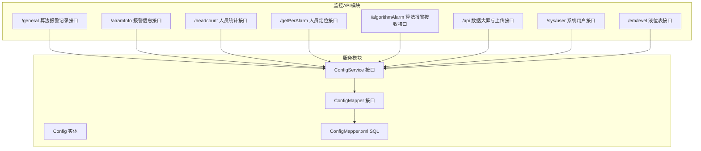
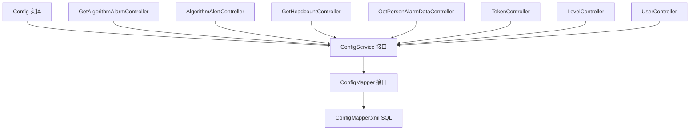
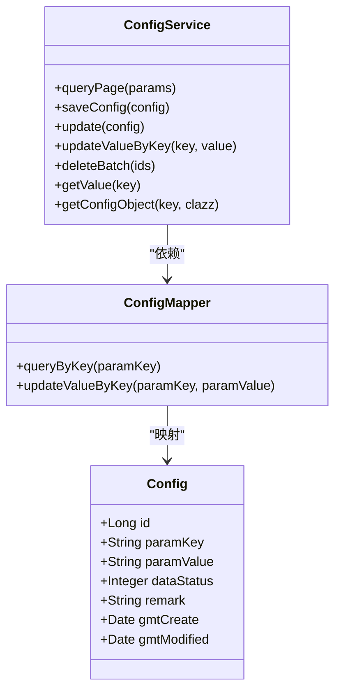
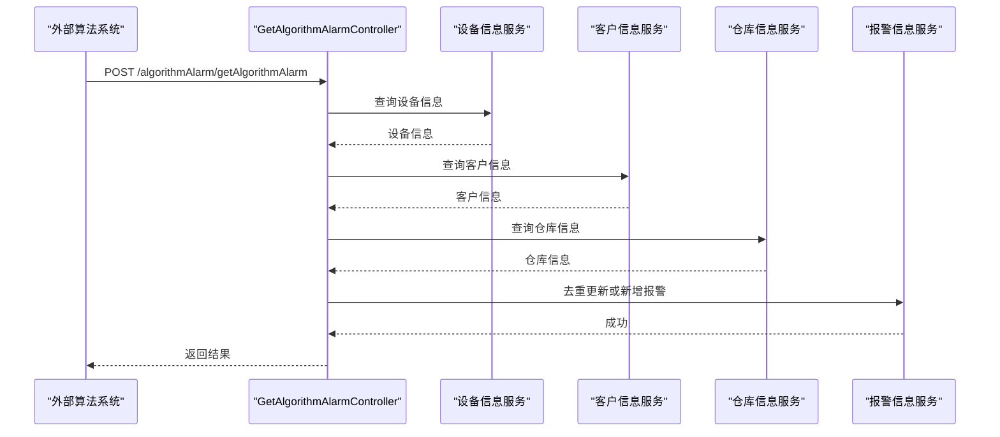
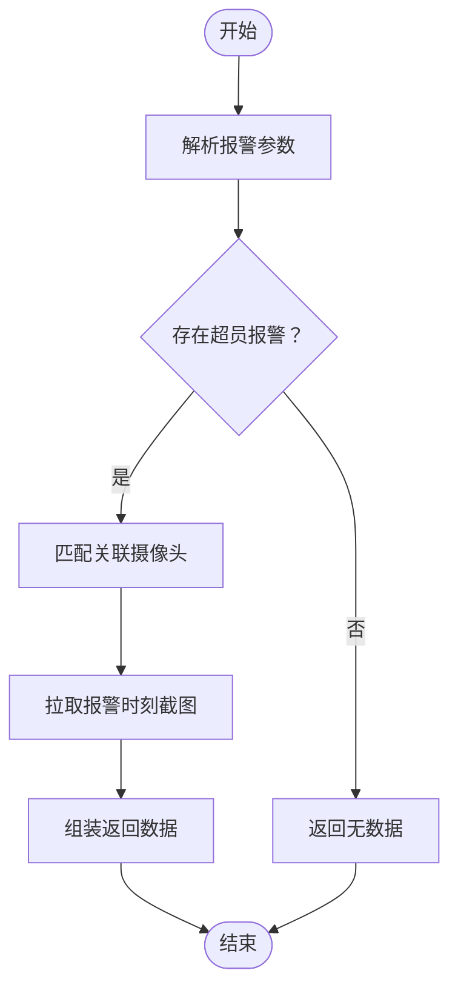
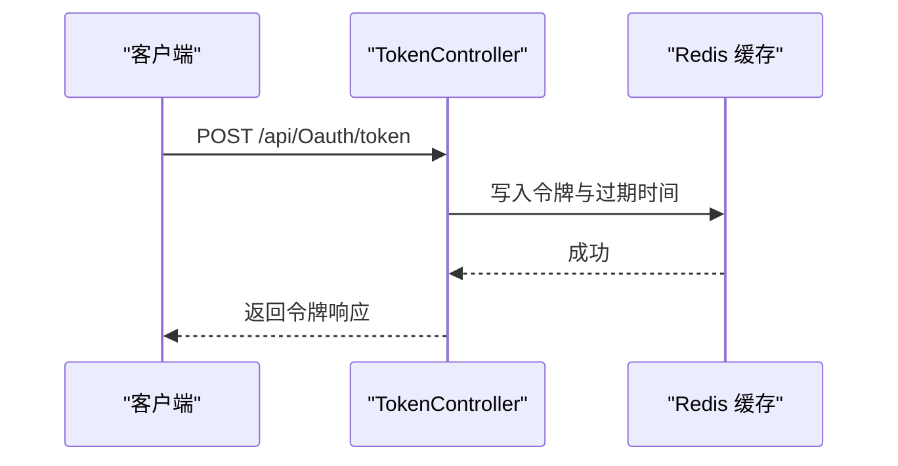

# 系统配置API

<cite>
**本文引用的文件**
- [AlgorithmAlertController.java](file://monkey-monitor-api/src/main/java/com/monkey/general/controller/AlgorithmAlertController.java)
- [AlramInfoController.java](file://monkey-monitor-api/src/main/java/com/monkey/general/controller/AlramInfoController.java)
- [GetHeadcountController.java](file://monkey-monitor-api/src/main/java/com/monkey/general/headcount/GetHeadcountController.java)
- [GetPersonAlarmDataController.java](file://monkey-monitor-api/src/main/java/com/monkey/general/person/GetPersonAlarmDataController.java)
- [GetAlgorithmAlarmController.java](file://monkey-monitor-api/src/main/java/com/monkey/general/python/GetAlgorithmAlarmController.java)
- [TokenController.java](file://monkey-monitor-api/src/main/java/com/monkey/general/controller/TokenController.java)
- [UserController.java](file://monkey-monitor-api/src/main/java/com/monkey/general/controller/UserController.java)
- [LevelController.java](file://monkey-monitor-api/src/main/java/com/monkey/general/controller/LevelController.java)
- [Config.java](file://monkey-service/src/main/java/com/monkey/general/modules/sys/entity/Config.java)
- [ConfigService.java](file://monkey-service/src/main/java/com/monkey/general/modules/sys/service/ConfigService.java)
- [ConfigMapper.java](file://monkey-service/src/main/java/com/monkey/general/modules/sys/mapper/ConfigMapper.java)
- [ConfigMapper.xml](file://monkey-service/src/main/resources/mapper/sys/ConfigMapper.xml)
- [GetAlgorithmAlarm.java](file://monkey-monitor-api/src/main/java/com/monkey/general/python/GetAlgorithmAlarm.java)
- [GetHeadcountService.java](file://monkey-monitor-api/src/main/java/com/monkey/general/headcount/GetHeadcountService.java)
</cite>

## 目录
1. [简介](#简介)
2. [项目结构](#项目结构)
3. [核心组件](#核心组件)
4. [架构总览](#架构总览)
5. [详细组件分析](#详细组件分析)
6. [依赖分析](#依赖分析)
7. [性能考虑](#性能考虑)
8. [故障排查指南](#故障排查指南)
9. [结论](#结论)
10. [附录](#附录)

## 简介
本文件面向系统配置API与相关统计查询接口，覆盖以下主题：
- 系统参数配置：系统配置项的定义、读取、更新与序列化使用方式
- 算法配置：第三方算法报警接入流程与参数映射
- 统计查询：人员统计、报警推送、数据大屏等接口
- 人口统计：基于AI算法的人员数量统计与超员报警
- 系统监控与健康检查：令牌生成、上传接口、报警推送列表等

目标是帮助开发者与运维人员快速理解接口职责、参数含义、数据来源与调用流程，并提供默认值、取值范围与修改权限的说明建议。

## 项目结构
本项目采用多模块结构，系统配置API主要分布在以下模块：
- monkey-monitor-api：对外暴露的监控与统计接口（含配置、报警、人员统计、数据大屏等）
- monkey-service：通用服务与持久层（含系统配置实体、Mapper、Service）

图表来源
- [AlgorithmAlertController.java:35-64](file://monkey-monitor-api/src/main/java/com/monkey/general/controller/AlgorithmAlertController.java#L35-L64)
- [AlramInfoController.java:35-61](file://monkey-monitor-api/src/main/java/com/monkey/general/controller/AlramInfoController.java#L35-L61)
- [GetHeadcountController.java:19-26](file://monkey-monitor-api/src/main/java/com/monkey/general/headcount/GetHeadcountController.java#L19-L26)
- [GetPersonAlarmDataController.java:87-137](file://monkey-monitor-api/src/main/java/com/monkey/general/person/GetPersonAlarmDataController.java#L87-L137)
- [GetAlgorithmAlarmController.java:48-116](file://monkey-monitor-api/src/main/java/com/monkey/general/python/GetAlgorithmAlarmController.java#L48-L116)
- [TokenController.java:56-308](file://monkey-monitor-api/src/main/java/com/monkey/general/controller/TokenController.java#L56-L308)
- [UserController.java:35-49](file://monkey-monitor-api/src/main/java/com/monkey/general/controller/UserController.java#L35-L49)
- [LevelController.java:44-106](file://monkey-monitor-api/src/main/java/com/monkey/general/controller/LevelController.java#L44-L106)
- [Config.java:21-61](file://monkey-service/src/main/java/com/monkey/general/modules/sys/entity/Config.java#L21-L61)
- [ConfigService.java:14-52](file://monkey-service/src/main/java/com/monkey/general/modules/sys/service/ConfigService.java#L14-L52)
- [ConfigMapper.java:12-22](file://monkey-service/src/main/java/com/monkey/general/modules/sys/mapper/ConfigMapper.java#L12-L22)
- [ConfigMapper.xml:7-14](file://monkey-service/src/main/resources/mapper/sys/ConfigMapper.xml#L7-L14)

章节来源
- [AlgorithmAlertController.java:1-68](file://monkey-monitor-api/src/main/java/com/monkey/general/controller/AlgorithmAlertController.java#L1-L68)
- [AlramInfoController.java:1-73](file://monkey-monitor-api/src/main/java/com/monkey/general/controller/AlramInfoController.java#L1-L73)
- [GetHeadcountController.java:1-30](file://monkey-monitor-api/src/main/java/com/monkey/general/headcount/GetHeadcountController.java#L1-L30)
- [GetPersonAlarmDataController.java:1-139](file://monkey-monitor-api/src/main/java/com/monkey/general/person/GetPersonAlarmDataController.java#L1-L139)
- [GetAlgorithmAlarmController.java:1-137](file://monkey-monitor-api/src/main/java/com/monkey/general/python/GetAlgorithmAlarmController.java#L1-L137)
- [TokenController.java:1-350](file://monkey-monitor-api/src/main/java/com/monkey/general/controller/TokenController.java#L1-L350)
- [UserController.java:1-51](file://monkey-monitor-api/src/main/java/com/monkey/general/controller/UserController.java#L1-L51)
- [LevelController.java:1-109](file://monkey-monitor-api/src/main/java/com/monkey/general/controller/LevelController.java#L1-L109)
- [Config.java:1-62](file://monkey-service/src/main/java/com/monkey/general/modules/sys/entity/Config.java#L1-L62)
- [ConfigService.java:1-53](file://monkey-service/src/main/java/com/monkey/general/modules/sys/service/ConfigService.java#L1-L53)
- [ConfigMapper.java:1-23](file://monkey-service/src/main/java/com/monkey/general/modules/sys/mapper/ConfigMapper.java#L1-L23)
- [ConfigMapper.xml:1-16](file://monkey-service/src/main/resources/mapper/sys/ConfigMapper.xml#L1-L16)

## 核心组件
- 系统配置实体与服务
  - Config：系统配置项实体，包含主键、键、值、状态、备注及时间戳字段
  - ConfigService：系统配置服务接口，提供分页查询、保存、更新、按key更新值、批量删除、按key取值、按key反序列化为对象等方法
  - ConfigMapper：系统配置Mapper接口，提供按key查询与按key更新值的方法
  - ConfigMapper.xml：SQL映射，实现按key更新值与按key查询配置

- 算法报警与统计
  - GetAlgorithmAlarm：第三方算法报警请求体，包含摄像头编号、报警时间、图片帧、报警类型、报警值、人员数量
  - GetAlgorithmAlarmController：接收第三方算法报警，解析并落库，支持去重与更新
  - AlgorithmAlertController：接收前端或外部系统的算法报警记录，支持图片上传与存储
  - GetHeadcountController：接收算法报警并返回统计结果（如人员数量），配合GetHeadcountService
  - GetPersonAlarmDataController：根据报警信息拉取摄像头截图并返回标注数据

- 统计与数据大屏
  - TokenController：提供令牌生成、文件上传、各类业务数据保存接口，以及报警推送列表
  - LevelController：液位表的增删改查与分页查询
  - UserController：根据企业编码获取当前登录用户信息

章节来源
- [Config.java:21-61](file://monkey-service/src/main/java/com/monkey/general/modules/sys/entity/Config.java#L21-L61)
- [ConfigService.java:14-52](file://monkey-service/src/main/java/com/monkey/general/modules/sys/service/ConfigService.java#L14-L52)
- [ConfigMapper.java:12-22](file://monkey-service/src/main/java/com/monkey/general/modules/sys/mapper/ConfigMapper.java#L12-L22)
- [ConfigMapper.xml:7-14](file://monkey-service/src/main/resources/mapper/sys/ConfigMapper.xml#L7-L14)
- [GetAlgorithmAlarm.java:8-15](file://monkey-monitor-api/src/main/java/com/monkey/general/python/GetAlgorithmAlarm.java#L8-L15)
- [GetAlgorithmAlarmController.java:48-116](file://monkey-monitor-api/src/main/java/com/monkey/general/python/GetAlgorithmAlarmController.java#L48-L116)
- [AlgorithmAlertController.java:35-64](file://monkey-monitor-api/src/main/java/com/monkey/general/controller/AlgorithmAlertController.java#L35-L64)
- [GetHeadcountController.java:19-26](file://monkey-monitor-api/src/main/java/com/monkey/general/headcount/GetHeadcountController.java#L19-L26)
- [GetPersonAlarmDataController.java:87-137](file://monkey-monitor-api/src/main/java/com/monkey/general/person/GetPersonAlarmDataController.java#L87-L137)
- [TokenController.java:56-308](file://monkey-monitor-api/src/main/java/com/monkey/general/controller/TokenController.java#L56-L308)
- [LevelController.java:44-106](file://monkey-monitor-api/src/main/java/com/monkey/general/controller/LevelController.java#L44-L106)
- [UserController.java:35-49](file://monkey-monitor-api/src/main/java/com/monkey/general/controller/UserController.java#L35-L49)

## 架构总览
系统配置API围绕“配置实体—服务接口—持久层映射—控制器接口”展开，形成清晰的分层架构。第三方算法报警通过统一的接收接口完成数据解析、去重与入库；人员统计与数据大屏接口提供实时数据展示与推送能力。

图表来源
- [Config.java:21-61](file://monkey-service/src/main/java/com/monkey/general/modules/sys/entity/Config.java#L21-L61)
- [ConfigService.java:14-52](file://monkey-service/src/main/java/com/monkey/general/modules/sys/service/ConfigService.java#L14-L52)
- [ConfigMapper.java:12-22](file://monkey-service/src/main/java/com/monkey/general/modules/sys/mapper/ConfigMapper.java#L12-L22)
- [ConfigMapper.xml:7-14](file://monkey-service/src/main/resources/mapper/sys/ConfigMapper.xml#L7-L14)
- [GetAlgorithmAlarmController.java:48-116](file://monkey-monitor-api/src/main/java/com/monkey/general/python/GetAlgorithmAlarmController.java#L48-L116)
- [AlgorithmAlertController.java:35-64](file://monkey-monitor-api/src/main/java/com/monkey/general/controller/AlgorithmAlertController.java#L35-L64)
- [GetHeadcountController.java:19-26](file://monkey-monitor-api/src/main/java/com/monkey/general/headcount/GetHeadcountController.java#L19-L26)
- [GetPersonAlarmDataController.java:87-137](file://monkey-monitor-api/src/main/java/com/monkey/general/person/GetPersonAlarmDataController.java#L87-L137)
- [TokenController.java:56-308](file://monkey-monitor-api/src/main/java/com/monkey/general/controller/TokenController.java#L56-L308)
- [LevelController.java:44-106](file://monkey-monitor-api/src/main/java/com/monkey/general/controller/LevelController.java#L44-L106)
- [UserController.java:35-49](file://monkey-monitor-api/src/main/java/com/monkey/general/controller/UserController.java#L35-L49)

## 详细组件分析

### 系统配置API
- 配置实体与字段
  - 主键：唯一标识
  - 键（paramKey）：配置项标识，用于检索与更新
  - 值（paramValue）：配置项内容，可为字符串或序列化对象
  - 状态（dataStatus）：0-禁用、1-启用
  - 备注（remark）：配置用途说明
  - 时间戳：创建与更新时间

- 配置服务接口
  - 分页查询：queryPage(params)
  - 保存与更新：saveConfig(config)、update(config)
  - 按key更新值：updateValueByKey(key, value)
  - 批量删除：deleteBatch(ids)
  - 按key取值：getValue(key)
  - 按key反序列化对象：getConfigObject(key, clazz)

- 配置持久层
  - queryByKey(paramKey)：按键查询配置
  - updateValueByKey(paramKey, paramValue)：按键更新值

- 默认值、取值范围与修改权限
  - 默认值：未在实体中设置默认值，需由业务侧在保存时指定
  - 取值范围：paramValue为字符串类型，具体范围由业务约定
  - 修改权限：建议仅限管理员角色，结合鉴权与审计日志

图表来源
- [Config.java:21-61](file://monkey-service/src/main/java/com/monkey/general/modules/sys/entity/Config.java#L21-L61)
- [ConfigService.java:14-52](file://monkey-service/src/main/java/com/monkey/general/modules/sys/service/ConfigService.java#L14-L52)
- [ConfigMapper.java:12-22](file://monkey-service/src/main/java/com/monkey/general/modules/sys/mapper/ConfigMapper.java#L12-L22)

章节来源
- [Config.java:21-61](file://monkey-service/src/main/java/com/monkey/general/modules/sys/entity/Config.java#L21-L61)
- [ConfigService.java:14-52](file://monkey-service/src/main/java/com/monkey/general/modules/sys/service/ConfigService.java#L14-L52)
- [ConfigMapper.java:12-22](file://monkey-service/src/main/java/com/monkey/general/modules/sys/mapper/ConfigMapper.java#L12-L22)
- [ConfigMapper.xml:7-14](file://monkey-service/src/main/resources/mapper/sys/ConfigMapper.xml#L7-L14)

### 算法报警接收与处理
- 接收第三方算法报警
  - 请求路径：POST /algorithmAlarm/getAlgorithmAlarm
  - 参数：GetAlgorithmAlarm（摄像头编号、报警时间、图片帧、报警类型、报警值、人员数量）
  - 处理逻辑：校验设备与客户信息，去重更新或新增报警记录，图片转存至对象存储并回填URL

- 接收前端/外部算法报警记录
  - 请求路径：POST /general/algorithmAlert
  - 参数：data（JSON数组）、type、picture、originPic、facePic、bodyPic、video
  - 处理逻辑：解析data，上传图片至对象存储，写入算法报警记录

图表来源
- [GetAlgorithmAlarmController.java:48-116](file://monkey-monitor-api/src/main/java/com/monkey/general/python/GetAlgorithmAlarmController.java#L48-L116)
- [GetAlgorithmAlarm.java:8-15](file://monkey-monitor-api/src/main/java/com/monkey/general/python/GetAlgorithmAlarm.java#L8-L15)

章节来源
- [GetAlgorithmAlarmController.java:48-116](file://monkey-monitor-api/src/main/java/com/monkey/general/python/GetAlgorithmAlarmController.java#L48-L116)
- [GetAlgorithmAlarm.java:8-15](file://monkey-monitor-api/src/main/java/com/monkey/general/python/GetAlgorithmAlarm.java#L8-L15)

### 人员统计与超员报警
- 接收算法报警并统计人员数量
  - 请求路径：POST /headcount/getHeadcount
  - 参数：GetAlgorithmAlarm
  - 返回：统计结果（如人员数量）

- 人员定位与截图标注
  - 请求路径：GET /getPerAlarm/getPersonAlarmData
  - 逻辑：筛选超员报警，匹配关联摄像头，拉取报警时刻截图，返回标注所需数据

图表来源
- [GetHeadcountController.java:19-26](file://monkey-monitor-api/src/main/java/com/monkey/general/headcount/GetHeadcountController.java#L19-L26)
- [GetPersonAlarmDataController.java:87-137](file://monkey-monitor-api/src/main/java/com/monkey/general/person/GetPersonAlarmDataController.java#L87-L137)
- [GetAlgorithmAlarm.java:8-15](file://monkey-monitor-api/src/main/java/com/monkey/general/python/GetAlgorithmAlarm.java#L8-L15)

章节来源
- [GetHeadcountController.java:19-26](file://monkey-monitor-api/src/main/java/com/monkey/general/headcount/GetHeadcountController.java#L19-L26)
- [GetPersonAlarmDataController.java:87-137](file://monkey-monitor-api/src/main/java/com/monkey/general/person/GetPersonAlarmDataController.java#L87-L137)
- [GetAlgorithmAlarm.java:8-15](file://monkey-monitor-api/src/main/java/com/monkey/general/python/GetAlgorithmAlarm.java#L8-L15)

### 数据大屏与统计查询
- 令牌生成
  - 请求路径：POST /api/Oauth/token
  - 逻辑：生成临时令牌并写入缓存，设置过期时间

- 文件上传与业务数据保存
  - 请求路径：POST /api/common/uploadFile
  - 其他业务保存接口：/api/fire/common/saveInfoCompan、/api/fire/common/saveInfoPerson、/api/fire/common/saveInfoStore、/api/fire/common/saveInfoStoreroom、/api/fire/common/saveInfoPersonStatistics、/api/fire/common/saveInfoDevice、/api/fire/common/saveInfoComputer、/api/fire/common/saveInfoPersonInout、/api/fire/common/saveInfoCarInout

- 报警推送列表
  - 请求路径：GET /api/alarmPushList
  - 逻辑：按企业编码查询报警推送列表

- 人员/车辆出入记录保存
  - 请求路径：POST /api/personInOutInfo/save、/api/carInOutInfo/save
  - 逻辑：校验参数后保存记录

图表来源
- [TokenController.java:56-65](file://monkey-monitor-api/src/main/java/com/monkey/general/controller/TokenController.java#L56-L65)

章节来源
- [TokenController.java:56-308](file://monkey-monitor-api/src/main/java/com/monkey/general/controller/TokenController.java#L56-L308)

### 系统用户与权限
- 获取当前登录用户信息
  - 请求路径：GET /sys/user/info
  - 逻辑：按企业编码查询用户信息，返回角色ID并清除敏感字段

章节来源
- [UserController.java:35-49](file://monkey-monitor-api/src/main/java/com/monkey/general/controller/UserController.java#L35-L49)

### 液位表管理
- 列表与分页
  - 请求路径：GET /em/level/list
  - 参数：page、limit、key
  - 逻辑：分页查询液位表

- 详情、保存、修改、删除
  - 请求路径：GET /em/level/info/{id}、POST /em/level/save、POST /em/level/update、POST /em/level/delete
  - 逻辑：标准CRUD操作

章节来源
- [LevelController.java:44-106](file://monkey-monitor-api/src/main/java/com/monkey/general/controller/LevelController.java#L44-L106)

## 依赖分析
- 控制器到服务层
  - 各控制器均依赖对应Service接口，实现业务编排与参数校验
- 服务层到持久层
  - ConfigService依赖ConfigMapper，ConfigMapper通过XML映射执行SQL
- 外部集成
  - 算法报警接收依赖设备、客户、仓库信息服务，以及对象存储服务
  - 人员定位依赖摄像头平台SDK（截图拉取）

图表来源
- [ConfigService.java:14-52](file://monkey-service/src/main/java/com/monkey/general/modules/sys/service/ConfigService.java#L14-L52)
- [ConfigMapper.java:12-22](file://monkey-service/src/main/java/com/monkey/general/modules/sys/mapper/ConfigMapper.java#L12-L22)
- [ConfigMapper.xml:7-14](file://monkey-service/src/main/resources/mapper/sys/ConfigMapper.xml#L7-L14)

章节来源
- [ConfigService.java:14-52](file://monkey-service/src/main/java/com/monkey/general/modules/sys/service/ConfigService.java#L14-L52)
- [ConfigMapper.java:12-22](file://monkey-service/src/main/java/com/monkey/general/modules/sys/mapper/ConfigMapper.java#L12-L22)
- [ConfigMapper.xml:7-14](file://monkey-service/src/main/resources/mapper/sys/ConfigMapper.xml#L7-L14)

## 性能考虑
- 配置读取
  - 建议对高频配置项增加缓存，减少数据库访问
- 报警处理
  - 去重更新逻辑避免重复入库，提升吞吐
  - 图片上传建议异步化与限流，防止IO阻塞
- 数据大屏
  - 报警推送列表应分页与索引优化，避免全表扫描
- 摄像头截图
  - 拉取截图应设置超时与并发限制，避免阻塞线程池

## 故障排查指南
- 算法报警接收失败
  - 检查设备编码是否存在、客户与仓库信息是否匹配
  - 核对图片帧Base64是否有效，对象存储上传是否成功
- 人员统计无数据
  - 确认存在超员报警且已关联摄像头
  - 核对摄像头IP、账号、密码、通道与端口配置
- 令牌失效
  - 检查缓存中的令牌是否过期，重新生成
- 用户信息为空
  - 确认企业编码正确，数据库中是否存在对应用户

章节来源
- [GetAlgorithmAlarmController.java:56-78](file://monkey-monitor-api/src/main/java/com/monkey/general/python/GetAlgorithmAlarmController.java#L56-L78)
- [GetPersonAlarmDataController.java:99-123](file://monkey-monitor-api/src/main/java/com/monkey/general/person/GetPersonAlarmDataController.java#L99-L123)
- [TokenController.java:56-65](file://monkey-monitor-api/src/main/java/com/monkey/general/controller/TokenController.java#L56-L65)
- [UserController.java:38-41](file://monkey-monitor-api/src/main/java/com/monkey/general/controller/UserController.java#L38-L41)

## 结论
系统配置API以清晰的分层设计支撑了算法报警接入、人员统计与数据大屏展示等核心能力。通过统一的配置服务与标准化的控制器接口，实现了高内聚低耦合的架构。建议在生产环境中完善缓存策略、异步处理与监控告警，确保系统稳定性与可扩展性。

## 附录
- 接口清单与说明
  - 系统配置
    - GET /sys/config/list：分页查询配置
    - GET /sys/config/info/{id}：查询配置详情
    - POST /sys/config/save：保存配置
    - POST /sys/config/update：修改配置
    - POST /sys/config/delete：删除配置
  - 算法报警
    - POST /algorithmAlarm/getAlgorithmAlarm：接收第三方算法报警
    - POST /general/algorithmAlert：接收算法报警记录
  - 人员统计
    - POST /headcount/getHeadcount：统计人员数量
    - GET /getPerAlarm/getPersonAlarmData：获取人员定位截图
  - 数据大屏
    - POST /api/Oauth/token：生成令牌
    - POST /api/common/uploadFile：上传文件
    - POST /api/fire/common/saveInfo*：保存各类业务数据
    - GET /api/alarmPushList：报警推送列表
    - POST /api/personInOutInfo/save：保存人员出入记录
    - POST /api/carInOutInfo/save：保存车辆出入记录
  - 系统用户
    - GET /sys/user/info：获取当前用户信息
  - 液位表
    - GET /em/level/list：列表与分页
    - GET /em/level/info/{id}：详情
    - POST /em/level/save：保存
    - POST /em/level/update：修改
    - POST /em/level/delete：删除