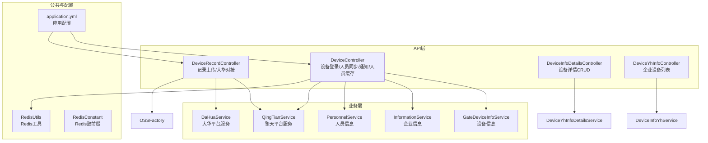
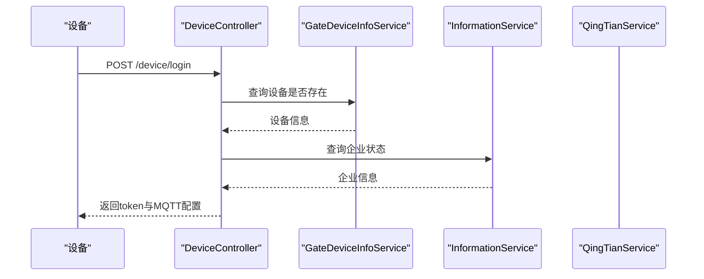
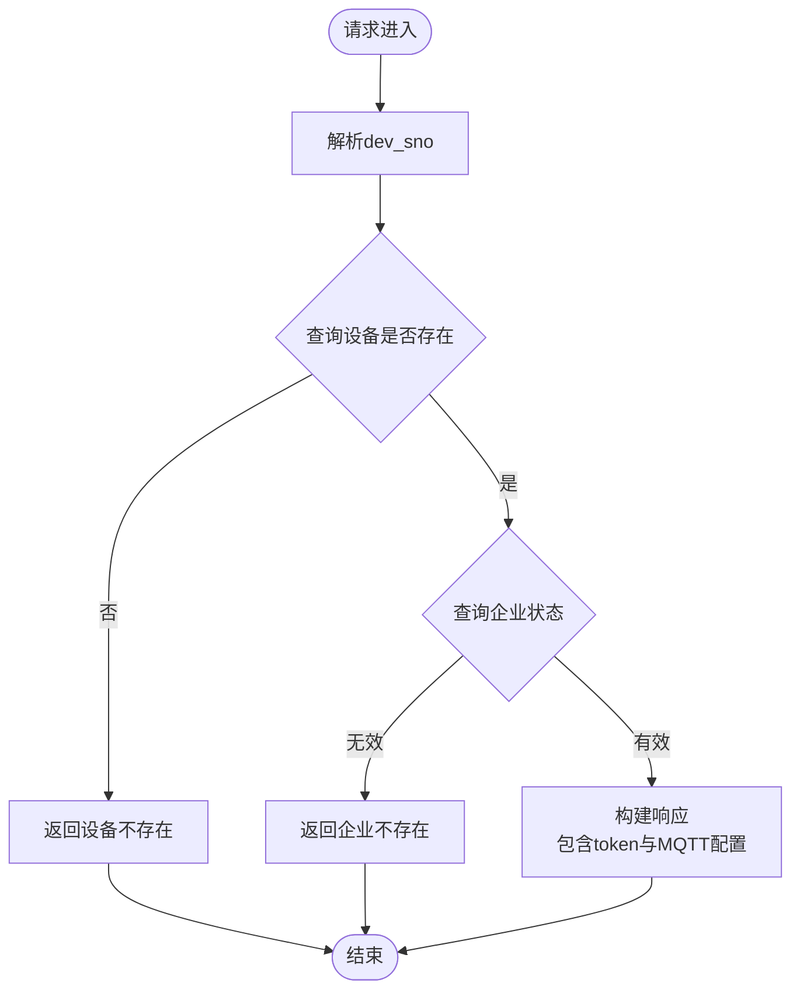
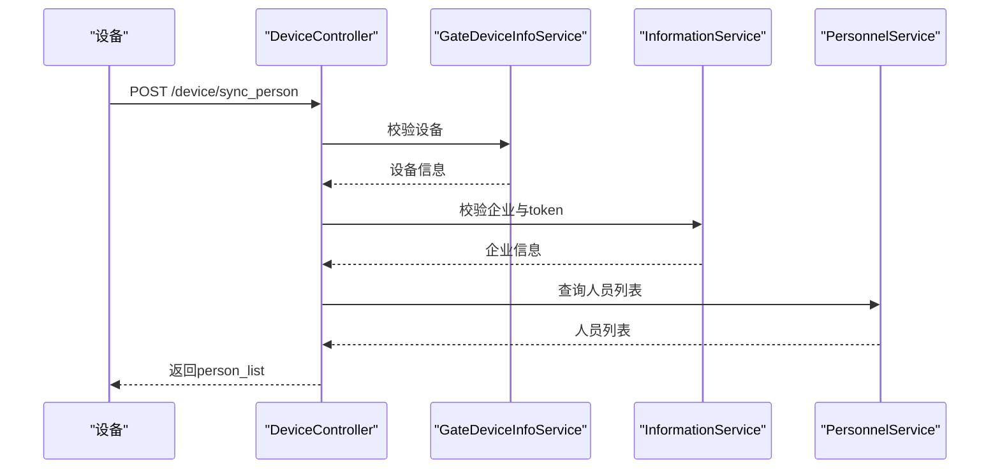
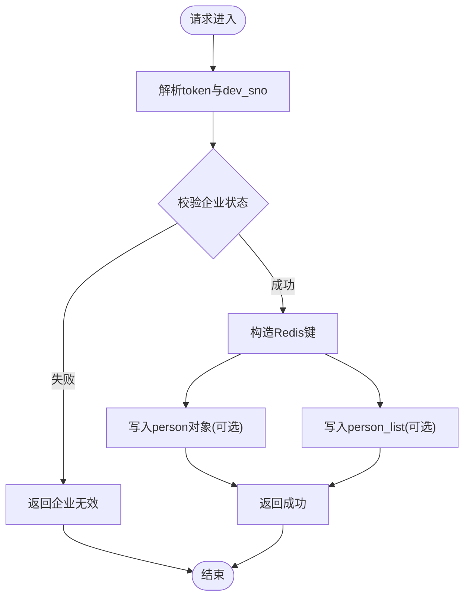
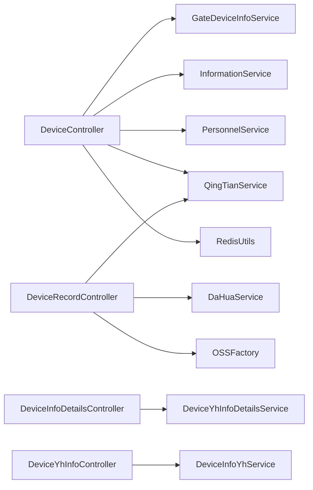
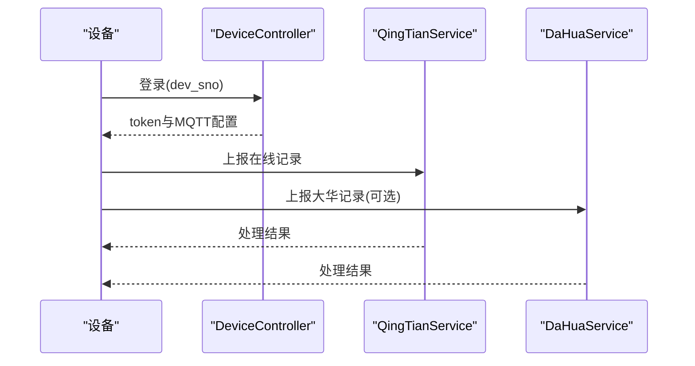

# 设备管理API

<cite>
**本文引用的文件**
- [DeviceController.java](file://monkey-monitor-api/src/main/java/com/monkey/general/controller/DeviceController.java)
- [DeviceRecordController.java](file://monkey-monitor-api/src/main/java/com/monkey/general/controller/DeviceRecordController.java)
- [DeviceInfoDetailsController.java](file://monkey-monitor-api/src/main/java/com/monkey/general/controller/DeviceInfoDetailsController.java)
- [DeviceYhInfoController.java](file://monkey-monitor-api/src/main/java/com/monkey/general/controller/DeviceYhInfoController.java)
- [application.yml](file://monkey-monitor-api/src/main/resources/application.yml)
- [DeviceInfoYhService.java](file://monkey-monitor/src/main/java/com/monkey/general/modules/em/service/DeviceInfoYhService.java)
- [DeviceYhInfoDetailsService.java](file://monkey-monitor/src/main/java/com/monkey/general/modules/em/service/DeviceYhInfoDetailsService.java)
- [QingTianService.java](file://monkey-monitor/src/main/java/com/monkey/general/modules/third/service/QingTianService.java)
- [DaHuaService.java](file://monkey-monitor/src/main/java/com/monkey/general/modules/third/service/DaHuaService.java)
- [GateDeviceInfoService.java](file://monkey-monitor/src/main/java/com/monkey/general/modules/em/service/GateDeviceInfoService.java)
- [InformationService.java](file://monkey-monitor/src/main/java/com/monkey/general/modules/em/service/InformationService.java)
- [PersonnelService.java](file://monkey-monitor/src/main/java/com/monkey/general/modules/em/service/PersonnelService.java)
- [RedisUtils.java](file://monkey-common/src/main/java/com/monkey/general/common/utils/RedisUtils.java)
- [RedisConstant.java](file://monkey-common/src/main/java/com/monkey/general/common/constant/RedisConstant.java)
- [PersonInOutRecordVo.java](file://monkey-monitor/src/main/java/com/monkey/general/modules/third/dto/PersonInOutRecordVo.java)
- [CarInOutRecordVo.java](file://monkey-monitor/src/main/java/com/monkey/general/modules/third/dto/CarInOutRecordVo.java)
- [OSSFactory.java](file://monkey-service/src/main/java/com/monkey/general/modules/oss/cloud/OSSFactory.java)
- [DataResponse.java](file://monkey-monitor-api/src/main/java/com/monkey/general/modules/third/api/response/DataResponse.java)
</cite>

## 目录
1. [简介](#简介)
2. [项目结构](#项目结构)
3. [核心组件](#核心组件)
4. [架构总览](#架构总览)
5. [详细组件分析](#详细组件分析)
6. [依赖分析](#依赖分析)
7. [性能考虑](#性能考虑)
8. [故障排查指南](#故障排查指南)
9. [结论](#结论)
10. [附录](#附录)

## 简介
本文件面向设备管理API，覆盖设备注册登录、设备状态查询、设备配置下发、设备记录上报与查询等核心能力。文档基于实际源码梳理接口定义、请求参数、响应格式、错误码及典型使用场景，并给出设备接入流程、状态监控与参数配置的实践建议。

## 项目结构
- API层位于 monkey-monitor-api 模块，提供REST接口控制器，负责对外暴露设备相关接口。
- 业务与数据访问位于 monkey-monitor 模块，包含第三方平台对接服务（如擎天、大华）、设备信息与人员信息服务等。
- 公共工具与常量位于 monkey-common 模块，提供Redis工具、常量定义等。
- 基础设施配置位于 application.yml，定义端口、MyBatis配置等。

**图表来源**
- [DeviceController.java:31-104](file://monkey-monitor-api/src/main/java/com/monkey/general/controller/DeviceController.java#L31-L104)
- [DeviceRecordController.java:31-103](file://monkey-monitor-api/src/main/java/com/monkey/general/controller/DeviceRecordController.java#L31-L103)
- [DeviceInfoDetailsController.java:27-108](file://monkey-monitor-api/src/main/java/com/monkey/general/controller/DeviceInfoDetailsController.java#L27-L108)
- [DeviceYhInfoController.java:31-64](file://monkey-monitor-api/src/main/java/com/monkey/general/controller/DeviceYhInfoController.java#L31-L64)
- [application.yml:1-40](file://monkey-monitor-api/src/main/resources/application.yml#L1-L40)

**章节来源**
- [application.yml:1-40](file://monkey-monitor-api/src/main/resources/application.yml#L1-L40)

## 核心组件
- 设备控制器：提供设备登录、人员同步、通知回调、人员缓存等接口。
- 记录控制器：提供在线人员/车辆记录上传、大华对接上传（含图片）等接口。
- 设备详情控制器：提供设备详情的列表、信息、新增、修改、删除接口。
- 企业设备控制器：提供企业维度的设备列表查询接口。
- 第三方服务：擎天服务与大华服务，负责与平台对接、数据落库与处理。
- 公共工具：Redis工具与常量，用于人员缓存与键空间管理。

**章节来源**
- [DeviceController.java:31-266](file://monkey-monitor-api/src/main/java/com/monkey/general/controller/DeviceController.java#L31-L266)
- [DeviceRecordController.java:31-281](file://monkey-monitor-api/src/main/java/com/monkey/general/controller/DeviceRecordController.java#L31-L281)
- [DeviceInfoDetailsController.java:27-108](file://monkey-monitor-api/src/main/java/com/monkey/general/controller/DeviceInfoDetailsController.java#L27-L108)
- [DeviceYhInfoController.java:31-64](file://monkey-monitor-api/src/main/java/com/monkey/general/controller/DeviceYhInfoController.java#L31-L64)

## 架构总览
设备管理API采用“控制器-服务-数据访问”的分层架构。设备侧通过HTTP接口与平台交互，控制器负责鉴权与参数校验，服务层负责调用第三方平台或本地数据服务，最终返回统一响应。

**图表来源**
- [DeviceController.java:59-104](file://monkey-monitor-api/src/main/java/com/monkey/general/controller/DeviceController.java#L59-L104)
- [GateDeviceInfoService.java](file://monkey-monitor/src/main/java/com/monkey/general/modules/em/service/GateDeviceInfoService.java)
- [InformationService.java](file://monkey-monitor/src/main/java/com/monkey/general/modules/em/service/InformationService.java)
- [QingTianService.java](file://monkey-monitor/src/main/java/com/monkey/general/modules/third/service/QingTianService.java)

## 详细组件分析

### 设备登录接口
- 方法与路径
  - POST /device/login
- 请求参数
  - dev_sno：设备编号（字符串）
- 成功响应
  - code：0
  - msg：登录成功
  - success：true
  - dev_sno：设备编号
  - token：企业标识
  - mqinfo：MQTT连接信息（host、port、username、password、keepalive、qos、topic）
- 失败响应
  - code：-1
  - msg：提示设备不存在或企业不存在
  - success：false
- 鉴权与校验
  - 校验设备是否存在
  - 校验企业状态是否有效
- 错误码
  - -1：设备不存在或企业无效
  - 0：成功

**图表来源**
- [DeviceController.java:59-104](file://monkey-monitor-api/src/main/java/com/monkey/general/controller/DeviceController.java#L59-L104)

**章节来源**
- [DeviceController.java:59-104](file://monkey-monitor-api/src/main/java/com/monkey/general/controller/DeviceController.java#L59-L104)

### 人员同步接口
- 方法与路径
  - POST /device/sync_person
- 请求参数
  - dev_sno：设备编号
  - token：企业标识
  - path_params.person_list：人员ID列表
- 成功响应
  - code：0
  - msg：OK
  - success：true
  - person_list：人员信息数组（包含person_id、person_name、person_type、id_card、templateImgUrl等）
- 失败响应
  - code：-1
  - msg：提示设备不存在或人员不存在
  - success：false
- 数据转换
  - 将人员实体转换为设备侧所需字段（含临时有效期字段）

**图表来源**
- [DeviceController.java:107-161](file://monkey-monitor-api/src/main/java/com/monkey/general/controller/DeviceController.java#L107-L161)
- [PersonnelService.java](file://monkey-monitor/src/main/java/com/monkey/general/modules/em/service/PersonnelService.java)

**章节来源**
- [DeviceController.java:107-161](file://monkey-monitor-api/src/main/java/com/monkey/general/controller/DeviceController.java#L107-L161)

### 人员缓存接口
- 方法与路径
  - POST /device/get_person_all
- 请求参数
  - token：企业标识
  - dev_sno：设备编号（可包含冒号，将被清洗）
  - person：单个人员对象（可选）
  - person_list：人员列表（可选）
- 缓存策略
  - 使用Redis键空间：公司级与设备级两级缓存
  - 支持按person_id与设备维度缓存
- 成功响应
  - code：0
  - msg：OK
  - success：true

**图表来源**
- [DeviceController.java:224-266](file://monkey-monitor-api/src/main/java/com/monkey/general/controller/DeviceController.java#L224-L266)
- [RedisUtils.java](file://monkey-common/src/main/java/com/monkey/general/common/utils/RedisUtils.java)
- [RedisConstant.java](file://monkey-common/src/main/java/com/monkey/general/common/constant/RedisConstant.java)

**章节来源**
- [DeviceController.java:224-266](file://monkey-monitor-api/src/main/java/com/monkey/general/controller/DeviceController.java#L224-L266)

### 通知回调接口
- 方法与路径
  - POST /device/notify
- 请求参数
  - dev_sno：设备编号
  - token：企业标识
  - body：平台回调数据
- 处理流程
  - 校验设备与企业
  - 转发至擎天服务处理
- 成功响应
  - 返回擎天服务处理结果

**章节来源**
- [DeviceController.java:169-196](file://monkey-monitor-api/src/main/java/com/monkey/general/controller/DeviceController.java#L169-L196)
- [QingTianService.java](file://monkey-monitor/src/main/java/com/monkey/general/modules/third/service/QingTianService.java)

### 在线记录上传接口
- 方法与路径
  - POST /record/upload/online
- 请求体
  - PersonInOutRecordVo：人员进出记录
- 成功响应
  - code：0
  - msg：OK
  - success：true

**章节来源**
- [DeviceRecordController.java:48-57](file://monkey-monitor-api/src/main/java/com/monkey/general/controller/DeviceRecordController.java#L48-L57)
- [PersonInOutRecordVo.java:1-20](file://monkey-monitor/src/main/java/com/monkey/general/modules/third/dto/PersonInOutRecordVo.java#L1-L20)

### 车辆记录上传接口
- 方法与路径
  - POST /record/upload/access
- 请求体
  - requestBody：包含msgId、service、data
  - service取值：INOUT（正常进出）、INOUTUNNORMAL（异常进出）
- 成功响应
  - DataResponse：code=0，msg=成功

**章节来源**
- [DeviceRecordController.java:65-103](file://monkey-monitor-api/src/main/java/com/monkey/general/controller/DeviceRecordController.java#L65-L103)
- [CarInOutRecordVo.java:1-200](file://monkey-monitor/src/main/java/com/monkey/general/modules/third/dto/CarInOutRecordVo.java#L1-L200)

### 大华对接上传接口
- 方法与路径
  - POST /record/upload/dh/personInout
  - POST /record/upload/dh/personInOutUnNormal
  - POST /record/upload/dh/carInout
  - POST /record/upload/dh/algorithmAlarm
  - POST /record/upload/dh/carInOutUnNormal
- 请求参数
  - data：JSON字符串，描述记录内容
  - file：可选，图片文件，将上传至OSS并回填URL
- 成功响应
  - code：0
  - msg：OK
  - success：true

**章节来源**
- [DeviceRecordController.java:112-278](file://monkey-monitor-api/src/main/java/com/monkey/general/controller/DeviceRecordController.java#L112-L278)
- [OSSFactory.java](file://monkey-service/src/main/java/com/monkey/general/modules/oss/cloud/OSSFactory.java)

### 设备详情管理接口
- 方法与路径
  - GET /em/deviceInfoDetails/list
  - GET /em/deviceInfoDetails/info/{id}
  - POST /em/deviceInfoDetails/save
  - POST /em/deviceInfoDetails/update
  - POST /em/deviceInfoDetails/delete
- 参数
  - 分页参数：page、limit、key
  - 主键：id
  - 批量删除：ids[]
- 成功响应
  - 统一返回ResponseDataVo

**章节来源**
- [DeviceInfoDetailsController.java:37-106](file://monkey-monitor-api/src/main/java/com/monkey/general/controller/DeviceInfoDetailsController.java#L37-L106)

### 企业设备列表接口
- 方法与路径
  - GET /em/deviceYhInfo/list
- 参数
  - page、limit、key
  - 内置过滤：companyCode（来自配置）
- 成功响应
  - 分页数据

**章节来源**
- [DeviceYhInfoController.java:44-63](file://monkey-monitor-api/src/main/java/com/monkey/general/controller/DeviceYhInfoController.java#L44-L63)
- [DeviceInfoYhService.java:16-21](file://monkey-monitor/src/main/java/com/monkey/general/modules/em/service/DeviceInfoYhService.java#L16-L21)

## 依赖分析
- 控制器依赖服务接口，服务接口依赖数据访问层与第三方SDK。
- 设备登录与人员同步依赖设备与企业信息服务；记录上传依赖擎天或大华服务。
- Redis工具用于人员缓存；OSS工厂用于图片上传。

**图表来源**
- [DeviceController.java:48-57](file://monkey-monitor-api/src/main/java/com/monkey/general/controller/DeviceController.java#L48-L57)
- [DeviceRecordController.java:37-40](file://monkey-monitor-api/src/main/java/com/monkey/general/controller/DeviceRecordController.java#L37-L40)
- [DeviceInfoDetailsController.java:31-32](file://monkey-monitor-api/src/main/java/com/monkey/general/controller/DeviceInfoDetailsController.java#L31-L32)
- [DeviceYhInfoController.java:36-37](file://monkey-monitor-api/src/main/java/com/monkey/general/controller/DeviceYhInfoController.java#L36-L37)

## 性能考虑
- 缓存策略：人员缓存采用Redis双层键空间，减少重复查询与转换开销。
- 异步与并发：记录上传接口直接落库或转发第三方，避免阻塞主线程。
- 图片处理：大华上传接口支持文件上传至OSS，降低设备直传压力。
- 分页查询：设备详情与企业设备列表均支持分页，避免一次性加载大量数据。

## 故障排查指南
- 设备登录失败
  - 检查dev_sno是否正确且设备存在
  - 检查企业状态与token是否匹配
- 人员同步失败
  - 检查person_list中的人员ID是否在企业范围内
- 记录上传失败
  - 检查service字段取值是否合法
  - 检查data与file参数是否完整
- 缓存未命中
  - 检查Redis键空间与过期策略
  - 确认设备编号清洗逻辑（去除冒号）

**章节来源**
- [DeviceController.java:64-103](file://monkey-monitor-api/src/main/java/com/monkey/general/controller/DeviceController.java#L64-L103)
- [DeviceRecordController.java:67-102](file://monkey-monitor-api/src/main/java/com/monkey/general/controller/DeviceRecordController.java#L67-L102)
- [RedisUtils.java](file://monkey-common/src/main/java/com/monkey/general/common/utils/RedisUtils.java)

## 结论
本API围绕设备登录、人员同步、记录上传与设备详情管理构建了完整的设备侧接入能力。通过清晰的接口定义、统一的响应格式与错误码约定，以及与第三方平台的对接，能够满足设备接入、状态监控与数据同步的实际需求。

## 附录

### 设备接入流程（概览）
- 设备启动后向平台发起登录请求，携带dev_sno
- 平台校验设备与企业状态，返回token与MQTT配置
- 设备根据配置连接MQTT主题，进行心跳与数据上报
- 设备定期同步人员名单，按需缓存
- 设备上传人员/车辆进出记录，平台落库或转发第三方

**图表来源**
- [DeviceController.java:59-104](file://monkey-monitor-api/src/main/java/com/monkey/general/controller/DeviceController.java#L59-L104)
- [DeviceRecordController.java:48-103](file://monkey-monitor-api/src/main/java/com/monkey/general/controller/DeviceRecordController.java#L48-L103)

### 设备ID生成与状态编码（说明）
- 设备ID生成规则
  - 由平台侧维护，设备侧以dev_sno形式参与鉴权与主题订阅
- 设备状态编码
  - 企业状态字段用于控制设备接入权限，仅当企业状态有效时允许接入
- 人员类型编码
  - 人员同步时会根据人员属性转换为设备侧识别的类型字段

**章节来源**
- [DeviceController.java:107-161](file://monkey-monitor-api/src/main/java/com/monkey/general/controller/DeviceController.java#L107-L161)
- [InformationService.java](file://monkey-monitor/src/main/java/com/monkey/general/modules/em/service/InformationService.java)

### 数据同步机制（说明）
- 在线记录：设备侧主动上报，平台落库或转发第三方
- 大华对接：支持多类事件上传（人员进出、车辆进出、算法告警、通道堵塞等），并可上传图片
- 人员缓存：平台侧将人员信息缓存至Redis，设备侧可按需拉取

**章节来源**
- [DeviceRecordController.java:112-278](file://monkey-monitor-api/src/main/java/com/monkey/general/controller/DeviceRecordController.java#L112-L278)
- [DeviceController.java:224-266](file://monkey-monitor-api/src/main/java/com/monkey/general/controller/DeviceController.java#L224-L266)