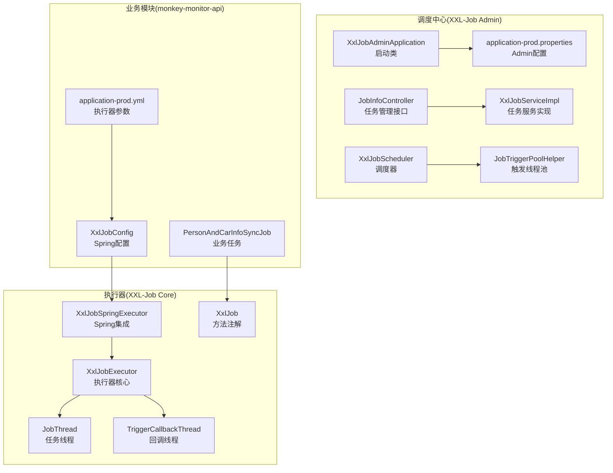
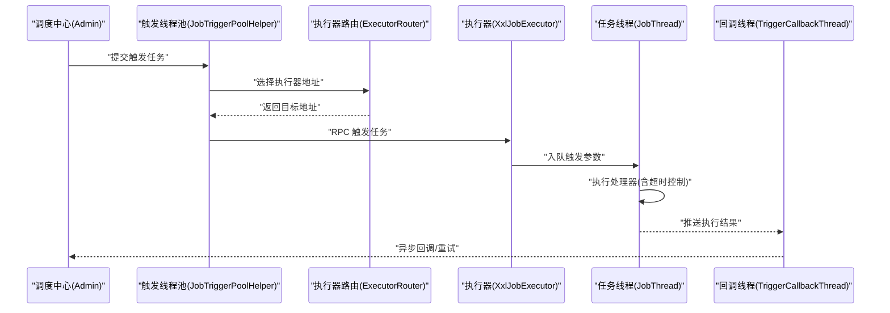
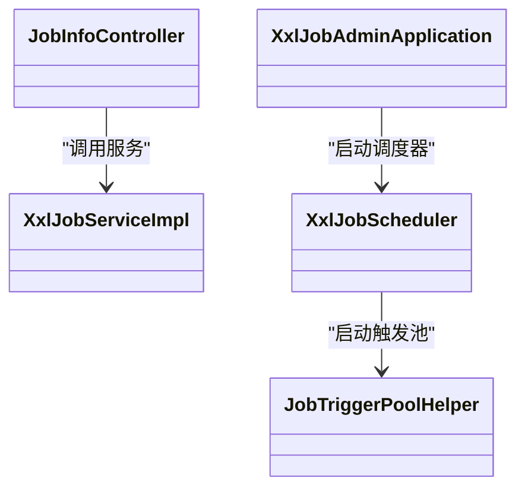
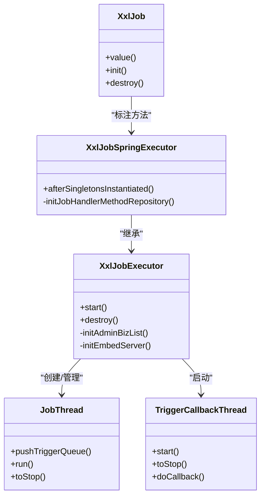
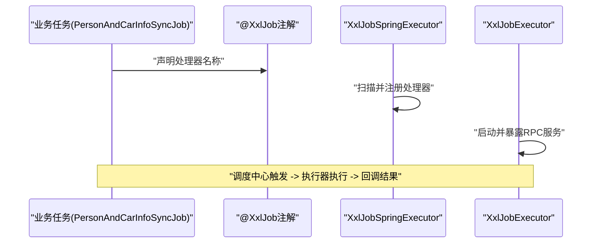
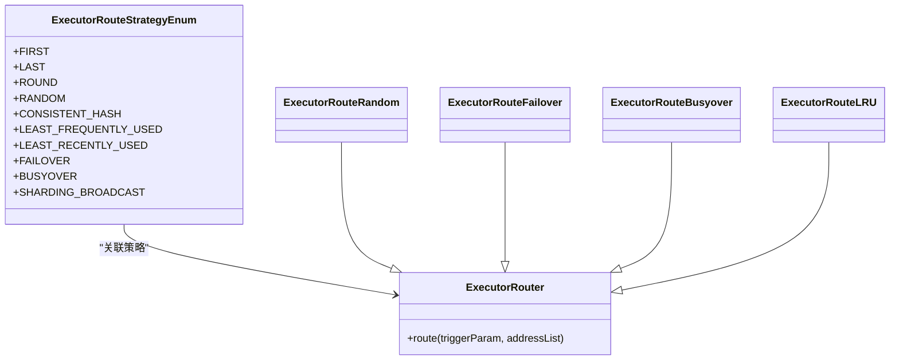
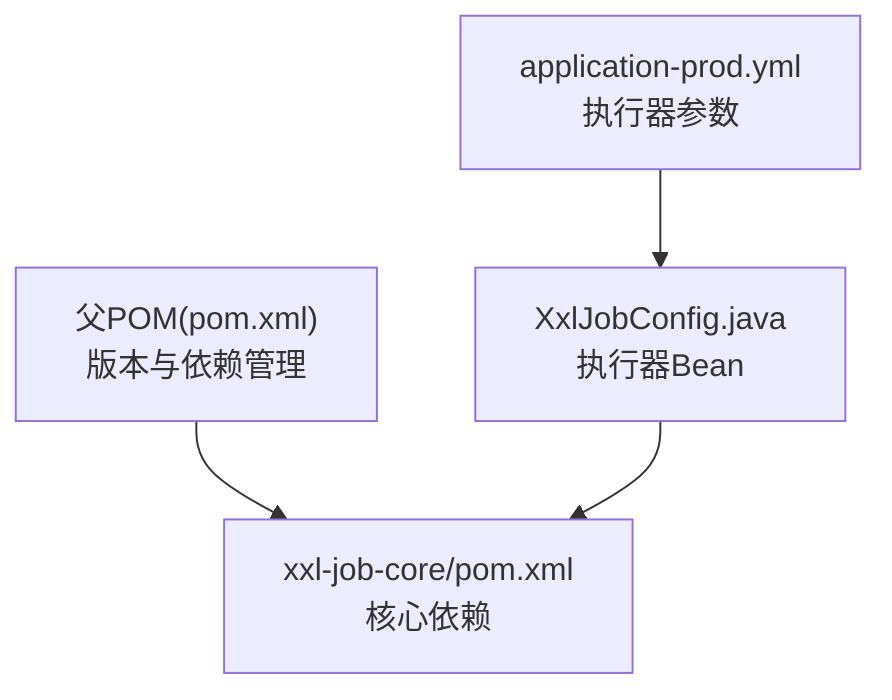

# XXL-Job集成

<cite>
**本文引用的文件**
- [XxlJobAdminApplication.java](file://xxl-job-admin/src/main/java/com/xxl/job/admin/XxlJobAdminApplication.java)
- [application-prod.properties](file://xxl-job-admin/src/main/resources/application-prod.properties)
- [XxlJobConfig.java](file://monkey-monitor-api/src/main/java/com/monkey/general/config/XxlJobConfig.java)
- [application-prod.yml](file://monkey-monitor-api/src/main/resources/application-prod.yml)
- [PersonAndCarInfoSyncJob.java](file://monkey-monitor-api/src/main/java/com/monkey/general/job/PersonAndCarInfoSyncJob.java)
- [XxlJobExecutor.java](file://xxl-job-core/src/main/java/com/xxl/job/core/executor/XxlJobExecutor.java)
- [XxlJobSpringExecutor.java](file://xxl-job-core/src/main/java/com/xxl/job/core/executor/impl/XxlJobSpringExecutor.java)
- [XxlJob.java](file://xxl-job-core/src/main/java/com/xxl/job/core/handler/annotation/XxlJob.java)
- [JobThread.java](file://xxl-job-core/src/main/java/com/xxl/job/core/thread/JobThread.java)
- [TriggerCallbackThread.java](file://xxl-job-core/src/main/java/com/xxl/job/core/thread/TriggerCallbackThread.java)
- [XxlJobScheduler.java](file://xxl-job-admin/src/main/java/com/xxl/job/admin/core/scheduler/XxlJobScheduler.java)
- [JobTriggerPoolHelper.java](file://xxl-job-admin/src/main/java/com/xxl/job/admin/core/thread/JobTriggerPoolHelper.java)
- [JobInfoController.java](file://xxl-job-admin/src/main/java/com/xxl/job/admin/controller/JobInfoController.java)
- [XxlJobServiceImpl.java](file://xxl-job-admin/src/main/java/com/xxl/job/admin/service/impl/XxlJobServiceImpl.java)
- [ExecutorRouteStrategyEnum.java](file://xxl-job-admin/src/main/java/com/xxl/job/admin/core/route/ExecutorRouteStrategyEnum.java)
- [ExecutorRouter.java](file://xxl-job-admin/src/main/java/com/xxl/job/admin/core/route/ExecutorRouter.java)
- [ExecutorRouteRandom.java](file://xxl-job-admin/src/main/java/com/xxl/job/admin/core/route/strategy/ExecutorRouteRandom.java)
- [ExecutorRouteFailover.java](file://xxl-job-admin/src/main/java/com/xxl/job/admin/core/route/strategy/ExecutorRouteFailover.java)
- [ExecutorRouteBusyover.java](file://xxl-job-admin/src/main/java/com/xxl/job/admin/core/route/strategy/ExecutorRouteBusyover.java)
- [ExecutorRouteLRU.java](file://xxl-job-admin/src/main/java/com/xxl/job/admin/core/route/strategy/ExecutorRouteLRU.java)
- [pom.xml](file://pom.xml)
- [xxl-job-core/pom.xml](file://xxl-job-core/pom.xml)
</cite>

## 目录
1. [简介](#简介)
2. [项目结构](#项目结构)
3. [核心组件](#核心组件)
4. [架构总览](#架构总览)
5. [详细组件分析](#详细组件分析)
6. [依赖分析](#依赖分析)
7. [性能考虑](#性能考虑)
8. [故障排查指南](#故障排查指南)
9. [结论](#结论)
10. [附录](#附录)

## 简介
本文件面向安威 fireworks 项目，系统化阐述 XXL-Job 分布式任务调度框架在项目中的架构设计与集成方式。内容覆盖调度中心（XXL-Job Admin）的配置与使用、XXL-Job Core 核心组件的功能与实现、与 Spring Boot 的集成配置、任务执行器的配置与管理、调度中心的监控与管理能力，以及性能优化建议与常见问题排查。

## 项目结构
安威 fireworks 项目采用多模块 Maven 结构，XXL-Job 相关模块分布如下：
- 调度中心（XXL-Job Admin）：提供 Web 界面与后台服务，负责任务编排、调度、执行器注册与监控。
- 执行器（XXL-Job Core）：嵌入在业务应用中，负责接收调度中心触发的任务并执行。
- 业务模块（monkey-monitor-api）：通过 Spring 配置注入执行器，编写基于注解的任务处理器。

**图表来源**
- [XxlJobAdminApplication.java:1-16](file://xxl-job-admin/src/main/java/com/xxl/job/admin/XxlJobAdminApplication.java#L1-L16)
- [application-prod.properties:1-66](file://xxl-job-admin/src/main/resources/application-prod.properties#L1-L66)
- [XxlJobConfig.java:1-78](file://monkey-monitor-api/src/main/java/com/monkey/general/config/XxlJobConfig.java#L1-L78)
- [application-prod.yml:116-135](file://monkey-monitor-api/src/main/resources/application-prod.yml#L116-L135)
- [PersonAndCarInfoSyncJob.java:1-339](file://monkey-monitor-api/src/main/java/com/monkey/general/job/PersonAndCarInfoSyncJob.java#L1-L339)
- [XxlJobExecutor.java:1-200](file://xxl-job-core/src/main/java/com/xxl/job/core/executor/XxlJobExecutor.java#L1-L200)
- [XxlJobSpringExecutor.java:1-148](file://xxl-job-core/src/main/java/com/xxl/job/core/executor/impl/XxlJobSpringExecutor.java#L1-L148)
- [XxlJob.java:1-31](file://xxl-job-core/src/main/java/com/xxl/job/core/handler/annotation/XxlJob.java#L1-L31)
- [JobThread.java:1-200](file://xxl-job-core/src/main/java/com/xxl/job/core/thread/JobThread.java#L1-L200)
- [TriggerCallbackThread.java:1-138](file://xxl-job-core/src/main/java/com/xxl/job/core/thread/TriggerCallbackThread.java#L1-L138)
- [XxlJobScheduler.java:1-44](file://xxl-job-admin/src/main/java/com/xxl/job/admin/core/scheduler/XxlJobScheduler.java#L1-L44)
- [JobTriggerPoolHelper.java:1-108](file://xxl-job-admin/src/main/java/com/xxl/job/admin/core/thread/JobTriggerPoolHelper.java#L1-L108)

**章节来源**
- [XxlJobAdminApplication.java:1-16](file://xxl-job-admin/src/main/java/com/xxl/job/admin/XxlJobAdminApplication.java#L1-L16)
- [application-prod.properties:1-66](file://xxl-job-admin/src/main/resources/application-prod.properties#L1-L66)
- [XxlJobConfig.java:1-78](file://monkey-monitor-api/src/main/java/com/monkey/general/config/XxlJobConfig.java#L1-L78)
- [application-prod.yml:116-135](file://monkey-monitor-api/src/main/resources/application-prod.yml#L116-L135)
- [PersonAndCarInfoSyncJob.java:1-339](file://monkey-monitor-api/src/main/java/com/monkey/general/job/PersonAndCarInfoSyncJob.java#L1-L339)
- [XxlJobExecutor.java:1-200](file://xxl-job-core/src/main/java/com/xxl/job/core/executor/XxlJobExecutor.java#L1-L200)
- [XxlJobSpringExecutor.java:1-148](file://xxl-job-core/src/main/java/com/xxl/job/core/executor/impl/XxlJobSpringExecutor.java#L1-L148)
- [XxlJob.java:1-31](file://xxl-job-core/src/main/java/com/xxl/job/core/handler/annotation/XxlJob.java#L1-L31)
- [JobThread.java:1-200](file://xxl-job-core/src/main/java/com/xxl/job/core/thread/JobThread.java#L1-L200)
- [TriggerCallbackThread.java:1-138](file://xxl-job-core/src/main/java/com/xxl/job/core/thread/TriggerCallbackThread.java#L1-L138)
- [XxlJobScheduler.java:1-44](file://xxl-job-admin/src/main/java/com/xxl/job/admin/core/scheduler/XxlJobScheduler.java#L1-L44)
- [JobTriggerPoolHelper.java:1-108](file://xxl-job-admin/src/main/java/com/xxl/job/admin/core/thread/JobTriggerPoolHelper.java#L1-L108)

## 核心组件
- 调度中心（XXL-Job Admin）
  - 启动类：负责 Spring Boot 应用启动。
  - 配置：数据库连接、邮件告警、访问令牌、国际化、触发线程池大小、日志保留天数等。
  - 控制器：任务管理、分页查询、启停、触发、计算下次触发时间等。
  - 服务：任务持久化、校验、调度计划与触发。
  - 调度器：统一初始化调度线程与监控线程。
  - 触发线程池：区分快/慢线程池，按任务超时统计动态切换。
  - 路由策略：支持轮询、随机、一致性哈希、最少使用等多种策略。

- 执行器（XXL-Job Core）
  - 执行器核心：初始化 Admin 客户端、日志清理线程、回调线程、嵌入式 RPC 服务。
  - Spring 集成：从 Spring 上下文扫描带注解的方法，注册为任务处理器。
  - 任务线程：队列化触发参数，执行处理器，支持超时控制与结果回调。
  - 回调线程：异步推送执行结果至调度中心，失败重试。
  - 注解：方法级任务处理器标识，支持初始化/销毁钩子。

- 业务模块（monkey-monitor-api）
  - 执行器配置：通过 Spring Bean 注入执行器，设置 Admin 地址、令牌、应用名、IP/端口、日志路径与保留天数。
  - 业务任务：使用注解声明任务处理器名称，结合业务服务执行定时同步等任务。

**章节来源**
- [XxlJobExecutor.java:68-174](file://xxl-job-core/src/main/java/com/xxl/job/core/executor/XxlJobExecutor.java#L68-L174)
- [XxlJobSpringExecutor.java:30-124](file://xxl-job-core/src/main/java/com/xxl/job/core/executor/impl/XxlJobSpringExecutor.java#L30-L124)
- [XxlJob.java:10-30](file://xxl-job-core/src/main/java/com/xxl/job/core/handler/annotation/XxlJob.java#L10-L30)
- [JobThread.java:96-200](file://xxl-job-core/src/main/java/com/xxl/job/core/thread/JobThread.java#L96-L200)
- [TriggerCallbackThread.java:26-138](file://xxl-job-core/src/main/java/com/xxl/job/core/thread/TriggerCallbackThread.java#L26-L138)
- [XxlJobConfig.java:44-57](file://monkey-monitor-api/src/main/java/com/monkey/general/config/XxlJobConfig.java#L44-L57)
- [PersonAndCarInfoSyncJob.java:50-154](file://monkey-monitor-api/src/main/java/com/monkey/general/job/PersonAndCarInfoSyncJob.java#L50-L154)

## 架构总览
XXL-Job 在 fireworks 项目中的集成遵循“调度中心集中编排 + 执行器按需执行”的模式。调度中心负责任务生命周期管理与触发，执行器负责实际任务执行与结果回调。

**图表来源**
- [XxlJobScheduler.java:23-44](file://xxl-job-admin/src/main/java/com/xxl/job/admin/core/scheduler/XxlJobScheduler.java#L23-L44)
- [JobTriggerPoolHelper.java:75-108](file://xxl-job-admin/src/main/java/com/xxl/job/admin/core/thread/JobTriggerPoolHelper.java#L75-L108)
- [ExecutorRouter.java:13-24](file://xxl-job-admin/src/main/java/com/xxl/job/admin/core/route/ExecutorRouter.java#L13-L24)
- [XxlJobExecutor.java:143-174](file://xxl-job-core/src/main/java/com/xxl/job/core/executor/XxlJobExecutor.java#L143-L174)
- [JobThread.java:107-184](file://xxl-job-core/src/main/java/com/xxl/job/core/thread/JobThread.java#L107-L184)
- [TriggerCallbackThread.java:74-97](file://xxl-job-core/src/main/java/com/xxl/job/core/thread/TriggerCallbackThread.java#L74-L97)

## 详细组件分析

### 调度中心（XXL-Job Admin）
- 启动与配置
  - 启动类：标准 Spring Boot 入口。
  - 配置项：Web 端口、Actuator、Freemarker、MyBatis 映射、数据源、连接池、邮件告警、访问令牌、国际化、触发线程池上限、日志保留天数等。
- 任务管理
  - 控制器提供任务增删改查、启停、手动触发、计算下次触发时间等接口。
  - 服务层负责参数校验、调度类型与表达式校验、阻塞策略、路由策略、高级配置校验等。
- 调度与触发
  - 调度器统一启动触发线程池、注册监控、失败监控、完成监控、日志报表与调度计划。
  - 触发线程池根据任务超时统计动态选择快/慢线程池，提升吞吐与稳定性。

**图表来源**
- [XxlJobAdminApplication.java:10-14](file://xxl-job-admin/src/main/java/com/xxl/job/admin/XxlJobAdminApplication.java#L10-L14)
- [JobInfoController.java:35-156](file://xxl-job-admin/src/main/java/com/xxl/job/admin/controller/JobInfoController.java#L35-L156)
- [XxlJobServiceImpl.java:33-200](file://xxl-job-admin/src/main/java/com/xxl/job/admin/service/impl/XxlJobServiceImpl.java#L33-L200)
- [XxlJobScheduler.java:19-44](file://xxl-job-admin/src/main/java/com/xxl/job/admin/core/scheduler/XxlJobScheduler.java#L19-L44)
- [JobTriggerPoolHelper.java:17-108](file://xxl-job-admin/src/main/java/com/xxl/job/admin/core/thread/JobTriggerPoolHelper.java#L17-L108)

**章节来源**
- [application-prod.properties:1-66](file://xxl-job-admin/src/main/resources/application-prod.properties#L1-L66)
- [JobInfoController.java:35-156](file://xxl-job-admin/src/main/java/com/xxl/job/admin/controller/JobInfoController.java#L35-L156)
- [XxlJobServiceImpl.java:33-200](file://xxl-job-admin/src/main/java/com/xxl/job/admin/service/impl/XxlJobServiceImpl.java#L33-L200)
- [XxlJobScheduler.java:19-44](file://xxl-job-admin/src/main/java/com/xxl/job/admin/core/scheduler/XxlJobScheduler.java#L19-L44)
- [JobTriggerPoolHelper.java:17-108](file://xxl-job-admin/src/main/java/com/xxl/job/admin/core/thread/JobTriggerPoolHelper.java#L17-L108)

### 执行器（XXL-Job Core）
- 执行器核心
  - 初始化 Admin 客户端列表、日志清理线程、回调线程、嵌入式 RPC 服务（Netty + Gson），支持自动 IP/端口填充与注册地址生成。
- Spring 集成
  - 在 Spring 容器启动后扫描带注解的方法，注册为任务处理器，支持懒加载跳过与方法签名解析。
- 任务执行
  - 任务线程队列化触发参数，执行处理器并支持超时控制，最终通过上下文记录结果并回调调度中心。
- 回调机制
  - 异步回调线程批量推送执行结果，失败文件重试，保障结果可靠送达。

**图表来源**
- [XxlJobExecutor.java:68-174](file://xxl-job-core/src/main/java/com/xxl/job/core/executor/XxlJobExecutor.java#L68-L174)
- [XxlJobSpringExecutor.java:30-124](file://xxl-job-core/src/main/java/com/xxl/job/core/executor/impl/XxlJobSpringExecutor.java#L30-L124)
- [JobThread.java:42-184](file://xxl-job-core/src/main/java/com/xxl/job/core/thread/JobThread.java#L42-L184)
- [TriggerCallbackThread.java:26-138](file://xxl-job-core/src/main/java/com/xxl/job/core/thread/TriggerCallbackThread.java#L26-L138)
- [XxlJob.java:10-30](file://xxl-job-core/src/main/java/com/xxl/job/core/handler/annotation/XxlJob.java#L10-L30)

**章节来源**
- [XxlJobExecutor.java:68-174](file://xxl-job-core/src/main/java/com/xxl/job/core/executor/XxlJobExecutor.java#L68-L174)
- [XxlJobSpringExecutor.java:30-124](file://xxl-job-core/src/main/java/com/xxl/job/core/executor/impl/XxlJobSpringExecutor.java#L30-L124)
- [JobThread.java:96-200](file://xxl-job-core/src/main/java/com/xxl/job/core/thread/JobThread.java#L96-L200)
- [TriggerCallbackThread.java:74-138](file://xxl-job-core/src/main/java/com/xxl/job/core/thread/TriggerCallbackThread.java#L74-L138)
- [XxlJob.java:10-30](file://xxl-job-core/src/main/java/com/xxl/job/core/handler/annotation/XxlJob.java#L10-L30)

### 业务任务（monkey-monitor-api）
- 执行器配置
  - 通过 Spring Bean 注入执行器，设置 Admin 地址、令牌、应用名、IP/端口、日志路径与保留天数。
- 业务任务
  - 使用注解声明任务处理器名称，结合业务服务执行人员/车辆同步、到期处理等定时任务。
  - 支持从上下文获取任务参数，便于灵活扩展。

**图表来源**
- [XxlJobConfig.java:44-57](file://monkey-monitor-api/src/main/java/com/monkey/general/config/XxlJobConfig.java#L44-L57)
- [application-prod.yml:116-135](file://monkey-monitor-api/src/main/resources/application-prod.yml#L116-L135)
- [PersonAndCarInfoSyncJob.java:50-154](file://monkey-monitor-api/src/main/java/com/monkey/general/job/PersonAndCarInfoSyncJob.java#L50-L154)
- [XxlJob.java:10-30](file://xxl-job-core/src/main/java/com/xxl/job/core/handler/annotation/XxlJob.java#L10-L30)
- [XxlJobSpringExecutor.java:80-124](file://xxl-job-core/src/main/java/com/xxl/job/core/executor/impl/XxlJobSpringExecutor.java#L80-L124)

**章节来源**
- [XxlJobConfig.java:1-78](file://monkey-monitor-api/src/main/java/com/monkey/general/config/XxlJobConfig.java#L1-L78)
- [application-prod.yml:116-135](file://monkey-monitor-api/src/main/resources/application-prod.yml#L116-L135)
- [PersonAndCarInfoSyncJob.java:1-339](file://monkey-monitor-api/src/main/java/com/monkey/general/job/PersonAndCarInfoSyncJob.java#L1-L339)
- [XxlJob.java:10-30](file://xxl-job-core/src/main/java/com/xxl/job/core/handler/annotation/XxlJob.java#L10-L30)
- [XxlJobSpringExecutor.java:80-124](file://xxl-job-core/src/main/java/com/xxl/job/core/executor/impl/XxlJobSpringExecutor.java#L80-L124)

### 路由策略与执行器选择
- 路由策略枚举：支持首段、末段、轮询、随机、一致性哈希、最少使用（LFU/LRU）、故障转移、忙时转移、广播等。
- 路由实现：每种策略封装为独立类，按策略选择目标执行器地址，部分策略包含心跳/空闲检测辅助。

**图表来源**
- [ExecutorRouteStrategyEnum.java:9-48](file://xxl-job-admin/src/main/java/com/xxl/job/admin/core/route/ExecutorRouteStrategyEnum.java#L9-L48)
- [ExecutorRouter.java:13-24](file://xxl-job-admin/src/main/java/com/xxl/job/admin/core/route/ExecutorRouter.java#L13-L24)
- [ExecutorRouteRandom.java:13-23](file://xxl-job-admin/src/main/java/com/xxl/job/admin/core/route/strategy/ExecutorRouteRandom.java#L13-L23)
- [ExecutorRouteFailover.java:15-34](file://xxl-job-admin/src/main/java/com/xxl/job/admin/core/route/strategy/ExecutorRouteFailover.java#L15-L34)
- [ExecutorRouteBusyover.java:16-33](file://xxl-job-admin/src/main/java/com/xxl/job/admin/core/route/strategy/ExecutorRouteBusyover.java#L16-L33)
- [ExecutorRouteLRU.java:20-37](file://xxl-job-admin/src/main/java/com/xxl/job/admin/core/route/strategy/ExecutorRouteLRU.java#L20-L37)

**章节来源**
- [ExecutorRouteStrategyEnum.java:9-48](file://xxl-job-admin/src/main/java/com/xxl/job/admin/core/route/ExecutorRouteStrategyEnum.java#L9-L48)
- [ExecutorRouter.java:13-24](file://xxl-job-admin/src/main/java/com/xxl/job/admin/core/route/ExecutorRouter.java#L13-L24)
- [ExecutorRouteRandom.java:13-23](file://xxl-job-admin/src/main/java/com/xxl/job/admin/core/route/strategy/ExecutorRouteRandom.java#L13-L23)
- [ExecutorRouteFailover.java:15-34](file://xxl-job-admin/src/main/java/com/xxl/job/admin/core/route/strategy/ExecutorRouteFailover.java#L15-L34)
- [ExecutorRouteBusyover.java:16-33](file://xxl-job-admin/src/main/java/com/xxl/job/admin/core/route/strategy/ExecutorRouteBusyover.java#L16-L33)
- [ExecutorRouteLRU.java:20-37](file://xxl-job-admin/src/main/java/com/xxl/job/admin/core/route/strategy/ExecutorRouteLRU.java#L20-L37)

## 依赖分析
- 项目版本与依赖
  - 父 POM 统一管理 Spring Boot、Spring Cloud、MyBatis Plus、Netty、Gson、Groovy、SLF4J 等版本。
  - XXL-Job Core 模块依赖 Netty、Gson、Groovy、Spring Context、SLF4J、javax.annotation-api。
  - 业务模块通过 Spring 配置注入执行器，执行器参数来源于配置文件。

**图表来源**
- [pom.xml:23-101](file://pom.xml#L23-L101)
- [xxl-job-core/pom.xml:26-72](file://xxl-job-core/pom.xml#L26-L72)
- [XxlJobConfig.java:44-57](file://monkey-monitor-api/src/main/java/com/monkey/general/config/XxlJobConfig.java#L44-L57)
- [application-prod.yml:116-135](file://monkey-monitor-api/src/main/resources/application-prod.yml#L116-L135)

**章节来源**
- [pom.xml:23-101](file://pom.xml#L23-L101)
- [xxl-job-core/pom.xml:26-72](file://xxl-job-core/pom.xml#L26-L72)
- [XxlJobConfig.java:1-78](file://monkey-monitor-api/src/main/java/com/monkey/general/config/XxlJobConfig.java#L1-L78)
- [application-prod.yml:116-135](file://monkey-monitor-api/src/main/resources/application-prod.yml#L116-L135)

## 性能考虑
- 触发线程池
  - 快/慢线程池分离，按任务超时统计动态切换，避免慢任务拖垮整体吞吐。
- 日志与清理
  - 执行器启动时初始化日志路径，后台线程定期清理过期日志，降低磁盘占用。
- 路由策略
  - LRU/LFU 等策略减少热点执行器压力，一致性哈希适合有状态任务。
- 超时与回调
  - 任务线程支持超时控制，回调线程异步推送并重试，确保结果可靠。
- 配置建议
  - 根据业务峰值调整触发线程池上限与日志保留天数。
  - 合理设置执行器端口与注册地址，避免容器/多网卡场景下的 IP/端口漂移问题。

[本节为通用指导，无需特定文件引用]

## 故障排查指南
- 调度中心无法访问
  - 检查 Admin 配置文件端口与数据库连接，确认 Actuator、Freemarker、MyBatis 映射正确。
- 执行器未注册
  - 检查执行器配置中的 Admin 地址、令牌、应用名、IP/端口是否正确，确认执行器已启动并暴露 RPC 服务。
- 任务未执行或重复执行
  - 查看任务线程队列与去重逻辑，确认触发日志 ID 去重是否生效。
- 回调失败
  - 检查回调线程是否正常运行，关注失败重试文件与调度中心日志。
- 路由异常
  - 核对路由策略配置与执行器健康状态，必要时切换为故障转移或忙时转移策略。

**章节来源**
- [application-prod.properties:1-66](file://xxl-job-admin/src/main/resources/application-prod.properties#L1-L66)
- [XxlJobExecutor.java:143-174](file://xxl-job-core/src/main/java/com/xxl/job/core/executor/XxlJobExecutor.java#L143-L174)
- [JobThread.java:61-71](file://xxl-job-core/src/main/java/com/xxl/job/core/thread/JobThread.java#L61-L71)
- [TriggerCallbackThread.java:74-97](file://xxl-job-core/src/main/java/com/xxl/job/core/thread/TriggerCallbackThread.java#L74-L97)
- [ExecutorRouteFailover.java:15-34](file://xxl-job-admin/src/main/java/com/xxl/job/admin/core/route/strategy/ExecutorRouteFailover.java#L15-L34)
- [ExecutorRouteBusyover.java:16-33](file://xxl-job-admin/src/main/java/com/xxl/job/admin/core/route/strategy/ExecutorRouteBusyover.java#L16-L33)

## 结论
安威 fireworks 项目通过标准的 XXL-Job 集成方案实现了“调度中心集中编排 + 执行器按需执行”的分布式任务调度体系。调度中心提供完善的任务管理与监控能力，执行器通过 Spring 集成简化任务注册与执行，业务模块以注解方式声明任务处理器，配合路由策略与回调机制，形成高可用、易扩展的调度平台。

[本节为总结性内容，无需特定文件引用]

## 附录
- 配置要点速查
  - 调度中心 Admin：端口、数据源、连接池、邮件告警、访问令牌、国际化、触发线程池上限、日志保留天数。
  - 执行器：Admin 地址、令牌、应用名、IP/端口、日志路径与保留天数。
  - 业务任务：注解声明处理器名称，结合业务服务执行定时任务。

**章节来源**
- [application-prod.properties:1-66](file://xxl-job-admin/src/main/resources/application-prod.properties#L1-L66)
- [application-prod.yml:116-135](file://monkey-monitor-api/src/main/resources/application-prod.yml#L116-L135)
- [XxlJobConfig.java:19-57](file://monkey-monitor-api/src/main/java/com/monkey/general/config/XxlJobConfig.java#L19-L57)
- [PersonAndCarInfoSyncJob.java:50-154](file://monkey-monitor-api/src/main/java/com/monkey/general/job/PersonAndCarInfoSyncJob.java#L50-L154)