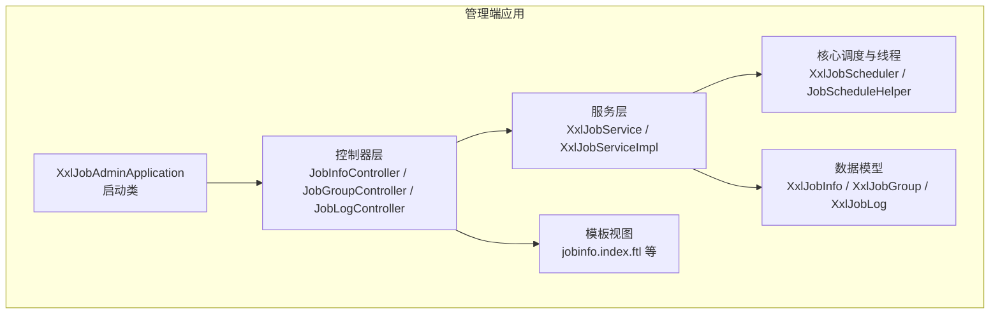
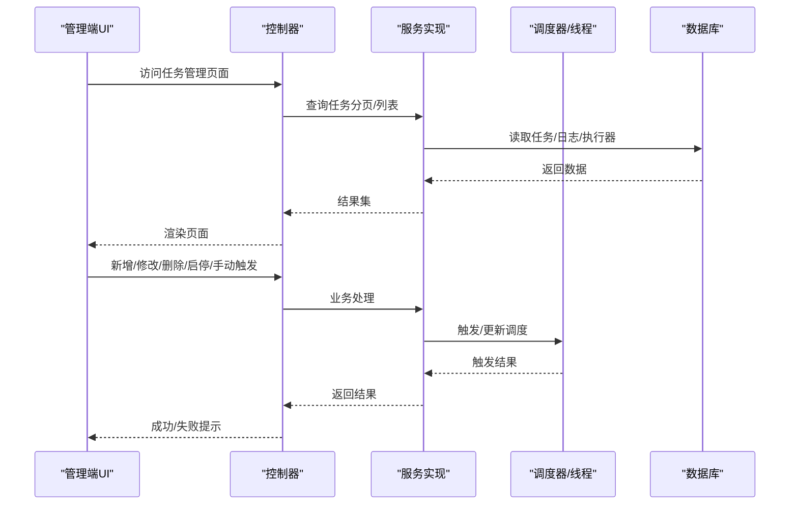
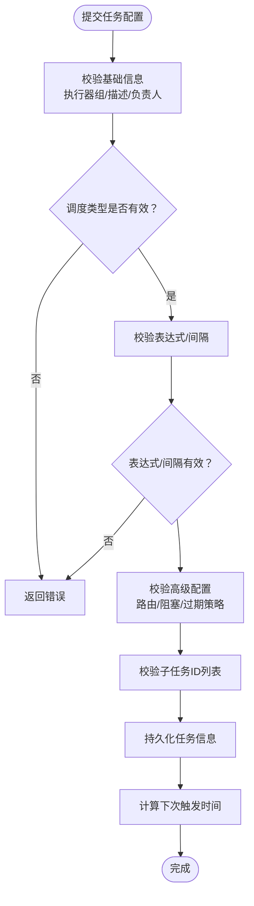
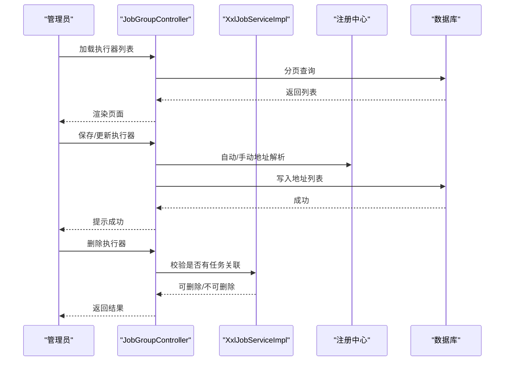
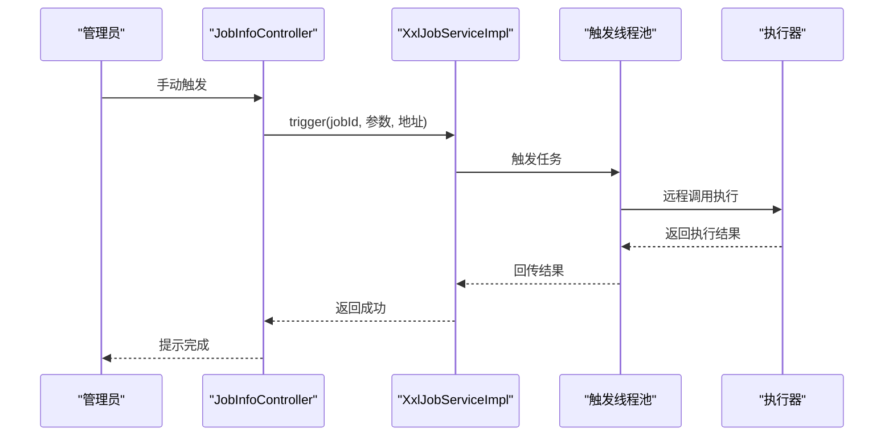
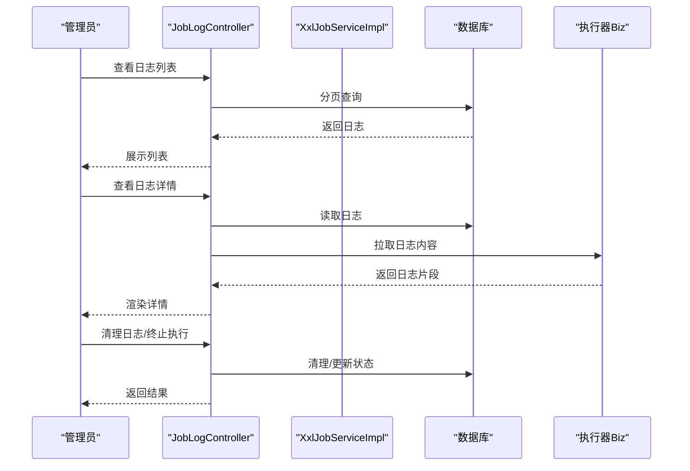
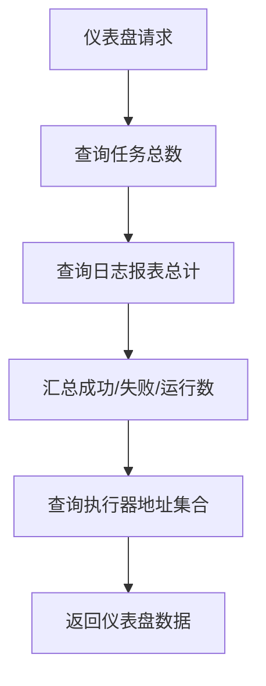
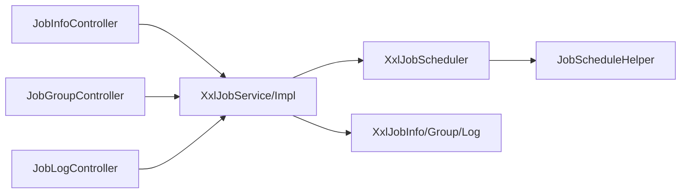

# 任务管理

<cite>
**本文引用的文件**
- [XxlJobAdminApplication.java](file://xxl-job-admin/src/main/java/com/xxl/job/admin/XxlJobAdminApplication.java)
- [JobInfoController.java](file://xxl-job-admin/src/main/java/com/xxl/job/admin/controller/JobInfoController.java)
- [JobGroupController.java](file://xxl-job-admin/src/main/java/com/xxl/job/admin/controller/JobGroupController.java)
- [JobLogController.java](file://xxl-job-admin/src/main/java/com/xxl/job/admin/controller/JobLogController.java)
- [XxlJobService.java](file://xxl-job-admin/src/main/java/com/xxl/job/admin/service/XxlJobService.java)
- [XxlJobServiceImpl.java](file://xxl-job-admin/src/main/java/com/xxl/job/admin/service/impl/XxlJobServiceImpl.java)
- [XxlJobInfo.java](file://xxl-job-admin/src/main/java/com/xxl/job/admin/core/model/XxlJobInfo.java)
- [XxlJobGroup.java](file://xxl-job-admin/src/main/java/com/xxl/job/admin/core/model/XxlJobGroup.java)
- [XxlJobLog.java](file://xxl-job-admin/src/main/java/com/xxl/job/admin/core/model/XxlJobLog.java)
- [jobinfo.index.ftl](file://xxl-job-admin/src/main/resources/templates/jobinfo/jobinfo.index.ftl)
- [XxlJobScheduler.java](file://xxl-job-admin/src/main/java/com/xxl/job/admin/core/scheduler/XxlJobScheduler.java)
- [JobScheduleHelper.java](file://xxl-job-admin/src/main/java/com/xxl/job/admin/core/thread/JobScheduleHelper.java)
- [application.properties](file://xxl-job-admin/src/main/resources/application.properties)
</cite>

## 目录
1. [简介](#简介)
2. [项目结构](#项目结构)
3. [核心组件](#核心组件)
4. [架构总览](#架构总览)
5. [详细组件分析](#详细组件分析)
6. [依赖分析](#依赖分析)
7. [性能考量](#性能考量)
8. [故障排查指南](#故障排查指南)
9. [结论](#结论)
10. [附录](#附录)

## 简介
本文件面向任务调度管理系统中的“任务管理”功能，基于 XXL-Job 管理界面，系统性梳理任务定义与配置、执行器管理、调度监控与控制、日志查看与分析、告警与统计、权限与安全、最佳实践与运维建议以及常见问题排查。文档以代码为依据，结合控制器、服务层、模型与模板，帮助读者快速理解并高效使用任务管理能力。

## 项目结构
XXL-Job 管理端采用 Spring Boot + FreeMarker 模板的典型分层结构：
- 控制器层：负责请求入口与页面渲染（如任务管理、执行器管理、日志管理）
- 服务层：封装业务逻辑（任务增删改查、启停、手动触发、统计图表）
- 核心线程与调度：负责定时扫描、时间轮触发、心跳与失败监控
- 数据模型：任务、执行器、日志等实体
- 模板：前端页面与交互（任务列表、新增/编辑弹窗、日志详情）

**图表来源**
- [XxlJobAdminApplication.java:10-14](file://xxl-job-admin/src/main/java/com/xxl/job/admin/XxlJobAdminApplication.java#L10-L14)
- [JobInfoController.java:35-68](file://xxl-job-admin/src/main/java/com/xxl/job/admin/controller/JobInfoController.java#L35-L68)
- [XxlJobServiceImpl.java:34-482](file://xxl-job-admin/src/main/java/com/xxl/job/admin/service/impl/XxlJobServiceImpl.java#L34-L482)
- [XxlJobScheduler.java:19-46](file://xxl-job-admin/src/main/java/com/xxl/job/admin/core/scheduler/XxlJobScheduler.java#L19-L46)
- [JobScheduleHelper.java:22-52](file://xxl-job-admin/src/main/java/com/xxl/job/admin/core/thread/JobScheduleHelper.java#L22-L52)
- [XxlJobInfo.java:10-238](file://xxl-job-admin/src/main/java/com/xxl/job/admin/core/model/XxlJobInfo.java#L10-L238)
- [XxlJobGroup.java:11-78](file://xxl-job-admin/src/main/java/com/xxl/job/admin/core/model/XxlJobGroup.java#L11-L78)
- [XxlJobLog.java:9-158](file://xxl-job-admin/src/main/java/com/xxl/job/admin/core/model/XxlJobLog.java#L9-L158)
- [jobinfo.index.ftl:10-106](file://xxl-job-admin/src/main/resources/templates/jobinfo/jobinfo.index.ftl#L10-L106)

**章节来源**
- [application.properties:1-3](file://xxl-job-admin/src/main/resources/application.properties#L1-L3)
- [XxlJobAdminApplication.java:10-14](file://xxl-job-admin/src/main/java/com/xxl/job/admin/XxlJobAdminApplication.java#L10-L14)

## 核心组件
- 任务控制器：提供任务列表、分页查询、新增、修改、删除、启停、手动触发、计算下次触发时间等接口
- 执行器控制器：提供执行器列表、分页查询、保存/更新、删除、按应用名加载等接口
- 日志控制器：提供日志列表、日志详情、日志内容拉取、日志清理、日志终止等接口
- 服务接口与实现：封装任务 CRUD、启停、手动触发、统计图表、仪表盘汇总等
- 核心调度：定时扫描、时间轮触发、过期策略、心跳与失败监控
- 数据模型：任务、执行器、日志等实体字段与关系
- 模板：任务管理页面、新增/编辑弹窗、日志详情页

**章节来源**
- [JobInfoController.java:35-156](file://xxl-job-admin/src/main/java/com/xxl/job/admin/controller/JobInfoController.java#L35-L156)
- [JobGroupController.java:26-205](file://xxl-job-admin/src/main/java/com/xxl/job/admin/controller/JobGroupController.java#L26-L205)
- [JobLogController.java:41-251](file://xxl-job-admin/src/main/java/com/xxl/job/admin/controller/JobLogController.java#L41-L251)
- [XxlJobService.java:16-99](file://xxl-job-admin/src/main/java/com/xxl/job/admin/service/XxlJobService.java#L16-L99)
- [XxlJobServiceImpl.java:34-482](file://xxl-job-admin/src/main/java/com/xxl/job/admin/service/impl/XxlJobServiceImpl.java#L34-L482)
- [XxlJobScheduler.java:19-46](file://xxl-job-admin/src/main/java/com/xxl/job/admin/core/scheduler/XxlJobScheduler.java#L19-L46)
- [JobScheduleHelper.java:22-52](file://xxl-job-admin/src/main/java/com/xxl/job/admin/core/thread/JobScheduleHelper.java#L22-L52)
- [XxlJobInfo.java:10-238](file://xxl-job-admin/src/main/java/com/xxl/job/admin/core/model/XxlJobInfo.java#L10-L238)
- [XxlJobGroup.java:11-78](file://xxl-job-admin/src/main/java/com/xxl/job/admin/core/model/XxlJobGroup.java#L11-L78)
- [XxlJobLog.java:9-158](file://xxl-job-admin/src/main/java/com/xxl/job/admin/core/model/XxlJobLog.java#L9-L158)
- [jobinfo.index.ftl:10-106](file://xxl-job-admin/src/main/resources/templates/jobinfo/jobinfo.index.ftl#L10-L106)

## 架构总览
XXL-Job 管理端通过控制器接收请求，调用服务层完成业务处理，并与核心调度线程协作实现定时触发与监控。前端模板负责展示任务、执行器、日志等信息。

**图表来源**
- [JobInfoController.java:70-126](file://xxl-job-admin/src/main/java/com/xxl/job/admin/controller/JobInfoController.java#L70-L126)
- [XxlJobServiceImpl.java:48-382](file://xxl-job-admin/src/main/java/com/xxl/job/admin/service/impl/XxlJobServiceImpl.java#L48-L382)
- [XxlJobScheduler.java:23-46](file://xxl-job-admin/src/main/java/com/xxl/job/admin/core/scheduler/XxlJobScheduler.java#L23-L46)
- [JobScheduleHelper.java:38-217](file://xxl-job-admin/src/main/java/com/xxl/job/admin/core/thread/JobScheduleHelper.java#L38-L217)

## 详细组件分析

### 任务定义与配置
- 关键配置项
  - 基础信息：所属执行器组、任务描述、负责人、报警邮箱
  - 调度配置：调度类型（CRON/固定频率）、调度表达式或间隔秒数、过期策略
  - 任务执行：GLUE 类型、JobHandler 名称、执行参数、超时时间、失败重试次数
  - 高级配置：路由策略、阻塞策略、子任务 ID 列表
  - 调度状态：0 停止、1 运行，下次/上次调度时间
- 表单与校验
  - 新增/编辑弹窗中对调度类型、表达式、GLUE 类型、路由/阻塞策略等进行校验
  - 支持手动计算下一次有效触发时间，辅助配置校验
- 后端校验
  - 服务实现对调度类型与表达式、GLUE 类型、路由/阻塞策略、子任务 ID 列表等进行严格校验
  - 修改时若调度未变更，直接沿用下次触发时间；若变更则重新计算

**图表来源**
- [XxlJobServiceImpl.java:64-164](file://xxl-job-admin/src/main/java/com/xxl/job/admin/service/impl/XxlJobServiceImpl.java#L64-L164)
- [XxlJobServiceImpl.java:176-299](file://xxl-job-admin/src/main/java/com/xxl/job/admin/service/impl/XxlJobServiceImpl.java#L176-L299)
- [jobinfo.index.ftl:118-234](file://xxl-job-admin/src/main/resources/templates/jobinfo/jobinfo.index.ftl#L118-L234)

**章节来源**
- [XxlJobInfo.java:10-238](file://xxl-job-admin/src/main/java/com/xxl/job/admin/core/model/XxlJobInfo.java#L10-L238)
- [XxlJobServiceImpl.java:64-164](file://xxl-job-admin/src/main/java/com/xxl/job/admin/service/impl/XxlJobServiceImpl.java#L64-L164)
- [XxlJobServiceImpl.java:176-299](file://xxl-job-admin/src/main/java/com/xxl/job/admin/service/impl/XxlJobServiceImpl.java#L176-L299)
- [jobinfo.index.ftl:118-234](file://xxl-job-admin/src/main/resources/templates/jobinfo/jobinfo.index.ftl#L118-L234)

### 任务执行器管理
- 执行器注册与发现
  - 自动注册：根据注册中心记录动态生成执行器地址列表
  - 手动录入：管理员可维护执行器地址列表
- 执行器列表与权限
  - 支持分页查询、按应用名/标题过滤
  - 删除前校验是否存在任务关联，且至少保留一个执行器
- 路由策略与心跳
  - 路由策略枚举在页面与服务端均可见
  - 心跳检测由注册线程负责，确保执行器在线状态

**图表来源**
- [JobGroupController.java:43-194](file://xxl-job-admin/src/main/java/com/xxl/job/admin/controller/JobGroupController.java#L43-L194)
- [XxlJobServiceImpl.java:39-61](file://xxl-job-admin/src/main/java/com/xxl/job/admin/service/impl/XxlJobServiceImpl.java#L39-L61)

**章节来源**
- [JobGroupController.java:26-205](file://xxl-job-admin/src/main/java/com/xxl/job/admin/controller/JobGroupController.java#L26-L205)
- [XxlJobGroup.java:11-78](file://xxl-job-admin/src/main/java/com/xxl/job/admin/core/model/XxlJobGroup.java#L11-L78)

### 任务调度监控与控制
- 手动触发：支持指定执行参数与地址列表，进行一次性触发
- 暂停/恢复：切换任务调度状态，更新下次触发时间
- 删除：级联删除任务、日志、GLUE 历史
- 下次触发时间计算：用于配置校验与预览

**图表来源**
- [JobInfoController.java:119-126](file://xxl-job-admin/src/main/java/com/xxl/job/admin/controller/JobInfoController.java#L119-L126)
- [XxlJobServiceImpl.java:362-382](file://xxl-job-admin/src/main/java/com/xxl/job/admin/service/impl/XxlJobServiceImpl.java#L362-L382)

**章节来源**
- [JobInfoController.java:79-126](file://xxl-job-admin/src/main/java/com/xxl/job/admin/controller/JobInfoController.java#L79-L126)
- [XxlJobServiceImpl.java:301-382](file://xxl-job-admin/src/main/java/com/xxl/job/admin/service/impl/XxlJobServiceImpl.java#L301-L382)

### 任务日志查看与分析
- 日志列表：支持按执行器组、任务、时间范围、状态筛选
- 日志详情：支持按日志 ID 查看，实时拉取执行器侧日志内容
- 日志清理：支持按时间或条数清理历史日志
- 日志终止：对正在执行的日志发起终止请求

**图表来源**
- [JobLogController.java:90-248](file://xxl-job-admin/src/main/java/com/xxl/job/admin/controller/JobLogController.java#L90-L248)
- [XxlJobScheduler.java:80-99](file://xxl-job-admin/src/main/java/com/xxl/job/admin/core/scheduler/XxlJobScheduler.java#L80-L99)

**章节来源**
- [JobLogController.java:41-251](file://xxl-job-admin/src/main/java/com/xxl/job/admin/controller/JobLogController.java#L41-L251)
- [XxlJobLog.java:9-158](file://xxl-job-admin/src/main/java/com/xxl/job/admin/core/model/XxlJobLog.java#L9-L158)

### 任务告警与统计
- 告警配置：任务级别可配置报警邮箱
- 统计与报表：仪表盘汇总任务数、日志总数、成功数、执行器数量；支持按日期聚合生成图表数据

**图表来源**
- [XxlJobServiceImpl.java:396-427](file://xxl-job-admin/src/main/java/com/xxl/job/admin/service/impl/XxlJobServiceImpl.java#L396-L427)
- [XxlJobServiceImpl.java:429-479](file://xxl-job-admin/src/main/java/com/xxl/job/admin/service/impl/XxlJobServiceImpl.java#L429-L479)

**章节来源**
- [XxlJobInfo.java:20-21](file://xxl-job-admin/src/main/java/com/xxl/job/admin/core/model/XxlJobInfo.java#L20-L21)
- [XxlJobServiceImpl.java:396-479](file://xxl-job-admin/src/main/java/com/xxl/job/admin/service/impl/XxlJobServiceImpl.java#L396-L479)

### 权限与安全管理
- 页面访问与操作权限：控制器通过拦截器校验用户权限，限制对执行器组的操作范围
- 登录用户校验：手动触发等操作需登录用户具备相应权限
- XSS 防护：日志内容输出前进行 HTML 转义，降低 XSS 风险

**章节来源**
- [JobInfoController.java:121-126](file://xxl-job-admin/src/main/java/com/xxl/job/admin/controller/JobInfoController.java#L121-L126)
- [JobLogController.java:160-166](file://xxl-job-admin/src/main/java/com/xxl/job/admin/controller/JobLogController.java#L160-L166)

## 依赖分析
- 控制器依赖服务接口，服务实现依赖 DAO 与核心调度线程
- 调度器内部维护执行器客户端缓存，避免重复创建
- 时间轮与调度线程通过数据库锁保证并发一致性

**图表来源**
- [JobInfoController.java:40-43](file://xxl-job-admin/src/main/java/com/xxl/job/admin/controller/JobInfoController.java#L40-L43)
- [JobGroupController.java:30-35](file://xxl-job-admin/src/main/java/com/xxl/job/admin/controller/JobGroupController.java#L30-L35)
- [JobLogController.java:46-51](file://xxl-job-admin/src/main/java/com/xxl/job/admin/controller/JobLogController.java#L46-L51)
- [XxlJobServiceImpl.java:37-46](file://xxl-job-admin/src/main/java/com/xxl/job/admin/service/impl/XxlJobServiceImpl.java#L37-L46)
- [XxlJobScheduler.java:80-99](file://xxl-job-admin/src/main/java/com/xxl/job/admin/core/scheduler/XxlJobScheduler.java#L80-L99)
- [JobScheduleHelper.java:22-52](file://xxl-job-admin/src/main/java/com/xxl/job/admin/core/thread/JobScheduleHelper.java#L22-L52)

**章节来源**
- [XxlJobServiceImpl.java:34-482](file://xxl-job-admin/src/main/java/com/xxl/job/admin/service/impl/XxlJobServiceImpl.java#L34-L482)
- [XxlJobScheduler.java:19-46](file://xxl-job-admin/src/main/java/com/xxl/job/admin/core/scheduler/XxlJobScheduler.java#L19-L46)

## 性能考量
- 预读策略：调度线程在每次扫描前预读一定数量的任务，提升吞吐
- 时间轮：将触发事件映射到秒级时间轮，减少轮询开销
- 并发控制：数据库使用排他锁保护调度扫描过程，避免重复触发
- 触发线程池：快慢池组合，配合过期策略与阻塞策略，平衡吞吐与延迟

[本节为通用性能讨论，不直接分析具体文件]

## 故障排查指南
- 任务无法触发
  - 检查调度类型与表达式是否有效
  - 确认任务处于“运行”状态且下次触发时间已到达
  - 查看过期策略与阻塞策略设置
- 手动触发失败
  - 核对登录用户权限与执行器地址列表
  - 检查执行器是否在线
- 日志为空或不完整
  - 使用日志详情页拉取最新日志
  - 如执行器未返回日志，检查网络与执行器日志路径
- 执行器离线
  - 检查注册中心心跳与地址列表
  - 执行器自动注册模式下，确认注册记录存在且地址合法

**章节来源**
- [XxlJobServiceImpl.java:314-357](file://xxl-job-admin/src/main/java/com/xxl/job/admin/service/impl/XxlJobServiceImpl.java#L314-L357)
- [JobLogController.java:139-172](file://xxl-job-admin/src/main/java/com/xxl/job/admin/controller/JobLogController.java#L139-L172)
- [JobGroupController.java:154-174](file://xxl-job-admin/src/main/java/com/xxl/job/admin/controller/JobGroupController.java#L154-L174)

## 结论
本系统围绕 XXL-Job 管理界面提供了完整的任务生命周期管理能力：从任务定义、执行器管理、调度控制、日志分析到告警与统计，覆盖了生产环境常见的运维场景。通过严格的参数校验、权限控制与安全防护，保障了任务管理的安全与稳定。

## 附录
- 最佳实践
  - 调度表达式优先使用 CRON，复杂场景再考虑固定频率
  - 明确任务超时与失败重试次数，避免长时间占用资源
  - 合理设置路由与阻塞策略，结合执行器规模选择最优方案
  - 定期清理历史日志，保持数据库健康
- 运维建议
  - 监控仪表盘与日志，关注失败率与平均耗时
  - 对关键任务配置报警邮箱，及时响应异常
  - 执行器扩容时优先使用自动注册，减少手工维护成本

[本节为通用建议，不直接分析具体文件]