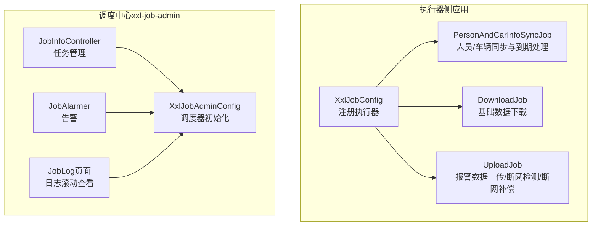
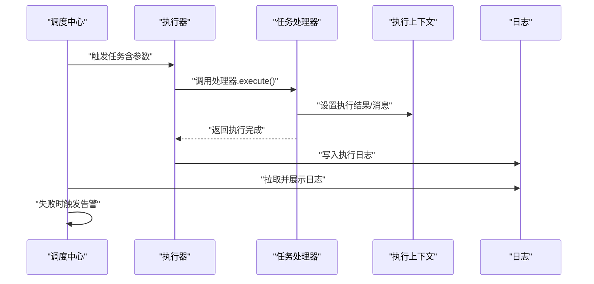
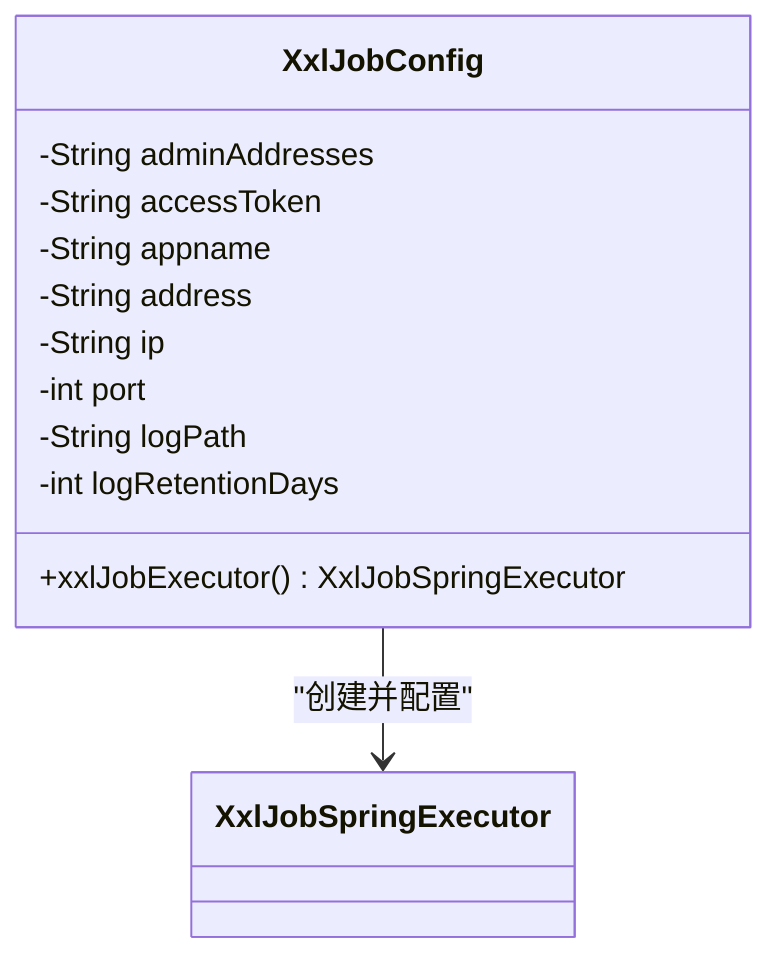
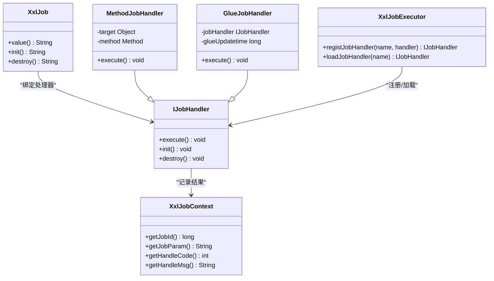
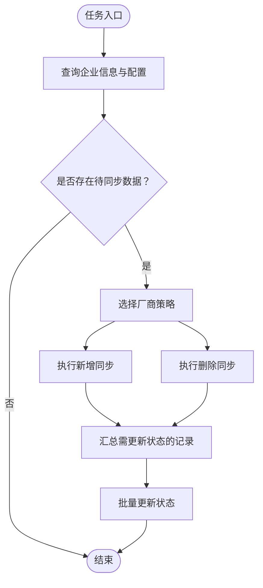
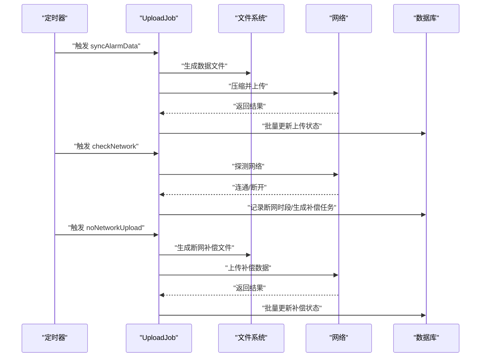
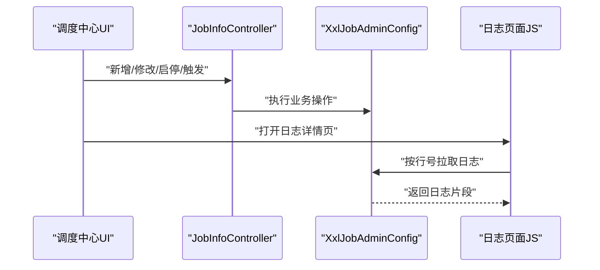
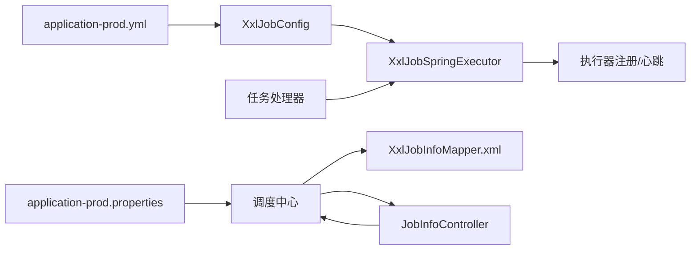

# 任务调度

<cite>
**本文引用的文件**   
- [XxlJobConfig.java](file://monkey-monitor-api/src/main/java/com/monkey/general/config/XxlJobConfig.java)
- [application-prod.yml](file://monkey-monitor-api/src/main/resources/application-prod.yml)
- [PersonAndCarInfoSyncJob.java](file://monkey-monitor-api/src/main/java/com/monkey/general/job/PersonAndCarInfoSyncJob.java)
- [DownloadJob.java](file://monkey-monitor-api/src/main/java/com/monkey/general/job/DownloadJob.java)
- [UploadJob.java](file://monkey-monitor-api/src/main/java/com/monkey/general/job/UploadJob.java)
- [XxlJob.java](file://xxl-job-core/src/main/java/com/xxl/job/core/handler/annotation/XxlJob.java)
- [IJobHandler.java](file://xxl-job-core/src/main/java/com/xxl/job/core/handler/IJobHandler.java)
- [MethodJobHandler.java](file://xxl-job-core/src/main/java/com/xxl/job/core/handler/impl/MethodJobHandler.java)
- [GlueJobHandler.java](file://xxl-job-core/src/main/java/com/xxl/job/core/handler/impl/GlueJobHandler.java)
- [XxlJobExecutor.java](file://xxl-job-core/src/main/java/com/xxl/job/core/executor/XxlJobExecutor.java)
- [XxlJobContext.java](file://xxl-job-core/src/main/java/com/xxl/job/core/context/XxlJobContext.java)
- [JobInfoController.java](file://xxl-job-admin/src/main/java/com/xxl/job/admin/controller/JobInfoController.java)
- [XxlJobAdminConfig.java](file://xxl-job-admin/src/main/java/com/xxl/job/admin/core/conf/XxlJobAdminConfig.java)
- [application-prod.properties（xxl-job-admin）](file://deploy/config/xxl-job-admin/application-prod.properties)
- [XxlJobInfoMapper.xml](file://xxl-job-admin/src/main/resources/mybatis-mapper/XxlJobInfoMapper.xml)
- [JobAlarmer.java](file://xxl-job-admin/src/main/java/com/xxl/job/admin/core/alarm/JobAlarmer.java)
- [joblog.detail.1.js](file://xxl-job-admin/src/main/resources/static/js/joblog.detail.1.js)
- [joblog.index.ftl](file://xxl-job-admin/src/main/resources/templates/joblog/joblog.index.ftl)
</cite>

## 目录
1. [简介](#简介)
2. [项目结构](#项目结构)
3. [核心组件](#核心组件)
4. [架构总览](#架构总览)
5. [详细组件分析](#详细组件分析)
6. [依赖分析](#依赖分析)
7. [性能考虑](#性能考虑)
8. [故障排查指南](#故障排查指南)
9. [结论](#结论)
10. [附录](#附录)

## 简介
本文件面向安威 fireworks 物联网监控平台的任务调度系统，系统基于 XXL-Job 构建分布式任务调度能力，覆盖设备数据同步、告警处理、数据上传/下载、断网补偿、人员/车辆到期处理等场景。本文从系统架构、配置管理、任务类型、扩展开发、性能优化与容错、监控与日志等方面进行深入解析，并提供最佳实践与常见问题解决方案。

## 项目结构
- 平台后端模块包含任务执行器侧（monkey-monitor-api）与调度中心（xxl-job-admin）两部分：
  - 任务执行器侧负责注册、加载与执行各类定时任务；
  - 调度中心负责任务编排、调度、日志与告警管理。

**图表来源**
- [XxlJobConfig.java:44-57](file://monkey-monitor-api/src/main/java/com/monkey/general/config/XxlJobConfig.java#L44-L57)
- [PersonAndCarInfoSyncJob.java:51-154](file://monkey-monitor-api/src/main/java/com/monkey/general/job/PersonAndCarInfoSyncJob.java#L51-L154)
- [DownloadJob.java:24-30](file://monkey-monitor-api/src/main/java/com/monkey/general/job/DownloadJob.java#L24-L30)
- [UploadJob.java:75-111](file://monkey-monitor-api/src/main/java/com/monkey/general/job/UploadJob.java#L75-L111)
- [JobInfoController.java:79-126](file://xxl-job-admin/src/main/java/com/xxl/job/admin/controller/JobInfoController.java#L79-L126)
- [XxlJobAdminConfig.java:35-46](file://xxl-job-admin/src/main/java/com/xxl/job/admin/core/conf/XxlJobAdminConfig.java#L35-L46)
- [JobAlarmer.java:44-63](file://xxl-job-admin/src/main/java/com/xxl/job/admin/core/alarm/JobAlarmer.java#L44-L63)
- [joblog.detail.1.js:1-41](file://xxl-job-admin/src/main/resources/static/js/joblog.detail.1.js#L1-L41)

**章节来源**
- [XxlJobConfig.java:15-57](file://monkey-monitor-api/src/main/java/com/monkey/general/config/XxlJobConfig.java#L15-L57)
- [application-prod.yml:116-135](file://monkey-monitor-api/src/main/resources/application-prod.yml#L116-L135)

## 核心组件
- 执行器配置与注册
  - 通过 Spring 配置类注册 XxlJobSpringExecutor，注入调度中心地址、令牌、应用名、IP/端口、日志路径与保留天数等参数。
- 任务处理器
  - 使用注解驱动的任务处理器，支持方法级任务与 Glue 在线脚本任务。
- 调度中心
  - 提供任务管理、启停、触发、日志查看与告警能力。

**章节来源**
- [XxlJobConfig.java:44-57](file://monkey-monitor-api/src/main/java/com/monkey/general/config/XxlJobConfig.java#L44-L57)
- [XxlJob.java:13-28](file://xxl-job-core/src/main/java/com/xxl/job/core/handler/annotation/XxlJob.java#L13-L28)
- [IJobHandler.java:16-35](file://xxl-job-core/src/main/java/com/xxl/job/core/handler/IJobHandler.java#L16-L35)
- [XxlJobExecutor.java:179-204](file://xxl-job-core/src/main/java/com/xxl/job/core/executor/XxlJobExecutor.java#L179-L204)

## 架构总览
下图展示 XXL-Job 在本项目中的整体交互：执行器启动时向调度中心注册，调度中心根据任务配置触发执行器上的任务处理器，任务处理器在执行上下文中记录执行结果与日志，调度中心负责日志持久化与可视化展示，并在失败时触发告警。

**图表来源**
- [XxlJobExecutor.java:179-204](file://xxl-job-core/src/main/java/com/xxl/job/core/executor/XxlJobExecutor.java#L179-L204)
- [XxlJobContext.java:94-108](file://xxl-job-core/src/main/java/com/xxl/job/core/context/XxlJobContext.java#L94-L108)
- [JobAlarmer.java:44-63](file://xxl-job-admin/src/main/java/com/xxl/job/admin/core/alarm/JobAlarmer.java#L44-L63)
- [joblog.detail.1.js:13-41](file://xxl-job-admin/src/main/resources/static/js/joblog.detail.1.js#L13-L41)

## 详细组件分析

### 执行器配置与注册（XxlJobConfig）
- 注入调度中心地址、访问令牌、应用名、IP/端口、日志路径与保留天数。
- 通过 Spring 容器暴露 XxlJobSpringExecutor Bean，完成自动注册与心跳。

**图表来源**
- [XxlJobConfig.java:19-56](file://monkey-monitor-api/src/main/java/com/monkey/general/config/XxlJobConfig.java#L19-L56)

**章节来源**
- [XxlJobConfig.java:44-57](file://monkey-monitor-api/src/main/java/com/monkey/general/config/XxlJobConfig.java#L44-L57)
- [application-prod.yml:116-135](file://monkey-monitor-api/src/main/resources/application-prod.yml#L116-L135)

### 任务处理器与执行上下文
- 任务处理器通过注解声明处理器名称，执行器根据名称加载对应处理器。
- 执行上下文承载任务 ID、参数、分片信息与执行结果，便于统一记录与展示。

**图表来源**
- [XxlJob.java:13-28](file://xxl-job-core/src/main/java/com/xxl/job/core/handler/annotation/XxlJob.java#L13-L28)
- [IJobHandler.java:16-35](file://xxl-job-core/src/main/java/com/xxl/job/core/handler/IJobHandler.java#L16-L35)
- [MethodJobHandler.java:17-32](file://xxl-job-core/src/main/java/com/xxl/job/core/handler/impl/MethodJobHandler.java#L17-L32)
- [GlueJobHandler.java:15-27](file://xxl-job-core/src/main/java/com/xxl/job/core/handler/impl/GlueJobHandler.java#L15-L27)
- [XxlJobExecutor.java:179-204](file://xxl-job-core/src/main/java/com/xxl/job/core/executor/XxlJobExecutor.java#L179-L204)
- [XxlJobContext.java:64-108](file://xxl-job-core/src/main/java/com/xxl/job/core/context/XxlJobContext.java#L64-L108)

**章节来源**
- [XxlJob.java:13-28](file://xxl-job-core/src/main/java/com/xxl/job/core/handler/annotation/XxlJob.java#L13-L28)
- [MethodJobHandler.java:26-33](file://xxl-job-core/src/main/java/com/xxl/job/core/handler/impl/MethodJobHandler.java#L26-L33)
- [GlueJobHandler.java:24-27](file://xxl-job-core/src/main/java/com/xxl/job/core/handler/impl/GlueJobHandler.java#L24-L27)
- [XxlJobExecutor.java:186-204](file://xxl-job-core/src/main/java/com/xxl/job/core/executor/XxlJobExecutor.java#L186-L204)
- [XxlJobContext.java:94-108](file://xxl-job-core/src/main/java/com/xxl/job/core/context/XxlJobContext.java#L94-L108)

### 内置任务类型与实现

#### 设备数据同步与到期处理（人员/车辆）
- 人员同步：按企业配置选择厂商策略，执行新增与删除同步，并批量更新状态字段。
- 车辆同步：与人员同步类似，针对车辆实体执行新增/删除同步。
- 到期处理：对人员与车辆的过期记录进行标记删除并重置同步状态。

**图表来源**
- [PersonAndCarInfoSyncJob.java:52-154](file://monkey-monitor-api/src/main/java/com/monkey/general/job/PersonAndCarInfoSyncJob.java#L52-L154)
- [PersonAndCarInfoSyncJob.java:158-233](file://monkey-monitor-api/src/main/java/com/monkey/general/job/PersonAndCarInfoSyncJob.java#L158-L233)
- [PersonAndCarInfoSyncJob.java:236-311](file://monkey-monitor-api/src/main/java/com/monkey/general/job/PersonAndCarInfoSyncJob.java#L236-L311)

**章节来源**
- [PersonAndCarInfoSyncJob.java:51-154](file://monkey-monitor-api/src/main/java/com/monkey/general/job/PersonAndCarInfoSyncJob.java#L51-L154)
- [PersonAndCarInfoSyncJob.java:157-233](file://monkey-monitor-api/src/main/java/com/monkey/general/job/PersonAndCarInfoSyncJob.java#L157-L233)
- [PersonAndCarInfoSyncJob.java:235-311](file://monkey-monitor-api/src/main/java/com/monkey/general/job/PersonAndCarInfoSyncJob.java#L235-L311)

#### 基础数据下载（DownloadJob）
- 定时触发下载服务，执行基础数据同步。

**章节来源**
- [DownloadJob.java:24-30](file://monkey-monitor-api/src/main/java/com/monkey/general/job/DownloadJob.java#L24-L30)

#### 报警数据上传与断网处理（UploadJob）
- 实时上传报警数据：生成数据文件、压缩、HTTP 上传、成功后批量更新上传状态。
- 断网检测：周期性探测网络连通性，记录断网时段并生成断网补偿任务。
- 断网补偿：按断网时段切片生成数据文件并上传，完成后更新任务状态。

**图表来源**
- [UploadJob.java:75-111](file://monkey-monitor-api/src/main/java/com/monkey/general/job/UploadJob.java#L75-L111)
- [UploadJob.java:114-157](file://monkey-monitor-api/src/main/java/com/monkey/general/job/UploadJob.java#L114-L157)
- [UploadJob.java:161-197](file://monkey-monitor-api/src/main/java/com/monkey/general/job/UploadJob.java#L161-L197)

**章节来源**
- [UploadJob.java:75-111](file://monkey-monitor-api/src/main/java/com/monkey/general/job/UploadJob.java#L75-L111)
- [UploadJob.java:114-157](file://monkey-monitor-api/src/main/java/com/monkey/general/job/UploadJob.java#L114-L157)
- [UploadJob.java:161-197](file://monkey-monitor-api/src/main/java/com/monkey/general/job/UploadJob.java#L161-L197)

### 调度中心管理与监控
- 任务管理：提供任务增删改查、启停、手动触发、计算下次触发时间等能力。
- 日志查看：支持滚动日志拉取、按行号增量拉取，便于实时观测任务执行过程。
- 告警：失败时触发告警流程，可扩展多种告警方式。

**图表来源**
- [JobInfoController.java:79-126](file://xxl-job-admin/src/main/java/com/xxl/job/admin/controller/JobInfoController.java#L79-L126)
- [XxlJobAdminConfig.java:35-46](file://xxl-job-admin/src/main/java/com/xxl/job/admin/core/conf/XxlJobAdminConfig.java#L35-L46)
- [joblog.detail.1.js:13-41](file://xxl-job-admin/src/main/resources/static/js/joblog.detail.1.js#L13-L41)

**章节来源**
- [JobInfoController.java:79-126](file://xxl-job-admin/src/main/java/com/xxl/job/admin/controller/JobInfoController.java#L79-L126)
- [XxlJobAdminConfig.java:35-46](file://xxl-job-admin/src/main/java/com/xxl/job/admin/core/conf/XxlJobAdminConfig.java#L35-L46)
- [joblog.detail.1.js:1-41](file://xxl-job-admin/src/main/resources/static/js/joblog.detail.1.js#L1-L41)
- [joblog.index.ftl:55-85](file://xxl-job-admin/src/main/resources/templates/joblog/joblog.index.ftl#L55-L85)

## 依赖分析
- 执行器侧依赖
  - Spring Boot 自动装配与配置文件提供执行器参数；
  - XXL-Job 执行器负责注册与任务加载；
  - 业务任务通过注解绑定处理器名称，执行器按名称加载执行。
- 调度中心依赖
  - 数据源与邮件配置用于任务持久化与告警；
  - 控制器提供任务管理接口；
  - 日志模板与前端 JS 支持日志滚动查看。

**图表来源**
- [application-prod.yml:116-135](file://monkey-monitor-api/src/main/resources/application-prod.yml#L116-L135)
- [XxlJobConfig.java:44-57](file://monkey-monitor-api/src/main/java/com/monkey/general/config/XxlJobConfig.java#L44-L57)
- [XxlJobExecutor.java:179-204](file://xxl-job-core/src/main/java/com/xxl/job/core/executor/XxlJobExecutor.java#L179-L204)
- [application-prod.properties（xxl-job-admin）:25-65](file://deploy/config/xxl-job-admin/application-prod.properties#L25-L65)
- [XxlJobInfoMapper.xml:1-30](file://xxl-job-admin/src/main/resources/mybatis-mapper/XxlJobInfoMapper.xml#L1-L30)
- [JobInfoController.java:79-126](file://xxl-job-admin/src/main/java/com/xxl/job/admin/controller/JobInfoController.java#L79-L126)

**章节来源**
- [application-prod.yml:116-135](file://monkey-monitor-api/src/main/resources/application-prod.yml#L116-L135)
- [application-prod.properties（xxl-job-admin）:25-65](file://deploy/config/xxl-job-admin/application-prod.properties#L25-L65)
- [XxlJobInfoMapper.xml:1-30](file://xxl-job-admin/src/main/resources/mybatis-mapper/XxlJobInfoMapper.xml#L1-L30)

## 性能考虑
- 触发线程池容量
  - 调度中心可通过配置调整快速/慢速触发线程池上限，避免高并发下的资源瓶颈。
- 日志保留策略
  - 执行器与调度中心均支持日志保留天数配置，定期清理过期日志，降低磁盘占用。
- 任务批处理
  - 人员/车辆同步与上传任务采用批量更新，减少数据库往返次数。
- 网络超时与重试
  - 上传任务设置合理超时与错误处理，断网补偿按时间段切片上传，提升稳定性。

**章节来源**
- [application-prod.properties（xxl-job-admin）:61-65](file://deploy/config/xxl-job-admin/application-prod.properties#L61-L65)
- [application-prod.yml:132-134](file://monkey-monitor-api/src/main/resources/application-prod.yml#L132-L134)
- [UploadJob.java:97-106](file://monkey-monitor-api/src/main/java/com/monkey/general/job/UploadJob.java#L97-L106)

## 故障排查指南
- 任务未触发
  - 检查执行器是否正确注册、调度中心地址与令牌配置是否一致。
- 任务执行失败
  - 查看调度中心日志详情页，确认失败原因与异常堆栈；必要时增加任务内的异常捕获与告警。
- 日志无法滚动
  - 确认前端 JS 的日志拉取逻辑与后端接口返回一致性；检查日志文件路径与权限。
- 告警未到达
  - 检查调度中心告警组件是否启用与配置正确；确认告警目标配置。

**章节来源**
- [joblog.detail.1.js:13-41](file://xxl-job-admin/src/main/resources/static/js/joblog.detail.1.js#L13-L41)
- [JobAlarmer.java:44-63](file://xxl-job-admin/src/main/java/com/xxl/job/admin/core/alarm/JobAlarmer.java#L44-L63)

## 结论
本系统以 XXL-Job 为核心，结合执行器侧的任务编排与调度中心的统一管理，实现了设备数据同步、报警上传、断网补偿、到期处理等关键自动化场景。通过合理的配置与日志/告警体系，系统具备良好的可观测性与可维护性。后续可在现有注解驱动与 Glue 能力基础上，按需扩展新任务类型与执行策略。

## 附录

### 任务调度配置管理要点
- 执行器参数
  - 调度中心地址、访问令牌、应用名、IP/端口、日志路径与保留天数。
- 调度中心参数
  - 数据源、邮件、触发线程池大小、日志保留天数等。

**章节来源**
- [application-prod.yml:116-135](file://monkey-monitor-api/src/main/resources/application-prod.yml#L116-L135)
- [application-prod.properties（xxl-job-admin）:25-65](file://deploy/config/xxl-job-admin/application-prod.properties#L25-L65)

### 自定义任务开发指南
- 任务接口定义
  - 使用注解声明处理器名称，确保名称唯一且与调度中心配置一致。
- 执行逻辑编写
  - 在任务方法中完成数据准备、调用服务与结果更新；必要时使用执行上下文记录结果。
- 异常处理
  - 包裹关键步骤并记录异常日志；对于可恢复错误可增加重试或转为补偿任务。

**章节来源**
- [XxlJob.java:13-28](file://xxl-job-core/src/main/java/com/xxl/job/core/handler/annotation/XxlJob.java#L13-L28)
- [IJobHandler.java:16-35](file://xxl-job-core/src/main/java/com/xxl/job/core/handler/IJobHandler.java#L16-L35)
- [XxlJobContext.java:94-108](file://xxl-job-core/src/main/java/com/xxl/job/core/context/XxlJobContext.java#L94-L108)

### 任务监控与日志管理
- 执行器日志
  - 通过执行器配置的日志路径与保留天数管理本地日志。
- 调度中心日志
  - 提供日志详情页与滚动拉取，支持按行号增量拉取，便于实时观测。

**章节来源**
- [application-prod.yml:132-134](file://monkey-monitor-api/src/main/resources/application-prod.yml#L132-L134)
- [joblog.detail.1.js:13-41](file://xxl-job-admin/src/main/resources/static/js/joblog.detail.1.js#L13-L41)

### 最佳实践与常见问题
- 最佳实践
  - 明确任务粒度与幂等设计；合理设置调度频率与超时；使用批处理与异步上传；完善异常与告警。
- 常见问题
  - 执行器未注册：核对地址与令牌；任务名称冲突：确保处理器名称唯一；日志不显示：检查前端拉取与后端接口。

**章节来源**
- [XxlJobExecutor.java:195-200](file://xxl-job-core/src/main/java/com/xxl/job/core/executor/XxlJobExecutor.java#L195-L200)
- [joblog.detail.1.js:13-41](file://xxl-job-admin/src/main/resources/static/js/joblog.detail.1.js#L13-L41)