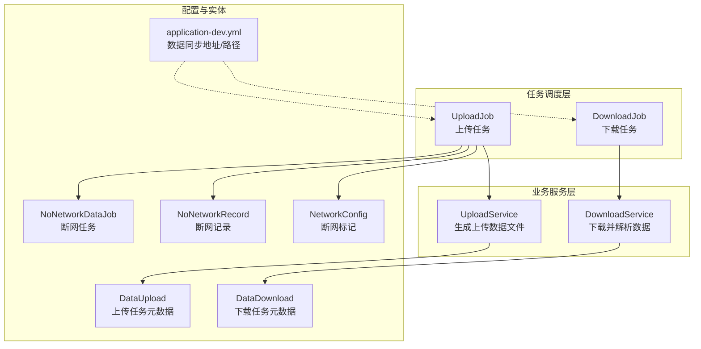
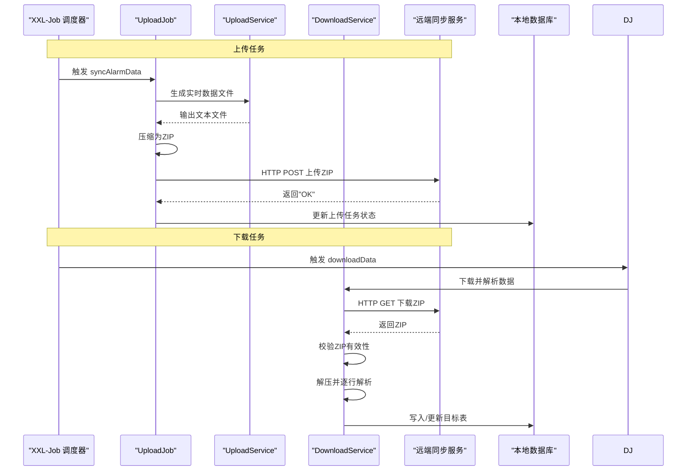
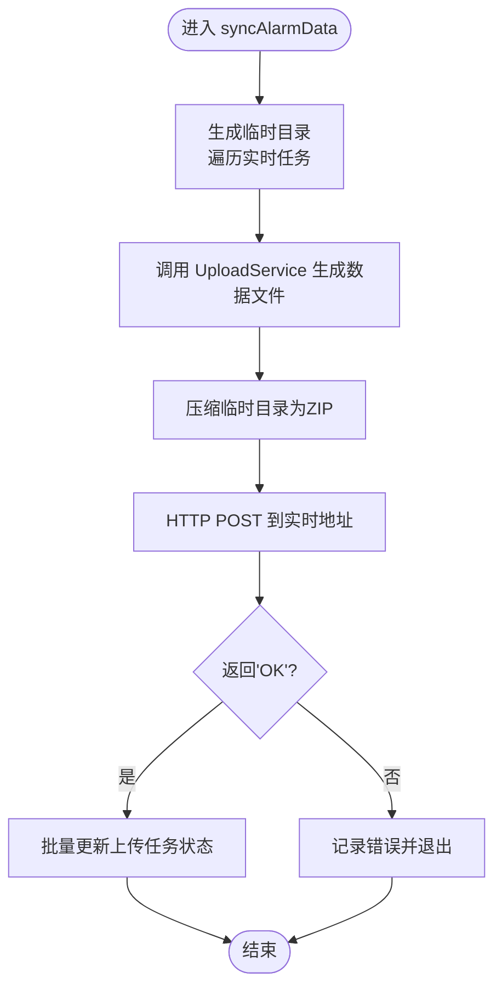
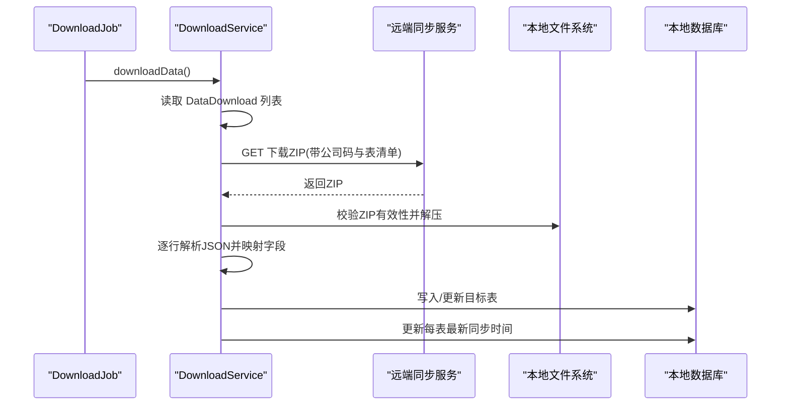
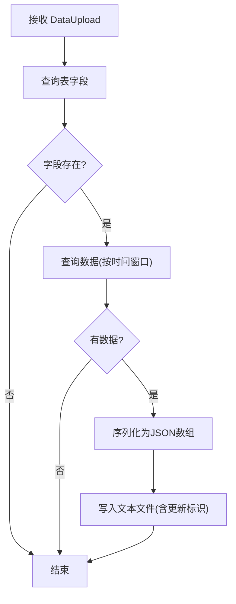
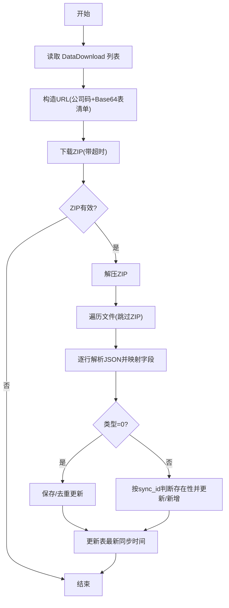
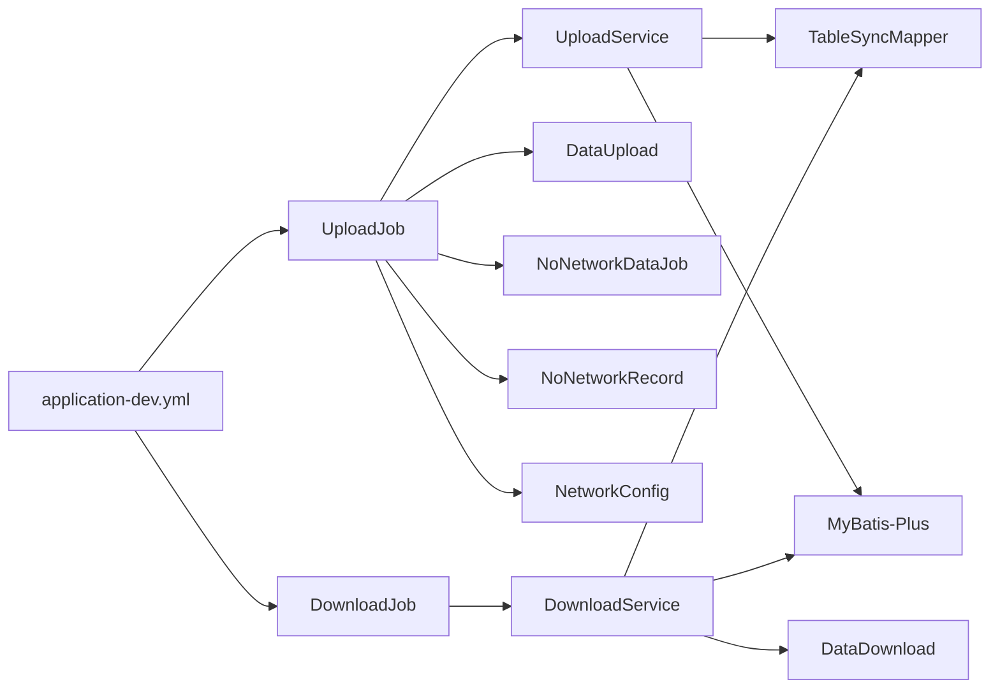

# 上传下载任务

<cite>
**本文引用的文件**
- [UploadJob.java](file://monkey-monitor-api/src/main/java/com/monkey/general/job/UploadJob.java)
- [DownloadJob.java](file://monkey-monitor-api/src/main/java/com/monkey/general/job/DownloadJob.java)
- [UploadService.java](file://monkey-service/src/main/java/com/monkey/general/modules/data/service/impl/UploadService.java)
- [DownloadService.java](file://monkey-service/src/main/java/com/monkey/general/modules/data/service/impl/DownloadService.java)
- [NetworkConfig.java](file://monkey-monitor/src/main/java/com/monkey/general/config/NetworkConfig.java)
- [application-dev.yml](file://monkey-monitor-api/src/main/resources/application-dev.yml)
- [application.yml](file://monkey-monitor-api/src/main/resources/application.yml)
- [DataUpload.java](file://monkey-service/src/main/java/com/monkey/general/modules/data/entity/DataUpload.java)
- [DataDownload.java](file://monkey-service/src/main/java/com/monkey/general/modules/data/entity/DataDownload.java)
- [NoNetworkDataJob.java](file://monkey-service/src/main/java/com/monkey/general/modules/bz/entity/NoNetworkDataJob.java)
- [NoNetworkRecord.java](file://monkey-service/src/main/java/com/monkey/general/modules/bz/entity/NoNetworkRecord.java)
</cite>

## 目录
1. [简介](#简介)
2. [项目结构](#项目结构)
3. [核心组件](#核心组件)
4. [架构总览](#架构总览)
5. [详细组件分析](#详细组件分析)
6. [依赖关系分析](#依赖关系分析)
7. [性能考虑](#性能考虑)
8. [故障排查指南](#故障排查指南)
9. [结论](#结论)
10. [附录](#附录)

## 简介
本文件围绕上传下载任务展开，系统性梳理 UploadJob 与 DownloadJob 两大核心任务类的实现原理与数据传输机制。内容涵盖：
- 上传任务工作流：数据准备、文件打包、传输协议选择、网络传输与结果反馈
- 下载任务实现：远程数据获取、本地存储管理、文件解压与数据解析、完整性校验与错误恢复
- 配置参数：传输超时、重试策略、并发控制等关键设置
- 执行状态监控与进度跟踪
- 安全性保障：数据加密、完整性校验、传输验证
- 异常处理与恢复策略：网络中断、数据冲突、资源清理
- 性能优化建议与最佳实践

## 项目结构
围绕上传下载任务的相关模块与文件分布如下：
- 任务调度层：UploadJob、DownloadJob（基于 XXL-Job 注解）
- 业务服务层：UploadService、DownloadService（负责数据生成、解析、落库）
- 配置层：application-dev.yml 中定义数据同步相关地址与路径
- 实体层：DataUpload、DataDownload、NoNetworkDataJob、NoNetworkRecord（描述任务元数据与断网任务）
- 网络状态：NetworkConfig（断网标记）

图表来源
- [UploadJob.java:1-203](file://monkey-monitor-api/src/main/java/com/monkey/general/job/UploadJob.java#L1-L203)
- [DownloadJob.java:1-43](file://monkey-monitor-api/src/main/java/com/monkey/general/job/DownloadJob.java#L1-L43)
- [UploadService.java:1-80](file://monkey-service/src/main/java/com/monkey/general/modules/data/service/impl/UploadService.java#L1-L80)
- [DownloadService.java:1-204](file://monkey-service/src/main/java/com/monkey/general/modules/data/service/impl/DownloadService.java#L1-L204)
- [application-dev.yml:100-116](file://monkey-monitor-api/src/main/resources/application-dev.yml#L100-L116)
- [DataUpload.java:1-83](file://monkey-service/src/main/java/com/monkey/general/modules/data/entity/DataUpload.java#L1-L83)
- [DataDownload.java:1-71](file://monkey-service/src/main/java/com/monkey/general/modules/data/entity/DataDownload.java#L1-L71)
- [NoNetworkDataJob.java:1-77](file://monkey-service/src/main/java/com/monkey/general/modules/bz/entity/NoNetworkDataJob.java#L1-L77)
- [NoNetworkRecord.java:1-70](file://monkey-service/src/main/java/com/monkey/general/modules/bz/entity/NoNetworkRecord.java#L1-L70)
- [NetworkConfig.java:1-10](file://monkey-monitor/src/main/java/com/monkey/general/config/NetworkConfig.java#L1-L10)

章节来源
- [UploadJob.java:1-203](file://monkey-monitor-api/src/main/java/com/monkey/general/job/UploadJob.java#L1-L203)
- [DownloadJob.java:1-43](file://monkey-monitor-api/src/main/java/com/monkey/general/job/DownloadJob.java#L1-L43)
- [application-dev.yml:100-116](file://monkey-monitor-api/src/main/resources/application-dev.yml#L100-L116)

## 核心组件
- UploadJob：负责实时上传与断网数据补传，结合网络检测与断网任务生成，通过 HTTP 协议上传压缩包。
- DownloadJob：负责定时从远端下载压缩包，解压并逐行解析写入本地数据库。
- UploadService：根据 DataUpload 配置生成对应表的数据文件，按时间窗口与字段映射输出文本文件。
- DownloadService：根据 DataDownload 配置构造下载请求，下载 ZIP 包，校验有效性后解压，逐行解析并落库。

章节来源
- [UploadJob.java:75-111](file://monkey-monitor-api/src/main/java/com/monkey/general/job/UploadJob.java#L75-L111)
- [UploadJob.java:114-157](file://monkey-monitor-api/src/main/java/com/monkey/general/job/UploadJob.java#L114-L157)
- [UploadJob.java:161-197](file://monkey-monitor-api/src/main/java/com/monkey/general/job/UploadJob.java#L161-L197)
- [DownloadJob.java:24-30](file://monkey-monitor-api/src/main/java/com/monkey/general/job/DownloadJob.java#L24-L30)
- [UploadService.java:35-78](file://monkey-service/src/main/java/com/monkey/general/modules/data/service/impl/UploadService.java#L35-L78)
- [DownloadService.java:70-125](file://monkey-service/src/main/java/com/monkey/general/modules/data/service/impl/DownloadService.java#L70-L125)

## 架构总览
上传下载任务采用“任务调度 + 业务服务 + 配置驱动”的分层设计，XXL-Job 提供调度入口，Hutool 工具链负责文件与网络操作，MyBatis-Plus 负责数据持久化。

图表来源
- [UploadJob.java:75-111](file://monkey-monitor-api/src/main/java/com/monkey/general/job/UploadJob.java#L75-L111)
- [UploadService.java:35-78](file://monkey-service/src/main/java/com/monkey/general/modules/data/service/impl/UploadService.java#L35-L78)
- [DownloadService.java:70-125](file://monkey-service/src/main/java/com/monkey/general/modules/data/service/impl/DownloadService.java#L70-L125)

## 详细组件分析

### UploadJob 组件分析
职责与流程
- 实时上传：收集配置为“实时”的数据源，生成数据文件，压缩后通过 HTTP POST 发送到远端实时接口。
- 网络检测：周期性探测远端网络可用性，若恢复则生成断网期间的任务切片。
- 断网补传：从断网任务表中取出待处理项，生成对应数据文件并上传至断网接口。

关键点
- 使用 Hutool 的文件与 HTTP 工具进行打包与传输。
- 通过 DataUpload 的 isInsert/isUpdate 字段决定是否生成文件。
- 通过 NoNetworkDataJob 与 NoNetworkRecord 维护断网期间的任务切片与状态。

图表来源
- [UploadJob.java:75-111](file://monkey-monitor-api/src/main/java/com/monkey/general/job/UploadJob.java#L75-L111)
- [UploadService.java:35-78](file://monkey-service/src/main/java/com/monkey/general/modules/data/service/impl/UploadService.java#L35-L78)

章节来源
- [UploadJob.java:75-111](file://monkey-monitor-api/src/main/java/com/monkey/general/job/UploadJob.java#L75-L111)
- [UploadJob.java:114-157](file://monkey-monitor-api/src/main/java/com/monkey/general/job/UploadJob.java#L114-L157)
- [UploadJob.java:161-197](file://monkey-monitor-api/src/main/java/com/monkey/general/job/UploadJob.java#L161-L197)
- [DataUpload.java:42-46](file://monkey-service/src/main/java/com/monkey/general/modules/data/entity/DataUpload.java#L42-L46)

### DownloadJob 组件分析
职责与流程
- 定时触发：通过 XXL-Job 触发 downloadData。
- 下载与解析：根据 DataDownload 配置构造请求，下载 ZIP 并校验有效性，解压后逐行解析，按类型写入或更新目标表，并维护每张表的最新同步时间。

关键点
- 使用 Base64 编码表清单参数，拼接到下载 URL。
- 通过正则识别时间戳字段，统一转换为日期类型。
- 支持两种写入模式：全量/去重插入与增量更新。

图表来源
- [DownloadJob.java:24-30](file://monkey-monitor-api/src/main/java/com/monkey/general/job/DownloadJob.java#L24-L30)
- [DownloadService.java:70-125](file://monkey-service/src/main/java/com/monkey/general/modules/data/service/impl/DownloadService.java#L70-L125)

章节来源
- [DownloadJob.java:24-30](file://monkey-monitor-api/src/main/java/com/monkey/general/job/DownloadJob.java#L24-L30)
- [DownloadService.java:70-125](file://monkey-service/src/main/java/com/monkey/general/modules/data/service/impl/DownloadService.java#L70-L125)

### UploadService 组件分析
职责与流程
- 依据 DataUpload 的表名、企业编码、时间窗口与字段集合，查询并导出数据为文本文件。
- 自动识别常见时间字段，确保输出格式一致。

关键点
- 通过 TableSyncMapper 获取表字段与数据。
- 输出文件命名包含表名与更新标识，便于后续处理。

图表来源
- [UploadService.java:35-78](file://monkey-service/src/main/java/com/monkey/general/modules/data/service/impl/UploadService.java#L35-L78)

章节来源
- [UploadService.java:35-78](file://monkey-service/src/main/java/com/monkey/general/modules/data/service/impl/UploadService.java#L35-L78)

### DownloadService 组件分析
职责与流程
- 构造下载请求，下载 ZIP 并校验有效性。
- 解压后按文件名映射表名，逐行解析 JSON，进行字段大小写映射与时间戳转换。
- 根据类型执行保存或更新逻辑，并维护每表的最新同步时间。

关键点
- 使用正则匹配时间戳字段，统一转换为日期。
- 支持“基础数据”和“动态数据”两类写入策略。
- 对异常进行捕获并记录日志，保证任务可继续执行。

图表来源
- [DownloadService.java:70-125](file://monkey-service/src/main/java/com/monkey/general/modules/data/service/impl/DownloadService.java#L70-L125)
- [DownloadService.java:138-187](file://monkey-service/src/main/java/com/monkey/general/modules/data/service/impl/DownloadService.java#L138-L187)

章节来源
- [DownloadService.java:70-125](file://monkey-service/src/main/java/com/monkey/general/modules/data/service/impl/DownloadService.java#L70-L125)
- [DownloadService.java:138-187](file://monkey-service/src/main/java/com/monkey/general/modules/data/service/impl/DownloadService.java#L138-L187)

## 依赖关系分析
- UploadJob 依赖 UploadService、DataUpload、NoNetworkDataJob、NoNetworkRecord、NetworkConfig。
- DownloadJob 依赖 DownloadService、DataDownload。
- UploadService/DownloadService 依赖 TableSyncMapper/TableSyncService 与 MyBatis-Plus。
- 配置由 application-dev.yml 提供，包含数据文件路径、下载/上传/网络检测地址以及 XXL-Job 执行器配置。

图表来源
- [UploadJob.java:61-72](file://monkey-monitor-api/src/main/java/com/monkey/general/job/UploadJob.java#L61-L72)
- [DownloadJob.java:20-21](file://monkey-monitor-api/src/main/java/com/monkey/general/job/DownloadJob.java#L20-L21)
- [UploadService.java:32-33](file://monkey-service/src/main/java/com/monkey/general/modules/data/service/impl/UploadService.java#L32-L33)
- [DownloadService.java:57-64](file://monkey-service/src/main/java/com/monkey/general/modules/data/service/impl/DownloadService.java#L57-L64)
- [application-dev.yml:100-116](file://monkey-monitor-api/src/main/resources/application-dev.yml#L100-L116)

章节来源
- [UploadJob.java:61-72](file://monkey-monitor-api/src/main/java/com/monkey/general/job/UploadJob.java#L61-L72)
- [DownloadJob.java:20-21](file://monkey-monitor-api/src/main/java/com/monkey/general/job/DownloadJob.java#L20-L21)
- [application-dev.yml:100-116](file://monkey-monitor-api/src/main/resources/application-dev.yml#L100-L116)

## 性能考虑
- 文件压缩与传输
  - 建议在生成数据文件后按表拆分压缩，减少单次传输体积，提升失败重试效率。
  - 传输超时设置需结合网络状况调整，避免长时间阻塞。
- 数据生成
  - UploadService 在生成文件前先查询表字段，建议对常用表建立缓存，降低重复查询开销。
- 解析与入库
  - DownloadService 逐行解析 JSON，建议在入库前进行批量写入或合并事务，减少往返次数。
- 并发与调度
  - XXL-Job 执行器端口与日志路径已在配置中定义，可根据资源情况调整执行器数量与日志保留策略。
- I/O 与磁盘
  - 临时目录路径在配置中定义，建议定期清理旧文件，避免磁盘压力过大。

## 故障排查指南
常见问题与处理
- 上传失败
  - 检查实时上传地址可达性与返回值，确认返回为约定字符串。
  - 若网络异常，检查断网检测逻辑与断网任务生成。
- 下载失败
  - 校验 ZIP 文件有效性，确认解压过程无异常。
  - 检查表清单参数是否正确（Base64 编码）。
- 数据冲突
  - 下载任务支持按类型区分写入策略，确认类型配置与业务需求一致。
  - 时间戳字段识别依赖正则，确保远端时间戳格式符合预期。
- 资源清理
  - 上传成功后及时更新任务状态，避免重复上传。
  - 下载完成后清理临时目录，释放磁盘空间。

章节来源
- [UploadJob.java:97-105](file://monkey-monitor-api/src/main/java/com/monkey/general/job/UploadJob.java#L97-L105)
- [UploadJob.java:182-190](file://monkey-monitor-api/src/main/java/com/monkey/general/job/UploadJob.java#L182-L190)
- [DownloadService.java:127-135](file://monkey-service/src/main/java/com/monkey/general/modules/data/service/impl/DownloadService.java#L127-L135)
- [DownloadService.java:184-186](file://monkey-service/src/main/java/com/monkey/general/modules/data/service/impl/DownloadService.java#L184-L186)

## 结论
本方案通过清晰的分层设计与明确的职责划分，实现了上传与下载任务的自动化与可运维性。UploadJob 与 DownloadJob 分别覆盖实时与离线场景，UploadService 与 DownloadService 提供稳定的数据生成与解析能力。配合配置化的网络地址与路径，系统具备良好的扩展性与可移植性。建议在生产环境中进一步完善断网任务的并发控制、传输重试与日志审计，以提升整体稳定性与可观测性。

## 附录

### 配置参数说明
- 数据文件路径
  - 用途：上传/下载临时目录
  - 键：monkey.data.file.path
  - 示例：D:/data/local/tmp
- 下载地址
  - 用途：下载 ZIP 的远端接口
  - 键：monkey.data.download.address
  - 示例：${fire-work.api.table.sync-api-server}/open/tableSync/download
- 网络检测地址
  - 用途：检测网络连通性
  - 键：monkey.data.network.address
  - 示例：${fire-work.api.table.sync-api-server}/local/data/network
- 实时上传地址
  - 用途：实时数据上传接口
  - 键：monkey.data.upload.realtime
  - 示例：${fire-work.api.table.sync-api-server}/open/tableSync/upload
- 断网上传地址
  - 用途：断网期间数据上传接口
  - 键：monkey.data.upload.noNetwork
  - 示例：${fire-work.api.table.sync-api-server}/local/data/upload/noNetwork
- 企业编码
  - 用途：公司标识
  - 键：monkey.company_code
  - 示例：123456
- XXL-Job 执行器
  - 用途：调度中心地址、执行器端口、日志路径等
  - 键：xxl.job.executor.port/logpath/logretentiondays
  - 示例：port: 9987, logpath: /data/xxl-job/jobhandler, logretentiondays: 30

章节来源
- [application-dev.yml:100-116](file://monkey-monitor-api/src/main/resources/application-dev.yml#L100-L116)
- [application-dev.yml:117-135](file://monkey-monitor-api/src/main/resources/application-dev.yml#L117-L135)

### 任务执行状态与进度跟踪
- 上传任务
  - 实时上传：成功后批量更新 DataUpload 状态。
  - 断网补传：成功后批量更新 NoNetworkDataJob 状态。
- 下载任务
  - 成功后更新 DataDownload 的 dataTime 字段，记录每表最新同步时间。
- 网络状态
  - NetworkConfig.isNotNetwork 标记当前网络状态，用于控制断网任务生成与行为。

章节来源
- [UploadJob.java:106-106](file://monkey-monitor-api/src/main/java/com/monkey/general/job/UploadJob.java#L106-L106)
- [UploadJob.java:192-192](file://monkey-monitor-api/src/main/java/com/monkey/general/job/UploadJob.java#L192-L192)
- [DownloadService.java:195-202](file://monkey-service/src/main/java/com/monkey/general/modules/data/service/impl/DownloadService.java#L195-L202)
- [NetworkConfig.java:8-9](file://monkey-monitor/src/main/java/com/monkey/general/config/NetworkConfig.java#L8-L9)

### 数据传输安全性
- 传输验证
  - 上传：远端返回约定字符串，作为成功标志。
  - 下载：对 ZIP 文件进行有效性校验，避免损坏文件导致解析失败。
- 完整性校验
  - 下载：逐行解析 JSON，异常记录日志，避免部分失败影响整体流程。
- 加密与传输
  - 当前实现未见显式加密逻辑，建议在生产环境启用 HTTPS 并在远端实施访问控制与签名校验。

章节来源
- [UploadJob.java:97-105](file://monkey-monitor-api/src/main/java/com/monkey/general/job/UploadJob.java#L97-L105)
- [DownloadService.java:127-135](file://monkey-service/src/main/java/com/monkey/general/modules/data/service/impl/DownloadService.java#L127-L135)
- [DownloadService.java:184-186](file://monkey-service/src/main/java/com/monkey/general/modules/data/service/impl/DownloadService.java#L184-L186)