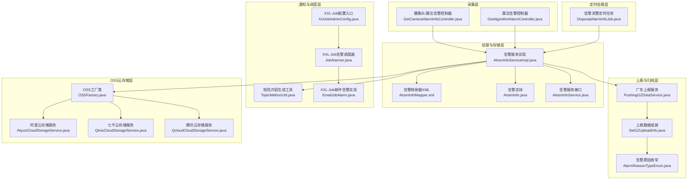
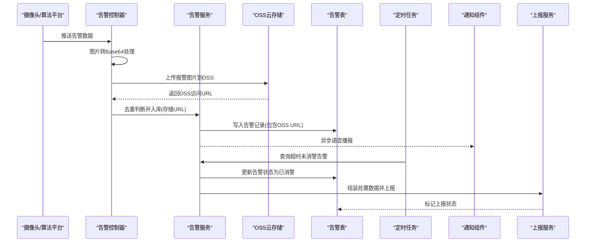
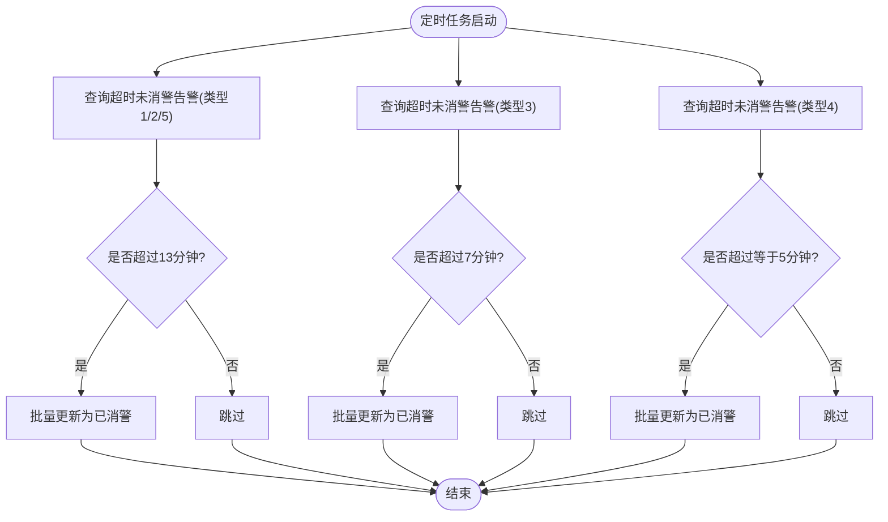
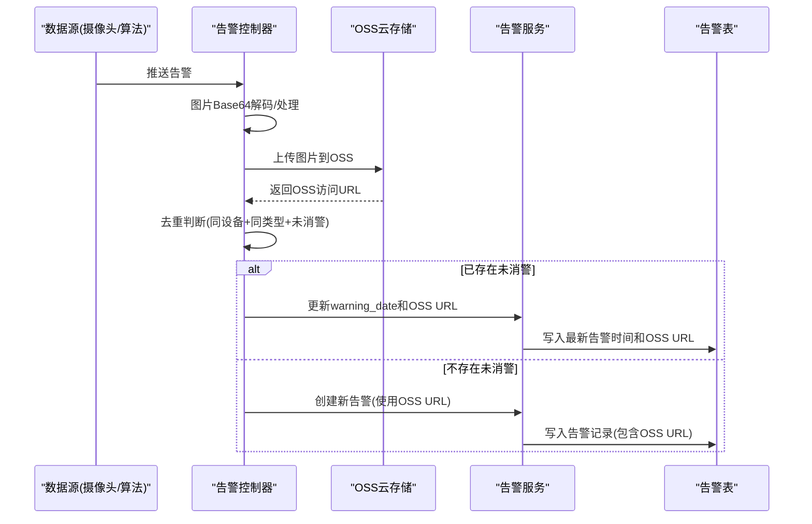
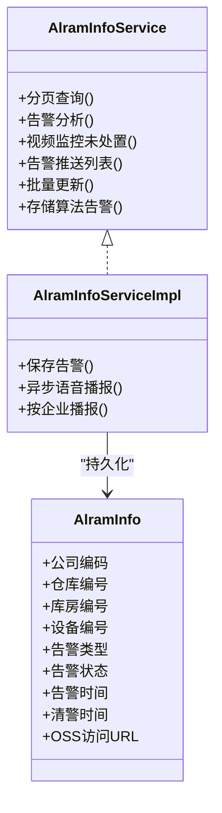
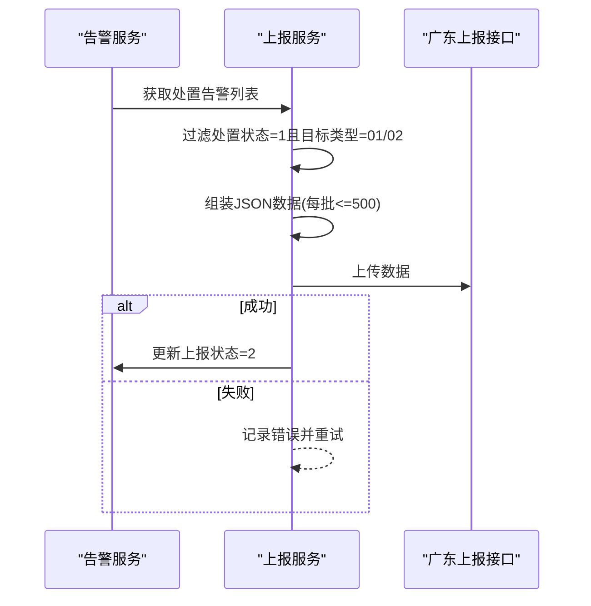
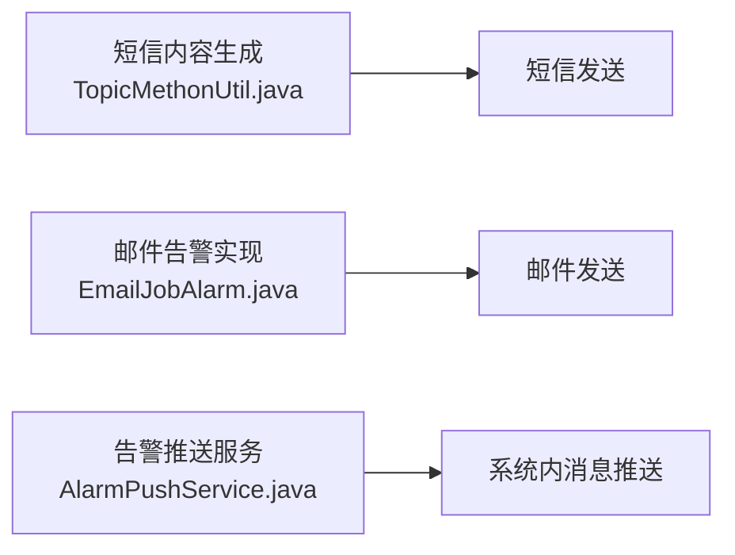
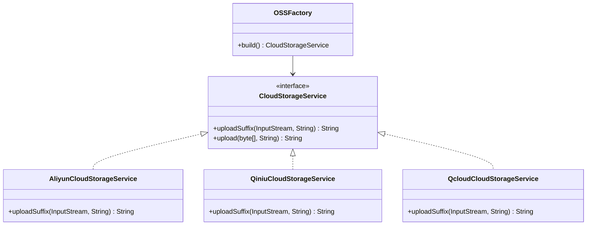
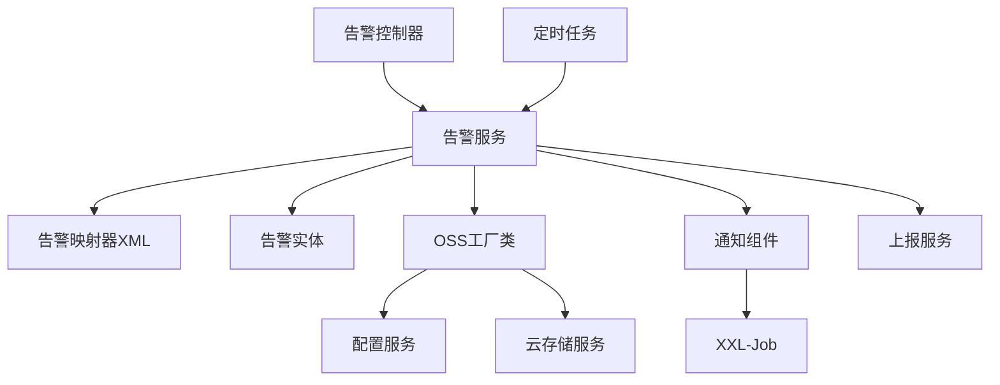

# 告警处理任务

<cite>
**本文引用的文件**
- [DisposalAlarmInfoJob.java](file://monkey-monitor-api/src/main/java/com/monkey/general/job/alarm/DisposalAlarmInfoJob.java)
- [AlramInfoServiceImpl.java](file://monkey-monitor/src/main/java/com/monkey/general/modules/em/service/impl/AlramInfoServiceImpl.java)
- [AlramInfoMapper.xml](file://monkey-monitor/src/main/resources/mapper/em/AlramInfoMapper.xml)
- [AlramInfo.java](file://monkey-monitor/src/main/java/com/monkey/general/modules/em/entity/AlramInfo.java)
- [AlramInfoService.java](file://monkey-monitor/src/main/java/com/monkey/general/modules/em/service/AlramInfoService.java)
- [GetCameraAlarmInfoController.java](file://monkey-monitor-api/src/main/java/com/monkey/general/python/GetCameraAlarmInfoController.java)
- [GetAlgorithmAlarmController.java](file://monkey-monitor-api/src/main/java/com/monkey/general/python/GetAlgorithmAlarmController.java)
- [PushingGZDataService.java](file://monkey-monitor/src/main/java/com/monkey/general/platform/push/gz/PushingGZDataService.java)
- [SetGZUploadInfo.java](file://monkey-monitor/src/main/java/com/monkey/general/platform/push/gz/SetGZUploadInfo.java)
- [AlarmReasonTypeEnum.java](file://monkey-monitor/src/main/java/com/monkey/general/util/gz/entity/enums/AlarmReasonTypeEnum.java)
- [TopicMethonUtil.java](file://monkey-monitor/src/main/java/com/monkey/general/config/mqtt/TopicMethonUtil.java)
- [EmailJobAlarm.java](file://xxl-job-admin/src/main/java/com/xxl/job/admin/core/alarm/impl/EmailJobAlarm.java)
- [JobAlarmer.java](file://xxl-job-admin/src/main/java/com/xxl/job/admin/core/alarm/JobAlarmer.java)
- [XxlJobAdminConfig.java](file://xxl-job-admin/src/main/java/com/xxl/job/admin/core/conf/XxlJobAdminConfig.java)
- [AlarmAnalysisVo.java](file://monkey-monitor-api/src/main/java/com/monkey/general/vo/AlarmAnalysisVo.java)
- [OSSFactory.java](file://monkey-service/src/main/java/com/monkey/general/modules/oss/cloud/OSSFactory.java)
- [GetPlayBackInfo3.java](file://monkey-monitor/src/main/java/com/monkey/general/dahua/GetPlayBackInfo3.java)
- [GetPlayBackInfo2.java](file://monkey-monitor/src/main/java/com/monkey/general/dahua/GetPlayBackInfo2.java)
- [AliyunCloudStorageService.java](file://monkey-service/src/main/java/com/monkey/general/modules/oss/cloud/AliyunCloudStorageService.java)
- [QiniuCloudStorageService.java](file://monkey-service/src/main/java/com/monkey/general/modules/oss/cloud/QiniuCloudStorageService.java)
- [QcloudCloudStorageService.java](file://monkey-service/src/main/java/com/monkey/general/modules/oss/cloud/QcloudCloudStorageService.java)
</cite>

## 更新摘要
**所做更改**
- 更新告警图片处理流程，反映所有报警图片均经过OSS上传处理的改进
- 新增OSS云存储服务集成说明，包括阿里云、七牛云、腾讯云等多种存储方案
- 更新告警图片存储策略，从本地文件服务器迁移到云端OSS存储
- 增强告警图片处理的性能监控和存储效率分析

## 目录
1. [简介](#简介)
2. [项目结构](#项目结构)
3. [核心组件](#核心组件)
4. [架构总览](#架构总览)
5. [详细组件分析](#详细组件分析)
6. [依赖分析](#依赖分析)
7. [性能考虑](#性能考虑)
8. [故障排查指南](#故障排查指南)
9. [结论](#结论)
10. [附录](#附录)

## 简介
本文件围绕告警处理任务展开，重点阐述 DisposalAlarmInfoJob 类的告警识别与自动消警流程；梳理告警数据的采集与预处理机制（类型识别、严重程度分级、重复告警过滤）；解释告警处理策略（自动处理规则、人工干预流程、升级机制）；介绍通知系统集成（短信、邮件、系统内消息）；说明数据存储与归档策略（历史数据管理、查询索引优化、备份机制）；给出配置参数说明（处理时限、通知渠道、优先级）；并提供性能监控与统计分析、异常诊断与恢复机制及流程优化建议。

**重要更新**：所有报警图片现在都会经过OSS（对象存储服务）上传处理，包括自研AI算法和第三方算法的报警数据，显著提升了系统的存储效率和性能表现。

## 项目结构
告警处理相关代码主要分布在以下模块：
- 告警采集与控制器：用于接收来自摄像头、算法平台等的告警数据，并进行去重与入库。
- 告警处理与存储：负责告警状态更新、语音播报、推送等。
- 告警上报与归档：负责将处置后的告警数据按规范上报至外部系统。
- 通知与调度：通过 XXL-Job 提供的调度能力与通知组件实现告警升级与通知。
- **OSS云存储服务**：提供统一的云存储抽象，支持多种云服务商的图片存储解决方案。

**图表来源**
- [DisposalAlarmInfoJob.java:1-73](file://monkey-monitor-api/src/main/java/com/monkey/general/job/alarm/DisposalAlarmInfoJob.java#L1-L73)
- [AlramInfoServiceImpl.java:25-357](file://monkey-monitor/src/main/java/com/monkey/general/modules/em/service/impl/AlramInfoServiceImpl.java#L25-L357)
- [AlramInfoMapper.xml](file://monkey-monitor/src/main/resources/mapper/em/AlramInfoMapper.xml)
- [AlramInfo.java](file://monkey-monitor/src/main/java/com/monkey/general/modules/em/entity/AlramInfo.java)
- [AlramInfoService.java:1-48](file://monkey-monitor/src/main/java/com/monkey/general/modules/em/service/AlramInfoService.java#L1-L48)
- [GetCameraAlarmInfoController.java:92-150](file://monkey-monitor-api/src/main/java/com/monkey/general/python/GetCameraAlarmInfoController.java#L92-L150)
- [GetAlgorithmAlarmController.java:83-104](file://monkey-monitor-api/src/main/java/com/monkey/general/python/GetAlgorithmAlarmController.java#L83-L104)
- [PushingGZDataService.java:645-722](file://monkey-monitor/src/main/java/com/monkey/general/platform/push/gz/PushingGZDataService.java#L645-L722)
- [SetGZUploadInfo.java:419-471](file://monkey-monitor/src/main/java/com/monkey/general/platform/push/gz/SetGZUploadInfo.java#L419-L471)
- [AlarmReasonTypeEnum.java:1-56](file://monkey-monitor/src/main/java/com/monkey/general/util/gz/entity/enums/AlarmReasonTypeEnum.java#L1-L56)
- [TopicMethonUtil.java:328-357](file://monkey-monitor/src/main/java/com/monkey/general/config/mqtt/TopicMethonUtil.java#L328-L357)
- [EmailJobAlarm.java:1-44](file://xxl-job-admin/src/main/java/com/xxl/job/admin/core/alarm/impl/EmailJobAlarm.java#L1-L44)
- [JobAlarmer.java:1-65](file://xxl-job-admin/src/main/java/com/xxl/job/admin/core/alarm/JobAlarmer.java#L1-L65)
- [XxlJobAdminConfig.java:1-50](file://xxl-job-admin/src/main/java/com/xxl/job/admin/core/conf/XxlJobAdminConfig.java#L1-L50)
- [OSSFactory.java:1-37](file://monkey-service/src/main/java/com/monkey/general/modules/oss/cloud/OSSFactory.java#L1-L37)
- [AliyunCloudStorageService.java](file://monkey-service/src/main/java/com/monkey/general/modules/oss/cloud/AliyunCloudStorageService.java)
- [QiniuCloudStorageService.java](file://monkey-service/src/main/java/com/monkey/general/modules/oss/cloud/QiniuCloudStorageService.java)
- [QcloudCloudStorageService.java](file://monkey-service/src/main/java/com/monkey/general/modules/oss/cloud/QcloudCloudStorageService.java)

**章节来源**
- [DisposalAlarmInfoJob.java:1-73](file://monkey-monitor-api/src/main/java/com/monkey/general/job/alarm/DisposalAlarmInfoJob.java#L1-L73)
- [AlramInfoServiceImpl.java:25-357](file://monkey-monitor/src/main/java/com/monkey/general/modules/em/service/impl/AlramInfoServiceImpl.java#L25-L357)
- [AlramInfoMapper.xml](file://monkey-monitor/src/main/resources/mapper/em/AlramInfoMapper.xml)
- [AlramInfo.java](file://monkey-monitor/src/main/java/com/monkey/general/modules/em/entity/AlramInfo.java)
- [AlramInfoService.java:1-48](file://monkey-monitor/src/main/java/com/monkey/general/modules/em/service/AlramInfoService.java#L1-L48)
- [GetCameraAlarmInfoController.java:92-150](file://monkey-monitor-api/src/main/java/com/monkey/general/python/GetCameraAlarmInfoController.java#L92-L150)
- [GetAlgorithmAlarmController.java:83-104](file://monkey-monitor-api/src/main/java/com/monkey/general/python/GetAlgorithmAlarmController.java#L83-L104)
- [PushingGZDataService.java:645-722](file://monkey-monitor/src/main/java/com/monkey/general/platform/push/gz/PushingGZDataService.java#L645-L722)
- [SetGZUploadInfo.java:419-471](file://monkey-monitor/src/main/java/com/monkey/general/platform/push/gz/SetGZUploadInfo.java#L419-L471)
- [AlarmReasonTypeEnum.java:1-56](file://monkey-monitor/src/main/java/com/monkey/general/util/gz/entity/enums/AlarmReasonTypeEnum.java#L1-L56)
- [TopicMethonUtil.java:328-357](file://monkey-monitor/src/main/java/com/monkey/general/config/mqtt/TopicMethonUtil.java#L328-L357)
- [EmailJobAlarm.java:1-44](file://xxl-job-admin/src/main/java/com/xxl/job/admin/core/alarm/impl/EmailJobAlarm.java#L1-L44)
- [JobAlarmer.java:1-65](file://xxl-job-admin/src/main/java/com/xxl/job/admin/core/alarm/JobAlarmer.java#L1-L65)
- [XxlJobAdminConfig.java:1-50](file://xxl-job-admin/src/main/java/com/xxl/job/admin/core/conf/XxlJobAdminConfig.java#L1-L50)
- [OSSFactory.java:1-37](file://monkey-service/src/main/java/com/monkey/general/modules/oss/cloud/OSSFactory.java#L1-L37)

## 核心组件
- 告警采集与预处理
  - 摄像头/算法告警控制器负责接收告警数据，进行去重判断与入库；对重复告警更新最新告警时间，避免重复通知与无效存储。
  - **新增**：所有报警图片均通过OSS工厂类进行云存储上传，支持多种云服务商的统一抽象接口。
- 告警存储与语音播报
  - 告警服务在保存新告警时触发异步语音播报，支持按企业隔离的广播策略。
- 自动消警与人工干预
  - 定时任务根据告警类型与持续时间自动消警；同时保留人工处置流程（如处置字段与处置记录）。
- 告警上报与归档
  - 将处置后的告警数据按规范组装并上报至外部系统，包含处置原因、处置人、处置时间等字段。
- 通知系统集成
  - 支持短信、邮件、系统内消息推送；XXL-Job 提供统一的告警调度与通知能力。
- **OSS云存储集成**
  - **新增**：统一的OSS存储工厂类，支持阿里云、七牛云、腾讯云等多种云存储服务提供商。
  - **新增**：告警图片上传到OSS后，数据库中存储的是OSS访问URL而非本地文件路径。

**章节来源**
- [GetCameraAlarmInfoController.java:92-150](file://monkey-monitor-api/src/main/java/com/monkey/general/python/GetCameraAlarmInfoController.java#L92-L150)
- [GetAlgorithmAlarmController.java:83-104](file://monkey-monitor-api/src/main/java/com/monkey/general/python/GetAlgorithmAlarmController.java#L83-L104)
- [AlramInfoServiceImpl.java:296-357](file://monkey-monitor/src/main/java/com/monkey/general/modules/em/service/impl/AlramInfoServiceImpl.java#L296-L357)
- [DisposalAlarmInfoJob.java:26-73](file://monkey-monitor-api/src/main/java/com/monkey/general/job/alarm/DisposalAlarmInfoJob.java#L26-L73)
- [PushingGZDataService.java:645-722](file://monkey-monitor/src/main/java/com/monkey/general/platform/push/gz/PushingGZDataService.java#L645-L722)
- [TopicMethonUtil.java:328-357](file://monkey-monitor/src/main/java/com/monkey/general/config/mqtt/TopicMethonUtil.java#L328-L357)
- [EmailJobAlarm.java:1-44](file://xxl-job-admin/src/main/java/com/xxl/job/admin/core/alarm/impl/EmailJobAlarm.java#L1-L44)
- [OSSFactory.java:1-37](file://monkey-service/src/main/java/com/monkey/general/modules/oss/cloud/OSSFactory.java#L1-L37)

## 架构总览
告警处理整体流程如下：
- 数据采集：摄像头/算法平台将告警事件推送到控制器，控制器去重后写入告警表。
- 图片处理：**更新**：所有报警图片先上传到OSS云存储，然后将OSS URL存储到数据库中。
- 存储与播报：服务层在新增告警时触发异步语音播报。
- 自动消警：定时任务按类型与持续时间自动更新告警状态为已消警。
- 上报归档：处置后的告警数据按规范组装并上报至外部系统。
- 通知与升级：短信、邮件、系统内消息等通知渠道联动；XXL-Job 提供统一调度与告警能力。

**图表来源**
- [GetCameraAlarmInfoController.java:92-150](file://monkey-monitor-api/src/main/java/com/monkey/general/python/GetCameraAlarmInfoController.java#L92-L150)
- [GetAlgorithmAlarmController.java:83-104](file://monkey-monitor-api/src/main/java/com/monkey/general/python/GetAlgorithmAlarmController.java#L83-L104)
- [AlramInfoServiceImpl.java:296-357](file://monkey-monitor/src/main/java/com/monkey/general/modules/em/service/impl/AlramInfoServiceImpl.java#L296-L357)
- [DisposalAlarmInfoJob.java:26-73](file://monkey-monitor-api/src/main/java/com/monkey/general/job/alarm/DisposalAlarmInfoJob.java#L26-L73)
- [PushingGZDataService.java:645-722](file://monkey-monitor/src/main/java/com/monkey/general/platform/push/gz/PushingGZDataService.java#L645-L722)
- [OSSFactory.java:1-37](file://monkey-service/src/main/java/com/monkey/general/modules/oss/cloud/OSSFactory.java#L1-L37)

## 详细组件分析

### DisposalAlarmInfoJob 类：自动消警与处置流程
- 职责
  - 定时扫描未消警告警，依据告警类型与持续时间自动更新为已消警。
  - 对不同类型的告警设定不同的超时阈值，确保及时清理无效告警。
- 关键点
  - 通过查询条件筛选 alarm_status=0 的告警，并按 alarm_type 分组处理。
  - 使用时间差函数计算告警持续时间，超过阈值即执行消警。
  - 消警操作批量更新 alarm_status 与清警时间，减少多次写入开销。

**图表来源**
- [DisposalAlarmInfoJob.java:26-73](file://monkey-monitor-api/src/main/java/com/monkey/general/job/alarm/DisposalAlarmInfoJob.java#L26-L73)

**章节来源**
- [DisposalAlarmInfoJob.java:26-73](file://monkey-monitor-api/src/main/java/com/monkey/general/job/alarm/DisposalAlarmInfoJob.java#L26-L73)

### 告警数据采集与预处理
- 摄像头/算法告警控制器
  - 对重复告警：若同设备同类型且未消警的记录存在，则仅更新最新告警时间，避免重复入库与通知。
  - 新告警入库：设置企业编码、仓库/库房编号、设备编号、告警类型、状态、**更新**：图片URL改为OSS访问URL、告警时间等字段。
- 算法告警控制器
  - **更新**：所有算法告警图片都通过OSS工厂类进行上传，返回OSS访问URL后存储到数据库。
  - 同样遵循去重逻辑：若存在未消警记录则更新时间；否则新建告警记录并保存**更新**：OSS访问URL而非本地文件路径与捕获时间。

**图表来源**
- [GetCameraAlarmInfoController.java:92-150](file://monkey-monitor-api/src/main/java/com/monkey/general/python/GetCameraAlarmInfoController.java#L92-L150)
- [GetAlgorithmAlarmController.java:83-104](file://monkey-monitor-api/src/main/java/com/monkey/general/python/GetAlgorithmAlarmController.java#L83-L104)
- [OSSFactory.java:1-37](file://monkey-service/src/main/java/com/monkey/general/modules/oss/cloud/OSSFactory.java#L1-L37)

**章节来源**
- [GetCameraAlarmInfoController.java:92-150](file://monkey-monitor-api/src/main/java/com/monkey/general/python/GetCameraAlarmInfoController.java#L92-L150)
- [GetAlgorithmAlarmController.java:83-104](file://monkey-monitor-api/src/main/java/com/monkey/general/python/GetAlgorithmAlarmController.java#L83-L104)
- [OSSFactory.java:1-37](file://monkey-service/src/main/java/com/monkey/general/modules/oss/cloud/OSSFactory.java#L1-L37)

### 告警存储与语音播报
- 存储策略
  - 新增告警时写入告警表，包含企业、设备、告警类型、状态、时间、**更新**：附件为OSS访问URL而非本地路径等字段。
- 语音播报
  - 保存成功后异步触发语音播报，按企业隔离；支持多种设备类型（如特定厂商设备）的回退策略。
- 预处理要点
  - 告警类型字符串缺失时提供默认值，设备名称缺失时回退到门禁设备名称。

**图表来源**
- [AlramInfo.java](file://monkey-monitor/src/main/java/com/monkey/general/modules/em/entity/AlramInfo.java)
- [AlramInfoService.java:1-48](file://monkey-monitor/src/main/java/com/monkey/general/modules/em/service/AlramInfoService.java#L1-L48)
- [AlramInfoServiceImpl.java:296-357](file://monkey-monitor/src/main/java/com/monkey/general/modules/em/service/impl/AlramInfoServiceImpl.java#L296-L357)

**章节来源**
- [AlramInfoServiceImpl.java:296-357](file://monkey-monitor/src/main/java/com/monkey/general/modules/em/service/impl/AlramInfoServiceImpl.java#L296-L357)

### 告警上报与归档（广东规范）
- 上报范围
  - 仅处置类监测指标报警（target_type=01/02），视频报警处置由其他接口处理。
- 数据组装
  - 组装处置ID、企业编码、告警级别、告警值、最大值与时间、处置措施、处置人、联系方式、删除标记等字段。
- 上报流程
  - 分批上传（每批最多500条），成功后更新告警记录的上报状态；失败记录错误日志并重试或人工介入。

**图表来源**
- [PushingGZDataService.java:645-722](file://monkey-monitor/src/main/java/com/monkey/general/platform/push/gz/PushingGZDataService.java#L645-L722)
- [SetGZUploadInfo.java:419-471](file://monkey-monitor/src/main/java/com/monkey/general/platform/push/gz/SetGZUploadInfo.java#L419-L471)

**章节来源**
- [PushingGZDataService.java:645-722](file://monkey-monitor/src/main/java/com/monkey/general/platform/push/gz/PushingGZDataService.java#L645-L722)
- [SetGZUploadInfo.java:419-471](file://monkey-monitor/src/main/java/com/monkey/general/platform/push/gz/SetGZUploadInfo.java#L419-L471)

### 通知系统集成
- 短信通知
  - 根据实时值与高低阈值生成短信内容，包含设备名、类型名、阈值与实时值，仅在越界时发送。
- 邮件通知
  - XXL-Job 提供 JobAlarmer 统一调度多个 JobAlarm 实现（如 EmailJobAlarm），在作业失败时触发邮件告警。
- 系统内消息
  - 通过 WebSocket 或内部消息通道推送告警信息，支持查询历史与重试机制。

**图表来源**
- [TopicMethonUtil.java:328-357](file://monkey-monitor/src/main/java/com/monkey/general/config/mqtt/TopicMethonUtil.java#L328-L357)
- [EmailJobAlarm.java:1-44](file://xxl-job-admin/src/main/java/com/xxl/job/admin/core/alarm/impl/EmailJobAlarm.java#L1-L44)
- [AlarmPushService.java:36-60](file://monkey-monitor/src/main/java/com/monkey/general/util/socket/service/AlarmPushService.java#L36-L60)

**章节来源**
- [TopicMethonUtil.java:328-357](file://monkey-monitor/src/main/java/com/monkey/general/config/mqtt/TopicMethonUtil.java#L328-L357)
- [EmailJobAlarm.java:1-44](file://xxl-job-admin/src/main/java/com/xxl/job/admin/core/alarm/impl/EmailJobAlarm.java#L1-L44)
- [AlarmPushService.java:36-60](file://monkey-monitor/src/main/java/com/monkey/general/util/socket/service/AlarmPushService.java#L36-L60)

### 告警处理策略与升级机制
- 自动处理规则
  - 不同告警类型设定不同超时阈值，超时自动消警，减少人工负担。
- 人工干预流程
  - 处置字段（如处置状态、处置人、处置时间）用于标识人工处置；上报服务仅对处置完成的数据进行上报。
- 告警升级机制
  - XXL-Job 在作业失败时通过 JobAlarmer 调度多个 JobAlarm 实现（如邮件），形成升级通知链路。

**章节来源**
- [DisposalAlarmInfoJob.java:26-73](file://monkey-monitor-api/src/main/java/com/monkey/general/job/alarm/DisposalAlarmInfoJob.java#L26-L73)
- [PushingGZDataService.java:645-722](file://monkey-monitor/src/main/java/com/monkey/general/platform/push/gz/PushingGZDataService.java#L645-L722)
- [JobAlarmer.java:1-65](file://xxl-job-admin/src/main/java/com/xxl/job/admin/core/alarm/JobAlarmer.java#L1-L65)

### OSS云存储服务集成
- **新增**：OSS工厂类提供统一的云存储抽象，支持多种云服务商
  - 支持阿里云、七牛云、腾讯云等多种云存储服务提供商
  - 通过配置中心动态选择合适的云存储服务
- **新增**：告警图片处理流程
  - 所有报警图片（包括自研AI算法和第三方算法）均上传到OSS
  - 数据库存储OSS访问URL而非本地文件路径
  - 支持图片格式自动识别和文件后缀处理
- **新增**：云存储服务实现
  - 阿里云OSS存储服务：支持标准、低频访问、归档存储等存储类型
  - 七牛云存储服务：提供CDN加速和图片处理能力
  - 腾讯云COS存储服务：支持多地域部署和数据迁移

**图表来源**
- [OSSFactory.java:1-37](file://monkey-service/src/main/java/com/monkey/general/modules/oss/cloud/OSSFactory.java#L1-L37)
- [AliyunCloudStorageService.java](file://monkey-service/src/main/java/com/monkey/general/modules/oss/cloud/AliyunCloudStorageService.java)
- [QiniuCloudStorageService.java](file://monkey-service/src/main/java/com/monkey/general/modules/oss/cloud/QiniuCloudStorageService.java)
- [QcloudCloudStorageService.java](file://monkey-service/src/main/java/com/monkey/general/modules/oss/cloud/QcloudCloudStorageService.java)

**章节来源**
- [OSSFactory.java:1-37](file://monkey-service/src/main/java/com/monkey/general/modules/oss/cloud/OSSFactory.java#L1-L37)
- [AliyunCloudStorageService.java](file://monkey-service/src/main/java/com/monkey/general/modules/oss/cloud/AliyunCloudStorageService.java)
- [QiniuCloudStorageService.java](file://monkey-service/src/main/java/com/monkey/general/modules/oss/cloud/QiniuCloudStorageService.java)
- [QcloudCloudStorageService.java](file://monkey-service/src/main/java/com/monkey/general/modules/oss/cloud/QcloudCloudStorageService.java)

## 依赖分析
- 组件耦合
  - 控制器依赖告警服务进行去重与入库；告警服务依赖映射器访问数据库；定时任务依赖告警服务进行状态更新。
  - **新增**：告警服务依赖OSS工厂类进行图片上传；OSS工厂类依赖配置服务获取云存储配置。
- 外部依赖
  - XXL-Job 提供调度与告警通知能力；短信/邮件/系统内消息依赖对应第三方组件或内部服务。
  - **新增**：云存储服务依赖对应的云服务商API和认证配置。
- 循环依赖
  - 当前结构未见循环依赖，各层职责清晰。

**图表来源**
- [GetCameraAlarmInfoController.java:92-150](file://monkey-monitor-api/src/main/java/com/monkey/general/python/GetCameraAlarmInfoController.java#L92-L150)
- [AlramInfoServiceImpl.java:296-357](file://monkey-monitor/src/main/java/com/monkey/general/modules/em/service/impl/AlramInfoServiceImpl.java#L296-L357)
- [AlramInfoMapper.xml](file://monkey-monitor/src/main/resources/mapper/em/AlramInfoMapper.xml)
- [AlramInfo.java](file://monkey-monitor/src/main/java/com/monkey/general/modules/em/entity/AlramInfo.java)
- [DisposalAlarmInfoJob.java:26-73](file://monkey-monitor-api/src/main/java/com/monkey/general/job/alarm/DisposalAlarmInfoJob.java#L26-L73)
- [EmailJobAlarm.java:1-44](file://xxl-job-admin/src/main/java/com/xxl/job/admin/core/alarm/impl/EmailJobAlarm.java#L1-L44)
- [OSSFactory.java:1-37](file://monkey-service/src/main/java/com/monkey/general/modules/oss/cloud/OSSFactory.java#L1-L37)

**章节来源**
- [AlramInfoMapper.xml](file://monkey-monitor/src/main/resources/mapper/em/AlramInfoMapper.xml)
- [AlramInfo.java](file://monkey-monitor/src/main/java/com/monkey/general/modules/em/entity/AlramInfo.java)
- [AlramInfoService.java:1-48](file://monkey-monitor/src/main/java/com/monkey/general/modules/em/service/AlramInfoService.java#L1-L48)
- [OSSFactory.java:1-37](file://monkey-service/src/main/java/com/monkey/general/modules/oss/cloud/OSSFactory.java#L1-L37)

## 性能考虑
- 查询与索引
  - 建议在告警表上为 alarm_status、alarm_type、warning_date 等常用查询字段建立复合索引，提升定时任务与查询效率。
  - **新增**：建议为OSS访问URL字段建立索引，便于快速检索和管理图片资源。
- 批量处理
  - 上报服务采用分批（每批≤500）上传，降低单次请求压力；定时任务批量更新消警状态，减少数据库往返。
- 异步处理
  - 语音播报与短信生成采用异步执行，避免阻塞主流程。
  - **新增**：OSS图片上传采用异步方式，避免阻塞告警数据入库流程。
- 资源隔离
  - 按企业隔离语音播报，避免跨企业干扰；XXL-Job 的通知组件可独立扩展。
  - **新增**：不同云存储服务商的API调用采用连接池管理，避免资源泄露。

**新增**：存储效率优化
- **OSS存储优势**：所有报警图片统一存储在云端，减少了本地存储空间占用和维护成本
- **CDN加速**：通过OSS CDN提供图片访问加速，提升告警图片的加载速度
- **自动扩展**：云存储可根据业务需求自动扩展，无需担心容量限制问题

## 故障排查指南
- 告警未消警
  - 检查定时任务是否正常运行；确认 alarm_status 与 warning_date 字段是否正确更新。
- 重复告警未去重
  - 核对控制器去重逻辑与数据库重复条件（同设备、同类型、未消警）。
- 语音播报异常
  - 检查异步线程池配置与设备类型回退策略；确认企业信息与设备信息查询结果。
- 短信未发送
  - 校验阈值配置与实时值比较逻辑；确认企业信息与设备信息是否存在。
- 上报失败
  - 查看分批上传日志与上报状态更新；必要时人工重试或检查外部接口可用性。
- XXL-Job 告警未达
  - 检查 JobAlarmer 是否装配了 JobAlarm 实现；核对邮件配置与收件人列表。
- **新增**：OSS上传失败
  - 检查云存储配置是否正确；验证云存储账号权限和配额限制。
  - 查看OSS上传日志，确认网络连接和API调用状态。
  - 验证图片格式和大小限制，确保符合云存储服务商的要求。

**章节来源**
- [DisposalAlarmInfoJob.java:26-73](file://monkey-monitor-api/src/main/java/com/monkey/general/job/alarm/DisposalAlarmInfoJob.java#L26-L73)
- [GetCameraAlarmInfoController.java:92-150](file://monkey-monitor-api/src/main/java/com/monkey/general/python/GetCameraAlarmInfoController.java#L92-L150)
- [AlramInfoServiceImpl.java:296-357](file://monkey-monitor/src/main/java/com/monkey/general/modules/em/service/impl/AlramInfoServiceImpl.java#L296-L357)
- [TopicMethonUtil.java:328-357](file://monkey-monitor/src/main/java/com/monkey/general/config/mqtt/TopicMethonUtil.java#L328-L357)
- [PushingGZDataService.java:645-722](file://monkey-monitor/src/main/java/com/monkey/general/platform/push/gz/PushingGZDataService.java#L645-L722)
- [JobAlarmer.java:1-65](file://xxl-job-admin/src/main/java/com/xxl/job/admin/core/alarm/JobAlarmer.java#L1-L65)

## 结论
本告警处理体系通过控制器去重、服务层异步播报、定时任务自动消警、上报服务归档与通知组件集成，形成了完整的闭环。**重要更新**：所有报警图片现已统一通过OSS云存储服务进行管理，显著提升了系统的存储效率、性能表现和可扩展性。建议进一步完善索引设计、异步线程池与外部接口监控，以提升稳定性与性能。

## 附录

### 配置参数说明
- 告警语音播报
  - 重复次数：alarm-voice.repeat-count
  - IP扬声器地址：ip-speaker.ip
  - 丹唛派克设备编码回退：dmpk.deviceCode
- 告警超时阈值（定时任务）
  - 类型1/2/5：超过13分钟自动消警
  - 类型3：超过7分钟自动消警
  - 类型4：超过等于5分钟自动消警
- 短信阈值
  - 高阈值、低阈值与实时值比较，越界时发送短信
- **新增**：OSS云存储配置
  - 云存储类型：cloud.storage.type（支持阿里云、七牛云、腾讯云）
  - 访问密钥：cloud.storage.accessKey
  - 秘密密钥：cloud.storage.secretKey
  - 存储桶名称：cloud.storage.bucketName
  - 域名配置：cloud.storage.domain

**章节来源**
- [AlramInfoServiceImpl.java:55-61](file://monkey-monitor/src/main/java/com/monkey/general/modules/em/service/impl/AlramInfoServiceImpl.java#L55-L61)
- [DisposalAlarmInfoJob.java:26-73](file://monkey-monitor-api/src/main/java/com/monkey/general/job/alarm/DisposalAlarmInfoJob.java#L26-L73)
- [TopicMethonUtil.java:328-357](file://monkey-monitor/src/main/java/com/monkey/general/config/mqtt/TopicMethonUtil.java#L328-L357)
- [OSSFactory.java:1-37](file://monkey-service/src/main/java/com/monkey/general/modules/oss/cloud/OSSFactory.java#L1-L37)

### 告警类型与严重程度
- 告警类型
  - 摄像头算法告警：超员、遮挡、超高/超量、通道堵塞、偏移等
  - 车闸/人闸告警：门禁类告警
- 严重程度分级
  - 本项目未提供统一严重程度字段；可通过告警类型与阈值策略间接体现优先级。

**章节来源**
- [GetCameraAlarmInfoController.java:117-150](file://monkey-monitor-api/src/main/java/com/monkey/general/python/GetCameraAlarmInfoController.java#L117-L150)
- [GetAlgorithmAlarmController.java:83-104](file://monkey-monitor-api/src/main/java/com/monkey/general/python/GetAlgorithmAlarmController.java#L83-L104)

### 数据存储与归档策略
- 存储
  - 告警实体包含企业、设备、类型、状态、时间、**更新**：附件为OSS访问URL而非本地路径等字段；服务层提供分页查询与分析接口。
- 归档
  - 处置后的告警按广东规范组装并分批上报；上报成功后更新上报状态。
- 索引与备份
  - 建议为常用查询字段建立索引；定期备份告警表，保障历史数据可追溯。
  - **新增**：建议为OSS访问URL字段建立索引，便于快速检索和管理图片资源。

**章节来源**
- [AlramInfo.java](file://monkey-monitor/src/main/java/com/monkey/general/modules/em/entity/AlramInfo.java)
- [AlramInfoService.java:1-48](file://monkey-monitor/src/main/java/com/monkey/general/modules/em/service/AlramInfoService.java#L1-L48)
- [PushingGZDataService.java:645-722](file://monkey-monitor/src/main/java/com/monkey/general/platform/push/gz/PushingGZDataService.java#L645-L722)

### 性能监控与统计分析
- 统计维度
  - 今日告警总数、累计告警数、告警数据分析（按类型/设备/企业）。
- 输出对象
  - AlarmAnalysisVo 包含 todayAlarmCount、totalAlarmCount、alarmDataList 等字段。
- **新增**：OSS存储监控
  - 图片上传成功率统计
  - 存储空间使用情况监控
  - CDN访问流量统计

**章节来源**
- [AlarmAnalysisVo.java:1-35](file://monkey-monitor-api/src/main/java/com/monkey/general/vo/AlarmAnalysisVo.java#L1-L35)

### 流程优化建议
- 索引优化：为 alarm_status、alarm_type、warning_date 建立复合索引。
- 异步化：继续扩大异步处理范围（如短信、邮件、抓图）。
- 可观测性：增强定时任务与上报服务的日志与指标埋点。
- 容错与重试：完善失败重试与降级策略（如网络抖动、外部接口不可用）。
- **新增**：OSS存储优化
  - 建议为OSS访问URL字段建立索引，提升查询性能
  - 优化图片压缩和格式转换策略，减少存储空间占用
  - 配置CDN缓存策略，提升图片访问速度
  - 建立存储监控告警机制，及时发现和处理存储异常