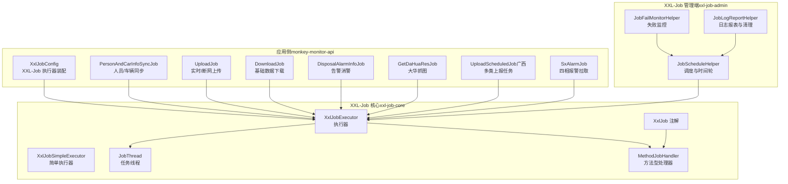
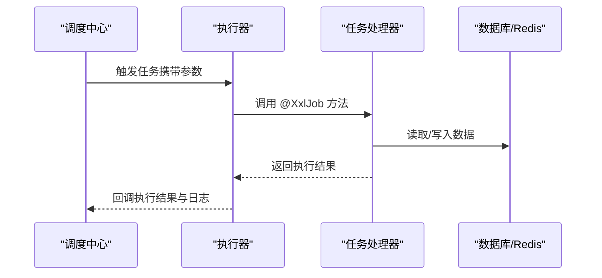
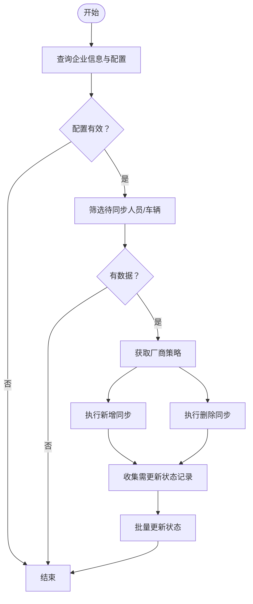
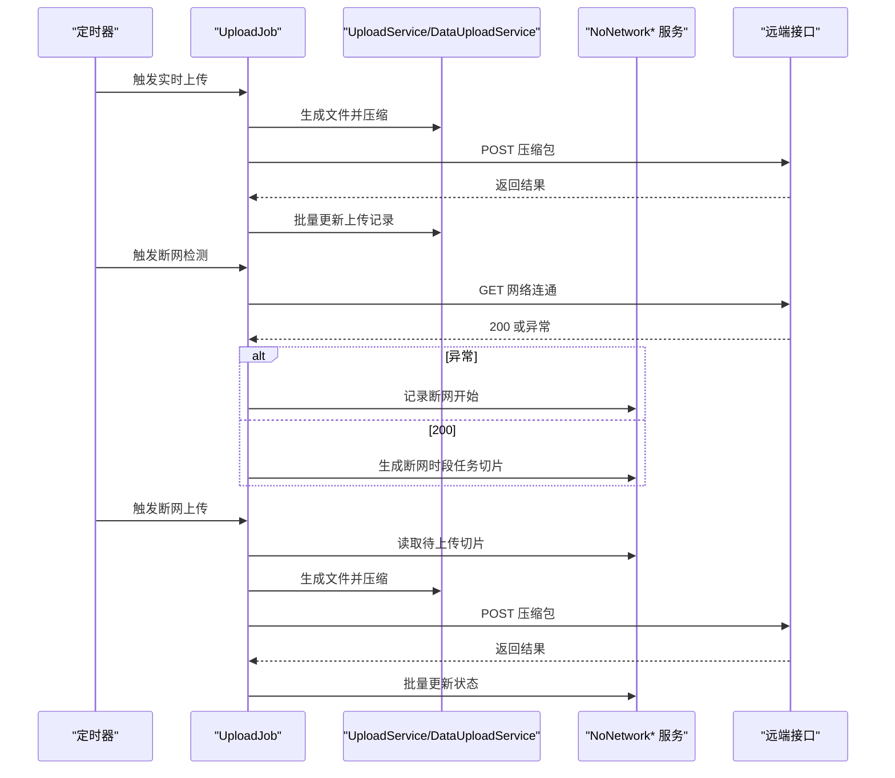
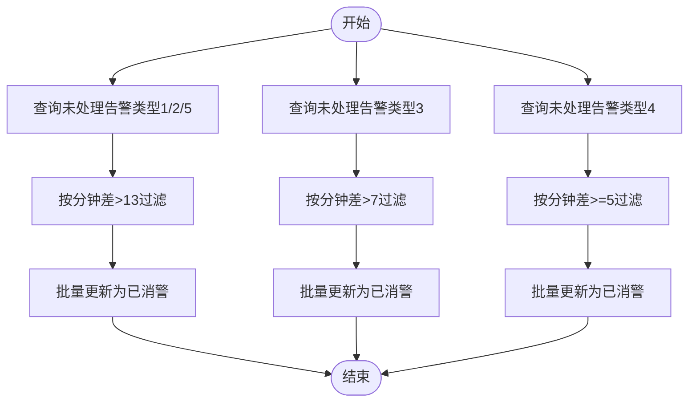
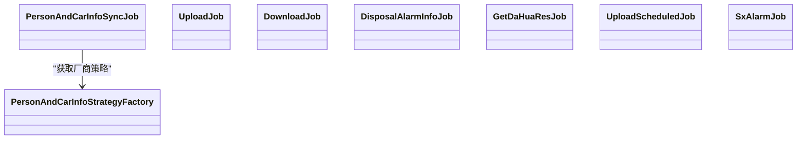

# 定时任务

<cite>
**本文引用的文件**   
- [XxlJobConfig.java](file://monkey-monitor-api/src/main/java/com/monkey/general/config/XxlJobConfig.java)
- [PersonAndCarInfoSyncJob.java](file://monkey-monitor-api/src/main/java/com/monkey/general/job/PersonAndCarInfoSyncJob.java)
- [UploadJob.java](file://monkey-monitor-api/src/main/java/com/monkey/general/job/UploadJob.java)
- [DownloadJob.java](file://monkey-monitor-api/src/main/java/com/monkey/general/job/DownloadJob.java)
- [DisposalAlarmInfoJob.java](file://monkey-monitor-api/src/main/java/com/monkey/general/job/alarm/DisposalAlarmInfoJob.java)
- [GetDaHuaResJob.java](file://monkey-monitor-api/src/main/java/com/monkey/general/job/dh/GetDaHuaResJob.java)
- [UploadScheduledJob.java（广西）](file://monkey-monitor-api/src/main/java/com/monkey/general/job/gx/UploadScheduledJob.java)
- [SxAlarmJob.java](file://monkey-monitor-api/src/main/java/com/monkey/general/job/sx/SxAlarmJob.java)
- [PersonAndCarInfoStrategyFactory.java](file://monkey-monitor-api/src/main/java/com/monkey/general/factory/PersonAndCarInfoStrategyFactory.java)
- [application-prod.yml](file://deploy/config/monitor-api/application-prod.yml)
- [application.yml](file://monkey-monitor-api/src/main/resources/application.yml)
- [XxlJobExecutor.java](file://xxl-job-core/src/main/java/com/xxl/job/core/executor/XxlJobExecutor.java)
- [XxlJobSimpleExecutor.java](file://xxl-job-core/src/main/java/com/xxl/job/core/executor/impl/XxlJobSimpleExecutor.java)
- [JobThread.java](file://xxl-job-core/src/main/java/com/xxl/job/core/thread/JobThread.java)
- [MethodJobHandler.java](file://xxl-job-core/src/main/java/com/xxl/job/core/handler/impl/MethodJobHandler.java)
- [XxlJob.java](file://xxl-job-core/src/main/java/com/xxl/job/core/handler/annotation/XxlJob.java)
- [JobScheduleHelper.java](file://xxl-job-admin/src/main/java/com/xxl/job/admin/core/thread/JobScheduleHelper.java)
- [JobFailMonitorHelper.java](file://xxl-job-admin/src/main/java/com/xxl/job/admin/core/thread/JobFailMonitorHelper.java)
- [JobLogReportHelper.java](file://xxl-job-admin/src/main/java/com/xxl/job/admin/core/thread/JobLogReportHelper.java)
- [message_zh_CN.properties](file://xxl-job-admin/src/main/resources/i18n/message_zh_CN.properties)
</cite>

## 目录
1. [简介](#简介)
2. [项目结构](#项目结构)
3. [核心组件](#核心组件)
4. [架构总览](#架构总览)
5. [详细组件分析](#详细组件分析)
6. [依赖关系分析](#依赖关系分析)
7. [性能考虑](#性能考虑)
8. [故障排查指南](#故障排查指南)
9. [结论](#结论)
10. [附录](#附录)

## 简介
本文件面向安威 fireworks 物联网监控平台的定时任务体系，系统基于 XXL-Job 实现分布式任务调度，覆盖设备数据同步、上传下载、告警处理、第三方平台对接以及大华设备联动抓图等场景。文档将从架构、组件、数据流、错误处理、配置参数、监控与日志、异常与重试、自定义开发与性能优化等方面进行全面说明。

## 项目结构
- 定时任务核心由 monkey-monitor-api 模块提供，包含各类业务任务（人员/车辆同步、上传下载、告警消警、大华抓图、广西对接、四相报警拉取等）。
- XXL-Job 核心与管理端位于独立模块，负责任务注册、调度、日志与监控。
- 配置集中在部署配置文件中，包含 XXL-Job 执行器参数、业务开关与网络地址等。

图表来源
- [XxlJobConfig.java:44-57](file://monkey-monitor-api/src/main/java/com/monkey/general/config/XxlJobConfig.java#L44-L57)
- [XxlJobExecutor.java:28-201](file://xxl-job-core/src/main/java/com/xxl/job/core/executor/XxlJobExecutor.java#L28-L201)
- [XxlJobSimpleExecutor.java:20-53](file://xxl-job-core/src/main/java/com/xxl/job/core/executor/impl/XxlJobSimpleExecutor.java#L20-L53)
- [JobThread.java:27-44](file://xxl-job-core/src/main/java/com/xxl/job/core/thread/JobThread.java#L27-L44)
- [MethodJobHandler.java:10-53](file://xxl-job-core/src/main/java/com/xxl/job/core/handler/impl/MethodJobHandler.java#L10-L53)
- [XxlJob.java](file://xxl-job-core/src/main/java/com/xxl/job/core/handler/annotation/XxlJob.java)
- [JobScheduleHelper.java:199-315](file://xxl-job-admin/src/main/java/com/xxl/job/admin/core/thread/JobScheduleHelper.java#L199-L315)
- [JobFailMonitorHelper.java:19-45](file://xxl-job-admin/src/main/java/com/xxl/job/admin/core/thread/JobFailMonitorHelper.java#L19-L45)
- [JobLogReportHelper.java:19-152](file://xxl-job-admin/src/main/java/com/xxl/job/admin/core/thread/JobLogReportHelper.java#L19-L152)

章节来源
- [XxlJobConfig.java:15-77](file://monkey-monitor-api/src/main/java/com/monkey/general/config/XxlJobConfig.java#L15-L77)
- [application-prod.yml:116-135](file://deploy/config/monitor-api/application-prod.yml#L116-L135)

## 核心组件
- XXL-Job 执行器装配：通过 Spring 配置类加载执行器参数，注册到调度中心。
- 任务实现：以 @XxlJob 注解标识的方法即为可被调度的任务处理器。
- 任务线程与处理器：每个任务在独立线程中执行，支持初始化/销毁回调。
- 任务工厂：人员/车辆同步任务通过策略工厂按厂商选择具体实现。

章节来源
- [XxlJobConfig.java:44-57](file://monkey-monitor-api/src/main/java/com/monkey/general/config/XxlJobConfig.java#L44-L57)
- [XxlJobExecutor.java:179-201](file://xxl-job-core/src/main/java/com/xxl/job/core/executor/XxlJobExecutor.java#L179-L201)
- [MethodJobHandler.java:17-47](file://xxl-job-core/src/main/java/com/xxl/job/core/handler/impl/MethodJobHandler.java#L17-L47)
- [PersonAndCarInfoStrategyFactory.java:18-35](file://monkey-monitor-api/src/main/java/com/monkey/general/factory/PersonAndCarInfoStrategyFactory.java#L18-L35)

## 架构总览
定时任务采用“调度中心 + 执行器”的分布式架构：
- 调度中心负责任务编排、时间轮触发、失败监控与日志报表。
- 执行器负责加载任务处理器、执行任务、写入日志、回调结果。
- 应用侧任务通过注解注册，统一由执行器管理。

图表来源
- [JobScheduleHelper.java:220-269](file://xxl-job-admin/src/main/java/com/xxl/job/admin/core/thread/JobScheduleHelper.java#L220-L269)
- [JobThread.java:27-44](file://xxl-job-core/src/main/java/com/xxl/job/core/thread/JobThread.java#L27-L44)
- [XxlJobExecutor.java:179-201](file://xxl-job-core/src/main/java/com/xxl/job/core/executor/XxlJobExecutor.java#L179-L201)

## 详细组件分析

### 设备数据同步任务（PersonAndCarInfoSyncJob）
- 功能概述
  - 人员同步：查询待新增/删除人员，按厂商策略执行同步，最终批量更新状态字段。
  - 车辆同步：查询待新增/删除车辆，按厂商策略执行同步，最终批量更新状态字段。
  - 人员/车辆到期处理：根据结束时间自动标记删除并清空同步状态。
  - 人员拉取（外部参数）：根据外部参数触发特定厂商的人员数据拉取。
- 关键流程
  - 查询企业信息与配置，校验本地存储类型与厂商代码。
  - 依据状态筛选待同步数据，获取厂商策略实例。
  - 分别执行新增/删除同步，收集需更新的状态记录，最后批量更新。
- 错误处理
  - 对策略执行过程进行异常捕获，避免任务静默结束；必要时可扩展报警或抛出异常。
- 并发与超时
  - 任务本身为单线程执行；如需并发可在策略层或数据库层优化。
- 配置要点
  - 公司编码、厂商策略工厂、各业务服务注入。
  - 厂商枚举与策略类映射由工厂在启动时装配。

图表来源
- [PersonAndCarInfoSyncJob.java:50-154](file://monkey-monitor-api/src/main/java/com/monkey/general/job/PersonAndCarInfoSyncJob.java#L50-L154)
- [PersonAndCarInfoSyncJob.java:156-233](file://monkey-monitor-api/src/main/java/com/monkey/general/job/PersonAndCarInfoSyncJob.java#L156-L233)
- [PersonAndCarInfoSyncJob.java:235-311](file://monkey-monitor-api/src/main/java/com/monkey/general/job/PersonAndCarInfoSyncJob.java#L235-L311)
- [PersonAndCarInfoSyncJob.java:314-336](file://monkey-monitor-api/src/main/java/com/monkey/general/job/PersonAndCarInfoSyncJob.java#L314-L336)
- [PersonAndCarInfoStrategyFactory.java:18-35](file://monkey-monitor-api/src/main/java/com/monkey/general/factory/PersonAndCarInfoStrategyFactory.java#L18-L35)

章节来源
- [PersonAndCarInfoSyncJob.java:34-154](file://monkey-monitor-api/src/main/java/com/monkey/general/job/PersonAndCarInfoSyncJob.java#L34-L154)
- [PersonAndCarInfoSyncJob.java:157-233](file://monkey-monitor-api/src/main/java/com/monkey/general/job/PersonAndCarInfoSyncJob.java#L157-L233)
- [PersonAndCarInfoSyncJob.java:235-336](file://monkey-monitor-api/src/main/java/com/monkey/general/job/PersonAndCarInfoSyncJob.java#L235-L336)
- [PersonAndCarInfoStrategyFactory.java:18-35](file://monkey-monitor-api/src/main/java/com/monkey/general/factory/PersonAndCarInfoStrategyFactory.java#L18-L35)

### 上传下载任务（UploadJob、DownloadJob）
- UploadJob
  - 实时上传：按数据类型生成文件，压缩后向实时地址发起上传，成功后批量更新上传记录。
  - 断网检测：定期探测网络连通性，断网时记录断网时段并生成断网任务切片。
  - 断网上传：按断网任务切片生成文件并上传，成功后批量更新状态。
- DownloadJob
  - 下载基础数据：调用下载服务执行数据同步，日志记录开始/结束。
- 数据传输机制
  - 文件生成与压缩，HTTP 表单上传，超时控制。
- 错误处理
  - 空结果、非 OK 响应、网络异常均记录错误并短路返回。
- 并发与超时
  - 任务为单次执行；上传超时分别针对实时与断网场景设置不同阈值。

图表来源
- [UploadJob.java:75-111](file://monkey-monitor-api/src/main/java/com/monkey/general/job/UploadJob.java#L75-L111)
- [UploadJob.java:114-157](file://monkey-monitor-api/src/main/java/com/monkey/general/job/UploadJob.java#L114-L157)
- [UploadJob.java:161-197](file://monkey-monitor-api/src/main/java/com/monkey/general/job/UploadJob.java#L161-L197)
- [DownloadJob.java:24-30](file://monkey-monitor-api/src/main/java/com/monkey/general/job/DownloadJob.java#L24-L30)

章节来源
- [UploadJob.java:44-111](file://monkey-monitor-api/src/main/java/com/monkey/general/job/UploadJob.java#L44-L111)
- [UploadJob.java:114-197](file://monkey-monitor-api/src/main/java/com/monkey/general/job/UploadJob.java#L114-L197)
- [DownloadJob.java:18-30](file://monkey-monitor-api/src/main/java/com/monkey/general/job/DownloadJob.java#L18-L30)

### 告警处理任务（DisposalAlarmInfoJob）
- 功能概述
  - 针对摄像头算法报警（超员、通道堵塞、遮挡偏移、超高超量、车闸人闸）按规则消警。
  - 基于时间差判断是否超过预设分钟数，批量更新告警状态与清除时间。
- 处理流程
  - 分类查询未处理告警，按类型与时长条件筛选，逐条更新状态。

图表来源
- [DisposalAlarmInfoJob.java:27-54](file://monkey-monitor-api/src/main/java/com/monkey/general/job/alarm/DisposalAlarmInfoJob.java#L27-L54)
- [DisposalAlarmInfoJob.java:57-68](file://monkey-monitor-api/src/main/java/com/monkey/general/job/alarm/DisposalAlarmInfoJob.java#L57-L68)

章节来源
- [DisposalAlarmInfoJob.java:21-68](file://monkey-monitor-api/src/main/java/com/monkey/general/job/alarm/DisposalAlarmInfoJob.java#L21-L68)

### 大华设备数据获取任务（GetDaHuaResJob）
- 功能概述
  - 调用大华结果处理类，执行抓图或回放结果获取（具体实现由注入的服务类提供）。
- 集成要点
  - 通过配置项控制是否启用 SDK 抓图与回放，结合大华设备参数进行联动。

章节来源
- [GetDaHuaResJob.java:13-25](file://monkey-monitor-api/src/main/java/com/monkey/general/job/dh/GetDaHuaResJob.java#L13-L25)
- [application-prod.yml:172-188](file://deploy/config/monitor-api/application-prod.yml#L172-L188)

### 广西对接任务（UploadScheduledJob）
- 功能概述
  - 面向广西平台的多类数据上报任务，包括人员、仓库、库房、服务器、设备、访客、出入记录、报警等。
  - 部分任务标注为“测试正常”，建议按需启用并设置合理频率。
- 执行方式
  - 通过 @XxlJob 注册，按调度中心配置的时间规则执行。

章节来源
- [UploadScheduledJob.java:14-161](file://monkey-monitor-api/src/main/java/com/monkey/general/job/gx/UploadScheduledJob.java#L14-L161)

### 四相报警拉取任务（SxAlarmJob）
- 功能概述
  - 定时拉取四相人员定位报警数据并入库，异常时记录日志。
- 建议频率
  - 文档注释建议每分钟执行一次。

章节来源
- [SxAlarmJob.java:16-34](file://monkey-monitor-api/src/main/java/com/monkey/general/job/sx/SxAlarmJob.java#L16-L34)

## 依赖关系分析
- 任务与执行器
  - 任务通过 @XxlJob 注解注册，执行器负责加载处理器并调度执行。
- 任务与服务
  - 同步任务依赖企业配置、人员/车辆服务；上传下载任务依赖数据服务与网络接口；告警任务依赖告警服务。
- 工厂与策略
  - 人员/车辆同步通过策略工厂按厂商选择具体实现，提升扩展性。

图表来源
- [PersonAndCarInfoSyncJob.java:34-45](file://monkey-monitor-api/src/main/java/com/monkey/general/job/PersonAndCarInfoSyncJob.java#L34-L45)
- [PersonAndCarInfoStrategyFactory.java:18-35](file://monkey-monitor-api/src/main/java/com/monkey/general/factory/PersonAndCarInfoStrategyFactory.java#L18-L35)

章节来源
- [PersonAndCarInfoSyncJob.java:34-45](file://monkey-monitor-api/src/main/java/com/monkey/general/job/PersonAndCarInfoSyncJob.java#L34-L45)
- [PersonAndCarInfoStrategyFactory.java:18-35](file://monkey-monitor-api/src/main/java/com/monkey/general/factory/PersonAndCarInfoStrategyFactory.java#L18-L35)

## 性能考虑
- 任务粒度与批处理
  - 批量更新状态可显著降低数据库往返开销，建议在同步与上传完成后统一提交。
- 网络与IO
  - 上传前先压缩文件，减少带宽占用；设置合理的超时与重试策略。
- 并发与限流
  - 单任务串行执行，如需并发可在策略层或数据库层优化；避免同时对同一资源进行高并发写入。
- 日志与清理
  - 合理设置日志保留天数，避免磁盘压力过大。

## 故障排查指南
- 任务未触发
  - 检查调度中心任务配置（调度类型、Cron/固定速率/固定延迟）、执行器注册状态。
- 任务执行失败
  - 查看执行器日志与调度中心日志，确认网络连通性、目标地址可用性与返回值。
- 断网场景
  - 确认断网检测任务是否正常记录断网时段并生成任务切片；断网上传任务是否按切片执行。
- 告警未消警
  - 检查告警类型与时长阈值配置，确认数据库时间字段与系统时区一致。
- 大华抓图
  - 确认配置项已启用 SDK 抓图与回放，设备参数正确。

章节来源
- [message_zh_CN.properties:145-151](file://xxl-job-admin/src/main/resources/i18n/message_zh_CN.properties#L145-L151)
- [JobLogReportHelper.java:96-120](file://xxl-job-admin/src/main/java/com/xxl/job/admin/core/thread/JobLogReportHelper.java#L96-L120)

## 结论
本定时任务体系以 XXL-Job 为核心，围绕人员/车辆同步、上传下载、告警消警、第三方平台对接与大华联动抓图构建了完整的自动化能力。通过策略工厂与注解驱动，具备良好的扩展性与可维护性。建议在生产环境中完善异常报警、重试与限流策略，并结合业务需求调整执行周期与并发度。

## 附录

### 定时任务配置参数说明
- XXL-Job 执行器参数（来自配置文件）
  - 调度中心地址、访问令牌、执行器应用名、IP/端口、日志路径与保留天数。
- 业务配置
  - 公司编码、数据文件路径、网络探测地址、实时上传地址、断网上传地址、四相平台参数、大华设备参数等。
- 调度类型与超时
  - 支持 CRON、固定速率、固定延迟；任务超时时间在调度中心配置中生效。

章节来源
- [application-prod.yml:116-135](file://deploy/config/monitor-api/application-prod.yml#L116-L135)
- [application-prod.yml:84-114](file://deploy/config/monitor-api/application-prod.yml#L84-L114)
- [message_zh_CN.properties:145-151](file://xxl-job-admin/src/main/resources/i18n/message_zh_CN.properties#L145-L151)

### 任务执行状态监控与日志记录
- 执行器日志
  - 执行器将任务执行过程写入本地日志文件，路径与保留天数由执行器配置决定。
- 调度中心日志
  - 调度中心维护任务调度与执行日志，支持滚动日志查看与历史日志清理。
- 失败监控
  - 调度中心提供失败监控线程，定期扫描失败日志并进行处理。

章节来源
- [XxlJobExecutor.java:38-39](file://xxl-job-core/src/main/java/com/xxl/job/core/executor/XxlJobExecutor.java#L38-L39)
- [JobLogReportHelper.java:96-120](file://xxl-job-admin/src/main/java/com/xxl/job/admin/core/thread/JobLogReportHelper.java#L96-L120)
- [JobFailMonitorHelper.java:29-45](file://xxl-job-admin/src/main/java/com/xxl/job/admin/core/thread/JobFailMonitorHelper.java#L29-L45)

### 任务异常处理与重试机制
- 任务内异常
  - 上传下载与告警任务均包含 try/catch，记录错误并短路返回；建议在关键路径抛出异常以触发调度中心重试。
- 调度中心重试
  - 可在调度中心配置任务超时与调度过期策略，结合失败监控与日志清理保障稳定性。

章节来源
- [UploadJob.java:107-109](file://monkey-monitor-api/src/main/java/com/monkey/general/job/UploadJob.java#L107-L109)
- [DisposalAlarmInfoJob.java:28-54](file://monkey-monitor-api/src/main/java/com/monkey/general/job/alarm/DisposalAlarmInfoJob.java#L28-L54)
- [message_zh_CN.properties:145-151](file://xxl-job-admin/src/main/resources/i18n/message_zh_CN.properties#L145-L151)

### 自定义定时任务开发指南
- 任务接口与注解
  - 使用 @XxlJob 注解标识任务方法；方法签名遵循处理器要求。
- 依赖注入
  - 通过 Spring 容器注入业务服务与配置参数。
- 任务注册
  - 执行器启动时加载任务处理器；确保任务名称唯一且与调度中心配置一致。
- 策略扩展
  - 如需按厂商扩展，可参考策略工厂模式，在启动时将枚举与实现类绑定。

章节来源
- [XxlJob.java](file://xxl-job-core/src/main/java/com/xxl/job/core/handler/annotation/XxlJob.java)
- [MethodJobHandler.java:17-47](file://xxl-job-core/src/main/java/com/xxl/job/core/handler/impl/MethodJobHandler.java#L17-L47)
- [PersonAndCarInfoStrategyFactory.java:29-34](file://monkey-monitor-api/src/main/java/com/monkey/general/factory/PersonAndCarInfoStrategyFactory.java#L29-L34)