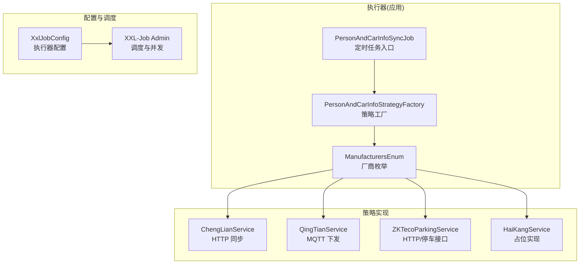
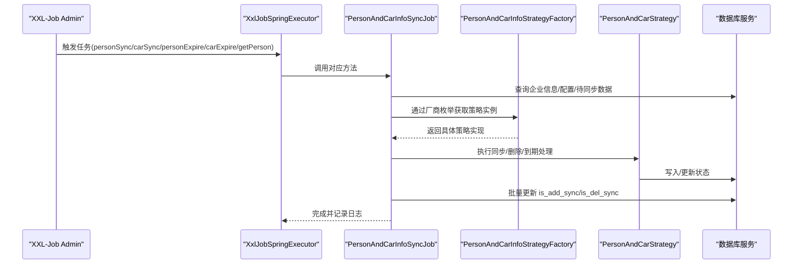
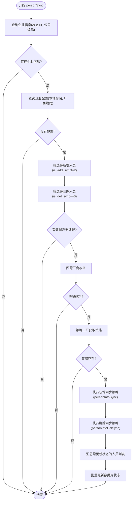
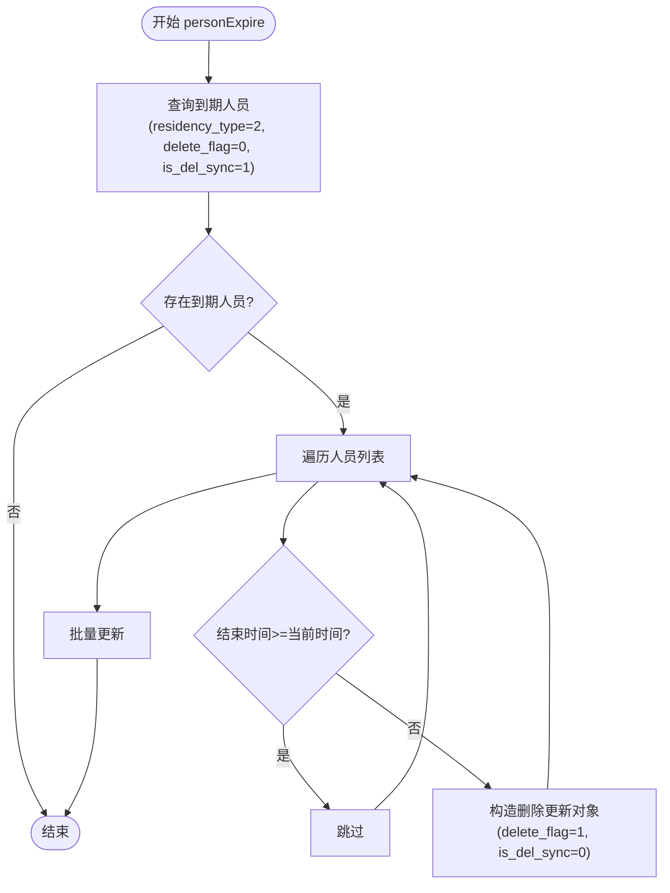
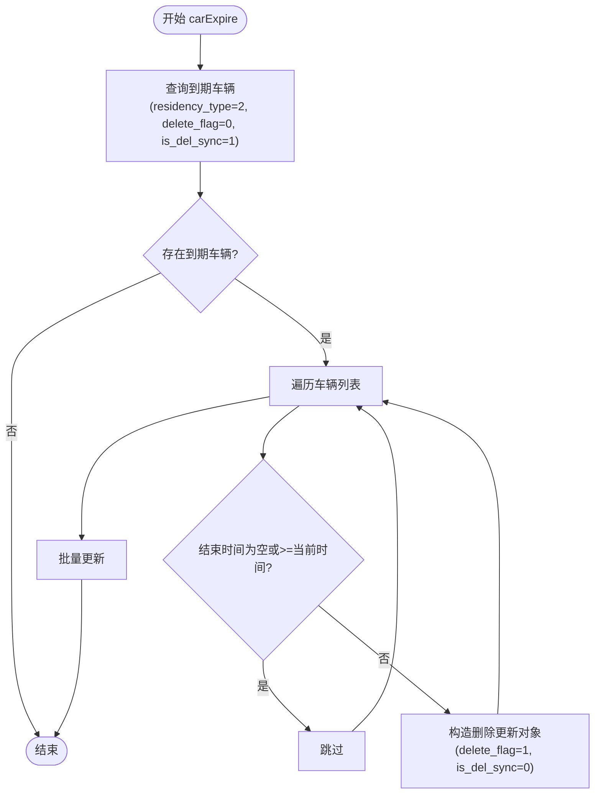
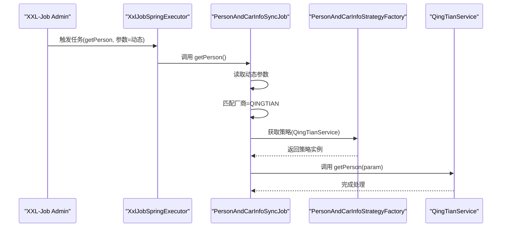
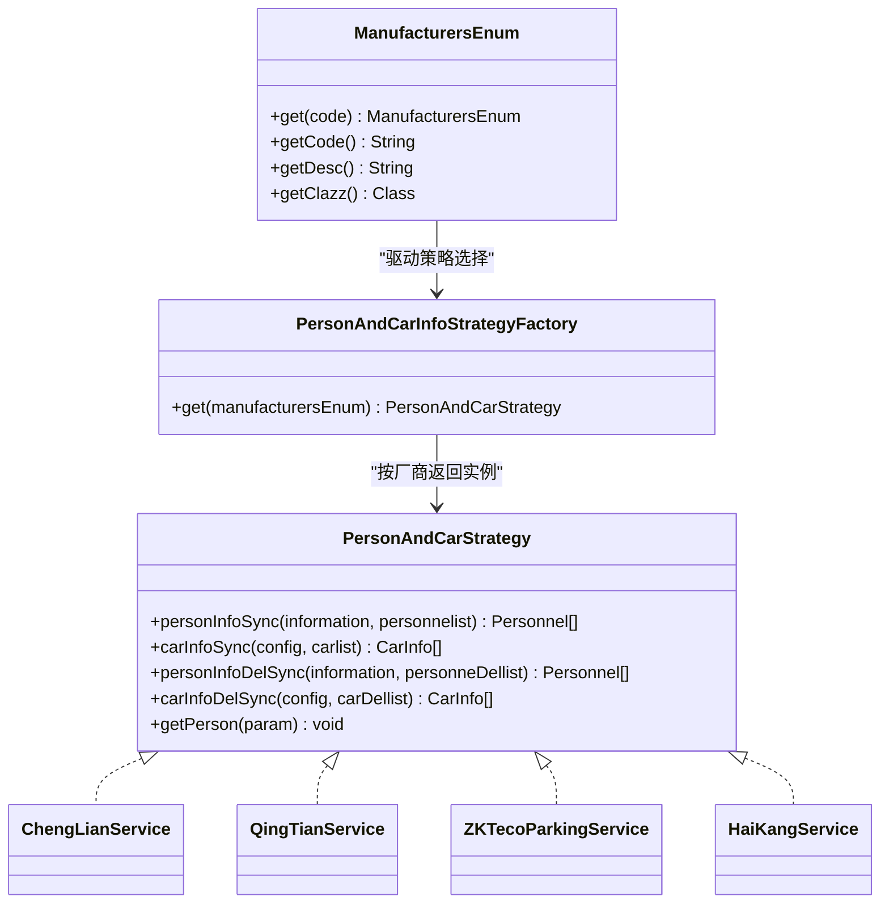
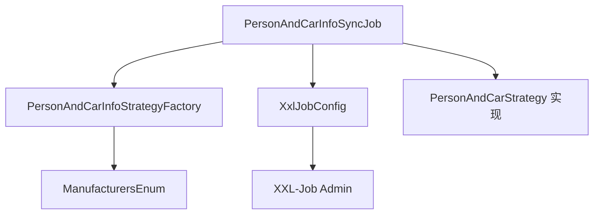

# 设备数据同步任务

<cite>
**本文引用的文件**
- [PersonAndCarInfoSyncJob.java](file://monkey-monitor-api/src/main/java/com/monkey/general/job/PersonAndCarInfoSyncJob.java)
- [PersonAndCarInfoStrategyFactory.java](file://monkey-monitor-api/src/main/java/com/monkey/general/factory/PersonAndCarInfoStrategyFactory.java)
- [ManufacturersEnum.java](file://monkey-monitor-api/src/main/java/com/monkey/general/enums/ManufacturersEnum.java)
- [PersonAndCarStrategy.java](file://monkey-monitor/src/main/java/com/monkey/general/modules/third/service/PersonAndCarStrategy.java)
- [ChengLianService.java](file://monkey-monitor/src/main/java/com/monkey/general/modules/third/service/ChengLianService.java)
- [QingTianService.java](file://monkey-monitor/src/main/java/com/monkey/general/modules/third/service/QingTianService.java)
- [ZKTecoParkingService.java](file://monkey-monitor/src/main/java/com/monkey/general/modules/third/service/ZKTecoParkingService.java)
- [HaiKangService.java](file://monkey-monitor/src/main/java/com/monkey/general/modules/third/service/HaiKangService.java)
- [XxlJobConfig.java](file://monkey-monitor-api/src/main/java/com/monkey/general/config/XxlJobConfig.java)
- [application-dev.yml](file://monkey-monitor-api/src/main/resources/application-dev.yml)
- [XxlJobAdminConfig.java](file://xxl-job-admin/src/main/java/com/xxl/job/admin/core/conf/XxlJobAdminConfig.java)
- [JobTriggerPoolHelper.java](file://xxl-job-admin/src/main/java/com/xxl/job/admin/core/thread/JobTriggerPoolHelper.java)
- [XxlJobRemotingUtil.java](file://xxl-job-core/src/main/java/com/xxl/job/core/util/XxlJobRemotingUtil.java)
- [JobScheduleHelper.java](file://xxl-job-admin/src/main/java/com/xxl/job/admin/core/thread/JobScheduleHelper.java)
</cite>

## 目录
1. [简介](#简介)
2. [项目结构](#项目结构)
3. [核心组件](#核心组件)
4. [架构总览](#架构总览)
5. [详细组件分析](#详细组件分析)
6. [依赖分析](#依赖分析)
7. [性能考虑](#性能考虑)
8. [故障排查指南](#故障排查指南)
9. [结论](#结论)
10. [附录](#附录)

## 简介
本文件围绕设备数据同步任务展开，重点解析 PersonAndCarInfoSyncJob 类的实现原理与工作机制，覆盖以下方面：
- 人员信息同步任务（personSync）的完整流程：企业信息查询、配置获取、待同步数据筛选、厂商枚举匹配、策略工厂调用、数据同步执行与状态更新。
- 车辆信息同步任务（carSync）的实现逻辑：新增与删除两类同步的处理流程。
- 人员到期处理任务（personExpire）与车辆到期处理任务（carExpire）的过期数据清理机制。
- getPerson 任务的动态参数处理与青天设备集成。
- 任务配置参数说明：执行周期、并发控制、超时设置等。
- 策略模式在设备同步中的应用与扩展方法。
- 任务执行状态监控、日志记录与异常处理最佳实践。

## 项目结构
该模块位于 monitor-api 工程中，通过 XXL-Job 执行器调度，结合策略工厂按厂商选择具体同步策略，最终调用第三方平台接口或 MQTT 下发指令，完成人员/车辆数据的同步与到期清理。

**图表来源**
- [PersonAndCarInfoSyncJob.java:50-338](file://monkey-monitor-api/src/main/java/com/monkey/general/job/PersonAndCarInfoSyncJob.java#L50-L338)
- [PersonAndCarInfoStrategyFactory.java:18-35](file://monkey-monitor-api/src/main/java/com/monkey/general/factory/PersonAndCarInfoStrategyFactory.java#L18-L35)
- [ManufacturersEnum.java:8-13](file://monkey-monitor-api/src/main/java/com/monkey/general/enums/ManufacturersEnum.java#L8-L13)
- [XxlJobConfig.java:15-57](file://monkey-monitor-api/src/main/java/com/monkey/general/config/XxlJobConfig.java#L15-L57)

**章节来源**
- [PersonAndCarInfoSyncJob.java:29-338](file://monkey-monitor-api/src/main/java/com/monkey/general/job/PersonAndCarInfoSyncJob.java#L29-L338)
- [XxlJobConfig.java:15-57](file://monkey-monitor-api/src/main/java/com/monkey/general/config/XxlJobConfig.java#L15-L57)

## 核心组件
- 任务入口与编排：PersonAndCarInfoSyncJob
- 策略工厂：PersonAndCarInfoStrategyFactory
- 厂商枚举：ManufacturersEnum
- 策略接口：PersonAndCarStrategy
- 具体策略实现：ChengLianService、QingTianService、ZKTecoParkingService、HaiKangService
- 调度配置：XxlJobConfig、XXL-Job Admin

**章节来源**
- [PersonAndCarInfoSyncJob.java:34-47](file://monkey-monitor-api/src/main/java/com/monkey/general/job/PersonAndCarInfoSyncJob.java#L34-L47)
- [PersonAndCarInfoStrategyFactory.java:18-35](file://monkey-monitor-api/src/main/java/com/monkey/general/factory/PersonAndCarInfoStrategyFactory.java#L18-L35)
- [ManufacturersEnum.java:8-13](file://monkey-monitor-api/src/main/java/com/monkey/general/enums/ManufacturersEnum.java#L8-L13)
- [PersonAndCarStrategy.java:16-29](file://monkey-monitor/src/main/java/com/monkey/general/modules/third/service/PersonAndCarStrategy.java#L16-L29)

## 架构总览
下图展示任务从触发到执行、再到状态更新的整体流程，以及策略模式在其中的应用。

**图表来源**
- [PersonAndCarInfoSyncJob.java:50-338](file://monkey-monitor-api/src/main/java/com/monkey/general/job/PersonAndCarInfoSyncJob.java#L50-L338)
- [PersonAndCarInfoStrategyFactory.java:24-26](file://monkey-monitor-api/src/main/java/com/monkey/general/factory/PersonAndCarInfoStrategyFactory.java#L24-L26)
- [XxlJobConfig.java:44-57](file://monkey-monitor-api/src/main/java/com/monkey/general/config/XxlJobConfig.java#L44-L57)

## 详细组件分析

### 人员信息同步任务（personSync）
该任务负责：
- 查询企业信息与配置，校验企业状态与厂商编码。
- 筛选待新增与待删除的人员数据。
- 匹配厂商枚举，通过策略工厂获取具体策略。
- 分别执行新增与删除同步，并收集需要更新状态的数据。
- 批量更新数据库状态字段。

**图表来源**
- [PersonAndCarInfoSyncJob.java:50-154](file://monkey-monitor-api/src/main/java/com/monkey/general/job/PersonAndCarInfoSyncJob.java#L50-L154)

**章节来源**
- [PersonAndCarInfoSyncJob.java:50-154](file://monkey-monitor-api/src/main/java/com/monkey/general/job/PersonAndCarInfoSyncJob.java#L50-L154)

### 车辆信息同步任务（carSync）
该任务负责：
- 查询企业信息与配置，校验厂商编码。
- 筛选待新增与待删除的车辆数据。
- 匹配厂商枚举并获取策略。
- 分别执行新增与删除同步，并批量更新状态。

**图表来源**
- [PersonAndCarInfoSyncJob.java:157-233](file://monkey-monitor-api/src/main/java/com/monkey/general/job/PersonAndCarInfoSyncJob.java#L157-L233)

**章节来源**
- [PersonAndCarInfoSyncJob.java:157-233](file://monkey-monitor-api/src/main/java/com/monkey/general/job/PersonAndCarInfoSyncJob.java#L157-L233)

### 人员到期处理任务（personExpire）
该任务负责：
- 查询满足到期条件的人员（驻留类型=2，未删除，已标记删除同步）。
- 比较结束时间与当前时间，生成删除更新集合并批量更新。

**图表来源**
- [PersonAndCarInfoSyncJob.java:235-272](file://monkey-monitor-api/src/main/java/com/monkey/general/job/PersonAndCarInfoSyncJob.java#L235-L272)

**章节来源**
- [PersonAndCarInfoSyncJob.java:235-272](file://monkey-monitor-api/src/main/java/com/monkey/general/job/PersonAndCarInfoSyncJob.java#L235-L272)

### 车辆到期处理任务（carExpire）
该任务负责：
- 查询满足到期条件的车辆（驻留类型=2，未删除，已标记删除同步）。
- 比较结束时间与当前时间，生成删除更新集合并批量更新。

**图表来源**
- [PersonAndCarInfoSyncJob.java:274-311](file://monkey-monitor-api/src/main/java/com/monkey/general/job/PersonAndCarInfoSyncJob.java#L274-L311)

**章节来源**
- [PersonAndCarInfoSyncJob.java:274-311](file://monkey-monitor-api/src/main/java/com/monkey/general/job/PersonAndCarInfoSyncJob.java#L274-L311)

### getPerson 任务（动态参数与青天设备集成）
该任务负责：
- 从 XXL-Job 获取动态参数。
- 强制厂商为“青天”，通过策略工厂获取 QingTianService。
- 调用策略的 getPerson 方法进行设备集成。

**图表来源**
- [PersonAndCarInfoSyncJob.java:314-336](file://monkey-monitor-api/src/main/java/com/monkey/general/job/PersonAndCarInfoSyncJob.java#L314-L336)
- [QingTianService.java:100-162](file://monkey-monitor/src/main/java/com/monkey/general/modules/third/service/QingTianService.java#L100-L162)

**章节来源**
- [PersonAndCarInfoSyncJob.java:314-336](file://monkey-monitor-api/src/main/java/com/monkey/general/job/PersonAndCarInfoSyncJob.java#L314-L336)

### 策略模式在设备同步中的应用与扩展
- 策略接口：PersonAndCarStrategy 定义统一的同步与删除接口。
- 策略实现：
  - ChengLianService：基于 HTTP 的人员/车辆新增/删除同步。
  - QingTianService：基于 MQTT 的人员下发与通知。
  - ZKTecoParkingService：基于 HTTP 的停车相关接口。
  - HaiKangService：占位实现（车辆同步与删除暂未实现）。
- 策略工厂：根据厂商枚举动态注入并返回对应策略实例。
- 扩展方法：新增厂商只需：
  - 在 ManufacturersEnum 中注册新枚举项与实现类。
  - 实现 PersonAndCarStrategy 接口的具体策略。
  - 确保策略类被 Spring 扫描并正确装配。

**图表来源**
- [PersonAndCarStrategy.java:16-29](file://monkey-monitor/src/main/java/com/monkey/general/modules/third/service/PersonAndCarStrategy.java#L16-L29)
- [ChengLianService.java:38-90](file://monkey-monitor/src/main/java/com/monkey/general/modules/third/service/ChengLianService.java#L38-L90)
- [QingTianService.java:58-162](file://monkey-monitor/src/main/java/com/monkey/general/modules/third/service/QingTianService.java#L58-L162)
- [ZKTecoParkingService.java:30-39](file://monkey-monitor/src/main/java/com/monkey/general/modules/third/service/ZKTecoParkingService.java#L30-L39)
- [HaiKangService.java:840-868](file://monkey-monitor/src/main/java/com/monkey/general/modules/third/service/HaiKangService.java#L840-L868)
- [PersonAndCarInfoStrategyFactory.java:18-35](file://monkey-monitor-api/src/main/java/com/monkey/general/factory/PersonAndCarInfoStrategyFactory.java#L18-L35)
- [ManufacturersEnum.java:8-13](file://monkey-monitor-api/src/main/java/com/monkey/general/enums/ManufacturersEnum.java#L8-L13)

**章节来源**
- [PersonAndCarStrategy.java:16-29](file://monkey-monitor/src/main/java/com/monkey/general/modules/third/service/PersonAndCarStrategy.java#L16-L29)
- [ChengLianService.java:38-90](file://monkey-monitor/src/main/java/com/monkey/general/modules/third/service/ChengLianService.java#L38-L90)
- [QingTianService.java:58-162](file://monkey-monitor/src/main/java/com/monkey/general/modules/third/service/QingTianService.java#L58-L162)
- [ZKTecoParkingService.java:30-39](file://monkey-monitor/src/main/java/com/monkey/general/modules/third/service/ZKTecoParkingService.java#L30-L39)
- [HaiKangService.java:840-868](file://monkey-monitor/src/main/java/com/monkey/general/modules/third/service/HaiKangService.java#L840-L868)
- [PersonAndCarInfoStrategyFactory.java:18-35](file://monkey-monitor-api/src/main/java/com/monkey/general/factory/PersonAndCarInfoStrategyFactory.java#L18-L35)
- [ManufacturersEnum.java:8-13](file://monkey-monitor-api/src/main/java/com/monkey/general/enums/ManufacturersEnum.java#L8-L13)

## 依赖分析
- 任务与调度：
  - 任务通过 @XxlJob 注解注册，由 XxlJobSpringExecutor 执行。
  - XXL-Job Admin 负责任务调度、并发线程池与超时控制。
- 任务与策略：
  - 策略工厂通过 ApplicationContextAware 初始化，按厂商枚举注入具体策略实现。
- 任务与配置：
  - 执行器地址、应用名、日志路径与保留天数由 XxlJobConfig 注入。
  - 任务参数（如 getPerson 动态参数）由 XXL-Job 传递。

**图表来源**
- [PersonAndCarInfoSyncJob.java:34-47](file://monkey-monitor-api/src/main/java/com/monkey/general/job/PersonAndCarInfoSyncJob.java#L34-L47)
- [PersonAndCarInfoStrategyFactory.java:29-34](file://monkey-monitor-api/src/main/java/com/monkey/general/factory/PersonAndCarInfoStrategyFactory.java#L29-L34)
- [XxlJobConfig.java:44-57](file://monkey-monitor-api/src/main/java/com/monkey/general/config/XxlJobConfig.java#L44-L57)

**章节来源**
- [XxlJobConfig.java:15-57](file://monkey-monitor-api/src/main/java/com/monkey/general/config/XxlJobConfig.java#L15-L57)
- [XxlJobAdminConfig.java:21-46](file://xxl-job-admin/src/main/java/com/xxl/job/admin/core/conf/XxlJobAdminConfig.java#L21-L46)
- [JobTriggerPoolHelper.java:41-108](file://xxl-job-admin/src/main/java/com/xxl/job/admin/core/thread/JobTriggerPoolHelper.java#L41-L108)
- [XxlJobRemotingUtil.java:75-106](file://xxl-job-core/src/main/java/com/xxl/job/core/util/XxlJobRemotingUtil.java#L75-L106)
- [JobScheduleHelper.java:22-40](file://xxl-job-admin/src/main/java/com/xxl/job/admin/core/thread/JobScheduleHelper.java#L22-L40)

## 性能考虑
- 并发与线程池
  - XXL-Job Admin 提供快/慢线程池，根据任务超时次数自动切换，避免阻塞。
  - 可通过配置项调整快/慢线程池大小与队列容量。
- 超时与重试
  - 任务执行超时与失败重试次数可在 Admin 页面配置，确保任务稳定性。
- 日志与保留
  - 执行器日志路径与保留天数由 XxlJobConfig 设置，便于问题追踪与磁盘管理。
- 批量更新
  - 人员/车辆同步完成后采用批量更新状态，减少数据库往返开销。

**章节来源**
- [JobTriggerPoolHelper.java:41-108](file://xxl-job-admin/src/main/java/com/xxl/job/admin/core/thread/JobTriggerPoolHelper.java#L41-L108)
- [XxlJobRemotingUtil.java:75-106](file://xxl-job-core/src/main/java/com/xxl/job/core/util/XxlJobRemotingUtil.java#L75-L106)
- [XxlJobConfig.java:44-57](file://monkey-monitor-api/src/main/java/com/monkey/general/config/XxlJobConfig.java#L44-L57)

## 故障排查指南
- 人员/车辆同步未执行
  - 检查企业信息是否存在且状态正常。
  - 检查企业配置是否存在且厂商编码正确。
  - 检查待同步数据筛选条件是否命中。
- 策略未匹配或未执行
  - 检查厂商枚举是否正确，策略工厂是否注入对应实现。
  - 查看策略实现类是否被 Spring 扫描。
- 异常处理
  - 任务层与策略层均记录错误日志，必要时可抛出异常以触发告警。
- 日志与监控
  - 通过 XXL-Job Admin 查看任务执行日志与状态。
  - 检查执行器日志目录与保留策略。

**章节来源**
- [PersonAndCarInfoSyncJob.java:50-154](file://monkey-monitor-api/src/main/java/com/monkey/general/job/PersonAndCarInfoSyncJob.java#L50-L154)
- [PersonAndCarInfoSyncJob.java:157-233](file://monkey-monitor-api/src/main/java/com/monkey/general/job/PersonAndCarInfoSyncJob.java#L157-L233)
- [PersonAndCarInfoSyncJob.java:235-311](file://monkey-monitor-api/src/main/java/com/monkey/general/job/PersonAndCarInfoSyncJob.java#L235-L311)

## 结论
PersonAndCarInfoSyncJob 通过策略模式将不同厂商的同步逻辑解耦，配合 XXL-Job 的调度能力实现了人员与车辆数据的自动化同步与到期清理。通过合理的配置与日志监控，系统具备良好的可维护性与扩展性。未来可按需扩展更多厂商策略，完善车辆同步与删除的占位实现，并优化批量更新与并发控制策略。

## 附录

### 任务配置参数说明
- 执行周期
  - 通过 XXL-Job Admin 配置 Cron 表达式，支持分钟级调度。
- 并发控制
  - 快/慢线程池自动切换，避免长时间超时任务阻塞。
- 超时设置
  - 任务超时与失败重试次数可在 Admin 页面配置。
- 执行器参数
  - 执行器地址、应用名、IP/端口、日志路径与保留天数由 XxlJobConfig 注入。

**章节来源**
- [application-dev.yml:117-136](file://monkey-monitor-api/src/main/resources/application-dev.yml#L117-L136)
- [XxlJobConfig.java:19-57](file://monkey-monitor-api/src/main/java/com/monkey/general/config/XxlJobConfig.java#L19-L57)
- [XxlJobAdminConfig.java:61-66](file://xxl-job-admin/src/main/java/com/xxl/job/admin/core/conf/XxlJobAdminConfig.java#L61-L66)