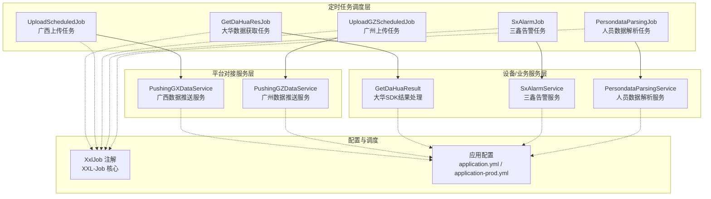
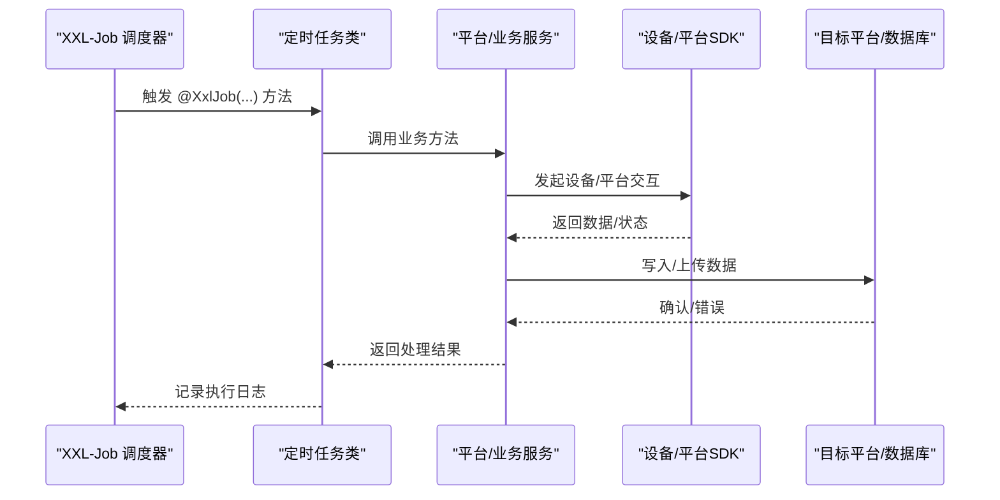
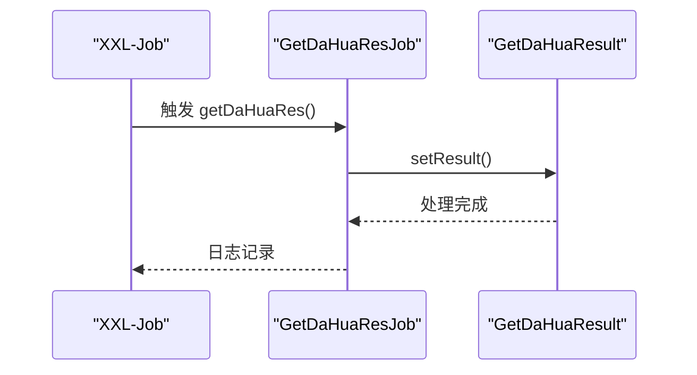
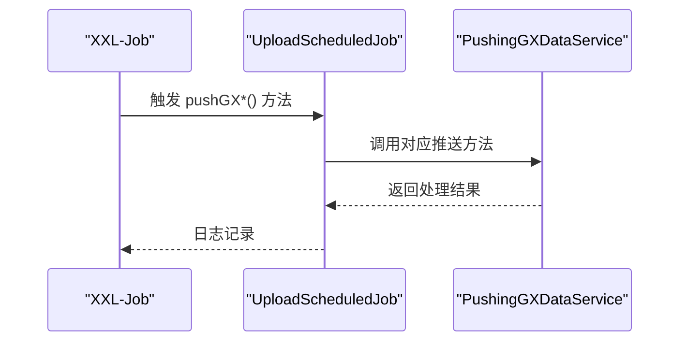
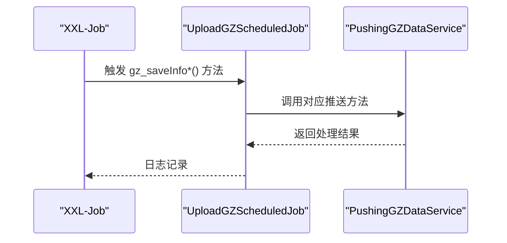
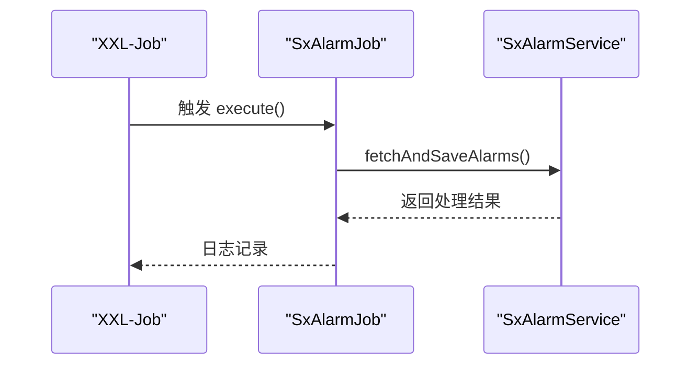
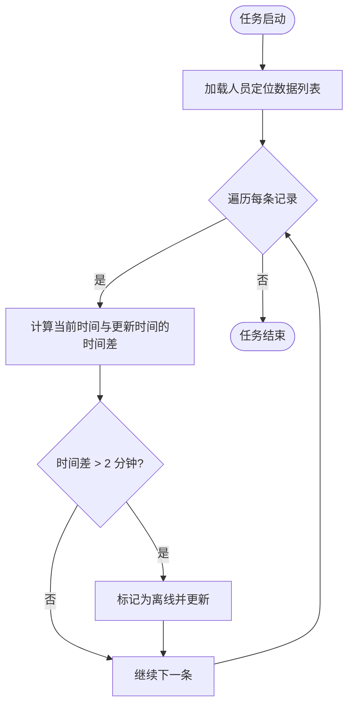
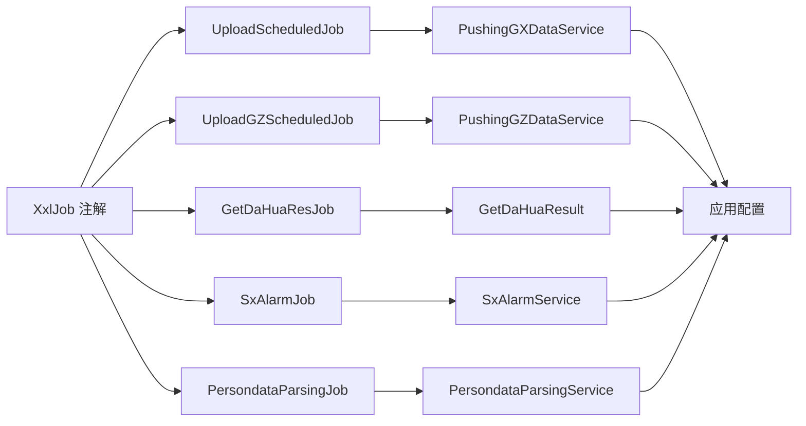

# 设备集成任务

<cite>
**本文引用的文件**
- [GetDaHuaResJob.java](file://monkey-monitor-api/src/main/java/com/monkey/general/job/dh/GetDaHuaResJob.java)
- [GetDaHuaResult.java](file://monkey-monitor/src/main/java/com/monkey/general/dahua/GetDaHuaResult.java)
- [UploadScheduledJob.java](file://monkey-monitor-api/src/main/java/com/monkey/general/job/gx/UploadScheduledJob.java)
- [PushingGXDataService.java](file://monkey-monitor/src/main/java/com/monkey/general/platform/push/gx/PushingGXDataService.java)
- [UploadGZScheduledJob.java](file://monkey-monitor-api/src/main/java/com/monkey/general/job/gz/UploadGZScheduledJob.java)
- [PushingGZDataService.java](file://monkey-monitor/src/main/java/com/monkey/general/platform/push/gz/PushingGZDataService.java)
- [SxAlarmJob.java](file://monkey-monitor-api/src/main/java/com/monkey/general/job/sx/SxAlarmJob.java)
- [SxAlarmService.java](file://monkey-monitor/src/main/java/com/monkey/general/modules/sx/SxAlarmService.java)
- [PersondataParsingJob.java](file://monkey-monitor-api/src/main/java/com/monkey/general/job/zyry/PersondataParsingJob.java)
- [PersondataParsingService.java](file://monkey-monitor/src/main/java/com/monkey/general/modules/em/service/PersondataParsingService.java)
- [XxlJob.java](file://xxl-job-core/src/main/java/com/xxl/job/core/handler/annotation/XxlJob.java)
- [application.yml](file://monkey-monitor-api/src/main/resources/application.yml)
- [application-prod.yml](file://deploy/config/monitor-api/application-prod.yml)
</cite>

## 目录
1. [简介](#简介)
2. [项目结构](#项目结构)
3. [核心组件](#核心组件)
4. [架构总览](#架构总览)
5. [详细组件分析](#详细组件分析)
6. [依赖分析](#依赖分析)
7. [性能考虑](#性能考虑)
8. [故障排除指南](#故障排除指南)
9. [结论](#结论)
10. [附录](#附录)

## 简介
本文件系统性梳理并说明设备集成相关的定时任务实现，覆盖以下方面：
- 大华设备数据获取任务（GetDaHuaResJob）的SDK集成与数据解析机制，包括设备连接管理、实时数据获取与历史数据同步。
- 高新兴平台上传任务（UploadScheduledJob）与广州平台上传任务（UploadGZScheduledJob）的平台对接与数据传输流程。
- 三鑫告警任务（SxAlarmJob）的告警数据获取与处理机制。
- 人员数据解析任务（PersondataParsingJob）的数据处理与转换逻辑。
- 各任务的配置参数与依赖关系，包括设备地址、认证信息、传输协议等关键设置。
- 设备集成任务的监控与调试方法，包括连接状态检查、数据质量验证与异常处理策略。
- 设备集成任务的扩展开发指南与第三方设备接入的最佳实践。

## 项目结构
设备集成任务主要分布在以下模块中：
- 定时任务调度层：位于 monitor-api 模块的 job 包下，使用 XXL-Job 注解驱动。
- 平台对接服务层：位于 monitor 模块的 platform.push.* 包下，封装与各平台的数据传输细节。
- 设备SDK集成与业务服务：位于 monitor 模块的 dahua、modules.* 包下，负责具体设备或平台交互。
- 任务注册与配置：XXL-Job 核心注解定义于 xxl-job-core 模块；应用配置位于 monitor-api 与部署配置中。

图表来源
- [GetDaHuaResJob.java:1-26](file://monkey-monitor-api/src/main/java/com/monkey/general/job/dh/GetDaHuaResJob.java#L1-L26)
- [UploadScheduledJob.java:1-162](file://monkey-monitor-api/src/main/java/com/monkey/general/job/gx/UploadScheduledJob.java#L1-L162)
- [UploadGZScheduledJob.java:1-120](file://monkey-monitor-api/src/main/java/com/monkey/general/job/gz/UploadGZScheduledJob.java#L1-L120)
- [SxAlarmJob.java:1-35](file://monkey-monitor-api/src/main/java/com/monkey/general/job/sx/SxAlarmJob.java#L1-L35)
- [PersondataParsingJob.java:1-56](file://monkey-monitor-api/src/main/java/com/monkey/general/job/zyry/PersondataParsingJob.java#L1-L56)
- [PushingGXDataService.java](file://monkey-monitor/src/main/java/com/monkey/general/platform/push/gx/PushingGXDataService.java)
- [PushingGZDataService.java](file://monkey-monitor/src/main/java/com/monkey/general/platform/push/gz/PushingGZDataService.java)
- [GetDaHuaResult.java](file://monkey-monitor/src/main/java/com/monkey/general/dahua/GetDaHuaResult.java)
- [SxAlarmService.java](file://monkey-monitor/src/main/java/com/monkey/general/modules/sx/SxAlarmService.java)
- [PersondataParsingService.java](file://monkey-monitor/src/main/java/com/monkey/general/modules/em/service/PersondataParsingService.java)
- [XxlJob.java](file://xxl-job-core/src/main/java/com/xxl/job/core/handler/annotation/XxlJob.java)
- [application.yml](file://monkey-monitor-api/src/main/resources/application.yml)
- [application-prod.yml](file://deploy/config/monitor-api/application-prod.yml)

章节来源
- [GetDaHuaResJob.java:1-26](file://monkey-monitor-api/src/main/java/com/monkey/general/job/dh/GetDaHuaResJob.java#L1-L26)
- [UploadScheduledJob.java:1-162](file://monkey-monitor-api/src/main/java/com/monkey/general/job/gx/UploadScheduledJob.java#L1-L162)
- [UploadGZScheduledJob.java:1-120](file://monkey-monitor-api/src/main/java/com/monkey/general/job/gz/UploadGZScheduledJob.java#L1-L120)
- [SxAlarmJob.java:1-35](file://monkey-monitor-api/src/main/java/com/monkey/general/job/sx/SxAlarmJob.java#L1-L35)
- [PersondataParsingJob.java:1-56](file://monkey-monitor-api/src/main/java/com/monkey/general/job/zyry/PersondataParsingJob.java#L1-L56)

## 核心组件
- 大华设备数据获取任务（GetDaHuaResJob）
  - 角色：通过 XXL-Job 调度，调用 GetDaHuaResult 执行大华SDK相关结果处理。
  - 关键点：任务入口方法使用 @XxlJob("getDaHuaRes") 注册；实际SDK集成与结果处理由 GetDaHuaResult 实现。
- 广西平台上传任务（UploadScheduledJob）
  - 角色：按计划周期触发多项数据上传任务，涵盖人员、仓库、库房、设备、报警、出入记录等。
  - 关键点：每个上传动作对应一个 @XxlJob(...) 方法，统一委托给 PushingGXDataService。
- 广州平台上传任务（UploadGZScheduledJob）
  - 角色：按计划周期触发多项数据上传任务，涵盖企业、人员、仓库、库房、服务器、设备、监测指标、报警、处置反馈、视频等。
  - 关键点：每个上传动作对应一个 @XxlJob(...) 方法，统一委托给 PushingGZDataService。
- 三鑫告警任务（SxAlarmJob）
  - 角色：定时拉取三鑫告警数据并持久化。
  - 关键点：任务入口方法使用 @XxlJob("sxAlarmJob") 注册；异常捕获与日志记录完善。
- 人员数据解析任务（PersondataParsingJob）
  - 角色：基于更新时间判断人员定位数据是否在线，超过阈值则标记为离线。
  - 关键点：每分钟执行一次；通过 PersondataParsingService 更新状态。

章节来源
- [GetDaHuaResJob.java:14-24](file://monkey-monitor-api/src/main/java/com/monkey/general/job/dh/GetDaHuaResJob.java#L14-L24)
- [UploadScheduledJob.java:26-120](file://monkey-monitor-api/src/main/java/com/monkey/general/job/gx/UploadScheduledJob.java#L26-L120)
- [UploadGZScheduledJob.java:16-120](file://monkey-monitor-api/src/main/java/com/monkey/general/job/gz/UploadGZScheduledJob.java#L16-L120)
- [SxAlarmJob.java:24-33](file://monkey-monitor-api/src/main/java/com/monkey/general/job/sx/SxAlarmJob.java#L24-L33)
- [PersondataParsingJob.java:31-53](file://monkey-monitor-api/src/main/java/com/monkey/general/job/zyry/PersondataParsingJob.java#L31-L53)

## 架构总览
设备集成任务采用“任务调度 + 平台服务 + 设备/业务服务”的分层架构。XXL-Job 提供统一的任务注册与调度能力，各平台服务封装与目标平台的对接细节，设备/业务服务负责具体的数据处理与SDK集成。

图表来源
- [XxlJob.java](file://xxl-job-core/src/main/java/com/xxl/job/core/handler/annotation/XxlJob.java)
- [GetDaHuaResJob.java:19-24](file://monkey-monitor-api/src/main/java/com/monkey/general/job/dh/GetDaHuaResJob.java#L19-L24)
- [UploadScheduledJob.java:26-120](file://monkey-monitor-api/src/main/java/com/monkey/general/job/gx/UploadScheduledJob.java#L26-L120)
- [UploadGZScheduledJob.java:16-120](file://monkey-monitor-api/src/main/java/com/monkey/general/job/gz/UploadGZScheduledJob.java#L16-L120)
- [SxAlarmJob.java:24-33](file://monkey-monitor-api/src/main/java/com/monkey/general/job/sx/SxAlarmJob.java#L24-L33)
- [PersondataParsingJob.java:31-53](file://monkey-monitor-api/src/main/java/com/monkey/general/job/zyry/PersondataParsingJob.java#L31-L53)

## 详细组件分析

### 大华设备数据获取任务（GetDaHuaResJob）
- 任务职责
  - 通过 XXL-Job 调度，触发大华SDK相关结果处理流程。
  - 入口方法使用 @XxlJob("getDaHuaRes") 注册，实际SDK集成与结果处理由 GetDaHuaResult 实现。
- 数据流
  - 调度器触发 -> 任务方法 -> GetDaHuaResult.setResult() -> 处理完成。
- 关键实现位置
  - 任务类：[GetDaHuaResJob.java:19-24](file://monkey-monitor-api/src/main/java/com/monkey/general/job/dh/GetDaHuaResJob.java#L19-L24)
  - 结果处理服务：[GetDaHuaResult.java](file://monkey-monitor/src/main/java/com/monkey/general/dahua/GetDaHuaResult.java)

图表来源
- [GetDaHuaResJob.java:19-24](file://monkey-monitor-api/src/main/java/com/monkey/general/job/dh/GetDaHuaResJob.java#L19-L24)
- [GetDaHuaResult.java](file://monkey-monitor/src/main/java/com/monkey/general/dahua/GetDaHuaResult.java)

章节来源
- [GetDaHuaResJob.java:14-24](file://monkey-monitor-api/src/main/java/com/monkey/general/job/dh/GetDaHuaResJob.java#L14-L24)

### 广西平台上传任务（UploadScheduledJob）
- 任务职责
  - 按计划周期触发多项数据上传任务，包括人员、仓库、库房、服务器、设备、报警、访客、出入记录等。
  - 每个上传动作对应一个 @XxlJob(...) 方法，统一委托给 PushingGXDataService。
- 数据流
  - 调度器触发 -> 任务方法 -> PushingGXDataService 对应方法 -> 平台接口 -> 确认/错误 -> 日志记录。
- 关键实现位置
  - 任务类：[UploadScheduledJob.java:26-120](file://monkey-monitor-api/src/main/java/com/monkey/general/job/gx/UploadScheduledJob.java#L26-L120)
  - 平台服务：[PushingGXDataService.java](file://monkey-monitor/src/main/java/com/monkey/general/platform/push/gx/PushingGXDataService.java)

图表来源
- [UploadScheduledJob.java:26-120](file://monkey-monitor-api/src/main/java/com/monkey/general/job/gx/UploadScheduledJob.java#L26-L120)
- [PushingGXDataService.java](file://monkey-monitor/src/main/java/com/monkey/general/platform/push/gx/PushingGXDataService.java)

章节来源
- [UploadScheduledJob.java:14-162](file://monkey-monitor-api/src/main/java/com/monkey/general/job/gx/UploadScheduledJob.java#L14-L162)

### 广州平台上传任务（UploadGZScheduledJob）
- 任务职责
  - 按计划周期触发多项数据上传任务，包括企业、人员、仓库、库房、服务器、设备、监测指标、报警、处置反馈、视频等。
  - 每个上传动作对应一个 @XxlJob(...) 方法，统一委托给 PushingGZDataService。
- 数据流
  - 调度器触发 -> 任务方法 -> PushingGZDataService 对应方法 -> 平台接口 -> 确认/错误 -> 日志记录。
- 关键实现位置
  - 任务类：[UploadGZScheduledJob.java:16-120](file://monkey-monitor-api/src/main/java/com/monkey/general/job/gz/UploadGZScheduledJob.java#L16-L120)
  - 平台服务：[PushingGZDataService.java](file://monkey-monitor/src/main/java/com/monkey/general/platform/push/gz/PushingGZDataService.java)

图表来源
- [UploadGZScheduledJob.java:16-120](file://monkey-monitor-api/src/main/java/com/monkey/general/job/gz/UploadGZScheduledJob.java#L16-L120)
- [PushingGZDataService.java](file://monkey-monitor/src/main/java/com/monkey/general/platform/push/gz/PushingGZDataService.java)

章节来源
- [UploadGZScheduledJob.java:11-120](file://monkey-monitor-api/src/main/java/com/monkey/general/job/gz/UploadGZScheduledJob.java#L11-L120)

### 三鑫告警任务（SxAlarmJob）
- 任务职责
  - 定时拉取三鑫告警数据并持久化，建议执行频率为每分钟。
- 数据流
  - 调度器触发 -> 任务方法 -> SxAlarmService.fetchAndSaveAlarms() -> 异常捕获与日志记录。
- 关键实现位置
  - 任务类：[SxAlarmJob.java:24-33](file://monkey-monitor-api/src/main/java/com/monkey/general/job/sx/SxAlarmJob.java#L24-L33)
  - 告警服务：[SxAlarmService.java](file://monkey-monitor/src/main/java/com/monkey/general/modules/sx/SxAlarmService.java)

图表来源
- [SxAlarmJob.java:24-33](file://monkey-monitor-api/src/main/java/com/monkey/general/job/sx/SxAlarmJob.java#L24-L33)
- [SxAlarmService.java](file://monkey-monitor/src/main/java/com/monkey/general/modules/sx/SxAlarmService.java)

章节来源
- [SxAlarmJob.java:16-35](file://monkey-monitor-api/src/main/java/com/monkey/general/job/sx/SxAlarmJob.java#L16-L35)

### 人员数据解析任务（PersondataParsingJob）
- 任务职责
  - 基于更新时间判断人员定位数据是否在线，超过2分钟则标记为离线。
- 数据流
  - 调度器触发 -> 任务方法 -> 查询列表 -> 计算时间差 -> 更新状态 -> 日志记录。
- 关键实现位置
  - 任务类：[PersondataParsingJob.java:31-53](file://monkey-monitor-api/src/main/java/com/monkey/general/job/zyry/PersondataParsingJob.java#L31-L53)
  - 业务服务：[PersondataParsingService.java](file://monkey-monitor/src/main/java/com/monkey/general/modules/em/service/PersondataParsingService.java)

图表来源
- [PersondataParsingJob.java:31-53](file://monkey-monitor-api/src/main/java/com/monkey/general/job/zyry/PersondataParsingJob.java#L31-L53)
- [PersondataParsingService.java](file://monkey-monitor/src/main/java/com/monkey/general/modules/em/service/PersondataParsingService.java)

章节来源
- [PersondataParsingJob.java:21-56](file://monkey-monitor-api/src/main/java/com/monkey/general/job/zyry/PersondataParsingJob.java#L21-L56)

## 依赖分析
- 组件耦合与内聚
  - 任务类仅承担调度入口与异常日志，业务逻辑集中在平台/业务服务中，符合高内聚低耦合原则。
  - 平台服务对设备/平台SDK进行封装，便于替换与扩展。
- 直接与间接依赖
  - 任务类依赖对应的平台/业务服务。
  - 平台/业务服务依赖设备/平台SDK与数据访问层。
- 外部依赖与集成点
  - XXL-Job 核心注解用于任务注册与调度。
  - 应用配置文件提供连接参数与运行环境设置。
- 接口契约与实现细节
  - 任务方法通过 @XxlJob 注解声明，调度器据此触发。
  - 平台服务方法负责数据组装、传输与错误处理。

图表来源
- [XxlJob.java](file://xxl-job-core/src/main/java/com/xxl/job/core/handler/annotation/XxlJob.java)
- [GetDaHuaResJob.java:19-24](file://monkey-monitor-api/src/main/java/com/monkey/general/job/dh/GetDaHuaResJob.java#L19-L24)
- [UploadScheduledJob.java:26-120](file://monkey-monitor-api/src/main/java/com/monkey/general/job/gx/UploadScheduledJob.java#L26-L120)
- [UploadGZScheduledJob.java:16-120](file://monkey-monitor-api/src/main/java/com/monkey/general/job/gz/UploadGZScheduledJob.java#L16-L120)
- [SxAlarmJob.java:24-33](file://monkey-monitor-api/src/main/java/com/monkey/general/job/sx/SxAlarmJob.java#L24-L33)
- [PersondataParsingJob.java:31-53](file://monkey-monitor-api/src/main/java/com/monkey/general/job/zyry/PersondataParsingJob.java#L31-L53)

章节来源
- [XxlJob.java](file://xxl-job-core/src/main/java/com/xxl/job/core/handler/annotation/XxlJob.java)
- [application.yml](file://monkey-monitor-api/src/main/resources/application.yml)
- [application-prod.yml](file://deploy/config/monitor-api/application-prod.yml)

## 性能考虑
- 任务粒度与并发控制
  - 建议根据平台限流与网络带宽合理设置任务执行间隔，避免并发过高导致平台限流或服务抖动。
- 数据批量化处理
  - 平台服务在数据量较大时可采用分页/批量方式上传，减少单次请求开销。
- 资源占用优化
  - 设备SDK调用需注意连接池与超时设置，避免长时间占用线程资源。
- 监控与告警
  - 建议在任务中增加执行耗时与失败次数统计，并结合平台返回码进行异常分级告警。

## 故障排除指南
- 连接状态检查
  - 平台服务在初始化或调用前校验连接参数与可用性，必要时重连或降级。
- 数据质量验证
  - 对上传数据进行格式与字段校验，确保必填字段完整且类型正确。
- 异常处理策略
  - 任务方法已包含基本异常捕获与日志记录，建议补充重试与死信队列处理。
- 常见问题定位
  - 若任务未执行：检查 XXL-Job 调度器状态与任务注册情况。
  - 若上传失败：检查平台服务日志与返回码，确认网络与鉴权配置。
  - 若数据不一致：核对时间戳与去重策略，确保幂等性。

章节来源
- [SxAlarmJob.java:27-31](file://monkey-monitor-api/src/main/java/com/monkey/general/job/sx/SxAlarmJob.java#L27-L31)
- [PersondataParsingJob.java:32-52](file://monkey-monitor-api/src/main/java/com/monkey/general/job/zyry/PersondataParsingJob.java#L32-L52)

## 结论
本文档从架构与实现两个层面梳理了设备集成相关的定时任务，明确了各任务的职责边界、数据流与依赖关系，并提供了配置要点、监控调试与扩展开发建议。建议在生产环境中结合平台限流与网络状况，合理设置任务执行策略，并持续完善异常处理与可观测性建设。

## 附录
- 任务配置参数与依赖关系
  - 设备地址、认证信息、传输协议等关键设置通常位于应用配置文件中，建议集中管理并区分环境。
  - 参考路径：
    - [application.yml](file://monkey-monitor-api/src/main/resources/application.yml)
    - [application-prod.yml](file://deploy/config/monitor-api/application-prod.yml)
- 第三方设备接入最佳实践
  - 封装统一的SDK适配层，抽象设备能力与错误码。
  - 增加连接健康检查与自动重连机制。
  - 对设备事件与历史数据分别设计独立的采集与同步策略。
  - 为不同厂商设备建立独立的命名空间与配置模板，便于扩展与维护。