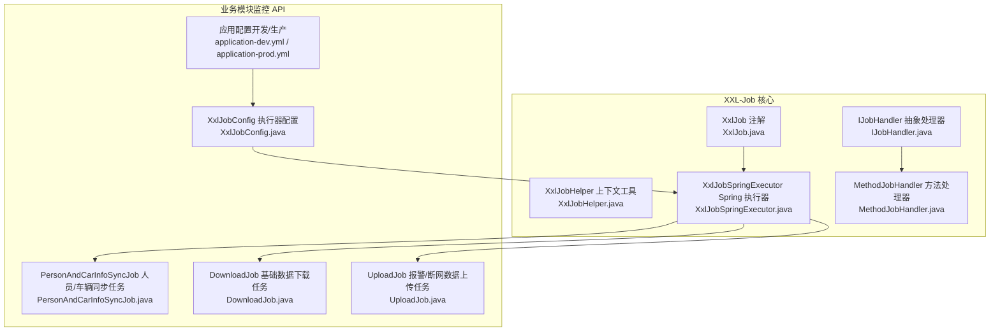
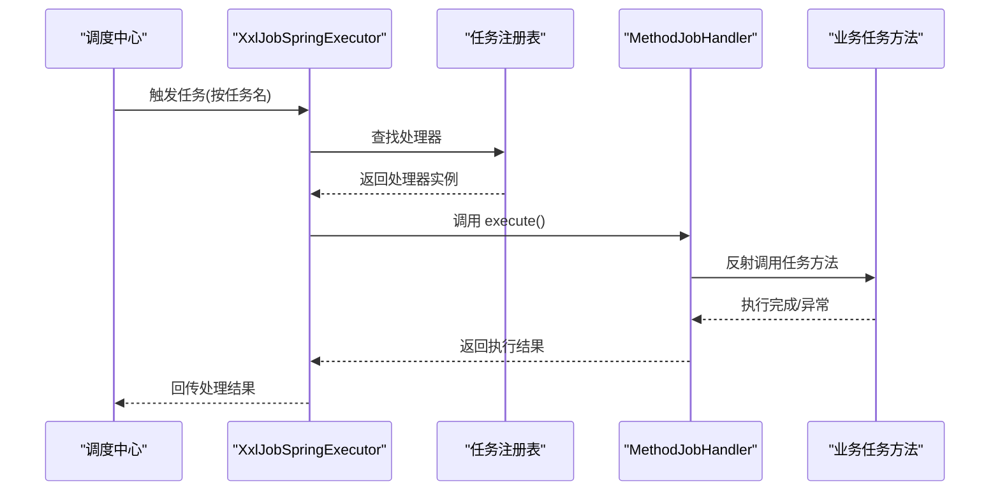
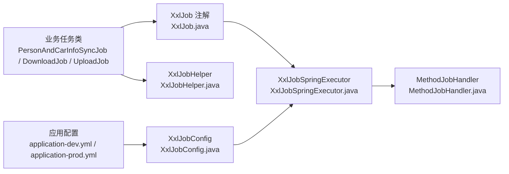

# 自定义任务开发

<cite>
**本文引用的文件**   
- [XxlJob.java](file://xxl-job-core/src/main/java/com/xxl/job/core/handler/annotation/XxlJob.java)
- [IJobHandler.java](file://xxl-job-core/src/main/java/com/xxl/job/core/handler/IJobHandler.java)
- [XxlJobHelper.java](file://xxl-job-core/src/main/java/com/xxl/job/core/context/XxlJobHelper.java)
- [XxlJobSpringExecutor.java](file://xxl-job-core/src/main/java/com/xxl/job/core/executor/impl/XxlJobSpringExecutor.java)
- [MethodJobHandler.java](file://xxl-job-core/src/main/java/com/xxl/job/core/handler/impl/MethodJobHandler.java)
- [XxlJobConfig.java](file://monkey-monitor-api/src/main/java/com/monkey/general/config/XxlJobConfig.java)
- [PersonAndCarInfoSyncJob.java](file://monkey-monitor-api/src/main/java/com/monkey/general/job/PersonAndCarInfoSyncJob.java)
- [DownloadJob.java](file://monkey-monitor-api/src/main/java/com/monkey/general/job/DownloadJob.java)
- [UploadJob.java](file://monkey-monitor-api/src/main/java/com/monkey/general/job/UploadJob.java)
- [application-dev.yml](file://monkey-monitor-api/src/main/resources/application-dev.yml)
- [application-prod.yml](file://monkey-monitor-api/src/main/resources/application-prod.yml)
- [application.yml](file://monkey-monitor-api/src/main/resources/application.yml)
- [pom.xml](file://pom.xml)
</cite>

## 目录
1. [简介](#简介)
2. [项目结构](#项目结构)
3. [核心组件](#核心组件)
4. [架构总览](#架构总览)
5. [详细组件分析](#详细组件分析)
6. [依赖分析](#依赖分析)
7. [性能考量](#性能考量)
8. [故障排查指南](#故障排查指南)
9. [结论](#结论)
10. [附录](#附录)

## 简介
本文件面向在安威 fireworks 项目中开发自定义 XXL-Job 任务的工程师，系统讲解任务注解的使用、任务接口实现、方法签名与执行逻辑、依赖注入与 Spring 集成、开发与测试流程、打包部署以及最佳实践与性能优化建议。内容基于仓库中已有的 XXL-Job 核心模块与监控 API 模块中的实际实现进行整理。

## 项目结构
- XXL-Job 核心能力位于独立模块，提供注解、处理器抽象类、上下文工具、Spring 执行器与方法型处理器等。
- 业务侧在监控 API 模块中通过 Spring 组件与注解注册任务，并结合配置文件完成执行器初始化与任务编排。

图表来源
- [XxlJob.java:10-30](file://xxl-job-core/src/main/java/com/xxl/job/core/handler/annotation/XxlJob.java#L10-L30)
- [IJobHandler.java:8-38](file://xxl-job-core/src/main/java/com/xxl/job/core/handler/IJobHandler.java#L8-L38)
- [XxlJobHelper.java:19-255](file://xxl-job-core/src/main/java/com/xxl/job/core/context/XxlJobHelper.java#L19-L255)
- [XxlJobSpringExecutor.java:26-147](file://xxl-job-core/src/main/java/com/xxl/job/core/executor/impl/XxlJobSpringExecutor.java#L26-L147)
- [MethodJobHandler.java:10-53](file://xxl-job-core/src/main/java/com/xxl/job/core/handler/impl/MethodJobHandler.java#L10-L53)
- [XxlJobConfig.java:15-77](file://monkey-monitor-api/src/main/java/com/monkey/general/config/XxlJobConfig.java#L15-L77)
- [PersonAndCarInfoSyncJob.java:34-338](file://monkey-monitor-api/src/main/java/com/monkey/general/job/PersonAndCarInfoSyncJob.java#L34-L338)
- [DownloadJob.java:18-42](file://monkey-monitor-api/src/main/java/com/monkey/general/job/DownloadJob.java#L18-L42)
- [UploadJob.java:44-202](file://monkey-monitor-api/src/main/java/com/monkey/general/job/UploadJob.java#L44-L202)
- [application-dev.yml:117-136](file://monkey-monitor-api/src/main/resources/application-dev.yml#L117-L136)
- [application-prod.yml:115-134](file://monkey-monitor-api/src/main/resources/application-prod.yml#L115-L134)

章节来源
- [XxlJob.java:10-30](file://xxl-job-core/src/main/java/com/xxl/job/core/handler/annotation/XxlJob.java#L10-L30)
- [XxlJobConfig.java:15-77](file://monkey-monitor-api/src/main/java/com/monkey/general/config/XxlJobConfig.java#L15-L77)
- [application-dev.yml:117-136](file://monkey-monitor-api/src/main/resources/application-dev.yml#L117-L136)
- [application-prod.yml:115-134](file://monkey-monitor-api/src/main/resources/application-prod.yml#L115-L134)

## 核心组件
- 任务注解：用于标注方法型任务处理器，声明任务名称及生命周期回调。
- 处理器抽象：定义 execute/init/destroy 生命周期方法，统一任务执行入口。
- 上下文工具：提供 jobId、jobParam、日志写入、结果标记等运行期能力。
- Spring 执行器：扫描带注解的方法，注册为任务处理器，支持 Spring 容器管理。
- 方法处理器：将注解方法包装为可执行处理器，支持无参或参数化调用。

章节来源
- [XxlJob.java:10-30](file://xxl-job-core/src/main/java/com/xxl/job/core/handler/annotation/XxlJob.java#L10-L30)
- [IJobHandler.java:8-38](file://xxl-job-core/src/main/java/com/xxl/job/core/handler/IJobHandler.java#L8-L38)
- [XxlJobHelper.java:19-255](file://xxl-job-core/src/main/java/com/xxl/job/core/context/XxlJobHelper.java#L19-L255)
- [XxlJobSpringExecutor.java:26-147](file://xxl-job-core/src/main/java/com/xxl/job/core/executor/impl/XxlJobSpringExecutor.java#L26-L147)
- [MethodJobHandler.java:10-53](file://xxl-job-core/src/main/java/com/xxl/job/core/handler/impl/MethodJobHandler.java#L10-L53)

## 架构总览
XXL-Job 在 fireworks 中的集成路径如下：
- 应用启动加载执行器配置，初始化 Spring 执行器。
- 执行器扫描带注解的任务方法，注册为处理器。
- 调度中心下发触发指令，执行器根据任务名路由到对应处理器。
- 处理器执行业务逻辑，使用上下文工具记录日志与标记结果。

图表来源
- [XxlJobSpringExecutor.java:80-124](file://xxl-job-core/src/main/java/com/xxl/job/core/executor/impl/XxlJobSpringExecutor.java#L80-L124)
- [MethodJobHandler.java:25-33](file://xxl-job-core/src/main/java/com/xxl/job/core/handler/impl/MethodJobHandler.java#L25-L33)
- [XxlJobHelper.java:179-252](file://xxl-job-core/src/main/java/com/xxl/job/core/context/XxlJobHelper.java#L179-L252)

## 详细组件分析

### 任务注解与参数配置
- 注解位置与作用域：仅用于方法级别，声明任务名称与生命周期回调。
- 参数说明：
  - value：任务名称，需与调度中心配置一致。
  - init：初始化回调方法名（可选）。
  - destroy：销毁回调方法名（可选）。
- 使用要点：
  - 任务方法必须为无参或可反射调用的形式。
  - 建议配合 Spring 组件注解（如 @Component）以便被扫描注册。

章节来源
- [XxlJob.java:10-30](file://xxl-job-core/src/main/java/com/xxl/job/core/handler/annotation/XxlJob.java#L10-L30)

### 任务接口与实现规范
- IJobHandler 抽象类定义：
  - execute：任务执行入口，抛出异常将影响任务结果标记。
  - init/destroy：生命周期钩子，可在方法处理器中调用目标对象的同名方法。
- 实现建议：
  - 保持 execute 内部幂等与可重试性。
  - 在异常分支明确记录日志并返回失败标记，便于可观测性。
  - 若存在资源占用，务必在 destroy 中释放。

章节来源
- [IJobHandler.java:8-38](file://xxl-job-core/src/main/java/com/xxl/job/core/handler/IJobHandler.java#L8-L38)

### 任务方法签名与执行逻辑
- 方法签名要求：
  - 无参或可反射调用。
  - 建议使用 @XxlJob 标注方法名即任务名。
- 执行逻辑编写：
  - 使用上下文工具获取 jobId、jobParam、分片信息等。
  - 使用日志工具输出结构化日志，便于定位问题。
  - 明确标记执行结果（成功/失败/超时），便于调度中心统计。
- 异常处理：
  - 捕获并记录异常，必要时抛出以触发失败标记。
  - 对于可恢复错误，建议重试或延时后再次尝试。

章节来源
- [MethodJobHandler.java:25-33](file://xxl-job-core/src/main/java/com/xxl/job/core/handler/impl/MethodJobHandler.java#L25-L33)
- [XxlJobHelper.java:107-170](file://xxl-job-core/src/main/java/com/xxl/job/core/context/XxlJobHelper.java#L107-L170)
- [XxlJobHelper.java:179-252](file://xxl-job-core/src/main/java/com/xxl/job/core/context/XxlJobHelper.java#L179-L252)

### Spring 集成与依赖注入
- 执行器配置：
  - 通过 @Configuration 类注入调度中心地址、令牌、执行器 appname、IP/端口、日志路径与保留天数。
  - 执行器 Bean 在容器启动后自动扫描并注册任务方法。
- 依赖注入：
  - 业务任务类通常为 @Component，可直接注入 Service、Mapper、Redis、配置项等。
  - 建议将复杂逻辑拆分为服务层，任务方法仅负责编排与结果标记。

章节来源
- [XxlJobConfig.java:15-77](file://monkey-monitor-api/src/main/java/com/monkey/general/config/XxlJobConfig.java#L15-L77)
- [PersonAndCarInfoSyncJob.java:34-50](file://monkey-monitor-api/src/main/java/com/monkey/general/job/PersonAndCarInfoSyncJob.java#L34-L50)
- [DownloadJob.java:18-21](file://monkey-monitor-api/src/main/java/com/monkey/general/job/DownloadJob.java#L18-L21)
- [UploadJob.java:44-72](file://monkey-monitor-api/src/main/java/com/monkey/general/job/UploadJob.java#L44-L72)

### 任务开发示例

#### 示例一：简单任务（基础数据下载）
- 任务职责：周期性下载基础数据并入库。
- 关键点：
  - 使用 @XxlJob 标注方法名为任务名。
  - 通过注入的服务执行下载与落库。
  - 记录开始/结束日志，便于运维观察。

章节来源
- [DownloadJob.java:24-30](file://monkey-monitor-api/src/main/java/com/monkey/general/job/DownloadJob.java#L24-L30)

#### 示例二：复杂业务逻辑任务（人员/车辆同步）
- 任务职责：按企业配置与厂商策略，同步人员/车辆信息并更新状态。
- 关键点：
  - 读取企业信息与配置，校验后进入策略执行阶段。
  - 使用工厂模式选择厂商策略，分别处理新增与删除场景。
  - 批量更新状态，保证事务一致性与幂等性。
  - 使用日志分级与异常捕获，避免任务静默失败。

章节来源
- [PersonAndCarInfoSyncJob.java:50-154](file://monkey-monitor-api/src/main/java/com/monkey/general/job/PersonAndCarInfoSyncJob.java#L50-L154)
- [PersonAndCarInfoSyncJob.java:157-233](file://monkey-monitor-api/src/main/java/com/monkey/general/job/PersonAndCarInfoSyncJob.java#L157-L233)
- [PersonAndCarInfoSyncJob.java:235-311](file://monkey-monitor-api/src/main/java/com/monkey/general/job/PersonAndCarInfoSyncJob.java#L235-L311)
- [PersonAndCarInfoSyncJob.java:314-336](file://monkey-monitor-api/src/main/java/com/monkey/general/job/PersonAndCarInfoSyncJob.java#L314-L336)

#### 示例三：定时任务（报警/断网数据上传）
- 任务职责：生成数据文件、压缩并上传至远端接口；检测网络状态并生成断网任务。
- 关键点：
  - 通过配置项控制文件路径、网络地址与开关。
  - 使用日期时间生成目录，避免并发冲突。
  - 对网络异常进行分类处理，区分断网与处理异常。
  - 成功后批量更新上传状态，确保最终一致性。

章节来源
- [UploadJob.java:75-111](file://monkey-monitor-api/src/main/java/com/monkey/general/job/UploadJob.java#L75-L111)
- [UploadJob.java:114-157](file://monkey-monitor-api/src/main/java/com/monkey/general/job/UploadJob.java#L114-L157)
- [UploadJob.java:161-197](file://monkey-monitor-api/src/main/java/com/monkey/general/job/UploadJob.java#L161-L197)

### 调试与测试方法
- 本地测试：
  - 在开发环境配置中确认执行器 appname、地址与日志路径。
  - 使用最小化业务逻辑验证任务方法可被扫描与执行。
- 单元测试：
  - 对任务中的纯业务逻辑（如策略选择、数据组装）进行隔离测试。
  - 使用 Mock 或内存数据库验证分支逻辑。
- 集成测试：
  - 在测试环境部署执行器与调度中心，验证任务注册、触发与日志落盘。
  - 结合日志与任务历史记录定位异常。

章节来源
- [application-dev.yml:117-136](file://monkey-monitor-api/src/main/resources/application-dev.yml#L117-L136)
- [application-prod.yml:115-134](file://monkey-monitor-api/src/main/resources/application-prod.yml#L115-L134)

### 打包与部署
- 依赖版本：
  - 项目使用统一的依赖管理，XXL-Job 核心版本在属性中定义。
- 打包建议：
  - 将监控 API 模块构建为可运行的 Spring Boot 应用镜像。
  - 在容器中通过环境变量覆盖配置项，确保执行器与调度中心连通。
- 部署要点：
  - 确保执行器日志目录具备读写权限。
  - 根据环境切换配置文件，生产环境与开发环境参数差异较大。

章节来源
- [pom.xml:60](file://pom.xml#L60)
- [application.yml:1-40](file://monkey-monitor-api/src/main/resources/application.yml#L1-L40)

## 依赖分析
- 组件耦合：
  - 业务任务依赖 Spring 容器与配置，通过注解与执行器解耦。
  - 执行器依赖注解与反射机制，将方法包装为处理器。
- 外部依赖：
  - 调度中心地址、令牌、日志路径等通过配置文件注入。
  - 业务任务依赖数据库、Redis、HTTP 接口等外部系统。

图表来源
- [XxlJob.java:10-30](file://xxl-job-core/src/main/java/com/xxl/job/core/handler/annotation/XxlJob.java#L10-L30)
- [XxlJobSpringExecutor.java:80-124](file://xxl-job-core/src/main/java/com/xxl/job/core/executor/impl/XxlJobSpringExecutor.java#L80-L124)
- [MethodJobHandler.java:10-53](file://xxl-job-core/src/main/java/com/xxl/job/core/handler/impl/MethodJobHandler.java#L10-L53)
- [XxlJobHelper.java:19-255](file://xxl-job-core/src/main/java/com/xxl/job/core/context/XxlJobHelper.java#L19-L255)
- [XxlJobConfig.java:15-77](file://monkey-monitor-api/src/main/java/com/monkey/general/config/XxlJobConfig.java#L15-L77)
- [application-dev.yml:117-136](file://monkey-monitor-api/src/main/resources/application-dev.yml#L117-L136)
- [application-prod.yml:115-134](file://monkey-monitor-api/src/main/resources/application-prod.yml#L115-L134)

## 性能考量
- 并发与分片：
  - 使用分片参数将大数据集拆分，提升吞吐。
- 日志与 IO：
  - 控制日志粒度，避免高频写盘；合理设置日志保留天数。
- 网络与超时：
  - 对外接口调用设置合理超时与重试策略，避免阻塞任务线程。
- 批处理：
  - 对数据库更新采用批处理，减少往返次数。

## 故障排查指南
- 任务未注册：
  - 检查任务类是否为 Spring 组件且可被扫描。
  - 确认注解方法签名与执行器扫描逻辑兼容。
- 任务执行失败：
  - 使用上下文工具记录日志并明确标记失败原因。
  - 对异常进行分类处理，必要时抛出以触发失败标记。
- 日志不可见：
  - 校验执行器日志路径与权限，确认日志文件生成。
- 网络异常：
  - 区分断网与处理异常，分别记录并生成断网任务。

章节来源
- [XxlJobHelper.java:107-170](file://xxl-job-core/src/main/java/com/xxl/job/core/context/XxlJobHelper.java#L107-L170)
- [XxlJobHelper.java:179-252](file://xxl-job-core/src/main/java/com/xxl/job/core/context/XxlJobHelper.java#L179-L252)
- [UploadJob.java:114-157](file://monkey-monitor-api/src/main/java/com/monkey/general/job/UploadJob.java#L114-L157)

## 结论
通过注解驱动与 Spring 执行器的结合，fireworks 已形成一套清晰、可扩展的 XXL-Job 任务开发范式。开发者只需关注业务逻辑与异常处理，其余由框架负责注册、调度与日志管理。遵循本文的规范与最佳实践，可快速交付稳定可靠的定时与异步任务。

## 附录

### 开发规范速查
- 注解使用：方法级 @XxlJob，value 为任务名；init/destroy 为可选生命周期回调。
- 方法签名：无参或可反射调用；避免长时间阻塞。
- 异常处理：捕获并记录，必要时抛出；使用结果标记明确任务状态。
- 日志规范：使用上下文工具输出结构化日志，包含 jobId、分片信息等。
- 依赖注入：在任务类中注入服务与配置，避免硬编码。

章节来源
- [XxlJob.java:10-30](file://xxl-job-core/src/main/java/com/xxl/job/core/handler/annotation/XxlJob.java#L10-L30)
- [XxlJobHelper.java:107-170](file://xxl-job-core/src/main/java/com/xxl/job/core/context/XxlJobHelper.java#L107-L170)
- [XxlJobHelper.java:179-252](file://xxl-job-core/src/main/java/com/xxl/job/core/context/XxlJobHelper.java#L179-L252)