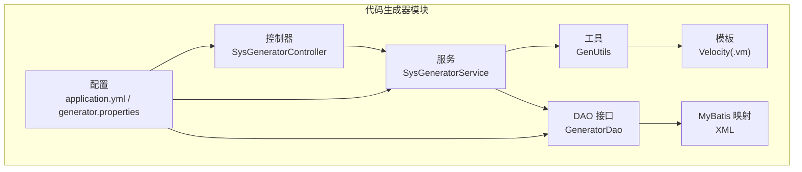
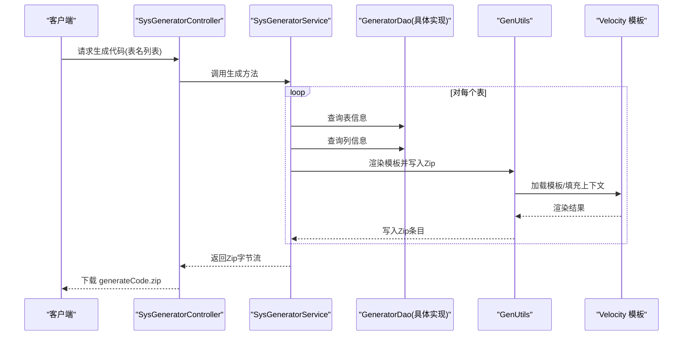
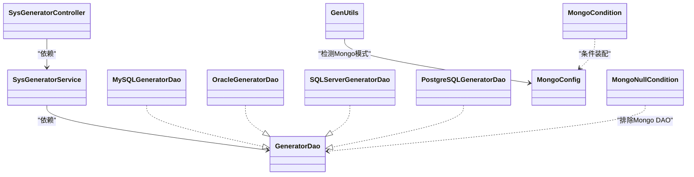

# 代码生成器

<cite>
**本文引用的文件**
- [MonkeyCodeGeneratorApplication.java](file://monkey-code-generator/src/main/java/com/monkey/MonkeyCodeGeneratorApplication.java)
- [SysGeneratorController.java](file://monkey-code-generator/src/main/java/com/monkey/controller/SysGeneratorController.java)
- [SysGeneratorService.java](file://monkey-code-generator/src/main/java/com/monkey/service/SysGeneratorService.java)
- [DbConfig.java](file://monkey-code-generator/src/main/java/com/monkey/config/DbConfig.java)
- [MongoConfig.java](file://monkey-code-generator/src/main/java/com/monkey/config/MongoConfig.java)
- [MongoCondition.java](file://monkey-code-generator/src/main/java/com/monkey/config/MongoCondition.java)
- [MongoNullCondition.java](file://monkey-code-generator/src/main/java/com/monkey/config/MongoNullCondition.java)
- [GeneratorDao.java](file://monkey-code-generator/src/main/java/com/monkey/dao/GeneratorDao.java)
- [MySQLGeneratorDao.java](file://monkey-code-generator/src/main/java/com/monkey/dao/MySQLGeneratorDao.java)
- [OracleGeneratorDao.java](file://monkey-code-generator/src/main/java/com/monkey/dao/OracleGeneratorDao.java)
- [SQLServerGeneratorDao.java](file://monkey-code-generator/src/main/java/com/monkey/dao/SQLServerGeneratorDao.java)
- [PostgreSQLGeneratorDao.java](file://monkey-code-generator/src/main/java/com/monkey/dao/PostgreSQLGeneratorDao.java)
- [SysGeneratorDao.java](file://monkey-code-generator/src/main/java/com/monkey/dao/SysGeneratorDao.java)
- [GenUtils.java](file://monkey-code-generator/src/main/java/com/monkey/utils/GenUtils.java)
- [application.yml](file://monkey-code-generator/src/main/resources/application.yml)
- [generator.properties](file://monkey-code-generator/src/main/resources/generator.properties)
- [Entity.java.vm](file://monkey-code-generator/src/main/resources/template/Entity.java.vm)
</cite>

## 目录
1. [简介](#简介)
2. [项目结构](#项目结构)
3. [核心组件](#核心组件)
4. [架构总览](#架构总览)
5. [详细组件分析](#详细组件分析)
6. [依赖分析](#依赖分析)
7. [性能考虑](#性能考虑)
8. [故障排查指南](#故障排查指南)
9. [结论](#结论)
10. [附录](#附录)

## 简介
本指南面向安威 fireworks 物联网监控平台的“代码生成器”模块，系统性讲解其工作原理与架构设计，涵盖模板引擎（Velocity）、数据库适配器、代码生成流程、配置与使用、模板定制与扩展、支持的数据库类型、最佳实践以及扩展开发建议。读者可据此完成从数据库表到后端 Java 代码与前端 Vue 页面的自动化生成，并按需扩展新模板与新数据库支持。

## 项目结构
代码生成器位于 monkey-code-generator 模块中，采用分层组织：控制器、服务、DAO 接口、配置、工具与模板。核心入口为 Spring Boot 应用与控制器，通过服务层调用 DAO 层获取表结构元数据，再由工具类基于 Velocity 模板渲染生成目标代码并打包下载。

图表来源
- [SysGeneratorController.java:1-55](file://monkey-code-generator/src/main/java/com/monkey/controller/SysGeneratorController.java#L1-L55)
- [SysGeneratorService.java:1-71](file://monkey-code-generator/src/main/java/com/monkey/service/SysGeneratorService.java#L1-L71)
- [GenUtils.java:1-375](file://monkey-code-generator/src/main/java/com/monkey/utils/GenUtils.java#L1-L375)
- [application.yml:1-58](file://monkey-code-generator/src/main/resources/application.yml#L1-L58)
- [generator.properties:1-65](file://monkey-code-generator/src/main/resources/generator.properties#L1-L65)

章节来源
- [application.yml:1-58](file://monkey-code-generator/src/main/resources/application.yml#L1-L58)
- [generator.properties:1-65](file://monkey-code-generator/src/main/resources/generator.properties#L1-L65)

## 核心组件
- 控制器层：提供 HTTP 接口，负责接收请求、分页查询与打包下载生成的代码压缩包。
- 服务层：协调分页、表与列元数据查询、模板选择与渲染、压缩输出。
- DAO 层：抽象数据库访问接口，具体实现按数据库类型注入。
- 配置层：根据 generator.database 动态装配不同数据库 DAO；支持 MongoDB 条件装配。
- 工具层：封装 Velocity 模板加载、上下文构建、文件名计算、Zip 输出等。
- 模板层：Velocity 模板集合，覆盖实体、Mapper XML、Service/Impl、Controller、Vue 页面与菜单 SQL。

章节来源
- [SysGeneratorController.java:1-55](file://monkey-code-generator/src/main/java/com/monkey/controller/SysGeneratorController.java#L1-L55)
- [SysGeneratorService.java:1-71](file://monkey-code-generator/src/main/java/com/monkey/service/SysGeneratorService.java#L1-L71)
- [DbConfig.java:1-61](file://monkey-code-generator/src/main/java/com/monkey/config/DbConfig.java#L1-L61)
- [GenUtils.java:1-375](file://monkey-code-generator/src/main/java/com/monkey/utils/GenUtils.java#L1-L375)

## 架构总览
整体采用“控制器-服务-DAO-模板”的分层架构，结合 Spring 条件装配在运行时选择合适的数据库适配器。生成流程以表为单位，先查询表与列元数据，再按模板集渲染输出，最后打包下载。

图表来源
- [SysGeneratorController.java:43-53](file://monkey-code-generator/src/main/java/com/monkey/controller/SysGeneratorController.java#L43-L53)
- [SysGeneratorService.java:51-69](file://monkey-code-generator/src/main/java/com/monkey/service/SysGeneratorService.java#L51-L69)
- [GenUtils.java:70-185](file://monkey-code-generator/src/main/java/com/monkey/utils/GenUtils.java#L70-L185)

## 详细组件分析

### 控制器：SysGeneratorController
- 提供分页查询接口与代码生成接口。
- 生成接口将表名数组传入服务层，返回 ZIP 流并设置下载响应头。

章节来源
- [SysGeneratorController.java:1-55](file://monkey-code-generator/src/main/java/com/monkey/controller/SysGeneratorController.java#L1-L55)

### 服务：SysGeneratorService
- 分页查询：集成 PageHelper，支持 MongoDB 总数统计适配。
- 元数据查询：委托 GeneratorDao 获取表与列信息。
- 代码生成：遍历表，调用 GenUtils 渲染模板并写入 Zip；若启用 MongoDB，则额外生成子实体模板。

章节来源
- [SysGeneratorService.java:1-71](file://monkey-code-generator/src/main/java/com/monkey/service/SysGeneratorService.java#L1-L71)

### DAO 接口与实现
- 抽象接口：GeneratorDao 定义统一的查询契约。
- 具体实现：MySQL、Oracle、SQLServer、PostgreSQL 的 DAO 接口（Mapper 注解）。
- 通用接口：SysGeneratorDao 定义了查询列表、总数、表与列查询的方法签名。

章节来源
- [GeneratorDao.java:1-19](file://monkey-code-generator/src/main/java/com/monkey/dao/GeneratorDao.java#L1-L19)
- [MySQLGeneratorDao.java:1-17](file://monkey-code-generator/src/main/java/com/monkey/dao/MySQLGeneratorDao.java#L1-L17)
- [OracleGeneratorDao.java:1-15](file://monkey-code-generator/src/main/java/com/monkey/dao/OracleGeneratorDao.java#L1-L15)
- [SQLServerGeneratorDao.java](file://monkey-code-generator/src/main/java/com/monkey/dao/SQLServerGeneratorDao.java)
- [PostgreSQLGeneratorDao.java](file://monkey-code-generator/src/main/java/com/monkey/dao/PostgreSQLGeneratorDao.java)
- [SysGeneratorDao.java:1-23](file://monkey-code-generator/src/main/java/com/monkey/dao/SysGeneratorDao.java#L1-L23)

### 配置与条件装配
- 数据库选择：通过 generator.database 选择 mysql/oracle/sqlserver/postgresql 或 mongodb。
- 条件装配：MongoNullCondition 与 MongoCondition 控制非 MongoDB 与 MongoDB 的 DAO 注入。
- MongoDB 配置：MongoConfig 读取 mongodb.* 前缀属性，按需启用认证。

章节来源
- [DbConfig.java:1-61](file://monkey-code-generator/src/main/java/com/monkey/config/DbConfig.java#L1-L61)
- [MongoConfig.java:1-90](file://monkey-code-generator/src/main/java/com/monkey/config/MongoConfig.java#L1-L90)
- [MongoCondition.java:1-18](file://monkey-code-generator/src/main/java/com/monkey/config/MongoCondition.java#L1-L18)
- [MongoNullCondition.java:1-18](file://monkey-code-generator/src/main/java/com/monkey/config/MongoNullCondition.java#L1-L18)

### 工具：GenUtils
- 模板管理：内置模板清单，MongoDB 模式下动态剔除 SQL/实体模板并替换为 Mongo 实体模板。
- 上下文构建：封装包名、模块名、作者、时间、表与列信息等。
- 文件名计算：依据模板类型与包路径规则生成最终文件路径。
- 渲染与输出：使用 Velocity 渲染模板，写入 ZipOutputStream。

章节来源
- [GenUtils.java:1-375](file://monkey-code-generator/src/main/java/com/monkey/utils/GenUtils.java#L1-L375)

### 模板：Velocity 模板
- 实体类模板：生成带注解的实体类，自动处理主键、创建/更新时间字段。
- Mapper XML：生成基础 CRUD 映射。
- Service/Impl：生成接口与实现类骨架。
- Controller：生成基础增删改查控制器。
- Vue 页面：生成列表与新增/编辑页面。
- 菜单 SQL：生成初始化菜单权限 SQL。

章节来源
- [Entity.java.vm:1-47](file://monkey-code-generator/src/main/resources/template/Entity.java.vm#L1-L47)

## 依赖分析
- 组件耦合：控制器仅依赖服务；服务依赖 DAO 与工具；DAO 通过 MyBatis XML 执行 SQL；工具依赖 Velocity 模板与配置。
- 条件依赖：根据 generator.database 在运行时注入不同 DAO；MongoDB 模式下切换模板集。
- 外部依赖：MyBatis、PageHelper、Velocity、commons-configuration、commons-io、commons-lang 等。

图表来源
- [SysGeneratorController.java:1-55](file://monkey-code-generator/src/main/java/com/monkey/controller/SysGeneratorController.java#L1-L55)
- [SysGeneratorService.java:1-71](file://monkey-code-generator/src/main/java/com/monkey/service/SysGeneratorService.java#L1-L71)
- [GeneratorDao.java:1-19](file://monkey-code-generator/src/main/java/com/monkey/dao/GeneratorDao.java#L1-L19)
- [MySQLGeneratorDao.java:1-17](file://monkey-code-generator/src/main/java/com/monkey/dao/MySQLGeneratorDao.java#L1-L17)
- [OracleGeneratorDao.java:1-15](file://monkey-code-generator/src/main/java/com/monkey/dao/OracleGeneratorDao.java#L1-L15)
- [SQLServerGeneratorDao.java](file://monkey-code-generator/src/main/java/com/monkey/dao/SQLServerGeneratorDao.java)
- [PostgreSQLGeneratorDao.java](file://monkey-code-generator/src/main/java/com/monkey/dao/PostgreSQLGeneratorDao.java)
- [GenUtils.java:1-375](file://monkey-code-generator/src/main/java/com/monkey/utils/GenUtils.java#L1-L375)
- [MongoConfig.java:1-90](file://monkey-code-generator/src/main/java/com/monkey/config/MongoConfig.java#L1-L90)
- [MongoCondition.java:1-18](file://monkey-code-generator/src/main/java/com/monkey/config/MongoCondition.java#L1-L18)
- [MongoNullCondition.java:1-18](file://monkey-code-generator/src/main/java/com/monkey/config/MongoNullCondition.java#L1-L18)

## 性能考虑
- 分页查询：服务层已集成分页，建议在大数据量场景下合理设置页大小，避免一次性加载过多表。
- 模板渲染：模板数量较多且体积较大时，建议在生成前预热模板或减少不必要的模板参与。
- I/O 输出：Zip 写入使用内存流，表数量与模板数量增加会提升内存占用，建议控制单次生成表的数量。
- 数据库连接：DAO 层通过 MyBatis 访问数据库，注意连接池配置与 SQL 执行效率。

## 故障排查指南
- 无法生成代码
  - 检查 generator.database 是否正确配置，确保对应数据库 DAO 已被注入。
  - 确认数据库连接信息与驱动可用。
- 模板渲染异常
  - 检查模板文件是否存在且编码为 UTF-8。
  - 查看异常栈中的表名，定位具体模板渲染失败位置。
- MongoDB 模式未生效
  - 确认 generator.database 设置为 mongodb。
  - 检查 mongodb.* 配置项是否完整，认证开关与凭据是否正确。
- 下载文件为空
  - 确认请求参数包含正确的表名列表。
  - 检查服务端日志是否有异常抛出。

章节来源
- [DbConfig.java:34-46](file://monkey-code-generator/src/main/java/com/monkey/config/DbConfig.java#L34-L46)
- [MongoConfig.java:32-51](file://monkey-code-generator/src/main/java/com/monkey/config/MongoConfig.java#L32-L51)
- [GenUtils.java:170-184](file://monkey-code-generator/src/main/java/com/monkey/utils/GenUtils.java#L170-L184)

## 结论
该代码生成器以清晰的分层架构与条件装配机制实现了多数据库支持与模板化输出，结合 Velocity 模板与 Zip 打包，能够高效地从数据库表生成后端与前端代码骨架。通过合理配置与模板扩展，可快速适配业务需求并提升开发效率。

## 附录

### 使用指南：从数据库表到代码的自动生成
- 步骤一：配置数据库
  - 在 application.yml 中配置 generator.database 为 mysql/oracle/sqlserver/postgresql 或 mongodb。
  - 若为 MongoDB，补充 mongodb.* 配置项。
- 步骤二：配置生成参数
  - 在 generator.properties 中设置主包名、模块名、作者、表前缀、类型映射等。
- 步骤三：选择模板与生成
  - 通过控制器接口传入表名数组，触发服务层生成并下载 ZIP 包。
- 步骤四：导入工程
  - 将生成的代码导入 IDE 工程，按需调整业务逻辑与注释。

章节来源
- [application.yml:54-58](file://monkey-code-generator/src/main/resources/application.yml#L54-L58)
- [generator.properties:1-65](file://monkey-code-generator/src/main/resources/generator.properties#L1-L65)
- [SysGeneratorController.java:43-53](file://monkey-code-generator/src/main/java/com/monkey/controller/SysGeneratorController.java#L43-L53)
- [SysGeneratorService.java:51-69](file://monkey-code-generator/src/main/java/com/monkey/service/SysGeneratorService.java#L51-L69)

### 支持的数据库与适配器实现
- MySQL：使用 MySQLGeneratorDao 接口与对应 XML 映射。
- Oracle：使用 OracleGeneratorDao 接口与对应 XML 映射。
- SQLServer：使用 SQLServerGeneratorDao 接口与对应 XML 映射。
- PostgreSQL：使用 PostgreSQLGeneratorDao 接口与对应 XML 映射。
- MongoDB：通过条件装配启用，模板集自动切换为 Mongo 实体与子实体模板。

章节来源
- [DbConfig.java:34-54](file://monkey-code-generator/src/main/java/com/monkey/config/DbConfig.java#L34-L54)
- [MySQLGeneratorDao.java:1-17](file://monkey-code-generator/src/main/java/com/monkey/dao/MySQLGeneratorDao.java#L1-L17)
- [OracleGeneratorDao.java:1-15](file://monkey-code-generator/src/main/java/com/monkey/dao/OracleGeneratorDao.java#L1-L15)
- [SQLServerGeneratorDao.java](file://monkey-code-generator/src/main/java/com/monkey/dao/SQLServerGeneratorDao.java)
- [PostgreSQLGeneratorDao.java](file://monkey-code-generator/src/main/java/com/monkey/dao/PostgreSQLGeneratorDao.java)
- [MongoCondition.java:1-18](file://monkey-code-generator/src/main/java/com/monkey/config/MongoCondition.java#L1-L18)

### 模板定制与扩展方法
- 修改现有模板
  - 在 template 目录中修改对应 .vm 文件，如 Entity.java.vm、Controller.java.vm、index.vue.vm 等。
- 创建新模板
  - 新增 .vm 文件至 template 目录，并在 GenUtils.getTemplates 中注册模板路径。
- 添加自定义模板变量
  - 在 GenUtils.generatorCode 与 generatorChildrenBeanCode 构建 VelocityContext 时加入新变量，模板中即可使用。

章节来源
- [GenUtils.java:37-59](file://monkey-code-generator/src/main/java/com/monkey/utils/GenUtils.java#L37-L59)
- [GenUtils.java:167-185](file://monkey-code-generator/src/main/java/com/monkey/utils/GenUtils.java#L167-L185)
- [GenUtils.java:267-283](file://monkey-code-generator/src/main/java/com/monkey/utils/GenUtils.java#L267-L283)
- [Entity.java.vm:1-47](file://monkey-code-generator/src/main/resources/template/Entity.java.vm#L1-L47)

### 最佳实践
- 命名规范
  - 表前缀与模块名在 generator.properties 中集中配置，保持一致性。
  - 字段转 Java 属性遵循驼峰命名，模板已内置转换逻辑。
- 代码风格
  - 使用 Lombok 简化实体类，模板已引入相关注解。
  - 主键、创建/更新时间字段自动识别并标注注解。
- 注释生成
  - 模板保留数据库列注释，便于生成文档级注释。
- 模板维护
  - 保持模板版本与生成参数分离，便于升级与回滚。

章节来源
- [generator.properties:1-65](file://monkey-code-generator/src/main/resources/generator.properties#L1-L65)
- [GenUtils.java:288-305](file://monkey-code-generator/src/main/java/com/monkey/utils/GenUtils.java#L288-L305)
- [Entity.java.vm:17-46](file://monkey-code-generator/src/main/resources/template/Entity.java.vm#L17-L46)

### 扩展开发指南
- 新增数据库支持
  - 新建对应数据库的 DAO 接口与 XML 映射。
  - 在 DbConfig 中新增条件装配与分支逻辑，使 generator.database 可选新数据库。
- 新增模板类型
  - 在 template 目录新增 .vm 文件，并在 GenUtils.getTemplates 中注册。
  - 在服务层或工具层扩展生成逻辑，按需写入 Zip。
- 新增代码生成策略
  - 在 GenUtils 中扩展模板选择逻辑与上下文构建，支持按表或列特征选择模板集。

章节来源
- [DbConfig.java:34-46](file://monkey-code-generator/src/main/java/com/monkey/config/DbConfig.java#L34-L46)
- [GenUtils.java:37-59](file://monkey-code-generator/src/main/java/com/monkey/utils/GenUtils.java#L37-L59)