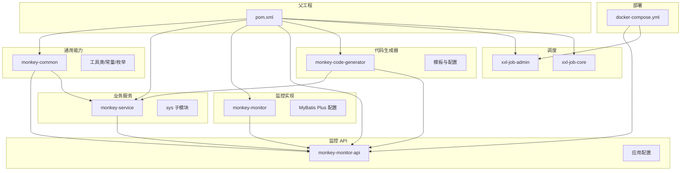
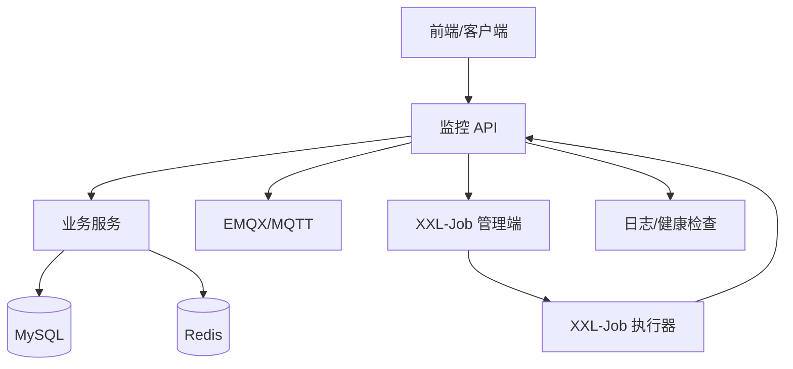
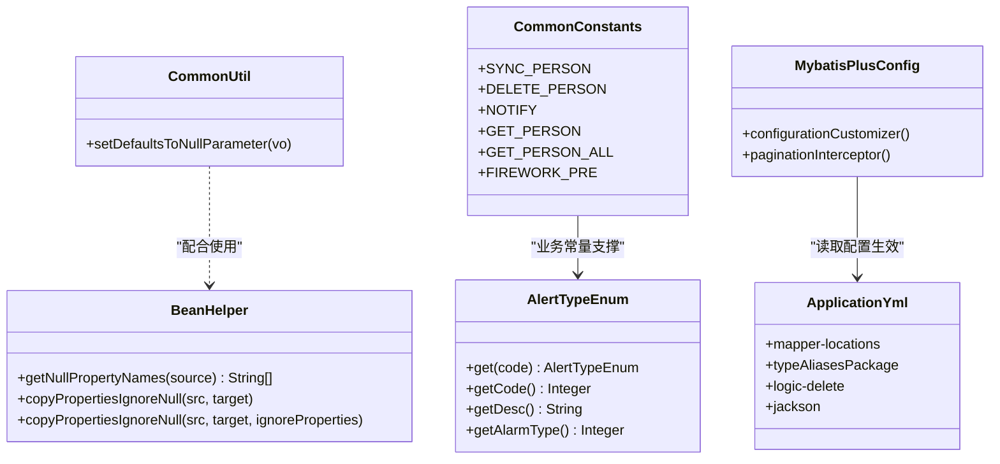
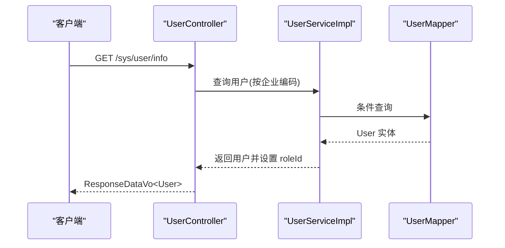
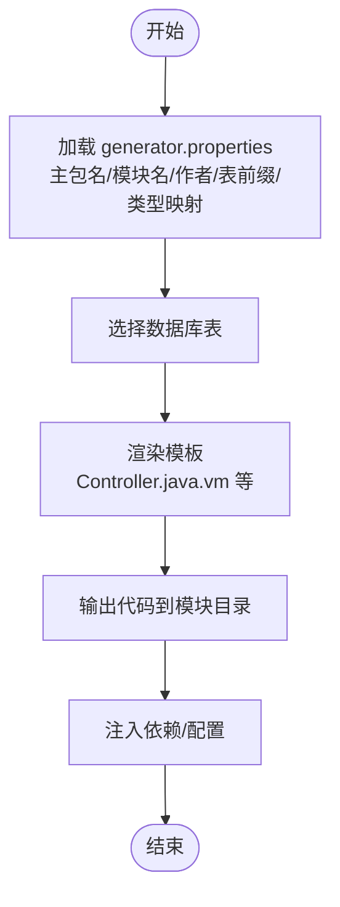
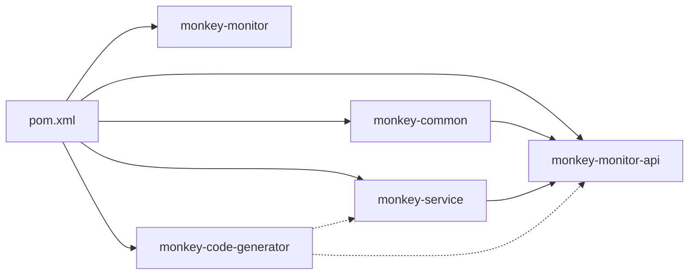

# 开发指南

<cite>
**本文引用的文件**
- [pom.xml](file://pom.xml)
- [docker-compose.yml](file://deploy/docker-compose.yml)
- [generator.properties](file://monkey-code-generator/src/main/resources/generator.properties)
- [Controller.java.vm](file://monkey-code-generator/src/main/resources/template/Controller.java.vm)
- [CommonUtil.java](file://monkey-common/src/main/java/com/monkey/general/common/utils/CommonUtil.java)
- [BeanHelper.java](file://monkey-common/src/main/java/com/monkey/general/common/utils/BeanHelper.java)
- [CommonConstants.java](file://monkey-common/src/main/java/com/monkey/general/common/constant/CommonConstants.java)
- [AlertTypeEnum.java](file://monkey-common/src/main/java/com/monkey/general/common/enums/AlertTypeEnum.java)
- [MybatisPlusConfig.java](file://monkey-monitor/src/main/java/com/monkey/general/config/MybatisPlusConfig.java)
- [application.yml](file://monkey-monitor-api/src/main/resources/application.yml)
- [UserController.java](file://monkey-monitor-api/src/main/java/com/monkey/general/controller/UserController.java)
- [UserServiceImpl.java](file://monkey-service/src/main/java/com/monkey/general/modules/sys/service/impl/UserServiceImpl.java)
</cite>

## 目录
1. [简介](#简介)
2. [项目结构](#项目结构)
3. [核心组件](#核心组件)
4. [架构总览](#架构总览)
5. [详细组件分析](#详细组件分析)
6. [依赖分析](#依赖分析)
7. [性能考虑](#性能考虑)
8. [故障排查指南](#故障排查指南)
9. [结论](#结论)
10. [附录](#附录)

## 简介
本开发指南面向安威 fireworks 物联网监控平台的新老开发者，旨在帮助团队统一开发规范、最佳实践与协作流程。内容覆盖代码风格与命名约定、注释规范、模块开发流程、代码生成器使用、通用工具类与配置管理、测试策略（单元/集成/性能）、Git 工作流与代码审查、依赖与版本控制策略、调试技巧与开发工具推荐，以及新功能从设计到上线的完整流程与注意事项。

## 项目结构
项目采用 Maven 多模块聚合结构，核心模块包括：
- 父工程：统一版本与依赖管理
- 通用模块：公共常量、枚举、工具类、校验器、异常处理等
- 业务服务模块：系统、设备、视频、算法告警等业务子模块
- 监控 API 模块：对外接口层，Swagger 文档、跨域、定时任务等配置
- 监控实现模块：MyBatis Plus 配置、MQTT、第三方对接等
- 代码生成器模块：基于模板的数据库到代码生成
- XXL-Job 管理端与执行器：分布式调度
- 部署：容器编排与初始化脚本

图表来源
- [pom.xml:11-16](file://pom.xml#L11-L16)
- [docker-compose.yml:3-103](file://deploy/docker-compose.yml#L3-L103)

章节来源
- [pom.xml:11-16](file://pom.xml#L11-L16)
- [pom.xml:65-101](file://pom.xml#L65-L101)
- [docker-compose.yml:3-103](file://deploy/docker-compose.yml#L3-L103)

## 核心组件
- 通用工具与常量
  - 对象默认值填充：用于 DTO/VO 参数空值兜底
  - Bean 属性复制（忽略 null）：避免覆盖已有非空值
  - 通用常量：如指令名、前缀等
  - 枚举：如告警示例类型
- 数据访问配置
  - MyBatis Plus 分页与类型处理器注册
- 应用配置
  - Swagger、Jackson 时间格式、MyBatis Plus Mapper 位置、逻辑删除配置
- 用户控制器与服务
  - 用户信息查询、角色权限、密码更新、批量删除与角色绑定
- 代码生成器
  - 主包名、模块名、作者、表前缀、类型映射、模板

章节来源
- [CommonUtil.java:14-33](file://monkey-common/src/main/java/com/monkey/general/common/utils/CommonUtil.java#L14-L33)
- [BeanHelper.java:20-64](file://monkey-common/src/main/java/com/monkey/general/common/utils/BeanHelper.java#L20-L64)
- [CommonConstants.java:10-19](file://monkey-common/src/main/java/com/monkey/general/common/constant/CommonConstants.java#L10-L19)
- [AlertTypeEnum.java:27-51](file://monkey-common/src/main/java/com/monkey/general/common/enums/AlertTypeEnum.java#L27-L51)
- [MybatisPlusConfig.java:10-21](file://monkey-monitor/src/main/java/com/monkey/general/config/MybatisPlusConfig.java#L10-L21)
- [application.yml:14-40](file://monkey-monitor-api/src/main/resources/application.yml#L14-L40)
- [UserController.java:35-49](file://monkey-monitor-api/src/main/java/com/monkey/general/controller/UserController.java#L35-L49)
- [UserServiceImpl.java:40-103](file://monkey-service/src/main/java/com/monkey/general/modules/sys/service/impl/UserServiceImpl.java#L40-L103)
- [generator.properties:3-65](file://monkey-code-generator/src/main/resources/generator.properties#L3-L65)
- [Controller.java.vm:34-117](file://monkey-code-generator/src/main/resources/template/Controller.java.vm#L34-L117)

## 架构总览
平台采用“通用能力 + 业务服务 + 接口层 + 监控实现 + 调度 + 部署”的分层架构。通用模块为各模块提供统一的工具、常量与校验；业务服务模块承载具体领域模型与服务；监控 API 提供对外接口与配置；监控实现模块负责数据访问与第三方对接；XXL-Job 提供分布式调度；Docker Compose 编排基础环境与应用服务。

图表来源
- [docker-compose.yml:6-103](file://deploy/docker-compose.yml#L6-L103)
- [application.yml:1-40](file://monkey-monitor-api/src/main/resources/application.yml#L1-L40)

## 详细组件分析

### 通用工具类与配置
- 对象默认值填充
  - 功能：遍历对象字段，对空值按类型设置默认值（字符串、整型、大数）
  - 使用场景：DTO/VO 初始化、接口入参兼容
- Bean 属性复制（忽略 null）
  - 功能：基于 BeanWrapper 获取 null 字段，复制时忽略这些字段
  - 使用场景：部分字段更新、避免覆盖非空值
- 通用常量
  - 功能：集中管理指令名与接口前缀
  - 使用场景：设备指令同步、接口路由前缀
- 枚举
  - 功能：告警示例类型定义与按 code 查询
  - 使用场景：告警分类、展示文案与类型映射
- MyBatis Plus 配置
  - 功能：注册整型数组类型处理器、启用分页插件
  - 使用场景：复杂字段类型映射、分页查询
- 应用配置
  - 功能：MyBatis Plus Mapper 位置、实体扫描、逻辑删除、JACKSON 时间格式
  - 使用场景：ORM 映射、统一时间格式、逻辑删除

图表来源
- [CommonUtil.java:6-34](file://monkey-common/src/main/java/com/monkey/general/common/utils/CommonUtil.java#L6-L34)
- [BeanHelper.java:12-65](file://monkey-common/src/main/java/com/monkey/general/common/utils/BeanHelper.java#L12-L65)
- [CommonConstants.java:8-21](file://monkey-common/src/main/java/com/monkey/general/common/constant/CommonConstants.java#L8-L21)
- [AlertTypeEnum.java:8-52](file://monkey-common/src/main/java/com/monkey/general/common/enums/AlertTypeEnum.java#L8-L52)
- [MybatisPlusConfig.java:9-21](file://monkey-monitor/src/main/java/com/monkey/general/config/MybatisPlusConfig.java#L9-L21)
- [application.yml:14-40](file://monkey-monitor-api/src/main/resources/application.yml#L14-L40)

章节来源
- [CommonUtil.java:14-33](file://monkey-common/src/main/java/com/monkey/general/common/utils/CommonUtil.java#L14-L33)
- [BeanHelper.java:20-64](file://monkey-common/src/main/java/com/monkey/general/common/utils/BeanHelper.java#L20-L64)
- [CommonConstants.java:10-19](file://monkey-common/src/main/java/com/monkey/general/common/constant/CommonConstants.java#L10-L19)
- [AlertTypeEnum.java:27-51](file://monkey-common/src/main/java/com/monkey/general/common/enums/AlertTypeEnum.java#L27-L51)
- [MybatisPlusConfig.java:10-21](file://monkey-monitor/src/main/java/com/monkey/general/config/MybatisPlusConfig.java#L10-L21)
- [application.yml:14-40](file://monkey-monitor-api/src/main/resources/application.yml#L14-L40)

### 用户模块（控制器与服务）
- 控制器
  - 功能：根据企业编码查询用户信息，返回角色 ID 并清除敏感字段
  - 关键点：使用查询包装器、判空处理、统一响应体
- 服务
  - 功能：分页查询、权限与菜单查询、保存/更新用户、删除及关联清理、密码更新、角色 ID 获取、销售员列表、真实姓名拼接
  - 关键点：事务控制、角色越权检查、角色与用户关系维护

图表来源
- [UserController.java:25-49](file://monkey-monitor-api/src/main/java/com/monkey/general/controller/UserController.java#L25-L49)
- [UserServiceImpl.java:40-103](file://monkey-service/src/main/java/com/monkey/general/modules/sys/service/impl/UserServiceImpl.java#L40-L103)

章节来源
- [UserController.java:35-49](file://monkey-monitor-api/src/main/java/com/monkey/general/controller/UserController.java#L35-L49)
- [UserServiceImpl.java:40-103](file://monkey-service/src/main/java/com/monkey/general/modules/sys/service/impl/UserServiceImpl.java#L40-L103)

### 代码生成器（数据库到代码）
- 配置
  - 主包名、模块名、作者、表前缀、类型映射（MySQL/Oracle/PG/SQLServer/通用）
- 模板
  - 控制器模板：统一 CRUD 注解、鉴权注解、分页查询、校验、统一响应
- 流程
  - 选择数据库表 → 填写模块与作者 → 生成实体/DAO/Service/Controller/Vue 页面 → 自动注入依赖

图表来源
- [generator.properties:3-65](file://monkey-code-generator/src/main/resources/generator.properties#L3-L65)
- [Controller.java.vm:34-117](file://monkey-code-generator/src/main/resources/template/Controller.java.vm#L34-L117)

章节来源
- [generator.properties:3-65](file://monkey-code-generator/src/main/resources/generator.properties#L3-L65)
- [Controller.java.vm:34-117](file://monkey-code-generator/src/main/resources/template/Controller.java.vm#L34-L117)

## 依赖分析
- 版本与依赖管理
  - 父工程统一管理 Spring Boot、Spring Cloud、MyBatis Plus、MQTT、Netty、Gson、Groovy、ShardingSphere 等版本
  - 通过 dependencyManagement 锁定版本，保证模块间一致性
- 模块间耦合
  - 通用模块被业务服务与 API 层广泛依赖
  - 业务服务依赖通用模块与数据库
  - 监控 API 依赖通用模块与业务服务
  - 代码生成器独立，可作为工具模块复用模板

图表来源
- [pom.xml:65-101](file://pom.xml#L65-L101)
- [pom.xml:11-16](file://pom.xml#L11-L16)

章节来源
- [pom.xml:65-101](file://pom.xml#L65-L101)
- [pom.xml:11-16](file://pom.xml#L11-L16)

## 性能考虑
- ORM 与分页
  - 启用 MyBatis Plus 分页插件，避免一次性加载大量数据
  - 合理使用条件查询与索引，避免 N+1 查询
- 类型映射
  - 注册复杂类型处理器（如整型数组），减少序列化/反序列化开销
- 日志与监控
  - 生产关闭 SQL 控制台输出，避免 IO 放大
  - 结合 XXL-Job 进行定时任务与批处理，降低峰值压力
- 缓存
  - Redis 用于热点数据缓存与会话存储，注意过期策略与并发安全

## 故障排查指南
- 用户信息查询失败
  - 确认企业编码配置正确，查询结果为空时返回明确错误码
- 角色越权
  - 新增/更新用户时需检查角色是否由当前创建者创建，避免越权
- 生成代码缺失或异常
  - 检查 generator.properties 中主包名、模块名、表前缀与类型映射
  - 确认模板路径与渲染变量是否匹配
- 部署与连通性
  - 使用 docker-compose 健康检查确认 MySQL、Redis、EMQX 可用
  - 检查端口映射与网络隔离

章节来源
- [UserController.java:38-49](file://monkey-monitor-api/src/main/java/com/monkey/general/controller/UserController.java#L38-L49)
- [UserServiceImpl.java:142-158](file://monkey-service/src/main/java/com/monkey/general/modules/sys/service/impl/UserServiceImpl.java#L142-L158)
- [generator.properties:3-65](file://monkey-code-generator/src/main/resources/generator.properties#L3-L65)
- [docker-compose.yml:17-23](file://deploy/docker-compose.yml#L17-L23)

## 结论
本指南提供了从代码规范、模块开发、代码生成、通用工具、测试策略、Git 工作流到部署与故障排查的完整开发手册。建议新成员先从通用模块与用户模块入手，理解工具类与配置后，再进入业务模块与代码生成器实践，逐步掌握平台整体架构与开发流程。

## 附录

### 开发规范与最佳实践
- 代码风格
  - 包名小写，类名帕斯卡，方法/变量驼峰，常量全大写
  - 控制类方法长度，单个方法不超过 60 行
- 命名约定
  - 控制器：模块名 + 功能名 + Controller
  - 服务：I + 接口名 + Impl
  - 实体：与数据库表一致，去除表前缀
- 注释规范
  - 类与方法使用 Swagger 注解标注接口信息
  - 关键业务逻辑添加中文注释，说明输入输出与边界条件
- 异常处理
  - 使用统一响应体封装成功/失败，错误码与消息清晰
  - 自定义异常用于业务断言与越权检查

### 模块开发指南
- 新增业务模块步骤
  1) 在业务服务模块下创建 entity/mapper/service 子包
  2) 编写实体与 Mapper XML，定义字段与索引
  3) 实现 Service 接口与实现类，使用分页与条件查询
  4) 在监控 API 模块新增 Controller，使用统一响应体与鉴权注解
  5) 使用代码生成器快速生成基础代码，再进行定制
  6) 编写单元测试与集成测试，覆盖关键分支
  7) 更新 docker-compose 与部署配置，进行灰度验证

### 代码生成器使用
- 配置项说明
  - 主包名：生成代码的根包
  - 模块名：业务模块标识
  - 作者/邮箱：生成注释中的作者信息
  - 表前缀：生成类名时去除的表前缀
  - 类型映射：数据库类型到 Java 类型的映射规则
- 模板定制
  - 修改模板以适配新增的前端页面（Vue）或后端特性
  - 保持模板变量与配置项一致，避免渲染失败
- 扩展开发
  - 新增数据库方言支持（MySQL/Oracle/PG/SQLServer/通用）
  - 扩展模板集合（如 VO、DTO、SQL 片段）

章节来源
- [generator.properties:3-65](file://monkey-code-generator/src/main/resources/generator.properties#L3-L65)
- [Controller.java.vm:34-117](file://monkey-code-generator/src/main/resources/template/Controller.java.vm#L34-L117)

### 通用工具类使用与扩展
- 工具类
  - 对象默认值填充：在 DTO 初始化时调用
  - Bean 属性复制：在更新场景中避免覆盖非空字段
- 枚举与常量
  - 枚举用于状态/类型映射，常量用于指令与前缀
- 扩展建议
  - 新增工具方法时，优先考虑复用现有工具类
  - 枚举与常量按领域划分，避免全局污染

章节来源
- [CommonUtil.java:14-33](file://monkey-common/src/main/java/com/monkey/general/common/utils/CommonUtil.java#L14-L33)
- [BeanHelper.java:20-64](file://monkey-common/src/main/java/com/monkey/general/common/utils/BeanHelper.java#L20-L64)
- [CommonConstants.java:10-19](file://monkey-common/src/main/java/com/monkey/general/common/constant/CommonConstants.java#L10-L19)
- [AlertTypeEnum.java:27-51](file://monkey-common/src/main/java/com/monkey/general/common/enums/AlertTypeEnum.java#L27-L51)

### 测试开发指南
- 单元测试
  - 针对 Service 方法编写，Mock Mapper 与外部依赖
  - 覆盖正常路径与异常路径（空值、越权、参数校验）
- 集成测试
  - 启动 API 模块与数据库，验证接口行为与响应
  - 使用测试环境配置，避免影响生产数据
- 性能测试
  - 使用压测工具模拟高并发请求，关注分页与缓存命中率
  - 关注数据库连接池与线程池配置

### Git 工作流与代码审查
- 分支策略
  - develop：日常开发
  - feature/*：功能开发
  - release/*：预发布
  - hotfix/*：紧急修复
- 提交规范
  - 标题：类型(作用域): 描述（不超过 50 字）
  - 正文：变更动机、影响范围、迁移说明
- 代码审查
  - PR 必须有至少一名 reviewer 通过
  - 审查重点：代码风格、异常处理、性能与安全性

### 依赖管理与版本控制
- 版本锁定
  - 通过父工程 dependencyManagement 统一版本
  - 避免直接在子模块声明版本
- 依赖升级
  - 优先在父工程升级，确保所有模块一致性
  - 升级后运行全量测试，验证兼容性

### 调试技巧与开发工具推荐
- 调试
  - 使用断点定位问题，结合日志与链路追踪
  - 分页与条件查询使用 SQL 控制台（开发环境）辅助定位
- 工具
  - Postman/JMeter：接口与性能测试
  - IntelliJ IDEA：代码提示与重构
  - Docker Desktop：本地容器化调试

### 新功能开发完整流程
- 需求评审 → 设计（ER 图/时序图）→ 代码生成与定制 → 单元测试 → 集成测试 → 性能测试 → 代码审查 → 合并 → 部署验证 → 回归测试