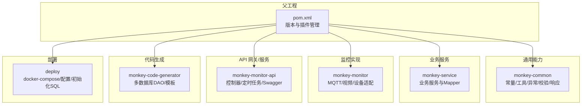
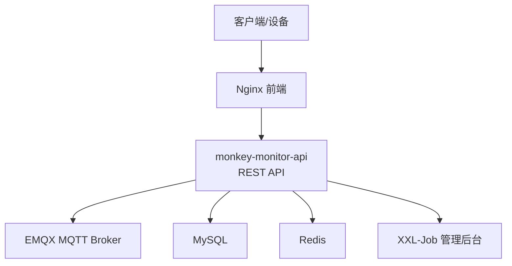
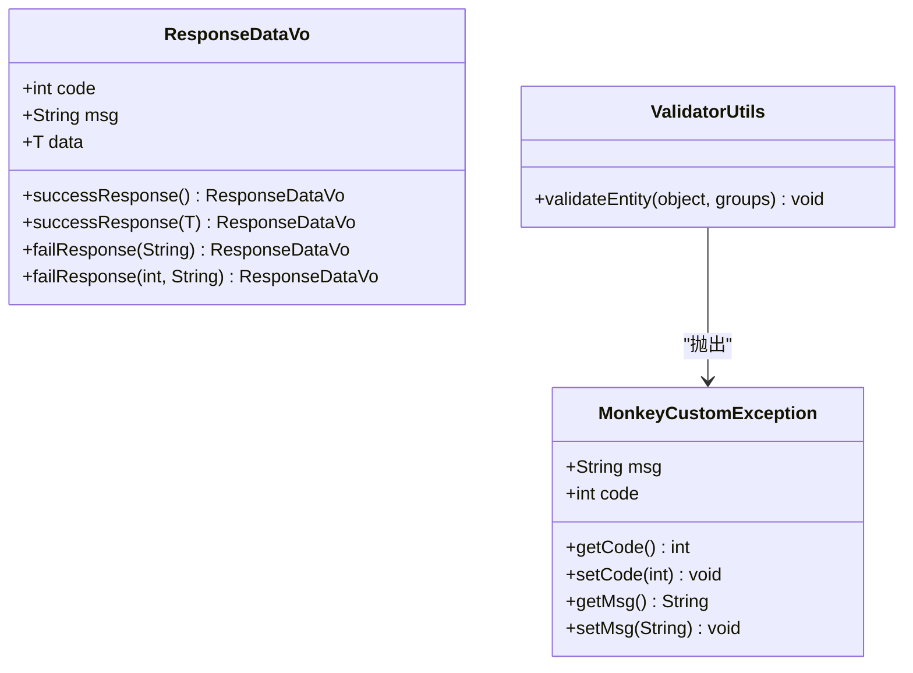
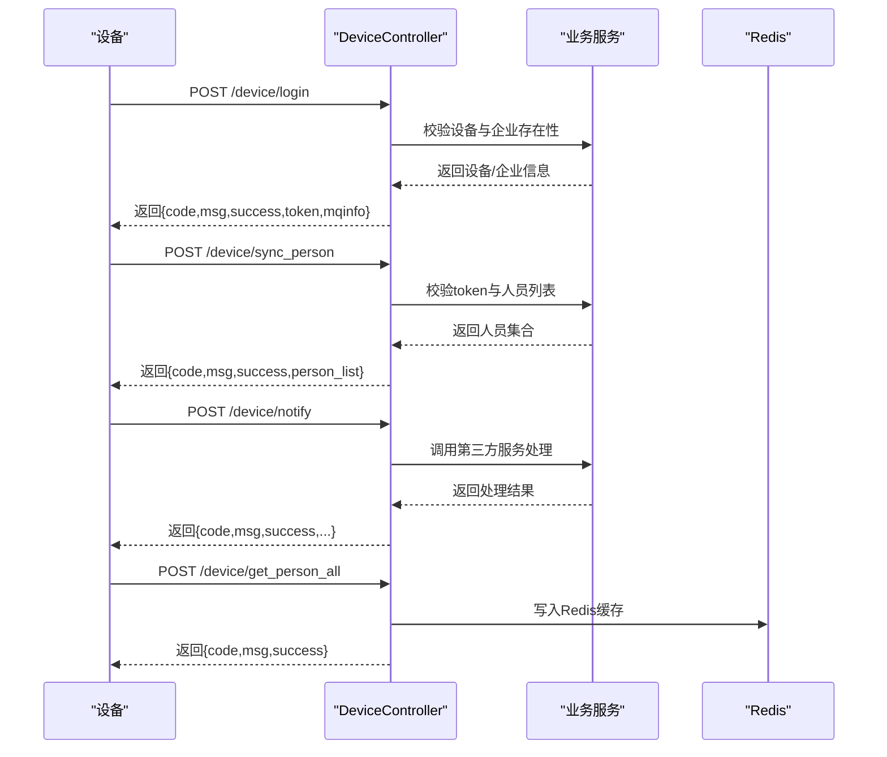
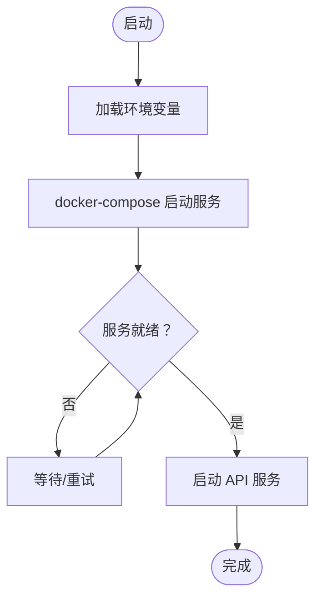
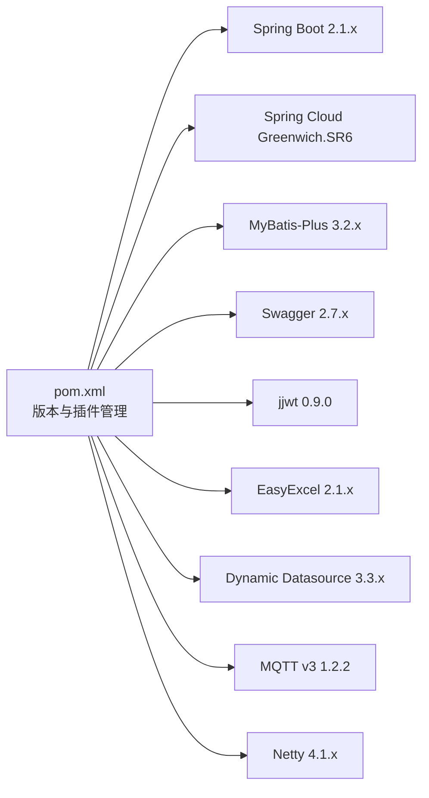

# 开发规范

<cite>
**本文引用的文件**
- [pom.xml](file://pom.xml)
- [application.yml](file://monkey-monitor-api/src/main/resources/application.yml)
- [CommonConstants.java](file://monkey-common/src/main/java/com/monkey/general/common/constant/CommonConstants.java)
- [Constants.java](file://monkey-common/src/main/java/com/monkey/general/common/constant/Constants.java)
- [ResponseDataVo.java](file://monkey-common/src/main/java/com/monkey/general/common/entity/ResponseDataVo.java)
- [MonkeyCustomException.java](file://monkey-common/src/main/java/com/monkey/general/common/exception/MonkeyCustomException.java)
- [ValidatorUtils.java](file://monkey-common/src/main/java/com/monkey/general/common/validator/ValidatorUtils.java)
- [StringUtils.java](file://monkey-common/src/main/java/com/monkey/general/common/utils/StringUtils.java)
- [SpringBooStartApplication.java](file://monkey-monitor-api/src/main/java/com/monkey/general/annotation/SpringBooStartApplication.java)
- [DeviceController.java](file://monkey-monitor-api/src/main/java/com/monkey/general/controller/DeviceController.java)
- [docker-compose.yml](file://deploy/docker-compose.yml)
</cite>

## 目录
1. [简介](#简介)
2. [项目结构](#项目结构)
3. [核心组件](#核心组件)
4. [架构总览](#架构总览)
5. [详细组件分析](#详细组件分析)
6. [依赖分析](#依赖分析)
7. [性能考虑](#性能考虑)
8. [故障排查指南](#故障排查指南)
9. [结论](#结论)
10. [附录](#附录)

## 简介
本规范面向安威 fireworks 物联网监控平台的开发团队，旨在统一代码风格、注释规范、接口设计、Git 工作流、依赖与配置管理以及错误处理与日志实践，确保跨模块协作一致性和整体代码质量。规范内容以仓库现有实现为依据，结合可推广的最佳实践进行提炼。

## 项目结构
项目采用多模块 Maven 结构，包含通用能力模块、业务服务模块、监控 API 模块、代码生成器模块及基础设施编排。核心模块职责如下：
- 父工程：统一版本与插件配置，集中管理依赖版本与 Spring Boot/Cloud 版本矩阵。
- monkey-common：通用常量、工具、异常、校验器与响应模型等基础能力。
- monkey-service：业务服务层与 Mapper/XML，支撑各领域模块的数据访问。
- monkey-monitor：监控侧业务实现与第三方对接（如 MQTT、摄像头等）。
- monkey-monitor-api：对外 API 层，包含控制器、定时任务、Swagger、跨域与 Feign 客户端启用等。
- monkey-code-generator：代码生成器，支持多种数据库与模板。
- 部署（deploy）：Docker 编排与初始化脚本，包含 Nginx、MySQL、Redis、EMQX、XXL-Job 与前端镜像。

图示来源
- [pom.xml:11-17](file://pom.xml#L11-L17)
- [docker-compose.yml:3-103](file://deploy/docker-compose.yml#L3-L103)

章节来源
- [pom.xml:11-17](file://pom.xml#L11-L17)
- [docker-compose.yml:3-103](file://deploy/docker-compose.yml#L3-L103)

## 核心组件
- 统一响应模型：提供成功/失败响应封装，约定 code/msg/data 字段，便于前后端一致交互。
- 统一异常模型：自定义运行时异常，携带消息与业务码，配合校验工具抛出统一异常。
- 常量与命名：提供项目前缀、字符集、HTTP 协议、分页参数名、缓存键前缀等常量，统一命名与配置。
- 控制器与 API：基于 Swagger 注解标注接口，统一请求路径前缀与鉴权/参数校验流程。
- 配置与环境：通过 application.yml 指定端口、MyBatis Plus、Jackson 时间格式等；docker-compose 提供容器化编排与环境变量注入。

章节来源
- [ResponseDataVo.java:11-59](file://monkey-common/src/main/java/com/monkey/general/common/entity/ResponseDataVo.java#L11-L59)
- [MonkeyCustomException.java:8-52](file://monkey-common/src/main/java/com/monkey/general/common/exception/MonkeyCustomException.java#L8-L52)
- [Constants.java:8-175](file://monkey-common/src/main/java/com/monkey/general/common/constant/Constants.java#L8-L175)
- [CommonConstants.java:8-21](file://monkey-common/src/main/java/com/monkey/general/common/constant/CommonConstants.java#L8-L21)
- [application.yml:1-40](file://monkey-monitor-api/src/main/resources/application.yml#L1-L40)
- [SpringBooStartApplication.java:15-26](file://monkey-monitor-api/src/main/java/com/monkey/general/annotation/SpringBooStartApplication.java#L15-L26)

## 架构总览
系统由 API 服务、MQTT 中间件、数据库与对象存储组成，容器化部署于 docker-compose。API 服务负责设备登录、人员同步、通知回调与人员全量拉取等接口，同时集成定时任务与 Swagger 文档。

图示来源
- [docker-compose.yml:3-103](file://deploy/docker-compose.yml#L3-L103)
- [application.yml:1-40](file://monkey-monitor-api/src/main/resources/application.yml#L1-L40)

## 详细组件分析

### 组件一：统一响应与异常模型
- 响应模型：提供静态工厂方法生成成功/失败响应，约定 code=0 表示成功，非 0 表示失败；data 支持泛型承载业务数据。
- 异常模型：自定义运行时异常，支持传入消息、业务码与异常对象，便于上层统一捕获与转换。
- 校验工具：基于 Hibernate Validator 执行 JSR-303 校验，校验失败抛出自定义异常，异常消息拼接所有校验错误。

图示来源
- [ResponseDataVo.java:11-59](file://monkey-common/src/main/java/com/monkey/general/common/entity/ResponseDataVo.java#L11-L59)
- [MonkeyCustomException.java:8-52](file://monkey-common/src/main/java/com/monkey/general/common/exception/MonkeyCustomException.java#L8-L52)
- [ValidatorUtils.java:18-42](file://monkey-common/src/main/java/com/monkey/general/common/validator/ValidatorUtils.java#L18-L42)

章节来源
- [ResponseDataVo.java:11-59](file://monkey-common/src/main/java/com/monkey/general/common/entity/ResponseDataVo.java#L11-L59)
- [MonkeyCustomException.java:8-52](file://monkey-common/src/main/java/com/monkey/general/common/exception/MonkeyCustomException.java#L8-L52)
- [ValidatorUtils.java:18-42](file://monkey-common/src/main/java/com/monkey/general/common/validator/ValidatorUtils.java#L18-L42)

### 组件二：设备接口（RESTful 设计）
- 接口前缀：统一在控制器层使用@RequestMapping声明前缀，如“/device”，便于聚合与路由。
- 方法注释：使用 Swagger 注解@Api标识接口分组，便于自动生成文档。
- 参数规范：请求体使用 Map 接收，便于兼容不同设备协议；对必填字段进行判空与业务校验。
- 返回值格式：统一返回 Map，包含 code、msg、success、data 等字段，与通用响应模型保持一致。
- 认证与鉴权：通过 token 校验企业状态与公司编码一致性，确保设备归属合法。

图示来源
- [DeviceController.java:31-266](file://monkey-monitor-api/src/main/java/com/monkey/general/controller/DeviceController.java#L31-L266)

章节来源
- [DeviceController.java:31-266](file://monkey-monitor-api/src/main/java/com/monkey/general/controller/DeviceController.java#L31-L266)

### 组件三：配置与环境管理
- 环境配置：通过 application.yml 设置端口、MyBatis Plus、Jackson 时间格式、实体扫描包等。
- 容器编排：docker-compose 使用环境变量注入数据库密码、MQTT 访问凭据与服务版本，网络隔离与健康检查保障可用性。
- 配置文件命名：生产环境配置文件遵循 application-{profile}.yml 规范，便于切换环境。

图示来源
- [application.yml:1-40](file://monkey-monitor-api/src/main/resources/application.yml#L1-L40)
- [docker-compose.yml:3-103](file://deploy/docker-compose.yml#L3-L103)

章节来源
- [application.yml:1-40](file://monkey-monitor-api/src/main/resources/application.yml#L1-L40)
- [docker-compose.yml:3-103](file://deploy/docker-compose.yml#L3-L103)

## 依赖分析
- 版本管理：父工程通过 dependencyManagement 集中声明常用依赖版本，避免版本漂移；同时通过 Spring Boot 与 Spring Cloud 版本矩阵约束保证兼容性。
- 插件管理：统一 Java 源目标版本与编码；测试默认跳过，可在 CI 中按需开启。
- 常用依赖：MyBatis-Plus、Swagger、JWT、二维码、Excel、动态数据源、MQTT、Netty、Gson、Groovy、ShardingSphere 等。

图示来源
- [pom.xml:65-192](file://pom.xml#L65-L192)

章节来源
- [pom.xml:23-62](file://pom.xml#L23-L62)
- [pom.xml:65-192](file://pom.xml#L65-L192)

## 性能考虑
- 数据访问：MyBatis-Plus 默认开启下划线到驼峰映射，减少手动映射成本；建议合理使用分页查询与索引优化。
- 缓存策略：Redis 用于临时缓存设备人员信息，降低重复查询压力；注意 key 命名规范与过期策略。
- 并发与异步：通过自定义注解启用异步与定时任务，避免阻塞主线程；定时任务与外部服务调用需设置超时与熔断。
- 日志与可观测性：统一响应与异常模型便于埋点与告警；建议在关键链路增加日志级别与 TraceId。

## 故障排查指南
- 常见问题定位
  - 设备登录失败：检查设备编号是否存在、企业状态是否正常、token 是否匹配。
  - 人员同步失败：核对人员 ID 列表与企业归属，确认 Redis 写入是否成功。
  - MQTT 连接异常：核对 host/public-host、用户名密码、keepalive、QoS 与主题。
- 统一异常处理
  - 使用自定义异常统一承载错误码与消息，便于前端展示与日志采集。
  - 校验失败抛出统一异常，异常消息拼接所有校验项，便于快速定位。
- 配置检查
  - application.yml 中 MyBatis Plus、Jackson、端口等配置是否正确。
  - docker-compose 中环境变量是否注入，容器健康检查是否通过。

章节来源
- [DeviceController.java:59-104](file://monkey-monitor-api/src/main/java/com/monkey/general/controller/DeviceController.java#L59-L104)
- [DeviceController.java:107-161](file://monkey-monitor-api/src/main/java/com/monkey/general/controller/DeviceController.java#L107-L161)
- [DeviceController.java:169-196](file://monkey-monitor-api/src/main/java/com/monkey/general/controller/DeviceController.java#L169-L196)
- [DeviceController.java:224-266](file://monkey-monitor-api/src/main/java/com/monkey/general/controller/DeviceController.java#L224-L266)
- [MonkeyCustomException.java:8-52](file://monkey-common/src/main/java/com/monkey/general/common/exception/MonkeyCustomException.java#L8-L52)
- [ValidatorUtils.java:31-41](file://monkey-common/src/main/java/com/monkey/general/common/validator/ValidatorUtils.java#L31-L41)
- [application.yml:1-40](file://monkey-monitor-api/src/main/resources/application.yml#L1-L40)
- [docker-compose.yml:3-103](file://deploy/docker-compose.yml#L3-L103)

## 结论
本规范以现有代码库为基础，总结了统一响应/异常模型、RESTful 接口设计、配置与环境管理、依赖版本控制与容器化部署等关键实践。建议团队在后续迭代中持续完善注释与文档、强化单元测试与集成测试覆盖，并在 CI/CD 流程中固化规范检查，以进一步提升交付质量与可维护性。

## 附录

### 附录A：代码风格与命名约定
- 包结构：采用反向域名 + 功能域划分，如 com.monkey.general.modules.{领域}。
- 类命名：采用帕斯卡命名法；控制器以 Controller 结尾；服务以 Service 结尾；实体以 Entity 结尾。
- 常量：全大写下划线命名，位于 constant 包内；提供项目前缀、字符集、HTTP 协议、分页参数等统一常量。
- 方法命名：动词短语，清晰表达意图；布尔方法以 is/has/should 前缀。
- 字段命名：小驼峰，避免缩写；枚举与状态使用语义明确的名称。

章节来源
- [Constants.java:8-175](file://monkey-common/src/main/java/com/monkey/general/common/constant/Constants.java#L8-L175)
- [CommonConstants.java:8-21](file://monkey-common/src/main/java/com/monkey/general/common/constant/CommonConstants.java#L8-L21)

### 附录B：注释规范
- 类注释：说明类职责、作者、创建日期；必要时提供使用示例或注意事项。
- 方法注释：描述方法功能、参数含义、返回值、异常情况；复杂算法补充流程说明。
- 字段注释：说明字段用途、取值范围、默认值与约束条件。
- Swagger 注解：使用@Api 标注接口分组，@ApiOperation 标注方法用途，@ApiImplicitParam/@ApiParam 标注参数。

章节来源
- [ResponseDataVo.java:5-10](file://monkey-common/src/main/java/com/monkey/general/common/entity/ResponseDataVo.java#L5-L10)
- [DeviceController.java:14-34](file://monkey-monitor-api/src/main/java/com/monkey/general/controller/DeviceController.java#L14-L34)

### 附录C：接口设计标准
- RESTful 设计：资源路径使用名词复数形式；GET/POST/PUT/DELETE 语义明确；统一使用 application/json。
- 参数规范：必填参数在接口文档中标注；分页参数统一使用 pageNum/pageSize；排序参数统一使用 orderByColumn/isAsc。
- 返回值格式：统一使用 code/msg/data；成功 code=0，失败 code≠0；data 支持对象与数组。
- 错误码设计：参考统一异常模型，定义业务错误码区间与含义；避免使用魔法数。

章节来源
- [ResponseDataVo.java:11-59](file://monkey-common/src/main/java/com/monkey/general/common/entity/ResponseDataVo.java#L11-L59)
- [Constants.java:47-52](file://monkey-common/src/main/java/com/monkey/general/common/constant/Constants.java#L47-L52)

### 附录D：Git 工作流规范
- 分支管理：master/main 用于发布稳定版本；develop 用于集成；feature/* 用于新功能；hotfix/* 用于紧急修复；release/* 用于预发布。
- 提交信息：采用“类型: 内容”格式；类型包括 feat、fix、docs、style、refactor、test、chore；内容简洁明了并关联 Issue。
- 代码审查：PR 必须通过 Review 与 CI 检查；至少一名开发者批准；修复 Review 意见后重新审核。

[本节为通用规范建议，不直接分析具体文件，故无章节来源]

### 附录E：依赖管理规范
- 版本控制：优先在父工程 pom 的 dependencyManagement 中集中声明；子模块按需引入，避免重复版本。
- 依赖冲突：使用 mvn dependency:tree 分析冲突；通过 exclusion 或升级策略解决；避免直接在子模块覆盖版本。
- 安全与漏洞：定期更新依赖，关注安全公告；对高风险组件及时替换或打补丁。

章节来源
- [pom.xml:65-192](file://pom.xml#L65-L192)

### 附录F：配置管理规范
- 配置文件命名：application.yml 为主配置；application-{profile}.yml 为环境配置；生产使用 application-prod.yml。
- 环境变量：docker-compose 中通过环境变量注入敏感信息；服务启动时读取环境变量覆盖默认值。
- 配置中心：建议引入配置中心（如 Nacos/Consul），实现动态配置与灰度发布。

章节来源
- [application.yml:1-40](file://monkey-monitor-api/src/main/resources/application.yml#L1-L40)
- [docker-compose.yml:3-103](file://deploy/docker-compose.yml#L3-L103)

### 附录G：错误处理规范
- 异常类型：区分运行时异常与受检异常；业务异常统一使用自定义异常，便于上层捕获。
- 错误码：定义业务错误码区间与含义；与前端约定错误码映射。
- 日志记录：关键链路输出结构化日志；异常捕获时记录堆栈与上下文信息；避免在日志中泄露敏感信息。

章节来源
- [MonkeyCustomException.java:8-52](file://monkey-common/src/main/java/com/monkey/general/common/exception/MonkeyCustomException.java#L8-L52)
- [ValidatorUtils.java:31-41](file://monkey-common/src/main/java/com/monkey/general/common/validator/ValidatorUtils.java#L31-L41)