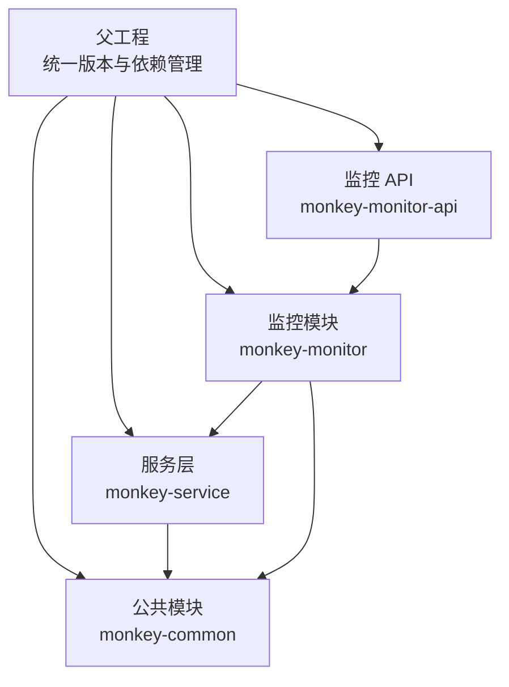
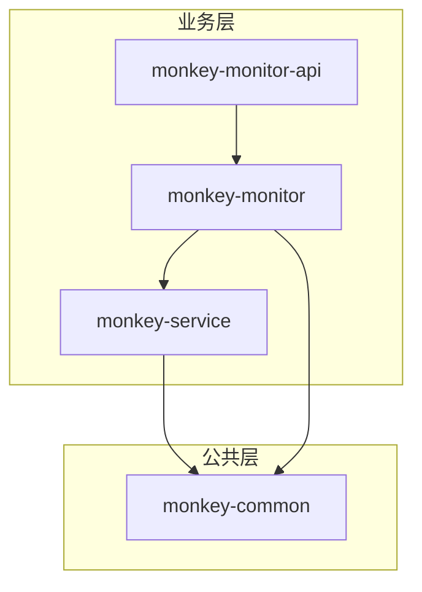
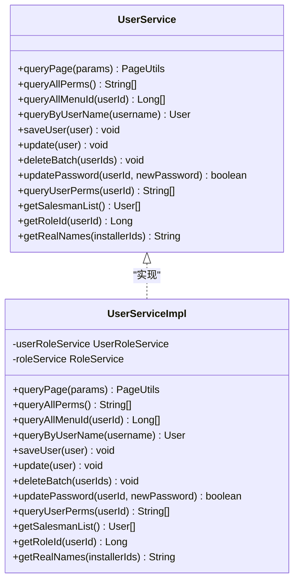
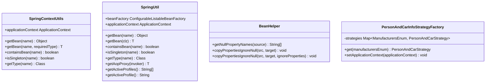
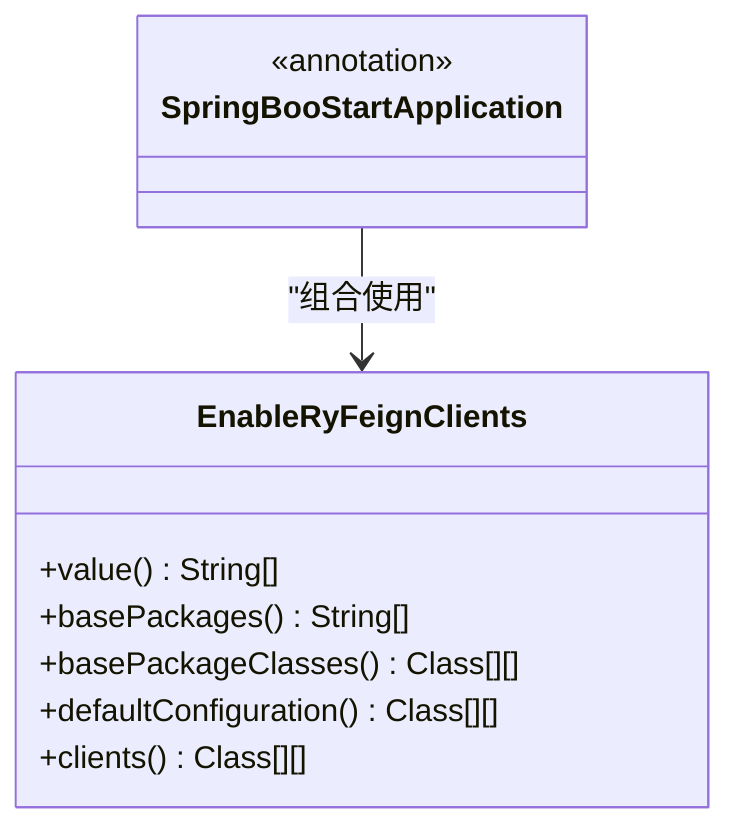
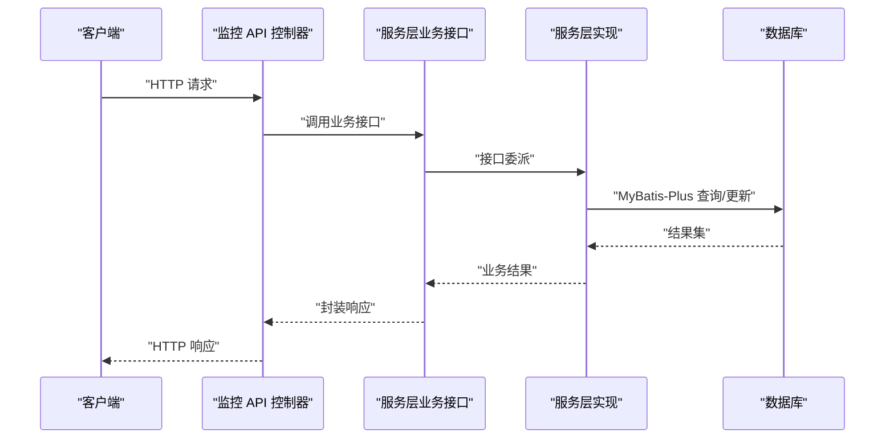
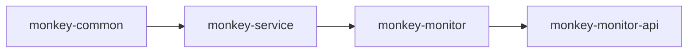

# 依赖关系管理

<cite>
**本文引用的文件**
- [父工程 POM](file://pom.xml)
- [公共模块 POM](file://monkey-common/pom.xml)
- [服务层模块 POM](file://monkey-service/pom.xml)
- [监控模块 POM](file://monkey-monitor/pom.xml)
- [监控 API 模块 POM](file://monkey-monitor-api/pom.xml)
- [公共工具 BeanHelper](file://monkey-common/src/main/java/com/monkey/general/common/utils/BeanHelper.java)
- [服务层上下文工具 SpringContextUtils](file://monkey-service/src/main/java/com/monkey/general/common/utils/SpringContextUtils.java)
- [监控模块上下文工具 SpringUtil](file://monkey-monitor/src/main/java/com/monkey/general/config/mqtt/SpringUtil.java)
- [监控 API Feign 启动注解](file://monkey-monitor-api/src/main/java/com/monkey/general/annotation/SpringBooStartApplication.java)
- [监控 API Feign 扫描注解](file://monkey-monitor-api/src/main/java/com/monkey/general/annotation/EnableRyFeignClients.java)
- [监控 API 策略工厂 PersonAndCarInfoStrategyFactory](file://monkey-monitor-api/src/main/java/com/monkey/general/factory/PersonAndCarInfoStrategyFactory.java)
- [服务层用户服务接口 UserService](file://monkey-service/src/main/java/com/monkey/general/modules/sys/service/UserService.java)
- [服务层用户服务实现 UserServiceImpl](file://monkey-service/src/main/java/com/monkey/general/modules/sys/service/impl/UserServiceImpl.java)
</cite>

## 目录
1. [引言](#引言)
2. [项目结构](#项目结构)
3. [核心组件](#核心组件)
4. [架构总览](#架构总览)
5. [详细组件分析](#详细组件分析)
6. [依赖分析](#依赖分析)
7. [性能考虑](#性能考虑)
8. [故障排查指南](#故障排查指南)
9. [结论](#结论)
10. [附录](#附录)

## 引言
本指南聚焦于安威 fireworks 平台的模块依赖关系管理，系统性阐述父子工程的模块划分、公共模块与业务模块的职责边界、接口与实现分离的设计原则、Spring 容器中的 Bean 管理与自动装配、循环依赖的识别与化解策略、统一版本管理与冲突排查的最佳实践。通过对公共模块 monkey-common、服务层 monkey-service、监控模块 monkey-monitor、监控 API 模块 monkey-monitor-api 的依赖关系进行深入剖析，帮助读者建立清晰的依赖治理思路。

## 项目结构
平台采用 Maven 多模块聚合工程，父工程统一管理版本与依赖范围，子模块按层次化职责划分：
- 父工程：集中定义版本属性、依赖管理与构建插件，确保各模块版本一致与可追溯。
- 公共模块 monkey-common：提供通用工具、基础配置、MyBatis-Plus、OpenFeign 等跨模块复用能力。
- 服务层 monkey-service：面向业务域的服务实现，依赖公共模块，提供数据库访问与业务逻辑。
- 监控模块 monkey-monitor：设备接入、协议适配、数据处理与消息推送，依赖公共模块与服务层。
- 监控 API 模块 monkey-monitor-api：对外暴露 API、集成定时任务与网关式 Feign 客户端，依赖监控模块与第三方调度框架。

图表来源
- [父工程 POM:11-17](file://pom.xml#L11-L17)
- [公共模块 POM:1-163](file://monkey-common/pom.xml#L1-L163)
- [服务层模块 POM:20-26](file://monkey-service/pom.xml#L20-L26)
- [监控模块 POM:20-30](file://monkey-monitor/pom.xml#L20-L30)
- [监控 API 模块 POM:20-25](file://monkey-monitor-api/pom.xml#L20-L25)

章节来源
- [父工程 POM:11-17](file://pom.xml#L11-L17)
- [公共模块 POM:1-163](file://monkey-common/pom.xml#L1-L163)
- [服务层模块 POM:20-26](file://monkey-service/pom.xml#L20-L26)
- [监控模块 POM:20-30](file://monkey-monitor/pom.xml#L20-L30)
- [监控 API 模块 POM:20-25](file://monkey-monitor-api/pom.xml#L20-L25)

## 核心组件
- 公共模块（monkey-common）：提供通用工具类、基础配置、MyBatis-Plus Starter、OpenFeign Starter、Swagger、JSON 解析库等，作为所有业务模块的基础设施。
- 服务层（monkey-service）：封装业务服务接口与实现，依赖公共模块；通过 MyBatis-Plus 访问数据库，提供用户、系统、设备等业务能力。
- 监控模块（monkey-monitor）：负责设备协议接入、数据同步、消息推送与 WebSocket/WebFlux 支持，依赖公共模块与服务层。
- 监控 API 模块（monkey-monitor-api）：对外提供 API、集成 XXL-Job 调度核心、通过自定义注解启用 Feign 客户端扫描。

章节来源
- [公共模块 POM:88-160](file://monkey-common/pom.xml#L88-L160)
- [服务层模块 POM:20-88](file://monkey-service/pom.xml#L20-L88)
- [监控模块 POM:20-101](file://monkey-monitor/pom.xml#L20-L101)
- [监控 API 模块 POM:20-32](file://monkey-monitor-api/pom.xml#L20-L32)

## 架构总览
下图展示模块间的依赖方向与交互关系，体现“公共能力下沉、业务能力上浮”的分层设计。

图表来源
- [服务层模块 POM:20-26](file://monkey-service/pom.xml#L20-L26)
- [监控模块 POM:20-30](file://monkey-monitor/pom.xml#L20-L30)
- [监控 API 模块 POM:20-25](file://monkey-monitor-api/pom.xml#L20-L25)

## 详细组件分析

### 组件一：接口与实现分离（以用户服务为例）
- 接口 UserService：定义业务契约，如分页查询、权限查询、用户增删改等。
- 实现 UserServiceImpl：基于 MyBatis-Plus 的 ServiceImpl，注入 Mapper 与领域服务，完成具体业务逻辑与事务控制。
- 设计原则：通过接口抽象隔离变化，降低模块耦合；实现类仅在服务层内部可见，便于替换与扩展。

图表来源
- [服务层用户服务接口 UserService:16-69](file://monkey-service/src/main/java/com/monkey/general/modules/sys/service/UserService.java#L16-L69)
- [服务层用户服务实现 UserServiceImpl:33-159](file://monkey-service/src/main/java/com/monkey/general/modules/sys/service/impl/UserServiceImpl.java#L33-L159)

章节来源
- [服务层用户服务接口 UserService:16-69](file://monkey-service/src/main/java/com/monkey/general/modules/sys/service/UserService.java#L16-L69)
- [服务层用户服务实现 UserServiceImpl:33-159](file://monkey-service/src/main/java/com/monkey/general/modules/sys/service/impl/UserServiceImpl.java#L33-L159)

### 组件二：依赖注入与 Bean 管理
- Spring 上下文工具：
  - 服务层工具 SpringContextUtils：实现 ApplicationContextAware，提供静态获取 Bean、判断单例、获取类型等能力，便于在非 Spring 环境或静态场景中获取 Bean。
  - 监控模块工具 SpringUtil：实现 BeanFactoryPostProcessor 与 ApplicationContextAware，支持按名称/类型获取 Bean、判断单例、获取别名、获取 AOP 代理对象等。
  - 公共模块工具 BeanHelper：提供对象属性拷贝（忽略空值）等通用能力，减少重复代码。
- 策略工厂 PersonAndCarInfoStrategyFactory：实现 ApplicationContextAware，在启动时从容器收集多种策略实现，按枚举键选择对应策略，体现“接口抽象 + 容器装配”的解耦设计。

图表来源
- [服务层上下文工具 SpringContextUtils:21-51](file://monkey-service/src/main/java/com/monkey/general/common/utils/SpringContextUtils.java#L21-L51)
- [监控模块上下文工具 SpringUtil:14-142](file://monkey-monitor/src/main/java/com/monkey/general/config/mqtt/SpringUtil.java#L14-L142)
- [公共工具 BeanHelper:12-66](file://monkey-common/src/main/java/com/monkey/general/common/utils/BeanHelper.java#L12-L66)
- [监控 API 策略工厂 PersonAndCarInfoStrategyFactory:18-35](file://monkey-monitor-api/src/main/java/com/monkey/general/factory/PersonAndCarInfoStrategyFactory.java#L18-L35)

章节来源
- [服务层上下文工具 SpringContextUtils:21-51](file://monkey-service/src/main/java/com/monkey/general/common/utils/SpringContextUtils.java#L21-L51)
- [监控模块上下文工具 SpringUtil:14-142](file://monkey-monitor/src/main/java/com/monkey/general/config/mqtt/SpringUtil.java#L14-L142)
- [公共工具 BeanHelper:12-66](file://monkey-common/src/main/java/com/monkey/general/common/utils/BeanHelper.java#L12-L66)
- [监控 API 策略工厂 PersonAndCarInfoStrategyFactory:18-35](file://monkey-monitor-api/src/main/java/com/monkey/general/factory/PersonAndCarInfoStrategyFactory.java#L18-L35)

### 组件三：Feign 客户端扫描与 API 启动注解
- 自定义注解 EnableRyFeignClients：对 Spring Cloud OpenFeign 的 EnableFeignClients 进行封装，统一 basePackages 路径，简化扫描配置。
- 自定义注解 SpringBooStartApplication：组合 @SpringBootApplication、@EnableAsync、@EnableSwagger2、@EnableRyFeignClients，形成统一的模块启动入口，提升一致性与可维护性。

图表来源
- [监控 API Feign 扫描注解:20-32](file://monkey-monitor-api/src/main/java/com/monkey/general/annotation/EnableRyFeignClients.java#L20-L32)
- [监控 API Feign 启动注解:21-26](file://monkey-monitor-api/src/main/java/com/monkey/general/annotation/SpringBooStartApplication.java#L21-L26)

章节来源
- [监控 API Feign 扫描注解:20-32](file://monkey-monitor-api/src/main/java/com/monkey/general/annotation/EnableRyFeignClients.java#L20-L32)
- [监控 API Feign 启动注解:21-26](file://monkey-monitor-api/src/main/java/com/monkey/general/annotation/SpringBooStartApplication.java#L21-L26)

### 组件四：模块间调用序列（以监控 API 调用服务层为例）

图表来源
- [监控 API 模块 POM:20-32](file://monkey-monitor-api/pom.xml#L20-L32)
- [服务层用户服务接口 UserService:16-69](file://monkey-service/src/main/java/com/monkey/general/modules/sys/service/UserService.java#L16-L69)
- [服务层用户服务实现 UserServiceImpl:33-159](file://monkey-service/src/main/java/com/monkey/general/modules/sys/service/impl/UserServiceImpl.java#L33-L159)

章节来源
- [监控 API 模块 POM:20-32](file://monkey-monitor-api/pom.xml#L20-L32)
- [服务层用户服务接口 UserService:16-69](file://monkey-service/src/main/java/com/monkey/general/modules/sys/service/UserService.java#L16-L69)
- [服务层用户服务实现 UserServiceImpl:33-159](file://monkey-service/src/main/java/com/monkey/general/modules/sys/service/impl/UserServiceImpl.java#L33-L159)

## 依赖分析
- 层次化依赖：
  - 服务层依赖公共模块，提供通用能力。
  - 监控模块依赖公共模块与服务层，承接设备与业务。
  - 监控 API 模块依赖监控模块，暴露对外接口并集成调度。
- 版本与依赖管理：
  - 父工程通过 dependencyManagement 集中声明 Spring Boot、Spring Cloud、MyBatis-Plus、OpenFeign 等版本，子模块按需引用，避免版本漂移。
  - 子模块 POM 中仅声明 groupId/artifactId，不写版本，版本由父工程统一收敛。
- 循环依赖风险：
  - 当前结构未见直接循环依赖：monitor-api -> monitor -> service -> common，不存在反向依赖。
  - 若出现循环，可通过引入中间层接口模块或抽象共享契约、延迟加载、事件解耦等方式化解。

图表来源
- [父工程 POM:65-101](file://pom.xml#L65-L101)
- [公共模块 POM:88-160](file://monkey-common/pom.xml#L88-L160)
- [服务层模块 POM:20-26](file://monkey-service/pom.xml#L20-L26)
- [监控模块 POM:20-30](file://monkey-monitor/pom.xml#L20-L30)
- [监控 API 模块 POM:20-25](file://monkey-monitor-api/pom.xml#L20-L25)

章节来源
- [父工程 POM:65-101](file://pom.xml#L65-L101)
- [公共模块 POM:88-160](file://monkey-common/pom.xml#L88-L160)
- [服务层模块 POM:20-26](file://monkey-service/pom.xml#L20-L26)
- [监控模块 POM:20-30](file://monkey-monitor/pom.xml#L20-L30)
- [监控 API 模块 POM:20-25](file://monkey-monitor-api/pom.xml#L20-L25)

## 性能考虑
- 依赖瘦身：仅在模块内声明必要依赖，避免传递多余依赖导致包体膨胀与潜在冲突。
- 版本统一：通过父工程集中管理，减少不同模块使用不同版本带来的性能与兼容问题。
- 异步与并发：利用公共模块中的异步配置与工具，结合服务层事务与缓存策略，优化高频接口性能。
- 代码生成与模板：公共模块提供代码生成能力，减少重复样板代码，间接提升开发效率与运行时一致性。

## 故障排查指南
- 循环依赖识别与解决
  - 症状：容器启动报错，提示循环依赖或 Bean 创建失败。
  - 方法：引入中间层接口模块、延迟初始化、事件驱动解耦、避免在构造函数中直接注入相互依赖的 Bean。
- 依赖冲突排查
  - 使用 Maven 插件输出依赖树，定位冲突版本并统一到父工程管理。
  - 在子模块中使用 <exclusions> 排除传递依赖，再在父工程或子模块显式声明所需版本。
- 版本不一致
  - 确认子模块未自行声明版本，全部由父工程 dependencyManagement 提供。
  - 如需升级某依赖，先在父工程调整版本，再验证下游模块兼容性。

## 结论
通过父工程统一版本与依赖管理、公共模块沉淀通用能力、服务层与监控层按职责分层、接口与实现分离以及 Spring 容器的合理装配，平台实现了清晰的模块边界与低耦合的依赖关系。遵循本文的依赖治理策略与最佳实践，可在保证稳定性的同时提升扩展性与可维护性。

## 附录
- 关键实现参考路径
  - [公共工具 BeanHelper:12-66](file://monkey-common/src/main/java/com/monkey/general/common/utils/BeanHelper.java#L12-L66)
  - [服务层上下文工具 SpringContextUtils:21-51](file://monkey-service/src/main/java/com/monkey/general/common/utils/SpringContextUtils.java#L21-L51)
  - [监控模块上下文工具 SpringUtil:14-142](file://monkey-monitor/src/main/java/com/monkey/general/config/mqtt/SpringUtil.java#L14-L142)
  - [监控 API 策略工厂 PersonAndCarInfoStrategyFactory:18-35](file://monkey-monitor-api/src/main/java/com/monkey/general/factory/PersonAndCarInfoStrategyFactory.java#L18-L35)
  - [监控 API Feign 启动注解:21-26](file://monkey-monitor-api/src/main/java/com/monkey/general/annotation/SpringBooStartApplication.java#L21-L26)
  - [监控 API Feign 扫描注解:20-32](file://monkey-monitor-api/src/main/java/com/monkey/general/annotation/EnableRyFeignClients.java#L20-L32)
  - [服务层用户服务接口 UserService:16-69](file://monkey-service/src/main/java/com/monkey/general/modules/sys/service/UserService.java#L16-L69)
  - [服务层用户服务实现 UserServiceImpl:33-159](file://monkey-service/src/main/java/com/monkey/general/modules/sys/service/impl/UserServiceImpl.java#L33-L159)