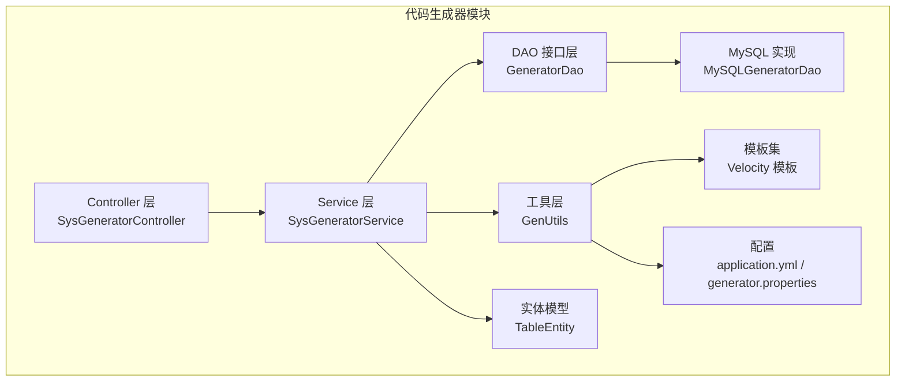
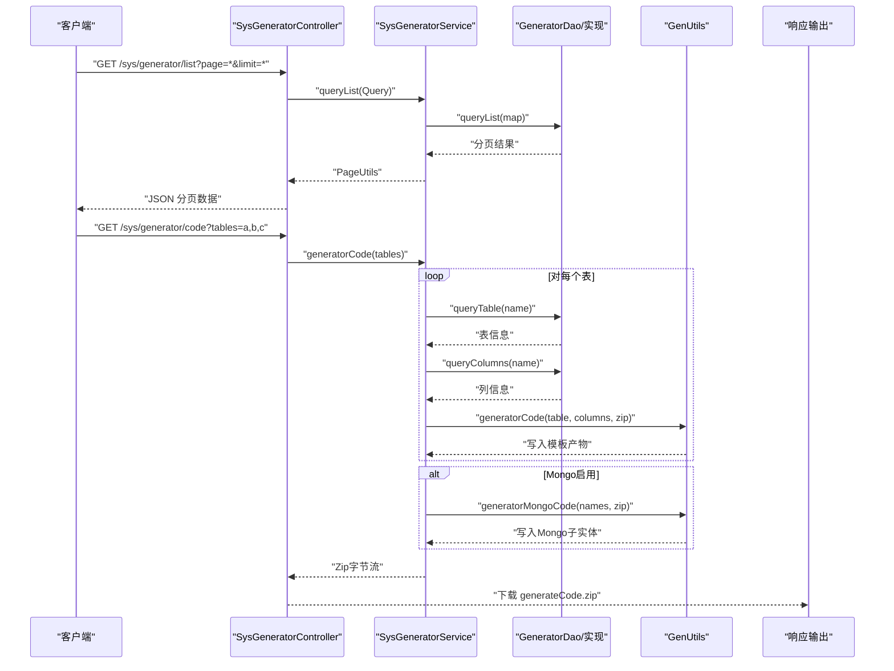
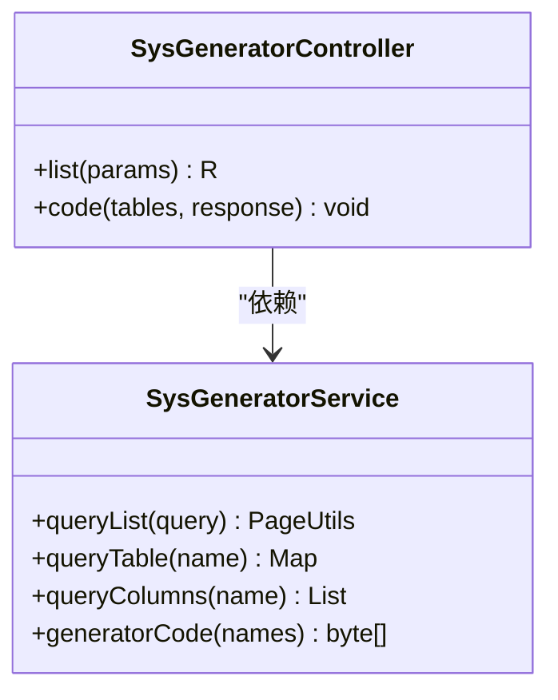
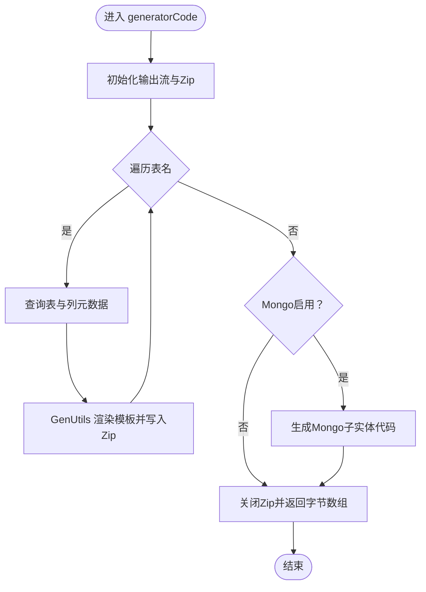
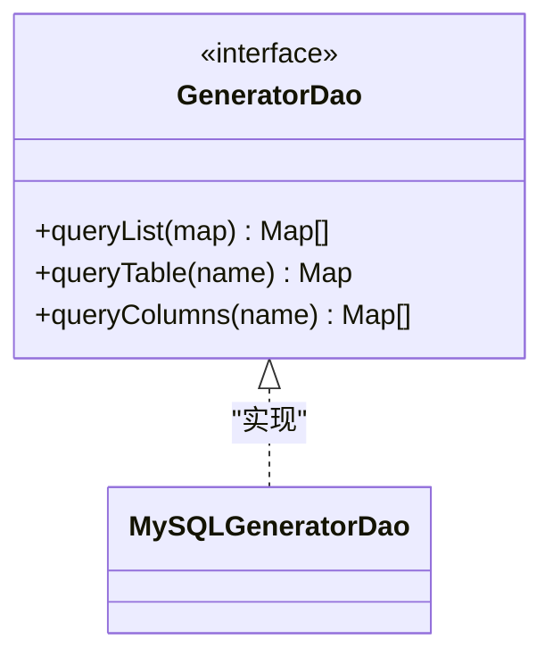
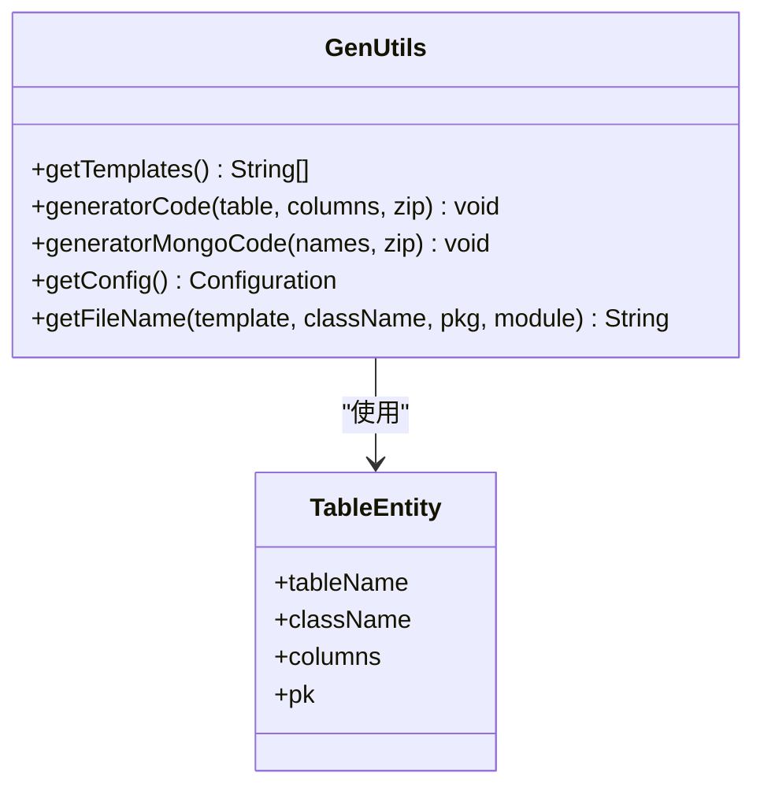
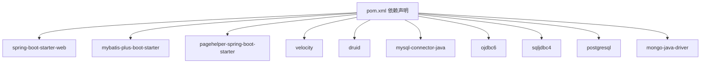
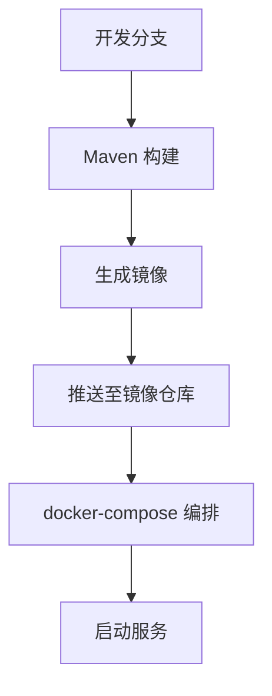

# 功能开发流程

<cite>
**本文引用的文件**
- [MonkeyCodeGeneratorApplication.java](file://monkey-code-generator/src/main/java/com/monkey/MonkeyCodeGeneratorApplication.java)
- [SysGeneratorController.java](file://monkey-code-generator/src/main/java/com/monkey/controller/SysGeneratorController.java)
- [SysGeneratorService.java](file://monkey-code-generator/src/main/java/com/monkey/service/SysGeneratorService.java)
- [GeneratorDao.java](file://monkey-code-generator/src/main/java/com/monkey/dao/GeneratorDao.java)
- [MySQLGeneratorDao.java](file://monkey-code-generator/src/main/java/com/monkey/dao/MySQLGeneratorDao.java)
- [TableEntity.java](file://monkey-code-generator/src/main/java/com/monkey/common/entity/TableEntity.java)
- [GenUtils.java](file://monkey-code-generator/src/main/java/com/monkey/utils/GenUtils.java)
- [application.yml](file://monkey-code-generator/src/main/resources/application.yml)
- [generator.properties](file://monkey-code-generator/src/main/resources/generator.properties)
- [Controller.java.vm](file://monkey-code-generator/src/main/resources/template/Controller.java.vm)
- [Entity.java.vm](file://monkey-code-generator/src/main/resources/template/Entity.java.vm)
- [pom.xml](file://monkey-code-generator/pom.xml)
- [docker-compose.yml](file://deploy/docker-compose.yml)
- [build-push.ps1](file://deploy/build-push.ps1)
- [pull-images.ps1](file://deploy/pull-images.ps1)
</cite>

## 目录
1. [引言](#引言)
2. [项目结构](#项目结构)
3. [核心组件](#核心组件)
4. [架构总览](#架构总览)
5. [详细组件分析](#详细组件分析)
6. [依赖分析](#依赖分析)
7. [性能考虑](#性能考虑)
8. [故障排查指南](#故障排查指南)
9. [结论](#结论)
10. [附录](#附录)

## 引言
本指南以“代码生成器”模块为实际案例，系统化阐述从需求分析到功能上线的完整开发流程。内容覆盖需求梳理与技术可行性评估、设计文档规范（数据库、接口、业务流程）、代码实现步骤（实体、DAO、Service、Controller）、测试验证方法（单元、集成、接口）、代码评审标准与流程，以及部署发布（打包、镜像、编排、上线）全流程实践。

## 项目结构
代码生成器模块采用分层架构与模板引擎结合的方式，提供多数据库适配能力，并支持生成后端与前端代码骨架。核心目录与职责如下：
- controller：对外暴露REST接口，负责接收请求并返回压缩包下载结果
- service：业务编排层，负责分页查询、表与列元数据读取、代码生成与打包
- dao：数据库访问接口，提供统一的表/列查询能力，具体实现按数据库类型扩展
- utils：工具类，包含代码生成模板渲染、配置读取、文件命名规则等
- common/entity：通用实体模型，承载表与列的基础信息
- resources/template：Velocity模板，定义生成的Java类、Mapper XML、Vue页面等
- resources/application.yml：应用配置，含数据库连接、MyBatis映射、分页插件、生成器目标数据库
- resources/generator.properties：生成器配置，如包名、模块名、作者、表前缀、类型映射等
- pom.xml：依赖与构建配置，包含Spring Boot、MyBatis Plus、分页插件、Velocity、各数据库驱动

图表来源
- [SysGeneratorController.java:1-55](file://monkey-code-generator/src/main/java/com/monkey/controller/SysGeneratorController.java#L1-L55)
- [SysGeneratorService.java:1-71](file://monkey-code-generator/src/main/java/com/monkey/service/SysGeneratorService.java#L1-L71)
- [GeneratorDao.java:1-19](file://monkey-code-generator/src/main/java/com/monkey/dao/GeneratorDao.java#L1-L19)
- [MySQLGeneratorDao.java:1-17](file://monkey-code-generator/src/main/java/com/monkey/dao/MySQLGeneratorDao.java#L1-L17)
- [GenUtils.java:1-375](file://monkey-code-generator/src/main/java/com/monkey/utils/GenUtils.java#L1-L375)
- [TableEntity.java:1-83](file://monkey-code-generator/src/main/java/com/monkey/common/entity/TableEntity.java#L1-L83)
- [application.yml:1-58](file://monkey-code-generator/src/main/resources/application.yml#L1-L58)
- [generator.properties:1-65](file://monkey-code-generator/src/main/resources/generator.properties#L1-L65)

章节来源
- [pom.xml:1-166](file://monkey-code-generator/pom.xml#L1-L166)

## 核心组件
- 控制器层：SysGeneratorController 提供分页列表与代码生成下载接口，调用Service完成业务处理
- 服务层：SysGeneratorService 组织分页查询、表/列元数据读取、代码生成与打包，兼容Mongo场景
- DAO接口层：GeneratorDao 定义统一的表/列查询契约；MySQLGeneratorDao 等为具体数据库实现
- 工具层：GenUtils 负责模板加载、上下文组装、文件名计算、Zip输出、Mongo子实体生成
- 实体模型：TableEntity/ColumnEntity 承载表与列元数据，用于模板渲染
- 配置：application.yml 指定数据库与MyBatis Mapper位置；generator.properties 定义生成器参数与类型映射

章节来源
- [SysGeneratorController.java:1-55](file://monkey-code-generator/src/main/java/com/monkey/controller/SysGeneratorController.java#L1-L55)
- [SysGeneratorService.java:1-71](file://monkey-code-generator/src/main/java/com/monkey/service/SysGeneratorService.java#L1-L71)
- [GeneratorDao.java:1-19](file://monkey-code-generator/src/main/java/com/monkey/dao/GeneratorDao.java#L1-L19)
- [MySQLGeneratorDao.java:1-17](file://monkey-code-generator/src/main/java/com/monkey/dao/MySQLGeneratorDao.java#L1-L17)
- [GenUtils.java:1-375](file://monkey-code-generator/src/main/java/com/monkey/utils/GenUtils.java#L1-L375)
- [TableEntity.java:1-83](file://monkey-code-generator/src/main/java/com/monkey/common/entity/TableEntity.java#L1-L83)
- [application.yml:1-58](file://monkey-code-generator/src/main/resources/application.yml#L1-L58)
- [generator.properties:1-65](file://monkey-code-generator/src/main/resources/generator.properties#L1-L65)

## 架构总览
下图展示从HTTP请求到代码生成与下载的端到端流程，涵盖分页查询、元数据读取、模板渲染与压缩打包。

图表来源
- [SysGeneratorController.java:1-55](file://monkey-code-generator/src/main/java/com/monkey/controller/SysGeneratorController.java#L1-L55)
- [SysGeneratorService.java:1-71](file://monkey-code-generator/src/main/java/com/monkey/service/SysGeneratorService.java#L1-L71)
- [GenUtils.java:1-375](file://monkey-code-generator/src/main/java/com/monkey/utils/GenUtils.java#L1-L375)

## 详细组件分析

### 控制器层：SysGeneratorController
- 职责
  - 列表接口：分页查询表清单，返回PageUtils包装
  - 代码生成接口：根据传入的多个表名生成代码，打包为Zip并触发浏览器下载
- 关键点
  - 使用Query封装分页参数，PageHelper在Service层进行分页
  - 下载时设置正确的响应头与内容长度，避免下载异常
- 复杂度
  - 列表：O(n)遍历分页结果
  - 代码生成：O(k)遍历表并渲染模板，k为表数量

图表来源
- [SysGeneratorController.java:1-55](file://monkey-code-generator/src/main/java/com/monkey/controller/SysGeneratorController.java#L1-L55)
- [SysGeneratorService.java:1-71](file://monkey-code-generator/src/main/java/com/monkey/service/SysGeneratorService.java#L1-L71)

章节来源
- [SysGeneratorController.java:1-55](file://monkey-code-generator/src/main/java/com/monkey/controller/SysGeneratorController.java#L1-L55)

### 服务层：SysGeneratorService
- 职责
  - 分页查询：调用DAO获取表清单，兼容Mongo集合总数统计
  - 元数据读取：按表名查询表与列信息
  - 代码生成：遍历表，调用GenUtils渲染模板并写入Zip
  - 条件生成：当Mongo启用时，额外生成子实体代码
- 错误处理
  - 模板渲染异常统一抛出RRException，由全局异常处理器捕获
- 性能要点
  - 使用PageHelper进行分页，减少一次性加载
  - Zip输出流复用，避免重复创建

图表来源
- [SysGeneratorService.java:1-71](file://monkey-code-generator/src/main/java/com/monkey/service/SysGeneratorService.java#L1-L71)
- [GenUtils.java:1-375](file://monkey-code-generator/src/main/java/com/monkey/utils/GenUtils.java#L1-L375)

章节来源
- [SysGeneratorService.java:1-71](file://monkey-code-generator/src/main/java/com/monkey/service/SysGeneratorService.java#L1-L71)

### DAO层：GeneratorDao与MySQL实现
- GeneratorDao
  - 定义统一的表/列查询接口，便于扩展不同数据库实现
- MySQLGeneratorDao
  - 通过注解声明为Mapper，配合XML映射文件执行SQL查询
- 设计要点
  - 接口与实现分离，利于多数据库切换
  - 查询结果以Map形式返回，便于工具层统一处理

图表来源
- [GeneratorDao.java:1-19](file://monkey-code-generator/src/main/java/com/monkey/dao/GeneratorDao.java#L1-L19)
- [MySQLGeneratorDao.java:1-17](file://monkey-code-generator/src/main/java/com/monkey/dao/MySQLGeneratorDao.java#L1-L17)

章节来源
- [GeneratorDao.java:1-19](file://monkey-code-generator/src/main/java/com/monkey/dao/GeneratorDao.java#L1-L19)
- [MySQLGeneratorDao.java:1-17](file://monkey-code-generator/src/main/java/com/monkey/dao/MySQLGeneratorDao.java#L1-L17)

### 工具层：GenUtils
- 职责
  - 模板管理：根据是否启用Mongo动态调整模板集合
  - 渲染与命名：组装Velocity上下文，渲染模板并计算生成文件路径
  - 文件写入：将模板产物写入Zip输出流
  - Mongo子实体：遍历Mongo定义，生成嵌套子实体
- 配置来源
  - 读取generator.properties，包含包名、模块名、作者、表前缀、类型映射等
- 复杂度
  - 模板渲染：O(m)（m为模板数量）
  - 文件命名：O(1)字符串拼接

图表来源
- [GenUtils.java:1-375](file://monkey-code-generator/src/main/java/com/monkey/utils/GenUtils.java#L1-L375)
- [TableEntity.java:1-83](file://monkey-code-generator/src/main/java/com/monkey/common/entity/TableEntity.java#L1-L83)
- [generator.properties:1-65](file://monkey-code-generator/src/main/resources/generator.properties#L1-L65)

章节来源
- [GenUtils.java:1-375](file://monkey-code-generator/src/main/java/com/monkey/utils/GenUtils.java#L1-L375)
- [generator.properties:1-65](file://monkey-code-generator/src/main/resources/generator.properties#L1-L65)

### 实体模型：TableEntity
- 职责
  - 封装表与列元数据，作为模板渲染的数据源
- 字段
  - 表名、注释、主键、创建/更新时间字段、类名（首字母大小写）、列集合
- 用途
  - 为Velocity模板提供结构化数据，支撑生成Entity、Mapper、Controller、Vue页面等

章节来源
- [TableEntity.java:1-83](file://monkey-code-generator/src/main/java/com/monkey/common/entity/TableEntity.java#L1-L83)

### 模板示例：Controller与Entity
- Controller.java.vm
  - 生成REST控制器，包含列表、详情、保存、修改、删除等接口
  - 自动注入对应Service，使用分页工具与校验工具
- Entity.java.vm
  - 生成MyBatis-Plus实体类，自动标注主键、字段填充策略
  - 根据列信息生成属性与注释

章节来源
- [Controller.java.vm:1-118](file://monkey-code-generator/src/main/resources/template/Controller.java.vm#L1-L118)
- [Entity.java.vm:1-47](file://monkey-code-generator/src/main/resources/template/Entity.java.vm#L1-L47)

## 依赖分析
- 运行时依赖
  - Spring Boot Starter Web：提供Web容器与MVC能力
  - MyBatis Plus + PageHelper：ORM与分页
  - Velocity：模板渲染
  - Druid：连接池
  - 各数据库驱动：MySQL、Oracle、SQLServer、PostgreSQL、Mongo
- 构建与打包
  - spring-boot-maven-plugin：打包为可执行Jar
  - Maven仓库与插件仓库配置指向阿里云镜像

图表来源
- [pom.xml:1-166](file://monkey-code-generator/pom.xml#L1-L166)

章节来源
- [pom.xml:1-166](file://monkey-code-generator/pom.xml#L1-L166)

## 性能考虑
- 分页查询：使用PageHelper在Service层进行分页，避免一次性加载全量数据
- 模板渲染：按需加载模板，仅在Mongo启用时追加子实体模板，减少IO
- 输出优化：复用ZipOutputStream，避免频繁创建对象
- 数据库连接：Druid连接池配置合理，建议结合业务并发调优
- 缓存与异步：对于高频查询可引入Redis缓存；对于耗时任务可考虑异步或消息队列

## 故障排查指南
- 生成失败
  - 现象：下载的Zip为空或解压报错
  - 排查：检查GenUtils模板渲染异常捕获与日志输出；确认模板路径与文件名计算正确
- 数据库连接异常
  - 现象：分页列表为空或报连接错误
  - 排查：核对application.yml中的数据库URL、用户名、密码；确认对应驱动已引入
- 类型映射问题
  - 现象：生成的实体字段类型不符合预期
  - 排查：检查generator.properties中的类型映射配置，必要时补充自定义映射
- 下载异常
  - 现象：浏览器无法下载或文件损坏
  - 排查：确认响应头设置（Content-Disposition、Content-Length、Content-Type）与输出流关闭

章节来源
- [application.yml:1-58](file://monkey-code-generator/src/main/resources/application.yml#L1-L58)
- [generator.properties:1-65](file://monkey-code-generator/src/main/resources/generator.properties#L1-L65)
- [SysGeneratorController.java:1-55](file://monkey-code-generator/src/main/java/com/monkey/controller/SysGeneratorController.java#L1-L55)
- [GenUtils.java:1-375](file://monkey-code-generator/src/main/java/com/monkey/utils/GenUtils.java#L1-L375)

## 结论
通过代码生成器模块的实践，可以将“需求—设计—实现—测试—评审—发布”的流程标准化与自动化。建议在团队内固化模板与配置，统一生成规范，持续完善测试与监控，确保交付质量与效率。

## 附录

### 需求分析阶段工作清单
- 明确功能边界：确定要生成的代码类型（实体、Mapper、Service、Controller、Vue页面）、目标数据库类型、是否启用Mongo
- 技术可行性评估：确认现有依赖与模板是否满足需求；评估分页、模板渲染、Zip打包的性能
- 风险识别：数据库驱动缺失、模板路径错误、类型映射不一致、下载响应异常等

### 设计文档编写规范
- 数据库设计
  - 表与列的命名规范、主键策略、索引建议
  - 字段注释与业务含义明确
- 接口设计
  - REST接口命名与路径规范、参数与返回体约定
  - 权限控制与鉴权策略
- 业务流程设计
  - 生成流程：表清单分页、元数据读取、模板渲染、Zip打包、下载
  - 异常处理：统一异常捕获与响应格式

### 代码实现步骤
- 实体类设计
  - 基于TableEntity/ColumnEntity定义表与列结构
- DAO层实现
  - 实现GeneratorDao接口，提供表/列查询SQL
- Service层逻辑
  - 组织分页查询、元数据读取、代码生成与打包
- Controller层接口
  - 暴露列表与代码生成接口，处理下载响应

### 测试验证方法
- 单元测试
  - 验证GenUtils模板渲染、文件命名、类型映射
  - 验证SysGeneratorService分页与Zip输出
- 集成测试
  - 联调数据库，验证表/列查询与分页
- 接口测试
  - 使用Swagger或Postman验证列表与下载接口

### 代码评审标准与流程
- 规范性：包名、类名、字段命名符合团队规范
- 可维护性：模板清晰、配置集中、异常处理统一
- 性能：分页、Zip输出、模板渲染性能达标
- 安全性：权限注解、输入校验、异常不泄露敏感信息

### 功能部署与发布流程
- 打包
  - 使用Maven构建可执行Jar（或Docker镜像）
- 测试
  - 在预发环境验证生成代码可用性与下载功能
- 上线
  - 通过docker-compose编排启动服务，拉取所需镜像并启动
- 发布脚本
  - build-push.ps1：统一构建与推送镜像
  - pull-images.ps1：拉取基础设施与应用镜像

图表来源
- [build-push.ps1:1-263](file://deploy/build-push.ps1#L1-L263)
- [pull-images.ps1:1-56](file://deploy/pull-images.ps1#L1-L56)
- [docker-compose.yml:1-103](file://deploy/docker-compose.yml#L1-L103)

章节来源
- [build-push.ps1:1-263](file://deploy/build-push.ps1#L1-L263)
- [pull-images.ps1:1-56](file://deploy/pull-images.ps1#L1-L56)
- [docker-compose.yml:1-103](file://deploy/docker-compose.yml#L1-L103)