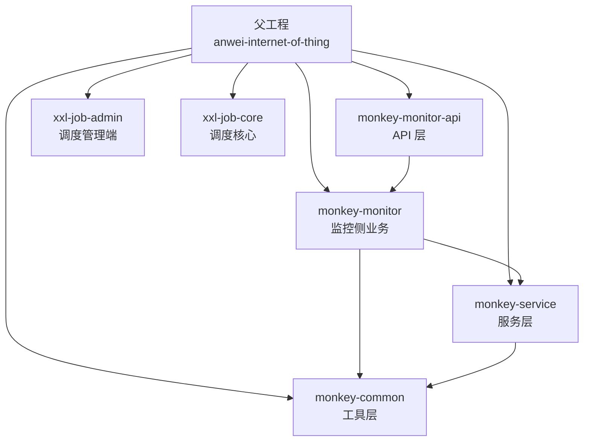
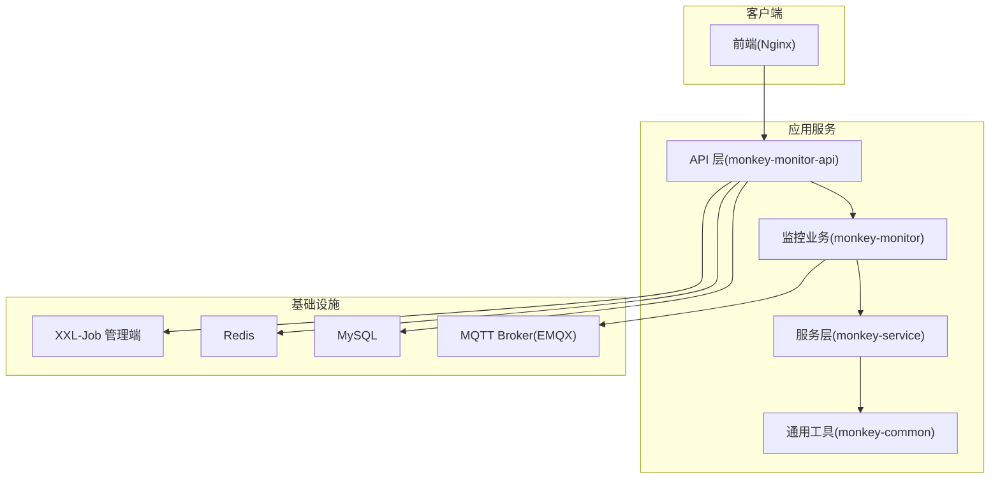
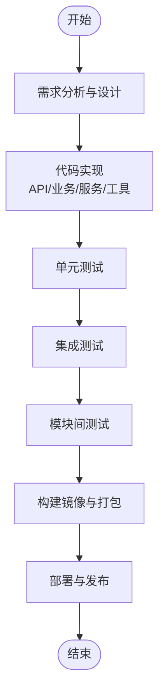
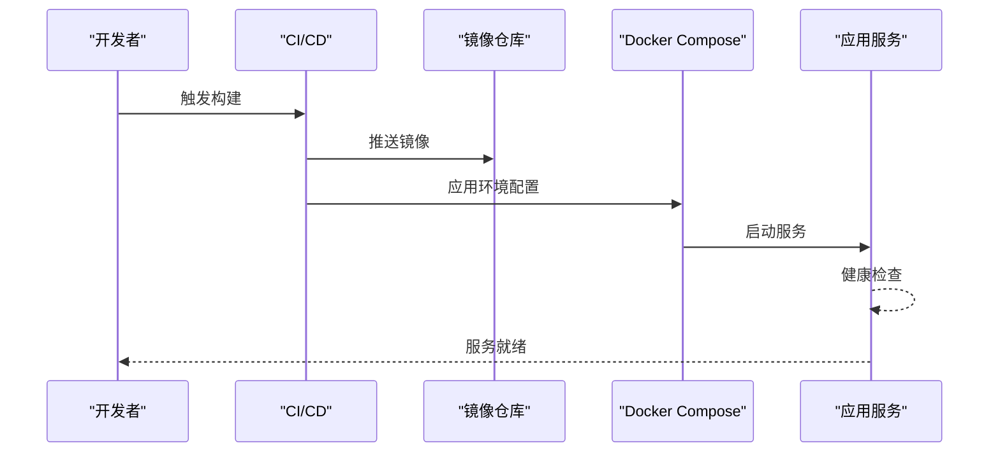
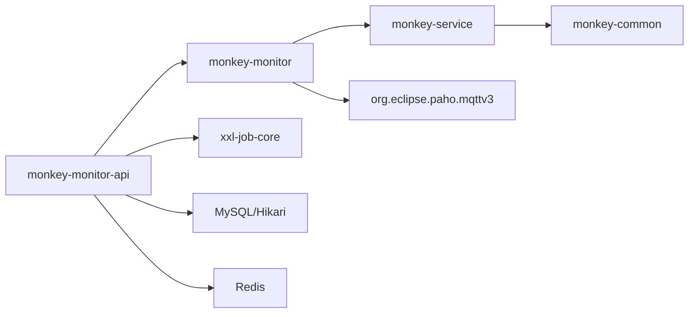

# 模块开发

<cite>
**本文引用的文件**
- [pom.xml](file://pom.xml)
- [docker-compose.yml](file://deploy/docker-compose.yml)
- [application.yml](file://monkey-monitor-api/src/main/resources/application.yml)
- [application-prod.yml](file://deploy/config/monitor-api/application-prod.yml)
- [application-prod.properties](file://deploy/config/xxl-job-admin/application-prod.properties)
- [MqttConfiguration.java](file://monkey-monitor/src/main/java/com/monkey/general/config/MqttConfiguration.java)
- [MonkeyMonitorApplication.java](file://monkey-monitor-api/src/main/java/com/monkey/general/MonkeyMonitorApplication.java)
- [monkey-monitor-api/pom.xml](file://monkey-monitor-api/pom.xml)
- [monkey-monitor/pom.xml](file://monkey-monitor/pom.xml)
- [monkey-service/pom.xml](file://monkey-service/pom.xml)
- [monkey-common/pom.xml](file://monkey-common/pom.xml)
</cite>

## 目录
1. [简介](#简介)
2. [项目结构](#项目结构)
3. [核心组件](#核心组件)
4. [架构总览](#架构总览)
5. [详细组件分析](#详细组件分析)
6. [依赖分析](#依赖分析)
7. [性能考虑](#性能考虑)
8. [故障排查指南](#故障排查指南)
9. [结论](#结论)
10. [附录](#附录)

## 简介
本指南面向安威 fireworks 物联网监控平台的模块开发者，系统性阐述如何在现有多模块架构中新增业务模块与扩展能力。内容覆盖模块结构设计、包命名规范、配置文件组织、模块间依赖与接口契约、依赖注入与循环依赖规避、新功能从需求到发布的全流程、模块扩展与第三方服务集成、测试策略、部署与发布流程，以及常见问题与最佳实践。

## 项目结构
项目采用 Maven 多模块聚合结构，顶层 POM 统一管理版本与依赖范围，子模块按职责拆分：
- monkey-common：通用工具与基础能力
- monkey-service：服务层，封装领域服务与数据访问
- monkey-monitor：监控侧业务与适配器（含 MQTT 配置、厂商适配、视频与告警等）
- monkey-monitor-api：对外 API 层，启动入口与配置
- xxl-job-*：定时调度相关模块（管理端与核心）

图表来源
- [pom.xml:11-17](file://pom.xml#L11-L17)
- [monkey-monitor-api/pom.xml:21-25](file://monkey-monitor-api/pom.xml#L21-L25)
- [monkey-monitor/pom.xml:20-30](file://monkey-monitor/pom.xml#L20-L30)
- [monkey-service/pom.xml:20-26](file://monkey-service/pom.xml#L20-L26)
- [monkey-common/pom.xml:20-26](file://monkey-common/pom.xml#L20-L26)

章节来源
- [pom.xml:11-17](file://pom.xml#L11-L17)
- [docker-compose.yml:1-103](file://deploy/docker-compose.yml#L1-L103)

## 核心组件
- 启动入口与环境
  - API 层启动类负责禁用 Headless 模式以支持本地图形窗口场景（如调用大华 SDK 抓图）。
  - 配置文件通过 Spring Profile 切换开发/测试/生产环境，MyBatis Plus Mapper 与实体扫描路径集中配置。
- MQTT 连接配置
  - 提供本地 MQTT 客户端 Bean，统一认证、超时、保活与重连策略，便于各模块订阅/发布消息。
- 基础设施编排
  - Docker Compose 编排 MySQL、Redis、EMQX、调度管理端、API 服务与前端 Nginx，明确服务间依赖与网络隔离。

章节来源
- [MonkeyMonitorApplication.java:9-17](file://monkey-monitor-api/src/main/java/com/monkey/general/MonkeyMonitorApplication.java#L9-L17)
- [application.yml:1-40](file://monkey-monitor-api/src/main/resources/application.yml#L1-L40)
- [MqttConfiguration.java:14-52](file://monkey-monitor/src/main/java/com/monkey/general/config/MqttConfiguration.java#L14-L52)
- [docker-compose.yml:1-103](file://deploy/docker-compose.yml#L1-L103)

## 架构总览
平台采用“API 层—监控业务层—服务层—通用工具层”的分层架构，结合 MQTT、WebSocket、HTTP、定时任务等技术栈，支撑设备接入、数据采集、规则告警、可视化展示与第三方系统对接。

图表来源
- [docker-compose.yml:54-98](file://deploy/docker-compose.yml#L54-L98)
- [application-prod.yml:1-203](file://deploy/config/monitor-api/application-prod.yml#L1-L203)
- [application.yml:1-40](file://monkey-monitor-api/src/main/resources/application.yml#L1-L40)

## 详细组件分析

### 模块结构设计与包命名规范
- 模块边界
  - 通用能力下沉至 monkey-common，避免重复造轮子。
  - 业务域收敛在 monkey-monitor 与 monkey-service，遵循“业务—服务—工具”逐层抽象。
  - API 层仅负责暴露接口、编排与编译打包，不承载业务逻辑。
- 包命名建议
  - 通用工具：com.monkey.general.common.*
  - 业务模块：com.monkey.general.modules.<biz>.*
  - 配置与适配：com.monkey.general.config、com.monkey.general.platform.*
  - 控制器与接口：com.monkey.general.controller、com.monkey.general.api
  - 实体与映射：com.monkey.general.modules.<biz>.entity、mapper
  - 服务实现：com.monkey.general.modules.<biz>.service.impl
- 命名一致性
  - 控制器类名以“...Controller”结尾；服务接口以“Service”结尾；实现类以“ServiceImpl”结尾。
  - 配置类以“Configuration”或“Config”结尾；工具类以“Util”或“Utils”结尾。

章节来源
- [monkey-monitor/pom.xml:20-30](file://monkey-monitor/pom.xml#L20-L30)
- [monkey-service/pom.xml:20-26](file://monkey-service/pom.xml#L20-L26)
- [monkey-common/pom.xml:20-26](file://monkey-common/pom.xml#L20-L26)

### 配置文件组织与环境管理
- API 层配置
  - application.yml：统一 MyBatis Plus Mapper 扫描、实体别名包、Jackson 时间格式化、日志输出开关等。
  - deploy/config/monitor-api/application-prod.yml：生产环境数据库、Redis、MQTT、WebSocket、第三方对接地址、XXL-Job 执行器配置等。
- 调度管理端配置
  - deploy/config/xxl-job-admin/application-prod.properties：数据库连接、连接池、邮件告警、国际化、触发线程池上限、日志保留天数等。
- 环境切换
  - 通过 Spring Profile 在 API 层切换 dev/test/prod；生产环境变量由 Docker Compose 注入。

章节来源
- [application.yml:1-40](file://monkey-monitor-api/src/main/resources/application.yml#L1-L40)
- [application-prod.yml:1-203](file://deploy/config/monitor-api/application-prod.yml#L1-L203)
- [application-prod.properties:1-66](file://deploy/config/xxl-job-admin/application-prod.properties#L1-L66)

### 模块间依赖关系与接口契约
- 依赖方向
  - monkey-monitor-api → monkey-monitor
  - monkey-monitor → monkey-service, monkey-common
  - monkey-service → monkey-common
- 接口契约
  - 控制器层通过服务接口进行业务编排，服务层通过 DAO/Repository 访问数据，DAO 映射 XML 放置于 resources/mapper 下。
  - 通过 OpenFeign 或 HTTP 客户端与第三方系统交互，统一在服务层封装。
- 循环依赖规避
  - 严格保持“上层调用下层”的单向依赖；若出现双向耦合，拆分为公共接口或引入中间层。

章节来源
- [monkey-monitor-api/pom.xml:21-25](file://monkey-monitor-api/pom.xml#L21-L25)
- [monkey-monitor/pom.xml:20-30](file://monkey-monitor/pom.xml#L20-L30)
- [monkey-service/pom.xml:20-26](file://monkey-service/pom.xml#L20-L26)
- [monkey-common/pom.xml:20-26](file://monkey-common/pom.xml#L20-L26)

### 依赖注入与配置装配
- MQTT 客户端 Bean
  - 通过 MqttConfiguration 提供 MqttClient Bean，统一认证、超时、保活与自动重连策略，供业务模块订阅/发布。
- Spring Boot 启动
  - API 层启动类设置非 Headless 模式，确保本地图形场景可用。
- MyBatis Plus
  - 在 application.yml 中集中配置 Mapper 扫描与实体包扫描，减少分散配置。

章节来源
- [MqttConfiguration.java:14-52](file://monkey-monitor/src/main/java/com/monkey/general/config/MqttConfiguration.java#L14-L52)
- [MonkeyMonitorApplication.java:9-17](file://monkey-monitor-api/src/main/java/com/monkey/general/MonkeyMonitorApplication.java#L9-L17)
- [application.yml:14-39](file://monkey-monitor-api/src/main/resources/application.yml#L14-L39)

### 新功能开发完整流程
- 需求分析
  - 明确业务域、输入输出、第三方对接点、数据模型与规则。
- 设计文档
  - 定义控制器接口、服务契约、实体与 Mapper、配置项与环境变量。
- 代码实现
  - 在 monkey-monitor-api 新增 Controller；在 monkey-monitor 新增适配器与业务逻辑；在 monkey-service 新增服务与 DAO；在 monkey-common 新增工具或常量。
- 测试验证
  - 单元测试覆盖服务与工具；集成测试覆盖控制器与外部系统；模块间测试验证 Feign/HTTP 调用链路。
- 部署发布
  - 更新 docker-compose 与环境配置；构建镜像并推送；滚动更新或蓝绿发布。

### 模块扩展指南
- 扩展现有模块功能
  - 在现有模块下新增子包，遵循“同一业务域内收敛”的原则；通过接口抽象与策略模式解耦不同厂商或协议。
- 添加新的业务逻辑
  - 在 monkey-monitor/modules/<biz> 下新增 entity/service/mapper/controller；在 application.yml 中补充必要的 Mapper 扫描与实体包。
- 集成第三方服务
  - 在服务层封装 HTTP/Feign 客户端，统一异常处理与重试；在配置文件中新增 endpoint 与鉴权参数；在 API 层新增 Controller 暴露接口。
- MQTT/WS/定时任务
  - 使用 MqttConfiguration 提供的客户端；WebSocket 可在 socket 配置中扩展；XXL-Job 在执行器侧新增 JobHandler 并注册。

章节来源
- [application.yml:14-39](file://monkey-monitor-api/src/main/resources/application.yml#L14-L39)
- [application-prod.yml:56-162](file://deploy/config/monitor-api/application-prod.yml#L56-L162)

### 模块测试策略
- 单元测试
  - 针对 Service 与 Util 编写 JUnit 测试，Mock DAO/Repository 与外部依赖。
- 集成测试
  - 启动 API 层与必要依赖（MySQL/Redis/EMQX），验证 Controller 行为与数据持久化。
- 模块间测试
  - 通过 Feign 或 HTTP 客户端模拟跨模块调用，验证接口契约与错误传播。

章节来源
- [monkey-monitor-api/pom.xml:21-31](file://monkey-monitor-api/pom.xml#L21-L31)
- [monkey-monitor/pom.xml:44-47](file://monkey-monitor/pom.xml#L44-L47)

### 模块部署与发布流程
- 本地开发
  - 使用 docker-compose 启动基础设施与应用服务；通过环境变量覆盖默认配置。
- 生产发布
  - 在 CI 中构建并推送镜像；在部署阶段替换环境配置文件；通过健康检查与依赖顺序保证服务可用。
- 版本管理
  - 顶层 POM 统一管理版本；模块间版本通过 ${project.version} 传递，避免漂移。

图表来源
- [docker-compose.yml:54-98](file://deploy/docker-compose.yml#L54-L98)
- [application-prod.yml:1-203](file://deploy/config/monitor-api/application-prod.yml#L1-L203)

章节来源
- [docker-compose.yml:1-103](file://deploy/docker-compose.yml#L1-L103)
- [pom.xml:23-62](file://pom.xml#L23-L62)

## 依赖分析
- 版本与依赖管理
  - 顶层 POM 通过 dependencyManagement 统一版本，确保 Spring Boot、Spring Cloud、MyBatis Plus、OpenFeign、MQTT 等依赖一致。
- 模块间依赖
  - API 层依赖监控业务层；监控业务层依赖服务层与通用工具层；服务层依赖通用工具层与数据库/缓存/对象存储等外部组件。
- 外部依赖
  - MySQL、Redis、EMQX、XXL-Job 管理端构成基础设施；MQTT 客户端、WebFlux、WebSocket、HTTP 客户端等支撑通信与异步处理。

图表来源
- [pom.xml:65-101](file://pom.xml#L65-L101)
- [monkey-monitor-api/pom.xml:21-31](file://monkey-monitor-api/pom.xml#L21-L31)
- [monkey-monitor/pom.xml:74-100](file://monkey-monitor/pom.xml#L74-L100)
- [monkey-service/pom.xml:74-86](file://monkey-service/pom.xml#L74-L86)

章节来源
- [pom.xml:65-101](file://pom.xml#L65-L101)
- [monkey-monitor-api/pom.xml:21-31](file://monkey-monitor-api/pom.xml#L21-L31)
- [monkey-monitor/pom.xml:74-100](file://monkey-monitor/pom.xml#L74-L100)
- [monkey-service/pom.xml:74-86](file://monkey-service/pom.xml#L74-L86)

## 性能考虑
- 连接池与缓存
  - 数据库连接池与 Redis 连接池参数在生产配置中集中管理，避免过大或过小导致资源浪费或抖动。
- 异步与流式
  - 使用 WebFlux 与 WebSocket 降低高并发下的阻塞开销；MQTT 消息队列化处理，避免阻塞主线程。
- 日志与监控
  - 控制台 SQL 输出仅在开发环境开启；生产环境关注日志级别与落盘策略，避免 IO 放大。
- 资源隔离
  - Docker 网络隔离与健康检查保障服务可用性；XXL-Job 执行器独立端口与日志目录，避免资源争抢。

## 故障排查指南
- 启动失败
  - 检查 API 层启动类的 Headless 设置与依赖服务健康状态；确认 docker-compose 依赖顺序与环境变量。
- 数据库/缓存不可用
  - 核对生产配置中的 JDBC URL、用户名、密码与连接池参数；确认容器健康检查与网络连通。
- MQTT 连接异常
  - 核对 MqttConfiguration 中的认证信息、超时与保活参数；确认 EMQX 服务可达与账号权限。
- 定时任务未触发
  - 核对 XXL-Job 管理端配置与执行器注册信息；确认执行器端口与日志目录权限。

章节来源
- [MonkeyMonitorApplication.java:9-17](file://monkey-monitor-api/src/main/java/com/monkey/general/MonkeyMonitorApplication.java#L9-L17)
- [MqttConfiguration.java:14-52](file://monkey-monitor/src/main/java/com/monkey/general/config/MqttConfiguration.java#L14-L52)
- [application-prod.yml:1-203](file://deploy/config/monitor-api/application-prod.yml#L1-L203)
- [application-prod.properties:25-41](file://deploy/config/xxl-job-admin/application-prod.properties#L25-L41)

## 结论
通过清晰的模块边界、统一的配置与依赖管理、完善的测试与部署流程，安威 fireworks 平台能够高效地扩展新业务模块并稳定运行于生产环境。建议在新增模块时严格遵循本文的结构与规范，确保可维护性与可扩展性。

## 附录
- 快速检查清单
  - 模块划分是否符合“API—业务—服务—工具”分层
  - 包命名是否符合约定
  - 配置文件是否按环境分离
  - 依赖方向是否单向
  - 是否存在循环依赖
  - 是否完成单元/集成/模块间测试
  - docker-compose 健康检查与依赖顺序是否正确
  - 版本管理是否统一