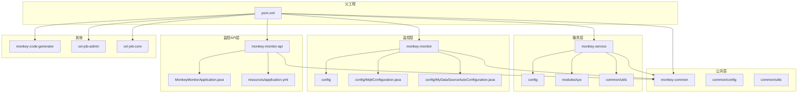
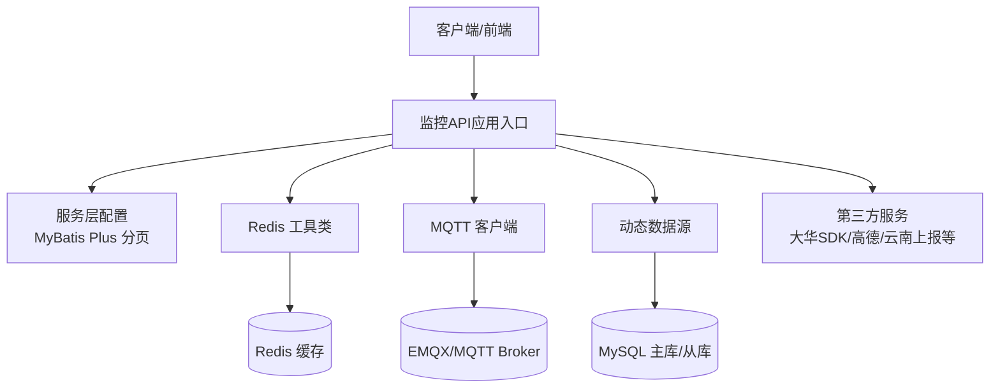
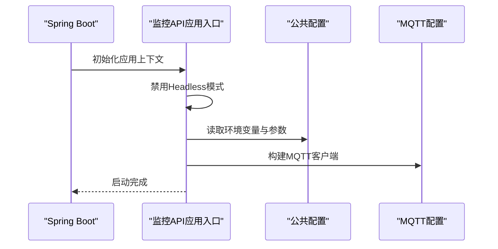
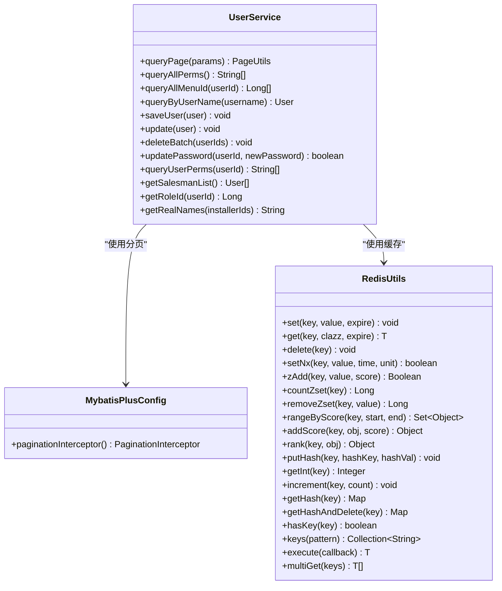
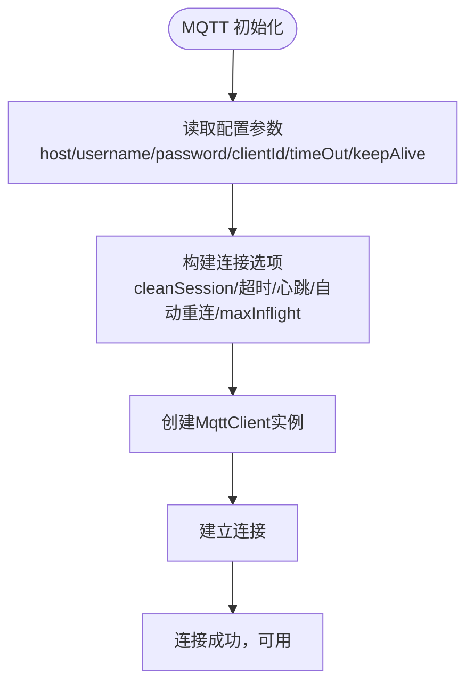
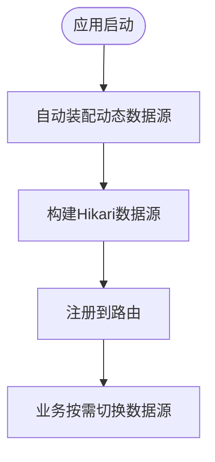
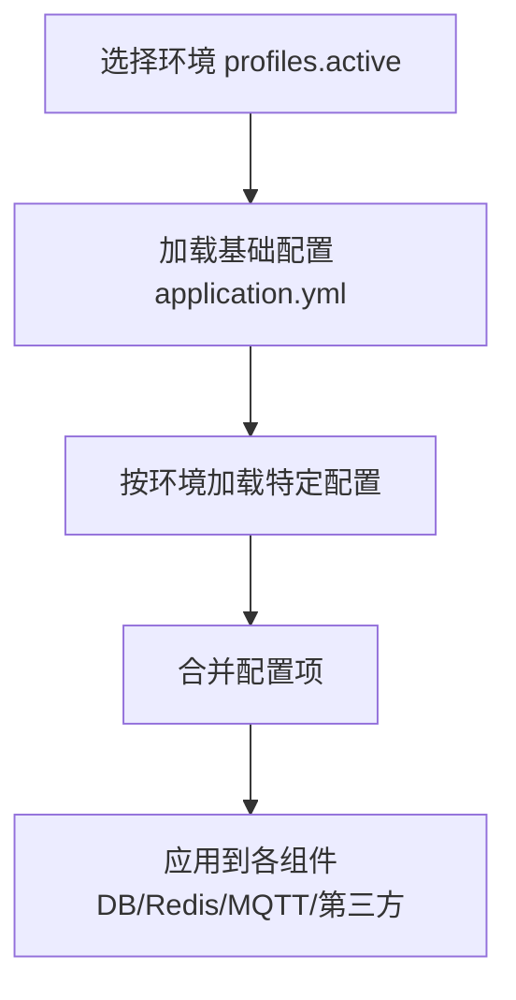
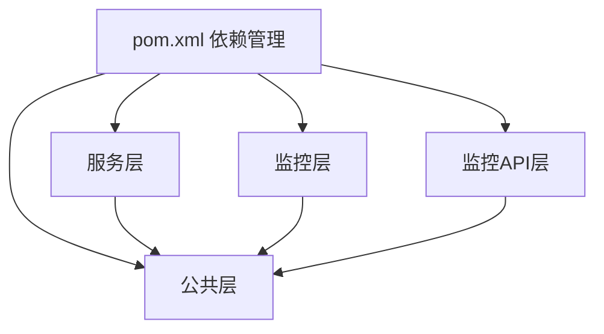

# 模块扩展指南

<cite>
**本文引用的文件**
- [pom.xml](file://pom.xml)
- [MonkeyMonitorApplication.java](file://monkey-monitor-api/src/main/java/com/monkey/general/MonkeyMonitorApplication.java)
- [MybatisPlusConfig.java](file://monkey-service/src/main/java/com/monkey/general/config/MybatisPlusConfig.java)
- [ApplicationConfig.java](file://monkey-common/src/main/java/com/monkey/general/common/config/ApplicationConfig.java)
- [MyDataSourceAutoConfiguration.java](file://monkey-monitor/src/main/java/com/monkey/general/config/MyDataSourceAutoConfiguration.java)
- [MqttConfiguration.java](file://monkey-monitor/src/main/java/com/monkey/general/config/MqttConfiguration.java)
- [UserService.java](file://monkey-service/src/main/java/com/monkey/general/modules/sys/service/UserService.java)
- [application.yml](file://monkey-monitor-api/src/main/resources/application.yml)
- [application-prod.yml](file://deploy/config/monitor-api/application-prod.yml)
- [RedisUtils.java](file://monkey-service/src/main/java/com/monkey/general/common/utils/RedisUtils.java)
- [ConfigConstant.java](file://monkey-common/src/main/java/com/monkey/general/common/utils/ConfigConstant.java)
</cite>

## 目录
1. [简介](#简介)
2. [项目结构](#项目结构)
3. [核心组件](#核心组件)
4. [架构总览](#架构总览)
5. [详细组件分析](#详细组件分析)
6. [依赖分析](#依赖分析)
7. [性能考虑](#性能考虑)
8. [故障排查指南](#故障排查指南)
9. [结论](#结论)
10. [附录](#附录)

## 简介
本指南面向在现有微服务架构上进行模块扩展与二次开发的工程师，目标是帮助你：
- 在现有模块中添加新业务逻辑、修改接口或新增数据模型；
- 创建新的业务模块并正确接入配置与依赖；
- 集成第三方服务（MQTT、HTTP、SDK等）；
- 设计可插拔的插件化架构；
- 实施配置管理最佳实践（动态配置、环境配置、参数管理）；
- 扩展模块监控与日志记录，新增自定义指标与输出。

本指南结合仓库中的实际模块与配置，提供可落地的扩展路径与参考实现位置。

## 项目结构
项目采用 Maven 多模块组织，核心模块包括：
- 父工程：统一版本与依赖管理
- 公共模块：通用配置、工具、常量
- 服务模块：业务能力封装、MyBatis Plus 配置、Redis 工具
- 监控模块：MQTT 配置、动态数据源、第三方设备对接
- 监控 API 模块：Spring Boot 应用入口、环境配置
- 代码生成器：基于模板的代码生成
- XXL-Job：分布式任务调度

图表来源
- [pom.xml:11-16](file://pom.xml#L11-L16)
- [MonkeyMonitorApplication.java:1-20](file://monkey-monitor-api/src/main/java/com/monkey/general/MonkeyMonitorApplication.java#L1-L20)
- [MybatisPlusConfig.java:1-24](file://monkey-service/src/main/java/com/monkey/general/config/MybatisPlusConfig.java#L1-L24)
- [MyDataSourceAutoConfiguration.java:1-51](file://monkey-monitor/src/main/java/com/monkey/general/config/MyDataSourceAutoConfiguration.java#L1-L51)
- [MqttConfiguration.java:1-53](file://monkey-monitor/src/main/java/com/monkey/general/config/MqttConfiguration.java#L1-L53)
- [application.yml:1-40](file://monkey-monitor-api/src/main/resources/application.yml#L1-L40)
- [application-prod.yml:1-203](file://deploy/config/monitor-api/application-prod.yml#L1-L203)

章节来源
- [pom.xml:11-16](file://pom.xml#L11-L16)

## 核心组件
- 应用入口与启动
  - 监控 API 应用入口通过注解启动类加载，支持禁用 Headless 模式以兼容本地图形组件需求。
  - 参考路径：[MonkeyMonitorApplication.java:1-20](file://monkey-monitor-api/src/main/java/com/monkey/general/MonkeyMonitorApplication.java#L1-L20)

- 配置与环境
  - 公共配置类在启动时读取环境变量与应用参数，输出启动日志与公司信息。
  - 参考路径：[ApplicationConfig.java:1-39](file://monkey-common/src/main/java/com/monkey/general/common/config/ApplicationConfig.java#L1-L39)
  - 监控 API 的基础配置（端口、MyBatis Plus、Jackson 等）。
  - 参考路径：[application.yml:1-40](file://monkey-monitor-api/src/main/resources/application.yml#L1-L40)
  - 生产环境配置（数据库、Redis、MQTT、XXL-Job、第三方接口地址等）。
  - 参考路径：[application-prod.yml:1-203](file://deploy/config/monitor-api/application-prod.yml#L1-L203)

- 数据访问与分页
  - MyBatis Plus 分页插件配置，便于在服务层直接使用分页能力。
  - 参考路径：[MybatisPlusConfig.java:1-24](file://monkey-service/src/main/java/com/monkey/general/config/MybatisPlusConfig.java#L1-L24)

- 动态数据源
  - 基于 HikariCP 的动态数据源自动装配，支持多数据源场景。
  - 参考路径：[MyDataSourceAutoConfiguration.java:1-51](file://monkey-monitor/src/main/java/com/monkey/general/config/MyDataSourceAutoConfiguration.java#L1-L51)

- 缓存与参数
  - Redis 工具类封装常用操作（字符串、有序集合、Hash、批量读取等），支持过期策略与序列化。
  - 参考路径：[RedisUtils.java:1-305](file://monkey-service/src/main/java/com/monkey/general/common/utils/RedisUtils.java#L1-L305)
  - 系统参数 Key 常量定义（如云存储配置 Key）。
  - 参考路径：[ConfigConstant.java:1-14](file://monkey-common/src/main/java/com/monkey/general/common/utils/ConfigConstant.java#L1-L14)

- MQTT 集成
  - MQTT 客户端配置，支持连接参数、超时、心跳、自动重连等。
  - 参考路径：[MqttConfiguration.java:1-53](file://monkey-monitor/src/main/java/com/monkey/general/config/MqttConfiguration.java#L1-L53)

章节来源
- [MonkeyMonitorApplication.java:1-20](file://monkey-monitor-api/src/main/java/com/monkey/general/MonkeyMonitorApplication.java#L1-L20)
- [ApplicationConfig.java:1-39](file://monkey-common/src/main/java/com/monkey/general/common/config/ApplicationConfig.java#L1-L39)
- [application.yml:1-40](file://monkey-monitor-api/src/main/resources/application.yml#L1-L40)
- [application-prod.yml:1-203](file://deploy/config/monitor-api/application-prod.yml#L1-L203)
- [MybatisPlusConfig.java:1-24](file://monkey-service/src/main/java/com/monkey/general/config/MybatisPlusConfig.java#L1-L24)
- [MyDataSourceAutoConfiguration.java:1-51](file://monkey-monitor/src/main/java/com/monkey/general/config/MyDataSourceAutoConfiguration.java#L1-L51)
- [RedisUtils.java:1-305](file://monkey-service/src/main/java/com/monkey/general/common/utils/RedisUtils.java#L1-L305)
- [ConfigConstant.java:1-14](file://monkey-common/src/main/java/com/monkey/general/common/utils/ConfigConstant.java#L1-L14)
- [MqttConfiguration.java:1-53](file://monkey-monitor/src/main/java/com/monkey/general/config/MqttConfiguration.java#L1-L53)

## 架构总览
下图展示监控 API、服务层、监控层与第三方系统的交互关系，以及配置与数据流：

图表来源
- [MonkeyMonitorApplication.java:1-20](file://monkey-monitor-api/src/main/java/com/monkey/general/MonkeyMonitorApplication.java#L1-L20)
- [MybatisPlusConfig.java:1-24](file://monkey-service/src/main/java/com/monkey/general/config/MybatisPlusConfig.java#L1-L24)
- [RedisUtils.java:1-305](file://monkey-service/src/main/java/com/monkey/general/common/utils/RedisUtils.java#L1-L305)
- [MqttConfiguration.java:1-53](file://monkey-monitor/src/main/java/com/monkey/general/config/MqttConfiguration.java#L1-L53)
- [MyDataSourceAutoConfiguration.java:1-51](file://monkey-monitor/src/main/java/com/monkey/general/config/MyDataSourceAutoConfiguration.java#L1-L51)
- [application-prod.yml:1-203](file://deploy/config/monitor-api/application-prod.yml#L1-L203)

## 详细组件分析

### 组件A：监控 API 应用入口
- 职责：应用启动、环境初始化、禁用 Headless 模式以支持本地图形组件。
- 扩展点：可在启动前注入自定义监听器、注册 Bean、加载额外配置。
- 参考路径：[MonkeyMonitorApplication.java:1-20](file://monkey-monitor-api/src/main/java/com/monkey/general/MonkeyMonitorApplication.java#L1-L20)

图表来源
- [MonkeyMonitorApplication.java:1-20](file://monkey-monitor-api/src/main/java/com/monkey/general/MonkeyMonitorApplication.java#L1-L20)
- [ApplicationConfig.java:1-39](file://monkey-common/src/main/java/com/monkey/general/common/config/ApplicationConfig.java#L1-L39)
- [MqttConfiguration.java:1-53](file://monkey-monitor/src/main/java/com/monkey/general/config/MqttConfiguration.java#L1-L53)

章节来源
- [MonkeyMonitorApplication.java:1-20](file://monkey-monitor-api/src/main/java/com/monkey/general/MonkeyMonitorApplication.java#L1-L20)

### 组件B：服务层接口与数据访问
- 用户服务接口：定义用户相关业务方法（分页、权限、菜单、密码更新等），便于在服务层实现与控制器调用。
- MyBatis Plus 分页插件：提供全局分页能力，简化查询分页逻辑。
- Redis 工具：提供丰富的缓存操作，支持多种数据结构与批量操作。

图表来源
- [UserService.java:1-70](file://monkey-service/src/main/java/com/monkey/general/modules/sys/service/UserService.java#L1-L70)
- [MybatisPlusConfig.java:1-24](file://monkey-service/src/main/java/com/monkey/general/config/MybatisPlusConfig.java#L1-L24)
- [RedisUtils.java:1-305](file://monkey-service/src/main/java/com/monkey/general/common/utils/RedisUtils.java#L1-L305)

章节来源
- [UserService.java:1-70](file://monkey-service/src/main/java/com/monkey/general/modules/sys/service/UserService.java#L1-L70)
- [MybatisPlusConfig.java:1-24](file://monkey-service/src/main/java/com/monkey/general/config/MybatisPlusConfig.java#L1-L24)
- [RedisUtils.java:1-305](file://monkey-service/src/main/java/com/monkey/general/common/utils/RedisUtils.java#L1-L305)

### 组件C：MQTT 集成与第三方服务
- MQTT 客户端配置：集中管理连接参数、超时、心跳、自动重连等，便于在监控层统一使用。
- 第三方服务：生产配置中包含 MQTT、传感器、视频、上报接口、XXL-Job 等外部系统地址与认证信息。

图表来源
- [MqttConfiguration.java:1-53](file://monkey-monitor/src/main/java/com/monkey/general/config/MqttConfiguration.java#L1-L53)
- [application-prod.yml:1-203](file://deploy/config/monitor-api/application-prod.yml#L1-L203)

章节来源
- [MqttConfiguration.java:1-53](file://monkey-monitor/src/main/java/com/monkey/general/config/MqttConfiguration.java#L1-L53)
- [application-prod.yml:1-203](file://deploy/config/monitor-api/application-prod.yml#L1-L203)

### 组件D：动态数据源与多数据源场景
- 动态数据源自动配置：基于 HikariCP，支持多数据源路由与策略扩展。
- 使用建议：在监控层或需要跨库查询的场景启用，确保与 MyBatis Plus 配合使用。

图表来源
- [MyDataSourceAutoConfiguration.java:1-51](file://monkey-monitor/src/main/java/com/monkey/general/config/MyDataSourceAutoConfiguration.java#L1-L51)

章节来源
- [MyDataSourceAutoConfiguration.java:1-51](file://monkey-monitor/src/main/java/com/monkey/general/config/MyDataSourceAutoConfiguration.java#L1-L51)

### 组件E：配置管理与参数化
- 环境配置：通过 application.yml 与环境特定配置（如 application-prod.yml）分离开发/测试/生产环境。
- 参数常量：通过 ConfigConstant 统一管理系统参数 Key，避免魔法字符串。
- 建议：敏感参数放入环境变量或密钥管理，非敏感参数尽量通过配置文件管理。

图表来源
- [application.yml:1-40](file://monkey-monitor-api/src/main/resources/application.yml#L1-L40)
- [application-prod.yml:1-203](file://deploy/config/monitor-api/application-prod.yml#L1-L203)
- [ConfigConstant.java:1-14](file://monkey-common/src/main/java/com/monkey/general/common/utils/ConfigConstant.java#L1-L14)

章节来源
- [application.yml:1-40](file://monkey-monitor-api/src/main/resources/application.yml#L1-L40)
- [application-prod.yml:1-203](file://deploy/config/monitor-api/application-prod.yml#L1-L203)
- [ConfigConstant.java:1-14](file://monkey-common/src/main/java/com/monkey/general/common/utils/ConfigConstant.java#L1-L14)

## 依赖分析
- 模块间依赖：父工程统一管理版本与依赖，子模块按需引入。
- 外部依赖：MyBatis Plus、Redis、MQTT、动态数据源、Swagger、XXL-Job 等。
- 耦合与内聚：公共模块提供通用能力，服务层与监控层分别承担业务与基础设施职责，降低耦合。

图表来源
- [pom.xml:65-192](file://pom.xml#L65-L192)

章节来源
- [pom.xml:65-192](file://pom.xml#L65-L192)

## 性能考虑
- 分页与查询：使用 MyBatis Plus 分页插件，避免一次性加载大量数据。
- 缓存策略：合理设置 Redis 过期时间，区分热点数据与冷数据；批量读取减少网络往返。
- 数据源：在高并发场景下优化连接池参数（最大连接数、空闲连接、最大等待时间）。
- MQTT：控制消息并发与队列大小，避免阻塞主线程；启用自动重连与心跳保活。
- 日志与监控：避免高频日志输出，使用异步日志或采样策略；埋点关键链路指标。

## 故障排查指南
- 启动失败
  - 检查应用入口是否正确加载，必要时确认禁用 Headless 模式的配置。
  - 参考路径：[MonkeyMonitorApplication.java:1-20](file://monkey-monitor-api/src/main/java/com/monkey/general/MonkeyMonitorApplication.java#L1-L20)

- 数据库连接异常
  - 校验生产配置中的数据库连接串、账号密码、连接池参数。
  - 参考路径：[application-prod.yml:4-26](file://deploy/config/monitor-api/application-prod.yml#L4-L26)

- Redis 连接异常
  - 校验 Redis 开关、地址、端口、密码与连接超时。
  - 参考路径：[application-prod.yml:14-26](file://deploy/config/monitor-api/application-prod.yml#L14-L26)

- MQTT 连接失败
  - 校验 MQTT Broker 地址、用户名、密码、clientId、超时与心跳。
  - 参考路径：[MqttConfiguration.java:20-31](file://monkey-monitor/src/main/java/com/monkey/general/config/MqttConfiguration.java#L20-L31)，[application-prod.yml:30-48](file://deploy/config/monitor-api/application-prod.yml#L30-L48)

- 缓存读写异常
  - 使用 Redis 工具类提供的方法进行读写验证，检查序列化与过期策略。
  - 参考路径：[RedisUtils.java:32-87](file://monkey-service/src/main/java/com/monkey/general/common/utils/RedisUtils.java#L32-L87)

章节来源
- [MonkeyMonitorApplication.java:1-20](file://monkey-monitor-api/src/main/java/com/monkey/general/MonkeyMonitorApplication.java#L1-L20)
- [application-prod.yml:4-26](file://deploy/config/monitor-api/application-prod.yml#L4-L26)
- [application-prod.yml:14-26](file://deploy/config/monitor-api/application-prod.yml#L14-L26)
- [MqttConfiguration.java:20-31](file://monkey-monitor/src/main/java/com/monkey/general/config/MqttConfiguration.java#L20-L31)
- [application-prod.yml:30-48](file://deploy/config/monitor-api/application-prod.yml#L30-L48)
- [RedisUtils.java:32-87](file://monkey-service/src/main/java/com/monkey/general/common/utils/RedisUtils.java#L32-L87)

## 结论
通过本指南，你可以：
- 在现有模块中快速扩展业务逻辑与接口；
- 正确创建新模块并接入配置与依赖；
- 集成 MQTT、HTTP、SDK 等第三方服务；
- 设计可插拔的插件化架构；
- 实施配置管理最佳实践；
- 扩展监控与日志记录，提升可观测性。

## 附录
- 扩展清单
  - 新增业务逻辑：在服务层模块中新增 Mapper/Service/Controller，并在监控 API 中暴露接口。
  - 修改现有接口：遵循幂等与向后兼容原则，通过版本化或开关控制平滑过渡。
  - 新增数据模型：在实体包下新增实体与 Mapper XML，配合 MyBatis Plus 分页插件使用。
  - 新模块创建：在父工程中新增模块，引入公共依赖，编写配置类与启动类。
  - 第三方服务集成：在监控层新增配置类与客户端，参考 MQTT 配置与生产配置中的参数结构。
  - 插件化架构：定义 SPI 接口与实现，使用条件装配或工厂模式按需加载。
  - 配置管理：将参数拆分为基础配置与环境配置，敏感参数通过环境变量注入。
  - 监控与日志：在关键路径埋点指标，使用统一日志框架输出，避免高频日志。