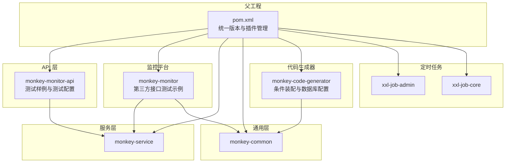
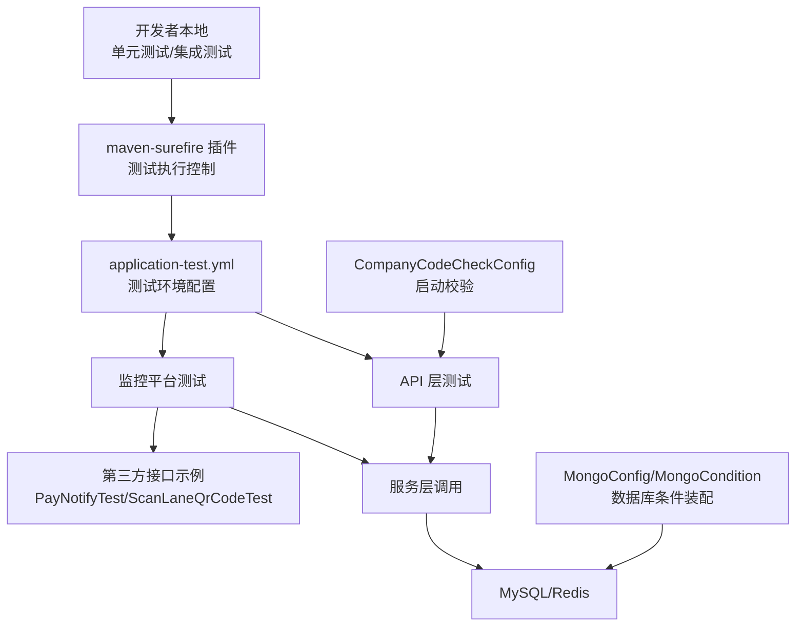
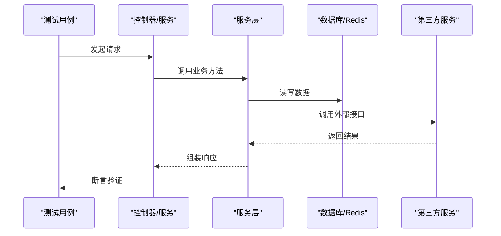
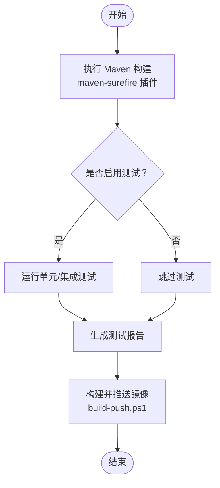
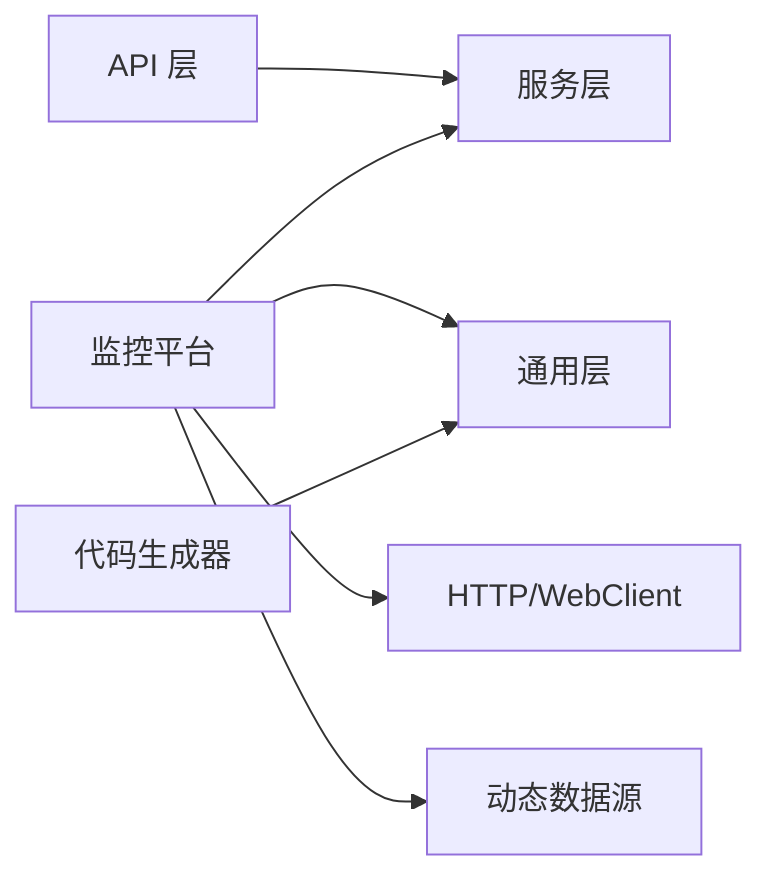

# 模块测试策略

<cite>
**本文引用的文件**   
- [pom.xml](file://pom.xml)
- [monkey-monitor-api/src/test/java/com/monkey/general/MonkeyMonitorApplicationTest.java](file://monkey-monitor-api/src/test/java/com/monkey/general/MonkeyMonitorApplicationTest.java)
- [monkey-monitor-api/src/main/resources/application-test.yml](file://monkey-monitor-api/src/main/resources/application-test.yml)
- [monkey-monitor/pom.xml](file://monkey-monitor/pom.xml)
- [monkey-monitor/src/main/java/com/monkey/general/modules/third/api/test/example/PayNotifyTest.java](file://monkey-monitor/src/main/java/com/monkey/general/modules/third/api/test/example/PayNotifyTest.java)
- [monkey-monitor/src/main/java/com/monkey/general/modules/third/api/test/example/ScanLaneQrCodeTest.java](file://monkey-monitor/src/main/java/com/monkey/general/modules/third/api/test/example/ScanLaneQrCodeTest.java)
- [deploy/build-push.ps1](file://deploy/build-push.ps1)
- [deploy/config/monitor-api/application-prod.yml](file://deploy/config/monitor-api/application-prod.yml)
- [monkey-code-generator/src/main/java/com/monkey/config/MongoCondition.java](file://monkey-code-generator/src/main/java/com/monkey/config/MongoCondition.java)
- [monkey-code-generator/src/main/java/com/monkey/config/MongoNullCondition.java](file://monkey-code-generator/src/main/java/com/monkey/config/MongoNullCondition.java)
- [monkey-code-generator/src/main/java/com/monkey/config/MongoConfig.java](file://monkey-code-generator/src/main/java/com/monkey/config/MongoConfig.java)
- [monkey-monitor/src/main/java/com/monkey/general/platform/push/gx/PushingGXDataService.java](file://monkey-monitor/src/main/java/com/monkey/general/platform/push/gx/PushingGXDataService.java)
- [monkey-monitor/src/main/java/com/monkey/general/modules/third/service/QingTianService.java](file://monkey-monitor/src/main/java/com/monkey/general/modules/third/service/QingTianService.java)
- [monkey-monitor-api/src/main/java/com/monkey/general/config/CompanyCodeCheckConfig.java](file://monkey-monitor-api/src/main/java/com/monkey/general/config/CompanyCodeCheckConfig.java)
</cite>

## 目录
1. [引言](#引言)
2. [项目结构](#项目结构)
3. [核心组件](#核心组件)
4. [架构总览](#架构总览)
5. [详细组件分析](#详细组件分析)
6. [依赖分析](#依赖分析)
7. [性能考虑](#性能考虑)
8. [故障排查指南](#故障排查指南)
9. [结论](#结论)
10. [附录](#附录)

## 引言
本指南面向安威 fireworks 平台的模块测试工作，系统化阐述单元测试、集成测试、自动化流程、测试数据管理、性能与压力测试、覆盖率统计与提升策略，并结合仓库现有配置与示例给出可落地的实践建议。文档同时提供可视化图示与“章节来源”标注，便于快速定位到具体实现与配置。

## 项目结构
该仓库采用 Maven 多模块结构，核心与监控相关模块如下：
- 父工程：统一版本与插件管理，包含 maven-surefire 插件配置用于测试执行控制
- monkey-monitor-api：对外 API 层，包含测试样例与测试环境配置
- monkey-monitor：监控平台业务层，包含第三方接口测试示例
- monkey-service：服务层，供上层调用
- monkey-common：通用工具与配置
- monkey-code-generator：代码生成器，包含条件装配与数据库配置
- xxl-job-*：定时任务相关模块

图表来源
- [pom.xml:11-16](file://pom.xml#L11-L16)
- [monkey-monitor-api/pom.xml](file://monkey-monitor-api/pom.xml)
- [monkey-monitor/pom.xml:1-103](file://monkey-monitor/pom.xml#L1-L103)
- [monkey-service/pom.xml:1-40](file://monkey-service/pom.xml#L1-L40)
- [monkey-common/pom.xml](file://monkey-common/pom.xml)
- [monkey-code-generator/pom.xml](file://monkey-code-generator/pom.xml)

章节来源
- [pom.xml:11-16](file://pom.xml#L11-L16)
- [pom.xml:194-218](file://pom.xml#L194-L218)

## 核心组件
- 测试框架与插件
  - 父工程通过 maven-surefire 插件统一管理测试生命周期，当前配置为跳过测试（可通过命令行或 CI 覆盖）
- 测试环境配置
  - API 层提供 application-test.yml，包含数据库、Redis、文件上传、第三方服务地址等测试环境参数
- 第三方接口测试示例
  - 提供 PayNotifyTest 与 ScanLaneQrCodeTest，演示对外接口调用与签名流程
- 条件装配与数据库配置
  - 代码生成器模块通过 MongoCondition/MongoNullCondition 控制 MongoDB 相关 Bean 的加载；MongoConfig 提供数据库连接配置入口
- 业务服务与校验
  - QingTianService 与 PushingGXDataService 展示对外服务调用与业务处理逻辑
  - CompanyCodeCheckConfig 在启动阶段进行企业编码校验，失败时终止应用

章节来源
- [pom.xml:208-216](file://pom.xml#L208-L216)
- [monkey-monitor-api/src/main/resources/application-test.yml:1-76](file://monkey-monitor-api/src/main/resources/application-test.yml#L1-L76)
- [monkey-monitor/src/main/java/com/monkey/general/modules/third/api/test/example/PayNotifyTest.java:1-121](file://monkey-monitor/src/main/java/com/monkey/general/modules/third/api/test/example/PayNotifyTest.java#L1-L121)
- [monkey-monitor/src/main/java/com/monkey/general/modules/third/api/test/example/ScanLaneQrCodeTest.java:1-50](file://monkey-monitor/src/main/java/com/monkey/general/modules/third/api/test/example/ScanLaneQrCodeTest.java#L1-L50)
- [monkey-code-generator/src/main/java/com/monkey/config/MongoCondition.java:10-17](file://monkey-code-generator/src/main/java/com/monkey/config/MongoCondition.java#L10-L17)
- [monkey-code-generator/src/main/java/com/monkey/config/MongoNullCondition.java:10-17](file://monkey-code-generator/src/main/java/com/monkey/config/MongoNullCondition.java#L10-L17)
- [monkey-code-generator/src/main/java/com/monkey/config/MongoConfig.java:41-89](file://monkey-code-generator/src/main/java/com/monkey/config/MongoConfig.java#L41-L89)
- [monkey-monitor/src/main/java/com/monkey/general/platform/push/gx/PushingGXDataService.java:1-71](file://monkey-monitor/src/main/java/com/monkey/general/platform/push/gx/PushingGXDataService.java#L1-L71)
- [monkey-monitor/src/main/java/com/monkey/general/modules/third/service/QingTianService.java:24-59](file://monkey-monitor/src/main/java/com/monkey/general/modules/third/service/QingTianService.java#L24-L59)
- [monkey-monitor-api/src/main/java/com/monkey/general/config/CompanyCodeCheckConfig.java:1-44](file://monkey-monitor-api/src/main/java/com/monkey/general/config/CompanyCodeCheckConfig.java#L1-L44)

## 架构总览
下图展示测试策略在各模块中的分布与交互：

图表来源
- [pom.xml:208-216](file://pom.xml#L208-L216)
- [monkey-monitor-api/src/main/resources/application-test.yml:1-76](file://monkey-monitor-api/src/main/resources/application-test.yml#L1-L76)
- [monkey-monitor/src/main/java/com/monkey/general/modules/third/api/test/example/PayNotifyTest.java:1-121](file://monkey-monitor/src/main/java/com/monkey/general/modules/third/api/test/example/PayNotifyTest.java#L1-L121)
- [monkey-monitor/src/main/java/com/monkey/general/modules/third/api/test/example/ScanLaneQrCodeTest.java:1-50](file://monkey-monitor/src/main/java/com/monkey/general/modules/third/api/test/example/ScanLaneQrCodeTest.java#L1-L50)
- [monkey-code-generator/src/main/java/com/monkey/config/MongoConfig.java:41-89](file://monkey-code-generator/src/main/java/com/monkey/config/MongoConfig.java#L41-L89)
- [monkey-monitor-api/src/main/java/com/monkey/general/config/CompanyCodeCheckConfig.java:1-44](file://monkey-monitor-api/src/main/java/com/monkey/general/config/CompanyCodeCheckConfig.java#L1-L44)

## 详细组件分析

### 单元测试编写方法
- 测试框架与断言
  - 当前 API 层存在基于 JUnit 的简单测试类，可作为单元测试起点
- 测试用例设计
  - 建议围绕服务层方法进行边界值、异常路径与正常路径覆盖
  - 使用条件装配模块（如 MongoConfig/MongoCondition）时，需通过环境变量或配置切换不同数据源以覆盖多场景
- Mock 对象使用
  - 对外依赖（如第三方接口、数据库、Redis）建议通过接口抽象与依赖注入，在测试中替换为 Mock 实现
- 断言验证
  - 使用断言验证返回值、异常抛出、状态码、日志输出等

章节来源
- [monkey-monitor-api/src/test/java/com/monkey/general/MonkeyMonitorApplicationTest.java:1-34](file://monkey-monitor-api/src/test/java/com/monkey/general/MonkeyMonitorApplicationTest.java#L1-L34)
- [monkey-code-generator/src/main/java/com/monkey/config/MongoCondition.java:10-17](file://monkey-code-generator/src/main/java/com/monkey/config/MongoCondition.java#L10-L17)
- [monkey-code-generator/src/main/java/com/monkey/config/MongoNullCondition.java:10-17](file://monkey-code-generator/src/main/java/com/monkey/config/MongoNullCondition.java#L10-L17)
- [monkey-code-generator/src/main/java/com/monkey/config/MongoConfig.java:41-89](file://monkey-code-generator/src/main/java/com/monkey/config/MongoConfig.java#L41-L89)

### 集成测试实施策略
- 模块间接口测试
  - 通过 application-test.yml 提供的数据库与 Redis 地址，验证 API 层到服务层的数据流转
- 数据库测试
  - 使用测试数据库实例，配合初始化 SQL 或测试专用 Schema，确保测试隔离与可重复性
- 外部服务测试
  - 利用第三方接口测试示例（PayNotifyTest/ScanLaneQrCodeTest）验证签名、请求与响应流程
  - 对真实第三方服务，建议在测试环境中使用沙箱或模拟服务

图表来源
- [monkey-monitor/src/main/java/com/monkey/general/modules/third/api/test/example/PayNotifyTest.java:1-121](file://monkey-monitor/src/main/java/com/monkey/general/modules/third/api/test/example/PayNotifyTest.java#L1-L121)
- [monkey-monitor/src/main/java/com/monkey/general/modules/third/api/test/example/ScanLaneQrCodeTest.java:1-50](file://monkey-monitor/src/main/java/com/monkey/general/modules/third/api/test/example/ScanLaneQrCodeTest.java#L1-L50)
- [monkey-monitor-api/src/main/resources/application-test.yml:1-76](file://monkey-monitor-api/src/main/resources/application-test.yml#L1-L76)

章节来源
- [monkey-monitor-api/src/main/resources/application-test.yml:1-76](file://monkey-monitor-api/src/main/resources/application-test.yml#L1-L76)
- [monkey-monitor/src/main/java/com/monkey/general/modules/third/api/test/example/PayNotifyTest.java:1-121](file://monkey-monitor/src/main/java/com/monkey/general/modules/third/api/test/example/PayNotifyTest.java#L1-L121)
- [monkey-monitor/src/main/java/com/monkey/general/modules/third/api/test/example/ScanLaneQrCodeTest.java:1-50](file://monkey-monitor/src/main/java/com/monkey/general/modules/third/api/test/example/ScanLaneQrCodeTest.java#L1-L50)

### 自动化测试流程（持续集成）
- 测试执行
  - 父工程已配置 maven-surefire 插件，可在 CI 中通过参数启用测试执行
- 构建与推送
  - build-push.ps1 支持按模块构建镜像并推送，可结合 CI 触发测试与打包流程
- 配置隔离
  - 生产配置与测试配置分离，避免测试污染生产环境

图表来源
- [pom.xml:208-216](file://pom.xml#L208-L216)
- [deploy/build-push.ps1:1-255](file://deploy/build-push.ps1#L1-L255)

章节来源
- [pom.xml:208-216](file://pom.xml#L208-L216)
- [deploy/build-push.ps1:1-255](file://deploy/build-push.ps1#L1-L255)

### 测试数据管理
- 测试数据准备
  - 使用 application-test.yml 中的数据库与 Redis 参数，准备最小化测试集
- 数据清理
  - 在测试前后执行清理脚本或事务回滚，保证测试幂等
- 环境隔离
  - 通过 profile 或环境变量切换测试/预发/生产配置，避免交叉污染

章节来源
- [monkey-monitor-api/src/main/resources/application-test.yml:1-76](file://monkey-monitor-api/src/main/resources/application-test.yml#L1-L76)

### 性能测试与压力测试
- 负载测试
  - 使用压测工具对 API 层进行并发请求，观察吞吐与延迟
- 并发测试
  - 验证服务层在高并发下的稳定性与锁竞争情况
- 资源消耗测试
  - 关注数据库连接池、Redis 连接数、线程池与 GC 行为

[本节为通用指导，无需特定文件来源]

### 测试覆盖率统计与分析
- 覆盖率工具
  - 建议引入 JaCoCo 或类似工具统计覆盖率
- 分析与改进
  - 结合条件装配（MongoCondition/MongoNullCondition）与外部依赖，补充缺失分支与异常路径的测试

章节来源
- [monkey-code-generator/src/main/java/com/monkey/config/MongoCondition.java:10-17](file://monkey-code-generator/src/main/java/com/monkey/config/MongoCondition.java#L10-L17)
- [monkey-code-generator/src/main/java/com/monkey/config/MongoNullCondition.java:10-17](file://monkey-code-generator/src/main/java/com/monkey/config/MongoNullCondition.java#L10-L17)

### 测试配置文件示例
- 测试环境配置
  - application-test.yml 提供数据库、Redis、文件上传、第三方服务地址等参数
- 生产配置
  - deploy/config/monitor-api/application-prod.yml 提供生产环境参数，用于对比与回归

章节来源
- [monkey-monitor-api/src/main/resources/application-test.yml:1-76](file://monkey-monitor-api/src/main/resources/application-test.yml#L1-L76)
- [deploy/config/monitor-api/application-prod.yml](file://deploy/config/monitor-api/application-prod.yml)

## 依赖分析
- 模块耦合
  - API 层依赖服务层；监控平台依赖通用层与服务层；代码生成器依赖通用层
- 外部依赖
  - 监控平台引入 HTTP 客户端、WebFlux、动态数据源等，影响测试策略（如网络与数据库）
- 条件装配
  - 通过 MongoCondition/MongoNullCondition 控制 MongoDB 相关 Bean 加载，测试时需切换配置以覆盖不同数据源

图表来源
- [monkey-monitor/pom.xml:20-101](file://monkey-monitor/pom.xml#L20-L101)
- [monkey-monitor-api/pom.xml](file://monkey-monitor-api/pom.xml)
- [monkey-service/pom.xml:1-40](file://monkey-service/pom.xml#L1-L40)
- [monkey-common/pom.xml](file://monkey-common/pom.xml)
- [monkey-code-generator/pom.xml](file://monkey-code-generator/pom.xml)

章节来源
- [monkey-monitor/pom.xml:20-101](file://monkey-monitor/pom.xml#L20-L101)
- [monkey-code-generator/src/main/java/com/monkey/config/MongoCondition.java:10-17](file://monkey-code-generator/src/main/java/com/monkey/config/MongoCondition.java#L10-L17)
- [monkey-code-generator/src/main/java/com/monkey/config/MongoNullCondition.java:10-17](file://monkey-code-generator/src/main/java/com/monkey/config/MongoNullCondition.java#L10-L17)

## 性能考虑
- 数据库连接池
  - 在测试配置中合理设置连接池大小，避免连接争用导致的性能瓶颈
- 缓存策略
  - Redis 开关与连接参数需在测试中验证，避免缓存穿透与雪崩
- 外部依赖
  - 对第三方接口调用增加超时与重试策略，测试中模拟慢响应与失败场景

[本节为通用指导，无需特定文件来源]

## 故障排查指南
- 启动校验失败
  - CompanyCodeCheckConfig 在企业编码缺失或占位值时会终止应用，检查配置文件与环境变量
- 测试无法执行
  - 父工程默认跳过测试，需在 CI 或本地显式启用测试执行
- 外部接口问题
  - 使用第三方接口测试示例验证签名与请求参数，逐步定位问题

章节来源
- [monkey-monitor-api/src/main/java/com/monkey/general/config/CompanyCodeCheckConfig.java:1-44](file://monkey-monitor-api/src/main/java/com/monkey/general/config/CompanyCodeCheckConfig.java#L1-L44)
- [pom.xml:212-215](file://pom.xml#L212-L215)
- [monkey-monitor/src/main/java/com/monkey/general/modules/third/api/test/example/PayNotifyTest.java:1-121](file://monkey-monitor/src/main/java/com/monkey/general/modules/third/api/test/example/PayNotifyTest.java#L1-L121)

## 结论
本指南基于仓库现有配置与示例，提出了覆盖单元测试、集成测试、自动化流程、测试数据管理、性能与压力测试以及覆盖率提升的系统化策略。建议在 CI 中启用测试执行，完善 Mock 与条件装配场景覆盖，并通过第三方接口测试示例建立对外依赖的回归能力。

## 附录
- 测试代码示例路径
  - [PayNotifyTest.java:1-121](file://monkey-monitor/src/main/java/com/monkey/general/modules/third/api/test/example/PayNotifyTest.java#L1-L121)
  - [ScanLaneQrCodeTest.java:1-50](file://monkey-monitor/src/main/java/com/monkey/general/modules/third/api/test/example/ScanLaneQrCodeTest.java#L1-L50)
  - [MonkeyMonitorApplicationTest.java:1-34](file://monkey-monitor-api/src/test/java/com/monkey/general/MonkeyMonitorApplicationTest.java#L1-L34)
- 测试配置文件路径
  - [application-test.yml:1-76](file://monkey-monitor-api/src/main/resources/application-test.yml#L1-L76)
  - [application-prod.yml](file://deploy/config/monitor-api/application-prod.yml)
- 构建与推送脚本
  - [build-push.ps1:1-255](file://deploy/build-push.ps1#L1-L255)