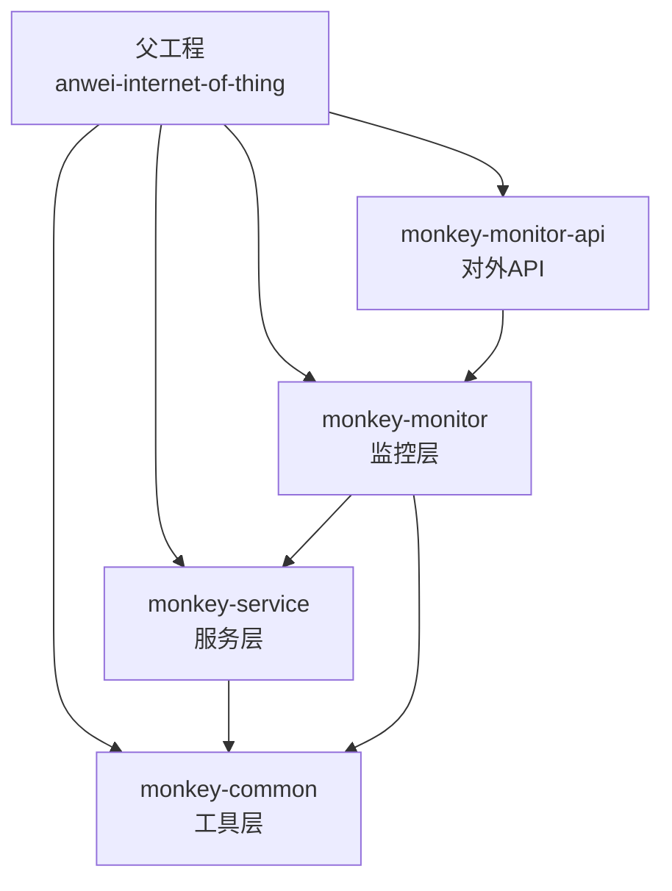
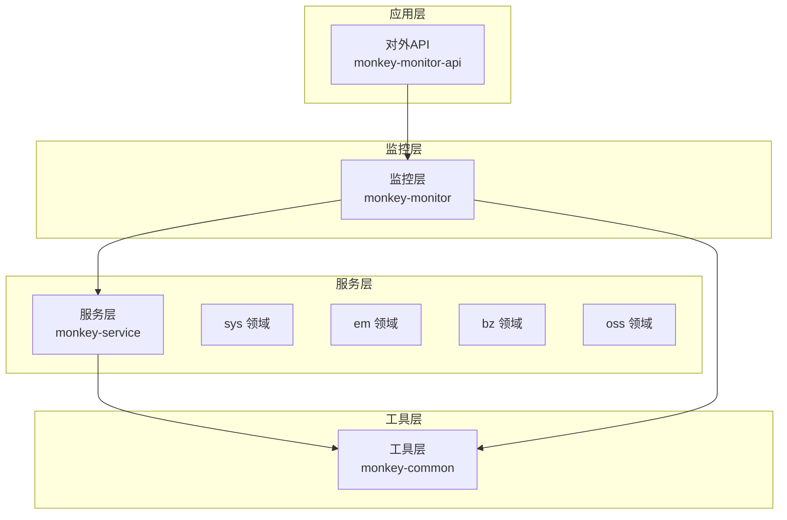
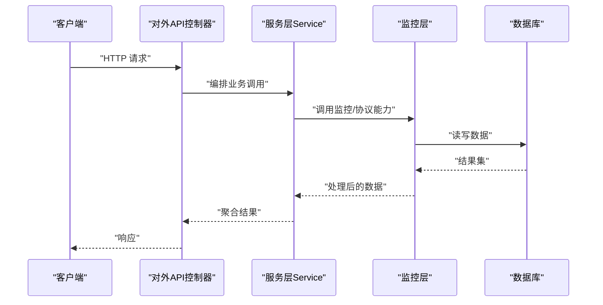
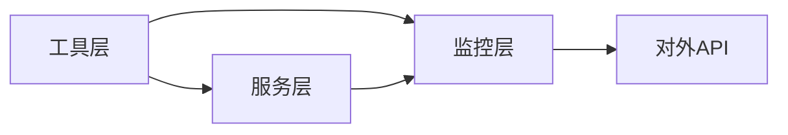

# 模块结构设计

<cite>
**本文引用的文件**
- [pom.xml](file://pom.xml)
- [monkey-service\pom.xml](file://monkey-service/pom.xml)
- [monkey-monitor\pom.xml](file://monkey-monitor/pom.xml)
- [monkey-monitor-api\pom.xml](file://monkey-monitor-api/pom.xml)
- [monkey-common\pom.xml](file://monkey-common/pom.xml)
- [application.yml](file://monkey-monitor-api/src/main/resources/application.yml)
- [application-prod.yml](file://deploy/config/monitor-api/application-prod.yml)
- [application-prod.properties](file://deploy/config/xxl-job-admin/application-prod.properties)
</cite>

## 目录
1. [简介](#简介)
2. [项目结构](#项目结构)
3. [核心组件](#核心组件)
4. [架构总览](#架构总览)
5. [详细组件分析](#详细组件分析)
6. [依赖分析](#依赖分析)
7. [性能考虑](#性能考虑)
8. [故障排查指南](#故障排查指南)
9. [结论](#结论)
10. [附录](#附录)

## 简介
本指南面向安威 fireworks 平台的模块化开发，系统性阐述标准模块结构与设计原则，覆盖包命名规范（bz、em、sys、oss 等）、标准目录组织（entity、mapper、service、controller、dto）、模块间依赖与接口边界、配置文件组织（application.yml、MyBatis 映射、日志）、以及模块生命周期管理（初始化到销毁）。文档以仓库现有结构为依据，结合 Maven 多模块工程的实际依赖关系，给出可落地的设计建议与最佳实践。

## 项目结构
安威 fireworks 采用 Maven 父子工程组织，顶层 pom 声明核心模块与版本管理，各子模块按职责拆分，形成“工具层 -> 服务层 -> 监控层 -> 监控 API 层”的分层架构。

- 顶层工程
  - 父 POM 统一版本与依赖管理，声明模块列表
- 子模块
  - monkey-common：通用工具与基础能力
  - monkey-service：服务层，承载业务域模块（bz、em、sys、oss 等）
  - monkey-monitor：监控与集成能力
  - monkey-monitor-api：对外 API 服务，打包可独立运行
  - monkey-code-generator：代码生成器（非本次主题）
  - xxl-job-*：定时任务相关模块（非本次主题）

图表来源
- [pom.xml:11-16](file://pom.xml#L11-L16)
- [monkey-service\pom.xml:21-26](file://monkey-service/pom.xml#L21-L26)
- [monkey-monitor\pom.xml:21-30](file://monkey-monitor/pom.xml#L21-L30)
- [monkey-monitor-api\pom.xml:21-25](file://monkey-monitor-api/pom.xml#L21-L25)

章节来源
- [pom.xml:11-16](file://pom.xml#L11-L16)
- [pom.xml:65-101](file://pom.xml#L65-L101)

## 核心组件
- 工具层（monkey-common）
  - 职责：提供通用工具、常量、枚举、异常、校验、Excel、短信、二维码、XSS 过滤、异步配置等
  - 依赖：Web、MyBatis Plus、OpenFeign、Swagger 等
- 服务层（monkey-service）
  - 职责：业务域模块的统一承载，按领域划分包（bz、em、sys、oss 等），提供 entity、mapper、service、dto
  - 依赖：工具层、MySQL、Redis、OSS SDK、MQTT、JSoup
- 监控层（monkey-monitor）
  - 职责：设备协议接入、MQTT 配置、多数据源、WebSocket、WebFlux、HTTP 客户端等
  - 依赖：工具层、服务层、DOM4J、HTTP 客户端、JNA 示例、动态数据源
- 对外 API（monkey-monitor-api）
  - 职责：对外暴露 REST API，整合定时任务（XXL-Job）与监控能力
  - 依赖：监控层、XXL-Job Core、Spring Boot 插件打包

章节来源
- [monkey-common\pom.xml:20-160](file://monkey-common/pom.xml#L20-L160)
- [monkey-service\pom.xml:20-88](file://monkey-service/pom.xml#L20-L88)
- [monkey-monitor\pom.xml:20-101](file://monkey-monitor/pom.xml#L20-L101)
- [monkey-monitor-api\pom.xml:20-32](file://monkey-monitor-api/pom.xml#L20-L32)

## 架构总览
下图展示模块间依赖关系与数据流方向，强调“工具层”为所有业务模块提供基础能力，“服务层”承载业务域模块，“监控层”负责设备与协议接入，“对外 API”提供统一入口。

图表来源
- [monkey-monitor-api\pom.xml:21-25](file://monkey-monitor-api/pom.xml#L21-L25)
- [monkey-monitor\pom.xml:21-30](file://monkey-monitor/pom.xml#L21-L30)
- [monkey-service\pom.xml:21-26](file://monkey-service/pom.xml#L21-L26)

## 详细组件分析

### 包命名规范与用途
- bz：业务域（如文章、客户、城市等），典型包含 entity、mapper、service、dto
- em：事件/设备管理域（如设备、告警、订单等），典型包含 entity、mapper、service、dto
- sys：系统域（用户、菜单、角色、配置、日志等），典型包含 entity、mapper、service、dto
- oss：对象存储域（云厂商适配、实体、服务、映射），典型包含 cloud、entity、mapper、service
- data/open/rd/sd：数据同步、开放接口、研发、运营日志等，按职责细分

章节来源
- [monkey-service\src\main\resources\mapper\bz](file://monkey-service/src/main/resources/mapper/bz)
- [monkey-service\src\main\resources\mapper\em](file://monkey-service/src/main/resources/mapper/em)
- [monkey-service\src\main\resources\mapper\sys](file://monkey-service/src/main/resources/mapper/sys)
- [monkey-service\src\main\resources\mapper\oss](file://monkey-service/src/main/resources/mapper/oss)

### 标准目录结构与职责
- entity：持久化实体，遵循 MyBatis-Plus 类型别名扫描规则
- mapper：XML 映射文件，按模块分目录存放
- service：业务服务接口与实现
- controller：对外接口控制器
- dto：传输对象，用于接口入参与响应
- config：Spring 配置类（如 MyBatis Plus、Redis、过滤器等）
- handler：MyBatis 元对象处理器、类型处理器等
- enums/constant：枚举与常量
- utils：工具类
- redis（sys 专属）：Redis 相关封装

章节来源
- [application.yml:14-39](file://monkey-monitor-api/src/main/resources/application.yml#L14-L39)
- [application-prod.yml:4-26](file://deploy/config/monitor-api/application-prod.yml#L4-L26)

### 模块间依赖与接口边界
- 低耦合高内聚：各业务域模块内部闭环，通过服务层统一暴露能力
- 依赖方向：监控层依赖服务层与工具层；对外 API 依赖监控层
- 接口边界：controller 仅编排 service，service 仅编排 mapper 与工具层，避免跨模块直接调用

图表来源
- [monkey-monitor-api\pom.xml:21-25](file://monkey-monitor-api/pom.xml#L21-L25)
- [monkey-monitor\pom.xml:21-30](file://monkey-monitor/pom.xml#L21-L30)

### 配置文件组织
- application.yml（对外 API）
  - MyBatis-Plus：mapper 扫描路径、实体别名包、逻辑删除、元对象处理器
  - Jackson：时区与日期格式
- application-prod.yml（生产环境）
  - 数据源、Redis、MQTT、WebSocket、定时任务（XXL-Job）等
- 日志与资源
  - logback-spring.xml（对外 API 资源目录）
  - XXL-Job Admin 使用 application-prod.properties 管理数据源与线程池

章节来源
- [application.yml:14-39](file://monkey-monitor-api/src/main/resources/application.yml#L14-L39)
- [application-prod.yml:4-26](file://deploy/config/monitor-api/application-prod.yml#L4-L26)
- [application-prod.properties:25-41](file://deploy/config/xxl-job-admin/application-prod.properties#L25-L41)

### 生命周期管理
- 初始化
  - Spring Boot 启动，加载 application.yml 与激活环境配置
  - 初始化 MyBatis-Plus、Redis、MQTT、WebSocket、定时任务等组件
- 运行
  - 对外 API 提供 HTTP 接口；监控层处理设备协议与数据同步
- 销毁
  - 注册 Spring Shutdown Listener，在应用关闭前释放连接、停止任务

章节来源
- [application.yml:1-40](file://monkey-monitor-api/src/main/resources/application.yml#L1-L40)
- [application-prod.yml:116-134](file://deploy/config/monitor-api/application-prod.yml#L116-L134)

## 依赖分析
- 依赖方向
  - 服务层依赖工具层
  - 监控层依赖服务层与工具层
  - 对外 API 依赖监控层
- 循环依赖规避
  - 严格禁止模块间反向依赖；如需共享，抽象到工具层或通过接口约束
- 外部依赖
  - MySQL、Redis、MQTT、XXL-Job、OSS SDK、JSoup、动态数据源等

图表来源
- [monkey-common\pom.xml:20-160](file://monkey-common/pom.xml#L20-L160)
- [monkey-service\pom.xml:21-26](file://monkey-service/pom.xml#L21-L26)
- [monkey-monitor\pom.xml:21-30](file://monkey-monitor/pom.xml#L21-L30)
- [monkey-monitor-api\pom.xml:21-25](file://monkey-monitor-api/pom.xml#L21-L25)

章节来源
- [pom.xml:65-101](file://pom.xml#L65-L101)

## 性能考虑
- 数据访问
  - 合理使用 MyBatis-Plus 分页与查询构造器，避免 N+1 查询
  - 逻辑删除与全局填充减少冗余字段与重复处理
- 缓存策略
  - Redis 缓存热点数据，注意失效策略与并发一致性
- 异步与并发
  - 利用异步配置与线程池，合理拆分耗时任务
- 网络与协议
  - MQTT/WS/WebFlux 的连接池与超时配置，避免阻塞
- 定时任务
  - XXL-Job 执行器端口与日志路径规划，避免磁盘与网络瓶颈

## 故障排查指南
- 配置问题
  - 确认 application.yml 与环境配置文件（如 application-prod.yml）一致
  - 校验 MyBatis-Plus mapper 扫描路径与实体别名包
- 数据源与连接池
  - 检查数据源 URL、账号密码与连接池参数
- 设备与协议
  - MQTT/WS 地址、鉴权与超时配置；WebSocket 地址可达性
- 定时任务
  - XXL-Job Admin 地址与执行器注册信息；日志路径权限

章节来源
- [application.yml:14-39](file://monkey-monitor-api/src/main/resources/application.yml#L14-L39)
- [application-prod.yml:4-26](file://deploy/config/monitor-api/application-prod.yml#L4-L26)
- [application-prod.properties:25-41](file://deploy/config/xxl-job-admin/application-prod.properties#L25-L41)

## 结论
安威 fireworks 平台通过清晰的模块分层与严格的依赖边界，实现了业务域的可扩展与可维护性。遵循本文的模块结构设计与配置组织建议，可在保证低耦合的前提下快速迭代新功能，并确保系统在高并发与复杂协议场景下的稳定性。

## 附录
- 实际示例（以路径代替代码片段）
  - 对外 API 配置示例：[application.yml:1-40](file://monkey-monitor-api/src/main/resources/application.yml#L1-L40)
  - 生产环境配置示例：[application-prod.yml:1-203](file://deploy/config/monitor-api/application-prod.yml#L1-L203)
  - XXL-Job Admin 配置示例：[application-prod.properties:1-66](file://deploy/config/xxl-job-admin/application-prod.properties#L1-L66)
  - 服务层依赖工具层示例：[monkey-service\pom.xml:21-26](file://monkey-service/pom.xml#L21-L26)
  - 监控层依赖服务层示例：[monkey-monitor\pom.xml:21-30](file://monkey-monitor/pom.xml#L21-L30)
  - 对外 API 依赖监控层示例：[monkey-monitor-api\pom.xml:21-25](file://monkey-monitor-api/pom.xml#L21-L25)