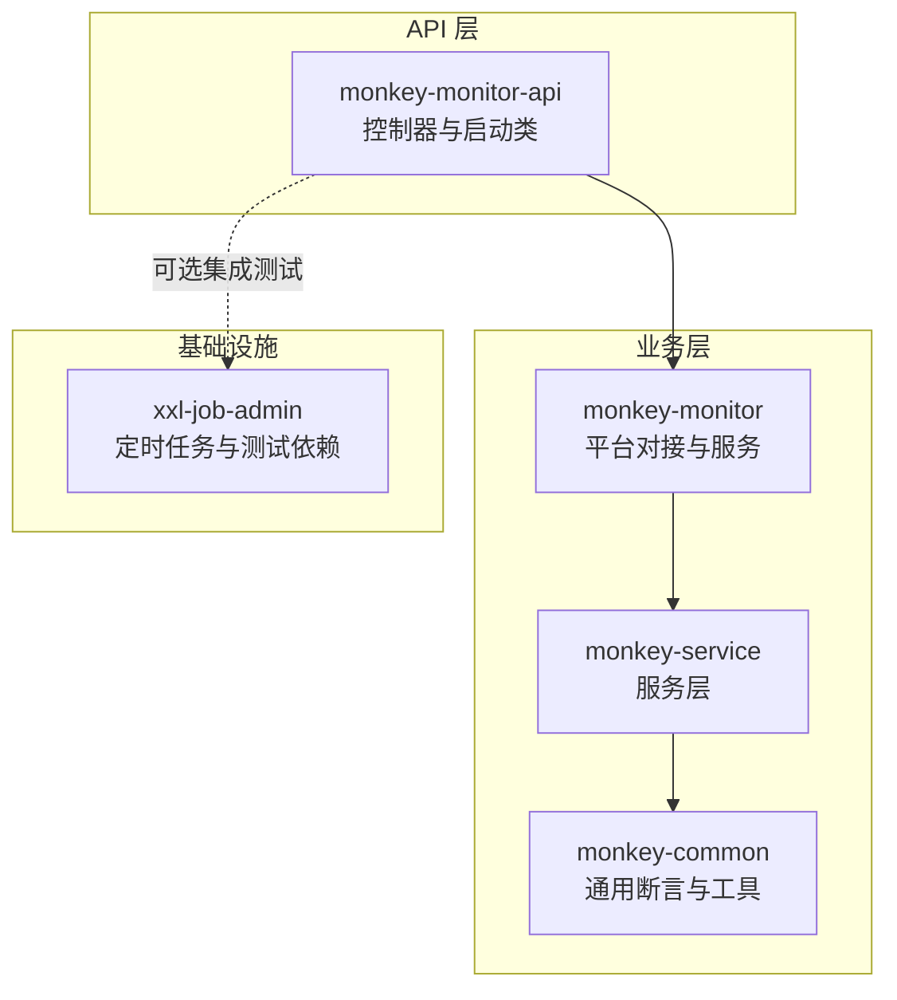
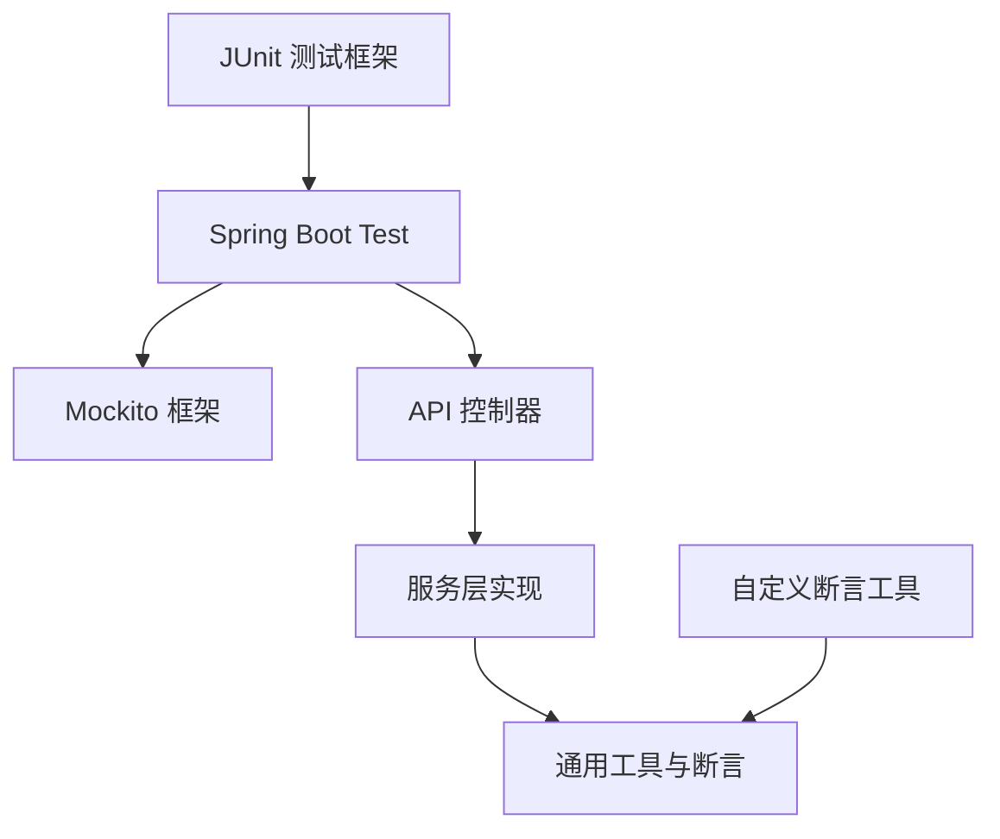
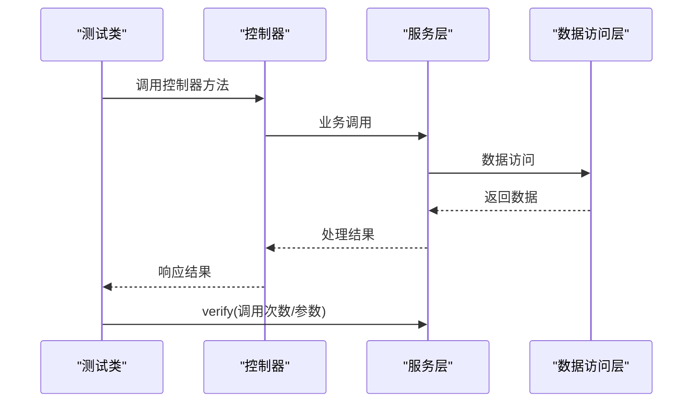
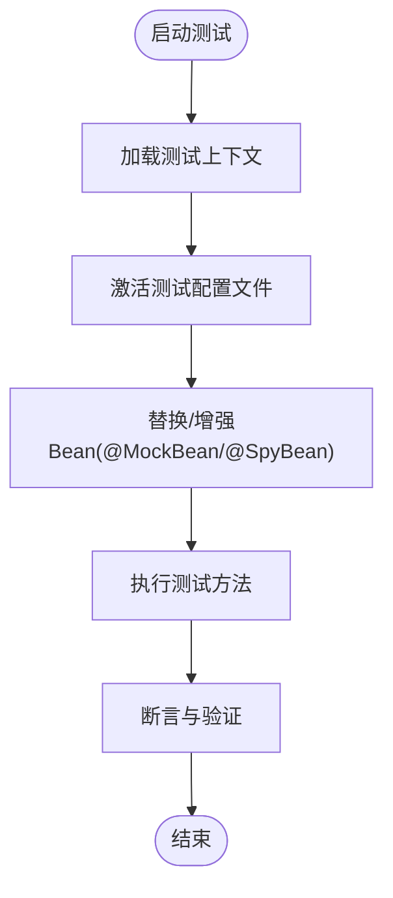
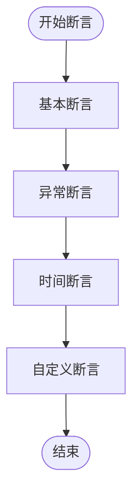
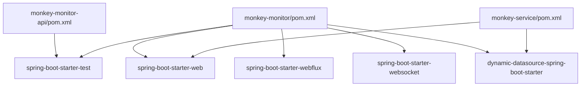

# 单元测试

<cite>
**本文引用的文件**
- [monkey-monitor-api/src/test/java/com/monkey/general/MonkeyMonitorApplicationTest.java](file://monkey-monitor-api/src/test/java/com/monkey/general/MonkeyMonitorApplicationTest.java)
- [monkey-monitor-api/src/main/resources/application.yml](file://monkey-monitor-api/src/main/resources/application.yml)
- [monkey-monitor-api/src/main/java/com/monkey/general/MonkeyMonitorApplication.java](file://monkey-monitor-api/src/main/java/com/monkey/general/MonkeyMonitorApplication.java)
- [monkey-monitor-api/pom.xml](file://monkey-monitor-api/pom.xml)
- [monkey-monitor/pom.xml](file://monkey-monitor/pom.xml)
- [monkey-service/pom.xml](file://monkey-service/pom.xml)
- [monkey-common/src/main/java/com/monkey/general/common/validator/MonkeyAssert.java](file://monkey-common/src/main/java/com/monkey/general/common/validator/MonkeyAssert.java)
- [monkey-monitor/src/main/java/com/monkey/general/platform/push/gx/PushingGXDataService.java](file://monkey-monitor/src/main/java/com/monkey/general/platform/push/gx/PushingGXDataService.java)
- [monkey-monitor/src/main/java/com/monkey/general/modules/third/api/test/example/getCarInfoTest.java](file://monkey-monitor/src/main/java/com/monkey/general/modules/third/api/test/example/getCarInfoTest.java)
- [monkey-monitor/src/main/java/com/monkey/general/modules/third/api/test/example/PayNotifyTest.java](file://monkey-monitor/src/main/java/com/monkey/general/modules/third/api/test/example/PayNotifyTest.java)
- [monkey-monitor/src/main/java/com/monkey/general/modules/third/api/test/example/ScanLaneQrCodeTest.java](file://monkey-monitor/src/main/java/com/monkey/general/modules/third/api/test/example/ScanLaneQrCodeTest.java)
- [monkey-monitor/src/main/java/com/monkey/general/modules/third/api/test/example/getLaneInfoListTest.java](file://monkey-monitor/src/main/java/com/monkey/general/modules/third/api/test/example/getLaneInfoListTest.java)
- [monkey-monitor/src/main/java/com/monkey/general/config/MyDataSourceAutoConfiguration.java](file://monkey-monitor/src/main/java/com/monkey/general/config/MyDataSourceAutoConfiguration.java)
- [monkey-common/src/main/java/com/monkey/general/common/config/ApplicationConfig.java](file://monkey-common/src/main/java/com/monkey/general/common/config/ApplicationConfig.java)
- [xxl-job-admin/pom.xml](file://xxl-job-admin/pom.xml)
</cite>

## 目录
1. [简介](#简介)
2. [项目结构](#项目结构)
3. [核心组件](#核心组件)
4. [架构总览](#架构总览)
5. [详细组件分析](#详细组件分析)
6. [依赖分析](#依赖分析)
7. [性能考虑](#性能考虑)
8. [故障排查指南](#故障排查指南)
9. [结论](#结论)
10. [附录](#附录)

## 简介
本指南面向安威 fireworks 物联网监控平台的单元测试实践，围绕 JUnit 测试框架配置与使用、Mockito 在单元测试中的应用、Spring Boot Test 的集成方式、断言策略、测试数据准备与清理、以及最佳实践与常见问题进行系统性说明。文档结合仓库中现有模块与依赖，给出可操作的测试设计思路与落地建议。

## 项目结构
- 平台由多模块组成，其中与测试直接相关的关键模块包括：
  - monkey-monitor-api：对外 API 层，包含控制器与启动入口，适合进行集成测试与端到端测试。
  - monkey-monitor：业务处理与平台对接模块，包含大量服务与配置，适合进行服务层与数据访问层测试。
  - monkey-service：服务层模块，包含业务逻辑与数据访问依赖，适合进行服务层单元测试。
  - monkey-common：通用工具与断言类，适合抽取断言与工具方法。
  - xxl-job-admin：定时任务管理模块，包含测试依赖，可作为 Spring Boot Test 示例参考。

**图表来源**
- [monkey-monitor-api/src/main/java/com/monkey/general/MonkeyMonitorApplication.java:1-20](file://monkey-monitor-api/src/main/java/com/monkey/general/MonkeyMonitorApplication.java#L1-L20)
- [monkey-monitor-api/src/main/resources/application.yml:1-40](file://monkey-monitor-api/src/main/resources/application.yml#L1-L40)
- [monkey-monitor/pom.xml:1-103](file://monkey-monitor/pom.xml#L1-L103)
- [monkey-service/pom.xml:1-40](file://monkey-service/pom.xml#L1-L40)
- [monkey-common/src/main/java/com/monkey/general/common/validator/MonkeyAssert.java:49-73](file://monkey-common/src/main/java/com/monkey/general/common/validator/MonkeyAssert.java#L49-L73)
- [xxl-job-admin/pom.xml:37-72](file://xxl-job-admin/pom.xml#L37-L72)

**章节来源**
- [monkey-monitor-api/pom.xml:1-59](file://monkey-monitor-api/pom.xml#L1-L59)
- [monkey-monitor/pom.xml:1-103](file://monkey-monitor/pom.xml#L1-L103)
- [monkey-service/pom.xml:1-40](file://monkey-service/pom.xml#L1-L40)
- [monkey-common/src/main/java/com/monkey/general/common/validator/MonkeyAssert.java:49-73](file://monkey-common/src/main/java/com/monkey/general/common/validator/MonkeyAssert.java#L49-L73)
- [xxl-job-admin/pom.xml:37-72](file://xxl-job-admin/pom.xml#L37-L72)

## 核心组件
- 测试框架与依赖
  - JUnit：基础测试框架，仓库中存在 JUnit 测试样例。
  - Spring Boot Test：通过 spring-boot-starter-test 提供测试支持。
  - Mockito：用于创建 Mock 对象、模拟行为与验证调用。
- 断言与工具
  - 自定义断言工具类，便于在业务场景中进行断言封装。
- 配置与启动
  - 应用启动类与配置文件，为测试环境提供基础运行上下文。

**章节来源**
- [monkey-monitor-api/src/test/java/com/monkey/general/MonkeyMonitorApplicationTest.java:1-34](file://monkey-monitor-api/src/test/java/com/monkey/general/MonkeyMonitorApplicationTest.java#L1-L34)
- [monkey-monitor-api/pom.xml:1-59](file://monkey-monitor-api/pom.xml#L1-L59)
- [monkey-monitor/pom.xml:1-103](file://monkey-monitor/pom.xml#L1-L103)
- [monkey-common/src/main/java/com/monkey/general/common/validator/MonkeyAssert.java:49-73](file://monkey-common/src/main/java/com/monkey/general/common/validator/MonkeyAssert.java#L49-L73)
- [monkey-monitor-api/src/main/resources/application.yml:1-40](file://monkey-monitor-api/src/main/resources/application.yml#L1-L40)

## 架构总览
下图展示测试在各模块中的位置与交互关系，突出 API 层控制器、业务层服务与通用断言工具之间的协作。

**图表来源**
- [monkey-monitor-api/src/test/java/com/monkey/general/MonkeyMonitorApplicationTest.java:1-34](file://monkey-monitor-api/src/test/java/com/monkey/general/MonkeyMonitorApplicationTest.java#L1-L34)
- [monkey-monitor-api/src/main/java/com/monkey/general/MonkeyMonitorApplication.java:1-20](file://monkey-monitor-api/src/main/java/com/monkey/general/MonkeyMonitorApplication.java#L1-L20)
- [monkey-common/src/main/java/com/monkey/general/common/validator/MonkeyAssert.java:49-73](file://monkey-common/src/main/java/com/monkey/general/common/validator/MonkeyAssert.java#L49-L73)

## 详细组件分析

### 测试类组织与命名规范
- 组织结构
  - 建议按模块划分测试包，例如：模块名 + test/java 下按功能域进一步细分。
  - 测试类以被测类名 + Test 或 Spec 结尾，便于识别与定位。
- 命名规范
  - 方法命名采用“行为_场景_期望”的结构，如 testCreateDevice_Success。
  - 使用语义化描述，避免缩写，确保测试意图清晰。

**章节来源**
- [monkey-monitor-api/src/test/java/com/monkey/general/MonkeyMonitorApplicationTest.java:1-34](file://monkey-monitor-api/src/test/java/com/monkey/general/MonkeyMonitorApplicationTest.java#L1-L34)

### 注解与生命周期
- 常用注解
  - @Test：标记测试方法。
  - @BeforeEach/@AfterEach：准备与清理测试环境。
  - @ExtendWith(MockitoExtension.class)：启用 Mockito 扩展。
  - @SpringBootTest：加载完整或部分上下文，进行集成测试。
  - @WebMvcTest：仅加载 Web MVC 层，适合控制器测试。
  - @MockBean/@SpyBean：替换或增强上下文中已有 Bean。
- 生命周期
  - 在 @BeforeEach 中注入依赖、初始化测试数据；在 @AfterEach 清理资源，保证测试隔离。

**章节来源**
- [monkey-monitor-api/pom.xml:1-59](file://monkey-monitor-api/pom.xml#L1-L59)
- [monkey-monitor/pom.xml:1-103](file://monkey-monitor/pom.xml#L1-L103)

### Mockito 在单元测试中的应用
- 创建 Mock 对象
  - 使用 @Mock 注解创建 Mock 实例，用于隔离外部依赖。
- 定义模拟行为
  - 使用 when(...).thenReturn(...) 指定返回值；使用 doThrow(...) 指定异常。
- 验证方法调用
  - 使用 verify(...) 验证是否被调用、调用次数与参数匹配。
- 与 Spring Boot Test 集成
  - 使用 @MockBean 替换真实 Bean，确保测试可控且稳定。

**图表来源**
- [monkey-monitor/src/main/java/com/monkey/general/platform/push/gx/PushingGXDataService.java:32-71](file://monkey-monitor/src/main/java/com/monkey/general/platform/push/gx/PushingGXDataService.java#L32-L71)

**章节来源**
- [monkey-monitor/src/main/java/com/monkey/general/platform/push/gx/PushingGXDataService.java:32-71](file://monkey-monitor/src/main/java/com/monkey/general/platform/push/gx/PushingGXDataService.java#L32-L71)

### Spring Boot Test 集成
- @SpringBootTest
  - 加载完整应用上下文，适合端到端测试与集成测试。
  - 可通过 @ActiveProfiles 指定测试配置文件，隔离数据库与外部依赖。
- @WebMvcTest
  - 仅加载 Web MVC 层，适合控制器测试，减少无关依赖。
- @MockBean/@SpyBean
  - 替换或增强上下文中的 Bean，便于控制外部依赖。
- 测试配置
  - 在 application.yml 中配置测试专用属性，如数据库连接、日志级别等。

**图表来源**
- [monkey-monitor-api/src/main/resources/application.yml:1-40](file://monkey-monitor-api/src/main/resources/application.yml#L1-L40)
- [monkey-monitor-api/src/main/java/com/monkey/general/MonkeyMonitorApplication.java:1-20](file://monkey-monitor-api/src/main/java/com/monkey/general/MonkeyMonitorApplication.java#L1-L20)

**章节来源**
- [monkey-monitor-api/src/main/resources/application.yml:1-40](file://monkey-monitor-api/src/main/resources/application.yml#L1-L40)
- [monkey-monitor-api/src/main/java/com/monkey/general/MonkeyMonitorApplication.java:1-20](file://monkey-monitor-api/src/main/java/com/monkey/general/MonkeyMonitorApplication.java#L1-L20)

### 控制器测试示例
- 目标
  - 验证控制器对请求的处理、参数校验、响应状态与内容。
- 设计要点
  - 使用 @WebMvcTest 加载控制器层。
  - 使用 @MockBean 注入服务层依赖，模拟业务逻辑。
  - 使用 MockMvc 进行请求模拟与断言。
- 示例路径
  - 参考控制器示例：[TestDanMaiController:1-24](file://monkey-monitor-api/src/main/java/com/monkey/general/controller/TestDanMaiController.java#L1-L24)

**章节来源**
- [monkey-monitor-api/src/main/java/com/monkey/general/controller/TestDanMaiController.java:1-24](file://monkey-monitor-api/src/main/java/com/monkey/general/controller/TestDanMaiController.java#L1-L24)

### 服务层测试示例
- 目标
  - 验证服务层业务逻辑正确性，覆盖正常流程与异常分支。
- 设计要点
  - 使用 @ExtendWith(MockitoExtension.class) 启用 Mockito。
  - 使用 @InjectMocks 创建被测服务实例，@Mock 注入依赖。
  - 使用 @BeforeEach 准备测试数据与上下文。
- 示例路径
  - 服务层示例：[PushingGXDataService:32-71](file://monkey-monitor/src/main/java/com/monkey/general/platform/push/gx/PushingGXDataService.java#L32-L71)

**章节来源**
- [monkey-monitor/src/main/java/com/monkey/general/platform/push/gx/PushingGXDataService.java:32-71](file://monkey-monitor/src/main/java/com/monkey/general/platform/push/gx/PushingGXDataService.java#L32-L71)

### 数据访问层测试示例
- 目标
  - 验证 Mapper/Repository 的查询与更新逻辑，确保 SQL 正确性与事务边界。
- 设计要点
  - 使用 @ExtendWith(MockitoExtension.class) 与 @MockBean 替换数据源或连接。
  - 使用 @Sql/@Transactional 管理测试数据与回滚。
  - 使用 @TestPropertySource 指定测试数据库连接。
- 示例路径
  - 数据源配置示例：[MyDataSourceAutoConfiguration:34-50](file://monkey-monitor/src/main/java/com/monkey/general/config/MyDataSourceAutoConfiguration.java#L34-L50)

**章节来源**
- [monkey-monitor/src/main/java/com/monkey/general/config/MyDataSourceAutoConfiguration.java:34-50](file://monkey-monitor/src/main/java/com/monkey/general/config/MyDataSourceAutoConfiguration.java#L34-L50)

### 断言使用方法
- 基本断言
  - assertEquals、assertTrue、assertThat 等，用于验证结果与预期一致。
- 异常断言
  - 使用 assertThrows 验证方法抛出特定异常。
- 时间断言
  - 使用 awaitility 或自定义等待机制，验证异步任务完成时间。
- 自定义断言
  - 利用自定义断言工具类，统一断言风格与错误信息。

**图表来源**
- [monkey-common/src/main/java/com/monkey/general/common/validator/MonkeyAssert.java:49-73](file://monkey-common/src/main/java/com/monkey/general/common/validator/MonkeyAssert.java#L49-L73)

**章节来源**
- [monkey-common/src/main/java/com/monkey/general/common/validator/MonkeyAssert.java:49-73](file://monkey-common/src/main/java/com/monkey/general/common/validator/MonkeyAssert.java#L49-L73)

### 测试数据准备与清理
- 测试夹具
  - 使用 @BeforeEach 初始化测试数据，确保每个测试独立。
- 临时数据管理
  - 使用内存数据库或测试专用表，避免污染生产数据。
- 清理策略
  - 使用 @AfterEach 或 @DirtiesContext 清理上下文，确保测试隔离。

**章节来源**
- [monkey-monitor-api/src/main/resources/application.yml:1-40](file://monkey-monitor-api/src/main/resources/application.yml#L1-L40)

### 最佳实践与常见问题
- 最佳实践
  - 小而精的测试：每个测试只验证一个行为。
  - 明确的断言：断言应明确表达期望，避免模糊判断。
  - 隔离外部依赖：使用 @MockBean 与 @SpyBean 替换外部系统。
  - 配置隔离：使用测试配置文件与随机端口，避免冲突。
- 常见问题
  - 上下文加载失败：检查 @SpringBootTest 的类与配置文件。
  - Mock 不生效：确认 @MockBean 注入的 Bean 名称与类型一致。
  - 数据库冲突：使用测试专用库与回滚策略。

**章节来源**
- [monkey-monitor-api/src/main/resources/application.yml:1-40](file://monkey-monitor-api/src/main/resources/application.yml#L1-L40)
- [monkey-monitor-api/src/main/java/com/monkey/general/MonkeyMonitorApplication.java:1-20](file://monkey-monitor-api/src/main/java/com/monkey/general/MonkeyMonitorApplication.java#L1-L20)

## 依赖分析
- 测试相关依赖
  - spring-boot-starter-test：提供 JUnit、Spring Test 与 Mockito。
  - web、webflux、websocket：用于 Web 层测试。
  - dynamic-datasource-spring-boot-starter：多数据源测试支持。
- 依赖关系图

**图表来源**
- [monkey-monitor-api/pom.xml:1-59](file://monkey-monitor-api/pom.xml#L1-L59)
- [monkey-monitor/pom.xml:1-103](file://monkey-monitor/pom.xml#L1-L103)
- [monkey-service/pom.xml:1-40](file://monkey-service/pom.xml#L1-L40)

**章节来源**
- [monkey-monitor-api/pom.xml:1-59](file://monkey-monitor-api/pom.xml#L1-L59)
- [monkey-monitor/pom.xml:1-103](file://monkey-monitor/pom.xml#L1-L103)
- [monkey-service/pom.xml:1-40](file://monkey-service/pom.xml#L1-L40)

## 性能考虑
- 测试隔离：避免共享状态，减少测试间耦合。
- 快速断言：优先使用简单断言，避免复杂计算。
- 外部依赖最小化：通过 Mock 与内存数据库提升执行速度。
- 并行执行：合理拆分测试，利用 CI 并行加速。

## 故障排查指南
- 启动失败
  - 检查启动类与配置文件，确保端口与环境变量正确。
  - 参考启动类示例：[MonkeyMonitorApplication:1-20](file://monkey-monitor-api/src/main/java/com/monkey/general/MonkeyMonitorApplication.java#L1-L20)
- 配置问题
  - 检查 application.yml 中的 profile 与数据库配置。
  - 参考配置示例：[application.yml:1-40](file://monkey-monitor-api/src/main/resources/application.yml#L1-L40)
- 断言失败
  - 使用自定义断言工具统一错误信息，便于定位。
  - 参考断言工具：[MonkeyAssert:49-73](file://monkey-common/src/main/java/com/monkey/general/common/validator/MonkeyAssert.java#L49-L73)

**章节来源**
- [monkey-monitor-api/src/main/java/com/monkey/general/MonkeyMonitorApplication.java:1-20](file://monkey-monitor-api/src/main/java/com/monkey/general/MonkeyMonitorApplication.java#L1-L20)
- [monkey-monitor-api/src/main/resources/application.yml:1-40](file://monkey-monitor-api/src/main/resources/application.yml#L1-L40)
- [monkey-common/src/main/java/com/monkey/general/common/validator/MonkeyAssert.java:49-73](file://monkey-common/src/main/java/com/monkey/general/common/validator/MonkeyAssert.java#L49-L73)

## 结论
通过合理组织测试类、规范命名与注解使用、结合 Mockito 与 Spring Boot Test，可以在安威 fireworks 物联网监控平台中构建高可靠、易维护的单元测试体系。配合自定义断言与测试数据管理策略，能够有效提升测试效率与质量。

## 附录
- 示例测试类
  - JUnit 示例：[MonkeyMonitorApplicationTest:1-34](file://monkey-monitor-api/src/test/java/com/monkey/general/MonkeyMonitorApplicationTest.java#L1-L34)
- 示例控制器
  - 控制器示例：[TestDanMaiController:1-24](file://monkey-monitor-api/src/main/java/com/monkey/general/controller/TestDanMaiController.java#L1-L24)
- 示例第三方接口测试
  - 第三方接口测试示例：[getCarInfoTest:1-95](file://monkey-monitor/src/main/java/com/monkey/general/modules/third/api/test/example/getCarInfoTest.java#L1-L95)、[PayNotifyTest:1-38](file://monkey-monitor/src/main/java/com/monkey/general/modules/third/api/test/example/PayNotifyTest.java#L1-L38)、[ScanLaneQrCodeTest:1-37](file://monkey-monitor/src/main/java/com/monkey/general/modules/third/api/test/example/ScanLaneQrCodeTest.java#L1-L37)、[getLaneInfoListTest:1-47](file://monkey-monitor/src/main/java/com/monkey/general/modules/third/api/test/example/getLaneInfoListTest.java#L1-L47)