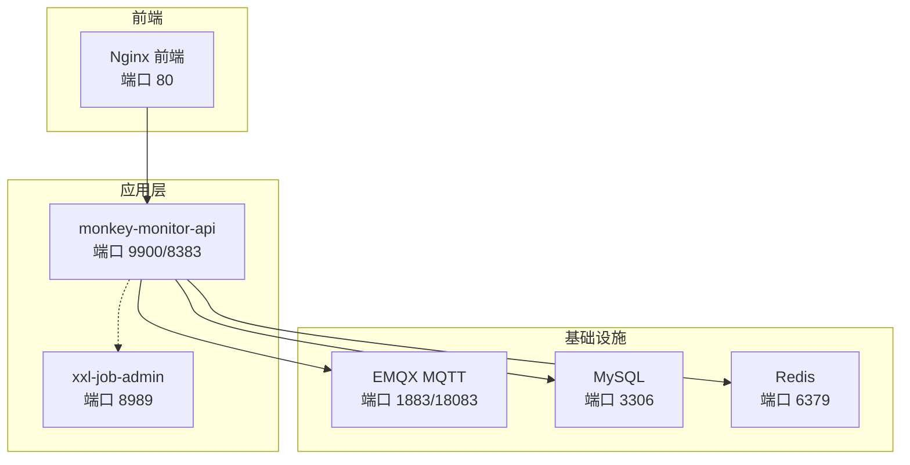
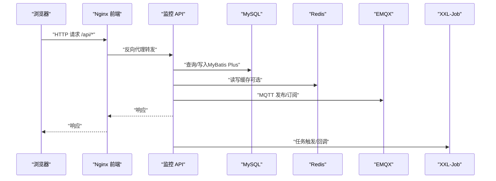
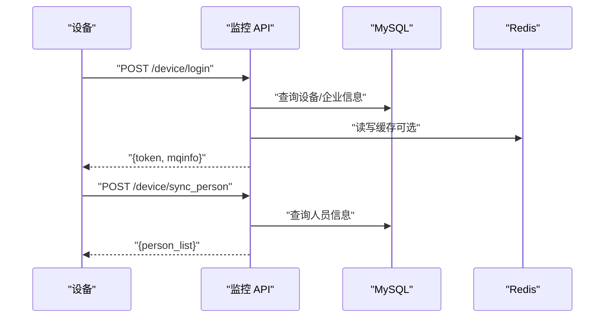
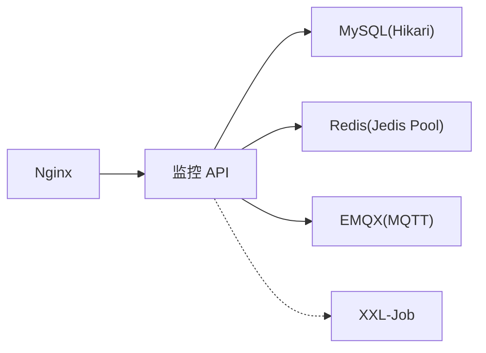

# 性能测试

<cite>
**本文引用的文件**
- [pom.xml](file://pom.xml)
- [docker-compose.yml](file://deploy/docker-compose.yml)
- [application-prod.yml（部署）](file://deploy/config/monitor-api/application-prod.yml)
- [application-prod.yml（应用）](file://monkey-monitor-api/src/main/resources/application-prod.yml)
- [nginx.conf](file://deploy/config/frontend/nginx.conf)
- [MonkeyMonitorApplication.java](file://monkey-monitor-api/src/main/java/com/monkey/general/MonkeyMonitorApplication.java)
- [DeviceController.java](file://monkey-monitor-api/src/main/java/com/monkey/general/controller/DeviceController.java)
- [UserController.java](file://monkey-monitor-api/src/main/java/com/monkey/general/controller/UserController.java)
- [XxlJobConfig.java](file://monkey-monitor-api/src/main/java/com/monkey/general/config/XxlJobConfig.java)
- [CorsConfig.java](file://monkey-monitor-api/src/main/java/com/monkey/general/config/CorsConfig.java)
- [init.sql](file://deploy/init/init.sql)
</cite>

## 目录
1. [引言](#引言)
2. [项目结构](#项目结构)
3. [核心组件](#核心组件)
4. [架构总览](#架构总览)
5. [详细组件分析](#详细组件分析)
6. [依赖分析](#依赖分析)
7. [性能考虑](#性能考虑)
8. [故障排查指南](#故障排查指南)
9. [结论](#结论)
10. [附录](#附录)

## 引言
本指南面向安威 fireworks 物联网监控平台，提供从零到一的性能测试实践方案。内容涵盖性能测试基本概念与类型（负载测试、压力测试、稳定性测试、并发测试）、JMeter 使用要点（测试计划、线程组、采样器、监听器）、测试场景设计（用户行为建模、业务流程建模、指标定义）、典型测试案例（API 接口、数据库查询、系统整体）、瓶颈识别与优化策略（CPU/内存/网络/磁盘 I/O），以及测试报告的基线建立、回归检测与趋势分析。

## 项目结构
安威 fireworks 采用多模块 Maven 工程，核心后端服务为监控 API 模块，配合 Nginx 前置代理、MySQL/Redis/EMQX 基础设施容器化部署。下图展示容器化部署拓扑与服务交互：

图表来源
- [docker-compose.yml:1-103](file://deploy/docker-compose.yml#L1-L103)
- [application-prod.yml（部署）:1-203](file://deploy/config/monitor-api/application-prod.yml#L1-L203)
- [nginx.conf:1-24](file://deploy/config/frontend/nginx.conf#L1-L24)

章节来源
- [docker-compose.yml:1-103](file://deploy/docker-compose.yml#L1-L103)
- [application-prod.yml（部署）:1-203](file://deploy/config/monitor-api/application-prod.yml#L1-L203)
- [nginx.conf:1-24](file://deploy/config/frontend/nginx.conf#L1-L24)

## 核心组件
- 监控 API 服务：提供设备登录、人员同步、通知回调等接口，承载业务逻辑与数据访问。
- 前端 Nginx：反向代理，转发 /api/ 请求至监控 API，并设置连接/读写超时。
- 基础设施：MySQL（持久化）、Redis（缓存开关与连接池配置）、EMQX（MQTT 消息接入）。
- 调度中心：XXL-Job 管理定时任务，执行器与管理端通过网络通信。

章节来源
- [application-prod.yml（应用）:1-198](file://monkey-monitor-api/src/main/resources/application-prod.yml#L1-L198)
- [CorsConfig.java:1-22](file://monkey-monitor-api/src/main/java/com/monkey/general/config/CorsConfig.java#L1-L22)
- [XxlJobConfig.java:1-78](file://monkey-monitor-api/src/main/java/com/monkey/general/config/XxlJobConfig.java#L1-L78)

## 架构总览
下图给出系统在性能测试视角下的关键交互链路：浏览器经 Nginx 到 API，API 访问数据库与缓存，同时通过 MQTT 与外部设备/平台交互，XXL-Job 执行周期性任务。

图表来源
- [nginx.conf:12-22](file://deploy/config/frontend/nginx.conf#L12-L22)
- [application-prod.yml（应用）:4-29](file://monkey-monitor-api/src/main/resources/application-prod.yml#L4-L29)
- [XxlJobConfig.java:19-56](file://monkey-monitor-api/src/main/java/com/monkey/general/config/XxlJobConfig.java#L19-L56)

## 详细组件分析

### 设备登录与人员同步接口（性能关注点）
- 设备登录接口：校验设备与企业状态，生成 token 并返回 MQTT 连接信息。
- 人员同步接口：校验设备与企业状态，按人员 ID 列表查询并返回人员信息。
- 缓存路径：设备/人员数据在接口层可能写入/读取 Redis（由配置项决定是否启用）。

图表来源
- [DeviceController.java:59-161](file://monkey-monitor-api/src/main/java/com/monkey/general/controller/DeviceController.java#L59-L161)

章节来源
- [DeviceController.java:59-161](file://monkey-monitor-api/src/main/java/com/monkey/general/controller/DeviceController.java#L59-L161)
- [application-prod.yml（应用）:14-26](file://monkey-monitor-api/src/main/resources/application-prod.yml#L14-L26)

### 用户信息接口（轻量接口示例）
- GET /sys/user/info：按企业编码查询用户信息，返回角色 ID 并清除敏感字段。
- 适合作为轻负载基准场景或压测中的“健康检查”接口。

章节来源
- [UserController.java:35-49](file://monkey-monitor-api/src/main/java/com/monkey/general/controller/UserController.java#L35-L49)

### 跨域与超时配置
- CORS 允许任意来源/方法/头，便于测试工具跨域访问。
- Nginx 设置代理连接/读写超时，影响长连接与大数据传输场景。

章节来源
- [CorsConfig.java:13-20](file://monkey-monitor-api/src/main/java/com/monkey/general/config/CorsConfig.java#L13-L20)
- [nginx.conf:19-22](file://deploy/config/frontend/nginx.conf#L19-L22)

### XXL-Job 执行器配置
- 执行器地址、端口、日志路径与保留天数均通过配置注入。
- 影响定时任务的触发与日志落盘性能。

章节来源
- [XxlJobConfig.java:19-56](file://monkey-monitor-api/src/main/java/com/monkey/general/config/XxlJobConfig.java#L19-L56)
- [application-prod.yml（部署）:116-134](file://deploy/config/monitor-api/application-prod.yml#L116-L134)

### 应用启动与图形环境
- 禁用 Headless 模式以支持本地 GUI 相关能力（如大华 SDK 回放抓图）。
- 对性能测试无直接影响，但需注意容器环境默认无显示栈。

章节来源
- [MonkeyMonitorApplication.java:13-16](file://monkey-monitor-api/src/main/java/com/monkey/general/MonkeyMonitorApplication.java#L13-L16)

## 依赖分析
- 数据库连接池：HikariCP 最小空闲与最大池大小影响并发连接占用与切换开销。
- 缓存：Redis 连接池参数与开关影响热点数据命中率与网络往返。
- MQ：MQTT 主题与 QoS、KeepAlive、超时参数影响消息吞吐与可靠性。
- 前置代理：Nginx 超时配置影响长轮询/大文件场景。

图表来源
- [application-prod.yml（应用）:4-29](file://monkey-monitor-api/src/main/resources/application-prod.yml#L4-L29)
- [application-prod.yml（部署）:10-26](file://deploy/config/monitor-api/application-prod.yml#L10-L26)
- [nginx.conf:12-22](file://deploy/config/frontend/nginx.conf#L12-L22)

章节来源
- [application-prod.yml（应用）:4-29](file://monkey-monitor-api/src/main/resources/application-prod.yml#L4-L29)
- [application-prod.yml（部署）:10-26](file://deploy/config/monitor-api/application-prod.yml#L10-L26)
- [nginx.conf:12-22](file://deploy/config/frontend/nginx.conf#L12-L22)

## 性能考虑
- 连接池与线程：合理设置数据库连接池与应用线程池上限，避免上下文切换与阻塞。
- 缓存策略：热点数据走缓存，注意缓存穿透/击穿与一致性；根据业务选择合适的过期策略。
- MQ 模型：根据设备上报频率与业务需求调整主题、QoS 与客户端 KeepAlive。
- 网络与 I/O：Nginx 超时参数与后端超时需匹配；磁盘 I/O 与日志落盘影响整体延迟。
- 资源隔离：生产环境建议将 API、MQ、DB、缓存与调度中心分别独立部署并监控。

## 故障排查指南
- 数据库连接异常：检查 Hikari 配置与连接池耗尽情况，观察慢查询与锁等待。
- 缓存不可用：确认 Redis 开关与连接参数，验证网络连通与认证。
- MQ 断连：核对 MQTT 主题、用户名/密码、KeepAlive 与超时设置。
- 前置代理超时：调整 Nginx 连接/读写超时，避免长连接被提前中断。
- 调度任务堆积：检查执行器日志路径与保留天数，评估任务粒度与并发。

章节来源
- [application-prod.yml（应用）:10-29](file://monkey-monitor-api/src/main/resources/application-prod.yml#L10-L29)
- [application-prod.yml（部署）:116-134](file://deploy/config/monitor-api/application-prod.yml#L116-L134)
- [nginx.conf:19-22](file://deploy/config/frontend/nginx.conf#L19-L22)

## 结论
本指南基于仓库现有配置与代码，给出了面向安威 fireworks 平台的性能测试方法论与实施路径。建议结合实际业务流量模型，逐步开展从轻负载到高并发的测试，持续优化数据库、缓存与 MQ 参数，并通过监控指标与回归分析保障系统稳定性与可扩展性。

## 附录

### 性能测试类型与应用场景
- 负载测试：在预期或略高于预期的负载下，验证系统在稳定态下的吞吐与延迟表现。
- 压力测试：逐步提升负载直至系统出现错误或阈值告警，识别系统极限与错误边界。
- 稳定性测试：在峰值负载下长时间运行，观察系统抖动、内存泄漏与资源耗尽风险。
- 并发测试：模拟多用户/多设备并发访问，重点观测锁竞争、连接池与线程池饱和情况。

### JMeter 配置与使用要点
- 测试计划创建：新建线程组，设置线程数、循环次数与 Ramp-Up 时间。
- 线程组配置：根据业务峰值与 SLA 设定并发用户数与持续时间。
- 采样器使用：HTTP 请求采样器配置目标主机与端口（Nginx 或 API 直连均可），设置超时与参数。
- 监听器添加：聚合报告、响应时间图表、吞吐量与错误率统计，用于基线与回归分析。

### 性能测试场景设计
- 真实用户行为：以设备登录、人员同步、用户信息等高频接口构建场景。
- 业务流程建模：串联登录→查询→上报→回调等步骤，覆盖完整业务闭环。
- 指标定义：RT（响应时间）、吞吐量、错误率、连接池利用率、MQTT 消息积压、数据库慢查询数。

### 典型测试案例
- API 接口性能测试：针对 /device/login、/device/sync_person、/sys/user/info 等接口进行并发与混合场景测试。
- 数据库查询性能测试：结合慢查询日志与连接池指标，定位热点 SQL 与索引缺失。
- 系统整体性能测试：包含 Nginx、API、MQ、DB、Redis、XXL-Job 的端到端压测，观察各组件瓶颈。

### 瓶颈识别与分析方法
- CPU 使用率：观察应用与数据库 CPU 占用，定位计算密集型问题。
- 内存消耗：堆外/堆内内存变化，GC 频率与停顿时间。
- 网络延迟：Nginx 与 API 间 RT、MQTT 发布/订阅往返时间。
- 磁盘 I/O：日志与事务日志写入速率，慢查询与锁等待。

### 性能优化策略
- 代码优化：减少不必要的对象创建、避免 N+1 查询、优化热点路径。
- 数据库优化：索引优化、慢查询治理、连接池参数调优。
- 缓存策略：热点数据预热、合理的过期与淘汰策略、缓存穿透防护。
- 负载均衡：前置 Nginx 负载均衡、服务拆分与限流降级。
- MQ 调优：主题分区、QoS 与批量发送、客户端背压控制。

### 性能测试报告分析与解读
- 建立性能基线：记录稳定态下的 RT、吞吐量与错误率。
- 性能回归检测：对比不同版本的基线，发现回归点。
- 性能趋势分析：按时间序列观察资源使用与延迟变化，预测容量与扩容需求。