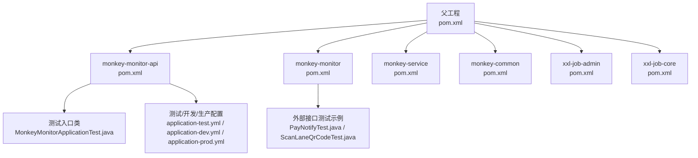
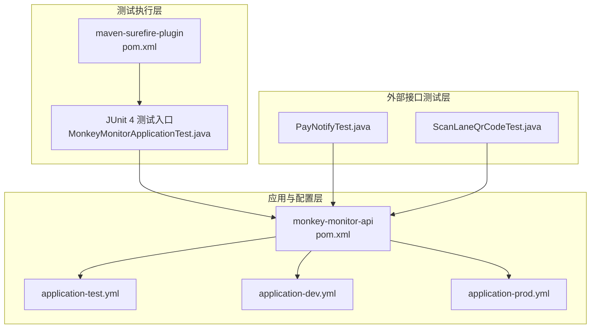
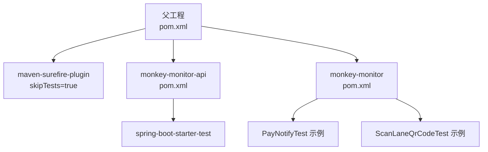

# 测试开发

<cite>
**本文引用的文件**
- [pom.xml](file://pom.xml)
- [monkey-monitor-api/pom.xml](file://monkey-monitor-api/pom.xml)
- [monkey-monitor/pom.xml](file://monkey-monitor/pom.xml)
- [monkey-monitor-api/src/test/java/com/monkey/general/MonkeyMonitorApplicationTest.java](file://monkey-monitor-api/src/test/java/com/monkey/general/MonkeyMonitorApplicationTest.java)
- [monkey-monitor-api/src/main/resources/application-test.yml](file://monkey-monitor-api/src/main/resources/application-test.yml)
- [monkey-monitor-api/src/main/resources/application-dev.yml](file://monkey-monitor-api/src/main/resources/application-dev.yml)
- [monkey-monitor-api/src/main/resources/application-prod.yml](file://monkey-monitor-api/src/main/resources/application-prod.yml)
- [monkey-monitor/src/main/java/com/monkey/general/modules/third/api/test/example/PayNotifyTest.java](file://monkey-monitor/src/main/java/com/monkey/general/modules/third/api/test/example/PayNotifyTest.java)
- [monkey-monitor/src/main/java/com/monkey/general/modules/third/api/test/example/ScanLaneQrCodeTest.java](file://monkey-monitor/src/main/java/com/monkey/general/modules/third/api/test/example/ScanLaneQrCodeTest.java)
</cite>

## 目录
1. [引言](#引言)
2. [项目结构](#项目结构)
3. [核心组件](#核心组件)
4. [架构总览](#架构总览)
5. [详细组件分析](#详细组件分析)
6. [依赖分析](#依赖分析)
7. [性能考虑](#性能考虑)
8. [故障排查指南](#故障排查指南)
9. [结论](#结论)
10. [附录](#附录)

## 引言
本指南面向安威 fireworks 物联网监控平台的测试开发工作，目标是帮助测试与研发团队建立完善的测试体系，覆盖单元测试、集成测试、性能测试与持续集成流程。文档基于仓库现有配置与测试样例进行梳理，结合实际模块与依赖，给出可落地的测试策略、工具与最佳实践。

## 项目结构
本项目采用 Maven 多模块结构，核心与监控相关模块包含：
- 父工程：统一版本与插件管理，包含测试插件配置与跳过策略
- monkey-monitor-api：对外 API 模块，包含测试入口类与多环境配置
- monkey-monitor：业务与第三方对接模块，包含外部接口测试示例
- monkey-service、monkey-common：业务与通用能力模块
- xxl-job-*：定时任务相关模块

图表来源
- [pom.xml:1-221](file://pom.xml#L1-L221)
- [monkey-monitor-api/pom.xml:1-59](file://monkey-monitor-api/pom.xml#L1-L59)
- [monkey-monitor/pom.xml:1-103](file://monkey-monitor/pom.xml#L1-L103)
- [monkey-monitor-api/src/test/java/com/monkey/general/MonkeyMonitorApplicationTest.java:1-34](file://monkey-monitor-api/src/test/java/com/monkey/general/MonkeyMonitorApplicationTest.java#L1-L34)
- [monkey-monitor/src/main/java/com/monkey/general/modules/third/api/test/example/PayNotifyTest.java:1-121](file://monkey-monitor/src/main/java/com/monkey/general/modules/third/api/test/example/PayNotifyTest.java#L1-L121)
- [monkey-monitor/src/main/java/com/monkey/general/modules/third/api/test/example/ScanLaneQrCodeTest.java:1-50](file://monkey-monitor/src/main/java/com/monkey/general/modules/third/api/test/example/ScanLaneQrCodeTest.java#L1-L50)
- [monkey-monitor-api/src/main/resources/application-test.yml:1-76](file://monkey-monitor-api/src/main/resources/application-test.yml#L1-L76)
- [monkey-monitor-api/src/main/resources/application-dev.yml:1-206](file://monkey-monitor-api/src/main/resources/application-dev.yml#L1-L206)
- [monkey-monitor-api/src/main/resources/application-prod.yml:1-198](file://monkey-monitor-api/src/main/resources/application-prod.yml#L1-L198)

章节来源
- [pom.xml:1-221](file://pom.xml#L1-L221)
- [monkey-monitor-api/pom.xml:1-59](file://monkey-monitor-api/pom.xml#L1-L59)
- [monkey-monitor/pom.xml:1-103](file://monkey-monitor/pom.xml#L1-L103)

## 核心组件
- 测试框架与插件
  - 父工程通过 maven-surefire-plugin 配置了测试插件，当前默认跳过测试，需在 CI 或本地显式启用
  - monkey-monitor-api 依赖 spring-boot-starter-test，具备 Spring Boot 测试基础能力
- 测试入口与样例
  - monkey-monitor-api 提供了基于 JUnit 4 的简单测试入口类，便于快速验证测试环境
- 测试配置
  - 提供 application-test.yml、application-dev.yml、application-prod.yml 三套环境配置，便于隔离测试数据库、缓存与外部服务地址
- 外部接口测试示例
  - monkey-monitor 中包含第三方接口调用测试示例，可作为集成测试与端到端测试的参考模板

章节来源
- [pom.xml:210-216](file://pom.xml#L210-L216)
- [monkey-monitor-api/pom.xml:46-47](file://monkey-monitor-api/pom.xml#L46-L47)
- [monkey-monitor-api/src/test/java/com/monkey/general/MonkeyMonitorApplicationTest.java:1-34](file://monkey-monitor-api/src/test/java/com/monkey/general/MonkeyMonitorApplicationTest.java#L1-L34)
- [monkey-monitor-api/src/main/resources/application-test.yml:1-76](file://monkey-monitor-api/src/main/resources/application-test.yml#L1-L76)
- [monkey-monitor/src/main/java/com/monkey/general/modules/third/api/test/example/PayNotifyTest.java:1-121](file://monkey-monitor/src/main/java/com/monkey/general/modules/third/api/test/example/PayNotifyTest.java#L1-L121)
- [monkey-monitor/src/main/java/com/monkey/general/modules/third/api/test/example/ScanLaneQrCodeTest.java:1-50](file://monkey-monitor/src/main/java/com/monkey/general/modules/third/api/test/example/ScanLaneQrCodeTest.java#L1-L50)

## 架构总览
下图展示测试相关模块与配置的关系，以及测试生命周期中各组件的交互：

图表来源
- [pom.xml:210-216](file://pom.xml#L210-L216)
- [monkey-monitor-api/pom.xml:1-59](file://monkey-monitor-api/pom.xml#L1-L59)
- [monkey-monitor-api/src/test/java/com/monkey/general/MonkeyMonitorApplicationTest.java:1-34](file://monkey-monitor-api/src/test/java/com/monkey/general/MonkeyMonitorApplicationTest.java#L1-L34)
- [monkey-monitor-api/src/main/resources/application-test.yml:1-76](file://monkey-monitor-api/src/main/resources/application-test.yml#L1-L76)
- [monkey-monitor-api/src/main/resources/application-dev.yml:1-206](file://monkey-monitor-api/src/main/resources/application-dev.yml#L1-L206)
- [monkey-monitor-api/src/main/resources/application-prod.yml:1-198](file://monkey-monitor-api/src/main/resources/application-prod.yml#L1-L198)
- [monkey-monitor/src/main/java/com/monkey/general/modules/third/api/test/example/PayNotifyTest.java:1-121](file://monkey-monitor/src/main/java/com/monkey/general/modules/third/api/test/example/PayNotifyTest.java#L1-L121)
- [monkey-monitor/src/main/java/com/monkey/general/modules/third/api/test/example/ScanLaneQrCodeTest.java:1-50](file://monkey-monitor/src/main/java/com/monkey/general/modules/third/api/test/example/ScanLaneQrCodeTest.java#L1-L50)

## 详细组件分析

### 单元测试：JUnit 与 Spring Boot Test 集成
- 当前现状
  - 使用 JUnit 4 的测试入口类，适合最小可用验证
  - 依赖 spring-boot-starter-test，具备基本的 Spring Boot 测试能力
- 建议改进
  - 引入 JUnit 5 以获得更丰富的断言与扩展能力
  - 结合 @ExtendWith(SpringExtension.class) 与 @SpringBootTest 加载上下文
  - 使用 @MockBean/@SpyBean 替代真实外部依赖，确保测试稳定与可重复
- 断言与测试组织
  - 使用 assertTrue/assertFalse/assertNull/ assertNotNull 等基础断言
  - 对于复杂场景，建议拆分为多个小而清晰的测试用例，遵循“单一职责”原则

章节来源
- [monkey-monitor-api/pom.xml:46-47](file://monkey-monitor-api/pom.xml#L46-L47)
- [monkey-monitor-api/src/test/java/com/monkey/general/MonkeyMonitorApplicationTest.java:1-34](file://monkey-monitor-api/src/test/java/com/monkey/general/MonkeyMonitorApplicationTest.java#L1-L34)

### 集成测试：数据库与外部服务模拟
- 数据库测试
  - 使用 application-test.yml 指向独立测试数据库，避免污染生产或开发数据
  - 可结合 @Sql 注解在测试前后执行初始化/清理脚本
- 外部服务模拟
  - 参考 PayNotifyTest.java 与 ScanLaneQrCodeTest.java 的调用方式，将真实外部接口替换为本地 Mock 服务或 WireMock
  - 对签名、鉴权等关键逻辑进行参数化测试，覆盖边界条件
- 端到端测试
  - 基于测试配置启动轻量级应用上下文，对完整业务链路进行验证
  - 使用 RestAssured 或 WebTestClient 进行 API 层验证

章节来源
- [monkey-monitor-api/src/main/resources/application-test.yml:1-76](file://monkey-monitor-api/src/main/resources/application-test.yml#L1-L76)
- [monkey-monitor/src/main/java/com/monkey/general/modules/third/api/test/example/PayNotifyTest.java:1-121](file://monkey-monitor/src/main/java/com/monkey/general/modules/third/api/test/example/PayNotifyTest.java#L1-L121)
- [monkey-monitor/src/main/java/com/monkey/general/modules/third/api/test/example/ScanLaneQrCodeTest.java:1-50](file://monkey-monitor/src/main/java/com/monkey/general/modules/third/api/test/example/ScanLaneQrCodeTest.java#L1-L50)

### 性能测试：压力、负载与基准
- 压力测试
  - 使用 JMeter 或 Gatling 对关键接口施加并发压力，观察响应时间与错误率
- 负载测试
  - 在稳定负载下长时间运行，识别内存泄漏与资源瓶颈
- 基准测试
  - 对热点方法或算法进行微基准测试（JMH），评估优化效果
- 结合外部接口
  - 对第三方接口调用进行限流与降级策略验证，确保系统整体稳定性

（本节为通用指导，不直接分析具体文件）

### 测试覆盖率：要求与提升
- 要求
  - 建议关键模块达到较高覆盖率（如 80%+），核心业务逻辑不低于 90%
- 统计与分析
  - 使用 JaCoCo 插件生成覆盖率报告，定位未覆盖分支与异常路径
- 提升方法
  - 针对低覆盖率区域补充边界与异常场景测试
  - 重构难以测试的代码，提高内聚性与可测试性

（本节为通用指导，不直接分析具体文件）

### 持续集成：自动化测试与报告
- 流程
  - 在 CI 中显式启用测试执行，避免父工程默认跳过
  - 将测试报告与覆盖率报告归档，便于质量门禁
- 工具
  - Maven Surefire + Jacoco 插件生成报告
  - 与制品库或质量平台集成，形成闭环

章节来源
- [pom.xml:210-216](file://pom.xml#L210-L216)

### 测试数据：准备与管理
- 准备
  - 使用测试数据库与专用账号，避免与生产数据交叉
- 清理
  - 在 @BeforeEach/@AfterEach 中执行清理脚本，保证测试隔离
- 环境隔离
  - application-test.yml 与 application-dev.yml 明确区分测试与开发环境，减少误用风险

章节来源
- [monkey-monitor-api/src/main/resources/application-test.yml:1-76](file://monkey-monitor-api/src/main/resources/application-test.yml#L1-L76)
- [monkey-monitor-api/src/main/resources/application-dev.yml:1-206](file://monkey-monitor-api/src/main/resources/application-dev.yml#L1-L206)

### 最佳实践与常见问题
- 最佳实践
  - 用例命名清晰表达意图与前置条件
  - 使用参数化测试覆盖多输入组合
  - 将外部依赖抽象为接口，便于注入 Mock
- 常见问题
  - 测试被跳过：检查父工程的 skipTests 配置，必要时在 CI 中显式开启
  - 外部接口不稳定：引入 Mock 或本地代理，确保测试可重复
  - 覆盖率低：针对未覆盖分支补充用例，优先覆盖异常路径

（本节为通用指导，不直接分析具体文件）

## 依赖分析
下图展示测试相关模块之间的依赖关系与测试插件配置位置：

图表来源
- [pom.xml:210-216](file://pom.xml#L210-L216)
- [monkey-monitor-api/pom.xml:46-47](file://monkey-monitor-api/pom.xml#L46-L47)
- [monkey-monitor/pom.xml:46-47](file://monkey-monitor/pom.xml#L46-L47)
- [monkey-monitor/src/main/java/com/monkey/general/modules/third/api/test/example/PayNotifyTest.java:1-121](file://monkey-monitor/src/main/java/com/monkey/general/modules/third/api/test/example/PayNotifyTest.java#L1-L121)
- [monkey-monitor/src/main/java/com/monkey/general/modules/third/api/test/example/ScanLaneQrCodeTest.java:1-50](file://monkey-monitor/src/main/java/com/monkey/general/modules/third/api/test/example/ScanLaneQrCodeTest.java#L1-L50)

章节来源
- [pom.xml:210-216](file://pom.xml#L210-L216)
- [monkey-monitor-api/pom.xml:46-47](file://monkey-monitor-api/pom.xml#L46-L47)
- [monkey-monitor/pom.xml:46-47](file://monkey-monitor/pom.xml#L46-L47)

## 性能考虑
- 测试执行效率
  - 使用并行测试与轻量级上下文加载，缩短测试周期
- 外部依赖性能
  - 对第三方接口调用增加超时与重试策略，避免测试阻塞
- 资源占用
  - 控制并发与线程池大小，避免测试环境资源耗尽

（本节为通用指导，不直接分析具体文件）

## 故障排查指南
- 测试未执行
  - 检查父工程 maven-surefire-plugin 的 skipTests 配置，必要时在 CI 中显式关闭跳过
- 外部接口失败
  - 使用本地 Mock 或代理替代真实服务，确认签名与鉴权参数正确
- 配置污染
  - 确认使用 application-test.yml 并避免与开发/生产配置混用

章节来源
- [pom.xml:210-216](file://pom.xml#L210-L216)
- [monkey-monitor-api/src/main/resources/application-test.yml:1-76](file://monkey-monitor-api/src/main/resources/application-test.yml#L1-L76)

## 结论
本指南基于现有代码与配置，给出了从单元测试到集成测试、性能测试与持续集成的完整思路。建议尽快引入 JUnit 5、Mockito 与 Spring Boot Test 的现代化组合，并完善测试配置与覆盖率策略，以支撑安威 fireworks 物联网监控平台的高质量交付与演进。

## 附录
- 测试配置清单
  - application-test.yml：测试数据库与缓存配置
  - application-dev.yml：开发环境配置
  - application-prod.yml：生产环境配置
- 外部接口测试参考
  - PayNotifyTest.java：第三方缴费回调接口测试
  - ScanLaneQrCodeTest.java：通道二维码接口测试

章节来源
- [monkey-monitor-api/src/main/resources/application-test.yml:1-76](file://monkey-monitor-api/src/main/resources/application-test.yml#L1-L76)
- [monkey-monitor-api/src/main/resources/application-dev.yml:1-206](file://monkey-monitor-api/src/main/resources/application-dev.yml#L1-L206)
- [monkey-monitor-api/src/main/resources/application-prod.yml:1-198](file://monkey-monitor-api/src/main/resources/application-prod.yml#L1-L198)
- [monkey-monitor/src/main/java/com/monkey/general/modules/third/api/test/example/PayNotifyTest.java:1-121](file://monkey-monitor/src/main/java/com/monkey/general/modules/third/api/test/example/PayNotifyTest.java#L1-L121)
- [monkey-monitor/src/main/java/com/monkey/general/modules/third/api/test/example/ScanLaneQrCodeTest.java:1-50](file://monkey-monitor/src/main/java/com/monkey/general/modules/third/api/test/example/ScanLaneQrCodeTest.java#L1-L50)