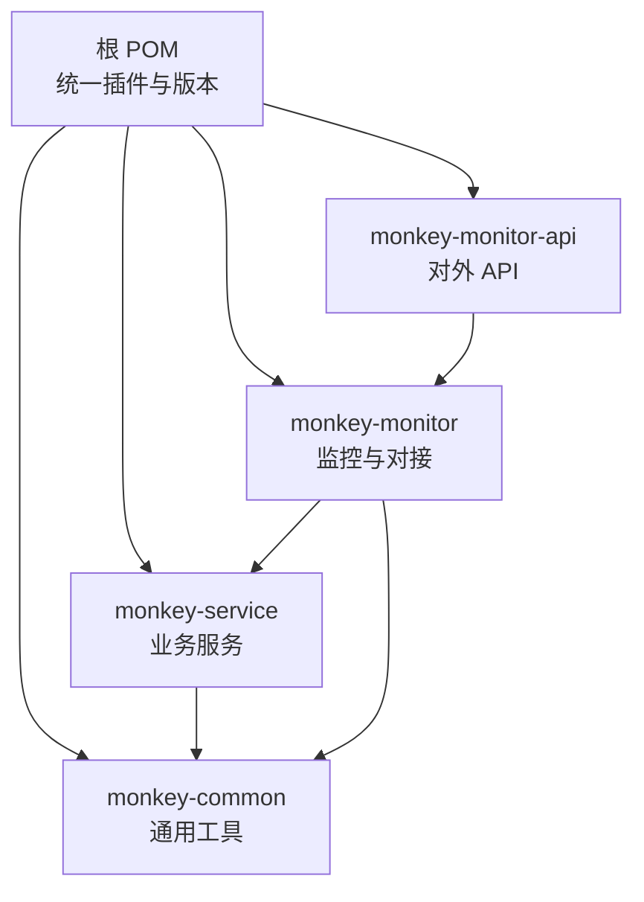
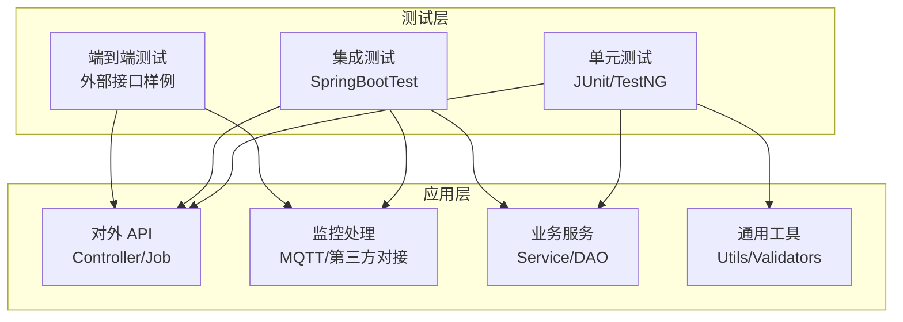
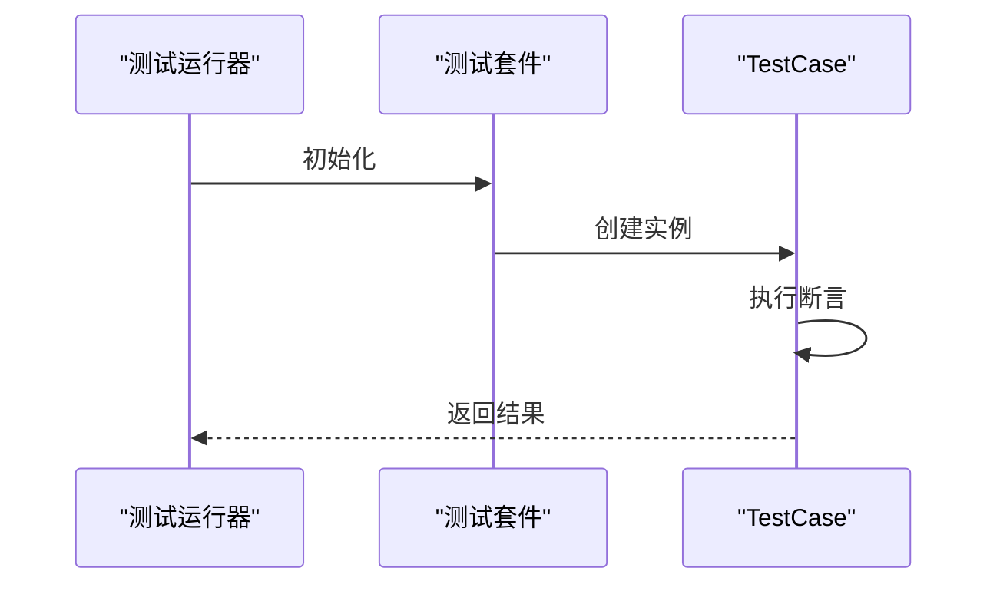
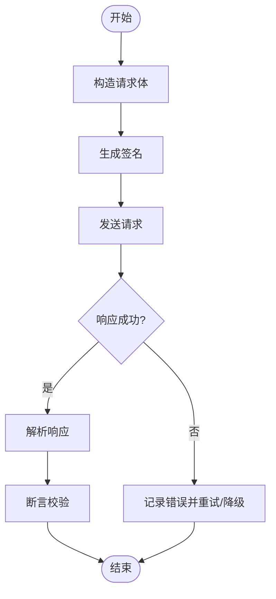
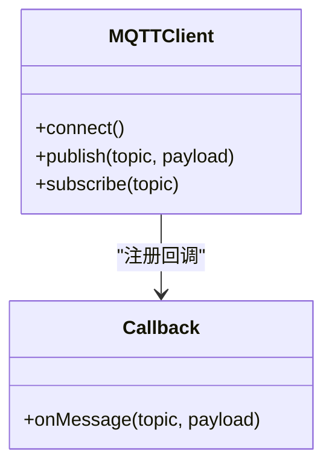
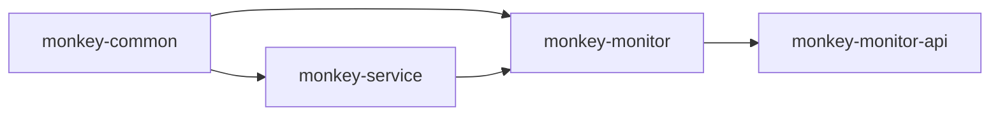

# 测试覆盖率

<cite>
**本文引用的文件**
- [pom.xml（根）](file://pom.xml)
- [pom.xml（monkey-monitor）](file://monkey-monitor/pom.xml)
- [pom.xml（monkey-monitor-api）](file://monkey-monitor-api/pom.xml)
- [pom.xml（monkey-common）](file://monkey-common/pom.xml)
- [MonkeyMonitorApplicationTest.java](file://monkey-monitor-api/src/test/java/com/monkey/general/MonkeyMonitorApplicationTest.java)
- [PayNotifyTest.java](file://monkey-monitor/src/main/java/com/monkey/general/modules/third/api/test/example/PayNotifyTest.java)
- [.gitignore](file://.gitignore)
</cite>

## 目录
1. [引言](#引言)
2. [项目结构](#项目结构)
3. [核心组件](#核心组件)
4. [架构总览](#架构总览)
5. [详细组件分析](#详细组件分析)
6. [依赖分析](#依赖分析)
7. [性能考量](#性能考量)
8. [故障排查指南](#故障排查指南)
9. [结论](#结论)
10. [附录](#附录)

## 引言
本指南面向安威 fireworks 物联网监控平台，系统化阐述测试覆盖率的概念、指标与落地方法，并结合当前仓库现状给出可执行的覆盖率分析与提升路径。内容涵盖：
- 覆盖率指标定义与计算方式（代码覆盖率、分支覆盖率、行覆盖率）
- JaCoCo 插件在 Maven 中的配置与使用（报告生成、阈值设置、差异对比）
- 报告解读与实践（未覆盖代码识别、热点定位、趋势跟踪）
- 提升策略（新增测试、重构不可测代码、优化测试策略）
- 覆盖率与质量的关系（缺陷发现率、质量评估）
- 持续集成中的覆盖率监控（门禁、报告集成、趋势可视化）
- 最佳实践与常见陷阱

## 项目结构
本项目采用多模块 Maven 结构，核心与监控相关模块如下：
- 父 POM 统一版本与插件管理
- monkey-common：通用工具与基础能力
- monkey-service：业务服务与持久层
- monkey-monitor：监控与第三方对接
- monkey-monitor-api：对外 API 与定时任务调度

图表来源
- [pom.xml（根）:11-17](file://pom.xml#L11-L17)
- [pom.xml（monkey-common）:1-163](file://monkey-common/pom.xml#L1-L163)
- [pom.xml（monkey-service）:1-200](file://monkey-service/pom.xml#L1-L200)
- [pom.xml（monkey-monitor）:1-103](file://monkey-monitor/pom.xml#L1-L103)
- [pom.xml（monkey-monitor-api）:1-59](file://monkey-monitor-api/pom.xml#L1-L59)

章节来源
- [pom.xml（根）:11-17](file://pom.xml#L11-L17)
- [pom.xml（monkey-common）:1-163](file://monkey-common/pom.xml#L1-L163)
- [pom.xml（monkey-monitor）:1-103](file://monkey-monitor/pom.xml#L1-L103)
- [pom.xml（monkey-monitor-api）:1-59](file://monkey-monitor-api/pom.xml#L1-L59)

## 核心组件
- 测试框架与运行器
  - 当前模块已引入 Spring Boot 测试 Starter，便于基于注解与断言进行单元测试与集成测试。
  - 示例测试类展示了传统 JUnit TestCase 的写法，可用于最小可用验证。

- 测试资源与隔离
  - .gitignore 明确排除 target 目录，确保构建产物不进入版本控制；同时保留 src/test/**/target/ 以支持测试编译产物。

- 外部接口测试样例
  - 存在第三方接口测试示例类，演示构造请求体、签名、调用与打印响应的流程，可作为接口回归测试的参考模板。

章节来源
- [pom.xml（monkey-monitor）:44-47](file://monkey-monitor/pom.xml#L44-L47)
- [pom.xml（monkey-monitor-api）:1-59](file://monkey-monitor-api/pom.xml#L1-L59)
- [MonkeyMonitorApplicationTest.java:1-34](file://monkey-monitor-api/src/test/java/com/monkey/general/MonkeyMonitorApplicationTest.java#L1-L34)
- [.gitignore:1-46](file://.gitignore#L1-L46)
- [PayNotifyTest.java:1-121](file://monkey-monitor/src/main/java/com/monkey/general/modules/third/api/test/example/PayNotifyTest.java#L1-L121)

## 架构总览
从测试视角看，系统由“对外 API 层 → 监控处理层 → 业务服务层 → 通用工具层”构成，测试应覆盖各层关键路径与边界条件。

图表来源
- [pom.xml（monkey-monitor-api）:1-59](file://monkey-monitor-api/pom.xml#L1-L59)
- [pom.xml（monkey-monitor）:1-103](file://monkey-monitor/pom.xml#L1-L103)
- [pom.xml（monkey-common）:1-163](file://monkey-common/pom.xml#L1-L163)
- [PayNotifyTest.java:1-121](file://monkey-monitor/src/main/java/com/monkey/general/modules/third/api/test/example/PayNotifyTest.java#L1-L121)

## 详细组件分析

### 组件 A：对外 API 测试（最小可用）
- 目标：验证启动与基本断言，作为覆盖率基线。
- 建议：扩展为控制器层与定时任务的轻量集成测试，覆盖正常/异常路径。

图表来源
- [MonkeyMonitorApplicationTest.java:10-33](file://monkey-monitor-api/src/test/java/com/monkey/general/MonkeyMonitorApplicationTest.java#L10-L33)

章节来源
- [MonkeyMonitorApplicationTest.java:1-34](file://monkey-monitor-api/src/test/java/com/monkey/general/MonkeyMonitorApplicationTest.java#L1-L34)

### 组件 B：第三方接口测试样例（回归模板）
- 目标：演示请求构造、签名、调用与响应解析，可直接复用为接口回归测试。
- 建议：将样例改造为参数化测试，覆盖不同入参组合与异常场景。

图表来源
- [PayNotifyTest.java:23-118](file://monkey-monitor/src/main/java/com/monkey/general/modules/third/api/test/example/PayNotifyTest.java#L23-L118)

章节来源
- [PayNotifyTest.java:1-121](file://monkey-monitor/src/main/java/com/monkey/general/modules/third/api/test/example/PayNotifyTest.java#L1-L121)

### 组件 C：监控处理层（MQTT/第三方对接）
- 目标：对 MQTT 回调、第三方协议解析、设备交互等逻辑进行单元与集成测试。
- 建议：通过 Mock 或内嵌 Broker 进行无侵入测试，覆盖订阅、回调、异常分支。

图表来源
- [pom.xml（monkey-monitor）:1-103](file://monkey-monitor/pom.xml#L1-L103)

章节来源
- [pom.xml（monkey-monitor）:1-103](file://monkey-monitor/pom.xml#L1-L103)

## 依赖分析
- 模块间依赖关系
  - monkey-monitor 依赖 monkey-common 与 monkey-service
  - monkey-monitor-api 依赖 monkey-monitor
- 测试依赖关系
  - 各模块均引入 spring-boot-starter-test，便于单元与集成测试

图表来源
- [pom.xml（根）:11-17](file://pom.xml#L11-L17)
- [pom.xml（monkey-monitor）:20-31](file://monkey-monitor/pom.xml#L20-L31)
- [pom.xml（monkey-monitor-api）:20-26](file://monkey-monitor-api/pom.xml#L20-L26)

章节来源
- [pom.xml（根）:11-17](file://pom.xml#L11-L17)
- [pom.xml（monkey-monitor）:20-31](file://monkey-monitor/pom.xml#L20-L31)
- [pom.xml（monkey-monitor-api）:20-26](file://monkey-monitor-api/pom.xml#L20-L26)

## 性能考量
- 测试执行性能
  - 使用并行测试与分层执行（单元/集成/端到端）降低整体耗时
  - 避免在测试中进行真实网络 IO，优先使用 Mock 与内存数据库
- 覆盖率收集性能
  - 在 CI 中按模块独立生成覆盖率报告，减少大体量合并成本
  - 控制覆盖率阈值在合理区间，避免过度收紧导致回归成本上升

## 故障排查指南
- 测试无法运行或被跳过
  - 根 POM 中 Surefire 插件默认跳过测试，需在本地或 CI 中调整配置以启用测试与覆盖率收集
- 构建产物污染
  - .gitignore 已排除 target，确认测试输出目录未被误提交
- 第三方接口测试失败
  - 检查示例中的地址与签名密钥是否正确，必要时增加日志与超时重试

章节来源
- [pom.xml（根）:208-216](file://pom.xml#L208-L216)
- [.gitignore:1-46](file://.gitignore#L1-L46)
- [PayNotifyTest.java:20-27](file://monkey-monitor/src/main/java/com/monkey/general/modules/third/api/test/example/PayNotifyTest.java#L20-L27)

## 结论
当前仓库具备基础测试框架与外部接口样例，但尚未集成覆盖率工具与门禁。建议尽快引入 JaCoCo 并在 CI 中建立覆盖率门禁，结合模块化测试与 Mock，逐步提升关键路径覆盖率，形成“测试驱动开发 + 覆盖率治理”的闭环。

## 附录

### A. 覆盖率指标与计算
- 代码覆盖率（语句/指令）
  - 表示被执行的代码行数占总代码行数的比例
- 分支覆盖率
  - 表示被覆盖的分支数占总分支数的比例
- 行覆盖率
  - 表示被至少执行一次的代码行数占比
- 计算方法
  - 通常由覆盖率工具在测试执行后统计，结合字节码增强或运行时探针实现

### B. JaCoCo 配置与使用（基于 Maven）
- 插件配置要点
  - 在根 POM 或目标模块 POM 中添加 JaCoCo 插件
  - 在测试阶段生成覆盖率数据，在报告阶段生成 HTML/XML 报告
  - 可配置规则：总覆盖率阈值、分支覆盖率阈值、类/包级别阈值
- 报告生成与差异对比
  - 生成报告后可在本地浏览器打开 HTML 报告
  - 通过命令行或 CI 插件对比 PR 与主干的覆盖率差异
- 与 CI 集成
  - 在流水线中执行测试与覆盖率收集，失败时根据阈值门禁阻止合并

### C. 报告分析与实践
- 未覆盖代码识别
  - 关注高风险区域（异常分支、空值处理、外部依赖）
- 热点代码定位
  - 优先补齐高频调用与复杂算法的测试
- 趋势跟踪
  - 将报告上传至制品库或可视化平台，按天/周/月观察变化

### D. 提升测试覆盖率的方法
- 新增测试用例
  - 针对未覆盖分支补充单元测试
  - 编写参数化测试覆盖边界输入
- 重构不可测试代码
  - 将硬编码、全局状态、阻塞 IO 改造为可注入与可 Mock
- 改进测试策略
  - 采用 TDD，先写失败用例再实现功能
  - 引入契约测试与接口回归测试

### E. 覆盖率与质量的关系
- 覆盖率与缺陷发现率
  - 覆盖率越高，越可能暴露隐藏问题；但仅靠覆盖率无法保证质量
- 质量评估维度
  - 结合缺陷密度、回归率、测试执行效率等综合评估

### F. 持续集成中的覆盖率监控
- 门禁设置
  - 在合并请求中强制要求覆盖率不低于阈值
- 报告集成
  - 将覆盖率报告与制品库/仪表盘联动展示
- 趋势可视化
  - 通过折线图展示覆盖率随时间的变化

### G. 最佳实践与常见陷阱
- 最佳实践
  - 为每个模块设定明确的覆盖率目标
  - 将覆盖率纳入代码评审清单
  - 定期清理长期未覆盖的历史代码
- 常见陷阱
  - 过度追求 100% 覆盖而忽视测试质量
  - 忽视分支覆盖率，仅关注行覆盖率
  - 将覆盖率作为唯一质量指标