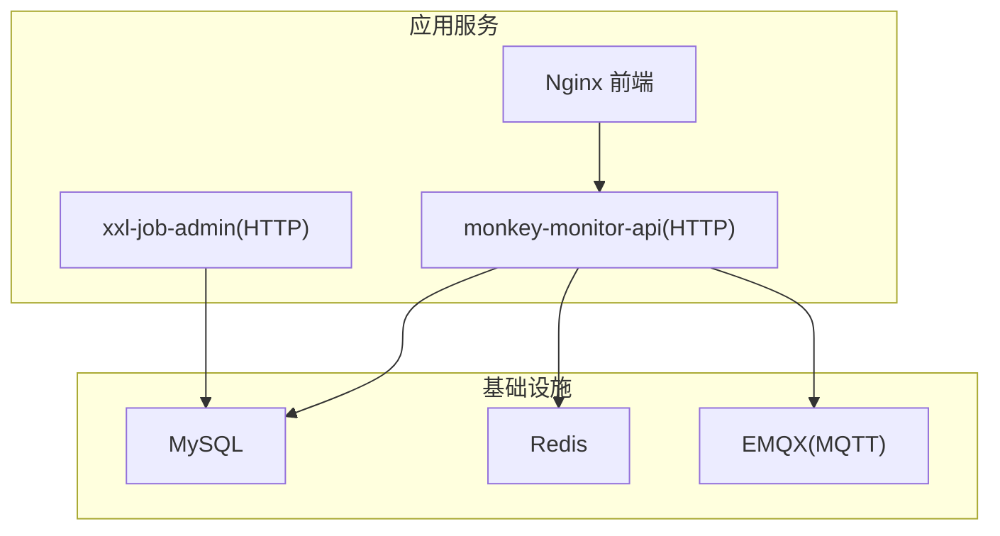
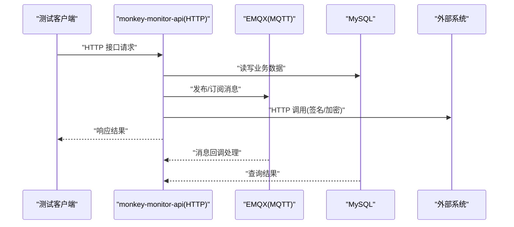
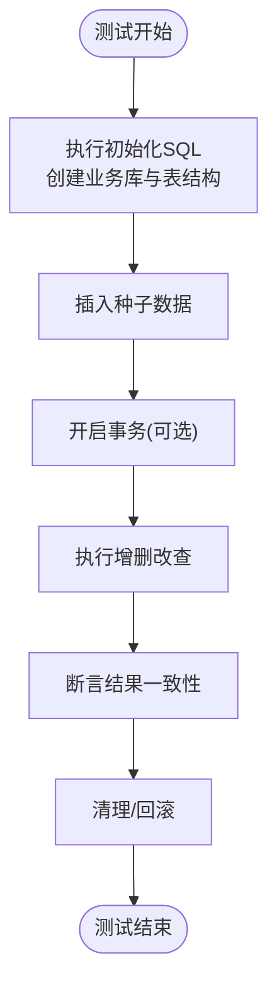
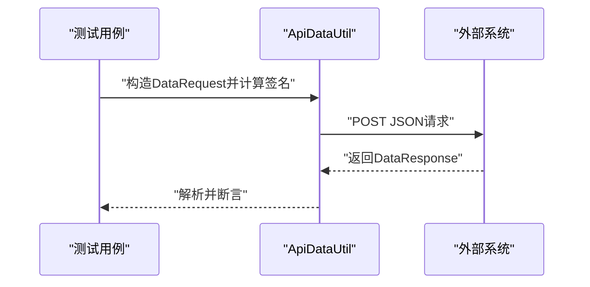
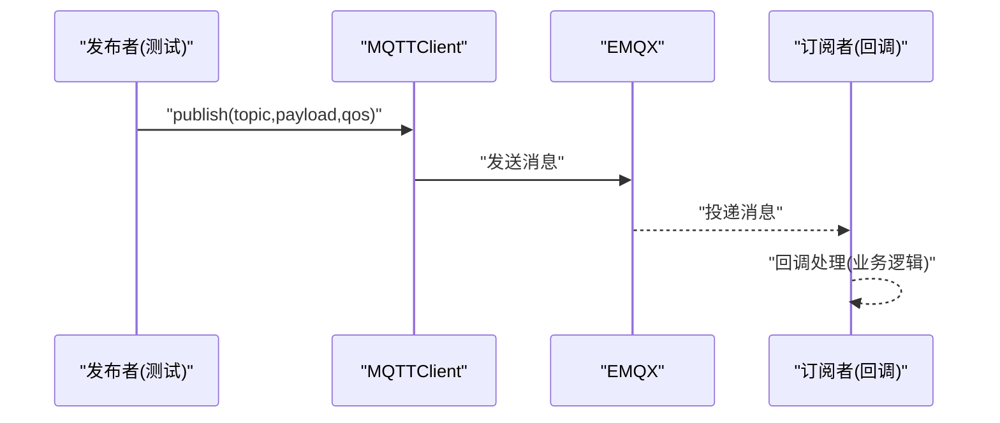
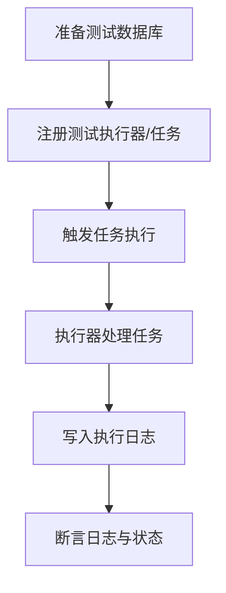
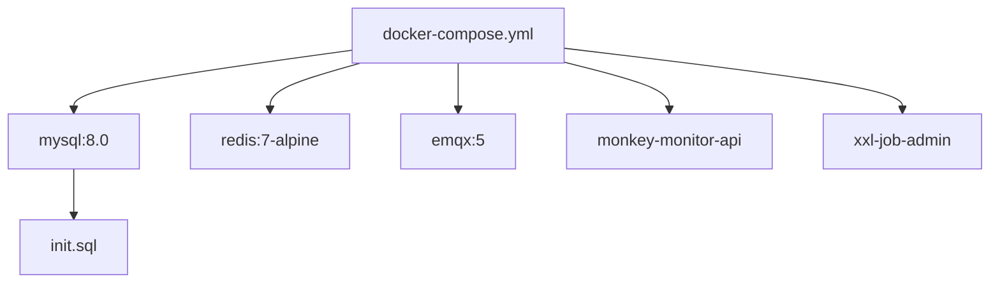
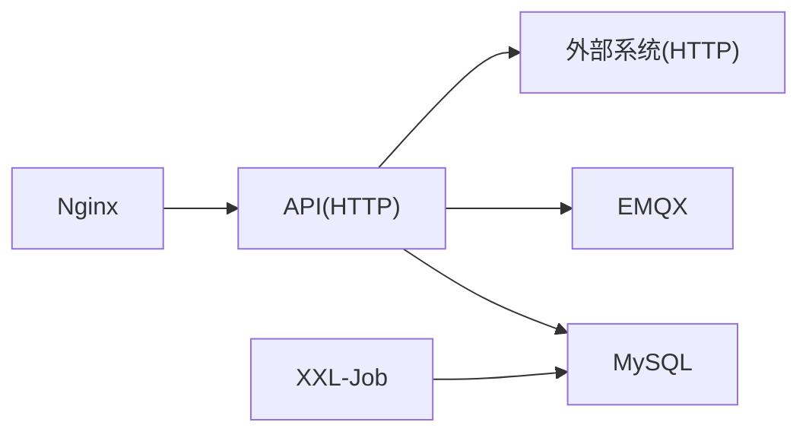

# 集成测试

<cite>
**本文引用的文件**
- [pom.xml](file://pom.xml)
- [application-test.yml](file://monkey-monitor-api/src/main/resources/application-test.yml)
- [docker-compose.yml](file://deploy/docker-compose.yml)
- [init.sql](file://deploy/init/init.sql)
- [DatabaseInitConfig.java](file://monkey-monitor/src/main/java/com/monkey/general/config/DatabaseInitConfig.java)
- [MyDataSourceAutoConfiguration.java](file://monkey-monitor/src/main/java/com/monkey/general/config/MyDataSourceAutoConfiguration.java)
- [MqttConfiguration.java](file://monkey-monitor/src/main/java/com/monkey/general/config/MqttConfiguration.java)
- [MyMqttConfiguration.java](file://monkey-monitor/src/main/java/com/monkey/general/config/mqtt/MyMqttConfiguration.java)
- [MQTTClient.java](file://monkey-monitor/src/main/java/com/monkey/general/config/mqtt/MQTTClient.java)
- [MQTTCallback.java](file://monkey-monitor/src/main/java/com/monkey/general/config/mqtt/MQTTCallback.java)
- [ApiDataUtil.java](file://monkey-monitor/src/main/java/com/monkey/general/modules/third/api/util/ApiDataUtil.java)
- [PayNotifyTest.java](file://monkey-monitor/src/main/java/com/monkey/general/modules/third/api/test/example/PayNotifyTest.java)
- [ScanLaneQrCodeTest.java](file://monkey-monitor/src/main/java/com/monkey/general/modules/third/api/test/example/ScanLaneQrCodeTest.java)
- [XxlDataBaseConfig.java](file://xxl-job-admin/src/main/java/com/xxl/job/admin/core/conf/XxlDataBaseConfig.java)
- [xxl_job.sql](file://xxl-job-admin/src/main/resources/sql/xxl_job.sql)
- [MonkeyMonitorApplicationTest.java](file://monkey-monitor-api/src/test/java/com/monkey/general/MonkeyMonitorApplicationTest.java)
</cite>

## 目录
1. [引言](#引言)
2. [项目结构](#项目结构)
3. [核心组件](#核心组件)
4. [架构总览](#架构总览)
5. [详细组件分析](#详细组件分析)
6. [依赖分析](#依赖分析)
7. [性能考虑](#性能考虑)
8. [故障排查指南](#故障排查指南)
9. [结论](#结论)
10. [附录](#附录)

## 引言
本指南面向安威 fireworks 物联网监控平台的集成测试实践，围绕服务间通信、数据库与外部系统集成展开，结合项目现有的 Docker 容器化部署、MQTT 消息通道、XXL-Job 调度系统以及第三方接口对接能力，给出可落地的测试设计原则、策略与实操步骤。同时，结合项目现有配置与实现，说明如何在测试环境中进行数据库初始化、MQTT 通信验证、外部接口联调与数据一致性校验。

## 项目结构
从测试视角，以下模块与集成测试密切相关：
- 平台 API 层：提供对外 HTTP 接口，承载业务入口与对外交互。
- 监控与采集层：负责 MQTT 消息接入、传感器数据处理与本地数据库写入。
- 调度与作业层：基于 XXL-Job 的定时任务与数据同步作业。
- 基础设施层：通过 Docker Compose 提供 MySQL、Redis、EMQX 等依赖服务。

图表来源
- [docker-compose.yml:1-103](file://deploy/docker-compose.yml#L1-L103)

章节来源
- [docker-compose.yml:1-103](file://deploy/docker-compose.yml#L1-L103)

## 核心组件
- 数据库初始化与连接
  - 通过数据库初始化配置在启动阶段确保目标业务库存在，并为后续集成测试提供一致的初始数据。
  - 数据源配置采用 HikariCP 连接池，便于在测试中快速建立/回收连接。
- MQTT 消息通道
  - 提供本地与外部传感器两类 MQTT 客户端配置，支持订阅/发布与断线重连策略，适合用于消息驱动型集成测试。
- 外部系统对接
  - 通过第三方接口工具类封装 HTTP 请求与签名逻辑，便于对“外部系统”进行集成测试与回归验证。
- 调度系统
  - XXL-Job 管理定时任务，测试中可验证任务触发、执行与日志记录的完整性。

章节来源
- [DatabaseInitConfig.java:1-75](file://monkey-monitor/src/main/java/com/monkey/general/config/DatabaseInitConfig.java#L1-L75)
- [MyDataSourceAutoConfiguration.java:34-50](file://monkey-monitor/src/main/java/com/monkey/general/config/MyDataSourceAutoConfiguration.java#L34-L50)
- [MqttConfiguration.java:1-53](file://monkey-monitor/src/main/java/com/monkey/general/config/MqttConfiguration.java#L1-L53)
- [MyMqttConfiguration.java:1-43](file://monkey-monitor/src/main/java/com/monkey/general/config/mqtt/MyMqttConfiguration.java#L1-L43)
- [MQTTClient.java:81-121](file://monkey-monitor/src/main/java/com/monkey/general/config/mqtt/MQTTClient.java#L81-L121)
- [MQTTCallback.java:1-33](file://monkey-monitor/src/main/java/com/monkey/general/config/mqtt/MQTTCallback.java#L1-L33)
- [ApiDataUtil.java:1-70](file://monkey-monitor/src/main/java/com/monkey/general/modules/third/api/util/ApiDataUtil.java#L1-L70)
- [XxlDataBaseConfig.java:1-69](file://xxl-job-admin/src/main/java/com/xxl/job/admin/core/conf/XxlDataBaseConfig.java#L1-L69)

## 架构总览
下图展示测试场景下的典型交互：API 服务作为入口，依赖数据库与 MQTT；对外部系统进行 HTTP 调用；XXL-Job 触发定时任务并写入日志。

图表来源
- [docker-compose.yml:1-103](file://deploy/docker-compose.yml#L1-L103)
- [ApiDataUtil.java:24-28](file://monkey-monitor/src/main/java/com/monkey/general/modules/third/api/util/ApiDataUtil.java#L24-L28)

## 详细组件分析

### 数据库集成测试
- 设计原则
  - 使用独立测试数据库或容器内初始化脚本，保证测试隔离与可重复性。
  - 在测试前执行初始化 SQL，确保表结构与种子数据一致。
  - 利用连接池在单测前后快速建立/释放连接，避免资源泄漏。
- 关键实现
  - 数据库初始化：启动时检测并创建业务库，避免测试环境反复准备。
  - 数据源配置：HikariCP 提供高性能连接池，适配测试并发场景。
- 测试策略
  - 初始化：在测试套件启动前，执行初始化脚本，插入必要的种子数据。
  - 验证：针对关键业务表进行读写一致性校验与索引/约束检查。
  - 清理：测试结束后回滚或重建测试库，避免污染。

图表来源
- [init.sql:1-219](file://deploy/init/init.sql#L1-L219)
- [DatabaseInitConfig.java:47-75](file://monkey-monitor/src/main/java/com/monkey/general/config/DatabaseInitConfig.java#L47-L75)
- [MyDataSourceAutoConfiguration.java:39-48](file://monkey-monitor/src/main/java/com/monkey/general/config/MyDataSourceAutoConfiguration.java#L39-L48)

章节来源
- [init.sql:1-219](file://deploy/init/init.sql#L1-L219)
- [DatabaseInitConfig.java:1-75](file://monkey-monitor/src/main/java/com/monkey/general/config/DatabaseInitConfig.java#L1-L75)
- [MyDataSourceAutoConfiguration.java:34-50](file://monkey-monitor/src/main/java/com/monkey/general/config/MyDataSourceAutoConfiguration.java#L34-L50)

### 服务间通信测试（HTTP）
- 设计原则
  - 使用真实或模拟的外部系统接口，验证请求签名、参数拼装与响应解析。
  - 对关键接口进行幂等性与错误分支测试。
- 关键实现
  - 第三方接口工具类封装 HTTP POST 与签名生成，便于在测试中构造请求与断言。
- 测试策略
  - 正向场景：构造合法请求，断言返回码与业务字段。
  - 异常场景：模拟网络异常、签名错误、参数缺失等，验证错误处理与日志记录。

图表来源
- [ApiDataUtil.java:24-52](file://monkey-monitor/src/main/java/com/monkey/general/modules/third/api/util/ApiDataUtil.java#L24-L52)
- [PayNotifyTest.java:30-56](file://monkey-monitor/src/main/java/com/monkey/general/modules/third/api/test/example/PayNotifyTest.java#L30-L56)
- [ScanLaneQrCodeTest.java:26-47](file://monkey-monitor/src/main/java/com/monkey/general/modules/third/api/test/example/ScanLaneQrCodeTest.java#L26-L47)

章节来源
- [ApiDataUtil.java:1-70](file://monkey-monitor/src/main/java/com/monkey/general/modules/third/api/util/ApiDataUtil.java#L1-L70)
- [PayNotifyTest.java:1-121](file://monkey-monitor/src/main/java/com/monkey/general/modules/third/api/test/example/PayNotifyTest.java#L1-L121)
- [ScanLaneQrCodeTest.java:1-50](file://monkey-monitor/src/main/java/com/monkey/general/modules/third/api/test/example/ScanLaneQrCodeTest.java#L1-L50)

### MQTT 消息集成测试
- 设计原则
  - 验证消息发布/订阅、回调处理与断线重连机制。
  - 使用测试专用主题与客户端标识，避免影响生产消息流。
- 关键实现
  - 本地与外部 MQTT 客户端配置，支持连接参数与自动重连。
  - 回调类中处理业务逻辑，注意异常处理避免断线重连。
- 测试策略
  - 发布测试消息，断言订阅端收到并正确解析。
  - 模拟网络抖动，验证自动重连与消息去重/幂等。

图表来源
- [MqttConfiguration.java:34-50](file://monkey-monitor/src/main/java/com/monkey/general/config/MqttConfiguration.java#L34-L50)
- [MyMqttConfiguration.java:35-43](file://monkey-monitor/src/main/java/com/monkey/general/config/mqtt/MyMqttConfiguration.java#L35-L43)
- [MQTTClient.java:83-118](file://monkey-monitor/src/main/java/com/monkey/general/config/mqtt/MQTTClient.java#L83-L118)
- [MQTTCallback.java:32-33](file://monkey-monitor/src/main/java/com/monkey/general/config/mqtt/MQTTCallback.java#L32-L33)

章节来源
- [MqttConfiguration.java:1-53](file://monkey-monitor/src/main/java/com/monkey/general/config/MqttConfiguration.java#L1-L53)
- [MyMqttConfiguration.java:1-43](file://monkey-monitor/src/main/java/com/monkey/general/config/mqtt/MyMqttConfiguration.java#L1-L43)
- [MQTTClient.java:81-121](file://monkey-monitor/src/main/java/com/monkey/general/config/mqtt/MQTTClient.java#L81-L121)
- [MQTTCallback.java:1-33](file://monkey-monitor/src/main/java/com/monkey/general/config/mqtt/MQTTCallback.java#L1-L33)

### XXL-Job 调度集成测试
- 设计原则
  - 验证任务注册、触发、执行与日志落库的完整链路。
  - 使用测试专用执行器与任务配置，避免干扰生产任务。
- 关键实现
  - 调度系统初始化数据库与表结构，测试前确保数据库可用。
- 测试策略
  - 注册测试任务，设置短周期或手动触发，断言日志表记录与状态变更。

图表来源
- [XxlDataBaseConfig.java:40-69](file://xxl-job-admin/src/main/java/com/xxl/job/admin/core/conf/XxlDataBaseConfig.java#L40-L69)
- [xxl_job.sql](file://xxl-job-admin/src/main/resources/sql/xxl_job.sql)

章节来源
- [XxlDataBaseConfig.java:1-69](file://xxl-job-admin/src/main/java/com/xxl/job/admin/core/conf/XxlDataBaseConfig.java#L1-L69)
- [xxl_job.sql](file://xxl-job-admin/src/main/resources/sql/xxl_job.sql)

### Docker 容器化测试环境
- 设计原则
  - 使用 Compose 统一编排数据库、消息中间件与应用服务，保证测试环境一致性。
  - 将初始化 SQL 挂载至数据库容器，确保首次启动即具备测试所需结构与数据。
- 关键实现
  - Compose 文件定义服务依赖与健康检查，确保应用在依赖就绪后再启动。
- 测试策略
  - 启动测试环境后，先执行数据库初始化，再运行集成测试套件。

图表来源
- [docker-compose.yml:6-24](file://deploy/docker-compose.yml#L6-L24)
- [init.sql:1-219](file://deploy/init/init.sql#L1-L219)

章节来源
- [docker-compose.yml:1-103](file://deploy/docker-compose.yml#L1-L103)
- [init.sql:1-219](file://deploy/init/init.sql#L1-L219)

### Spring Boot Test 高级用法与最佳实践
- 测试配置与属性覆盖
  - 使用测试配置文件提供隔离的数据库与外部服务地址，避免污染开发/生产环境。
- 事务管理与数据清理
  - 在测试方法上使用事务回滚，确保测试前后数据一致。
- SQL 执行与数据准备
  - 在测试前执行初始化 SQL，或使用测试专用数据种子。
- Mock 与外部依赖替换
  - 对第三方 HTTP 服务进行 Mock 或使用本地桩服务，降低外部依赖风险。

章节来源
- [application-test.yml:1-76](file://monkey-monitor-api/src/main/resources/application-test.yml#L1-L76)
- [pom.xml:64-101](file://pom.xml#L64-L101)

## 依赖分析
- 组件耦合
  - API 服务依赖数据库、Redis 与 MQTT；对外部系统进行 HTTP 调用；XXL-Job 独立管理任务生命周期。
- 外部依赖
  - MySQL、Redis、EMQX 通过 Compose 管理；XXL-Job 与 API 服务共享数据库。
- 循环依赖
  - 当前结构以 API 为中心向外辐射，未见明显循环依赖。

图表来源
- [docker-compose.yml:54-98](file://deploy/docker-compose.yml#L54-L98)

章节来源
- [docker-compose.yml:1-103](file://deploy/docker-compose.yml#L1-L103)

## 性能考虑
- 连接池与并发
  - 合理设置连接池大小与超时，避免测试并发过高导致连接争用。
- 消息吞吐
  - MQTT 测试中控制消息频率与批量大小，避免 broker 压力过大。
- 调度任务
  - 测试中使用短周期或手动触发，缩短验证链路时间。

## 故障排查指南
- 数据库问题
  - 检查初始化脚本是否执行成功，确认业务库与表是否存在。
  - 核对数据源连接参数与网络连通性。
- MQTT 问题
  - 校验 broker 地址、认证信息与订阅主题；关注回调异常与断线重连日志。
- 外部系统问题
  - 使用抓包或日志定位请求签名与响应解析环节的异常。
- 调度问题
  - 核查执行器注册状态与任务配置，查看日志表记录。

章节来源
- [DatabaseInitConfig.java:47-75](file://monkey-monitor/src/main/java/com/monkey/general/config/DatabaseInitConfig.java#L47-L75)
- [MQTTCallback.java:32-33](file://monkey-monitor/src/main/java/com/monkey/general/config/mqtt/MQTTCallback.java#L32-L33)
- [ApiDataUtil.java:24-52](file://monkey-monitor/src/main/java/com/monkey/general/modules/third/api/util/ApiDataUtil.java#L24-L52)
- [XxlDataBaseConfig.java:40-69](file://xxl-job-admin/src/main/java/com/xxl/job/admin/core/conf/XxlDataBaseConfig.java#L40-L69)

## 结论
通过容器化统一测试环境、完善的数据库初始化与连接池配置、MQTT 消息通道与第三方接口工具类，以及 XXL-Job 调度链路，安威 fireworks 平台具备了扎实的集成测试基础。建议在实际测试中遵循“隔离、幂等、可观测”的原则，配合 Mock 与本地桩服务，持续提升测试效率与稳定性。

## 附录
- 测试数据准备清单
  - 初始化 SQL：业务库与表结构、种子数据。
  - 测试配置：隔离的数据库连接与外部系统地址。
  - 种子数据：关键业务实体与关联数据，确保测试可重复。
- 调试技巧
  - 开启详细日志，定位消息投递与回调处理路径。
  - 使用抓包工具验证第三方接口请求与签名。
  - 在测试前预热数据库连接，减少首测延迟。