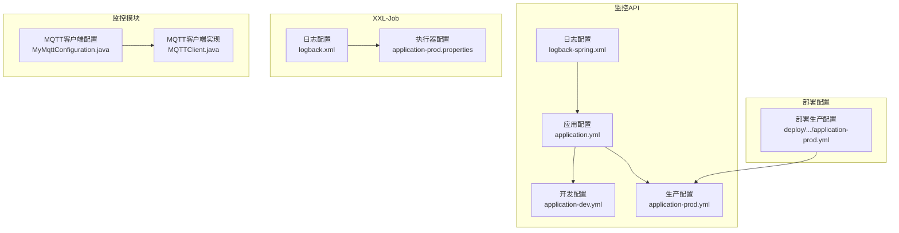
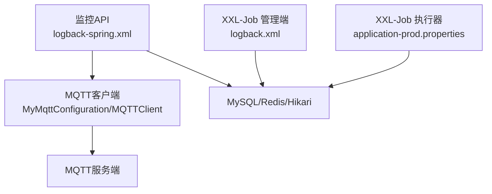
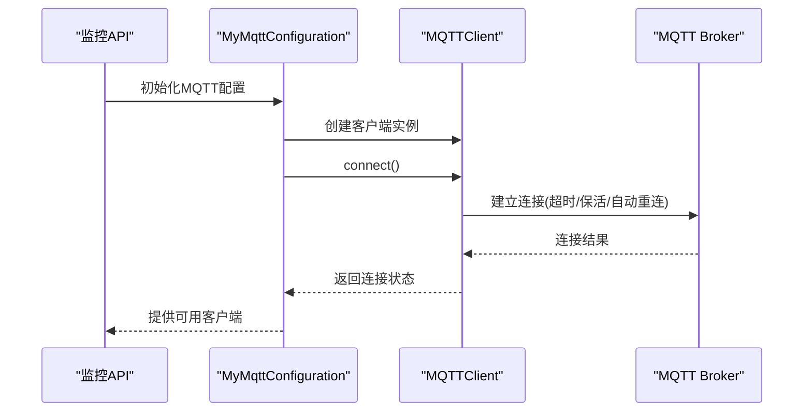
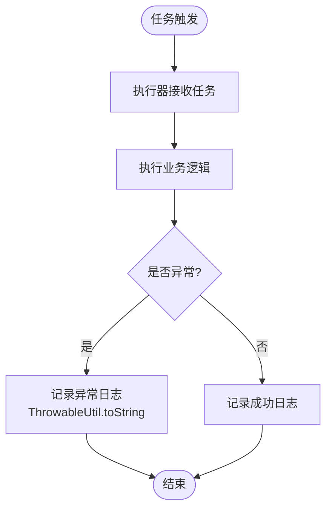
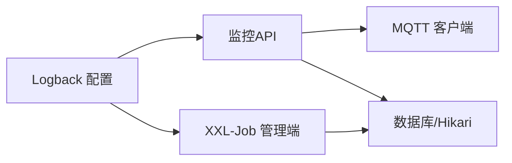

# 调试工具

<cite>
**本文引用的文件**
- [logback-spring.xml](file://monkey-monitor-api/src/main/resources/logback-spring.xml)
- [application.yml](file://monkey-monitor-api/src/main/resources/application.yml)
- [application-dev.yml](file://monkey-monitor-api/src/main/resources/application-dev.yml)
- [application-prod.yml](file://monkey-monitor-api/src/main/resources/application-prod.yml)
- [logback.xml](file://xxl-job-admin/src/main/resources/logback.xml)
- [application-prod.yml（部署配置）](file://deploy/config/monitor-api/application-prod.yml)
- [MyMqttConfiguration.java](file://monkey-monitor/src/main/java/com/monkey/general/config/mqtt/MyMqttConfiguration.java)
- [MQTTClient.java](file://monkey-monitor/src/main/java/com/monkey/general/config/mqtt/MQTTClient.java)
- [rebel.xml](file://monkey-monitor-api/src/main/resources/rebel.xml)
- [JobScheduleHelper.java](file://xxl-job-admin/src/main/java/com/xxl/job/admin/core/thread/JobScheduleHelper.java)
- [ThrowableUtil.java](file://xxl-job-core/src/main/java/com/xxl/job/core/util/ThrowableUtil.java)
- [application-prod.properties（xxl-job-admin）](file://deploy/config/xxl-job-admin/application-prod.properties)
</cite>

## 目录
1. [简介](#简介)
2. [项目结构与调试相关要点](#项目结构与调试相关要点)
3. [核心组件与调试配置](#核心组件与调试配置)
4. [架构总览与调试视角](#架构总览与调试视角)
5. [详细组件调试指南](#详细组件调试指南)
6. [依赖关系与日志配置分析](#依赖关系与日志配置分析)
7. [性能与资源调试建议](#性能与资源调试建议)
8. [故障排查与常见问题](#故障排查与常见问题)
9. [结论](#结论)
10. [附录：最佳实践清单](#附录最佳实践清单)

## 简介
本指南面向安威 fireworks 物联网监控平台的开发者与运维工程师，聚焦于调试工具与技巧，覆盖日志体系（Logback 配置、级别与输出格式）、常用调试手段（IDE/远程调试、断点策略）、性能分析（JVM/内存/线程）、网络调试（MQTT/HTTP）、数据库调试（连接与慢查询）、分布式链路与问题定位，以及常见问题的排查思路与最佳实践。

## 项目结构与调试相关要点
- 日志配置集中在各模块的资源目录，采用 Spring Boot 的 logback-spring.xml 或独立的 logback.xml，并通过 springProfile 切换 dev/test/prod 环境。
- MQTT 客户端在监控模块中集中配置，便于统一调试与重连策略。
- XXL-Job 管理端与执行器均具备日志与连接池配置，适合进行定时任务与数据库交互的调试。
- 开发环境提供 rebel.xml 支持热重载，提升迭代效率。

**图表来源**
- [logback-spring.xml:1-152](file://monkey-monitor-api/src/main/resources/logback-spring.xml#L1-L152)
- [application.yml:1-40](file://monkey-monitor-api/src/main/resources/application.yml#L1-L40)
- [application-dev.yml:1-206](file://monkey-monitor-api/src/main/resources/application-dev.yml#L1-L206)
- [application-prod.yml:1-198](file://monkey-monitor-api/src/main/resources/application-prod.yml#L1-L198)
- [logback.xml:1-82](file://xxl-job-admin/src/main/resources/logback.xml#L1-L82)
- [application-prod.properties（xxl-job-admin）:1-66](file://deploy/config/xxl-job-admin/application-prod.properties#L1-L66)
- [MyMqttConfiguration.java:1-57](file://monkey-monitor/src/main/java/com/monkey/general/config/mqtt/MyMqttConfiguration.java#L1-L57)
- [MQTTClient.java:41-83](file://monkey-monitor/src/main/java/com/monkey/general/config/mqtt/MQTTClient.java#L41-L83)
- [application-prod.yml（部署配置）:1-203](file://deploy/config/monitor-api/application-prod.yml#L1-L203)

**章节来源**
- [logback-spring.xml:1-152](file://monkey-monitor-api/src/main/resources/logback-spring.xml#L1-L152)
- [logback.xml:1-82](file://xxl-job-admin/src/main/resources/logback.xml#L1-L82)
- [MyMqttConfiguration.java:1-57](file://monkey-monitor/src/main/java/com/monkey/general/config/mqtt/MyMqttConfiguration.java#L1-L57)
- [MQTTClient.java:41-83](file://monkey-monitor/src/main/java/com/monkey/general/config/mqtt/MQTTClient.java#L41-L83)
- [application.yml:1-40](file://monkey-monitor-api/src/main/resources/application.yml#L1-L40)
- [application-dev.yml:1-206](file://monkey-monitor-api/src/main/resources/application-dev.yml#L1-L206)
- [application-prod.yml:1-198](file://monkey-monitor-api/src/main/resources/application-prod.yml#L1-L198)
- [application-prod.yml（部署配置）:1-203](file://deploy/config/monitor-api/application-prod.yml#L1-L203)
- [application-prod.properties（xxl-job-admin）:1-66](file://deploy/config/xxl-job-admin/application-prod.properties#L1-L66)

## 核心组件与调试配置
- 日志系统
  - 控制台与文件分离，按级别切分（INFO/WARN/ERROR），支持彩色输出与时间戳、线程、类名、行号等字段。
  - 环境切换：dev 开启 DEBUG 并输出到控制台与多文件；prod 默认 INFO，控制台仅 ERROR；test 与 prod 类似。
- 应用配置
  - 环境激活、Jackson 时间格式、MyBatis Plus Mapper 位置、实体包扫描、逻辑删除配置等。
- MQTT 调试
  - 统一配置项（host/port/username/password/clientId/timeout/keepalive），自动重连与回调处理。
- XXL-Job 调试
  - 管理端日志与连接池参数，执行器端口、日志路径与保留天数，便于任务执行链路与数据库交互的定位。

**章节来源**
- [logback-spring.xml:103-149](file://monkey-monitor-api/src/main/resources/logback-spring.xml#L103-L149)
- [application.yml:1-40](file://monkey-monitor-api/src/main/resources/application.yml#L1-L40)
- [MyMqttConfiguration.java:19-55](file://monkey-monitor/src/main/java/com/monkey/general/config/mqtt/MyMqttConfiguration.java#L19-L55)
- [MQTTClient.java:50-63](file://monkey-monitor/src/main/java/com/monkey/general/config/mqtt/MQTTClient.java#L50-L63)
- [application-prod.properties（xxl-job-admin）:31-41](file://deploy/config/xxl-job-admin/application-prod.properties#L31-L41)

## 架构总览与调试视角
下图展示日志、MQTT、数据库与任务调度在系统中的交互，便于从日志与网络两方面进行端到端调试。

**图表来源**
- [logback-spring.xml:1-152](file://monkey-monitor-api/src/main/resources/logback-spring.xml#L1-L152)
- [MyMqttConfiguration.java:1-57](file://monkey-monitor/src/main/java/com/monkey/general/config/mqtt/MyMqttConfiguration.java#L1-L57)
- [MQTTClient.java:41-83](file://monkey-monitor/src/main/java/com/monkey/general/config/mqtt/MQTTClient.java#L41-L83)
- [logback.xml:1-82](file://xxl-job-admin/src/main/resources/logback.xml#L1-L82)
- [application-prod.properties（xxl-job-admin）:25-41](file://deploy/config/xxl-job-admin/application-prod.properties#L25-L41)

## 详细组件调试指南

### 日志配置与调试（Logback）
- 输出格式
  - 控制台与文件分别定义 pattern，包含时间、级别、PID、线程、类名、行号、消息等字段，便于快速定位。
- 级别与环境
  - dev：根级别 INFO，组件日志可按需提升至 DEBUG（如 com.monkey.general）。
  - test/prod：根级别 INFO，控制台仅输出 ERROR（prod profile 下）。
- 文件滚动与保留
  - 按月/按日滚动，保留策略可配置；生产路径可指向共享目录以便集中采集。
- 建议
  - 临时提升特定包或控制器级别以复现场景，问题解决后恢复默认级别。
  - 在 CI/CD 中通过环境变量覆盖 spring.profiles.active 与日志路径。

**章节来源**
- [logback-spring.xml:6-28](file://monkey-monitor-api/src/main/resources/logback-spring.xml#L6-L28)
- [logback-spring.xml:103-149](file://monkey-monitor-api/src/main/resources/logback-spring.xml#L103-L149)
- [application.yml:5-7](file://monkey-monitor-api/src/main/resources/application.yml#L5-L7)

### MQTT 调试
- 连接与重连
  - 客户端在连接前设置超时、保活、自动重连；若连接失败会重试固定次数并记录错误日志。
- 主题与订阅
  - 通过配置文件定义主题（RYTopic/GWTopic2），可在调试时临时变更主题或增加订阅日志。
- 建议
  - 使用 MQTT 客户端工具（如 mosquitto_pub/sub 或浏览器插件）验证 broker 可达性与认证。
  - 在 MyMqttConfiguration 中增加连接前后的日志埋点，观察重连周期与异常栈。

**图表来源**
- [MyMqttConfiguration.java:35-55](file://monkey-monitor/src/main/java/com/monkey/general/config/mqtt/MyMqttConfiguration.java#L35-L55)
- [MQTTClient.java:50-63](file://monkey-monitor/src/main/java/com/monkey/general/config/mqtt/MQTTClient.java#L50-L63)

**章节来源**
- [MyMqttConfiguration.java:19-55](file://monkey-monitor/src/main/java/com/monkey/general/config/mqtt/MyMqttConfiguration.java#L19-L55)
- [MQTTClient.java:41-83](file://monkey-monitor/src/main/java/com/monkey/general/config/mqtt/MQTTClient.java#L41-L83)
- [application-dev.yml:33-57](file://monkey-monitor-api/src/main/resources/application-dev.yml#L33-L57)
- [application-prod.yml:30-54](file://monkey-monitor-api/src/main/resources/application-prod.yml#L30-L54)
- [application-prod.yml（部署配置）:30-54](file://deploy/config/monitor-api/application-prod.yml#L30-L54)

### HTTP 请求与接口调试
- Swagger 开启
  - 在配置中启用 Swagger，便于快速验证接口行为与参数校验。
- 建议
  - 使用 Postman/Insomnia/浏览器直接访问接口，结合日志级别临时提升 DEBUG 观察请求进入与响应路径。
  - 对上传/下载接口，关注 multipart 配置与文件大小限制。

**章节来源**
- [application-dev.yml:98-99](file://monkey-monitor-api/src/main/resources/application-dev.yml#L98-L99)
- [application-prod.yml:95-97](file://monkey-monitor-api/src/main/resources/application-prod.yml#L95-L97)
- [application.yml:27-29](file://monkey-monitor-api/src/main/resources/application.yml#L27-L29)

### 数据库与连接池调试
- 连接池参数
  - HikariCP 最小空闲、最大连接、连接超时、空闲超时、最大生存时间等，直接影响并发与稳定性。
- 建议
  - 在测试/生产配置中对比连接池参数，结合慢查询日志与事务隔离级别排查锁等待与超时。
  - 使用 EXPLAIN 分析慢查询，必要时增加索引或拆分查询。

**章节来源**
- [application-dev.yml:12-15](file://monkey-monitor-api/src/main/resources/application-dev.yml#L12-L15)
- [application-prod.yml:9-12](file://monkey-monitor-api/src/main/resources/application-prod.yml#L9-L12)
- [application-prod.properties（xxl-job-admin）:31-41](file://deploy/config/xxl-job-admin/application-prod.properties#L31-L41)

### XXL-Job 调度与日志调试
- 管理端
  - 日志按级别输出，连接池参数可调；可通过管理端查看任务执行状态与日志。
- 执行器
  - 执行器端口、日志路径与保留天数可配置，便于定位任务执行链路与数据库交互问题。
- 建议
  - 将异常堆栈转为字符串记录，结合日志定位具体失败步骤。

**图表来源**
- [JobScheduleHelper.java:170-200](file://xxl-job-admin/src/main/java/com/xxl/job/admin/core/thread/JobScheduleHelper.java#L170-L200)
- [ThrowableUtil.java:17-22](file://xxl-job-core/src/main/java/com/xxl/job/core/util/ThrowableUtil.java#L17-L22)

**章节来源**
- [logback.xml:1-82](file://xxl-job-admin/src/main/resources/logback.xml#L1-L82)
- [application-prod.properties（xxl-job-admin）:11-13](file://deploy/config/xxl-job-admin/application-prod.properties#L11-L13)
- [application-prod.properties（xxl-job-admin）:31-41](file://deploy/config/xxl-job-admin/application-prod.properties#L31-L41)
- [JobScheduleHelper.java:170-200](file://xxl-job-admin/src/main/java/com/xxl/job/admin/core/thread/JobScheduleHelper.java#L170-L200)
- [ThrowableUtil.java:1-24](file://xxl-job-core/src/main/java/com/xxl/job/core/util/ThrowableUtil.java#L1-L24)

### 开发与热重载调试（IDE/JRebel）
- JRebel 配置
  - rebel.xml 映射 IDE 工作区与目标 classes，支持热重载，减少重启成本。
- 建议
  - 修改业务代码后无需重启，直接刷新页面或重新触发接口验证。

**章节来源**
- [rebel.xml:1-16](file://monkey-monitor-api/src/main/resources/rebel.xml#L1-L16)

## 依赖关系与日志配置分析
- 组件耦合
  - 监控 API 依赖 MQTT 客户端进行设备数据接入；XXL-Job 管理端与执行器通过数据库交互；日志配置贯穿各模块。
- 日志依赖
  - Logback 通过 Spring Profile 控制输出目标与级别；文件滚动策略影响日志收集与分析效率。
- 建议
  - 统一日志标签（如 traceId）与上下文，便于跨服务串联。

**图表来源**
- [logback-spring.xml:1-152](file://monkey-monitor-api/src/main/resources/logback-spring.xml#L1-L152)
- [logback.xml:1-82](file://xxl-job-admin/src/main/resources/logback.xml#L1-L82)
- [MyMqttConfiguration.java:1-57](file://monkey-monitor/src/main/java/com/monkey/general/config/mqtt/MyMqttConfiguration.java#L1-L57)
- [application-prod.properties（xxl-job-admin）:25-41](file://deploy/config/xxl-job-admin/application-prod.properties#L25-L41)

## 性能与资源调试建议
- JVM 监控
  - 使用 JMX/VisualVM/JProfiler 连接进程，观察堆、GC、线程状态与 CPU 占用。
- 内存分析
  - 生成 Heap Dump，定位大对象与泄漏点；结合日志中的异常与耗时接口进行交叉验证。
- 线程分析
  - 生成线程快照，识别死锁、长时间阻塞与热点线程。
- 数据库性能
  - 结合连接池指标与慢查询日志，定位热点 SQL 与锁竞争。

[本节为通用建议，不直接分析具体文件]

## 故障排查与常见问题
- 启动问题
  - 检查 application.yml 的环境激活与端口占用；查看 logback 输出的启动阶段日志。
- MQTT 连接问题
  - 校验 broker 地址、认证信息与 keepalive/timeout；使用外部工具验证 broker 可达性；查看客户端重连日志。
- HTTP 接口问题
  - 启用 Swagger，核对请求参数与返回结构；临时提升日志级别观察请求进入与异常。
- 数据库连接问题
  - 对比 dev/prod 的连接池参数；检查连接超时、最大连接与空闲回收策略；结合慢查询定位瓶颈。
- XXL-Job 调度异常
  - 查看管理端日志与执行器日志；确认执行器端口与注册地址；异常堆栈通过工具类转换为字符串便于检索。

**章节来源**
- [application.yml:1-40](file://monkey-monitor-api/src/main/resources/application.yml#L1-L40)
- [MyMqttConfiguration.java:35-55](file://monkey-monitor/src/main/java/com/monkey/general/config/mqtt/MyMqttConfiguration.java#L35-L55)
- [application-dev.yml:33-57](file://monkey-monitor-api/src/main/resources/application-dev.yml#L33-L57)
- [application-prod.yml:30-54](file://monkey-monitor-api/src/main/resources/application-prod.yml#L30-L54)
- [application-prod.yml（部署配置）:1-203](file://deploy/config/monitor-api/application-prod.yml#L1-L203)
- [JobScheduleHelper.java:170-200](file://xxl-job-admin/src/main/java/com/xxl/job/admin/core/thread/JobScheduleHelper.java#L170-L200)
- [ThrowableUtil.java:1-24](file://xxl-job-core/src/main/java/com/xxl/job/core/util/ThrowableUtil.java#L1-L24)

## 结论
通过规范化的日志配置、明确的调试流程与工具链（IDE/JRebel、MQTT/HTTP/数据库/XXL-Job），可显著提升安威 fireworks 平台的问题定位与修复效率。建议在开发与测试环境中持续完善日志与监控，形成可追溯、可量化的调试闭环。

## 附录：最佳实践清单
- 日志
  - 使用 Spring Profile 管理 dev/test/prod 级别；为关键路径增加上下文字段（如 traceId）。
- 调试
  - 临时提升日志级别定位问题，问题修复后恢复默认；使用断点与条件断点缩小范围。
- MQTT
  - 统一配置项与自动重连策略；外部工具验证 broker；记录连接前后关键事件。
- HTTP
  - 启用 Swagger 快速验证；关注文件上传大小与超时。
- 数据库
  - 合理设置连接池参数；定期分析慢查询与锁等待。
- XXL-Job
  - 统一日志路径与保留策略；异常堆栈字符串化便于检索；核对执行器端口与注册地址。

[本节为通用建议，不直接分析具体文件]