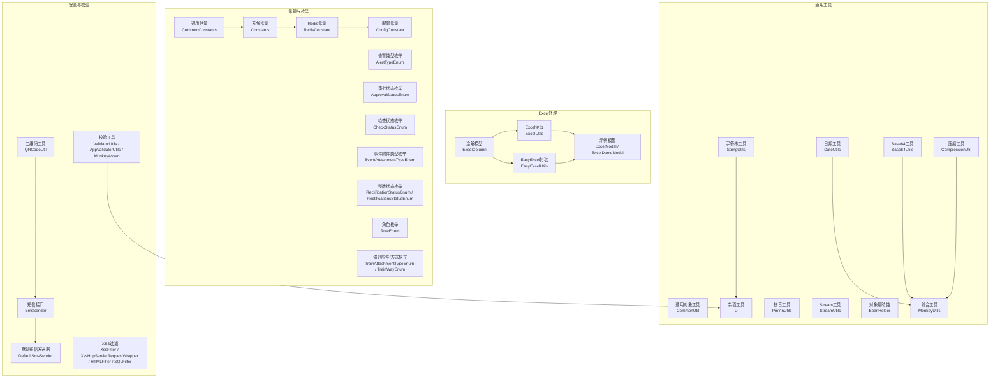
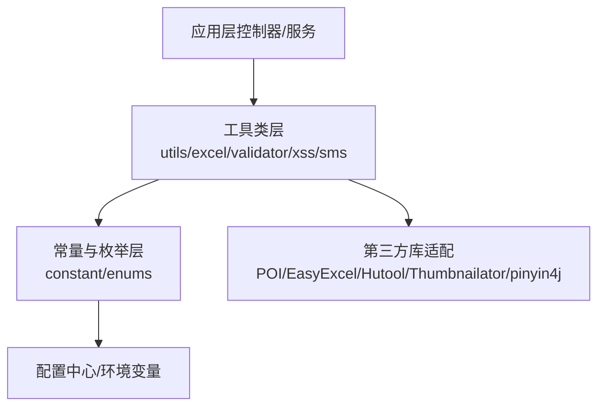
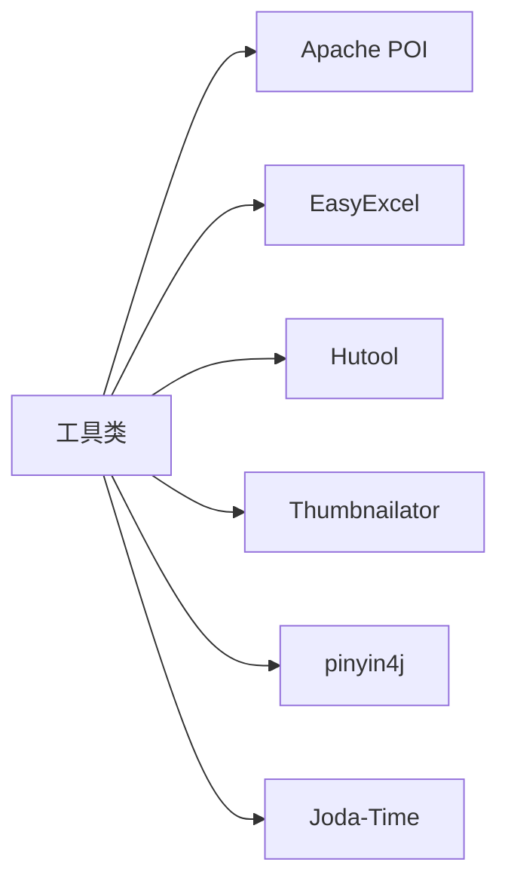

# 通用工具类

<cite>
**本文引用的文件**
- [StringUtils.java](file://monkey-common/src/main/java/com/monkey/general/common/utils/StringUtils.java)
- [DateUtils.java](file://monkey-common/src/main/java/com/monkey/general/common/utils/DateUtils.java)
- [Base64Utils.java](file://monkey-common/src/main/java/com/monkey/general/common/utils/Base64Utils.java)
- [CommonUtil.java](file://monkey-common/src/main/java/com/monkey/general/common/utils/CommonUtil.java)
- [MonkeyUtils.java](file://monkey-common/src/main/java/com/monkey/general/common/utils/MonkeyUtils.java)
- [CompressionUtil.java](file://monkey-common/src/main/java/com/monkey/general/common/utils/CompressionUtil.java)
- [PinYinUtils.java](file://monkey-common/src/main/java/com/monkey/general/common/utils/PinYinUtils.java)
- [StreamUtils.java](file://monkey-common/src/main/java/com/monkey/general/common/utils/StreamUtils.java)
- [U.java](file://monkey-common/src/main/java/com/monkey/general/common/utils/U.java)
- [BeanHelper.java](file://monkey-common/src/main/java/com/monkey/general/common/utils/BeanHelper.java)
- [ExcelUtils.java](file://monkey-common/src/main/java/com/monkey/general/common/excel/ExcelUtils.java)
- [EasyExcelUtils.java](file://monkey-common/src/main/java/com/monkey/general/common/excel/EasyExcelUtils.java)
- [ExcelModel.java](file://monkey-common/src/main/java/com/monkey/general/common/excel/ExcelModel.java)
- [ExcelDemoModel.java](file://monkey-common/src/main/java/com/monkey/general/common/excel/ExcelDemoModel.java)
- [ExcelColumn.java](file://monkey-common/src/main/java/com/monkey/general/common/excel/ExcelColumn.java)
- [CommonConstants.java](file://monkey-common/src/main/java/com/monkey/general/common/constant/CommonConstants.java)
- [Constants.java](file://monkey-common/src/main/java/com/monkey/general/common/constant/Constants.java)
- [RedisConstant.java](file://monkey-common/src/main/java/com/monkey/general/common/constant/RedisConstant.java)
- [ConfigConstant.java](file://monkey-common/src/main/java/com/monkey/general/common/utils/ConfigConstant.java)
- [AlertTypeEnum.java](file://monkey-common/src/main/java/com/monkey/general/common/enums/AlertTypeEnum.java)
- [ApprovalStatusEnum.java](file://monkey-common/src/main/java/com/monkey/general/common/enums/ApprovalStatusEnum.java)
- [CheckStatusEnum.java](file://monkey-common/src/main/java/com/monkey/general/common/enums/CheckStatusEnum.java)
- [EventAttachmentTypeEnum.java](file://monkey-common/src/main/java/com/monkey/general/common/enums/EventAttachmentTypeEnum.java)
- [RectificationStatusEnum.java](file://monkey-common/src/main/java/com/monkey/general/common/enums/RectificationStatusEnum.java)
- [RectificationsStatusEnum.java](file://monkey-common/src/main/java/com/monkey/general/common/enums/RectificationsStatusEnum.java)
- [RoleEnum.java](file://monkey-common/src/main/java/com/monkey/general/common/enums/RoleEnum.java)
- [TrainAttachmentTypeEnum.java](file://monkey-common/src/main/java/com/monkey/general/common/enums/TrainAttachmentTypeEnum.java)
- [TrainWayEnum.java](file://monkey-common/src/main/java/com/monkey/general/common/enums/TrainWayEnum.java)
- [MonkeyCustomException.java](file://monkey-common/src/main/java/com/monkey/general/common/exception/MonkeyCustomException.java)
- [QRCodeUtil.java](file://monkey-common/src/main/java/com/monkey/general/common/qrcode/QRCodeUtil.java)
- [DefaultSmsSender.java](file://monkey-common/src/main/java/com/monkey/general/common/sms/DefaultSmsSender.java)
- [SmsSender.java](file://monkey-common/src/main/java/com/monkey/general/common/sms/SmsSender.java)
- [HTMLFilter.java](file://monkey-common/src/main/java/com/monkey/general/common/xss/HTMLFilter.java)
- [SQLFilter.java](file://monkey-common/src/main/java/com/monkey/general/common/xss/SQLFilter.java)
- [XssFilter.java](file://monkey-common/src/main/java/com/monkey/general/common/xss/XssFilter.java)
- [XssHttpServletRequestWrapper.java](file://monkey-common/src/main/java/com/monkey/general/common/xss/XssHttpServletRequestWrapper.java)
- [AppValidatorUtils.java](file://monkey-common/src/main/java/com/monkey/general/common/validator/AppValidatorUtils.java)
- [MonkeyAssert.java](file://monkey-common/src/main/java/com/monkey/general/common/validator/MonkeyAssert.java)
- [ValidatorUtils.java](file://monkey-common/src/main/java/com/monkey/general/common/validator/ValidatorUtils.java)
</cite>

## 目录
1. [简介](#简介)
2. [项目结构](#项目结构)
3. [核心组件](#核心组件)
4. [架构总览](#架构总览)
5. [详细组件分析](#详细组件分析)
6. [依赖分析](#依赖分析)
7. [性能考虑](#性能考虑)
8. [故障排查指南](#故障排查指南)
9. [结论](#结论)
10. [附录](#附录)

## 简介
本指南面向安威 fireworks 物联网监控平台的通用工具类，系统性介绍字符串处理、日期时间、加密解密、文件与图片压缩、Excel 处理、对象与集合工具、拼音与二维码、短信发送、XSS/SQL 过滤、校验断言等常用工具方法的使用方式与最佳实践。同时涵盖常量定义与配置管理、枚举类型设计与使用、异常处理与自定义异常、工具类扩展开发指南，以及在各模块中的应用场景与注意事项。

## 项目结构
通用工具类集中于 monkey-common 模块的 utils、excel、enums、constant、exception、qrcode、sms、xss、validator 等包中，形成横跨多个业务领域的基础能力库。

**图表来源**
- [StringUtils.java:1-34](file://monkey-common/src/main/java/com/monkey/general/common/utils/StringUtils.java#L1-L34)
- [DateUtils.java:1-289](file://monkey-common/src/main/java/com/monkey/general/common/utils/DateUtils.java#L1-L289)
- [Base64Utils.java:1-326](file://monkey-common/src/main/java/com/monkey/general/common/utils/Base64Utils.java#L1-L326)
- [CommonUtil.java:1-35](file://monkey-common/src/main/java/com/monkey/general/common/utils/CommonUtil.java#L1-L35)
- [MonkeyUtils.java:1-149](file://monkey-common/src/main/java/com/monkey/general/common/utils/MonkeyUtils.java#L1-L149)
- [CompressionUtil.java:1-84](file://monkey-common/src/main/java/com/monkey/general/common/utils/CompressionUtil.java#L1-L84)
- [PinYinUtils.java:1-71](file://monkey-common/src/main/java/com/monkey/general/common/utils/PinYinUtils.java#L1-L71)
- [StreamUtils.java:1-60](file://monkey-common/src/main/java/com/monkey/general/common/utils/StreamUtils.java#L1-L60)
- [U.java:1-313](file://monkey-common/src/main/java/com/monkey/general/common/utils/U.java#L1-L313)
- [BeanHelper.java:1-66](file://monkey-common/src/main/java/com/monkey/general/common/utils/BeanHelper.java#L1-L66)
- [ExcelUtils.java:1-454](file://monkey-common/src/main/java/com/monkey/general/common/excel/ExcelUtils.java#L1-L454)
- [EasyExcelUtils.java:1-149](file://monkey-common/src/main/java/com/monkey/general/common/excel/EasyExcelUtils.java#L1-L149)
- [ExcelModel.java:1-28](file://monkey-common/src/main/java/com/monkey/general/common/excel/ExcelModel.java#L1-L28)
- [ExcelDemoModel.java:1-25](file://monkey-common/src/main/java/com/monkey/general/common/excel/ExcelDemoModel.java#L1-L25)
- [ExcelColumn.java:1-18](file://monkey-common/src/main/java/com/monkey/general/common/excel/ExcelColumn.java#L1-L18)
- [CommonConstants.java](file://monkey-common/src/main/java/com/monkey/general/common/constant/CommonConstants.java)
- [Constants.java](file://monkey-common/src/main/java/com/monkey/general/common/constant/Constants.java)
- [RedisConstant.java](file://monkey-common/src/main/java/com/monkey/general/common/constant/RedisConstant.java)
- [ConfigConstant.java](file://monkey-common/src/main/java/com/monkey/general/common/utils/ConfigConstant.java)
- [AlertTypeEnum.java](file://monkey-common/src/main/java/com/monkey/general/common/enums/AlertTypeEnum.java)
- [ApprovalStatusEnum.java](file://monkey-common/src/main/java/com/monkey/general/common/enums/ApprovalStatusEnum.java)
- [CheckStatusEnum.java](file://monkey-common/src/main/java/com/monkey/general/common/enums/CheckStatusEnum.java)
- [EventAttachmentTypeEnum.java](file://monkey-common/src/main/java/com/monkey/general/common/enums/EventAttachmentTypeEnum.java)
- [RectificationStatusEnum.java](file://monkey-common/src/main/java/com/monkey/general/common/enums/RectificationStatusEnum.java)
- [RectificationsStatusEnum.java](file://monkey-common/src/main/java/com/monkey/general/common/enums/RectificationsStatusEnum.java)
- [RoleEnum.java](file://monkey-common/src/main/java/com/monkey/general/common/enums/RoleEnum.java)
- [TrainAttachmentTypeEnum.java](file://monkey-common/src/main/java/com/monkey/general/common/enums/TrainAttachmentTypeEnum.java)
- [TrainWayEnum.java](file://monkey-common/src/main/java/com/monkey/general/common/enums/TrainWayEnum.java)
- [QRCodeUtil.java](file://monkey-common/src/main/java/com/monkey/general/common/qrcode/QRCodeUtil.java)
- [DefaultSmsSender.java](file://monkey-common/src/main/java/com/monkey/general/common/sms/DefaultSmsSender.java)
- [SmsSender.java](file://monkey-common/src/main/java/com/monkey/general/common/sms/SmsSender.java)
- [HTMLFilter.java](file://monkey-common/src/main/java/com/monkey/general/common/xss/HTMLFilter.java)
- [SQLFilter.java](file://monkey-common/src/main/java/com/monkey/general/common/xss/SQLFilter.java)
- [XssFilter.java](file://monkey-common/src/main/java/com/monkey/general/common/xss/XssFilter.java)
- [XssHttpServletRequestWrapper.java](file://monkey-common/src/main/java/com/monkey/general/common/xss/XssHttpServletRequestWrapper.java)
- [AppValidatorUtils.java](file://monkey-common/src/main/java/com/monkey/general/common/validator/AppValidatorUtils.java)
- [MonkeyAssert.java](file://monkey-common/src/main/java/com/monkey/general/common/validator/MonkeyAssert.java)
- [ValidatorUtils.java](file://monkey-common/src/main/java/com/monkey/general/common/validator/ValidatorUtils.java)

**章节来源**
- [CommonConstants.java](file://monkey-common/src/main/java/com/monkey/general/common/constant/CommonConstants.java)
- [Constants.java](file://monkey-common/src/main/java/com/monkey/general/common/constant/Constants.java)
- [RedisConstant.java](file://monkey-common/src/main/java/com/monkey/general/common/constant/RedisConstant.java)
- [ConfigConstant.java](file://monkey-common/src/main/java/com/monkey/general/common/utils/ConfigConstant.java)

## 核心组件
- 字符串处理：提供字符串切分、空白判断等静态方法，便于输入清洗与格式化。
- 日期时间：提供多种格式化、加减运算、周区间计算、小时段区间生成、字符串转日期等。
- 加密与编码：提供 Base64 编解码、SHA1 签名、图片转 Base64、URL 图片转 Base64、图片尺寸估算与压缩等。
- 文件与流处理：提供递归删除、流转字节数组并压缩、集合分组与抽取、对象属性拷贝忽略空值等。
- Excel 处理：支持基于 Apache POI 的读写与注解映射；提供基于 EasyExcel 的下载封装与注解反射取头。
- 拼音与二维码：提供汉字转拼音（含全拼与首字母）、二维码生成工具。
- 安全与校验：提供 XSS/SQL 过滤、短信发送接口与默认实现、断言与校验工具。
- 枚举与常量：提供业务枚举与系统常量、Redis 常量、配置常量，统一管理标识与键名。

**章节来源**
- [StringUtils.java:1-34](file://monkey-common/src/main/java/com/monkey/general/common/utils/StringUtils.java#L1-L34)
- [DateUtils.java:1-289](file://monkey-common/src/main/java/com/monkey/general/common/utils/DateUtils.java#L1-L289)
- [Base64Utils.java:1-326](file://monkey-common/src/main/java/com/monkey/general/common/utils/Base64Utils.java#L1-L326)
- [CommonUtil.java:1-35](file://monkey-common/src/main/java/com/monkey/general/common/utils/CommonUtil.java#L1-L35)
- [MonkeyUtils.java:1-149](file://monkey-common/src/main/java/com/monkey/general/common/utils/MonkeyUtils.java#L1-L149)
- [CompressionUtil.java:1-84](file://monkey-common/src/main/java/com/monkey/general/common/utils/CompressionUtil.java#L1-L84)
- [PinYinUtils.java:1-71](file://monkey-common/src/main/java/com/monkey/general/common/utils/PinYinUtils.java#L1-L71)
- [StreamUtils.java:1-60](file://monkey-common/src/main/java/com/monkey/general/common/utils/StreamUtils.java#L1-L60)
- [U.java:1-313](file://monkey-common/src/main/java/com/monkey/general/common/utils/U.java#L1-L313)
- [BeanHelper.java:1-66](file://monkey-common/src/main/java/com/monkey/general/common/utils/BeanHelper.java#L1-L66)
- [ExcelUtils.java:1-454](file://monkey-common/src/main/java/com/monkey/general/common/excel/ExcelUtils.java#L1-L454)
- [EasyExcelUtils.java:1-149](file://monkey-common/src/main/java/com/monkey/general/common/excel/EasyExcelUtils.java#L1-L149)
- [ExcelModel.java:1-28](file://monkey-common/src/main/java/com/monkey/general/common/excel/ExcelModel.java#L1-L28)
- [ExcelDemoModel.java:1-25](file://monkey-common/src/main/java/com/monkey/general/common/excel/ExcelDemoModel.java#L1-L25)
- [ExcelColumn.java:1-18](file://monkey-common/src/main/java/com/monkey/general/common/excel/ExcelColumn.java#L1-L18)
- [QRCodeUtil.java](file://monkey-common/src/main/java/com/monkey/general/common/qrcode/QRCodeUtil.java)
- [DefaultSmsSender.java](file://monkey-common/src/main/java/com/monkey/general/common/sms/DefaultSmsSender.java)
- [SmsSender.java](file://monkey-common/src/main/java/com/monkey/general/common/sms/SmsSender.java)
- [HTMLFilter.java](file://monkey-common/src/main/java/com/monkey/general/common/xss/HTMLFilter.java)
- [SQLFilter.java](file://monkey-common/src/main/java/com/monkey/general/common/xss/SQLFilter.java)
- [XssFilter.java](file://monkey-common/src/main/java/com/monkey/general/common/xss/XssFilter.java)
- [XssHttpServletRequestWrapper.java](file://monkey-common/src/main/java/com/monkey/general/common/xss/XssHttpServletRequestWrapper.java)
- [AppValidatorUtils.java](file://monkey-common/src/main/java/com/monkey/general/common/validator/AppValidatorUtils.java)
- [MonkeyAssert.java](file://monkey-common/src/main/java/com/monkey/general/common/validator/MonkeyAssert.java)
- [ValidatorUtils.java](file://monkey-common/src/main/java/com/monkey/general/common/validator/ValidatorUtils.java)

## 架构总览
通用工具类遵循“静态工具类 + 注解 + 枚举 + 常量”的分层设计，既可独立使用，也可组合复用，降低模块间耦合，提升代码可维护性与可测试性。

[本图为概念性架构示意，无需代码来源]

## 详细组件分析

### 字符串处理工具（StringUtils）
- 功能要点
  - 字符串按固定长度切分
  - 判断空白字符序列
- 使用建议
  - 输入清洗优先使用 isBlank
  - 切分用于分页或协议报文拆分
- 性能提示
  - 切分算法为线性遍历，注意超长字符串的内存占用

**章节来源**
- [StringUtils.java:1-34](file://monkey-common/src/main/java/com/monkey/general/common/utils/StringUtils.java#L1-L34)

### 日期时间工具（DateUtils）
- 功能要点
  - 多种日期格式常量
  - 日期格式化与字符串解析
  - 周起止日期、24小时前时间
  - 秒/分/时/天/周/月/年加减
  - 年龄差、月份/日获取
  - 小时段区间生成
- 使用建议
  - 统一使用常量格式，避免硬编码
  - 跨时区场景需明确时区设置
- 性能提示
  - 使用 Joda-Time 与 Java 8 时间 API 结合，避免频繁构造格式化器

**章节来源**
- [DateUtils.java:1-289](file://monkey-common/src/main/java/com/monkey/general/common/utils/DateUtils.java#L1-L289)

### Base64 与图片处理（Base64Utils）
- 功能要点
  - 文件转 Base64、Base64 写文件
  - URL 图片转 Base64
  - 图片缩放与大小估算
  - 从 Base64 推断图片格式
  - 字符串编解码
- 使用建议
  - 大图建议先缩放再转 Base64
  - 注意网络请求异常与空数据处理
- 性能提示
  - 图片缩放采用递归策略，注意深度与循环控制

**章节来源**
- [Base64Utils.java:1-326](file://monkey-common/src/main/java/com/monkey/general/common/utils/Base64Utils.java#L1-L326)

### 通用对象工具（CommonUtil）
- 功能要点
  - 为实体空参数设置默认值（字符串/整型/金额）
- 使用建议
  - 与 DTO/VO 组合使用，确保前端渲染稳定

**章节来源**
- [CommonUtil.java:1-35](file://monkey-common/src/main/java/com/monkey/general/common/utils/CommonUtil.java#L1-L35)

### 综合工具（MonkeyUtils）
- 功能要点
  - 手机号脱敏
  - 订单号生成（含前缀）
  - 秒级时间戳
  - UUID 生成
  - 字符串 Object 非空判断
  - 递归删除文件/目录
  - SHA1 签名
- 使用建议
  - 订单号生成结合业务前缀与随机位
  - 脱敏仅用于展示，存储仍需加密策略

**章节来源**
- [MonkeyUtils.java:1-149](file://monkey-common/src/main/java/com/monkey/general/common/utils/MonkeyUtils.java#L1-L149)

### 压缩工具（CompressionUtil）
- 功能要点
  - 流转字节数组并按目标大小压缩
  - 自适应精度压缩
- 使用建议
  - 适合上传图片预处理，控制文件大小
- 性能提示
  - 多次迭代压缩，注意日志与异常捕获

**章节来源**
- [CompressionUtil.java:1-84](file://monkey-common/src/main/java/com/monkey/general/common/utils/CompressionUtil.java#L1-L84)

### 拼音工具（PinYinUtils）
- 功能要点
  - 汉字转拼音（全拼/首字母）
- 使用建议
  - 多音字取首个读音，复杂场景需定制

**章节来源**
- [PinYinUtils.java:1-71](file://monkey-common/src/main/java/com/monkey/general/common/utils/PinYinUtils.java#L1-L71)

### Stream 工具（StreamUtils）
- 功能要点
  - 将源集合按键分组，填充到目标集合
  - 字段抽取与集合转 Map
- 使用建议
  - 与 Lombok/DTO 配合，减少样板代码

**章节来源**
- [StreamUtils.java:1-60](file://monkey-common/src/main/java/com/monkey/general/common/utils/StreamUtils.java#L1-L60)

### 杂项工具（U）
- 功能要点
  - 对象转字符串、空值判断
  - 随机数生成
  - 字符串分片
  - 集合交集
  - 均匀分配
  - 右下角水印（文本）
  - Base64 图片生成
  - 十分钟粒度字符串
- 使用建议
  - 水印功能需注意版权与合规

**章节来源**
- [U.java:1-313](file://monkey-common/src/main/java/com/monkey/general/common/utils/U.java#L1-L313)

### 对象帮助类（BeanHelper）
- 功能要点
  - 获取对象中为 null 的属性名
  - 忽略空值复制属性
- 使用建议
  - 与 CommonUtil 组合，完善对象初始化

**章节来源**
- [BeanHelper.java:1-66](file://monkey-common/src/main/java/com/monkey/general/common/utils/BeanHelper.java#L1-L66)

### Excel 处理（ExcelUtils）
- 功能要点
  - 读取上传/本地/流式 Excel，按注解映射到实体
  - 写出 Excel 至文件或浏览器下载
  - 单元格类型自动识别与转换
- 使用建议
  - 实体字段需配合 ExcelColumn 注解
  - 注意大文件读取内存占用与异常处理

**章节来源**
- [ExcelUtils.java:1-454](file://monkey-common/src/main/java/com/monkey/general/common/excel/ExcelUtils.java#L1-L454)
- [ExcelColumn.java:1-18](file://monkey-common/src/main/java/com/monkey/general/common/excel/ExcelColumn.java#L1-L18)
- [ExcelModel.java:1-28](file://monkey-common/src/main/java/com/monkey/general/common/excel/ExcelModel.java#L1-L28)
- [ExcelDemoModel.java:1-25](file://monkey-common/src/main/java/com/monkey/general/common/excel/ExcelDemoModel.java#L1-L25)

### EasyExcel 封装（EasyExcelUtils）
- 功能要点
  - 下载失败时返回 JSON
  - 反射获取注解值构建表头
  - 自定义表头生成
- 使用建议
  - 与实体类的 ExcelProperty 注解配合
  - 注意响应流关闭策略

**章节来源**
- [EasyExcelUtils.java:1-149](file://monkey-common/src/main/java/com/monkey/general/common/excel/EasyExcelUtils.java#L1-L149)

### 常量与配置管理
- 通用常量（CommonConstants）
- 系统常量（Constants）
- Redis 常量（RedisConstant）
- 配置常量（ConfigConstant）
- 使用建议
  - 所有键名、标识、阈值集中管理，避免散落
  - 新增常量需同步更新文档与测试

**章节来源**
- [CommonConstants.java](file://monkey-common/src/main/java/com/monkey/general/common/constant/CommonConstants.java)
- [Constants.java](file://monkey-common/src/main/java/com/monkey/general/common/constant/Constants.java)
- [RedisConstant.java](file://monkey-common/src/main/java/com/monkey/general/common/constant/RedisConstant.java)
- [ConfigConstant.java](file://monkey-common/src/main/java/com/monkey/general/common/utils/ConfigConstant.java)

### 枚举类型
- 业务枚举：告警类型、审批状态、检查状态、事件附件类型、整改状态、角色、培训附件/方式等
- 设计原则
  - 明确语义与取值范围
  - 提供转换/校验方法（如有需要）
- 使用建议
  - 与数据库/前端保持一致映射
  - 新增枚举需评审与兼容性评估

**章节来源**
- [AlertTypeEnum.java](file://monkey-common/src/main/java/com/monkey/general/common/enums/AlertTypeEnum.java)
- [ApprovalStatusEnum.java](file://monkey-common/src/main/java/com/monkey/general/common/enums/ApprovalStatusEnum.java)
- [CheckStatusEnum.java](file://monkey-common/src/main/java/com/monkey/general/common/enums/CheckStatusEnum.java)
- [EventAttachmentTypeEnum.java](file://monkey-common/src/main/java/com/monkey/general/common/enums/EventAttachmentTypeEnum.java)
- [RectificationStatusEnum.java](file://monkey-common/src/main/java/com/monkey/general/common/enums/RectificationStatusEnum.java)
- [RectificationsStatusEnum.java](file://monkey-common/src/main/java/com/monkey/general/common/enums/RectificationsStatusEnum.java)
- [RoleEnum.java](file://monkey-common/src/main/java/com/monkey/general/common/enums/RoleEnum.java)
- [TrainAttachmentTypeEnum.java](file://monkey-common/src/main/java/com/monkey/general/common/enums/TrainAttachmentTypeEnum.java)
- [TrainWayEnum.java](file://monkey-common/src/main/java/com/monkey/general/common/enums/TrainWayEnum.java)

### 异常处理与自定义异常
- 自定义异常（MonkeyCustomException）
- 使用建议
  - 统一异常包装与错误码
  - 与全局异常处理器配合

**章节来源**
- [MonkeyCustomException.java](file://monkey-common/src/main/java/com/monkey/general/common/exception/MonkeyCustomException.java)

### 安全与校验
- 二维码工具（QRCodeUtil）
- 短信发送接口（SmsSender）与默认实现（DefaultSmsSender）
- XSS/SQL 过滤（XssFilter、XssHttpServletRequestWrapper、HTMLFilter、SQLFilter）
- 校验工具（ValidatorUtils、AppValidatorUtils、MonkeyAssert）
- 使用建议
  - 输入严格校验，输出安全过滤
  - 短信发送需对接真实通道并记录日志

**章节来源**
- [QRCodeUtil.java](file://monkey-common/src/main/java/com/monkey/general/common/qrcode/QRCodeUtil.java)
- [DefaultSmsSender.java](file://monkey-common/src/main/java/com/monkey/general/common/sms/DefaultSmsSender.java)
- [SmsSender.java](file://monkey-common/src/main/java/com/monkey/general/common/sms/SmsSender.java)
- [HTMLFilter.java](file://monkey-common/src/main/java/com/monkey/general/common/xss/HTMLFilter.java)
- [SQLFilter.java](file://monkey-common/src/main/java/com/monkey/general/common/xss/SQLFilter.java)
- [XssFilter.java](file://monkey-common/src/main/java/com/monkey/general/common/xss/XssFilter.java)
- [XssHttpServletRequestWrapper.java](file://monkey-common/src/main/java/com/monkey/general/common/xss/XssHttpServletRequestWrapper.java)
- [AppValidatorUtils.java](file://monkey-common/src/main/java/com/monkey/general/common/validator/AppValidatorUtils.java)
- [MonkeyAssert.java](file://monkey-common/src/main/java/com/monkey/general/common/validator/MonkeyAssert.java)
- [ValidatorUtils.java](file://monkey-common/src/main/java/com/monkey/general/common/validator/ValidatorUtils.java)

## 依赖分析
- 工具类内部低耦合，通过静态方法提供能力
- 第三方依赖集中在 Apache POI、EasyExcel、Hutool、Thumbnailator、pinyin4j、Joda-Time 等
- 建议统一版本管理，避免冲突

[本图为概念性依赖示意，无需代码来源]

## 性能考虑
- 字符串与日期处理：尽量复用格式化器，避免重复构造
- 图片处理：大图先缩放，控制 Base64 长度，注意内存峰值
- Excel 读写：大文件建议分批处理或流式写入，及时释放资源
- 压缩：自适应精度策略，避免过度迭代
- Stream 工具：大数据量时注意中间集合大小，必要时使用流式处理

[本节为通用性能建议，无需具体文件来源]

## 故障排查指南
- Excel 读取异常
  - 检查文件格式与注解映射
  - 关注空行与空单元格处理
- Base64/图片异常
  - 网络请求失败与空数据分支
  - 图片格式推断失败回退策略
- 压缩失败
  - 捕获异常并记录日志
  - 检查输入字节是否有效
- XSS/SQL 过滤
  - 确认过滤链生效与请求包装
- 校验失败
  - 使用断言工具快速定位问题字段

**章节来源**
- [ExcelUtils.java:1-454](file://monkey-common/src/main/java/com/monkey/general/common/excel/ExcelUtils.java#L1-L454)
- [Base64Utils.java:1-326](file://monkey-common/src/main/java/com/monkey/general/common/utils/Base64Utils.java#L1-L326)
- [CompressionUtil.java:1-84](file://monkey-common/src/main/java/com/monkey/general/common/utils/CompressionUtil.java#L1-L84)
- [XssFilter.java](file://monkey-common/src/main/java/com/monkey/general/common/xss/XssFilter.java)
- [XssHttpServletRequestWrapper.java](file://monkey-common/src/main/java/com/monkey/general/common/xss/XssHttpServletRequestWrapper.java)
- [MonkeyAssert.java](file://monkey-common/src/main/java/com/monkey/general/common/validator/MonkeyAssert.java)

## 结论
通用工具类为平台提供了统一、可复用的基础能力，建议在新增功能时优先复用现有工具，遵循统一命名与使用规范，持续完善常量、枚举与异常体系，确保系统稳定性与可维护性。

[本节为总结性内容，无需具体文件来源]

## 附录

### 工具类使用示例（路径指引）
- 字符串切分与空白判断
  - [StringUtils.splitStr(...):5-17](file://monkey-common/src/main/java/com/monkey/general/common/utils/StringUtils.java#L5-L17)
  - [StringUtils.isBlank(...):19-32](file://monkey-common/src/main/java/com/monkey/general/common/utils/StringUtils.java#L19-L32)
- 日期格式化与加减
  - [DateUtils.format(...):69-99](file://monkey-common/src/main/java/com/monkey/general/common/utils/DateUtils.java#L69-L99)
  - [DateUtils.addDateDays(...):171-174](file://monkey-common/src/main/java/com/monkey/general/common/utils/DateUtils.java#L171-L174)
- Base64 编解码与图片处理
  - [Base64Utils.encode(...):306-322](file://monkey-common/src/main/java/com/monkey/general/common/utils/Base64Utils.java#L306-L322)
  - [Base64Utils.GenerateImage(...):57-83](file://monkey-common/src/main/java/com/monkey/general/common/utils/Base64Utils.java#L57-L83)
  - [Base64Utils.scaleImage(...):142-184](file://monkey-common/src/main/java/com/monkey/general/common/utils/Base64Utils.java#L142-L184)
- 对象默认值与属性拷贝
  - [CommonUtil.setDefaultsToNullParameter(...):14-33](file://monkey-common/src/main/java/com/monkey/general/common/utils/CommonUtil.java#L14-L33)
  - [BeanHelper.copyPropertiesIgnoreNull(...):44-64](file://monkey-common/src/main/java/com/monkey/general/common/utils/BeanHelper.java#L44-L64)
- Excel 读写
  - [ExcelUtils.readExcel(...):47-194](file://monkey-common/src/main/java/com/monkey/general/common/excel/ExcelUtils.java#L47-L194)
  - [ExcelUtils.writeExcel(...):206-295](file://monkey-common/src/main/java/com/monkey/general/common/excel/ExcelUtils.java#L206-L295)
  - [EasyExcelUtils.downloadFailedUsingJson(...):34-95](file://monkey-common/src/main/java/com/monkey/general/common/excel/EasyExcelUtils.java#L34-L95)
- 拼音与二维码
  - [PinYinUtils.hanZiToPinYin(...):18-36](file://monkey-common/src/main/java/com/monkey/general/common/utils/PinYinUtils.java#L18-L36)
  - [QRCodeUtil.generate(...)](file://monkey-common/src/main/java/com/monkey/general/common/qrcode/QRCodeUtil.java)
- 校验与断言
  - [ValidatorUtils.validate(...)](file://monkey-common/src/main/java/com/monkey/general/common/validator/ValidatorUtils.java)
  - [MonkeyAssert.notNull(...)](file://monkey-common/src/main/java/com/monkey/general/common/validator/MonkeyAssert.java)

### 扩展开发指南
- 新增工具方法
  - 命名清晰，职责单一
  - 提供必要的参数校验与异常处理
  - 补充单元测试与使用示例
- 扩展现有工具类
  - 保持向后兼容
  - 更新常量与枚举映射
  - 文档同步更新

[本节为通用指导，无需具体文件来源]