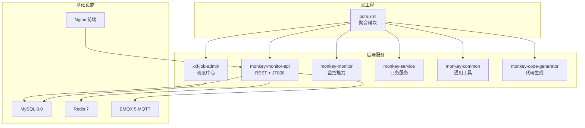
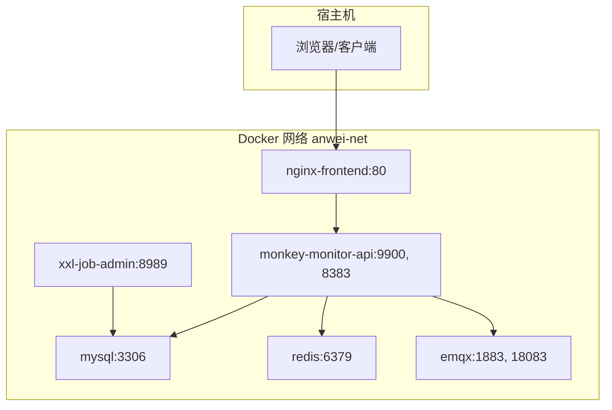
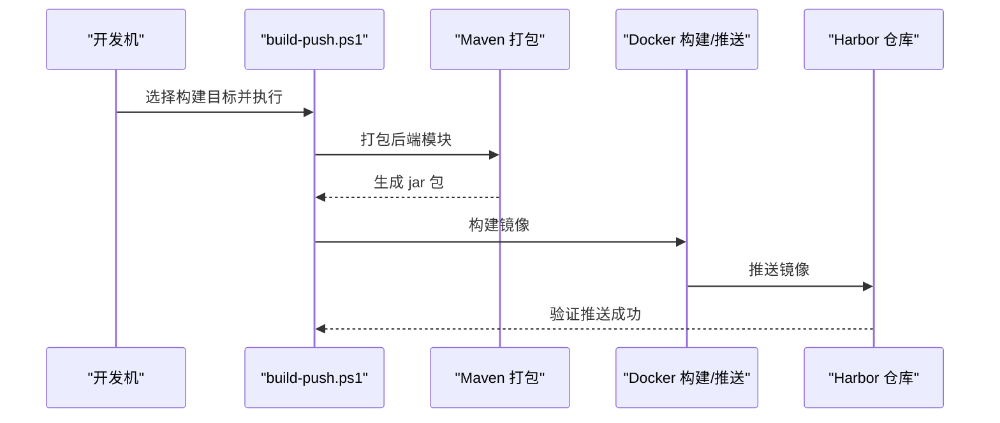
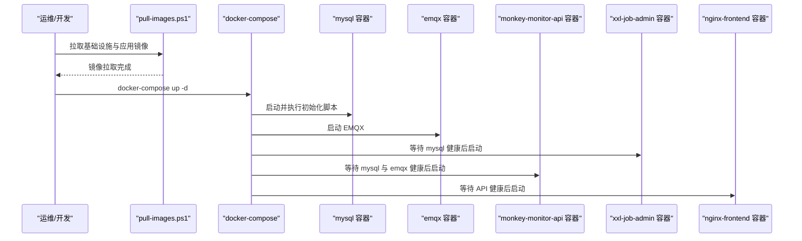
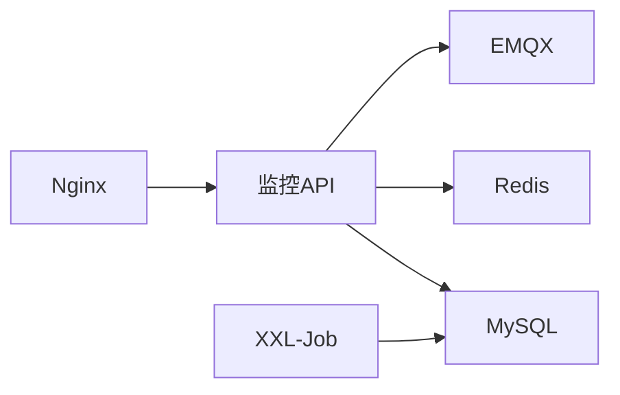

# 快速开始

<cite>
**本文引用的文件**
- [pom.xml](file://pom.xml)
- [部署操作手册.md](file://deploy/部署操作手册.md)
- [docker-compose.yml](file://deploy/docker-compose.yml)
- [init.sql](file://deploy/init/init.sql)
- [application-dev.yml（监控API）](file://monkey-monitor-api/src/main/resources/application-dev.yml)
- [application-prod.yml（监控API）](file://deploy/config/monitor-api/application-prod.yml)
- [application-dev.properties（XXL-Job）](file://xxl-job-admin/src/main/resources/application-dev.properties)
- [application-prod.properties（XXL-Job）](file://deploy/config/xxl-job-admin/application-prod.properties)
- [Dockerfile（监控API）](file://monkey-monitor-api/Dockerfile)
- [Dockerfile（XXL-Job）](file://xxl-job-admin/Dockerfile)
- [build-push.ps1](file://deploy/build-push.ps1)
- [pull-images.ps1](file://deploy/pull-images.ps1)
</cite>

## 目录
1. [简介](#简介)
2. [项目结构](#项目结构)
3. [核心组件](#核心组件)
4. [架构总览](#架构总览)
5. [详细组件分析](#详细组件分析)
6. [依赖分析](#依赖分析)
7. [性能考虑](#性能考虑)
8. [故障排查指南](#故障排查指南)
9. [结论](#结论)
10. [附录](#附录)

## 简介
本指南面向新加入的开发者，帮助你在约30分钟内完成安威 fireworks 物联网监控平台的本地开发环境搭建与验证。内容涵盖：
- 环境准备（JDK 8+、Maven、MySQL、Redis、EMQX）
- 项目克隆、依赖安装与数据库初始化
- 本地开发配置与启动顺序
- Docker 部署全流程（镜像构建、拉取、启动、验证）
- 基本使用示例（访问界面、添加设备、查看告警）
- 常见启动问题排查

## 项目结构
该项目采用多模块 Maven 结构，核心模块包括：
- 父工程（聚合模块）
- 监控 API 模块（对外提供 REST 与 JT808 服务）
- XXL-Job 管理模块（分布式任务调度）
- 监控能力模块（MQTT 接入、视频联动、告警处理等）
- 通用工具与公共模块
- 代码生成器模块
- 前端静态资源（通过 Nginx 提供）

图表来源
- [pom.xml:11-16](file://pom.xml#L11-L16)
- [docker-compose.yml:3-103](file://deploy/docker-compose.yml#L3-L103)

章节来源
- [pom.xml:11-16](file://pom.xml#L11-L16)
- [部署操作手册.md:5-22](file://deploy/部署操作手册.md#L5-L22)

## 核心组件
- 监控 API（REST + JT808）：提供设备接入、告警、数据同步、视频联动等接口。
- XXL-Job 管理台：提供任务调度、执行器管理、日志查询等功能。
- 基础设施：MySQL（业务+调度库）、Redis（缓存）、EMQX（MQTT Broker）、Nginx（反向代理）。

章节来源
- [部署操作手册.md:26-42](file://deploy/部署操作手册.md#L26-L42)
- [docker-compose.yml:6-103](file://deploy/docker-compose.yml#L6-L103)

## 架构总览
下图展示了容器化部署下的服务依赖与端口映射关系：

图表来源
- [docker-compose.yml:6-103](file://deploy/docker-compose.yml#L6-L103)
- [部署操作手册.md:28-42](file://deploy/部署操作手册.md#L28-L42)

## 详细组件分析

### 本地开发环境搭建（30分钟指南）
- 步骤 1：准备环境
  - JDK 8+（建议使用与项目一致的版本）
  - Maven（用于本地打包）
  - MySQL（用于本地开发）
  - Redis（可选，部分功能依赖）
  - EMQX（MQTT Broker，本地或远程均可）
- 步骤 2：克隆与依赖
  - 使用 Maven 聚合工程进行构建，确保所有模块依赖正确引入。
- 步骤 3：数据库初始化
  - 使用初始化脚本创建业务库与调度库，并导入基础表结构与数据。
- 步骤 4：配置文件修改
  - 修改监控 API 的开发配置，确保数据库、Redis、MQTT、XXL-Job 等地址正确。
  - 修改 XXL-Job 的开发配置，确保数据库连接与访问令牌一致。
- 步骤 5：启动顺序
  - 先启动 MySQL 与 EMQX，再启动 XXL-Job 管理台，最后启动监控 API。
  - 访问前端页面与管理台进行验证。

章节来源
- [pom.xml:23-62](file://pom.xml#L23-L62)
- [init.sql:1-219](file://deploy/init/init.sql#L1-L219)
- [application-dev.yml（监控API）:4-136](file://monkey-monitor-api/src/main/resources/application-dev.yml#L4-L136)
- [application-dev.properties（XXL-Job）:21-47](file://xxl-job-admin/src/main/resources/application-dev.properties#L21-L47)

### Docker 部署（从镜像构建到容器启动）
- 镜像构建与推送（开发机）
  - 使用提供的 PowerShell 脚本自动检测 JDK、前后端目录，支持交互式选择构建目标。
  - 构建后端模块（监控 API 与 XXL-Job）并推送至 Harbor。
- 镜像拉取（目标服务器）
  - 从 Harbor 拉取基础设施镜像与应用镜像。
- 配置环境变量
  - 编辑 .env 文件，设置 Harbor 地址、镜像仓库、版本号、MySQL 与 EMQX 密码等。
- 启动服务
  - 使用 docker-compose 启动所有服务，应用服务会等待 MySQL 与 EMQX 健康后再启动。
- 验证部署
  - 访问前端、监控 API、XXL-Job 管理台、EMQX 管理台，以及通过命令查看数据库。

图表来源
- [build-push.ps1:100-236](file://deploy/build-push.ps1#L100-L236)

图表来源
- [pull-images.ps1:26-50](file://deploy/pull-images.ps1#L26-L50)
- [docker-compose.yml:6-103](file://deploy/docker-compose.yml#L6-L103)

章节来源
- [部署操作手册.md:46-245](file://deploy/部署操作手册.md#L46-L245)
- [build-push.ps1:149-236](file://deploy/build-push.ps1#L149-L236)
- [pull-images.ps1:21-50](file://deploy/pull-images.ps1#L21-L50)

### 配置文件要点（本地与生产）
- 监控 API（开发/生产）
  - 数据库连接、Redis、MQTT（本地与传感器）、XXL-Job 执行器配置、文件上传路径等。
- XXL-Job（开发/生产）
  - 数据库连接、访问令牌、调度线程池大小、日志保留天数等。

章节来源
- [application-dev.yml（监控API）:4-136](file://monkey-monitor-api/src/main/resources/application-dev.yml#L4-L136)
- [application-prod.yml（监控API）:6-134](file://deploy/config/monitor-api/application-prod.yml#L6-L134)
- [application-dev.properties（XXL-Job）:21-54](file://xxl-job-admin/src/main/resources/application-dev.properties#L21-L54)
- [application-prod.properties（XXL-Job）:26-65](file://deploy/config/xxl-job-admin/application-prod.properties#L26-L65)

### Dockerfile 与镜像暴露端口
- 监控 API：基于 openjdk:8-jre-slim，暴露 9900（REST）、8383（JT808）。
- XXL-Job：基于 openjdk:8-jre-slim，暴露 8989。

章节来源
- [Dockerfile（监控API）:1-6](file://monkey-monitor-api/Dockerfile#L1-L6)
- [Dockerfile（XXL-Job）:1-6](file://xxl-job-admin/Dockerfile#L1-L6)

## 依赖分析
- 组件耦合
  - 监控 API 依赖 MySQL、Redis、EMQX；XXL-Job 依赖 MySQL；Nginx 依赖监控 API。
- 外部依赖
  - MySQL、Redis、EMQX、Nginx、OpenJDK 8、Harbor（镜像仓库）。
- 依赖可视化

图表来源
- [docker-compose.yml:6-103](file://deploy/docker-compose.yml#L6-L103)

章节来源
- [docker-compose.yml:6-103](file://deploy/docker-compose.yml#L6-L103)

## 性能考虑
- 连接池与线程池
  - 建议根据并发量调整 Hikari 连接池大小与 XXL-Job 触发线程池上限。
- 日志与存储
  - 控制日志保留天数，避免磁盘占用过高；合理设置文件上传路径与大小限制。
- 网络与 MQTT
  - MQTT 服务与监控 API 的超时与保活参数需结合设备网络质量调整。

## 故障排查指南
- MySQL 初始化失败
  - 确认初始化脚本已挂载到容器并执行；检查数据库字符集与时区设置。
- 服务启动顺序异常
  - 确保 docker-compose 的健康检查与 depends_on 生效；先启动 MySQL 与 EMQX。
- 监控 API 无法连接数据库/Redis/MQTT
  - 检查 application-prod.yml 中的 host、port、用户名、密码；确保容器间网络互通。
- XXL-Job 管理台无法访问或任务未执行
  - 检查 application-prod.properties 的数据库连接与 accessToken；确认执行器注册与地址配置。
- 前端无法访问
  - 检查 Nginx 反向代理配置与端口映射；确认监控 API 健康。

章节来源
- [init.sql:1-219](file://deploy/init/init.sql#L1-L219)
- [docker-compose.yml:6-103](file://deploy/docker-compose.yml#L6-L103)
- [application-prod.yml（监控API）:6-134](file://deploy/config/monitor-api/application-prod.yml#L6-L134)
- [application-prod.properties（XXL-Job）:26-65](file://deploy/config/xxl-job-admin/application-prod.properties#L26-L65)

## 结论
通过本指南，你可以在本地快速完成环境准备、项目构建、数据库初始化与服务启动，并掌握 Docker 部署的完整流程。遇到问题时，可依据故障排查章节逐项核对配置与依赖关系，确保系统稳定运行。

## 附录

### 基本使用示例
- 访问监控界面
  - 前端地址：http://<服务器IP>
- 访问监控 API
  - REST 接口：http://<服务器IP>:9900
- 访问 XXL-Job 管理台
  - 地址：http://<服务器IP>:8989/xxl-job-admin
- 添加设备与查看告警
  - 通过前端或 API 文档进行设备注册与告警订阅；MQTT 主题可在配置中查看。

章节来源
- [部署操作手册.md:198-207](file://deploy/部署操作手册.md#L198-L207)
- [application-prod.yml（监控API）:50-54](file://deploy/config/monitor-api/application-prod.yml#L50-L54)