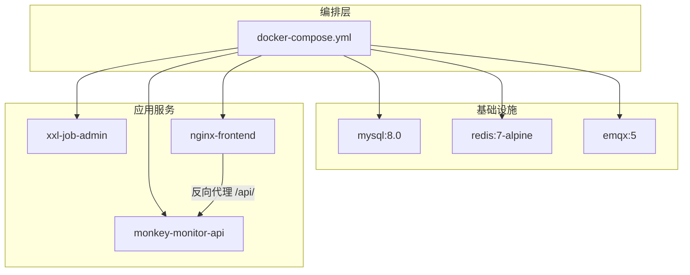
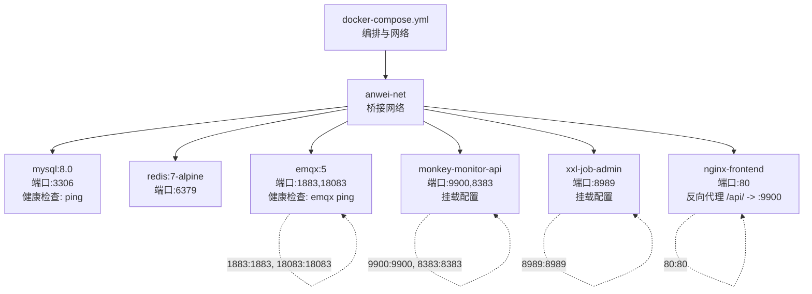
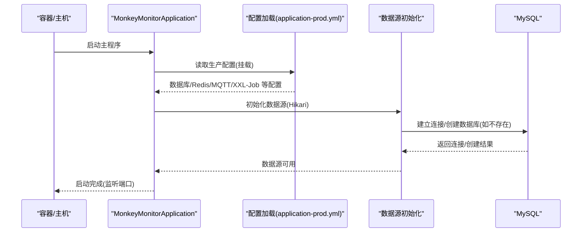
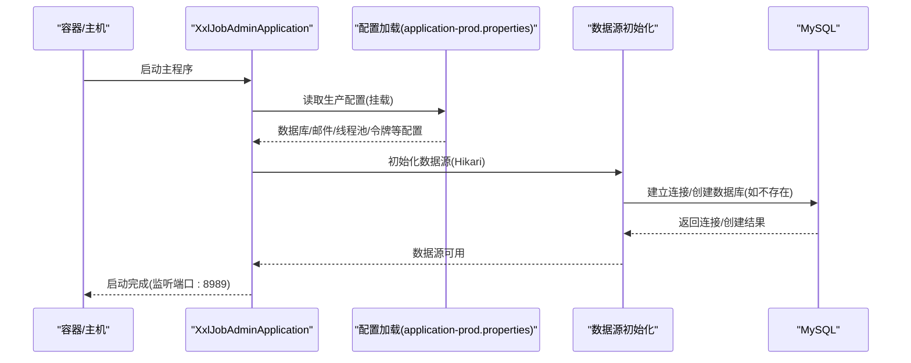
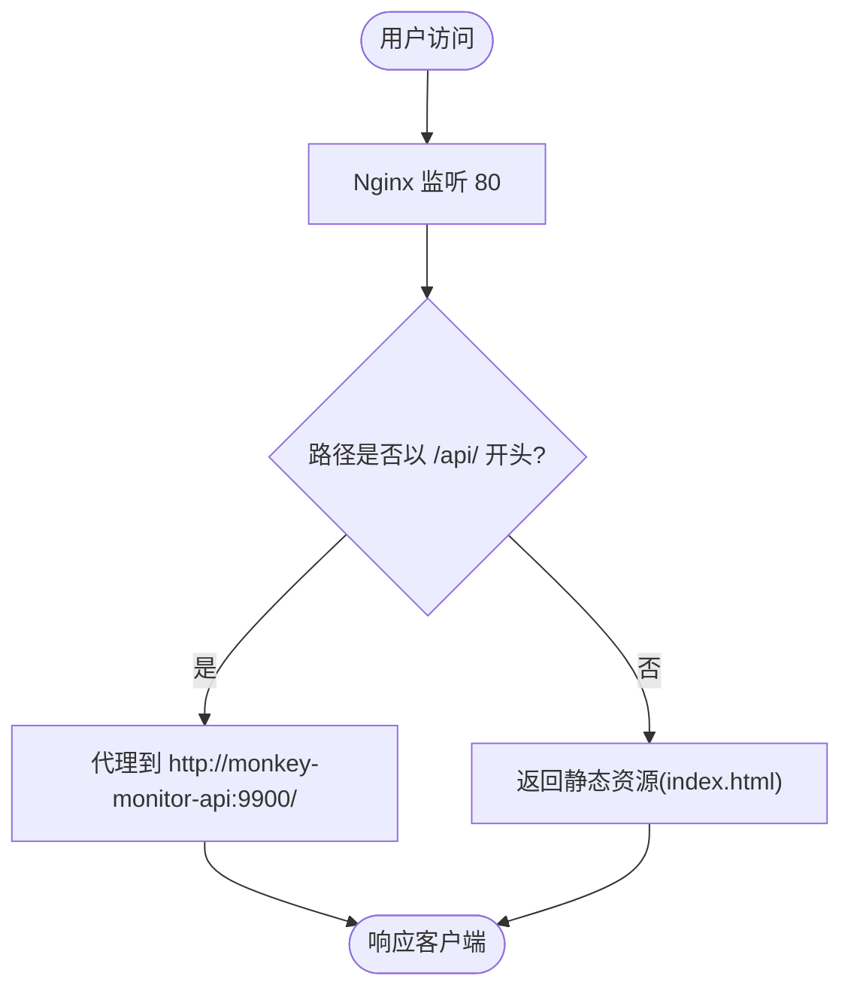
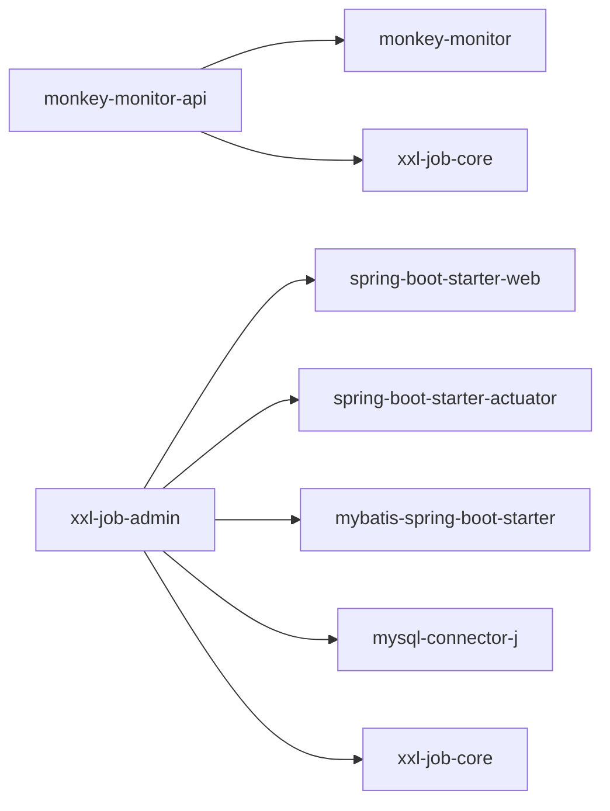

# 启动问题

<cite>
**本文引用的文件**
- [docker-compose.yml](file://deploy/docker-compose.yml)
- [application-prod.yml（监控 API）](file://deploy/config/monitor-api/application-prod.yml)
- [application-prod.yml（XXL-Job）](file://deploy/config/xxl-job-admin/application-prod.properties)
- [nginx.conf（前端）](file://deploy/config/frontend/nginx.conf)
- [build-push.ps1](file://deploy/build-push.ps1)
- [pull-images.ps1](file://deploy/pull-images.ps1)
- [Dockerfile（监控 API）](file://monkey-monitor-api/Dockerfile)
- [application-prod.yml（监控 API 源码）](file://monkey-monitor-api/src/main/resources/application-prod.yml)
- [application-prod.properties（XXL-Job 源码）](file://xxl-job-admin/src/main/resources/application-prod.properties)
- [XxlJobAdminApplication.java](file://xxl-job-admin/src/main/java/com/xxl/job/admin/XxlJobAdminApplication.java)
- [MonkeyMonitorApplication.java](file://monkey-monitor-api/src/main/java/com/monkey/general/MonkeyMonitorApplication.java)
- [SpringBooStartApplication.java](file://monkey-monitor-api/src/main/java/com/monkey/general/annotation/SpringBooStartApplication.java)
- [logback-spring.xml（监控 API）](file://monkey-monitor-api/src/main/resources/logback-spring.xml)
- [logback.xml（XXL-Job）](file://xxl-job-admin/src/main/resources/logback.xml)
- [MyDataSourceAutoConfiguration.java](file://monkey-monitor/src/main/java/com/monkey/general/config/MyDataSourceAutoConfiguration.java)
- [DatabaseInitConfig.java](file://monkey-monitor/src/main/java/com/monkey/general/config/DatabaseInitConfig.java)
- [XxlDataBaseConfig.java](file://xxl-job-admin/src/main/java/com/xxl/job/admin/core/conf/XxlDataBaseConfig.java)
- [pom.xml（监控 API）](file://monkey-monitor-api/pom.xml)
- [pom.xml（XXL-Job）](file://xxl-job-admin/pom.xml)
</cite>

## 目录
1. [简介](#简介)
2. [项目结构](#项目结构)
3. [核心组件](#核心组件)
4. [架构总览](#架构总览)
5. [详细组件分析](#详细组件分析)
6. [依赖分析](#依赖分析)
7. [性能考虑](#性能考虑)
8. [故障排除指南](#故障排除指南)
9. [结论](#结论)
10. [附录](#附录)

## 简介
本指南面向安威 fireworks 物联网监控平台的运维与开发人员，聚焦应用启动阶段的常见问题与系统性排查方法。内容覆盖：
- 端口冲突、数据库连接失败、配置文件错误、依赖缺失等启动失败的典型原因与解决策略
- 启动日志分析方法，帮助快速定位关键信息与错误提示
- Docker 容器启动问题排查，包括镜像拉取失败、容器启动异常、端口映射问题等
- Spring Boot 应用启动异常诊断，包括配置加载顺序、Bean 初始化失败、循环依赖等
- 启动问题的预防措施与最佳实践

## 项目结构
平台采用多模块 Maven 工程与 Docker Compose 编排，包含：
- 监控 API（Spring Boot 应用）
- XXL-Job 调度中心（独立 Spring Boot 应用）
- 前端 Nginx（反向代理与静态资源）
- 基础设施：MySQL、Redis、EMQX（消息中间件）

图表来源
- [docker-compose.yml:1-103](file://deploy/docker-compose.yml#L1-L103)
- [nginx.conf（前端）:1-24](file://deploy/config/frontend/nginx.conf#L1-L24)

章节来源
- [docker-compose.yml:1-103](file://deploy/docker-compose.yml#L1-L103)
- [nginx.conf（前端）:1-24](file://deploy/config/frontend/nginx.conf#L1-L24)

## 核心组件
- 监控 API（Spring Boot）
  - 启动入口：[MonkeyMonitorApplication.java:1-20](file://monkey-monitor-api/src/main/java/com/monkey/general/MonkeyMonitorApplication.java#L1-L20)
  - 启动注解组合：[SpringBooStartApplication.java:1-29](file://monkey-monitor-api/src/main/java/com/monkey/general/annotation/SpringBooStartApplication.java#L1-L29)
  - 生产配置（挂载）：[application-prod.yml（监控 API）:1-203](file://deploy/config/monitor-api/application-prod.yml#L1-L203)
  - 生产配置（源码）：[application-prod.yml（监控 API 源码）:1-198](file://monkey-monitor-api/src/main/resources/application-prod.yml#L1-L198)
  - 日志配置：[logback-spring.xml（监控 API）:1-151](file://monkey-monitor-api/src/main/resources/logback-spring.xml#L1-L151)
  - 数据源配置与初始化：[MyDataSourceAutoConfiguration.java:34-50](file://monkey-monitor/src/main/java/com/monkey/general/config/MyDataSourceAutoConfiguration.java#L34-L50)、[DatabaseInitConfig.java:1-75](file://monkey-monitor/src/main/java/com/monkey/general/config/DatabaseInitConfig.java#L1-L75)
  - Docker 镜像与端口暴露：[Dockerfile（监控 API）:1-5](file://monkey-monitor-api/Dockerfile#L1-L5)
  - Maven 构建与打包：[pom.xml（监控 API）:1-59](file://monkey-monitor-api/pom.xml#L1-L59)

- XXL-Job 调度中心（Spring Boot）
  - 启动入口：[XxlJobAdminApplication.java:1-16](file://xxl-job-admin/src/main/java/com/xxl/job/admin/XxlJobAdminApplication.java#L1-L16)
  - 生产配置（挂载）：[application-prod.properties（XXL-Job）:1-66](file://deploy/config/xxl-job-admin/application-prod.properties#L1-L66)
  - 生产配置（源码）：[application-prod.properties（XXL-Job 源码）:1-66](file://xxl-job-admin/src/main/resources/application-prod.properties#L1-L66)
  - 日志配置：[logback.xml（XXL-Job）:28-81](file://xxl-job-admin/src/main/resources/logback.xml#L28-L81)
  - 数据库初始化：[XxlDataBaseConfig.java:38-69](file://xxl-job-admin/src/main/java/com/xxl/job/admin/core/conf/XxlDataBaseConfig.java#L38-L69)
  - Maven 构建与打包：[pom.xml（XXL-Job）:1-108](file://xxl-job-admin/pom.xml#L1-L108)

- 前端 Nginx
  - 反向代理与静态资源：[nginx.conf（前端）:1-24](file://deploy/config/frontend/nginx.conf#L1-L24)

章节来源
- [MonkeyMonitorApplication.java:1-20](file://monkey-monitor-api/src/main/java/com/monkey/general/MonkeyMonitorApplication.java#L1-L20)
- [SpringBooStartApplication.java:1-29](file://monkey-monitor-api/src/main/java/com/monkey/general/annotation/SpringBooStartApplication.java#L1-L29)
- [application-prod.yml（监控 API）:1-203](file://deploy/config/monitor-api/application-prod.yml#L1-L203)
- [application-prod.yml（监控 API 源码）:1-198](file://monkey-monitor-api/src/main/resources/application-prod.yml#L1-L198)
- [logback-spring.xml（监控 API）:1-151](file://monkey-monitor-api/src/main/resources/logback-spring.xml#L1-L151)
- [MyDataSourceAutoConfiguration.java:34-50](file://monkey-monitor/src/main/java/com/monkey/general/config/MyDataSourceAutoConfiguration.java#L34-L50)
- [DatabaseInitConfig.java:1-75](file://monkey-monitor/src/main/java/com/monkey/general/config/DatabaseInitConfig.java#L1-L75)
- [Dockerfile（监控 API）:1-5](file://monkey-monitor-api/Dockerfile#L1-L5)
- [pom.xml（监控 API）:1-59](file://monkey-monitor-api/pom.xml#L1-L59)
- [XxlJobAdminApplication.java:1-16](file://xxl-job-admin/src/main/java/com/xxl/job/admin/XxlJobAdminApplication.java#L1-L16)
- [application-prod.properties（XXL-Job）:1-66](file://deploy/config/xxl-job-admin/application-prod.properties#L1-L66)
- [application-prod.properties（XXL-Job 源码）:1-66](file://xxl-job-admin/src/main/resources/application-prod.properties#L1-L66)
- [logback.xml（XXL-Job）:28-81](file://xxl-job-admin/src/main/resources/logback.xml#L28-L81)
- [XxlDataBaseConfig.java:38-69](file://xxl-job-admin/src/main/java/com/xxl/job/admin/core/conf/XxlDataBaseConfig.java#L38-L69)
- [pom.xml（XXL-Job）:1-108](file://xxl-job-admin/pom.xml#L1-L108)
- [nginx.conf（前端）:1-24](file://deploy/config/frontend/nginx.conf#L1-L24)

## 架构总览
下图展示容器编排、网络与服务间依赖关系，以及关键端口映射与健康检查。

图表来源
- [docker-compose.yml:1-103](file://deploy/docker-compose.yml#L1-L103)
- [application-prod.yml（监控 API）:1-203](file://deploy/config/monitor-api/application-prod.yml#L1-L203)
- [application-prod.properties（XXL-Job）:1-66](file://deploy/config/xxl-job-admin/application-prod.properties#L1-L66)

章节来源
- [docker-compose.yml:1-103](file://deploy/docker-compose.yml#L1-L103)

## 详细组件分析

### 监控 API 启动流程与配置加载
- 启动入口与注解
  - 主类：[MonkeyMonitorApplication.java:1-20](file://monkey-monitor-api/src/main/java/com/monkey/general/MonkeyMonitorApplication.java#L1-L20)
  - 组合注解：[SpringBooStartApplication.java:1-29](file://monkey-monitor-api/src/main/java/com/monkey/general/annotation/SpringBooStartApplication.java#L1-L29)，启用异步、定时任务、Swagger、Feign 客户端与 Spring Boot 启动
- 配置加载
  - 容器挂载配置：[application-prod.yml（监控 API）:1-203](file://deploy/config/monitor-api/application-prod.yml#L1-L203)
  - 本地开发配置：[application-prod.yml（监控 API 源码）:1-198](file://monkey-monitor-api/src/main/resources/application-prod.yml#L1-L198)
  - 数据源与连接池：Hikari 配置位于上述两个文件中
  - MQTT/EMQX、Redis、XXL-Job、JT808 等外部依赖均在配置中声明
- 日志
  - [logback-spring.xml（监控 API）:1-151](file://monkey-monitor-api/src/main/resources/logback-spring.xml#L1-L151) 提供多环境日志输出策略
- 数据库初始化
  - [DatabaseInitConfig.java:1-75](file://monkey-monitor/src/main/java/com/monkey/general/config/DatabaseInitConfig.java#L1-L75) 在启动时检测并创建数据库
  - [MyDataSourceAutoConfiguration.java:34-50](file://monkey-monitor/src/main/java/com/monkey/general/config/MyDataSourceAutoConfiguration.java#L34-L50) 负责数据源 Bean 创建

图表来源
- [MonkeyMonitorApplication.java:1-20](file://monkey-monitor-api/src/main/java/com/monkey/general/MonkeyMonitorApplication.java#L1-L20)
- [application-prod.yml（监控 API）:1-203](file://deploy/config/monitor-api/application-prod.yml#L1-L203)
- [DatabaseInitConfig.java:1-75](file://monkey-monitor/src/main/java/com/monkey/general/config/DatabaseInitConfig.java#L1-L75)
- [MyDataSourceAutoConfiguration.java:34-50](file://monkey-monitor/src/main/java/com/monkey/general/config/MyDataSourceAutoConfiguration.java#L34-L50)

章节来源
- [MonkeyMonitorApplication.java:1-20](file://monkey-monitor-api/src/main/java/com/monkey/general/MonkeyMonitorApplication.java#L1-L20)
- [SpringBooStartApplication.java:1-29](file://monkey-monitor-api/src/main/java/com/monkey/general/annotation/SpringBooStartApplication.java#L1-L29)
- [application-prod.yml（监控 API）:1-203](file://deploy/config/monitor-api/application-prod.yml#L1-L203)
- [application-prod.yml（监控 API 源码）:1-198](file://monkey-monitor-api/src/main/resources/application-prod.yml#L1-L198)
- [logback-spring.xml（监控 API）:1-151](file://monkey-monitor-api/src/main/resources/logback-spring.xml#L1-L151)
- [DatabaseInitConfig.java:1-75](file://monkey-monitor/src/main/java/com/monkey/general/config/DatabaseInitConfig.java#L1-L75)
- [MyDataSourceAutoConfiguration.java:34-50](file://monkey-monitor/src/main/java/com/monkey/general/config/MyDataSourceAutoConfiguration.java#L34-L50)

### XXL-Job 调度中心启动流程与配置加载
- 启动入口与配置
  - 主类：[XxlJobAdminApplication.java:1-16](file://xxl-job-admin/src/main/java/com/xxl/job/admin/XxlJobAdminApplication.java#L1-L16)
  - 生产配置（挂载）：[application-prod.properties（XXL-Job）:1-66](file://deploy/config/xxl-job-admin/application-prod.properties#L1-L66)
  - 生产配置（源码）：[application-prod.properties（XXL-Job 源码）:1-66](file://xxl-job-admin/src/main/resources/application-prod.properties#L1-L66)
  - 日志：[logback.xml（XXL-Job）:28-81](file://xxl-job-admin/src/main/resources/logback.xml#L28-L81)
  - 数据库初始化：[XxlDataBaseConfig.java:38-69](file://xxl-job-admin/src/main/java/com/xxl/job/admin/core/conf/XxlDataBaseConfig.java#L38-L69)

图表来源
- [XxlJobAdminApplication.java:1-16](file://xxl-job-admin/src/main/java/com/xxl/job/admin/XxlJobAdminApplication.java#L1-L16)
- [application-prod.properties（XXL-Job）:1-66](file://deploy/config/xxl-job-admin/application-prod.properties#L1-L66)
- [application-prod.properties（XXL-Job 源码）:1-66](file://xxl-job-admin/src/main/resources/application-prod.properties#L1-L66)
- [XxlDataBaseConfig.java:38-69](file://xxl-job-admin/src/main/java/com/xxl/job/admin/core/conf/XxlDataBaseConfig.java#L38-L69)

章节来源
- [XxlJobAdminApplication.java:1-16](file://xxl-job-admin/src/main/java/com/xxl/job/admin/XxlJobAdminApplication.java#L1-L16)
- [application-prod.properties（XXL-Job）:1-66](file://deploy/config/xxl-job-admin/application-prod.properties#L1-L66)
- [application-prod.properties（XXL-Job 源码）:1-66](file://xxl-job-admin/src/main/resources/application-prod.properties#L1-L66)
- [logback.xml（XXL-Job）:28-81](file://xxl-job-admin/src/main/resources/logback.xml#L28-L81)
- [XxlDataBaseConfig.java:38-69](file://xxl-job-admin/src/main/java/com/xxl/job/admin/core/conf/XxlDataBaseConfig.java#L38-L69)

### 前端 Nginx 反向代理
- 反向代理规则：将 /api/ 请求转发至监控 API 的 9900 端口
- 端口映射：容器 80 映射到宿主机 80
- 静态资源：默认返回 index.html 并支持 SPA 路由

图表来源
- [nginx.conf（前端）:1-24](file://deploy/config/frontend/nginx.conf#L1-L24)

章节来源
- [nginx.conf（前端）:1-24](file://deploy/config/frontend/nginx.conf#L1-L24)

## 依赖分析
- 监控 API 依赖
  - 模块依赖：[pom.xml（监控 API）:20-32](file://monkey-monitor-api/pom.xml#L20-L32)
  - Spring Boot 插件与打包：[pom.xml（监控 API）:34-55](file://monkey-monitor-api/pom.xml#L34-L55)
- XXL-Job 依赖
  - Spring Boot Starter/Web/Freemarker/Actuator/MyBatis/MySQL/XXL-Job-Core：[pom.xml（XXL-Job）:32-88](file://xxl-job-admin/pom.xml#L32-L88)
  - Spring Boot 插件与打包：[pom.xml（XXL-Job）:90-105](file://xxl-job-admin/pom.xml#L90-L105)

图表来源
- [pom.xml（监控 API）:20-32](file://monkey-monitor-api/pom.xml#L20-L32)
- [pom.xml（XXL-Job）:32-88](file://xxl-job-admin/pom.xml#L32-L88)

章节来源
- [pom.xml（监控 API）:20-32](file://monkey-monitor-api/pom.xml#L20-L32)
- [pom.xml（XXL-Job）:32-88](file://xxl-job-admin/pom.xml#L32-L88)

## 性能考虑
- 连接池与超时
  - Hikari 连接池参数在生产配置中集中管理，建议结合数据库负载与并发调优
- 日志级别与落盘
  - 生产环境建议降低控制台输出，重点关注 ERROR/WARN 文件落盘，避免 IO 放大
- 端口与网络
  - 确保容器间通过内部网络通信，避免使用 127.0.0.1 访问跨服务依赖
- 健康检查
  - MySQL/EMQX 的健康检查有助于编排层快速发现异常并重启

## 故障排除指南

### 一、启动失败的常见原因与解决
- 端口冲突
  - 现象：容器启动后立即退出或日志提示端口占用
  - 排查要点：
    - 监控 API：确认宿主机未占用 9900/8383，容器端口映射为 9900:9900、8383:8383
    - XXL-Job：确认 8989 未被占用
    - Nginx：确认 80 未被占用
  - 解决方案：
    - 修改 docker-compose.yml 中的端口映射或宿主机端口
    - 使用 netstat 或系统工具检查占用进程并释放
- 数据库连接失败
  - 现象：启动时报数据库连接异常或初始化失败
  - 排查要点：
    - MySQL 健康状态：查看健康检查是否通过
    - 凭据与 URL：核对用户名、密码、数据库名与时区参数
    - 网络连通：确认容器间网络正常（同一网络）
  - 解决方案：
    - 更新挂载配置中的数据库凭据
    - 确认 MySQL 服务可用且防火墙放行
- 配置文件错误
  - 现象：启动报错或部分功能不可用
  - 排查要点：
    - 检查挂载路径与文件名是否正确
    - 校验 YAML/Properties 语法与缩进
    - 确认 profile 与环境变量匹配
  - 解决方案：
    - 使用配置校验工具或在线校验器
    - 逐项注释定位问题段落
- 依赖缺失
  - 现象：启动阶段找不到类或 Bean
  - 排查要点：
    - Maven 依赖是否完整（监控 API 依赖 monkey-monitor 与 xxl-job-core）
    - XXL-Job 依赖是否齐全（Web、Actuator、MyBatis、MySQL、XXL-Job-Core）
  - 解决方案：
    - 清理本地仓库缓存并重新构建
    - 确认私服/镜像仓库可达

章节来源
- [docker-compose.yml:1-103](file://deploy/docker-compose.yml#L1-L103)
- [application-prod.yml（监控 API）:1-203](file://deploy/config/monitor-api/application-prod.yml#L1-L203)
- [application-prod.properties（XXL-Job）:1-66](file://deploy/config/xxl-job-admin/application-prod.properties#L1-L66)
- [pom.xml（监控 API）:20-32](file://monkey-monitor-api/pom.xml#L20-L32)
- [pom.xml（XXL-Job）:32-88](file://xxl-job-admin/pom.xml#L32-L88)

### 二、启动日志分析方法
- 监控 API
  - 日志配置：[logback-spring.xml（监控 API）:1-151](file://monkey-monitor-api/src/main/resources/logback-spring.xml#L1-L151)
  - 分析要点：
    - 查找数据库连接建立、Schema 初始化、MQTT/EMQX 连接、XXL-Job 注册等关键日志
    - 生产环境默认 INFO 级别，必要时临时提升 DEBUG
- XXL-Job
  - 日志配置：[logback.xml（XXL-Job）:28-81](file://xxl-job-admin/src/main/resources/logback.xml#L28-L81)
  - 分析要点：
    - 关注数据库初始化、调度线程池、触发器线程等日志
- 前端 Nginx
  - 反向代理：确认 /api/ 到 :9900 的代理是否生效
  - 错误日志：查看访问失败与 502/504

章节来源
- [logback-spring.xml（监控 API）:1-151](file://monkey-monitor-api/src/main/resources/logback-spring.xml#L1-L151)
- [logback.xml（XXL-Job）:28-81](file://xxl-job-admin/src/main/resources/logback.xml#L28-L81)
- [nginx.conf（前端）:1-24](file://deploy/config/frontend/nginx.conf#L1-L24)

### 三、Docker 容器启动问题排查
- 镜像拉取失败
  - 现象：docker pull 报错或长时间无响应
  - 排查要点：
    - 网络连通性与代理设置
    - Harbor 登录状态与凭证
  - 解决方案：
    - 使用脚本拉取基础设施与应用镜像：[pull-images.ps1:1-56](file://deploy/pull-images.ps1#L1-L56)
- 容器启动异常
  - 现象：容器快速退出或健康检查失败
  - 排查要点：
    - 查看容器日志：docker logs 容器名
    - 健康检查命令是否可执行（MySQL/EMQX）
    - 端口映射与宿主机占用
  - 解决方案：
    - 修复配置后重建容器
- 端口映射问题
  - 现象：服务无法访问或端口冲突
  - 排查要点：
    - docker-compose.yml 中的 ports 字段
    - 宿主机防火墙与安全组
  - 解决方案：
    - 修改映射或释放宿主机端口

章节来源
- [pull-images.ps1:1-56](file://deploy/pull-images.ps1#L1-L56)
- [docker-compose.yml:1-103](file://deploy/docker-compose.yml#L1-L103)

### 四、Spring Boot 启动异常诊断
- 配置加载顺序
  - 现象：某些配置未生效或被覆盖
  - 排查要点：
    - 确认挂载配置优先级高于源码配置
    - 检查 profile 与环境变量
- Bean 初始化失败
  - 现象：启动时报 NoSuchBeanDefinition 或 BeanCreationException
  - 排查要点：
    - 检查 @Conditional、@DependsOn 与依赖注入
    - 数据源 Bean 是否正确创建：[MyDataSourceAutoConfiguration.java:34-50](file://monkey-monitor/src/main/java/com/monkey/general/config/MyDataSourceAutoConfiguration.java#L34-L50)
- 循环依赖
  - 现象：启动时报 BeanCurrentlyInCreationException
  - 排查要点：
    - 检查 @Lazy、@DependsOn、构造函数注入与 setter 注入的组合
- 监控 API 特殊配置
  - 禁用 Headless 模式以支持 GUI 相关功能：[MonkeyMonitorApplication.java:1-20](file://monkey-monitor-api/src/main/java/com/monkey/general/MonkeyMonitorApplication.java#L1-L20)
  - 组合注解启用异步/定时/文档/Feign：[SpringBooStartApplication.java:1-29](file://monkey-monitor-api/src/main/java/com/monkey/general/annotation/SpringBooStartApplication.java#L1-L29)

章节来源
- [MyDataSourceAutoConfiguration.java:34-50](file://monkey-monitor/src/main/java/com/monkey/general/config/MyDataSourceAutoConfiguration.java#L34-L50)
- [MonkeyMonitorApplication.java:1-20](file://monkey-monitor-api/src/main/java/com/monkey/general/MonkeyMonitorApplication.java#L1-L20)
- [SpringBooStartApplication.java:1-29](file://monkey-monitor-api/src/main/java/com/monkey/general/annotation/SpringBooStartApplication.java#L1-L29)

### 五、预防措施与最佳实践
- 配置管理
  - 将敏感配置通过挂载文件注入，避免硬编码
  - 使用环境变量与 profile 切换，减少手工修改
- 健康检查与重启策略
  - 为数据库与消息中间件配置健康检查，确保编排层自动恢复
- 日志与可观测性
  - 生产环境降低控制台输出，重点落盘 ERROR/WARN
  - 为关键模块增加业务日志，便于问题定位
- 构建与发布
  - 使用统一脚本构建与推送镜像：[build-push.ps1:1-263](file://deploy/build-push.ps1#L1-L263)
  - 先拉取镜像再启动，避免启动时拉取导致的延迟
- 网络与端口
  - 统一使用内部网络通信，避免使用 127.0.0.1 访问跨服务
  - 端口映射前先检查宿主机占用

章节来源
- [build-push.ps1:1-263](file://deploy/build-push.ps1#L1-L263)
- [docker-compose.yml:1-103](file://deploy/docker-compose.yml#L1-L103)
- [logback-spring.xml（监控 API）:1-151](file://monkey-monitor-api/src/main/resources/logback-spring.xml#L1-L151)
- [logback.xml（XXL-Job）:28-81](file://xxl-job-admin/src/main/resources/logback.xml#L28-L81)

## 结论
启动问题通常源于配置错误、依赖缺失、端口冲突或容器健康检查失败。通过规范的配置管理、完善的日志策略、严格的健康检查与统一的构建发布流程，可显著降低启动失败概率并加速问题定位与修复。

## 附录
- 快速检查清单
  - 端口：9900/8383/8989/80 是否被占用
  - 配置：application-prod.yml/.properties 是否正确挂载
  - 依赖：MySQL/Redis/EMQX 是否健康可用
  - 日志：ERROR/WARN 文件是否存在，INFO 是否过多
  - 镜像：是否已拉取并存在
  - 网络：容器是否在同一网络，DNS/服务名是否可解析