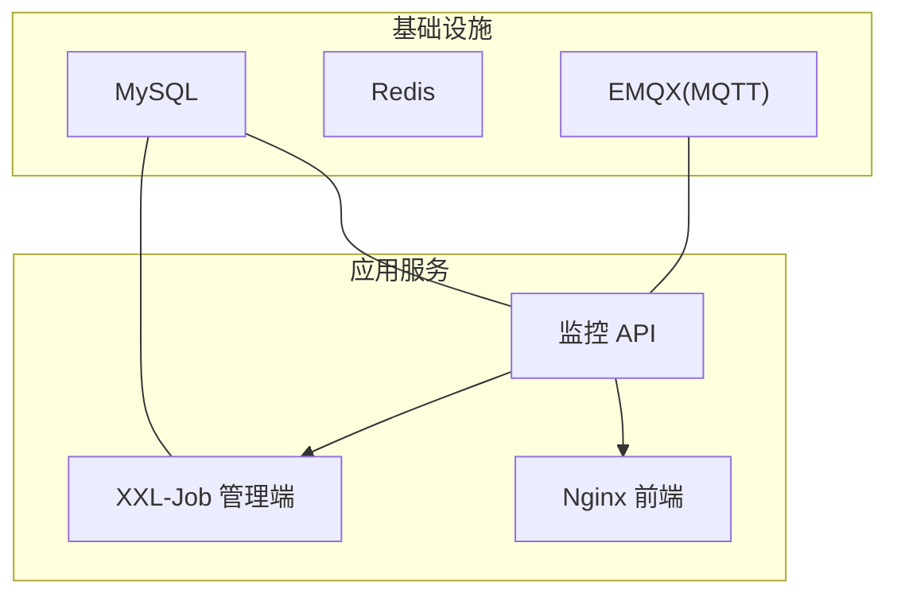
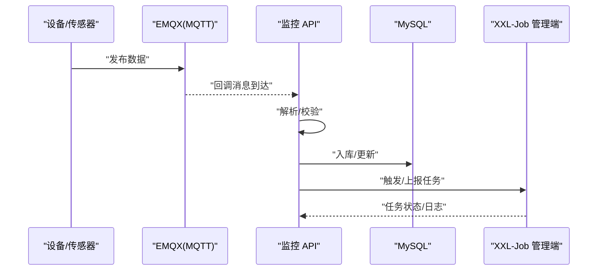
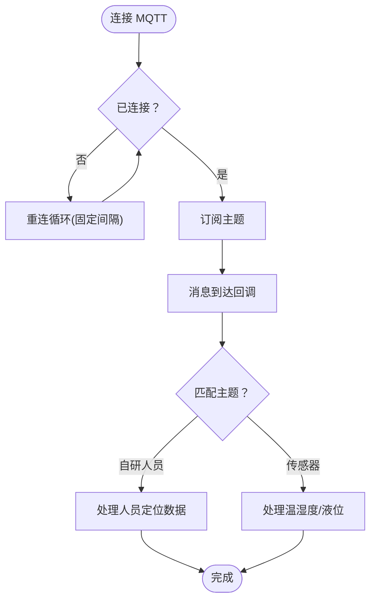
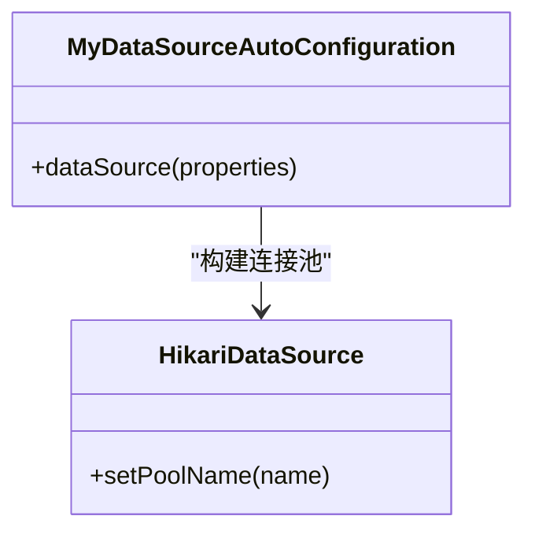
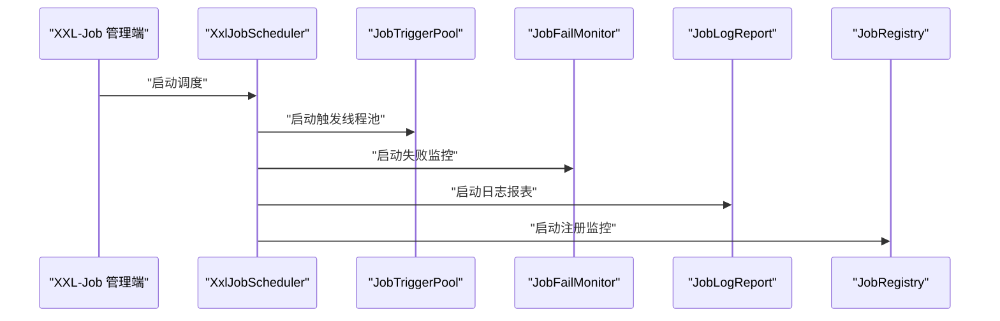
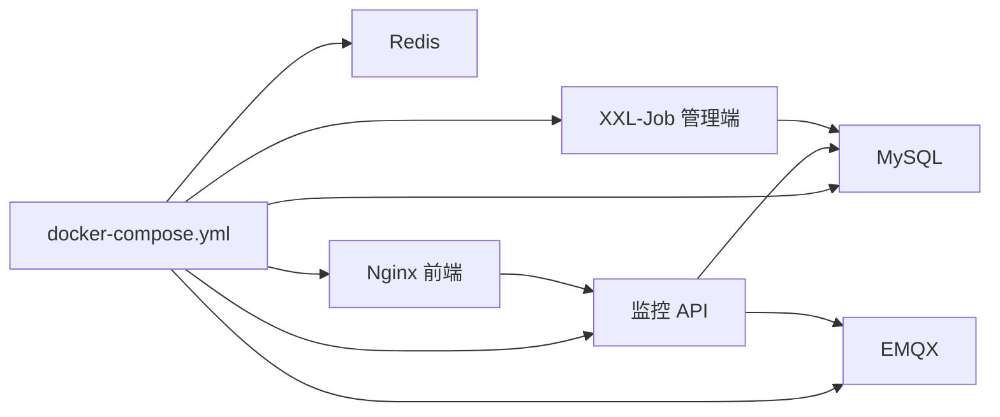

# 应急响应

<cite>
**本文引用的文件**
- [docker-compose.yml](file://deploy/docker-compose.yml)
- [application-prod.yml（监控 API）](file://deploy/config/monitor-api/application-prod.yml)
- [application-prod.yml（XXL-Job 管理端）](file://deploy/config/xxl-job-admin/application-prod.yml)
- [application-prod.yml（监控 API 内部）](file://monkey-monitor-api/src/main/resources/application-prod.yml)
- [application-prod.properties（XXL-Job 管理端）](file://xxl-job-admin/src/main/resources/application-prod.properties)
- [init.sql](file://deploy/init/init.sql)
- [MyMqttConfiguration.java](file://monkey-monitor/src/main/java/com/monkey/general/config/mqtt/MyMqttConfiguration.java)
- [MQTTClient.java](file://monkey-monitor/src/main/java/com/monkey/general/config/mqtt/MQTTClient.java)
- [MQTTCallback.java](file://monkey-monitor/src/main/java/com/monkey/general/config/mqtt/MQTTCallback.java)
- [MqttConfiguration.java](file://monkey-monitor/src/main/java/com/monkey/general/config/MqttConfiguration.java)
- [MyDataSourceAutoConfiguration.java](file://monkey-monitor/src/main/java/com/monkey/general/config/MyDataSourceAutoConfiguration.java)
- [XxlJobConfig.java](file://monkey-monitor-api/src/main/java/com/monkey/general/config/XxlJobConfig.java)
- [SpringBooStartApplication.java](file://monkey-monitor-api/src/main/java/com/monkey/general/annotation/SpringBooStartApplication.java)
- [JobScheduleHelper.java](file://xxl-job-admin/src/main/java/com/xxl/job/admin/core/thread/JobScheduleHelper.java)
- [JobThread.java](file://xxl-job-core/src/main/java/com/xxl/job/core/thread/JobThread.java)
- [JobFailMonitorHelper.java](file://xxl-job-admin/src/main/java/com/xxl/job/admin/core/thread/JobFailMonitorHelper.java)
- [XxlJobScheduler.java](file://xxl-job-admin/src/main/java/com/xxl/job/admin/core/scheduler/XxlJobScheduler.java)
- [MonkeyCustomException.java](file://monkey-common/src/main/java/com/monkey/general/common/exception/MonkeyCustomException.java)
</cite>

## 目录
1. [简介](#简介)
2. [项目结构](#项目结构)
3. [核心组件](#核心组件)
4. [架构总览](#架构总览)
5. [详细组件分析](#详细组件分析)
6. [依赖分析](#依赖分析)
7. [性能考虑](#性能考虑)
8. [故障排除指南](#故障排除指南)
9. [结论](#结论)
10. [附录](#附录)

## 简介
本指南面向安威 fireworks 物联网监控平台的应急响应场景，围绕系统崩溃、数据丢失、网络中断、设备大规模故障等紧急情况进行故障识别、快速定位、临时处置与系统恢复，并配套故障预防与演练建议、故障报告与复盘方法，帮助运维团队在最短时间内稳定系统、恢复业务。

## 项目结构
系统采用容器化编排，核心由以下服务组成：
- 基础设施：MySQL、Redis、EMQX（MQTT）
- 应用服务：XXL-Job 管理端、监控 API、前端 Nginx
- 初始化脚本：数据库初始化 SQL

图表来源
- [docker-compose.yml:1-103](file://deploy/docker-compose.yml#L1-L103)
- [application-prod.yml（监控 API）:1-203](file://deploy/config/monitor-api/application-prod.yml#L1-L203)
- [application-prod.yml（XXL-Job 管理端）:1-66](file://deploy/config/xxl-job-admin/application-prod.properties#L1-L66)

章节来源
- [docker-compose.yml:1-103](file://deploy/docker-compose.yml#L1-L103)
- [application-prod.yml（监控 API）:1-203](file://deploy/config/monitor-api/application-prod.yml#L1-L203)
- [application-prod.yml（XXL-Job 管理端）:1-66](file://deploy/config/xxl-job-admin/application-prod.properties#L1-L66)

## 核心组件
- MQTT 接入与回调：负责从 EMQX 订阅设备/传感器数据，进行解析与转发。
- 数据库连接：基于 HikariCP 的连接池配置，支持动态数据源。
- 定时调度：XXL-Job 管理端与执行器协同，负责周期性任务与失败监控。
- 异常体系：统一的自定义异常类型，便于快速定位与分级处理。

章节来源
- [MyMqttConfiguration.java:1-57](file://monkey-monitor/src/main/java/com/monkey/general/config/mqtt/MyMqttConfiguration.java#L1-L57)
- [MQTTClient.java:41-138](file://monkey-monitor/src/main/java/com/monkey/general/config/mqtt/MQTTClient.java#L41-L138)
- [MQTTCallback.java:1-127](file://monkey-monitor/src/main/java/com/monkey/general/config/mqtt/MQTTCallback.java#L1-L127)
- [MqttConfiguration.java:1-53](file://monkey-monitor/src/main/java/com/monkey/general/config/MqttConfiguration.java#L1-L53)
- [MyDataSourceAutoConfiguration.java:1-51](file://monkey-monitor/src/main/java/com/monkey/general/config/MyDataSourceAutoConfiguration.java#L1-L51)
- [XxlJobConfig.java:1-78](file://monkey-monitor-api/src/main/java/com/monkey/general/config/XxlJobConfig.java#L1-L78)
- [MonkeyCustomException.java:1-53](file://monkey-common/src/main/java/com/monkey/general/common/exception/MonkeyCustomException.java#L1-L53)

## 架构总览
监控 API 通过 MQTT 从 EMQX 接收数据，经解析后写入数据库；XXL-Job 管理端负责任务编排与失败监控；前端 Nginx 提供静态资源与反向代理。

图表来源
- [MQTTCallback.java:62-89](file://monkey-monitor/src/main/java/com/monkey/general/config/mqtt/MQTTCallback.java#L62-L89)
- [application-prod.yml（监控 API）:30-60](file://deploy/config/monitor-api/application-prod.yml#L30-L60)
- [application-prod.yml（监控 API 内部）:30-60](file://monkey-monitor-api/src/main/resources/application-prod.yml#L30-L60)
- [XxlJobConfig.java:44-57](file://monkey-monitor-api/src/main/java/com/monkey/general/config/XxlJobConfig.java#L44-L57)

## 详细组件分析

### MQTT 接入与重连机制
- 连接与自动重连：客户端在断线时循环尝试重连，连接成功后重新订阅主题。
- 回调处理：根据主题匹配分流处理，包含自研人员定位与传感器数据两类。
- 配置来源：通过配置文件注入主机、认证、超时与心跳参数。

图表来源
- [MQTTClient.java:50-63](file://monkey-monitor/src/main/java/com/monkey/general/config/mqtt/MQTTClient.java#L50-L63)
- [MQTTCallback.java:32-56](file://monkey-monitor/src/main/java/com/monkey/general/config/mqtt/MQTTCallback.java#L32-L56)
- [MQTTCallback.java:62-89](file://monkey-monitor/src/main/java/com/monkey/general/config/mqtt/MQTTCallback.java#L62-L89)
- [MyMqttConfiguration.java:35-55](file://monkey-monitor/src/main/java/com/monkey/general/config/mqtt/MyMqttConfiguration.java#L35-L55)

章节来源
- [MyMqttConfiguration.java:1-57](file://monkey-monitor/src/main/java/com/monkey/general/config/mqtt/MyMqttConfiguration.java#L1-L57)
- [MQTTClient.java:41-138](file://monkey-monitor/src/main/java/com/monkey/general/config/mqtt/MQTTClient.java#L41-L138)
- [MQTTCallback.java:1-127](file://monkey-monitor/src/main/java/com/monkey/general/config/mqtt/MQTTCallback.java#L1-L127)
- [MqttConfiguration.java:1-53](file://monkey-monitor/src/main/java/com/monkey/general/config/MqttConfiguration.java#L1-L53)

### 数据库连接与事务
- HikariCP 连接池：最小空闲、最大连接、超时等参数可配置，确保高并发下的稳定性。
- 动态数据源：支持多数据源与按需切换，便于扩展与隔离。
- 初始化脚本：启动时自动创建业务库与调度库，保证初始可用。

图表来源
- [MyDataSourceAutoConfiguration.java:39-48](file://monkey-monitor/src/main/java/com/monkey/general/config/MyDataSourceAutoConfiguration.java#L39-L48)
- [application-prod.yml（监控 API）:4-13](file://deploy/config/monitor-api/application-prod.yml#L4-L13)
- [application-prod.yml（监控 API 内部）:4-13](file://monkey-monitor-api/src/main/resources/application-prod.yml#L4-L13)
- [init.sql:1-8](file://deploy/init/init.sql#L1-L8)

章节来源
- [MyDataSourceAutoConfiguration.java:1-51](file://monkey-monitor/src/main/java/com/monkey/general/config/MyDataSourceAutoConfiguration.java#L1-L51)
- [application-prod.yml（监控 API）:4-13](file://deploy/config/monitor-api/application-prod.yml#L4-L13)
- [application-prod.yml（监控 API 内部）:4-13](file://monkey-monitor-api/src/main/resources/application-prod.yml#L4-L13)
- [init.sql:1-8](file://deploy/init/init.sql#L1-L8)

### XXL-Job 调度与失败监控
- 执行器配置：管理端地址、令牌、应用名、日志路径与保留天数等。
- 调度线程：周期扫描、失败监控、日志报表与注册监控。
- 任务线程：处理触发参数、避免重复触发、记录运行状态。

图表来源
- [XxlJobConfig.java:44-57](file://monkey-monitor-api/src/main/java/com/monkey/general/config/XxlJobConfig.java#L44-L57)
- [XxlJobScheduler.java:23-44](file://xxl-job-admin/src/main/java/com/xxl/job/admin/core/scheduler/XxlJobScheduler.java#L23-L44)
- [JobFailMonitorHelper.java:31-45](file://xxl-job-admin/src/main/java/com/xxl/job/admin/core/thread/JobFailMonitorHelper.java#L31-L45)
- [JobScheduleHelper.java:170-200](file://xxl-job-admin/src/main/java/com/xxl/job/admin/core/thread/JobScheduleHelper.java#L170-L200)
- [JobThread.java:27-44](file://xxl-job-core/src/main/java/com/xxl/job/core/thread/JobThread.java#L27-L44)

章节来源
- [XxlJobConfig.java:1-78](file://monkey-monitor-api/src/main/java/com/monkey/general/config/XxlJobConfig.java#L1-L78)
- [XxlJobScheduler.java:1-44](file://xxl-job-admin/src/main/java/com/xxl/job/admin/core/scheduler/XxlJobScheduler.java#L1-L44)
- [JobFailMonitorHelper.java:1-45](file://xxl-job-admin/src/main/java/com/xxl/job/admin/core/thread/JobFailMonitorHelper.java#L1-L45)
- [JobScheduleHelper.java:170-200](file://xxl-job-admin/src/main/java/com/xxl/job/admin/core/thread/JobScheduleHelper.java#L170-L200)
- [JobThread.java:1-44](file://xxl-job-core/src/main/java/com/xxl/job/core/thread/JobThread.java#L1-L44)

### 异常处理与日志
- 自定义异常：统一错误码与消息，便于前端与监控系统识别。
- 日志与健康检查：XXL-Job 管理端提供健康检查与日志保留策略，便于快速定位问题。

章节来源
- [MonkeyCustomException.java:1-53](file://monkey-common/src/main/java/com/monkey/general/common/exception/MonkeyCustomException.java#L1-L53)
- [application-prod.properties（XXL-Job 管理端）:1-66](file://xxl-job-admin/src/main/resources/application-prod.properties#L1-L66)

## 依赖分析
- 容器编排：各服务通过 docker-compose 串联，具备健康检查与依赖顺序。
- 配置注入：监控 API 与 XXL-Job 管理端分别通过各自配置文件注入数据库、MQTT、调度参数。
- 数据初始化：初始化脚本创建业务库与调度库，插入默认执行器与任务条目。

图表来源
- [docker-compose.yml:1-103](file://deploy/docker-compose.yml#L1-L103)
- [application-prod.yml（监控 API）:1-203](file://deploy/config/monitor-api/application-prod.yml#L1-L203)
- [application-prod.yml（XXL-Job 管理端）:1-66](file://deploy/config/xxl-job-admin/application-prod.properties#L1-L66)

章节来源
- [docker-compose.yml:1-103](file://deploy/docker-compose.yml#L1-L103)
- [application-prod.yml（监控 API）:1-203](file://deploy/config/monitor-api/application-prod.yml#L1-L203)
- [application-prod.yml（XXL-Job 管理端）:1-66](file://deploy/config/xxl-job-admin/application-prod.properties#L1-L66)
- [init.sql:1-8](file://deploy/init/init.sql#L1-L8)

## 性能考虑
- 连接池参数：根据业务峰值调整最小空闲与最大连接，避免连接不足或过度占用。
- MQTT 并发：回调中避免阻塞操作，必要时异步处理，防止消息堆积与重连风暴。
- 调度频率：XXL-Job 任务周期应结合下游能力与数据量进行优化，避免抖动。
- 缓存开关：Redis 缓存开关可按需开启，减少数据库压力但需关注一致性。

## 故障排除指南

### 一、系统崩溃（应用进程不可用）
- 快速识别
  - 通过容器编排健康检查确认服务状态。
  - 查看应用日志与健康端点（如 XXL-Job 管理端的 /actuator）。
- 快速定位
  - 检查数据库连接池与连接数上限。
  - 检查 MQTT 客户端连接状态与重连日志。
- 临时方案
  - 重启对应容器，确保依赖服务健康后再启动。
  - 临时关闭高负载任务或限流。
- 恢复流程
  - 逐步恢复任务与订阅，观察日志与指标。
  - 验证数据写入与上报链路。

章节来源
- [docker-compose.yml:17-23](file://deploy/docker-compose.yml#L17-L23)
- [application-prod.properties（XXL-Job 管理端）:4-6](file://xxl-job-admin/src/main/resources/application-prod.properties#L4-L6)
- [MyDataSourceAutoConfiguration.java:39-48](file://monkey-monitor/src/main/java/com/monkey/general/config/MyDataSourceAutoConfiguration.java#L39-L48)
- [MQTTClient.java:50-63](file://monkey-monitor/src/main/java/com/monkey/general/config/mqtt/MQTTClient.java#L50-L63)

### 二、数据丢失（数据库异常/迁移失败）
- 快速识别
  - 对照初始化脚本核对业务库与调度库是否存在。
  - 检查 XXL-Job 日志表与任务状态。
- 快速定位
  - 核对连接参数与凭据。
  - 检查连接池配置与超时设置。
- 临时方案
  - 使用初始化脚本重建数据库结构。
  - 临时禁用写入型任务，待修复后恢复。
- 恢复流程
  - 重建表结构与索引，导入必要数据。
  - 重启应用与调度器，验证任务执行与日志。

章节来源
- [init.sql:1-8](file://deploy/init/init.sql#L1-L8)
- [application-prod.yml（监控 API）:4-13](file://deploy/config/monitor-api/application-prod.yml#L4-L13)
- [application-prod.yml（监控 API 内部）:4-13](file://monkey-monitor-api/src/main/resources/application-prod.yml#L4-L13)
- [XxlJobScheduler.java:23-44](file://xxl-job-admin/src/main/java/com/xxl/job/admin/core/scheduler/XxlJobScheduler.java#L23-L44)

### 三、网络中断（MQTT/HTTP 不可达）
- 快速识别
  - 检查 EMQX 服务状态与端口映射。
  - 核对 MQTT 主机、用户名、密码与超时配置。
- 快速定位
  - 查看 MQTT 回调重连日志与订阅状态。
  - 检查防火墙与容器网络。
- 临时方案
  - 临时关闭依赖 MQTT 的任务，避免无效重试。
  - 使用本地回环或替代地址进行测试。
- 恢复流程
  - 修复网络与认证配置后，验证重连与订阅。
  - 逐步恢复任务，观察消息处理速率与积压。

章节来源
- [application-prod.yml（监控 API）:30-49](file://deploy/config/monitor-api/application-prod.yml#L30-L49)
- [application-prod.yml（监控 API 内部）:30-49](file://monkey-monitor-api/src/main/resources/application-prod.yml#L30-L49)
- [MQTTCallback.java:32-56](file://monkey-monitor/src/main/java/com/monkey/general/config/mqtt/MQTTCallback.java#L32-L56)
- [MyMqttConfiguration.java:35-55](file://monkey-monitor/src/main/java/com/monkey/general/config/mqtt/MyMqttConfiguration.java#L35-L55)

### 四、设备大规模故障（大量设备离线/数据停滞）
- 快速识别
  - 检查 MQTT 回调日志，确认是否有异常吞没。
  - 核对任务执行日志与失败监控。
- 快速定位
  - 分析主题匹配与处理分支，定位瓶颈。
  - 检查外部接口（如上报）的可用性与限流。
- 临时方案
  - 临时屏蔽异常主题或降级处理。
  - 降低任务频率或暂停非关键任务。
- 恢复流程
  - 修复异常处理与外部接口，恢复订阅与任务。
  - 验证数据流与上报链路，消除积压。

章节来源
- [MQTTCallback.java:62-89](file://monkey-monitor/src/main/java/com/monkey/general/config/mqtt/MQTTCallback.java#L62-L89)
- [JobFailMonitorHelper.java:41-45](file://xxl-job-admin/src/main/java/com/xxl/job/admin/core/thread/JobFailMonitorHelper.java#L41-L45)

### 五、系统重启与服务切换
- 重启顺序
  - 先启动 MySQL/Redis/EMQX，再启动 XXL-Job 管理端与监控 API，最后启动前端。
- 切换策略
  - 使用容器编排的 depends_on 与健康检查，确保依赖就绪。
  - 对于执行器，确保地址与端口正确，避免注册失败。

章节来源
- [docker-compose.yml:65-87](file://deploy/docker-compose.yml#L65-L87)
- [XxlJobConfig.java:44-57](file://monkey-monitor-api/src/main/java/com/monkey/general/config/XxlJobConfig.java#L44-L57)

### 六、降级策略
- MQTT 降级：当上游不可用时，暂时停用写入型任务，保留只读任务。
- 数据库降级：关闭 Redis 缓存，减少写放大；必要时降级到只读副本。
- 调度降级：暂停高频任务，保留关键任务（如报警、上报）。

章节来源
- [application-prod.yml（监控 API）:14-16](file://deploy/config/monitor-api/application-prod.yml#L14-L16)
- [application-prod.yml（监控 API 内部）:14-16](file://monkey-monitor-api/src/main/resources/application-prod.yml#L14-L16)
- [XxlJobConfig.java:44-57](file://monkey-monitor-api/src/main/java/com/monkey/general/config/XxlJobConfig.java#L44-L57)

### 七、故障预防与准备
- 备份策略
  - 定期导出数据库结构与关键数据，验证恢复流程。
- 灾难恢复计划
  - 明确恢复优先级与时间目标，定期演练。
- 应急预案演练
  - 模拟网络中断、MQTT 断连、数据库异常等场景。
- 监控预警
  - 结合 XXL-Job 日志与健康检查，设置告警阈值。

章节来源
- [init.sql:1-8](file://deploy/init/init.sql#L1-L8)
- [application-prod.properties（XXL-Job 管理端）:4-6](file://xxl-job-admin/src/main/resources/application-prod.properties#L4-L6)

### 八、故障报告与总结
- 故障记录
  - 记录时间、现象、影响范围、处理过程与结果。
- 根因分析
  - 从配置、网络、数据库、MQTT、调度五个维度分析。
- 改进措施
  - 优化连接池、增加重试与熔断、完善监控与告警。
- 经验分享
  - 形成知识库，沉淀最佳实践与常见坑位。

## 结论
通过容器化编排、完善的配置注入、健壮的 MQTT 重连与 XXL-Job 调度体系，安威 fireworks 物联网监控平台具备较强的可维护性与可恢复性。遵循本指南的应急流程与预防措施，可在最短时间内稳定系统、恢复业务，并持续提升系统的韧性与可观测性。

## 附录
- 启动入口注解：用于启用异步、定时与 Swagger 的应用注解。
- 配置要点清单
  - 数据库：URL、用户名、密码、连接池参数
  - MQTT：主机、端口、用户名、密码、超时、心跳、主题
  - XXL-Job：管理端地址、令牌、应用名、日志路径与保留天数

章节来源
- [SpringBooStartApplication.java:1-29](file://monkey-monitor-api/src/main/java/com/monkey/general/annotation/SpringBooStartApplication.java#L1-L29)
- [application-prod.yml（监控 API）:4-13](file://deploy/config/monitor-api/application-prod.yml#L4-L13)
- [application-prod.yml（监控 API）:30-49](file://deploy/config/monitor-api/application-prod.yml#L30-L49)
- [application-prod.yml（监控 API）:116-135](file://deploy/config/monitor-api/application-prod.yml#L116-L135)