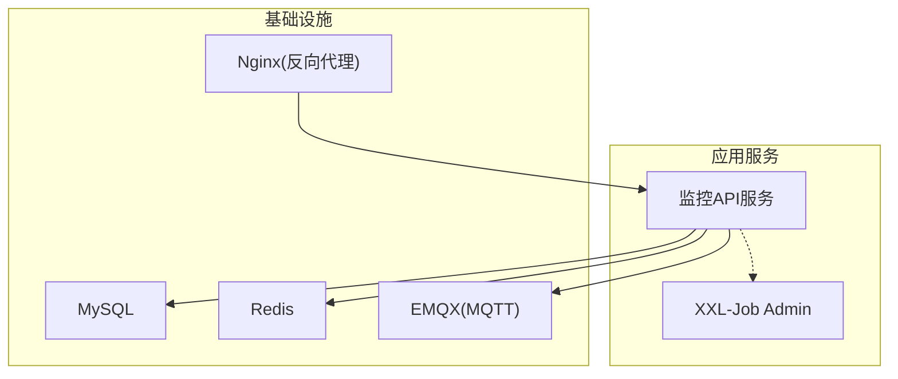
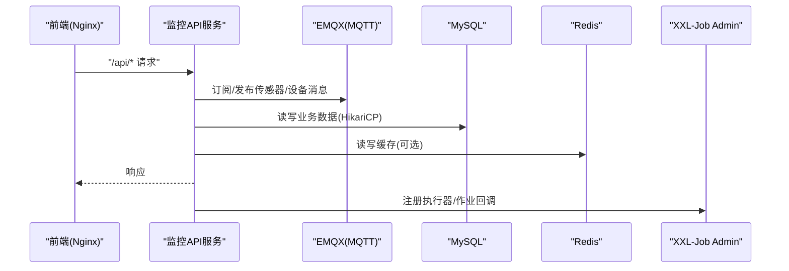
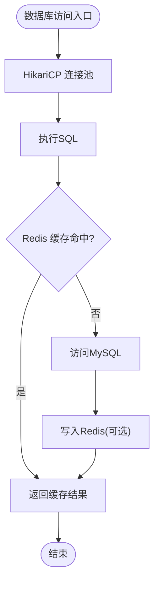
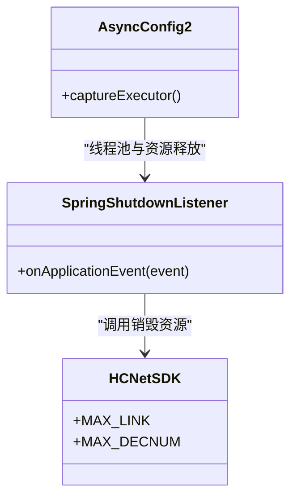
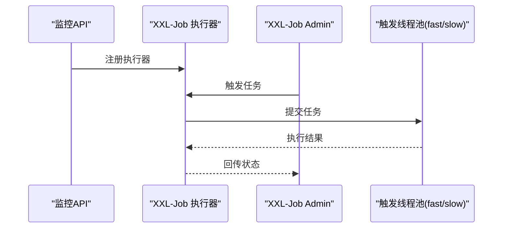
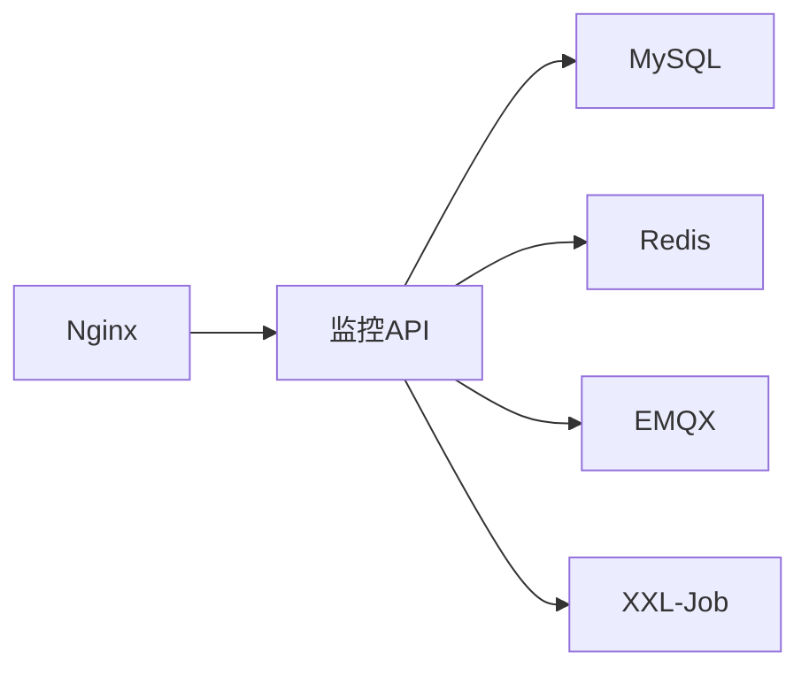

# 性能问题

<cite>
**本文引用的文件**
- [application-prod.yml（监控API）](file://monkey-monitor-api/src/main/resources/application-prod.yml)
- [application-prod.yml（XXL-Job）](file://deploy/config/xxl-job-admin/application-prod.properties)
- [docker-compose.yml](file://deploy/docker-compose.yml)
- [nginx.conf](file://deploy/config/frontend/nginx.conf)
- [MyDataSourceAutoConfiguration.java](file://monkey-monitor/src/main/java/com/monkey/general/config/MyDataSourceAutoConfiguration.java)
- [DatabaseInitConfig.java](file://monkey-monitor/src/main/java/com/monkey/general/config/DatabaseInitConfig.java)
- [XxlJobConfig.java](file://monkey-monitor-api/src/main/java/com/monkey/general/config/XxlJobConfig.java)
- [SpringShutdownListener.java](file://monkey-monitor-api/src/main/java/com/monkey/general/config/SpringShutdownListener.java)
- [logback-spring.xml（监控API）](file://monkey-monitor-api/src/main/resources/logback-spring.xml)
- [logback.xml（XXL-Job）](file://xxl-job-admin/src/main/resources/logback.xml)
- [HCNetSDK.java（大华SDK常量）](file://monkey-monitor/src/main/java/com/monkey/general/viedeo/ClientDemo/HCNetSDK.java)
- [PushingGZDataService.java（贵州数据推送）](file://monkey-monitor/src/main/java/com/monkey/general/platform/push/gz/PushingGZDataService.java)
- [RedisConfig.java](file://monkey-service/src/main/java/com/monkey/general/config/RedisConfig.java)
- [SysConfigRedis.java](file://monkey-service/src/main/java/com/monkey/general/modules/sys/redis/SysConfigRedis.java)
- [AsyncConfig2.java](file://monkey-common/src/main/java/com/monkey/general/common/config/AsyncConfig2.java)
- [JobTriggerPoolHelper.java（XXL-Job）](file://xxl-job-admin/src/main/java/com/xxl/job/admin/core/thread/JobTriggerPoolHelper.java)
- [LocalCacheUtil.java（XXL-Job）](file://xxl-job-admin/src/main/java/com/xxl/job/admin/core/util/LocalCacheUtil.java)
</cite>

## 目录
1. [简介](#简介)
2. [项目结构](#项目结构)
3. [核心组件](#核心组件)
4. [架构总览](#架构总览)
5. [详细组件分析](#详细组件分析)
6. [依赖分析](#依赖分析)
7. [性能考量](#性能考量)
8. [故障排除指南](#故障排除指南)
9. [结论](#结论)
10. [附录](#附录)

## 简介
本指南面向安威 fireworks 物联网监控平台，聚焦于系统性能问题的诊断与优化，覆盖 CPU 使用率过高、内存占用过大、磁盘 IO 瓶颈、网络延迟等通用问题；数据库性能（慢查询、索引、连接池、缓存）；视频流处理（编码参数、并发连接、带宽管理）；以及系统资源监控与性能指标分析（JVM、进程、网络）。文档提供可操作的排查步骤、优化建议与最佳实践。

## 项目结构
系统采用多模块与容器化部署，核心服务包括：
- 监控 API 服务：对外提供设备、告警、数据同步等接口，负责与 MQTT、数据库、第三方平台交互。
- XXL-Job 调度中心：负责定时任务与作业调度。
- 基础设施：MySQL、Redis、EMQX（MQTT）、Nginx 前置代理。
- 视频相关：集成大华 SDK 的客户端演示与能力常量，支撑视频流抓拍与回放场景。

图表来源
- [docker-compose.yml:1-103](file://deploy/docker-compose.yml#L1-L103)
- [nginx.conf:1-24](file://deploy/config/frontend/nginx.conf#L1-L24)

章节来源
- [docker-compose.yml:1-103](file://deploy/docker-compose.yml#L1-L103)
- [nginx.conf:1-24](file://deploy/config/frontend/nginx.conf#L1-L24)

## 核心组件
- 数据库连接池：基于 HikariCP，通过配置文件与自动装配 Bean 控制连接池大小、空闲连接、生命周期等。
- 缓存：Redis 配置与使用，支持系统配置缓存与通用字符串序列化策略。
- 异步与线程池：异步任务线程池与大华抓拍专用线程池，避免阻塞主线程。
- 定时调度：XXL-Job 执行器与触发线程池，支持快速/慢速两类线程池。
- 日志与监控：API 与 XXL-Job 分别配置日志滚动与级别，便于性能问题定位。
- 视频流：大华 SDK 常量定义了最大连接数、解码通道等硬件/SDK 限制，影响并发与资源占用。

章节来源
- [MyDataSourceAutoConfiguration.java:34-50](file://monkey-monitor/src/main/java/com/monkey/general/config/MyDataSourceAutoConfiguration.java#L34-L50)
- [RedisConfig.java:1-37](file://monkey-service/src/main/java/com/monkey/general/config/RedisConfig.java#L1-L37)
- [AsyncConfig2.java:1-27](file://monkey-common/src/main/java/com/monkey/general/common/config/AsyncConfig2.java#L1-L27)
- [XxlJobConfig.java:1-78](file://monkey-monitor-api/src/main/java/com/monkey/general/config/XxlJobConfig.java#L1-L78)
- [logback-spring.xml（监控API）:1-151](file://monkey-monitor-api/src/main/resources/logback-spring.xml#L1-L151)
- [logback.xml（XXL-Job）:28-81](file://xxl-job-admin/src/main/resources/logback.xml#L28-L81)
- [HCNetSDK.java（大华SDK常量）:28-58](file://monkey-monitor/src/main/java/com/monkey/general/viedeo/ClientDemo/HCNetSDK.java#L28-L58)

## 架构总览
下图展示前端、API、MQTT、数据库与调度之间的交互关系，有助于识别网络延迟、MQTT 并发、数据库压力与日志开销等性能瓶颈。

图表来源
- [nginx.conf:12-22](file://deploy/config/frontend/nginx.conf#L12-L22)
- [application-prod.yml（监控API）:1-198](file://monkey-monitor-api/src/main/resources/application-prod.yml#L1-L198)
- [docker-compose.yml:1-103](file://deploy/docker-compose.yml#L1-L103)

## 详细组件分析

### 数据库性能（慢查询、索引、连接池、查询缓存）
- 连接池配置
  - 监控 API 与开发配置均使用 HikariCP，包含最小空闲连接、最大池大小、连接超时、空闲超时等关键参数。
  - 自动装配 Bean 将数据源初始化为 HikariDataSource，并可设置池名称。
- 慢查询与索引
  - 建议结合业务 SQL 与数据库慢查询日志定位热点表与缺失索引。
  - 对高频查询条件列、JOIN 列、排序与分页列建立合适索引。
- 查询缓存
  - Redis 默认关闭开关，可通过配置开启；如启用，需评估键空间设计与过期策略。
- 初始化与可用性
  - 应用启动时会检测并创建数据库 schema，确保表结构就绪，减少运行期异常导致的重试与抖动。

图表来源
- [application-prod.yml（监控API）:4-26](file://monkey-monitor-api/src/main/resources/application-prod.yml#L4-L26)
- [MyDataSourceAutoConfiguration.java:34-50](file://monkey-monitor/src/main/java/com/monkey/general/config/MyDataSourceAutoConfiguration.java#L34-L50)
- [RedisConfig.java:1-37](file://monkey-service/src/main/java/com/monkey/general/config/RedisConfig.java#L1-L37)
- [DatabaseInitConfig.java:1-75](file://monkey-monitor/src/main/java/com/monkey/general/config/DatabaseInitConfig.java#L1-L75)

章节来源
- [application-prod.yml（监控API）:4-26](file://monkey-monitor-api/src/main/resources/application-prod.yml#L4-L26)
- [MyDataSourceAutoConfiguration.java:34-50](file://monkey-monitor/src/main/java/com/monkey/general/config/MyDataSourceAutoConfiguration.java#L34-L50)
- [DatabaseInitConfig.java:1-75](file://monkey-monitor/src/main/java/com/monkey/general/config/DatabaseInitConfig.java#L1-L75)
- [RedisConfig.java:1-37](file://monkey-service/src/main/java/com/monkey/general/config/RedisConfig.java#L1-L37)

### 视频流处理性能（编码参数、并发连接、带宽管理）
- 并发连接上限
  - 大华 SDK 常量定义了单通道最大视频流连接数、解码通道数等，直接影响并发能力与资源占用。
- 抓拍与回放
  - 抓拍线程池与大华资源释放监听器共同保障高并发下的稳定性与资源回收。
- 建议
  - 结合设备能力与网络带宽，合理设置并发连接数与抓拍频率。
  - 对视频流进行必要的裁剪、分辨率与帧率调整以降低带宽与 CPU 占用。

图表来源
- [AsyncConfig2.java:1-27](file://monkey-common/src/main/java/com/monkey/general/common/config/AsyncConfig2.java#L1-L27)
- [SpringShutdownListener.java:1-27](file://monkey-monitor-api/src/main/java/com/monkey/general/config/SpringShutdownListener.java#L1-L27)
- [HCNetSDK.java（大华SDK常量）:28-58](file://monkey-monitor/src/main/java/com/monkey/general/viedeo/ClientDemo/HCNetSDK.java#L28-L58)

章节来源
- [AsyncConfig2.java:1-27](file://monkey-common/src/main/java/com/monkey/general/common/config/AsyncConfig2.java#L1-L27)
- [SpringShutdownListener.java:1-27](file://monkey-monitor-api/src/main/java/com/monkey/general/config/SpringShutdownListener.java#L1-L27)
- [HCNetSDK.java（大华SDK常量）:28-58](file://monkey-monitor/src/main/java/com/monkey/general/viedeo/ClientDemo/HCNetSDK.java#L28-L58)

### 定时调度与线程池（XXL-Job）
- 执行器配置
  - 监控 API 侧通过配置类注入 XXL-Job 执行器，包含管理地址、令牌、应用名、日志路径与保留天数。
- 触发线程池
  - XXL-Job Admin 内部维护快速/慢速两类线程池，队列容量与最大线程数可调，避免任务堆积导致延迟。
- 缓存与日志
  - 本地缓存工具用于短期高频数据缓存；日志按级别滚动，生产环境建议降低日志级别以减少 IO。

图表来源
- [XxlJobConfig.java:1-78](file://monkey-monitor-api/src/main/java/com/monkey/general/config/XxlJobConfig.java#L1-L78)
- [JobTriggerPoolHelper.java（XXL-Job）:1-76](file://xxl-job-admin/src/main/java/com/xxl/job/admin/core/thread/JobTriggerPoolHelper.java#L1-L76)
- [LocalCacheUtil.java（XXL-Job）:1-106](file://xxl-job-admin/src/main/java/com/xxl/job/admin/core/util/LocalCacheUtil.java#L1-L106)

章节来源
- [XxlJobConfig.java:1-78](file://monkey-monitor-api/src/main/java/com/monkey/general/config/XxlJobConfig.java#L1-L78)
- [JobTriggerPoolHelper.java（XXL-Job）:1-76](file://xxl-job-admin/src/main/java/com/xxl/job/admin/core/thread/JobTriggerPoolHelper.java#L1-L76)
- [LocalCacheUtil.java（XXL-Job）:1-106](file://xxl-job-admin/src/main/java/com/xxl/job/admin/core/util/LocalCacheUtil.java#L1-L106)

### 网络与前端代理（Nginx）
- 反向代理
  - Nginx 将 /api/ 请求转发至监控 API，设置连接/读写超时，避免上游阻塞。
- 建议
  - 根据业务流量峰值调整超时与缓冲区参数；对静态资源启用缓存与压缩。

章节来源
- [nginx.conf:12-22](file://deploy/config/frontend/nginx.conf#L12-L22)

## 依赖分析
- 组件耦合
  - 监控 API 依赖数据库、Redis、EMQX 与 XXL-Job；数据库连接池与缓存配置直接影响整体吞吐与延迟。
- 外部依赖
  - MySQL、Redis、EMQX、Nginx、XXL-Job Admin 通过 docker-compose 组织，健康检查与端口映射决定可用性与可观测性。
- 潜在环路
  - 当前结构为单向依赖（API → 基础设施/调度），未见明显循环依赖。

图表来源
- [docker-compose.yml:1-103](file://deploy/docker-compose.yml#L1-L103)
- [application-prod.yml（监控API）:1-198](file://monkey-monitor-api/src/main/resources/application-prod.yml#L1-L198)

章节来源
- [docker-compose.yml:1-103](file://deploy/docker-compose.yml#L1-L103)

## 性能考量
- CPU 使用率过高
  - 检查视频流抓拍与解码线程池是否过大；适当降低并发连接与抓拍频率。
  - 关注 XXL-Job 触发线程池负载，必要时拆分快/慢任务池。
  - 减少日志级别与日志滚动频率，避免频繁 IO。
- 内存占用过大
  - 调整 HikariCP 最大池大小与空闲超时，避免连接持有过久。
  - Redis 连接池参数需与业务峰值匹配，防止连接泄漏。
  - JVM 参数（堆大小、GC 策略）需结合容器内存限制进行配置。
- 磁盘 IO 瓶颈
  - 日志滚动策略与保留天数需平衡可观测性与 IO 压力。
  - 数据库慢查询与大事务会放大 IO，需优化 SQL 与事务粒度。
- 网络延迟
  - Nginx 超时参数需与后端处理能力匹配；MQTT 主题订阅量与 QoS 需权衡。
  - 跨服务调用（如贵州数据推送）应考虑批量与压缩，减少 RTT。

## 故障排除指南

### 通用性能问题（CPU/内存/IO/网络）
- 快速定位
  - 使用系统监控工具观察 CPU、内存、磁盘 IO、网络带宽与连接数。
  - 查看 API 与 XXL-Job 日志，确认是否存在大量 ERROR/WARN 或高频 INFO。
- 常见根因
  - 数据库连接池过小导致排队；Redis 连接池过大导致上下文切换。
  - 视频流并发超过设备/SDK 限制，引发阻塞与资源耗尽。
  - Nginx 超时过短导致上游重试与堆积。
- 优化步骤
  - 调整 HikariCP 最大池大小与空闲超时，确保满足峰值但不过度。
  - 评估 Redis 连接池上限与超时，避免阻塞等待。
  - 限制视频流并发连接数，结合带宽与设备能力调参。
  - 优化 Nginx 超时与缓冲，提升上游稳定性。
  - 降低生产日志级别，减少磁盘 IO。

章节来源
- [logback-spring.xml（监控API）:1-151](file://monkey-monitor-api/src/main/resources/logback-spring.xml#L1-L151)
- [logback.xml（XXL-Job）:28-81](file://xxl-job-admin/src/main/resources/logback.xml#L28-L81)
- [application-prod.yml（监控API）:4-26](file://monkey-monitor-api/src/main/resources/application-prod.yml#L4-L26)
- [application-prod.yml（XXL-Job）:31-42](file://deploy/config/xxl-job-admin/application-prod.properties#L31-L42)
- [HCNetSDK.java（大华SDK常量）:28-58](file://monkey-monitor/src/main/java/com/monkey/general/viedeo/ClientDemo/HCNetSDK.java#L28-L58)
- [nginx.conf:19-22](file://deploy/config/frontend/nginx.conf#L19-L22)

### 数据库性能问题（慢查询、索引、连接池、缓存）
- 慢查询定位
  - 启用数据库慢查询日志，结合业务 SQL 分析执行计划。
  - 对高频查询列建立合适索引，避免全表扫描。
- 连接池优化
  - 根据峰值并发与平均响应时间调整最大池大小与空闲连接。
  - 设置合理的连接超时与空闲超时，避免连接泄漏。
- 缓存策略
  - 评估 Redis 缓存命中率与过期策略，避免缓存雪崩与穿透。
  - 明确缓存键空间与序列化方式，保证一致性与性能。

章节来源
- [application-prod.yml（监控API）:4-26](file://monkey-monitor-api/src/main/resources/application-prod.yml#L4-L26)
- [MyDataSourceAutoConfiguration.java:34-50](file://monkey-monitor/src/main/java/com/monkey/general/config/MyDataSourceAutoConfiguration.java#L34-L50)
- [RedisConfig.java:1-37](file://monkey-service/src/main/java/com/monkey/general/config/RedisConfig.java#L1-L37)
- [SysConfigRedis.java:1-37](file://monkey-service/src/main/java/com/monkey/general/modules/sys/redis/SysConfigRedis.java#L1-L37)

### 视频流处理性能问题（编码参数、并发连接、带宽管理）
- 并发与资源
  - 参考大华 SDK 常量，合理设置最大连接数与解码通道数，避免超限。
  - 使用专用线程池处理抓拍任务，避免阻塞主业务线程。
- 带宽与质量
  - 根据网络带宽与设备能力调整分辨率、帧率与码率。
  - 对长时间回放与抓拍任务进行限流与节流。
- 资源回收
  - 在应用关闭事件中释放大华相关资源，防止句柄泄漏。

章节来源
- [AsyncConfig2.java:1-27](file://monkey-common/src/main/java/com/monkey/general/common/config/AsyncConfig2.java#L1-L27)
- [SpringShutdownListener.java:1-27](file://monkey-monitor-api/src/main/java/com/monkey/general/config/SpringShutdownListener.java#L1-L27)
- [HCNetSDK.java（大华SDK常量）:28-58](file://monkey-monitor/src/main/java/com/monkey/general/viedeo/ClientDemo/HCNetSDK.java#L28-L58)

### 系统资源监控与性能指标分析（JVM/进程/网络）
- JVM 监控
  - 结合容器内存限制与 GC 日志，优化堆大小与垃圾回收策略。
- 进程监控
  - 关注 API 与 XXL-Job 进程的 CPU、内存、线程数与阻塞状态。
- 网络监控
  - 监控 Nginx、EMQX 的连接数、消息吞吐与延迟。
  - 对跨服务调用（如贵州数据推送）统计成功率与耗时。

章节来源
- [logback-spring.xml（监控API）:1-151](file://monkey-monitor-api/src/main/resources/logback-spring.xml#L1-L151)
- [logback.xml（XXL-Job）:28-81](file://xxl-job-admin/src/main/resources/logback.xml#L28-L81)
- [PushingGZDataService.java（贵州数据推送）:391-514](file://monkey-monitor/src/main/java/com/monkey/general/platform/push/gz/PushingGZDataService.java#L391-L514)

### 最佳实践与配置建议
- 数据库
  - 连接池：最大池大小 ≥ 并发 × 期望响应时间 / 连接生命周期；空闲超时适中，避免连接抖动。
  - 索引：围绕高频查询列、JOIN 列、排序列建立复合索引，定期分析执行计划。
  - 缓存：开启 Redis 时，统一键命名规范与过期策略，避免热键与雪崩。
- 视频流
  - 并发：不超过设备/SDK 的最大连接数与解码通道数。
  - 参数：根据带宽与存储成本选择分辨率、帧率与码率。
  - 线程：独立线程池承载抓拍与回放，设置拒绝策略与队列上限。
- 调度与日志
  - XXL-Job：快/慢任务分离，合理划分线程池与队列容量。
  - 日志：生产环境降低日志级别，启用按日期滚动与压缩，控制保留天数。

## 结论
通过对数据库连接池、缓存、视频流并发、调度线程池与日志策略的系统性优化，可显著缓解 CPU、内存、IO 与网络方面的性能问题。建议以监控数据为依据，逐步收敛参数，配合索引与 SQL 优化，持续提升系统吞吐与稳定性。

## 附录
- 关键配置要点
  - 数据库连接池：最小空闲连接、最大池大小、连接超时、空闲超时。
  - Redis：连接池上限、阻塞等待、空闲连接、超时。
  - 视频流：最大连接数、解码通道数、抓拍线程池大小与队列容量。
  - 调度：快/慢线程池最大值、队列容量、日志路径与保留天数。
  - 日志：级别、滚动策略、保留天数。