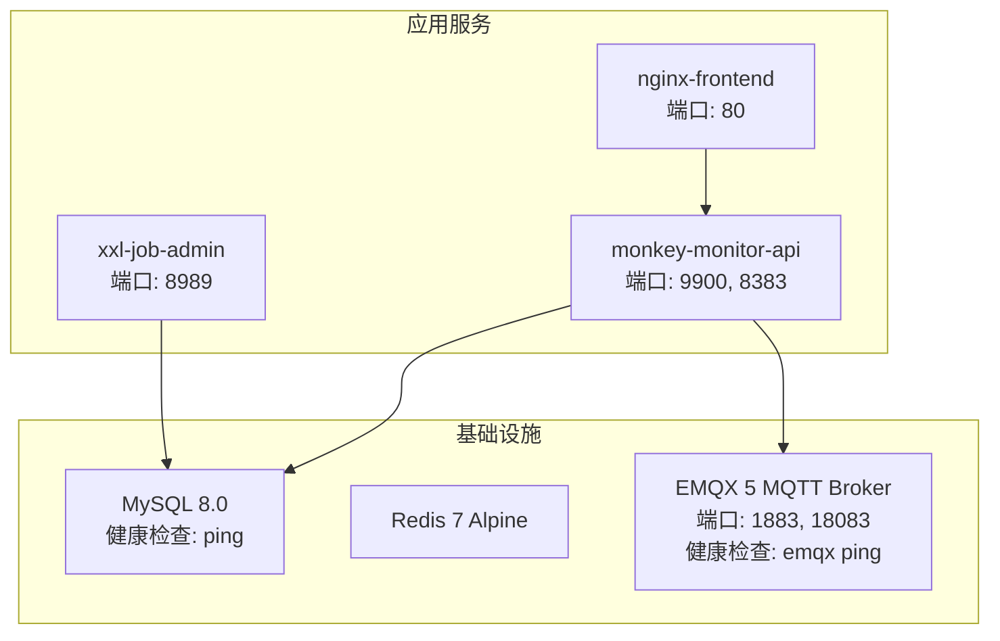
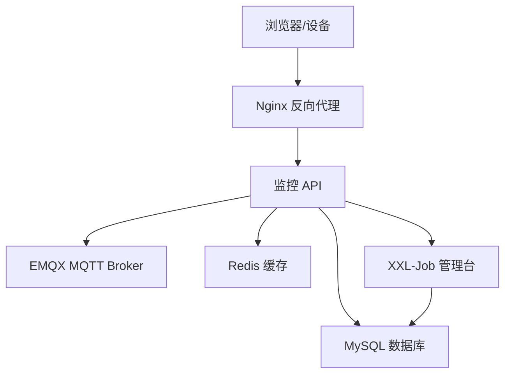
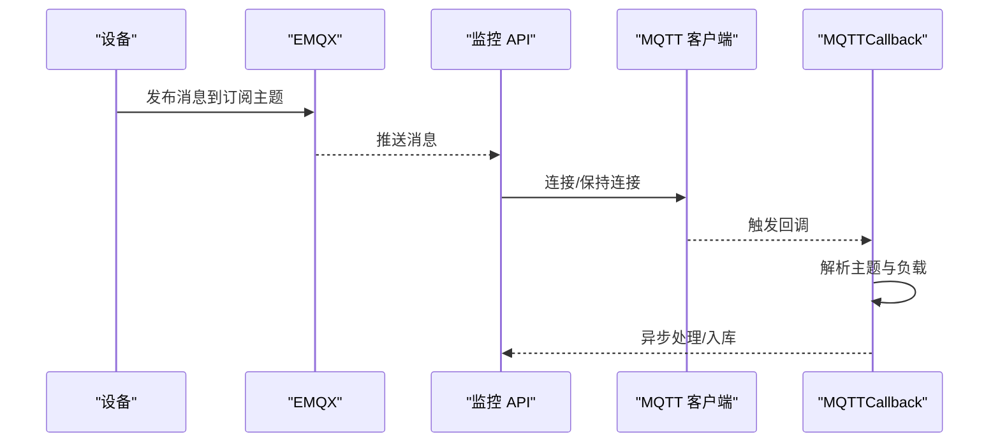
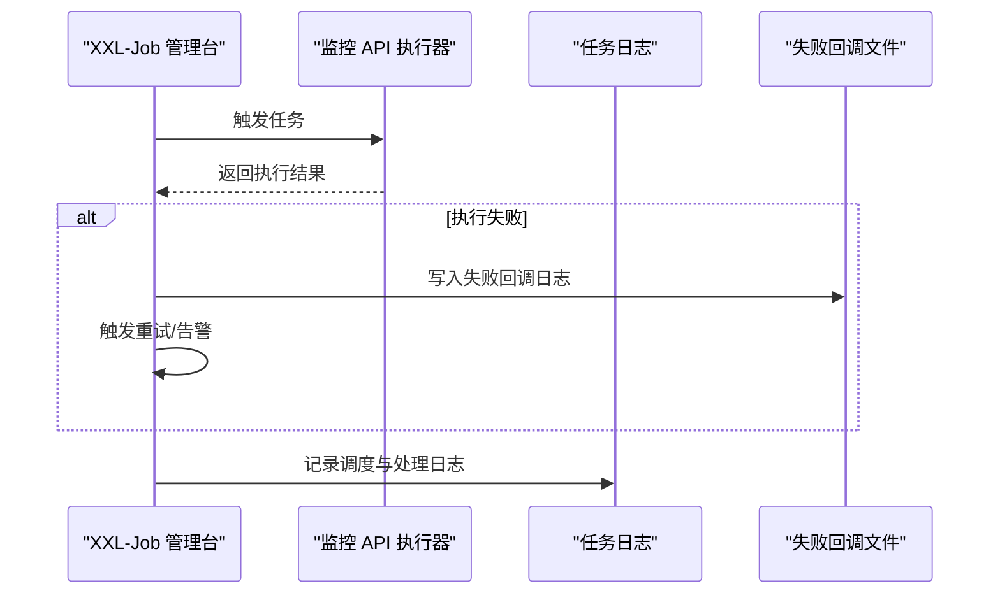
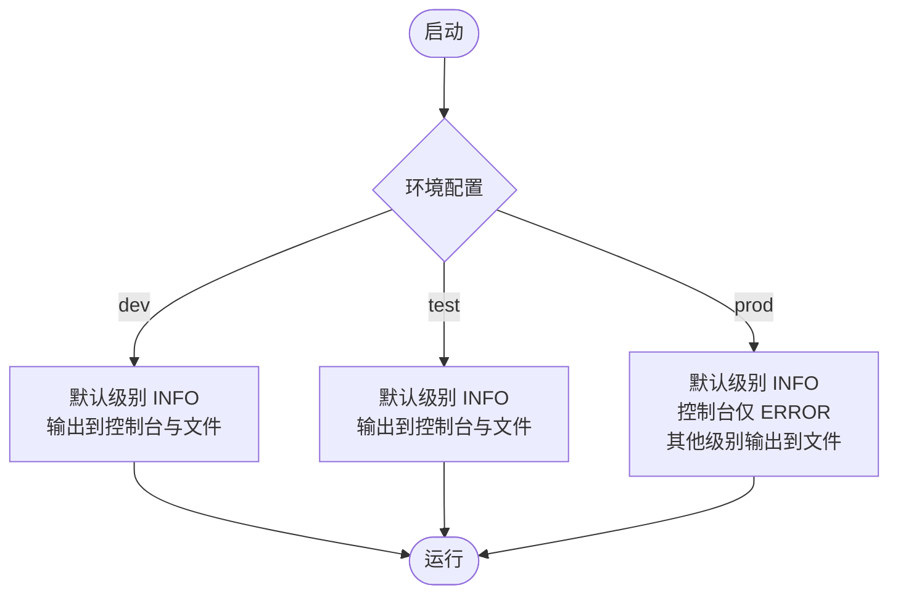
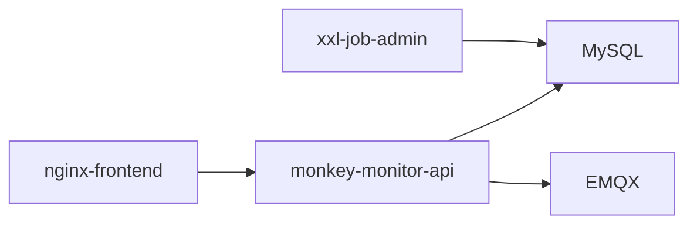

# 故障排除

<cite>
**本文引用的文件**
- [docker-compose.yml](file://deploy/docker-compose.yml)
- [application-prod.yml](file://monkey-monitor-api/src/main/resources/application-prod.yml)
- [logback-spring.xml](file://monkey-monitor-api/src/main/resources/logback-spring.xml)
- [application-prod.properties](file://xxl-job-admin/src/main/resources/application-prod.properties)
- [nginx.conf](file://deploy/config/frontend/nginx.conf)
- [TopicMethonUtil.java](file://monkey-monitor/src/main/java/com/monkey/general/config/mqtt/TopicMethonUtil.java)
- [MyMqttConfiguration.java](file://monkey-monitor/src/main/java/com/monkey/general/config/mqtt/MyMqttConfiguration.java)
- [MQTTCallback.java](file://monkey-monitor/src/main/java/com/monkey/general/config/mqtt/MQTTCallback.java)
- [XxlJobConfig.java](file://monkey-monitor-api/src/main/java/com/monkey/general/config/XxlJobConfig.java)
- [TriggerCallbackThread.java](file://xxl-job-core/src/main/java/com/xxl/job/core/thread/TriggerCallbackThread.java)
- [JobFailMonitorHelper.java](file://xxl-job-admin/src/main/java/com/xxl/job/admin/core/thread/JobFailMonitorHelper.java)
- [init.sql](file://deploy/init/init.sql)
- [部署操作手册.md](file://deploy/部署操作手册.md)
- [HCNetSDK.java](file://monkey-monitor/src/main/java/com/monkey/general/viedeo/ClientDemo/HCNetSDK.java)
- [ClientDemo.java](file://monkey-monitor/src/main/java/com/monkey/general/viedeo/ClientDemo/ClientDemo.java)
</cite>

## 目录
1. [简介](#简介)
2. [项目结构](#项目结构)
3. [核心组件](#核心组件)
4. [架构总览](#架构总览)
5. [详细组件分析](#详细组件分析)
6. [依赖分析](#依赖分析)
7. [性能考虑](#性能考虑)
8. [故障排除指南](#故障排除指南)
9. [结论](#结论)
10. [附录](#附录)

## 简介
本指南面向安威 fireworks 物联网监控平台的运维与开发人员，聚焦于系统常见问题的快速定位与修复，涵盖启动失败、连接超时、内存溢出、数据库异常、设备连接问题、告警系统故障、数据库性能问题、系统监控与健康检查以及紧急故障的应急流程。文档基于仓库中的部署编排、配置文件、日志配置与关键代码实现，提供可操作的排查步骤与优化建议。

## 项目结构
系统采用 Docker 编排，包含基础设施（MySQL、Redis、EMQX）与应用服务（监控 API、XXL-Job 管理台、前端 Nginx），服务间通过独立网络互通，并通过健康检查确保依赖可用后再启动应用。

图表来源
- [docker-compose.yml:1-103](file://deploy/docker-compose.yml#L1-L103)

章节来源
- [docker-compose.yml:1-103](file://deploy/docker-compose.yml#L1-L103)
- [部署操作手册.md:26-42](file://deploy/部署操作手册.md#L26-L42)

## 核心组件
- 监控 API（应用层）：负责 MQTT 订阅、设备数据接入、业务处理、定时任务调度与对外接口。
- MQTT 子系统：负责与 EMQX 的连接、主题订阅、消息回调与数据解析。
- XXL-Job：分布式任务调度中心与执行器，负责定时任务的调度、失败重试与告警。
- 前端 Nginx：反向代理，将 /api/ 请求转发至监控 API。
- 数据库与缓存：MySQL 与 Redis（配置中可开关）。

章节来源
- [application-prod.yml:1-198](file://monkey-monitor-api/src/main/resources/application-prod.yml#L1-L198)
- [XxlJobConfig.java:1-78](file://monkey-monitor-api/src/main/java/com/monkey/general/config/XxlJobConfig.java#L1-L78)
- [MyMqttConfiguration.java:1-43](file://monkey-monitor/src/main/java/com/monkey/general/config/mqtt/MyMqttConfiguration.java#L1-L43)
- [nginx.conf:1-24](file://deploy/config/frontend/nginx.conf#L1-L24)

## 架构总览
系统以“前端 Nginx → 监控 API → 数据库/缓存/消息中间件”的链路为主，XXL-Job 独立管理定时任务，EMQX 作为 MQTT 代理承载设备数据。

图表来源
- [docker-compose.yml:33-98](file://deploy/docker-compose.yml#L33-L98)
- [nginx.conf:12-22](file://deploy/config/frontend/nginx.conf#L12-L22)

## 详细组件分析

### MQTT 连接与订阅
- 连接配置：本地 MQTT 与传感器 MQTT 的 host、端口、用户名、密码、clientId、超时与保活参数均在配置文件中集中管理。
- 连接与订阅：通过配置类创建 MQTT 客户端并连接，订阅主题（如温度/湿度/液位、自研人员数据等）。
- 回调处理：回调中统一处理断线、消息到达与异常，避免在回调中直接执行耗时或数据库操作，防止断线重连。

图表来源
- [MyMqttConfiguration.java:1-43](file://monkey-monitor/src/main/java/com/monkey/general/config/mqtt/MyMqttConfiguration.java#L1-L43)
- [MQTTCallback.java:1-33](file://monkey-monitor/src/main/java/com/monkey/general/config/mqtt/MQTTCallback.java#L1-L33)
- [application-prod.yml:30-48](file://monkey-monitor-api/src/main/resources/application-prod.yml#L30-L48)

章节来源
- [MyMqttConfiguration.java:1-43](file://monkey-monitor/src/main/java/com/monkey/general/config/mqtt/MyMqttConfiguration.java#L1-L43)
- [MQTTCallback.java:1-33](file://monkey-monitor/src/main/java/com/monkey/general/config/mqtt/MQTTCallback.java#L1-L33)
- [TopicMethonUtil.java:75-141](file://monkey-monitor/src/main/java/com/monkey/general/config/mqtt/TopicMethonUtil.java#L75-L141)
- [application-prod.yml:30-48](file://monkey-monitor-api/src/main/resources/application-prod.yml#L30-L48)

### XXL-Job 调度与告警
- 执行器配置：监控 API 中加载 XXL-Job 执行器，配置管理地址、令牌、应用名、IP/端口、日志路径与保留天数。
- 失败监控与重试：管理台侧对失败任务进行重试与告警，失败回调写入失败日志文件，便于后续重试或人工干预。
- 数据源与连接池：管理台使用 Hikari 连接池，具备超时、空闲、最大连接等参数，保障调度与日志查询稳定。

图表来源
- [XxlJobConfig.java:1-78](file://monkey-monitor-api/src/main/java/com/monkey/general/config/XxlJobConfig.java#L1-L78)
- [application-prod.properties:25-42](file://xxl-job-admin/src/main/resources/application-prod.properties#L25-L42)
- [TriggerCallbackThread.java:204-235](file://xxl-job-core/src/main/java/com/xxl/job/core/thread/TriggerCallbackThread.java#L204-L235)
- [JobFailMonitorHelper.java:42-66](file://xxl-job-admin/src/main/java/com/xxl/job/admin/core/thread/JobFailMonitorHelper.java#L42-L66)

章节来源
- [XxlJobConfig.java:1-78](file://monkey-monitor-api/src/main/java/com/monkey/general/config/XxlJobConfig.java#L1-L78)
- [application-prod.properties:25-42](file://xxl-job-admin/src/main/resources/application-prod.properties#L25-L42)
- [TriggerCallbackThread.java:204-235](file://xxl-job-core/src/main/java/com/xxl/job/core/thread/TriggerCallbackThread.java#L204-L235)
- [JobFailMonitorHelper.java:42-66](file://xxl-job-admin/src/main/java/com/xxl/job/admin/core/thread/JobFailMonitorHelper.java#L42-L66)

### 日志系统与配置
- 日志级别：开发/测试/生产环境分别配置默认级别与输出目标（控制台/文件）。
- 文件滚动：按月归档，保留策略可按需调整。
- 关键日志：INFO/WARN/ERROR 分别输出到不同文件，便于分层排查。

图表来源
- [logback-spring.xml:103-150](file://monkey-monitor-api/src/main/resources/logback-spring.xml#L103-L150)

章节来源
- [logback-spring.xml:1-152](file://monkey-monitor-api/src/main/resources/logback-spring.xml#L1-L152)

## 依赖分析
- 服务依赖：前端 Nginx → 监控 API → MySQL（健康）；监控 API → EMQX（健康）；XXL-Job 管理台 → MySQL（健康）。
- 配置依赖：监控 API 的 MQTT、数据库、Redis、XXL-Job 参数均来自配置文件；Nginx 将 /api/ 反代至监控 API。
- 数据库初始化：首次启动由初始化脚本创建业务库与调度库并导入表结构。

图表来源
- [docker-compose.yml:37-98](file://deploy/docker-compose.yml#L37-L98)

章节来源
- [docker-compose.yml:1-103](file://deploy/docker-compose.yml#L1-L103)
- [init.sql:1-219](file://deploy/init/init.sql#L1-L219)

## 性能考虑
- 连接池与超时：数据库连接池参数（最小空闲、最大连接、超时）直接影响吞吐与稳定性，需结合业务峰值调优。
- Redis 连接池：连接上限与等待时间需与应用并发匹配，避免阻塞。
- MQTT 连接：超时与保活参数影响设备掉线频率，需平衡网络波动与资源消耗。
- 日志级别：生产环境建议提升默认级别并减少控制台输出，降低 IO 压力。
- 网络代理：Nginx 的连接/读写超时需与后端处理能力匹配，避免上游超时。

章节来源
- [application-prod.yml:4-26](file://monkey-monitor-api/src/main/resources/application-prod.yml#L4-L26)
- [application-prod.yml:116-135](file://monkey-monitor-api/src/main/resources/application-prod.yml#L116-L135)
- [nginx.conf:19-22](file://deploy/config/frontend/nginx.conf#L19-L22)

## 故障排除指南

### 一、启动失败
- 症状：容器反复重启或健康检查失败。
- 排查步骤：
  - 查看容器健康检查：MySQL/EMQX 的健康检查命令与重试参数，确认依赖可用。
  - 查看应用日志：监控 API 与 XXL-Job 管理台日志，定位启动阶段异常。
  - 校验配置：确认数据库连接串、用户名/密码、MQTT 地址与端口、XXL-Job 管理台地址与令牌。
  - 网络连通：确认容器网络与端口映射，Nginx 是否正确反代到监控 API。
- 优化建议：调整健康检查间隔与超时，确保依赖服务充分初始化后再启动应用。

章节来源
- [docker-compose.yml:17-22](file://deploy/docker-compose.yml#L17-L22)
- [docker-compose.yml:45-50](file://deploy/docker-compose.yml#L45-L50)
- [logback-spring.xml:119-133](file://monkey-monitor-api/src/main/resources/logback-spring.xml#L119-L133)
- [application-prod.yml:116-135](file://monkey-monitor-api/src/main/resources/application-prod.yml#L116-L135)

### 二、连接超时
- 症状：MQTT 连接超时、HTTP 请求超时、数据库连接超时。
- 排查步骤：
  - MQTT：核对本地与传感器 MQTT 的 host/port/timeout/keepalive；确认 EMQX 端口开放与认证通过。
  - HTTP：检查 Nginx 的 proxy_connect_timeout/proxy_read_timeout；确认监控 API 端口映射与防火墙。
  - 数据库：核对连接池参数与最大连接数；查看连接池耗尽或超时日志。
- 优化建议：适当提高超时阈值与连接池上限；对热点接口增加缓存与异步处理。

章节来源
- [application-prod.yml:30-48](file://monkey-monitor-api/src/main/resources/application-prod.yml#L30-L48)
- [application-prod.yml:4-26](file://monkey-monitor-api/src/main/resources/application-prod.yml#L4-L26)
- [nginx.conf:19-22](file://deploy/config/frontend/nginx.conf#L19-L22)

### 三、内存溢出（OOM）
- 症状：进程崩溃、频繁 Full GC、系统 swap 占用高。
- 排查步骤：
  - JVM 参数：确认堆大小与 GC 策略（通过容器启动参数或 JVM 启动脚本）。
  - 日志分析：关注 GC 日志与异常栈，定位大对象分配与泄漏点。
  - 业务热点：排查大数据批处理、缓存膨胀、MQTT 消息堆积。
- 优化建议：缩小对象生命周期、启用压缩/限流、拆分任务批次、增加硬件资源。

章节来源
- [logback-spring.xml:1-152](file://monkey-monitor-api/src/main/resources/logback-spring.xml#L1-L152)

### 四、数据库连接异常
- 症状：连接池耗尽、慢查询、事务长时间锁等待。
- 排查步骤：
  - 连接池参数：核对最小空闲、最大连接、连接超时与空闲回收。
  - 慢查询：开启慢查询日志，定位执行时间长的 SQL。
  - 锁等待：检查锁表/锁行情况，优化索引与事务粒度。
  - 初始化脚本：确认业务库与调度库已创建并初始化。
- 优化建议：增加连接池上限、优化 SQL 与索引、缩短事务、拆分读写分离。

章节来源
- [application-prod.yml:4-26](file://monkey-monitor-api/src/main/resources/application-prod.yml#L4-L26)
- [application-prod.properties:31-42](file://xxl-job-admin/src/main/resources/application-prod.properties#L31-L42)
- [init.sql:1-219](file://deploy/init/init.sql#L1-L219)

### 五、设备连接问题（MQTT）
- 症状：MQTT 连接失败、设备离线、数据采集异常。
- 排查步骤：
  - 连接参数：确认 MQTT host/port/username/password/clientId/public-host。
  - 主题订阅：确认订阅的主题是否正确，回调是否正常触发。
  - 断线重连：检查回调中的丢失连接处理逻辑，避免在回调中执行阻塞操作。
  - 设备侧：确认设备网络可达、认证信息正确、EMQX 控制台状态。
- 优化建议：提高超时与保活参数，增加重连与退避策略，对异常消息进行隔离与降噪。

章节来源
- [application-prod.yml:30-58](file://monkey-monitor-api/src/main/resources/application-prod.yml#L30-L58)
- [MyMqttConfiguration.java:1-43](file://monkey-monitor/src/main/java/com/monkey/general/config/mqtt/MyMqttConfiguration.java#L1-L43)
- [MQTTCallback.java:29-33](file://monkey-monitor/src/main/java/com/monkey/general/config/mqtt/MQTTCallback.java#L29-L33)
- [TopicMethonUtil.java:75-141](file://monkey-monitor/src/main/java/com/monkey/general/config/mqtt/TopicMethonUtil.java#L75-L141)

### 六、告警系统故障
- 症状：告警不触发、重复告警、告警延迟。
- 排查步骤：
  - XXL-Job 失败监控：检查失败任务是否写入失败回调文件，是否触发重试与告警。
  - 告警状态：确认日志表中的 alarm_status 字段流转是否正常。
  - 通知渠道：检查邮件/IM 通知配置与可用性。
- 优化建议：完善失败重试与幂等控制，规范告警状态机，增加告警去重与延迟补偿。

章节来源
- [TriggerCallbackThread.java:204-235](file://xxl-job-core/src/main/java/com/xxl/job/core/thread/TriggerCallbackThread.java#L204-L235)
- [JobFailMonitorHelper.java:42-66](file://xxl-job-admin/src/main/java/com/xxl/job/admin/core/thread/JobFailMonitorHelper.java#L42-L66)

### 七、系统监控与健康检查
- 健康检查：MySQL/EMQX 健康检查命令与周期已在编排中配置，应用服务依赖其健康状态。
- 监控指标：建议补充 CPU/内存/磁盘/网络/数据库连接池/队列长度等指标采集与告警。
- 日志轮转：按月归档与保留策略需结合磁盘容量评估。

章节来源
- [docker-compose.yml:17-22](file://deploy/docker-compose.yml#L17-L22)
- [docker-compose.yml:45-50](file://deploy/docker-compose.yml#L45-L50)
- [logback-spring.xml:41-98](file://monkey-monitor-api/src/main/resources/logback-spring.xml#L41-L98)

### 八、紧急故障应急流程
- 立即措施：
  - 降低日志级别（生产环境已限制控制台输出），避免放大 IO。
  - 临时关闭高风险任务或接口，释放资源。
  - 检查数据库连接池与慢查询，必要时扩容或降载。
- 恢复策略：
  - 修复配置（MQTT/数据库/XXL-Job），重启受影响服务。
  - 校验健康检查与依赖服务状态，确保应用在依赖健康后启动。
  - 回放失败回调与告警日志，补齐缺失数据与告警。

章节来源
- [部署操作手册.md:176-245](file://deploy/部署操作手册.md#L176-L245)
- [TriggerCallbackThread.java:204-235](file://xxl-job-core/src/main/java/com/xxl/job/core/thread/TriggerCallbackThread.java#L204-L235)

## 结论
本指南围绕部署编排、配置文件与关键代码实现，给出了从启动、连接、性能到告警与数据库的全链路故障排除路径。建议在生产环境中持续完善日志分级、健康检查与监控指标，形成闭环的可观测性体系，以提升问题定位效率与系统稳定性。

## 附录

### A. 关键配置与参数速查
- 监控 API 配置要点
  - 数据库连接池：最小空闲、最大连接、超时与空闲回收。
  - Redis：开关、数据库、主机、端口、超时与连接池上限。
  - MQTT：本地与传感器 host/port/用户名/密码/超时/保活/订阅主题。
  - XXL-Job：管理台地址、令牌、应用名、IP/端口、日志路径与保留天数。
- Nginx 反向代理：/api/ 转发至监控 API，设置连接/读写超时。
- XXL-Job 管理台：数据库连接池参数、触发线程池上限、日志保留天数。

章节来源
- [application-prod.yml:4-26](file://monkey-monitor-api/src/main/resources/application-prod.yml#L4-L26)
- [application-prod.yml:30-135](file://monkey-monitor-api/src/main/resources/application-prod.yml#L30-L135)
- [nginx.conf:12-22](file://deploy/config/frontend/nginx.conf#L12-L22)
- [application-prod.properties:25-66](file://xxl-job-admin/src/main/resources/application-prod.properties#L25-L66)

### B. 设备视频/报警相关参考
- SDK 初始化与异常码：涉及设备初始化、异常回调与报警类型枚举，可用于设备侧问题定位与日志解读。
  
章节来源
- [HCNetSDK.java:224-1028](file://monkey-monitor/src/main/java/com/monkey/general/viedeo/ClientDemo/HCNetSDK.java#L224-L1028)
- [ClientDemo.java:1389-1414](file://monkey-monitor/src/main/java/com/monkey/general/viedeo/ClientDemo/ClientDemo.java#L1389-L1414)