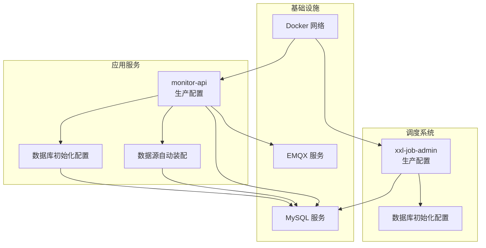
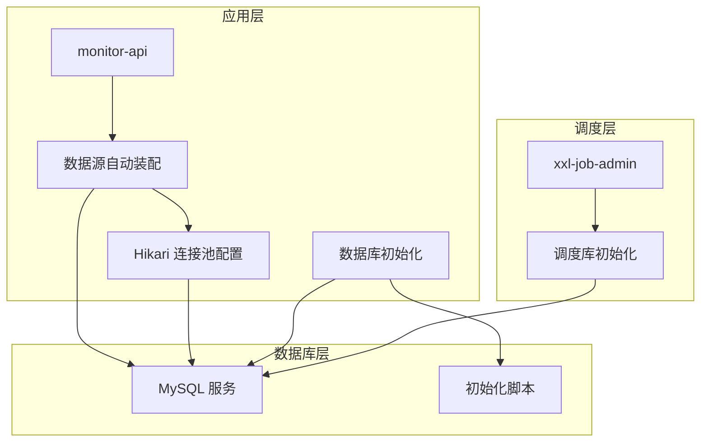
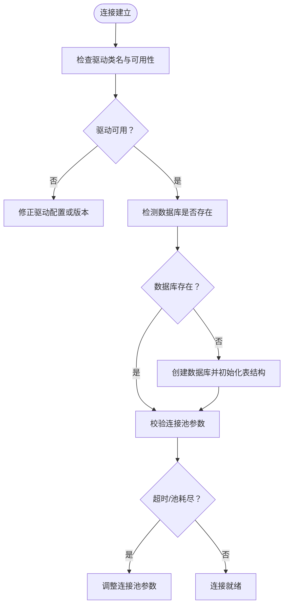
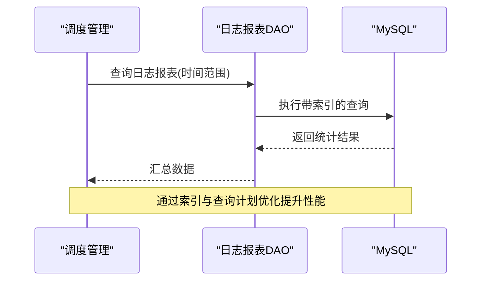
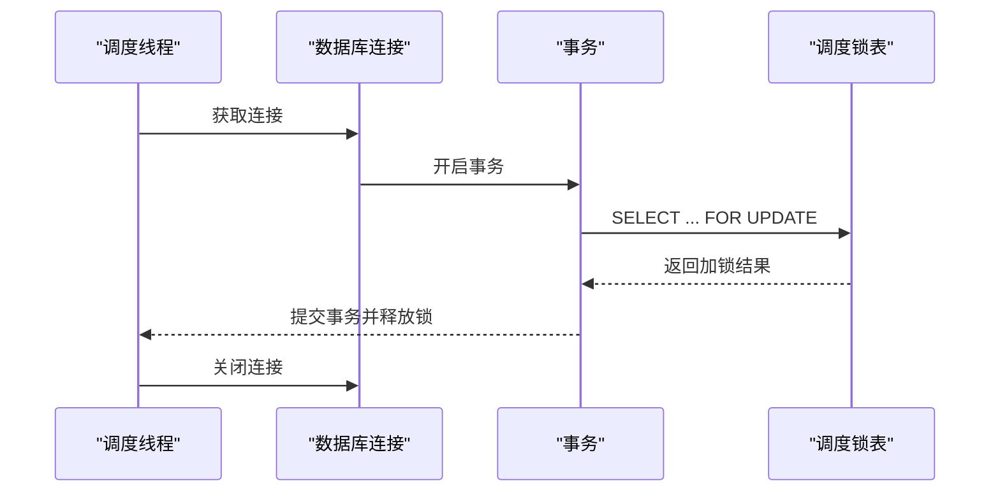
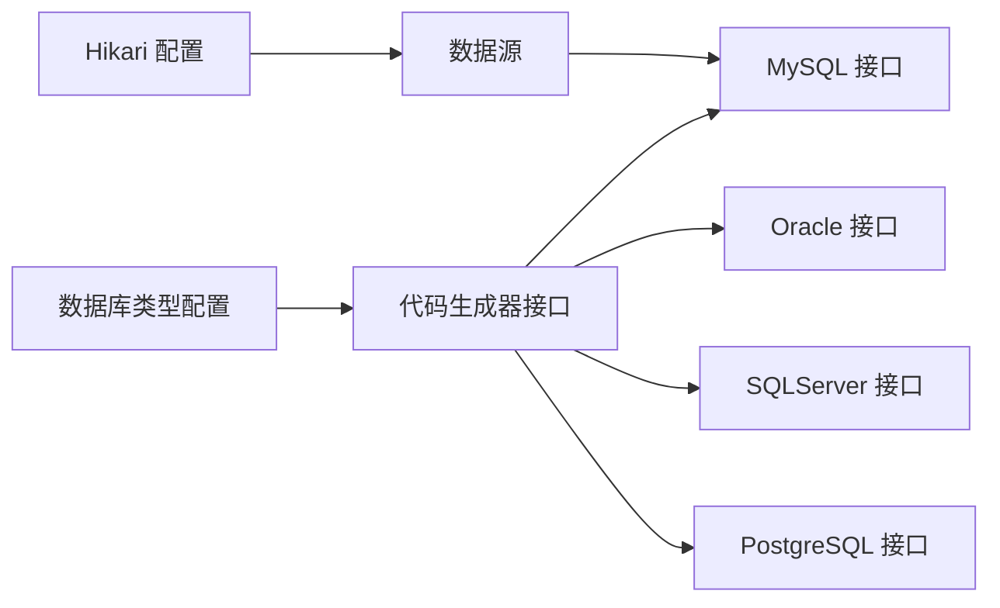

# 数据库问题

<cite>
**本文引用的文件**
- [application-prod.yml](file://deploy/config/monitor-api/application-prod.yml)
- [MyDataSourceAutoConfiguration.java](file://monkey-monitor/src/main/java/com/monkey/general/config/MyDataSourceAutoConfiguration.java)
- [DatabaseInitConfig.java](file://monkey-monitor/src/main/java/com/monkey/general/config/DatabaseInitConfig.java)
- [XxlDataBaseConfig.java](file://xxl-job-admin/src/main/java/com/xxl/job/admin/core/conf/XxlDataBaseConfig.java)
- [application-prod.properties](file://xxl-job-admin/src/main/resources/application-prod.properties)
- [init.sql](file://deploy/init/init.sql)
- [docker-compose.yml](file://deploy/docker-compose.yml)
- [JobScheduleHelper.java](file://xxl-job-admin/src/main/java/com/xxl/job/admin/core/thread/JobScheduleHelper.java)
- [XxlJobLogReportDao.java](file://xxl-job-admin/src/main/java/com/xxl/job/admin/dao/XxlJobLogReportDao.java)
- [DbConfig.java](file://monkey-code-generator/src/main/java/com/monkey/config/DbConfig.java)
- [MySQLGeneratorDao.java](file://monkey-code-generator/src/main/java/com/monkey/dao/MySQLGeneratorDao.java)
- [PostgreSQLGeneratorDao.java](file://monkey-code-generator/src/main/java/com/monkey/dao/PostgreSQLGeneratorDao.java)
- [pom.xml](file://monkey-code-generator/pom.xml)
</cite>

## 目录
1. [简介](#简介)
2. [项目结构](#项目结构)
3. [核心组件](#核心组件)
4. [架构总览](#架构总览)
5. [详细组件分析](#详细组件分析)
6. [依赖分析](#依赖分析)
7. [性能考虑](#性能考虑)
8. [故障排除指南](#故障排除指南)
9. [结论](#结论)
10. [附录](#附录)

## 简介
本指南面向安威 fireworks 物联网监控平台的数据库问题排查与优化，覆盖以下方面：
- 数据库连接问题：连接超时、连接池耗尽、驱动错误、实例不可用
- 慢查询诊断与优化：SQL 分析、索引优化、执行计划调优
- 性能问题处理：锁等待、死锁、内存不足、磁盘空间不足
- 数据一致性：事务与并发控制、数据同步
- 备份与恢复：数据丢失、备份失败、恢复异常

本指南结合项目中实际的数据库配置、连接池参数、初始化脚本与调度任务实现，给出可落地的排障步骤与优化建议。

## 项目结构
平台数据库相关的关键位置如下：
- 应用侧数据库配置与连接池：monitor-api 的生产配置文件与数据源自动装配
- 调度系统数据库配置与初始化：xxl-job-admin 的数据源与数据库初始化逻辑
- 初始化脚本：统一创建业务库与调度库，并初始化表结构
- 容器编排：通过 docker-compose 将应用服务与 MySQL、EMQX 等服务编排

**图表来源**
- [application-prod.yml:1-203](file://deploy/config/monitor-api/application-prod.yml#L1-L203)
- [MyDataSourceAutoConfiguration.java:1-50](file://monkey-monitor/src/main/java/com/monkey/general/config/MyDataSourceAutoConfiguration.java#L1-L50)
- [DatabaseInitConfig.java:1-86](file://monkey-monitor/src/main/java/com/monkey/general/config/DatabaseInitConfig.java#L1-L86)
- [XxlDataBaseConfig.java:1-104](file://xxl-job-admin/src/main/java/com/xxl/job/admin/core/conf/XxlDataBaseConfig.java#L1-L104)
- [application-prod.properties:1-66](file://xxl-job-admin/src/main/resources/application-prod.properties#L1-L66)
- [docker-compose.yml:50-102](file://deploy/docker-compose.yml#L50-L102)

**章节来源**
- [application-prod.yml:1-203](file://deploy/config/monitor-api/application-prod.yml#L1-L203)
- [application-prod.properties:1-66](file://xxl-job-admin/src/main/resources/application-prod.properties#L1-L66)
- [docker-compose.yml:50-102](file://deploy/docker-compose.yml#L50-L102)

## 核心组件
- 数据源自动装配与连接池
  - 使用 HikariCP 作为连接池实现，提供最小空闲连接、最大池大小、连接超时、空闲超时等关键参数
  - 在应用启动前确保数据库存在，避免启动阶段因数据库不存在导致的连接失败
- 调度系统数据库初始化
  - 启动时检测调度库是否存在，不存在则创建并初始化表结构
- 初始化脚本
  - 统一创建业务库与调度库，包含表结构与初始数据
- 容器编排
  - 通过 depends_on 与健康检查，确保 MySQL 服务就绪后再启动应用与调度服务

**章节来源**
- [MyDataSourceAutoConfiguration.java:1-50](file://monkey-monitor/src/main/java/com/monkey/general/config/MyDataSourceAutoConfiguration.java#L1-L50)
- [DatabaseInitConfig.java:1-86](file://monkey-monitor/src/main/java/com/monkey/general/config/DatabaseInitConfig.java#L1-L86)
- [XxlDataBaseConfig.java:1-104](file://xxl-job-admin/src/main/java/com/xxl/job/admin/core/conf/XxlDataBaseConfig.java#L1-L104)
- [application-prod.yml:1-203](file://deploy/config/monitor-api/application-prod.yml#L1-L203)
- [application-prod.properties:1-66](file://xxl-job-admin/src/main/resources/application-prod.properties#L1-L66)
- [init.sql:1-219](file://deploy/init/init.sql#L1-L219)
- [docker-compose.yml:50-102](file://deploy/docker-compose.yml#L50-L102)

## 架构总览
下图展示应用与调度系统如何通过 HikariCP 连接 MySQL，并在启动阶段完成数据库与表结构的初始化。

**图表来源**
- [MyDataSourceAutoConfiguration.java:1-50](file://monkey-monitor/src/main/java/com/monkey/general/config/MyDataSourceAutoConfiguration.java#L1-L50)
- [DatabaseInitConfig.java:1-86](file://monkey-monitor/src/main/java/com/monkey/general/config/DatabaseInitConfig.java#L1-L86)
- [XxlDataBaseConfig.java:1-104](file://xxl-job-admin/src/main/java/com/xxl/job/admin/core/conf/XxlDataBaseConfig.java#L1-L104)
- [init.sql:1-219](file://deploy/init/init.sql#L1-L219)

## 详细组件分析

### 数据库连接问题排查
- 连接超时
  - 检查连接超时与空闲超时参数，确认是否过短导致频繁超时
  - 参考：Hikari 连接超时与空闲超时配置
- 连接池耗尽
  - 检查最大池大小与最小空闲连接数，评估并发峰值与慢查询影响
  - 参考：最大池大小与最小空闲连接配置
- 驱动程序错误
  - 确认驱动类名与版本兼容性，避免启动阶段加载失败
  - 参考：驱动类名与依赖声明
- 数据库实例不可用
  - 启动阶段通过初始化配置检测数据库是否存在，不存在则自动创建
  - 参考：数据库初始化逻辑与初始化脚本

**图表来源**
- [MyDataSourceAutoConfiguration.java:1-50](file://monkey-monitor/src/main/java/com/monkey/general/config/MyDataSourceAutoConfiguration.java#L1-L50)
- [DatabaseInitConfig.java:1-86](file://monkey-monitor/src/main/java/com/monkey/general/config/DatabaseInitConfig.java#L1-L86)
- [XxlDataBaseConfig.java:1-104](file://xxl-job-admin/src/main/java/com/xxl/job/admin/core/conf/XxlDataBaseConfig.java#L1-L104)
- [application-prod.yml:1-203](file://deploy/config/monitor-api/application-prod.yml#L1-L203)
- [application-prod.properties:1-66](file://xxl-job-admin/src/main/resources/application-prod.properties#L1-L66)
- [init.sql:1-219](file://deploy/init/init.sql#L1-L219)

**章节来源**
- [application-prod.yml:1-203](file://deploy/config/monitor-api/application-prod.yml#L1-L203)
- [application-prod.properties:1-66](file://xxl-job-admin/src/main/resources/application-prod.properties#L1-L66)
- [MyDataSourceAutoConfiguration.java:1-50](file://monkey-monitor/src/main/java/com/monkey/general/config/MyDataSourceAutoConfiguration.java#L1-L50)
- [DatabaseInitConfig.java:1-86](file://monkey-monitor/src/main/java/com/monkey/general/config/DatabaseInitConfig.java#L1-L86)
- [XxlDataBaseConfig.java:1-104](file://xxl-job-admin/src/main/java/com/xxl/job/admin/core/conf/XxlDataBaseConfig.java#L1-L104)
- [init.sql:1-219](file://deploy/init/init.sql#L1-L219)

### 慢查询诊断与优化
- SQL 语句分析
  - 结合调度系统的日志与报表 DAO，识别高频与耗时查询
  - 参考：日志报表 DAO 的查询接口
- 索引优化
  - 对常用过滤与排序字段建立合适索引，减少全表扫描
  - 参考：调度日志表的索引设计
- 执行计划调优
  - 利用 EXPLAIN 分析查询计划，关注覆盖索引与回表成本
  - 参考：调度锁表查询与事务控制

**图表来源**
- [XxlJobLogReportDao.java:1-26](file://xxl-job-admin/src/main/java/com/xxl/job/admin/dao/XxlJobLogReportDao.java#L1-L26)
- [init.sql:118-160](file://deploy/init/init.sql#L118-L160)

**章节来源**
- [XxlJobLogReportDao.java:1-26](file://xxl-job-admin/src/main/java/com/xxl/job/admin/dao/XxlJobLogReportDao.java#L1-L26)
- [init.sql:118-160](file://deploy/init/init.sql#L118-L160)
- [JobScheduleHelper.java:70-200](file://xxl-job-admin/src/main/java/com/xxl/job/admin/core/thread/JobScheduleHelper.java#L70-L200)

### 性能问题处理
- 锁等待与死锁
  - 调度系统使用行级锁与事务控制，避免长时间持有锁
  - 参考：调度锁查询与事务提交流程
- 内存不足
  - 调整连接池与 JVM 参数，避免连接过多导致内存压力
  - 参考：连接池参数与容器资源限制
- 磁盘空间不足
  - 监控日志与数据目录空间，定期清理与归档

**图表来源**
- [JobScheduleHelper.java:70-200](file://xxl-job-admin/src/main/java/com/xxl/job/admin/core/thread/JobScheduleHelper.java#L70-L200)
- [init.sql:104-117](file://deploy/init/init.sql#L104-L117)

**章节来源**
- [JobScheduleHelper.java:70-200](file://xxl-job-admin/src/main/java/com/xxl/job/admin/core/thread/JobScheduleHelper.java#L70-L200)
- [application-prod.properties:31-42](file://xxl-job-admin/src/main/resources/application-prod.properties#L31-L42)

### 数据一致性问题排查
- 事务处理
  - 调度系统显式开启事务并提交，确保原子性
  - 参考：事务开启与提交流程
- 并发控制
  - 使用 for update 与唯一锁表，避免并发冲突
  - 参考：调度锁表设计
- 数据同步
  - 通过初始化脚本与启动阶段检查，确保业务库与调度库一致

**章节来源**
- [XxlDataBaseConfig.java:1-104](file://xxl-job-admin/src/main/java/com/xxl/job/admin/core/conf/XxlDataBaseConfig.java#L1-L104)
- [DatabaseInitConfig.java:1-86](file://monkey-monitor/src/main/java/com/monkey/general/config/DatabaseInitConfig.java#L1-L86)
- [init.sql:1-219](file://deploy/init/init.sql#L1-L219)

### 备份与恢复故障处理
- 数据丢失
  - 使用初始化脚本快速重建表结构，配合备份策略恢复数据
  - 参考：初始化脚本与数据库初始化配置
- 备份失败
  - 检查备份工具与权限，确认目标存储空间与网络连通性
- 恢复异常
  - 校验备份文件完整性与字符集设置，逐步恢复并验证

**章节来源**
- [init.sql:1-219](file://deploy/init/init.sql#L1-L219)
- [XxlDataBaseConfig.java:82-102](file://xxl-job-admin/src/main/java/com/xxl/job/admin/core/conf/XxlDataBaseConfig.java#L82-L102)
- [DatabaseInitConfig.java:47-86](file://monkey-monitor/src/main/java/com/monkey/general/config/DatabaseInitConfig.java#L47-L86)

## 依赖分析
- 数据库驱动与方言
  - 支持 MySQL、Oracle、SQLServer、PostgreSQL 的代码生成器接口
  - 参考：数据库类型与依赖声明
- 连接池与配置
  - HikariCP 作为默认连接池，提供完善的超时与健康检查机制
  - 参考：Hikari 配置与连接池参数

**图表来源**
- [DbConfig.java:1-60](file://monkey-code-generator/src/main/java/com/monkey/config/DbConfig.java#L1-L60)
- [MySQLGeneratorDao.java:1-16](file://monkey-code-generator/src/main/java/com/monkey/dao/MySQLGeneratorDao.java#L1-L16)
- [PostgreSQLGeneratorDao.java:1-14](file://monkey-code-generator/src/main/java/com/monkey/dao/PostgreSQLGeneratorDao.java#L1-L14)
- [pom.xml:101-129](file://monkey-code-generator/pom.xml#L101-L129)
- [application-prod.yml:10-13](file://deploy/config/monitor-api/application-prod.yml#L10-L13)

**章节来源**
- [DbConfig.java:1-60](file://monkey-code-generator/src/main/java/com/monkey/config/DbConfig.java#L1-L60)
- [MySQLGeneratorDao.java:1-16](file://monkey-code-generator/src/main/java/com/monkey/dao/MySQLGeneratorDao.java#L1-L16)
- [PostgreSQLGeneratorDao.java:1-14](file://monkey-code-generator/src/main/java/com/monkey/dao/PostgreSQLGeneratorDao.java#L1-L14)
- [pom.xml:101-129](file://monkey-code-generator/pom.xml#L101-L129)
- [application-prod.yml:10-13](file://deploy/config/monitor-api/application-prod.yml#L10-L13)

## 性能考虑
- 连接池参数调优
  - 最小空闲连接与最大池大小应匹配业务并发与峰值
  - 连接超时与空闲超时需平衡响应与资源占用
- SQL 与索引
  - 针对高频查询建立合适索引，避免全表扫描
  - 使用 EXPLAIN 分析执行计划，持续优化
- 事务与锁
  - 缩短事务时长，避免长时间持有锁
  - 使用合适的隔离级别与锁策略

[本节为通用指导，无需列出具体文件来源]

## 故障排除指南

### 一、数据库连接问题
- 连接超时
  - 步骤
    - 检查连接超时与空闲超时参数
    - 观察慢查询与高并发时段
    - 适当增大连接池上限与超时阈值
  - 参考
    - [application-prod.yml:10-13](file://deploy/config/monitor-api/application-prod.yml#L10-L13)
    - [application-prod.properties:31-42](file://xxl-job-admin/src/main/resources/application-prod.properties#L31-L42)
- 连接池耗尽
  - 步骤
    - 查看活跃连接数与等待队列长度
    - 优化慢查询与事务时长
    - 调整最大池大小与最大生命周期
  - 参考
    - [application-prod.yml:10-13](file://deploy/config/monitor-api/application-prod.yml#L10-L13)
    - [application-prod.properties:31-42](file://xxl-job-admin/src/main/resources/application-prod.properties#L31-L42)
- 驱动程序错误
  - 步骤
    - 确认驱动类名与版本
    - 检查依赖是否正确打包
  - 参考
    - [application-prod.yml](file://deploy/config/monitor-api/application-prod.yml#L5)
    - [pom.xml:101-129](file://monkey-code-generator/pom.xml#L101-L129)
- 数据库实例不可用
  - 步骤
    - 启动阶段检查数据库是否存在，不存在则自动创建
    - 确认初始化脚本执行成功
  - 参考
    - [DatabaseInitConfig.java:47-86](file://monkey-monitor/src/main/java/com/monkey/general/config/DatabaseInitConfig.java#L47-L86)
    - [XxlDataBaseConfig.java:40-80](file://xxl-job-admin/src/main/java/com/xxl/job/admin/core/conf/XxlDataBaseConfig.java#L40-L80)
    - [init.sql:1-219](file://deploy/init/init.sql#L1-L219)

**章节来源**
- [application-prod.yml:5-13](file://deploy/config/monitor-api/application-prod.yml#L5-L13)
- [application-prod.properties:31-42](file://xxl-job-admin/src/main/resources/application-prod.properties#L31-L42)
- [MyDataSourceAutoConfiguration.java:1-50](file://monkey-monitor/src/main/java/com/monkey/general/config/MyDataSourceAutoConfiguration.java#L1-L50)
- [DatabaseInitConfig.java:47-86](file://monkey-monitor/src/main/java/com/monkey/general/config/DatabaseInitConfig.java#L47-L86)
- [XxlDataBaseConfig.java:40-80](file://xxl-job-admin/src/main/java/com/xxl/job/admin/core/conf/XxlDataBaseConfig.java#L40-L80)
- [init.sql:1-219](file://deploy/init/init.sql#L1-L219)
- [pom.xml:101-129](file://monkey-code-generator/pom.xml#L101-L129)

### 二、慢查询诊断与优化
- SQL 分析
  - 步骤
    - 通过日志报表 DAO 的查询接口定位高频任务
    - 使用 EXPLAIN 分析执行计划
  - 参考
    - [XxlJobLogReportDao.java:1-26](file://xxl-job-admin/src/main/java/com/xxl/job/admin/dao/XxlJobLogReportDao.java#L1-L26)
    - [init.sql:118-160](file://deploy/init/init.sql#L118-L160)
- 索引优化
  - 步骤
    - 为过滤与排序字段建立索引
    - 避免回表与全表扫描
- 执行计划调优
  - 步骤
    - 关注覆盖索引与 JOIN 顺序
    - 缩短事务与降低锁竞争

**章节来源**
- [XxlJobLogReportDao.java:1-26](file://xxl-job-admin/src/main/java/com/xxl/job/admin/dao/XxlJobLogReportDao.java#L1-L26)
- [init.sql:118-160](file://deploy/init/init.sql#L118-L160)
- [JobScheduleHelper.java:70-200](file://xxl-job-admin/src/main/java/com/xxl/job/admin/core/thread/JobScheduleHelper.java#L70-L200)

### 三、性能问题处理
- 锁等待与死锁
  - 步骤
    - 缩短事务时长，避免长时间持有锁
    - 使用 for update 时尽量缩小范围
  - 参考
    - [JobScheduleHelper.java:70-200](file://xxl-job-admin/src/main/java/com/xxl/job/admin/core/thread/JobScheduleHelper.java#L70-L200)
    - [init.sql:104-117](file://deploy/init/init.sql#L104-L117)
- 内存不足
  - 步骤
    - 调整连接池与 JVM 参数
    - 监控容器内存使用情况
- 磁盘空间不足
  - 步骤
    - 清理日志与临时文件
    - 配置日志轮转与归档

**章节来源**
- [JobScheduleHelper.java:70-200](file://xxl-job-admin/src/main/java/com/xxl/job/admin/core/thread/JobScheduleHelper.java#L70-L200)
- [application-prod.properties:31-42](file://xxl-job-admin/src/main/resources/application-prod.properties#L31-L42)

### 四、数据一致性问题排查
- 事务处理
  - 步骤
    - 显式开启与提交事务，确保原子性
  - 参考
    - [JobScheduleHelper.java:70-200](file://xxl-job-admin/src/main/java/com/xxl/job/admin/core/thread/JobScheduleHelper.java#L70-L200)
- 并发控制
  - 步骤
    - 使用唯一锁表与 for update 控制并发
  - 参考
    - [init.sql:104-117](file://deploy/init/init.sql#L104-L117)
- 数据同步
  - 步骤
    - 启动阶段检查并初始化数据库与表结构
  - 参考
    - [DatabaseInitConfig.java:47-86](file://monkey-monitor/src/main/java/com/monkey/general/config/DatabaseInitConfig.java#L47-L86)
    - [XxlDataBaseConfig.java:40-80](file://xxl-job-admin/src/main/java/com/xxl/job/admin/core/conf/XxlDataBaseConfig.java#L40-L80)
    - [init.sql:1-219](file://deploy/init/init.sql#L1-L219)

**章节来源**
- [JobScheduleHelper.java:70-200](file://xxl-job-admin/src/main/java/com/xxl/job/admin/core/thread/JobScheduleHelper.java#L70-L200)
- [init.sql:104-117](file://deploy/init/init.sql#L104-L117)
- [DatabaseInitConfig.java:47-86](file://monkey-monitor/src/main/java/com/monkey/general/config/DatabaseInitConfig.java#L47-L86)
- [XxlDataBaseConfig.java:40-80](file://xxl-job-admin/src/main/java/com/xxl/job/admin/core/conf/XxlDataBaseConfig.java#L40-L80)

### 五、备份与恢复故障处理
- 数据丢失
  - 步骤
    - 使用初始化脚本重建表结构
    - 从备份恢复数据
  - 参考
    - [init.sql:1-219](file://deploy/init/init.sql#L1-L219)
    - [XxlDataBaseConfig.java:82-102](file://xxl-job-admin/src/main/java/com/xxl/job/admin/core/conf/XxlDataBaseConfig.java#L82-L102)
- 备份失败
  - 步骤
    - 检查备份工具与权限
    - 确认存储空间与网络连通性
- 恢复异常
  - 步骤
    - 校验备份文件完整性与字符集
    - 逐步恢复并验证

**章节来源**
- [init.sql:1-219](file://deploy/init/init.sql#L1-L219)
- [XxlDataBaseConfig.java:82-102](file://xxl-job-admin/src/main/java/com/xxl/job/admin/core/conf/XxlDataBaseConfig.java#L82-L102)

## 结论
本指南基于项目中的数据库配置、连接池参数、初始化脚本与调度实现，提供了从连接问题到性能优化、一致性保障与备份恢复的完整排障路径。建议在生产环境中：
- 定期审查连接池参数与慢查询
- 强化事务与锁策略，缩短事务时长
- 建立完善的备份与恢复流程
- 通过初始化脚本与健康检查确保数据库可用性

[本节为总结性内容，无需列出具体文件来源]

## 附录
- 关键配置参考
  - [application-prod.yml:1-203](file://deploy/config/monitor-api/application-prod.yml#L1-L203)
  - [application-prod.properties:1-66](file://xxl-job-admin/src/main/resources/application-prod.properties#L1-L66)
- 初始化脚本
  - [init.sql:1-219](file://deploy/init/init.sql#L1-L219)
- 启动依赖
  - [docker-compose.yml:50-102](file://deploy/docker-compose.yml#L50-L102)

[本节为补充信息，无需列出具体文件来源]