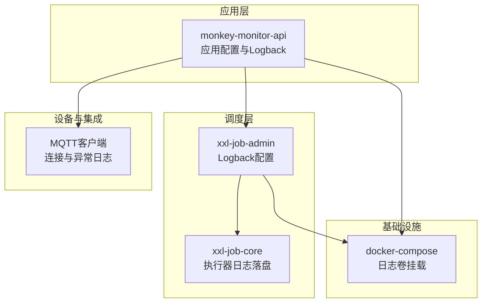
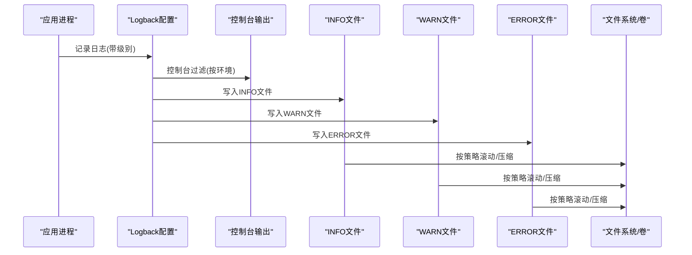
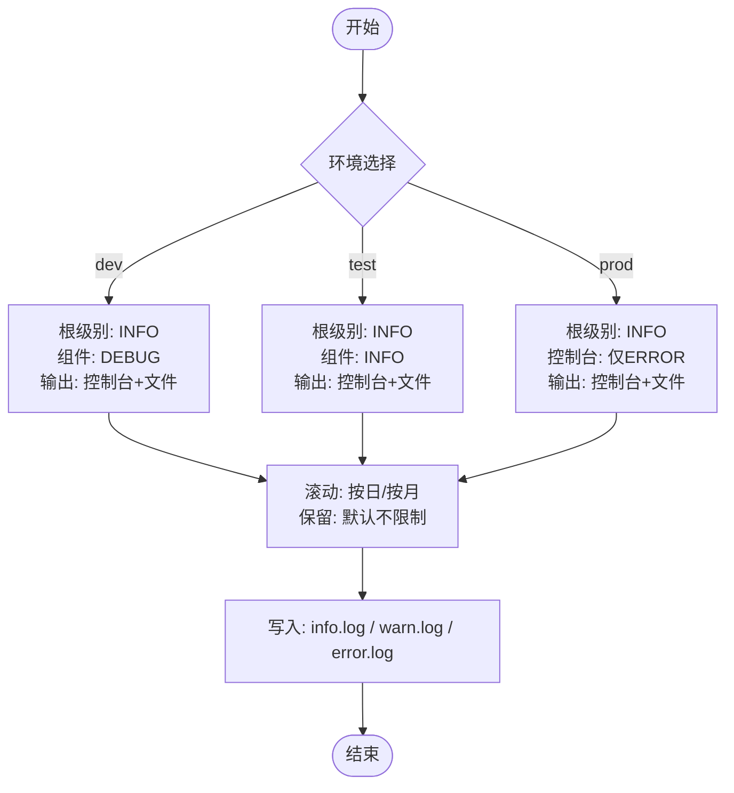
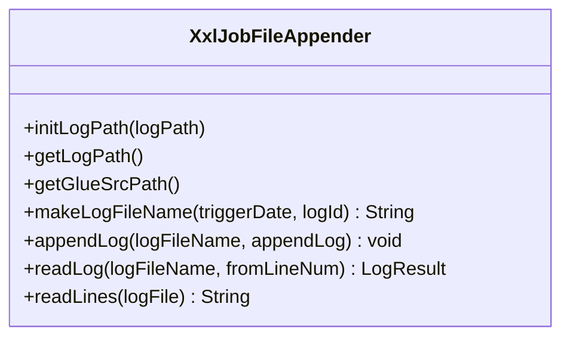
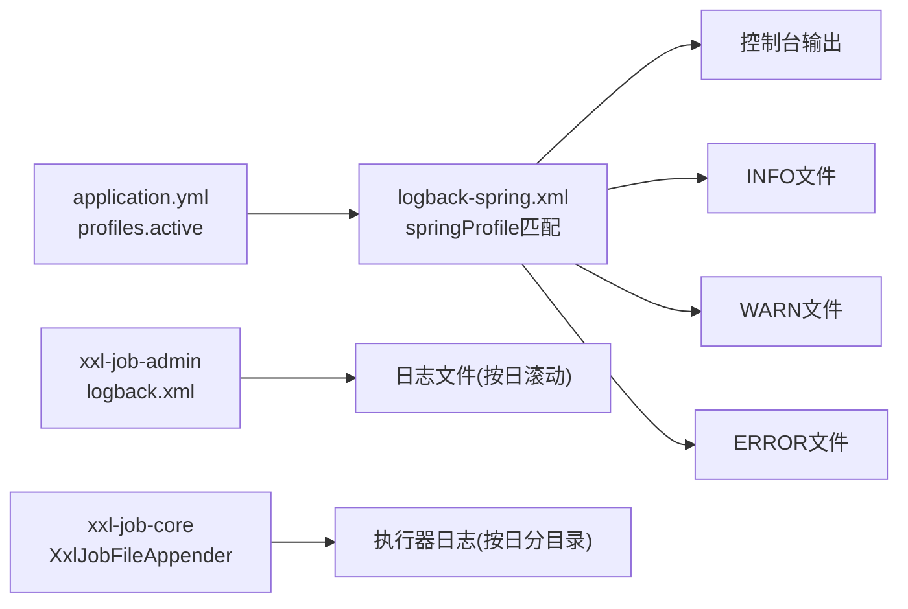

# 日志分析

<cite>
**本文引用的文件**   
- [logback-spring.xml](file://monkey-monitor-api/src/main/resources/logback-spring.xml)
- [application.yml](file://monkey-monitor-api/src/main/resources/application.yml)
- [application-dev.yml](file://monkey-monitor-api/src/main/resources/application-dev.yml)
- [application-test.yml](file://monkey-monitor-api/src/main/resources/application-test.yml)
- [application-prod.yml](file://monkey-monitor-api/src/main/resources/application-prod.yml)
- [logback.xml](file://xxl-job-admin/src/main/resources/logback.xml)
- [XxlJobFileAppender.java](file://xxl-job-core/src/main/java/com/xxl/job/core/log/XxlJobFileAppender.java)
- [MqttConfiguration.java](file://monkey-monitor/src/main/java/com/monkey/general/config/MqttConfiguration.java)
- [TableSyncConfiguration.java](file://monkey-monitor/src/main/java/com/monkey/general/config/TableSyncConfiguration.java)
- [docker-compose.yml](file://deploy/docker-compose.yml)
</cite>

## 目录
1. [简介](#简介)
2. [项目结构](#项目结构)
3. [核心组件](#核心组件)
4. [架构总览](#架构总览)
5. [详细组件分析](#详细组件分析)
6. [依赖分析](#依赖分析)
7. [性能考虑](#性能考虑)
8. [故障排除指南](#故障排除指南)
9. [结论](#结论)
10. [附录](#附录)

## 简介
本指南面向安威 fireworks 物联网监控平台的运维与开发人员，聚焦于日志配置与管理、日志分析方法与技巧、不同环境下的日志策略差异、日志监控与告警建议、以及日志清理与维护最佳实践。文档基于仓库中实际存在的 Logback 配置、应用配置与日志落盘实现，帮助快速定位问题、优化日志策略，并在生产环境中保持可观测性与稳定性。

## 项目结构
本项目包含多个模块，其中与日志直接相关的关键位置如下：
- 应用侧日志配置与环境配置位于 monkey-monitor-api 模块
- 调度系统日志配置位于 xxl-job-admin 模块
- 调度执行器日志落盘实现位于 xxl-job-core 模块
- MQTT 客户端连接与异常日志位于 monkey-monitor 模块
- 日志挂载与持久化通过 docker-compose 统一管理

**图表来源**
- [logback-spring.xml:1-152](file://monkey-monitor-api/src/main/resources/logback-spring.xml#L1-L152)
- [application.yml:1-40](file://monkey-monitor-api/src/main/resources/application.yml#L1-L40)
- [logback.xml:1-82](file://xxl-job-admin/src/main/resources/logback.xml#L1-L82)
- [XxlJobFileAppender.java:1-221](file://xxl-job-core/src/main/java/com/xxl/job/core/log/XxlJobFileAppender.java#L1-L221)
- [MqttConfiguration.java:1-53](file://monkey-monitor/src/main/java/com/monkey/general/config/MqttConfiguration.java#L1-L53)
- [docker-compose.yml:1-103](file://deploy/docker-compose.yml#L1-L103)

**章节来源**
- [logback-spring.xml:1-152](file://monkey-monitor-api/src/main/resources/logback-spring.xml#L1-L152)
- [application.yml:1-40](file://monkey-monitor-api/src/main/resources/application.yml#L1-L40)
- [logback.xml:1-82](file://xxl-job-admin/src/main/resources/logback.xml#L1-L82)
- [XxlJobFileAppender.java:1-221](file://xxl-job-core/src/main/java/com/xxl/job/core/log/XxlJobFileAppender.java#L1-L221)
- [MqttConfiguration.java:1-53](file://monkey-monitor/src/main/java/com/monkey/general/config/MqttConfiguration.java#L1-L53)
- [docker-compose.yml:1-103](file://deploy/docker-compose.yml#L1-L103)

## 核心组件
- 应用日志配置（Logback）：支持按环境切换，控制台与文件输出分离，按级别分文件滚动，包含开发/测试/生产三套策略。
- 应用环境配置：通过 profiles.active 切换 dev/test/prod，加载对应 application-*.yml。
- 调度日志配置：独立的 Logback，统一输出 INFO/WARN/ERROR 文件，便于集中排查。
- 调度执行器日志落盘：自定义文件落盘工具类，按日期分目录，支持读取与追加。
- MQTT 客户端日志：连接成功/失败均通过日志记录，便于快速定位连接问题。
- 日志卷挂载：docker-compose 将日志目录挂载至宿主机，便于采集与持久化。

**章节来源**
- [logback-spring.xml:103-151](file://monkey-monitor-api/src/main/resources/logback-spring.xml#L103-L151)
- [application.yml:4-7](file://monkey-monitor-api/src/main/resources/application.yml#L4-L7)
- [logback.xml:1-82](file://xxl-job-admin/src/main/resources/logback.xml#L1-L82)
- [XxlJobFileAppender.java:33-81](file://xxl-job-core/src/main/java/com/xxl/job/core/log/XxlJobFileAppender.java#L33-L81)
- [MqttConfiguration.java:34-50](file://monkey-monitor/src/main/java/com/monkey/general/config/MqttConfiguration.java#L34-L50)
- [docker-compose.yml:78-80](file://deploy/docker-compose.yml#L78-L80)

## 架构总览
下图展示日志从应用到落盘的整体流程，包括环境选择、日志级别过滤、滚动策略与卷挂载。

**图表来源**
- [logback-spring.xml:13-99](file://monkey-monitor-api/src/main/resources/logback-spring.xml#L13-L99)
- [logback.xml:7-79](file://xxl-job-admin/src/main/resources/logback.xml#L7-L79)
- [XxlJobFileAppender.java:89-130](file://xxl-job-core/src/main/java/com/xxl/job/core/log/XxlJobFileAppender.java#L89-L130)

## 详细组件分析

### 应用日志配置（Logback）
- 输出格式
  - 控制台模式：包含时间戳、级别、PID、线程、Logger 名称、行号与消息。
  - 文件模式：包含时间戳、级别、PID、线程、Logger 名称、行号与消息。
- 环境与级别
  - dev：根级别 INFO，开启组件 DEBUG（如 com.monkey.general），同时输出到控制台与各级别文件。
  - test：根级别 INFO，开启组件 INFO（如 com.monkey.general）。
  - prod：根级别 INFO，控制台仅输出 ERROR，文件按级别分文件。
- 滚动策略
  - INFO/WARN 文件：按日滚动，文件名包含日期后缀。
  - ERROR 文件：按月滚动，文件名包含日期后缀。
  - 保留策略：当前配置未设置 maxHistory，表示不限制保留天数。
- 路径与命名
  - 应用侧：PROD_FILE_PATH 指向 D:/logs/info-system/monkey-monitor-fireworks-local，按月/日辅助目录组织。
  - 调度侧：log.path 指向 D:/logs/data/xxl-job-admin，按日滚动并压缩为 zip。

**图表来源**
- [logback-spring.xml:6-151](file://monkey-monitor-api/src/main/resources/logback-spring.xml#L6-L151)

**章节来源**
- [logback-spring.xml:6-151](file://monkey-monitor-api/src/main/resources/logback-spring.xml#L6-L151)

### 应用环境配置（profiles）
- 环境激活：通过 spring.profiles.active 指定 dev/test/prod。
- 环境差异：
  - dev：本地开发数据库、Redis、MQTT 参数与 swagger 开关等。
  - test：测试数据库、Redis、文件上传与访问地址等。
  - prod：本地回环地址、MQTT 参数、执行器日志路径与保留天数等。
- 与日志的关系：环境切换直接影响 Logback 的 springProfile 匹配，从而决定控制台输出级别与文件落盘策略。

**章节来源**
- [application.yml:4-7](file://monkey-monitor-api/src/main/resources/application.yml#L4-L7)
- [application-dev.yml:1-206](file://monkey-monitor-api/src/main/resources/application-dev.yml#L1-L206)
- [application-test.yml:1-76](file://monkey-monitor-api/src/main/resources/application-test.yml#L1-L76)
- [application-prod.yml:1-198](file://monkey-monitor-api/src/main/resources/application-prod.yml#L1-L198)

### 调度日志配置（xxl-job-admin）
- 控制台输出：生产环境下仅输出 ERROR 级别，降低控制台噪声。
- 文件输出：INFO/WARN/ERROR 分文件，按日滚动并压缩为 zip。
- 落盘路径：log.path 指向 D:/logs/data/xxl-job-admin，便于统一采集。

**章节来源**
- [logback.xml:1-82](file://xxl-job-admin/src/main/resources/logback.xml#L1-L82)

### 调度执行器日志落盘（xxl-job-core）
- 初始化路径：支持通过配置覆盖默认日志目录，不存在则自动创建。
- 文件命名：按触发日期创建子目录，日志文件名为任务 ID + .log。
- 写入与读取：提供 appendLog 与 readLog 方法，统一 UTF-8 编码，异常时记录日志。

**图表来源**
- [XxlJobFileAppender.java:1-221](file://xxl-job-core/src/main/java/com/xxl/job/core/log/XxlJobFileAppender.java#L1-L221)

**章节来源**
- [XxlJobFileAppender.java:33-187](file://xxl-job-core/src/main/java/com/xxl/job/core/log/XxlJobFileAppender.java#L33-L187)

### MQTT 客户端日志
- 连接成功：记录连接成功与客户端 ID，便于确认连接状态。
- 连接失败：异常会被捕获并记录，便于排查认证、网络与参数问题。

**章节来源**
- [MqttConfiguration.java:34-50](file://monkey-monitor/src/main/java/com/monkey/general/config/MqttConfiguration.java#L34-L50)

### 日志卷挂载（docker-compose）
- monkey-monitor-api：将 /app/logs 挂载至宿主机目录，便于采集与备份。
- xxl-job-admin：将 /data/xxl-job/jobhandler 挂载至宿主机目录，便于执行器日志持久化。

**章节来源**
- [docker-compose.yml:78-80](file://deploy/docker-compose.yml#L78-L80)

## 依赖分析
- 环境与日志耦合：application.yml 的 profiles.active 决定 logback-spring.xml 中的 springProfile 匹配，进而影响控制台输出级别与文件落盘策略。
- 组件与日志耦合：部分组件（如 com.monkey.general）在 dev/test 环境开启更细粒度日志，有助于问题定位。
- 调度与日志耦合：xxl-job-admin 与 xxl-job-core 分别负责调度日志与执行器日志，二者通过独立的 Logback 配置与落盘实现解耦。

**图表来源**
- [application.yml:4-7](file://monkey-monitor-api/src/main/resources/application.yml#L4-L7)
- [logback-spring.xml:103-151](file://monkey-monitor-api/src/main/resources/logback-spring.xml#L103-L151)
- [logback.xml:1-82](file://xxl-job-admin/src/main/resources/logback.xml#L1-L82)
- [XxlJobFileAppender.java:66-81](file://xxl-job-core/src/main/java/com/xxl/job/core/log/XxlJobFileAppender.java#L66-L81)

**章节来源**
- [application.yml:4-7](file://monkey-monitor-api/src/main/resources/application.yml#L4-L7)
- [logback-spring.xml:103-151](file://monkey-monitor-api/src/main/resources/logback-spring.xml#L103-L151)
- [logback.xml:1-82](file://xxl-job-admin/src/main/resources/logback.xml#L1-L82)
- [XxlJobFileAppender.java:66-81](file://xxl-job-core/src/main/java/com/xxl/job/core/log/XxlJobFileAppender.java#L66-L81)

## 性能考虑
- 控制台输出：生产环境仅输出 ERROR，减少控制台压力与 I/O。
- 文件滚动：按日/按月滚动，避免单文件过大；必要时可引入压缩策略（如 xxl-job-admin 已采用 zip）。
- 日志量控制：通过组件级日志级别（如 dev/test 中对 com.monkey.general 的 DEBUG/INFO）平衡可观测性与性能。
- IO 影响：大量日志写入可能影响磁盘吞吐，建议结合业务峰值进行容量规划与落盘路径优化。

[本节为通用指导，无需列出章节来源]

## 故障排除指南

### 1. 如何查看关键日志信息
- 应用侧：优先查看 ERROR 文件，其次按需查看 WARN/INFO 文件。
- 调度侧：关注 ERROR 文件，必要时查看 INFO/WARN 文件定位上下文。
- 执行器侧：通过 XxlJobFileAppender 生成的日志文件定位具体任务执行过程。

**章节来源**
- [logback-spring.xml:77-99](file://monkey-monitor-api/src/main/resources/logback-spring.xml#L77-L99)
- [logback.xml:57-72](file://xxl-job-admin/src/main/resources/logback.xml#L57-L72)
- [XxlJobFileAppender.java:66-81](file://xxl-job-core/src/main/java/com/xxl/job/core/log/XxlJobFileAppender.java#L66-L81)

### 2. 日志格式解读
- 时间戳：用于定位事件发生顺序与耗时分析。
- 级别：ERROR/WARN/INFO/DEBUG，用于快速识别问题严重程度。
- PID/线程：用于多实例或多线程场景下的问题定位。
- Logger 名称与行号：用于快速定位源码位置。
- 消息体：包含业务上下文与异常摘要。

**章节来源**
- [logback-spring.xml:6-8](file://monkey-monitor-api/src/main/resources/logback-spring.xml#L6-L8)
- [logback.xml:17-18](file://xxl-job-admin/src/main/resources/logback.xml#L17-L18)

### 3. 错误堆栈分析
- 定位异常：优先查看 ERROR 文件中的异常堆栈。
- 上下文补充：结合 INFO/WARN 文件中的调用链与参数，还原问题场景。
- 执行器异常：通过 XxlJobFileAppender.readLog 定位任务日志，核对输入参数与中间结果。

**章节来源**
- [XxlJobFileAppender.java:138-187](file://xxl-job-core/src/main/java/com/xxl/job/core/log/XxlJobFileAppender.java#L138-L187)

### 4. 性能日志分析
- 高频日志：在 dev/test 环境开启组件 DEBUG/INFO，观察热点路径与调用频率。
- 控制台噪声：生产环境仅输出 ERROR，若出现性能抖动，临时提升级别进行短期诊断。
- 滚动策略：检查滚动文件大小与保留策略，避免过多小文件影响 IO。

**章节来源**
- [logback-spring.xml:107-107](file://monkey-monitor-api/src/main/resources/logback-spring.xml#L107-L107)
- [logback.xml:30-32](file://xxl-job-admin/src/main/resources/logback.xml#L30-L32)

### 5. 不同环境下的日志配置差异
- 开发环境（dev）
  - 根级别：INFO
  - 组件级别：DEBUG（如 com.monkey.general）
  - 输出：控制台 + 文件
- 测试环境（test）
  - 根级别：INFO
  - 组件级别：INFO（如 com.monkey.general）
  - 输出：控制台 + 文件
- 生产环境（prod）
  - 根级别：INFO
  - 控制台：仅 ERROR
  - 输出：控制台 + 文件

**章节来源**
- [logback-spring.xml:103-149](file://monkey-monitor-api/src/main/resources/logback-spring.xml#L103-L149)
- [application.yml:4-7](file://monkey-monitor-api/src/main/resources/application.yml#L4-L7)

### 6. 日志监控与告警建议
- 日志聚合：将应用与调度日志统一输出到固定目录（参考 docker-compose 卷挂载），配合日志采集器（如 Filebeat/Fluent Bit）集中收集。
- 实时监控：通过日志采集器将日志转发至 ELK/ Loki 等平台，建立仪表盘与告警规则。
- 异常检测：基于 ERROR/WARN 关键词与阈值（如错误率、延迟）触发告警。
- 告警通知：对接企业微信/钉钉/邮件等通道，确保问题及时响应。

[本节为通用指导，无需列出章节来源]

### 7. 日志清理与维护最佳实践
- 滚动策略：按日/按月滚动，结合业务峰值与磁盘容量评估保留天数。
- 压缩归档：对历史日志进行压缩归档，减少磁盘占用。
- 存储管理：定期清理过期日志，监控磁盘使用率，设置阈值告警。
- 性能影响评估：在高并发场景下评估日志写入对磁盘吞吐的影响，必要时调整落盘路径或采样策略。

[本节为通用指导，无需列出章节来源]

## 结论
通过对应用与调度日志配置的梳理，结合 docker-compose 的卷挂载策略，本指南提供了从配置到落盘、从分析到维护的完整路径。建议在生产环境坚持“低冗余、强定位”的原则，配合日志聚合与告警体系，持续提升系统的可观测性与稳定性。

## 附录

### A. 关键日志路径与环境对照
- 应用日志（应用侧）：D:/logs/info-system/monkey-monitor-fireworks-local（按月/日辅助目录）
- 调度日志（xxl-job-admin）：D:/logs/data/xxl-job-admin（按日滚动并压缩）
- 执行器日志（xxl-job-core）：/data/xxl-job/jobhandler（按日分目录）

**章节来源**
- [logback-spring.xml:11-11](file://monkey-monitor-api/src/main/resources/logback-spring.xml#L11-L11)
- [logback.xml:5-5](file://xxl-job-admin/src/main/resources/logback.xml#L5-L5)
- [XxlJobFileAppender.java:31-51](file://xxl-job-core/src/main/java/com/xxl/job/core/log/XxlJobFileAppender.java#L31-L51)