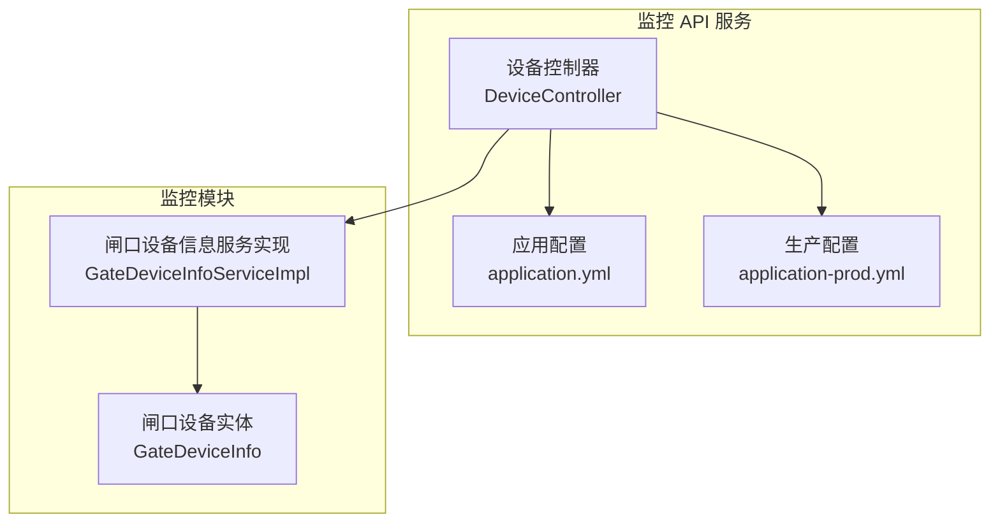
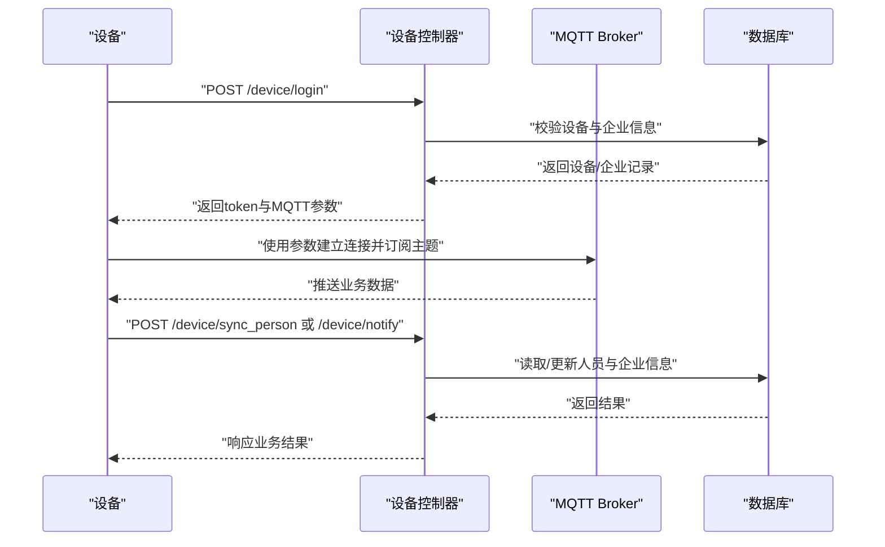
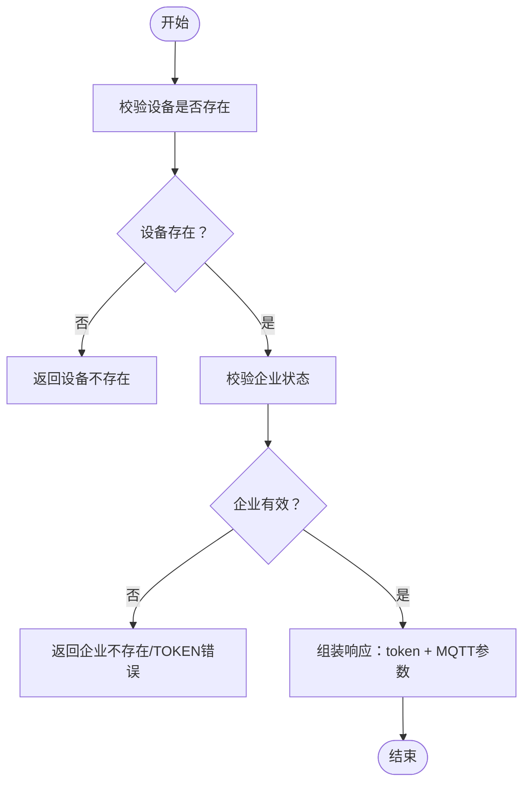
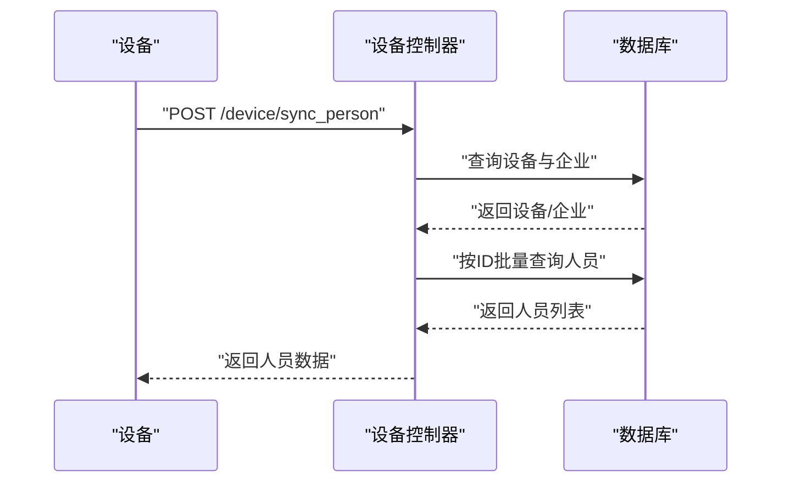
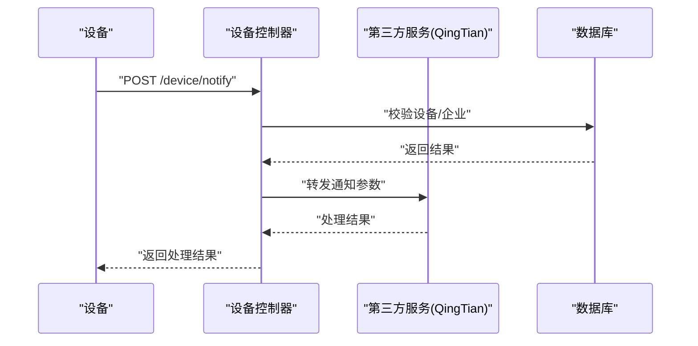
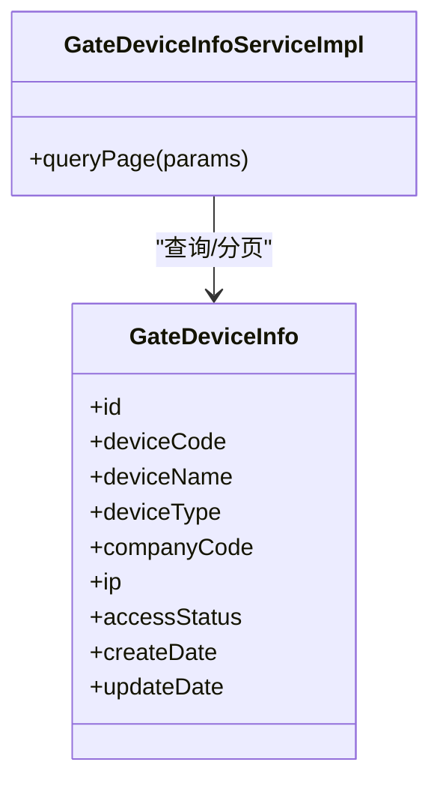
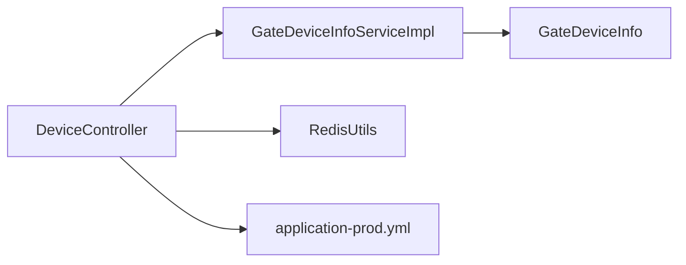

# 设备问题

<cite>
**本文引用的文件**
- [DeviceController.java](file://monkey-monitor-api/src/main/java/com/monkey/general/controller/DeviceController.java)
- [application.yml](file://monkey-monitor-api/src/main/resources/application.yml)
- [application-prod.yml](file://deploy/config/monitor-api/application-prod.yml)
- [GateDeviceInfo.java](file://monkey-monitor/src/main/java/com/monkey/general/modules/em/entity/GateDeviceInfo.java)
- [GateDeviceInfoServiceImpl.java](file://monkey-monitor/src/main/java/com/monkey/general/modules/em/service/impl/GateDeviceInfoServiceImpl.java)
</cite>

## 目录
1. [简介](#简介)
2. [项目结构](#项目结构)
3. [核心组件](#核心组件)
4. [架构总览](#架构总览)
5. [详细组件分析](#详细组件分析)
6. [依赖分析](#依赖分析)
7. [性能考虑](#性能考虑)
8. [故障排除指南](#故障排除指南)
9. [结论](#结论)
10. [附录](#附录)

## 简介
本指南面向安威 fireworks 物联网监控平台的运维与技术支持人员，聚焦于设备连接与通信问题的排查，覆盖大华、海康等主流厂商设备在平台侧的接入、数据传输、命令执行、离线、视频流、配置与兼容性等方面的问题定位与处理建议。文档基于现有代码与配置文件进行分析，提供可操作的排障步骤与最佳实践。

## 项目结构
平台由“监控 API 服务”与“监控模块”组成，设备侧通过 MQTT 与平台交互，设备信息存储于数据库，部分设备能力（如大华 SDK 抓图）在配置中启用。

**图表来源**
- [DeviceController.java:1-266](file://monkey-monitor-api/src/main/java/com/monkey/general/controller/DeviceController.java#L1-L266)
- [application.yml:1-40](file://monkey-monitor-api/src/main/resources/application.yml#L1-L40)
- [application-prod.yml:1-203](file://deploy/config/monitor-api/application-prod.yml#L1-L203)
- [GateDeviceInfoServiceImpl.java:1-40](file://monkey-monitor/src/main/java/com/monkey/general/modules/em/service/impl/GateDeviceInfoServiceImpl.java#L1-L40)
- [GateDeviceInfo.java:1-219](file://monkey-monitor/src/main/java/com/monkey/general/modules/em/entity/GateDeviceInfo.java#L1-L219)

**章节来源**
- [DeviceController.java:1-266](file://monkey-monitor-api/src/main/java/com/monkey/general/controller/DeviceController.java#L1-L266)
- [application.yml:1-40](file://monkey-monitor-api/src/main/resources/application.yml#L1-L40)
- [application-prod.yml:1-203](file://deploy/config/monitor-api/application-prod.yml#L1-L203)
- [GateDeviceInfoServiceImpl.java:1-40](file://monkey-monitor/src/main/java/com/monkey/general/modules/em/service/impl/GateDeviceInfoServiceImpl.java#L1-L40)
- [GateDeviceInfo.java:1-219](file://monkey-monitor/src/main/java/com/monkey/general/modules/em/entity/GateDeviceInfo.java#L1-L219)

## 核心组件
- 设备控制器：负责设备登录、人员信息同步、通知回调等接口，返回 MQTT 连接参数与业务令牌。
- 闸口设备信息服务：提供设备分页查询与筛选，支撑设备接入状态与基础信息管理。
- 配置中心：包含 MQTT、Redis、数据库、第三方对接等关键参数，直接影响设备连通性与数据流转。

**章节来源**
- [DeviceController.java:59-104](file://monkey-monitor-api/src/main/java/com/monkey/general/controller/DeviceController.java#L59-L104)
- [GateDeviceInfoServiceImpl.java:25-37](file://monkey-monitor/src/main/java/com/monkey/general/modules/em/service/impl/GateDeviceInfoServiceImpl.java#L25-L37)
- [application-prod.yml:30-61](file://deploy/config/monitor-api/application-prod.yml#L30-L61)

## 架构总览
设备通过 MQTT 与平台交互，控制器在登录阶段下发 MQTT 参数（主机、端口、用户名、密码、主题、QoS、保活），设备侧据此建立连接并订阅/发布消息。人员信息同步与通知回调接口用于业务数据闭环。

**图表来源**
- [DeviceController.java:59-104](file://monkey-monitor-api/src/main/java/com/monkey/general/controller/DeviceController.java#L59-L104)
- [DeviceController.java:107-161](file://monkey-monitor-api/src/main/java/com/monkey/general/controller/DeviceController.java#L107-L161)
- [DeviceController.java:169-196](file://monkey-monitor-api/src/main/java/com/monkey/general/controller/DeviceController.java#L169-L196)

## 详细组件分析

### 设备登录流程（登录异常）
- 登录接口根据设备编号查询设备信息与企业状态，校验通过后返回业务 token 与 MQTT 参数（含主题 topic）。若设备或企业不存在，返回错误信息。
- 建议：检查设备编号、企业状态、数据库连通性与配置中的 MQTT 参数。

**图表来源**
- [DeviceController.java:59-104](file://monkey-monitor-api/src/main/java/com/monkey/general/controller/DeviceController.java#L59-L104)

**章节来源**
- [DeviceController.java:59-104](file://monkey-monitor-api/src/main/java/com/monkey/general/controller/DeviceController.java#L59-L104)

### 人员信息同步（数据传输失败/超时）
- 同步接口校验设备与企业有效性，随后从人员表筛选目标人员并返回列表。若人员不存在或企业无效，返回错误。
- 建议：确认人员 ID 列表、企业 token、数据库连通性；关注网络抖动与超时重试策略。

**图表来源**
- [DeviceController.java:107-161](file://monkey-monitor-api/src/main/java/com/monkey/general/controller/DeviceController.java#L107-L161)

**章节来源**
- [DeviceController.java:107-161](file://monkey-monitor-api/src/main/java/com/monkey/general/controller/DeviceController.java#L107-L161)

### 通知回调（命令执行超时/失败）
- 回调接口校验设备与企业有效性后，交由第三方服务处理。若设备或企业无效，直接返回错误。
- 建议：检查回调链路、第三方服务可用性与超时配置。

**图表来源**
- [DeviceController.java:169-196](file://monkey-monitor-api/src/main/java/com/monkey/general/controller/DeviceController.java#L169-L196)

**章节来源**
- [DeviceController.java:169-196](file://monkey-monitor-api/src/main/java/com/monkey/general/controller/DeviceController.java#L169-L196)

### 设备信息模型与查询（离线/接入状态）
- 闸口设备实体包含设备编号、企业编码、IP、接入状态等字段；服务实现支持按公司编码与设备类型分页查询，并按创建时间倒序。
- 建议：结合设备实体字段排查 IP 变更、接入状态异常与设备类型误配。

**图表来源**
- [GateDeviceInfo.java:14-219](file://monkey-monitor/src/main/java/com/monkey/general/modules/em/entity/GateDeviceInfo.java#L14-L219)
- [GateDeviceInfoServiceImpl.java:25-37](file://monkey-monitor/src/main/java/com/monkey/general/modules/em/service/impl/GateDeviceInfoServiceImpl.java#L25-L37)

**章节来源**
- [GateDeviceInfo.java:14-219](file://monkey-monitor/src/main/java/com/monkey/general/modules/em/entity/GateDeviceInfo.java#L14-L219)
- [GateDeviceInfoServiceImpl.java:25-37](file://monkey-monitor/src/main/java/com/monkey/general/modules/em/service/impl/GateDeviceInfoServiceImpl.java#L25-L37)

## 依赖分析
- 设备控制器依赖企业与人员服务、闸口设备服务以及 Redis 工具类，用于登录、同步与通知处理。
- 生产配置集中管理 MQTT、数据库、Redis、第三方对接等参数，直接影响设备连通性与数据处理。

**图表来源**
- [DeviceController.java:48-57](file://monkey-monitor-api/src/main/java/com/monkey/general/controller/DeviceController.java#L48-L57)
- [GateDeviceInfoServiceImpl.java:1-40](file://monkey-monitor/src/main/java/com/monkey/general/modules/em/service/impl/GateDeviceInfoServiceImpl.java#L1-L40)
- [application-prod.yml:30-61](file://deploy/config/monitor-api/application-prod.yml#L30-L61)

**章节来源**
- [DeviceController.java:48-57](file://monkey-monitor-api/src/main/java/com/monkey/general/controller/DeviceController.java#L48-L57)
- [GateDeviceInfoServiceImpl.java:1-40](file://monkey-monitor/src/main/java/com/monkey/general/modules/em/service/impl/GateDeviceInfoServiceImpl.java#L1-L40)
- [application-prod.yml:30-61](file://deploy/config/monitor-api/application-prod.yml#L30-L61)

## 性能考虑
- MQTT 连接参数（保活、超时、QoS）应结合网络质量与设备资源合理设置，避免频繁断连。
- 人员同步接口涉及批量查询，建议在数据库层面优化索引与分页大小，减少单次查询压力。
- Redis 缓存开关与连接池参数影响设备状态与临时数据的读写性能。

[本节为通用建议，无需特定文件来源]

## 故障排除指南

### 一、设备连接与通信问题
- 登录失败
  - 现象：设备登录接口返回“设备不存在/企业不存在/TOKEN 错误”。
  - 排查要点：
    - 检查设备编号是否正确、企业状态是否有效。
    - 核对数据库中设备与企业记录。
    - 确认配置文件中的 MQTT 参数（主机、端口、用户名、密码、保活）与设备侧一致。
  - 参考路径：
    - [DeviceController.java:59-104](file://monkey-monitor-api/src/main/java/com/monkey/general/controller/DeviceController.java#L59-L104)
    - [application-prod.yml:30-48](file://deploy/config/monitor-api/application-prod.yml#L30-L48)

- MQTT 断连/无法订阅
  - 现象：设备上线但无法订阅主题或收不到推送。
  - 排查要点：
    - 确认设备使用的主题与平台下发一致。
    - 检查网络连通性与防火墙策略。
    - 调整 MQTT 保活与超时参数，避免弱网环境下频繁断开。
  - 参考路径：
    - [DeviceController.java:92-101](file://monkey-monitor-api/src/main/java/com/monkey/general/controller/DeviceController.java#L92-L101)
    - [application-prod.yml:30-48](file://deploy/config/monitor-api/application-prod.yml#L30-L48)

- 命令执行超时/失败
  - 现象：设备侧发送指令后无响应或超时。
  - 排查要点：
    - 检查平台侧回调接口与第三方服务链路。
    - 提升超时阈值并增加重试机制。
  - 参考路径：
    - [DeviceController.java:169-196](file://monkey-monitor-api/src/main/java/com/monkey/general/controller/DeviceController.java#L169-L196)

### 二、设备离线问题诊断
- 现象：设备长时间无在线状态或数据。
- 排查要点：
  - 检查设备 IP 是否变更、网络是否可达。
  - 核对设备接入状态与设备类型配置。
  - 确认数据库中设备记录与企业状态正常。
- 参考路径：
  - [GateDeviceInfo.java:132-166](file://monkey-monitor/src/main/java/com/monkey/general/modules/em/entity/GateDeviceInfo.java#L132-L166)
  - [GateDeviceInfoServiceImpl.java:25-37](file://monkey-monitor/src/main/java/com/monkey/general/modules/em/service/impl/GateDeviceInfoServiceImpl.java#L25-L37)

### 三、视频流问题（概念性指导）
- 视频卡顿/画面模糊/音频不同步/录制异常
  - 建议：
    - 检查网络带宽与丢包率。
    - 核对设备分辨率与帧率设置。
    - 确认平台侧转码/拉流策略与设备能力匹配。
    - 对于大华/海康设备，确认其 SDK/协议版本与平台适配情况。
  - 说明：当前仓库未包含视频流处理的具体实现文件，上述为通用排障建议。

[本节为通用建议，无需特定文件来源]

### 四、设备配置问题
- IP 冲突
  - 现象：设备或平台无法访问。
  - 排查要点：更换设备 IP 并确保与网段一致。
- 端口占用
  - 现象：MQTT/服务无法启动。
  - 排查要点：检查端口占用并修改配置。
- 权限设置
  - 现象：认证失败或无法订阅。
  - 排查要点：核对用户名/密码与 ACL 设置。
- 时间同步
  - 现象：鉴权签名或日志时间异常。
  - 排查要点：统一 NTP 与时区配置。

**章节来源**
- [application-prod.yml:30-48](file://deploy/config/monitor-api/application-prod.yml#L30-L48)

### 五、兼容性与升级策略
- 兼容性
  - 建议：针对不同厂商设备制定统一的接入规范与能力映射，逐步收敛协议差异。
- 升级策略
  - 建议：采用灰度发布与回滚预案，先在小范围验证再全量升级；升级前后对比设备连通性与数据完整性。

[本节为通用建议，无需特定文件来源]

## 结论
本指南围绕设备登录、人员同步、通知回调与设备信息管理等关键路径，提供了连接异常、离线、配置与兼容性等方面的排障思路。建议以配置文件与数据库记录为依据，结合网络与设备侧日志进行交叉验证，确保问题定位准确高效。

## 附录
- 关键配置项参考
  - MQTT 参数：主机、端口、用户名、密码、保活、主题
  - 数据库与 Redis：连接串、超时、连接池
  - 第三方对接：企业标识、API 地址、密钥
- 参考路径：
  - [application.yml:1-40](file://monkey-monitor-api/src/main/resources/application.yml#L1-L40)
  - [application-prod.yml:30-203](file://deploy/config/monitor-api/application-prod.yml#L30-L203)