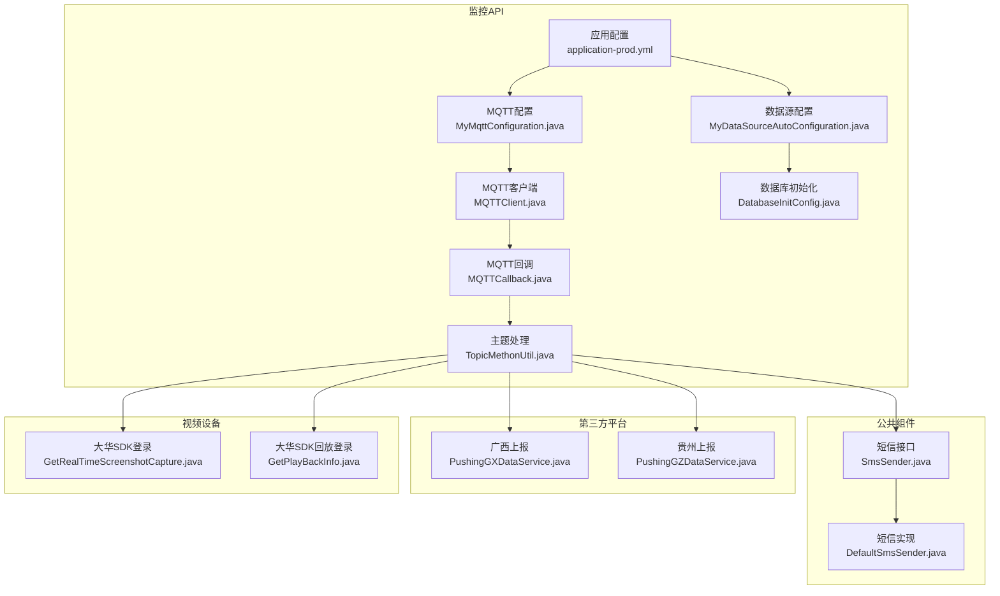
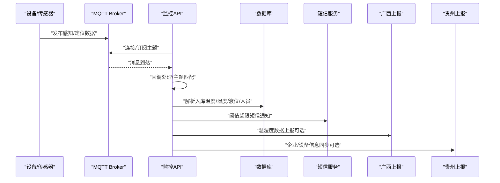
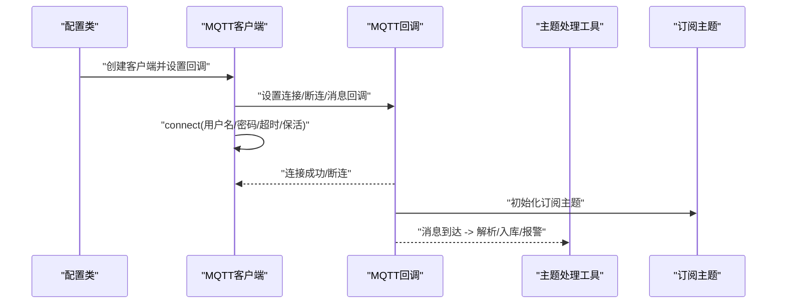
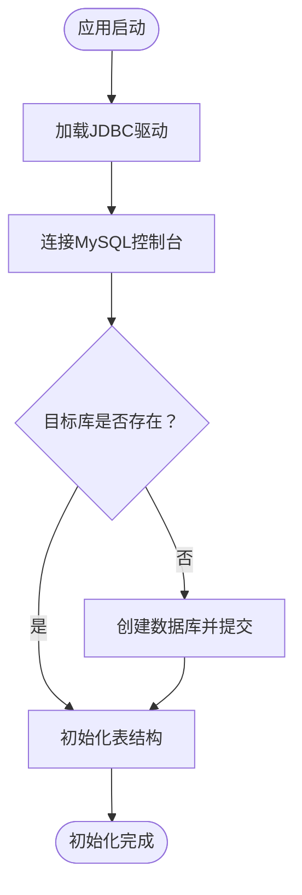
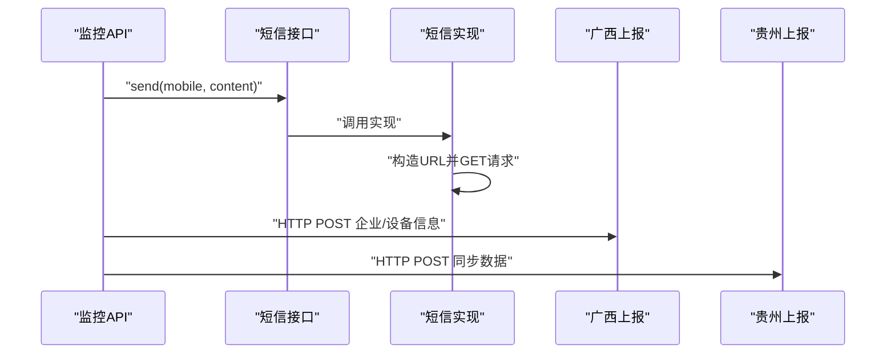
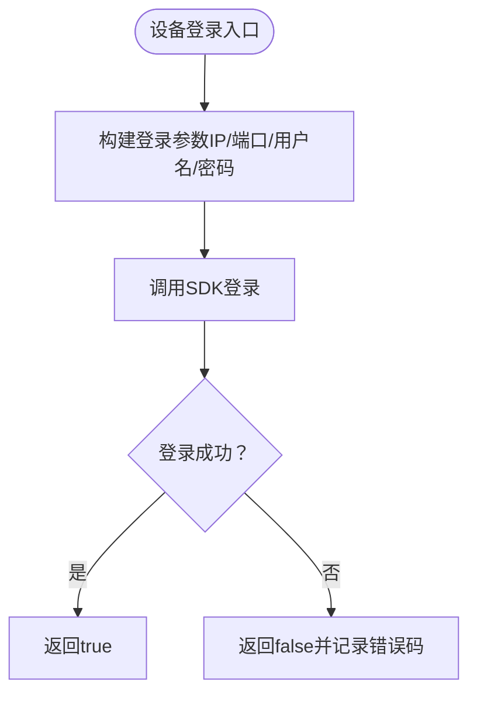
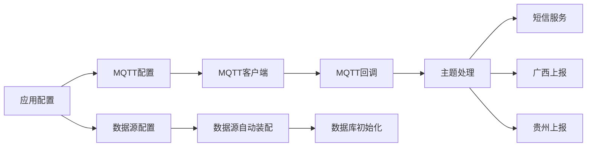

# 连接问题

<cite>
**本文引用的文件**
- [application-prod.yml](file://monkey-monitor-api/src/main/resources/application-prod.yml)
- [application-prod.yml](file://deploy/config/monitor-api/application-prod.yml)
- [MyMqttConfiguration.java](file://monkey-monitor/src/main/java/com/monkey/general/config/mqtt/MyMqttConfiguration.java)
- [MQTTClient.java](file://monkey-monitor/src/main/java/com/monkey/general/config/mqtt/MQTTClient.java)
- [MQTTCallback.java](file://monkey-monitor/src/main/java/com/monkey/general/config/mqtt/MQTTCallback.java)
- [TopicMethonUtil.java](file://monkey-monitor/src/main/java/com/monkey/general/config/mqtt/TopicMethonUtil.java)
- [MyDataSourceAutoConfiguration.java](file://monkey-monitor/src/main/java/com/monkey/general/config/MyDataSourceAutoConfiguration.java)
- [DatabaseInitConfig.java](file://monkey-monitor/src/main/java/com/monkey/general/config/DatabaseInitConfig.java)
- [XxlDataBaseConfig.java](file://xxl-job-admin/src/main/java/com/xxl/job/admin/core/conf/XxlDataBaseConfig.java)
- [DefaultSmsSender.java](file://monkey-common/src/main/java/com/monkey/general/common/sms/DefaultSmsSender.java)
- [SmsSender.java](file://monkey-common/src/main/java/com/monkey/general/common/sms/SmsSender.java)
- [PushingGXDataService.java](file://monkey-monitor/src/main/java/com/monkey/general/platform/push/gx/PushingGXDataService.java)
- [PushingGZDataService.java](file://monkey-monitor/src/main/java/com/monkey/general/platform/push/gz/PushingGZDataService.java)
- [GetRealTimeScreenshotCapture.java](file://monkey-monitor/src/main/java/com/monkey/general/dahua/GetRealTimeScreenshotCapture.java)
- [GetPlayBackInfo.java](file://monkey-monitor/src/main/java/com/monkey/general/dahua/GetPlayBackInfo.java)
- [NetworkConfig.java](file://monkey-monitor/src/main/java/com/monkey/general/config/NetworkConfig.java)
</cite>

## 目录
1. [简介](#简介)
2. [项目结构](#项目结构)
3. [核心组件](#核心组件)
4. [架构总览](#架构总览)
5. [详细组件分析](#详细组件分析)
6. [依赖关系分析](#依赖关系分析)
7. [性能考量](#性能考量)
8. [故障排除指南](#故障排除指南)
9. [结论](#结论)
10. [附录](#附录)

## 简介
本指南聚焦于安威 fireworks 物物联网监控平台的连接问题排查，覆盖以下方面：
- MQTT 连接失败：Broker 地址配置错误、认证失败、网络不通、SSL/TLS 配置问题
- 数据库连接问题：连接字符串错误、驱动程序问题、连接池耗尽、超时设置不当
- 设备连接异常：设备离线、网络中断、协议不兼容
- 第三方服务连接问题：云存储服务、短信服务、邮件服务等
- 连接问题的监控与预警

## 项目结构
本项目采用多模块结构，与连接相关的关键模块如下：
- 配置与连接层：MQTT 配置、数据源配置、网络配置
- 业务处理层：MQTT 回调与主题处理、设备接入与数据落库
- 第三方集成：短信、省平台数据上报、视频设备 SDK
- 运维与初始化：数据库初始化、XXL-Job 数据库初始化

**图表来源**
- [application-prod.yml:1-198](file://monkey-monitor-api/src/main/resources/application-prod.yml#L1-L198)
- [MyMqttConfiguration.java:1-43](file://monkey-monitor/src/main/java/com/monkey/general/config/mqtt/MyMqttConfiguration.java#L1-L43)
- [MQTTClient.java:1-83](file://monkey-monitor/src/main/java/com/monkey/general/config/mqtt/MQTTClient.java#L1-L83)
- [MQTTCallback.java:1-127](file://monkey-monitor/src/main/java/com/monkey/general/config/mqtt/MQTTCallback.java#L1-L127)
- [TopicMethonUtil.java:1-382](file://monkey-monitor/src/main/java/com/monkey/general/config/mqtt/TopicMethonUtil.java#L1-L382)
- [MyDataSourceAutoConfiguration.java:1-51](file://monkey-monitor/src/main/java/com/monkey/general/config/MyDataSourceAutoConfiguration.java#L1-L51)
- [DatabaseInitConfig.java:1-86](file://monkey-monitor/src/main/java/com/monkey/general/config/DatabaseInitConfig.java#L1-L86)
- [DefaultSmsSender.java:1-46](file://monkey-common/src/main/java/com/monkey/general/common/sms/DefaultSmsSender.java#L1-L46)
- [SmsSender.java:1-19](file://monkey-common/src/main/java/com/monkey/general/common/sms/SmsSender.java#L1-L19)
- [PushingGXDataService.java:540-567](file://monkey-monitor/src/main/java/com/monkey/general/platform/push/gx/PushingGXDataService.java#L540-L567)
- [PushingGZDataService.java:30-74](file://monkey-monitor/src/main/java/com/monkey/general/platform/push/gz/PushingGZDataService.java#L30-L74)
- [GetRealTimeScreenshotCapture.java:91-126](file://monkey-monitor/src/main/java/com/monkey/general/dahua/GetRealTimeScreenshotCapture.java#L91-L126)
- [GetPlayBackInfo.java:75-110](file://monkey-monitor/src/main/java/com/monkey/general/dahua/GetPlayBackInfo.java#L75-L110)

**章节来源**
- [application-prod.yml:1-198](file://monkey-monitor-api/src/main/resources/application-prod.yml#L1-L198)
- [application-prod.yml:1-203](file://deploy/config/monitor-api/application-prod.yml#L1-L203)

## 核心组件
- MQTT 配置与客户端
  - 配置项来源于应用配置文件，包含 Broker 地址、端口、用户名、密码、clientId、超时与保活等
  - 客户端负责建立连接、设置回调、订阅主题、发布消息
  - 回调处理断连重连、消息到达、投递完成等事件
  - 主题处理根据 Topic 模式匹配，解析并入库，触发短信报警
- 数据源与数据库初始化
  - 使用 Hikari 连接池，支持最小空闲、最大池大小等配置
  - 应用启动时校验驱动与目标库是否存在，必要时创建库并初始化表
- 第三方服务集成
  - 短信服务通过 RestTemplate 调用第三方接口
  - 广西/贵州上报服务通过 HTTP 请求对接省平台
  - 大华设备通过 SDK 登录与抓图，涉及用户名、密码、端口、通道等

**章节来源**
- [MyMqttConfiguration.java:1-43](file://monkey-monitor/src/main/java/com/monkey/general/config/mqtt/MyMqttConfiguration.java#L1-L43)
- [MQTTClient.java:1-83](file://monkey-monitor/src/main/java/com/monkey/general/config/mqtt/MQTTClient.java#L1-L83)
- [MQTTCallback.java:1-127](file://monkey-monitor/src/main/java/com/monkey/general/config/mqtt/MQTTCallback.java#L1-L127)
- [TopicMethonUtil.java:1-382](file://monkey-monitor/src/main/java/com/monkey/general/config/mqtt/TopicMethonUtil.java#L1-L382)
- [MyDataSourceAutoConfiguration.java:1-51](file://monkey-monitor/src/main/java/com/monkey/general/config/MyDataSourceAutoConfiguration.java#L1-L51)
- [DatabaseInitConfig.java:1-86](file://monkey-monitor/src/main/java/com/monkey/general/config/DatabaseInitConfig.java#L1-L86)
- [DefaultSmsSender.java:1-46](file://monkey-common/src/main/java/com/monkey/general/common/sms/DefaultSmsSender.java#L1-L46)
- [PushingGXDataService.java:540-567](file://monkey-monitor/src/main/java/com/monkey/general/platform/push/gx/PushingGXDataService.java#L540-L567)
- [GetRealTimeScreenshotCapture.java:91-126](file://monkey-monitor/src/main/java/com/monkey/general/dahua/GetRealTimeScreenshotCapture.java#L91-L126)

## 架构总览
下图展示连接问题排查涉及的关键路径与交互。

**图表来源**
- [MQTTCallback.java:1-127](file://monkey-monitor/src/main/java/com/monkey/general/config/mqtt/MQTTCallback.java#L1-L127)
- [TopicMethonUtil.java:1-382](file://monkey-monitor/src/main/java/com/monkey/general/config/mqtt/TopicMethonUtil.java#L1-L382)
- [DefaultSmsSender.java:1-46](file://monkey-common/src/main/java/com/monkey/general/common/sms/DefaultSmsSender.java#L1-L46)
- [PushingGXDataService.java:540-567](file://monkey-monitor/src/main/java/com/monkey/general/platform/push/gx/PushingGXDataService.java#L540-L567)
- [PushingGZDataService.java:30-74](file://monkey-monitor/src/main/java/com/monkey/general/platform/push/gz/PushingGZDataService.java#L30-L74)

## 详细组件分析

### MQTT 组件分析
- 配置加载与客户端初始化
  - 从配置文件读取 Broker 地址、端口、认证信息与超时保活参数
  - 构造客户端并设置回调，确保断连自动重连
- 回调与主题处理
  - 断连重连策略：循环重连，避免异常抛出导致断线
  - 消息到达：根据 Topic 模式匹配，分别处理自研人员定位与传感器数据
  - 连接成功：初始化订阅主题，保证重连后重新订阅
- 典型流程（连接与消息处理）

**图表来源**
- [MyMqttConfiguration.java:1-43](file://monkey-monitor/src/main/java/com/monkey/general/config/mqtt/MyMqttConfiguration.java#L1-L43)
- [MQTTClient.java:1-83](file://monkey-monitor/src/main/java/com/monkey/general/config/mqtt/MQTTClient.java#L1-L83)
- [MQTTCallback.java:1-127](file://monkey-monitor/src/main/java/com/monkey/general/config/mqtt/MQTTCallback.java#L1-L127)
- [TopicMethonUtil.java:1-382](file://monkey-monitor/src/main/java/com/monkey/general/config/mqtt/TopicMethonUtil.java#L1-L382)

**章节来源**
- [MyMqttConfiguration.java:1-43](file://monkey-monitor/src/main/java/com/monkey/general/config/mqtt/MyMqttConfiguration.java#L1-L43)
- [MQTTClient.java:1-83](file://monkey-monitor/src/main/java/com/monkey/general/config/mqtt/MQTTClient.java#L1-L83)
- [MQTTCallback.java:1-127](file://monkey-monitor/src/main/java/com/monkey/general/config/mqtt/MQTTCallback.java#L1-L127)
- [TopicMethonUtil.java:1-382](file://monkey-monitor/src/main/java/com/monkey/general/config/mqtt/TopicMethonUtil.java#L1-L382)

### 数据库组件分析
- 数据源配置
  - Hikari 连接池参数：最小空闲、最大池大小、连接超时、空闲超时、生命周期等
  - 动态数据源自动装配，依赖数据库初始化配置
- 数据库初始化
  - 启动时加载 JDBC 驱动，连接至 mysql 控制台，检测目标库是否存在
  - 若不存在则创建库并提交事务，随后初始化表结构
- XXL-Job 数据库初始化
  - 同样通过 JDBC 驱动与控制台连接，执行数据库与表初始化逻辑

**图表来源**
- [MyDataSourceAutoConfiguration.java:1-51](file://monkey-monitor/src/main/java/com/monkey/general/config/MyDataSourceAutoConfiguration.java#L1-L51)
- [DatabaseInitConfig.java:1-86](file://monkey-monitor/src/main/java/com/monkey/general/config/DatabaseInitConfig.java#L1-L86)
- [XxlDataBaseConfig.java:38-69](file://xxl-job-admin/src/main/java/com/xxl/job/admin/core/conf/XxlDataBaseConfig.java#L38-L69)

**章节来源**
- [MyDataSourceAutoConfiguration.java:1-51](file://monkey-monitor/src/main/java/com/monkey/general/config/MyDataSourceAutoConfiguration.java#L1-L51)
- [DatabaseInitConfig.java:1-86](file://monkey-monitor/src/main/java/com/monkey/general/config/DatabaseInitConfig.java#L1-L86)
- [XxlDataBaseConfig.java:38-69](file://xxl-job-admin/src/main/java/com/xxl/job/admin/core/conf/XxlDataBaseConfig.java#L38-L69)

### 第三方服务组件分析
- 短信服务
  - 通过 RestTemplate 调用第三方短信接口，构造 GET 请求并解析返回
  - 实现 SmsSender 接口，便于替换与扩展
- 广西/贵州上报
  - 通过 HTTP 请求将企业/设备信息与数据上报至省平台
  - 上报地址与账号由配置文件提供，支持开关控制

**图表来源**
- [SmsSender.java:1-19](file://monkey-common/src/main/java/com/monkey/general/common/sms/SmsSender.java#L1-L19)
- [DefaultSmsSender.java:1-46](file://monkey-common/src/main/java/com/monkey/general/common/sms/DefaultSmsSender.java#L1-L46)
- [PushingGXDataService.java:540-567](file://monkey-monitor/src/main/java/com/monkey/general/platform/push/gx/PushingGXDataService.java#L540-L567)
- [PushingGZDataService.java:30-74](file://monkey-monitor/src/main/java/com/monkey/general/platform/push/gz/PushingGZDataService.java#L30-L74)

**章节来源**
- [SmsSender.java:1-19](file://monkey-common/src/main/java/com/monkey/general/common/sms/SmsSender.java#L1-L19)
- [DefaultSmsSender.java:1-46](file://monkey-common/src/main/java/com/monkey/general/common/sms/DefaultSmsSender.java#L1-L46)
- [PushingGXDataService.java:540-567](file://monkey-monitor/src/main/java/com/monkey/general/platform/push/gx/PushingGXDataService.java#L540-L567)
- [PushingGZDataService.java:30-74](file://monkey-monitor/src/main/java/com/monkey/general/platform/push/gz/PushingGZDataService.java#L30-L74)

### 设备连接组件分析
- 大华 SDK 登录
  - 提供登录与登出方法，使用用户名、密码、端口等参数
  - 登录失败时返回 false，并记录错误码
- 网络状态标志
  - 提供全局断网标志位，用于业务侧在网络异常时的降级处理

**图表来源**
- [GetRealTimeScreenshotCapture.java:91-126](file://monkey-monitor/src/main/java/com/monkey/general/dahua/GetRealTimeScreenshotCapture.java#L91-L126)
- [GetPlayBackInfo.java:75-110](file://monkey-monitor/src/main/java/com/monkey/general/dahua/GetPlayBackInfo.java#L75-L110)
- [NetworkConfig.java:1-10](file://monkey-monitor/src/main/java/com/monkey/general/config/NetworkConfig.java#L1-L10)

**章节来源**
- [GetRealTimeScreenshotCapture.java:91-126](file://monkey-monitor/src/main/java/com/monkey/general/dahua/GetRealTimeScreenshotCapture.java#L91-L126)
- [GetPlayBackInfo.java:75-110](file://monkey-monitor/src/main/java/com/monkey/general/dahua/GetPlayBackInfo.java#L75-L110)
- [NetworkConfig.java:1-10](file://monkey-monitor/src/main/java/com/monkey/general/config/NetworkConfig.java#L1-L10)

## 依赖关系分析
- 配置与连接
  - 应用配置文件提供 MQTT、数据库、Redis、第三方服务等连接参数
  - MQTT 配置类与客户端类形成闭环，回调与主题处理解耦
- 数据库与初始化
  - 数据源自动装配依赖数据库初始化配置
  - 启动阶段完成驱动加载与库/表初始化
- 第三方集成
  - 短信服务与上报服务通过 HTTP/RestTemplate 调用，参数来自配置文件

**图表来源**
- [application-prod.yml:1-198](file://monkey-monitor-api/src/main/resources/application-prod.yml#L1-L198)
- [MyMqttConfiguration.java:1-43](file://monkey-monitor/src/main/java/com/monkey/general/config/mqtt/MyMqttConfiguration.java#L1-L43)
- [MQTTClient.java:1-83](file://monkey-monitor/src/main/java/com/monkey/general/config/mqtt/MQTTClient.java#L1-L83)
- [MQTTCallback.java:1-127](file://monkey-monitor/src/main/java/com/monkey/general/config/mqtt/MQTTCallback.java#L1-L127)
- [TopicMethonUtil.java:1-382](file://monkey-monitor/src/main/java/com/monkey/general/config/mqtt/TopicMethonUtil.java#L1-L382)
- [MyDataSourceAutoConfiguration.java:1-51](file://monkey-monitor/src/main/java/com/monkey/general/config/MyDataSourceAutoConfiguration.java#L1-L51)
- [DatabaseInitConfig.java:1-86](file://monkey-monitor/src/main/java/com/monkey/general/config/DatabaseInitConfig.java#L1-L86)
- [DefaultSmsSender.java:1-46](file://monkey-common/src/main/java/com/monkey/general/common/sms/DefaultSmsSender.java#L1-L46)
- [PushingGXDataService.java:540-567](file://monkey-monitor/src/main/java/com/monkey/general/platform/push/gx/PushingGXDataService.java#L540-L567)
- [PushingGZDataService.java:30-74](file://monkey-monitor/src/main/java/com/monkey/general/platform/push/gz/PushingGZDataService.java#L30-L74)

**章节来源**
- [application-prod.yml:1-198](file://monkey-monitor-api/src/main/resources/application-prod.yml#L1-L198)
- [MyMqttConfiguration.java:1-43](file://monkey-monitor/src/main/java/com/monkey/general/config/mqtt/MyMqttConfiguration.java#L1-L43)
- [MQTTClient.java:1-83](file://monkey-monitor/src/main/java/com/monkey/general/config/mqtt/MQTTClient.java#L1-L83)
- [MQTTCallback.java:1-127](file://monkey-monitor/src/main/java/com/monkey/general/config/mqtt/MQTTCallback.java#L1-L127)
- [TopicMethonUtil.java:1-382](file://monkey-monitor/src/main/java/com/monkey/general/config/mqtt/TopicMethonUtil.java#L1-L382)
- [MyDataSourceAutoConfiguration.java:1-51](file://monkey-monitor/src/main/java/com/monkey/general/config/MyDataSourceAutoConfiguration.java#L1-L51)
- [DatabaseInitConfig.java:1-86](file://monkey-monitor/src/main/java/com/monkey/general/config/DatabaseInitConfig.java#L1-L86)
- [DefaultSmsSender.java:1-46](file://monkey-common/src/main/java/com/monkey/general/common/sms/DefaultSmsSender.java#L1-L46)
- [PushingGXDataService.java:540-567](file://monkey-monitor/src/main/java/com/monkey/general/platform/push/gx/PushingGXDataService.java#L540-L567)
- [PushingGZDataService.java:30-74](file://monkey-monitor/src/main/java/com/monkey/general/platform/push/gz/PushingGZDataService.java#L30-L74)

## 性能考量
- MQTT
  - 自动重连与最大并发消息（inflight）设置影响稳定性与吞吐
  - 保活与超时参数需结合网络质量调整
- 数据库
  - Hikari 连接池参数需与业务并发匹配，避免连接池耗尽
  - 合理设置连接超时与空闲超时，减少资源占用
- 第三方服务
  - 短信/上报接口建议增加超时与重试策略，避免阻塞主线程

## 故障排除指南

### 一、MQTT 连接失败排查
- Broker 地址与端口
  - 检查配置文件中的 Broker 地址与端口是否正确
  - 开发与生产环境配置差异较大，需核对部署配置
- 认证失败
  - 核对用户名、密码与 clientId 是否匹配 Broker 端配置
  - 确认 Broker 是否启用了认证机制
- 网络不通
  - 使用 telnet 或 nc 验证 Broker 端口连通性
  - 在容器环境中确认服务名与端口映射正确
- SSL/TLS 配置
  - 若 Broker 启用 TLS，需在客户端侧配置证书与加密参数
  - 当前客户端未显式设置 SSL 参数，若 Broker 强制 TLS，可能导致连接失败
- 断连与重连
  - 回调中实现了自动重连与订阅恢复逻辑，若仍频繁断连，检查网络抖动与 Broker 限流策略

**章节来源**
- [application-prod.yml:30-49](file://deploy/config/monitor-api/application-prod.yml#L30-L49)
- [application-prod.yml:30-48](file://monkey-monitor-api/src/main/resources/application-prod.yml#L30-L48)
- [MyMqttConfiguration.java:1-43](file://monkey-monitor/src/main/java/com/monkey/general/config/mqtt/MyMqttConfiguration.java#L1-L43)
- [MQTTClient.java:1-83](file://monkey-monitor/src/main/java/com/monkey/general/config/mqtt/MQTTClient.java#L1-L83)
- [MQTTCallback.java:1-127](file://monkey-monitor/src/main/java/com/monkey/general/config/mqtt/MQTTCallback.java#L1-L127)

### 二、数据库连接问题诊断
- 连接字符串错误
  - 核对 JDBC 驱动类名、URL、用户名与密码
  - 生产环境使用服务名与端口，确保 DNS 解析与网络可达
- 驱动程序问题
  - 启动日志中若出现驱动类找不到，需检查依赖与打包
- 连接池耗尽
  - 观察 Hikari 最小空闲与最大池大小，评估业务并发峰值
  - 检查是否存在长时间未释放的连接或未关闭的事务
- 超时设置不当
  - 调整连接超时、空闲超时与最大生命周期，避免频繁重建连接
- 启动初始化失败
  - 若数据库不存在，初始化逻辑会尝试创建库并提交
  - 若初始化失败，检查控制台连接凭据与权限

**章节来源**
- [application-prod.yml:4-12](file://deploy/config/monitor-api/application-prod.yml#L4-L12)
- [application-prod.yml:4-8](file://monkey-monitor-api/src/main/resources/application-prod.yml#L4-L8)
- [MyDataSourceAutoConfiguration.java:1-51](file://monkey-monitor/src/main/java/com/monkey/general/config/MyDataSourceAutoConfiguration.java#L1-L51)
- [DatabaseInitConfig.java:1-86](file://monkey-monitor/src/main/java/com/monkey/general/config/DatabaseInitConfig.java#L1-L86)
- [XxlDataBaseConfig.java:38-69](file://xxl-job-admin/src/main/java/com/xxl/job/admin/core/conf/XxlDataBaseConfig.java#L38-L69)

### 三、设备连接异常处理
- 设备离线
  - 检查设备 IP、端口、用户名与密码是否正确
  - 使用 SDK 登录方法验证返回值，失败时记录错误码
- 网络中断
  - 在网络异常时，可通过全局断网标志位进行业务降级
- 协议不兼容
  - 确认设备支持的登录协议（如 Private/ISAPI/TLS），并按需调整参数

**章节来源**
- [GetRealTimeScreenshotCapture.java:91-126](file://monkey-monitor/src/main/java/com/monkey/general/dahua/GetRealTimeScreenshotCapture.java#L91-L126)
- [GetPlayBackInfo.java:75-110](file://monkey-monitor/src/main/java/com/monkey/general/dahua/GetPlayBackInfo.java#L75-L110)
- [NetworkConfig.java:1-10](file://monkey-monitor/src/main/java/com/monkey/general/config/NetworkConfig.java#L1-L10)

### 四、第三方服务连接问题排查
- 短信服务
  - 检查短信接口 URL 与鉴权参数是否正确
  - 观察 RestTemplate 调用返回，解析第三方响应
- 邮件服务
  - 若使用 Spring Mail，检查 SMTP 主机、端口、认证与 TLS 配置
  - 可参考 XXL-Job 的邮件配置模板进行比对
- 云存储/省平台上报
  - 核对上报地址、账号与开关配置
  - 建议增加超时与重试策略，避免阻塞

**章节来源**
- [DefaultSmsSender.java:1-46](file://monkey-common/src/main/java/com/monkey/general/common/sms/DefaultSmsSender.java#L1-L46)
- [SmsSender.java:1-19](file://monkey-common/src/main/java/com/monkey/general/common/sms/SmsSender.java#L1-L19)
- [application-prod.yml:136-143](file://deploy/config/monitor-api/application-prod.yml#L136-L143)
- [PushingGXDataService.java:540-567](file://monkey-monitor/src/main/java/com/monkey/general/platform/push/gx/PushingGXDataService.java#L540-L567)
- [PushingGZDataService.java:30-74](file://monkey-monitor/src/main/java/com/monkey/general/platform/push/gz/PushingGZDataService.java#L30-L74)

### 五、连接问题的监控与预警
- 日志与告警
  - MQTT 断连与重连日志、消息处理异常日志需重点关注
  - 数据库初始化与连接异常日志，以及第三方服务调用异常
- 连接状态指标
  - 可基于 Hikari 监控连接池指标（活跃、空闲、等待、超时）
  - MQTT 客户端连接状态与订阅主题数量
- 告警策略
  - 连续重连失败、数据库连接池耗尽、第三方服务超时/失败率上升
  - 设备登录失败次数阈值与网络断网标志位

**章节来源**
- [MQTTCallback.java:1-127](file://monkey-monitor/src/main/java/com/monkey/general/config/mqtt/MQTTCallback.java#L1-L127)
- [DatabaseInitConfig.java:1-86](file://monkey-monitor/src/main/java/com/monkey/general/config/DatabaseInitConfig.java#L1-L86)
- [DefaultSmsSender.java:1-46](file://monkey-common/src/main/java/com/monkey/general/common/sms/DefaultSmsSender.java#L1-L46)

## 结论
本指南围绕 MQTT、数据库、设备与第三方服务的连接问题提供了系统化的排查思路与实践建议。建议在生产环境中：
- 明确区分开发与生产配置，避免 Broker 地址与端口错误
- 合理设置数据库连接池参数，监控连接池健康状况
- 对 MQTT 断连与第三方服务调用增加重试与熔断策略
- 建立完善的日志与告警体系，快速定位与恢复

## 附录
- 配置文件要点
  - MQTT：host/port/username/password/clientId/timeout/keepalive
  - 数据库：driver/url/username/password 与 Hikari 参数
  - 第三方：短信/邮件/上报地址与账号
- 常见错误定位
  - Broker 连接失败：优先检查地址与认证
  - 数据库不可达：优先检查驱动与网络连通
  - 设备登录失败：优先检查 IP/端口/用户名/密码与协议