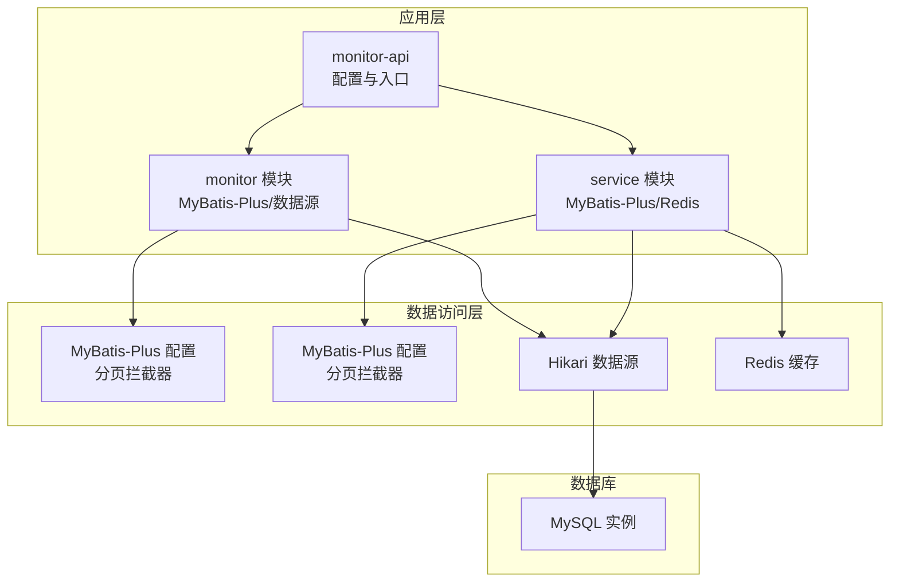
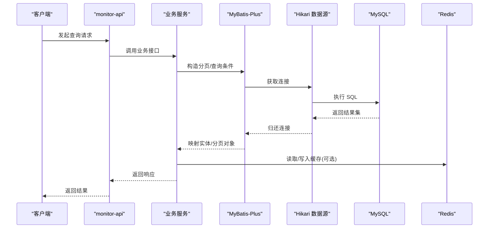
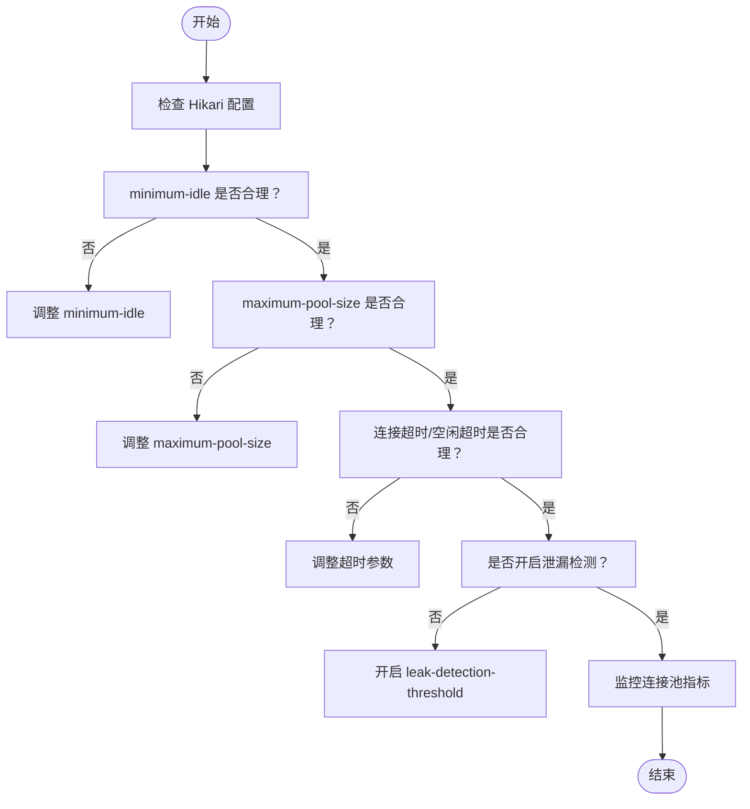
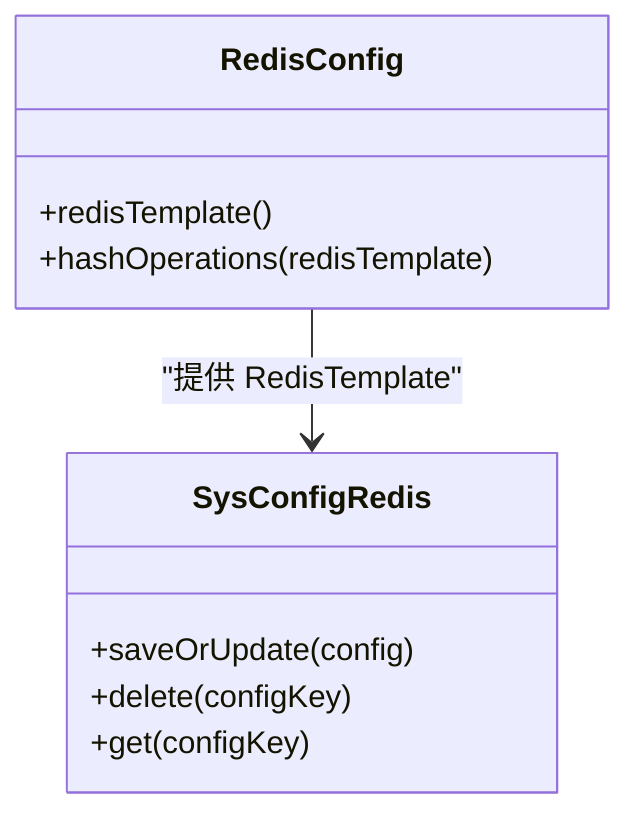
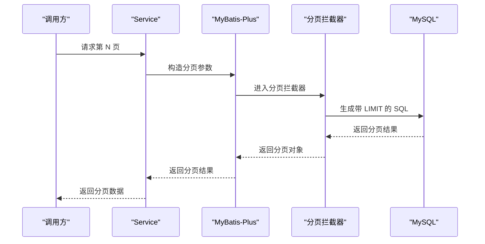
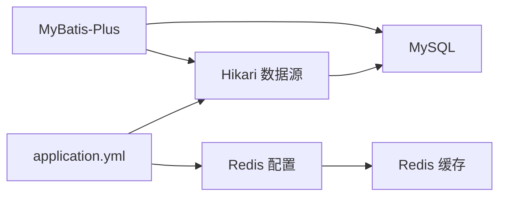

# 数据库性能优化

<cite>
**本文引用的文件**
- [application.yml](file://monkey-monitor-api/src/main/resources/application.yml)
- [application-dev.yml](file://monkey-monitor-api/src/main/resources/application-dev.yml)
- [application-prod.yml](file://monkey-monitor-api/src/main/resources/application-prod.yml)
- [MyDataSourceAutoConfiguration.java](file://monkey-monitor/src/main/java/com/monkey/general/config/MyDataSourceAutoConfiguration.java)
- [MybatisPlusConfig.java](file://monkey-monitor/src/main/java/com/monkey/general/config/MybatisPlusConfig.java)
- [MybatisPlusConfig.java](file://monkey-service/src/main/java/com/monkey/general/config/MybatisPlusConfig.java)
- [RedisConfig.java](file://monkey-service/src/main/java/com/monkey/general/config/RedisConfig.java)
- [SysConfigRedis.java](file://monkey-service/src/main/java/com/monkey/general/modules/sys/redis/SysConfigRedis.java)
- [application-prod.yml](file://deploy/config/monitor-api/application-prod.yml)
- [DeviceDao.xml](file://monkey-service/src/main/resources/mapper/em/DeviceDao.xml)
- [DeviceInfoDao.xml](file://monkey-service/src/main/resources/mapper/em/DeviceInfoDao.xml)
- [CameraMapper.xml](file://monkey-monitor/src/main/resources/mapper/em/CameraMapper.xml)
- [AlramInfoMapper.xml](file://monkey-monitor/src/main/resources/mapper/em/AlramInfoMapper.xml)
- [MySQLGeneratorDao.xml](file://monkey-code-generator/src/main/resources/mapper/MySQLGeneratorDao.xml)
- [SysGeneratorDao.xml](file://monkey-code-generator/src/main/resources/mapper/SysGeneratorDao.xml)
- [LocalCacheUtil.java](file://xxl-job-admin/src/main/java/com/xxl/job/admin/core/util/LocalCacheUtil.java)
</cite>

## 目录
1. [简介](#简介)
2. [项目结构](#项目结构)
3. [核心组件](#核心组件)
4. [架构总览](#架构总览)
5. [详细组件分析](#详细组件分析)
6. [依赖关系分析](#依赖关系分析)
7. [性能考量](#性能考量)
8. [故障排查指南](#故障排查指南)
9. [结论](#结论)
10. [附录](#附录)

## 简介
本文件面向安威 fireworks 物联网监控平台，聚焦数据库性能优化，覆盖索引设计策略、查询优化技术、分区表实践、连接池配置、缓存策略、分页与 LIMIT 优化、监控指标与工具使用，以及读写分离与负载均衡思路。文档以仓库中实际配置与代码为依据，结合常见优化模式，给出可落地的建议。

## 项目结构
- 应用配置集中在 monitor-api 模块的 application.yml 及其环境配置文件中，包含数据库连接池（Hikari）、Redis 缓存开关与连接参数等。
- MyBatis-Plus 配置位于 monitor 与 service 模块的 MybatisPlusConfig 中，统一注册分页拦截器与类型处理器。
- 数据源由 monitor 模块的 MyDataSourceAutoConfiguration 使用 Hikari 初始化。
- 缓存层通过 RedisConfig 定义 RedisTemplate，并在 service 层通过 SysConfigRedis 封装系统配置的读写缓存。
- 代码生成模块包含对 information_schema 的查询 XML，可用于索引与表结构分析。

**图表来源**
- [application.yml:1-40](file://monkey-monitor-api/src/main/resources/application.yml#L1-L40)
- [application-dev.yml:1-30](file://monkey-monitor-api/src/main/resources/application-dev.yml#L1-L30)
- [application-prod.yml:1-198](file://monkey-monitor-api/src/main/resources/application-prod.yml#L1-L198)
- [MyDataSourceAutoConfiguration.java:34-50](file://monkey-monitor/src/main/java/com/monkey/general/config/MyDataSourceAutoConfiguration.java#L34-L50)
- [MybatisPlusConfig.java:1-22](file://monkey-monitor/src/main/java/com/monkey/general/config/MybatisPlusConfig.java#L1-L22)
- [MybatisPlusConfig.java:1-24](file://monkey-service/src/main/java/com/monkey/general/config/MybatisPlusConfig.java#L1-L24)
- [RedisConfig.java:1-37](file://monkey-service/src/main/java/com/monkey/general/config/RedisConfig.java#L1-L37)

**章节来源**
- [application.yml:1-40](file://monkey-monitor-api/src/main/resources/application.yml#L1-L40)
- [application-dev.yml:1-30](file://monkey-monitor-api/src/main/resources/application-dev.yml#L1-L30)
- [application-prod.yml:1-198](file://monkey-monitor-api/src/main/resources/application-prod.yml#L1-L198)
- [MyDataSourceAutoConfiguration.java:34-50](file://monkey-monitor/src/main/java/com/monkey/general/config/MyDataSourceAutoConfiguration.java#L34-L50)
- [MybatisPlusConfig.java:1-22](file://monkey-monitor/src/main/java/com/monkey/general/config/MybatisPlusConfig.java#L1-L22)
- [MybatisPlusConfig.java:1-24](file://monkey-service/src/main/java/com/monkey/general/config/MybatisPlusConfig.java#L1-L24)
- [RedisConfig.java:1-37](file://monkey-service/src/main/java/com/monkey/general/config/RedisConfig.java#L1-L37)

## 核心组件
- 连接池与数据源
  - 使用 HikariCP，通过 MyDataSourceAutoConfiguration 构建数据源，支持 minimum-idle 与 maximum-pool-size 等参数。
  - monitor-api 的 application.yml 提供 Hikari 参数示例，生产环境配置位于 deploy/config/monitor-api/application-prod.yml。
- MyBatis-Plus
  - monitor 与 service 模块均注册 PaginationInterceptor，实现分页拦截与 LIMIT 优化基础能力。
  - monitor 模块额外注册 Integer[] 数组类型处理器，便于数组字段映射。
- 缓存
  - RedisConfig 定义 RedisTemplate，service 层通过 SysConfigRedis 对系统配置进行缓存读写。
  - XXL-Job 管理端使用 LocalCacheUtil 做本地缓存，减少频繁访问数据库。

**章节来源**
- [MyDataSourceAutoConfiguration.java:34-50](file://monkey-monitor/src/main/java/com/monkey/general/config/MyDataSourceAutoConfiguration.java#L34-L50)
- [application.yml:1-40](file://monkey-monitor-api/src/main/resources/application.yml#L1-L40)
- [application-dev.yml:1-30](file://monkey-monitor-api/src/main/resources/application-dev.yml#L1-L30)
- [application-prod.yml:1-198](file://monkey-monitor-api/src/main/resources/application-prod.yml#L1-L198)
- [MybatisPlusConfig.java:1-22](file://monkey-monitor/src/main/java/com/monkey/general/config/MybatisPlusConfig.java#L1-L22)
- [MybatisPlusConfig.java:1-24](file://monkey-service/src/main/java/com/monkey/general/config/MybatisPlusConfig.java#L1-L24)
- [RedisConfig.java:1-37](file://monkey-service/src/main/java/com/monkey/general/config/RedisConfig.java#L1-L37)
- [SysConfigRedis.java:1-37](file://monkey-service/src/main/java/com/monkey/general/modules/sys/redis/SysConfigRedis.java#L1-L37)
- [LocalCacheUtil.java:1-106](file://xxl-job-admin/src/main/java/com/xxl/job/admin/core/util/LocalCacheUtil.java#L1-L106)

## 架构总览
下图展示从应用到数据库与缓存的整体交互，强调连接池、分页拦截器与缓存的协同作用。

**图表来源**
- [MyDataSourceAutoConfiguration.java:34-50](file://monkey-monitor/src/main/java/com/monkey/general/config/MyDataSourceAutoConfiguration.java#L34-L50)
- [MybatisPlusConfig.java:1-22](file://monkey-monitor/src/main/java/com/monkey/general/config/MybatisPlusConfig.java#L1-L22)
- [MybatisPlusConfig.java:1-24](file://monkey-service/src/main/java/com/monkey/general/config/MybatisPlusConfig.java#L1-L24)
- [RedisConfig.java:1-37](file://monkey-service/src/main/java/com/monkey/general/config/RedisConfig.java#L1-L37)

## 详细组件分析

### 索引设计策略
- 单列索引
  - 选择性高且常出现在 WHERE 条件的列优先建立单列索引，例如业务主键、状态字段、时间范围字段等。
  - 对于枚举或分类字段，若过滤比例较高，也建议建立单列索引。
- 复合索引
  - 当查询常伴随固定前缀过滤（如公司编码 + 时间）时，优先考虑复合索引，遵循“最左前缀”原则。
  - 复合索引的列顺序应按选择性递减与过滤频率排序。
- 唯一索引
  - 对业务唯一约束字段（如编号、序列号）建立唯一索引，避免重复数据并提升查找效率。
- 建议的索引设计流程
  - 基于 EXPLAIN 分析热点 SQL 的执行计划，识别全表扫描与回表。
  - 结合业务维度（时间、组织、状态）评估复合索引收益。
  - 对高频更新字段谨慎加索引，平衡写入成本与读取收益。

[本节为通用策略说明，未直接分析具体文件，故无“章节来源”]

### 查询优化技术
- EXPLAIN 分析
  - 使用 EXPLAIN/ANALYZE 查看执行计划，关注 key、rows、filtered、Extra 等字段，定位索引缺失或回表过多。
- 慢查询日志分析
  - 开启慢查询日志，结合业务维度（时间段、租户、接口）筛选慢 SQL，定位热点与异常。
- 查询重写技巧
  - 避免 SELECT *，只取必要列。
  - 将 OR 改写为 IN 或 UNION，减少隐式转换与函数包裹。
  - 使用 LIMIT 与分页拦截器配合，避免一次性返回大量数据。
  - 对日期范围查询使用边界明确的 >= 与 <，避免函数包裹列导致索引失效。

[本节为通用策略说明，未直接分析具体文件，故无“章节来源”]

### 分区表策略（历史数据）
- 适用场景
  - 按时间维度（如日、月）对历史数据进行分区，便于归档、清理与维护。
- 实现方法
  - 基于 RANGE/LIST 分区，分区键选择业务上常用的时间字段。
  - 对高频查询字段（如公司编码、状态）可考虑组合分区键，提升查询效率。
  - 定期维护：新增分区、合并旧分区、删除过期分区。
- 注意事项
  - 分区键与查询条件匹配，避免跨分区扫描。
  - 分区过多会影响元数据管理与 DDL 性能，需平衡分区粒度。

[本节为通用策略说明，未直接分析具体文件，故无“章节来源”]

### 连接池配置优化
- HikariCP 参数建议
  - minimum-idle：根据峰值并发与平均延迟估算，保证热身连接充足。
  - maximum-pool-size：结合 CPU 核数与 IO 特性，避免过度竞争。
  - connection-timeout、idle-timeout、leak-detection-threshold：监控连接泄漏与超时。
- 生产环境参考
  - monitor-api 的 application.yml 提供 Hikari 参数示例。
  - deploy/config/monitor-api/application-prod.yml 提供生产环境连接池参数。

**图表来源**
- [application.yml:1-40](file://monkey-monitor-api/src/main/resources/application.yml#L1-L40)
- [application-dev.yml:1-30](file://monkey-monitor-api/src/main/resources/application-dev.yml#L1-L30)
- [application-prod.yml:1-198](file://monkey-monitor-api/src/main/resources/application-prod.yml#L1-L198)

**章节来源**
- [application.yml:1-40](file://monkey-monitor-api/src/main/resources/application.yml#L1-L40)
- [application-dev.yml:1-30](file://monkey-monitor-api/src/main/resources/application-dev.yml#L1-L30)
- [application-prod.yml:1-198](file://monkey-monitor-api/src/main/resources/application-prod.yml#L1-L198)

### 缓存策略（MyBatis 二级缓存 + Redis）
- MyBatis 二级缓存
  - 项目中 application.yml 已关闭全局缓存（cache-enabled: false），如需启用需在 MyBatis 配置中开启并设置合适的缓存策略。
- Redis 缓存
  - RedisConfig 定义了 RedisTemplate，SysConfigRedis 封装了系统配置的读写缓存，适合热点配置的快速读取。
  - 建议对查询频繁、变更较少的数据采用 Redis 缓存，设置合理的 TTL 与失效策略。

**图表来源**
- [RedisConfig.java:1-37](file://monkey-service/src/main/java/com/monkey/general/config/RedisConfig.java#L1-L37)
- [SysConfigRedis.java:1-37](file://monkey-service/src/main/java/com/monkey/general/modules/sys/redis/SysConfigRedis.java#L1-L37)

**章节来源**
- [application.yml:32-38](file://monkey-monitor-api/src/main/resources/application.yml#L32-L38)
- [RedisConfig.java:1-37](file://monkey-service/src/main/java/com/monkey/general/config/RedisConfig.java#L1-L37)
- [SysConfigRedis.java:1-37](file://monkey-service/src/main/java/com/monkey/general/modules/sys/redis/SysConfigRedis.java#L1-L37)

### 大数据量分页与 LIMIT 优化
- 分页拦截器
  - monitor 与 service 模块均注册 PaginationInterceptor，确保分页查询走 LIMIT。
- LIMIT 优化技巧
  - 使用“基于游标的分页”替代 OFFSET，避免深度分页导致的性能下降。
  - 对高频分页场景，结合复合索引与覆盖索引，减少回表。
- 示例参考
  - monitor 模块的 CameraMapper.xml 通过 ${ew.customSqlSegment} 动态拼接条件，service 模块的 DeviceDao.xml 使用子查询与 IN 子句，体现复杂查询的分页与 LIMIT 结合。

**图表来源**
- [MybatisPlusConfig.java:1-22](file://monkey-monitor/src/main/java/com/monkey/general/config/MybatisPlusConfig.java#L1-L22)
- [MybatisPlusConfig.java:1-24](file://monkey-service/src/main/java/com/monkey/general/config/MybatisPlusConfig.java#L1-L24)
- [CameraMapper.xml:1-10](file://monkey-monitor/src/main/resources/mapper/em/CameraMapper.xml#L1-L10)
- [DeviceDao.xml:1-18](file://monkey-service/src/main/resources/mapper/em/DeviceDao.xml#L1-L18)

**章节来源**
- [MybatisPlusConfig.java:1-22](file://monkey-monitor/src/main/java/com/monkey/general/config/MybatisPlusConfig.java#L1-L22)
- [MybatisPlusConfig.java:1-24](file://monkey-service/src/main/java/com/monkey/general/config/MybatisPlusConfig.java#L1-L24)
- [CameraMapper.xml:1-10](file://monkey-monitor/src/main/resources/mapper/em/CameraMapper.xml#L1-L10)
- [DeviceDao.xml:1-18](file://monkey-service/src/main/resources/mapper/em/DeviceDao.xml#L1-L18)

### 数据库监控指标与工具
- 连接池指标
  - active connections、idle connections、pending threads、leak detection 等。
- 数据库指标
  - QPS、TPS、慢查询数、锁等待、buffer pool 命中率、临时表与磁盘临时表数量。
- 工具建议
  - MySQL：Performance Schema、Slow Log、pt-query-digest、mysqldumpslow。
  - HikariCP：通过日志与 JVM 监控工具观察连接池状态。

[本节为通用策略说明，未直接分析具体文件，故无“章节来源”]

### 读写分离与负载均衡
- 读写分离
  - 写操作路由至主库，读操作路由至从库；对强一致场景使用主库读取。
- 负载均衡
  - 通过中间件或驱动级路由实现读库轮询或权重分配。
- 事务一致性
  - 跨库事务需采用分布式事务方案或最终一致性设计。

[本节为通用策略说明，未直接分析具体文件，故无“章节来源”]

## 依赖关系分析
- 配置依赖
  - monitor-api 的 application.yml 与环境配置文件决定数据源与缓存参数。
- 组件依赖
  - MyBatis-Plus 依赖 Hikari 数据源；Redis 依赖 Redis 连接工厂。
- SQL 依赖
  - 多处 XML 映射文件依赖表结构与索引设计，需与数据库实际索引保持一致。

**图表来源**
- [application.yml:1-40](file://monkey-monitor-api/src/main/resources/application.yml#L1-L40)
- [application-dev.yml:1-30](file://monkey-monitor-api/src/main/resources/application-dev.yml#L1-L30)
- [application-prod.yml:1-198](file://monkey-monitor-api/src/main/resources/application-prod.yml#L1-L198)
- [MyDataSourceAutoConfiguration.java:34-50](file://monkey-monitor/src/main/java/com/monkey/general/config/MyDataSourceAutoConfiguration.java#L34-L50)
- [RedisConfig.java:1-37](file://monkey-service/src/main/java/com/monkey/general/config/RedisConfig.java#L1-L37)

**章节来源**
- [application.yml:1-40](file://monkey-monitor-api/src/main/resources/application.yml#L1-L40)
- [application-dev.yml:1-30](file://monkey-monitor-api/src/main/resources/application-dev.yml#L1-L30)
- [application-prod.yml:1-198](file://monkey-monitor-api/src/main/resources/application-prod.yml#L1-L198)
- [MyDataSourceAutoConfiguration.java:34-50](file://monkey-monitor/src/main/java/com/monkey/general/config/MyDataSourceAutoConfiguration.java#L34-L50)
- [RedisConfig.java:1-37](file://monkey-service/src/main/java/com/monkey/general/config/RedisConfig.java#L1-L37)

## 性能考量
- 索引与查询
  - 基于 EXPLAIN 与慢查询日志持续优化热点 SQL，优先保证复合索引命中与避免回表。
- 分页与 LIMIT
  - 使用分页拦截器与 LIMIT，避免 OFFSET 深分页；对高频分页场景采用游标分页。
- 连接池
  - 合理设置 minimum-idle 与 maximum-pool-size，结合超时与泄漏检测参数，保障稳定性。
- 缓存
  - 对热点配置与查询结果进行缓存，降低数据库压力；注意缓存一致性与过期策略。
- 监控与回归
  - 建立数据库与连接池指标监控，定期回归性能基线，防止性能退化。

[本节为通用策略说明，未直接分析具体文件，故无“章节来源”]

## 故障排查指南
- 连接池问题
  - 现象：连接耗尽、超时、泄漏。
  - 排查：检查 minimum-idle、maximum-pool-size、connection-timeout；开启 leak-detection-threshold；查看连接池日志。
- 查询慢
  - 现象：慢查询增多、QPS 下降。
  - 排查：使用 EXPLAIN 分析执行计划，确认索引使用情况；结合慢查询日志定位热点 SQL。
- 缓存命中低
  - 现象：缓存未命中、数据库压力大。
  - 排查：确认缓存键设计、TTL 设置、缓存穿透与雪崩防护；核对 RedisConfig 序列化配置。

**章节来源**
- [application.yml:32-38](file://monkey-monitor-api/src/main/resources/application.yml#L32-L38)
- [application-dev.yml:12-29](file://monkey-monitor-api/src/main/resources/application-dev.yml#L12-L29)
- [application-prod.yml:9-27](file://monkey-monitor-api/src/main/resources/application-prod.yml#L9-L27)
- [LocalCacheUtil.java:1-106](file://xxl-job-admin/src/main/java/com/xxl/job/admin/core/util/LocalCacheUtil.java#L1-L106)

## 结论
通过对连接池、分页拦截器、缓存与 SQL 查询的系统性优化，结合 EXPLAIN 与慢查询日志的持续治理，可显著提升安威 fireworks 平台的数据库性能与稳定性。建议在生产环境中逐步引入分区表、读写分离与负载均衡，并建立完善的监控体系以保障长期性能。

## 附录
- 代码生成与表结构分析
  - 代码生成模块的 MySQLGeneratorDao.xml 与 SysGeneratorDao.xml 提供对 information_schema 的查询，可用于分析表与列信息，辅助索引设计与查询优化。

**章节来源**
- [MySQLGeneratorDao.xml:1-23](file://monkey-code-generator/src/main/resources/mapper/MySQLGeneratorDao.xml#L1-L23)
- [SysGeneratorDao.xml:1-33](file://monkey-code-generator/src/main/resources/mapper/SysGeneratorDao.xml#L1-L33)