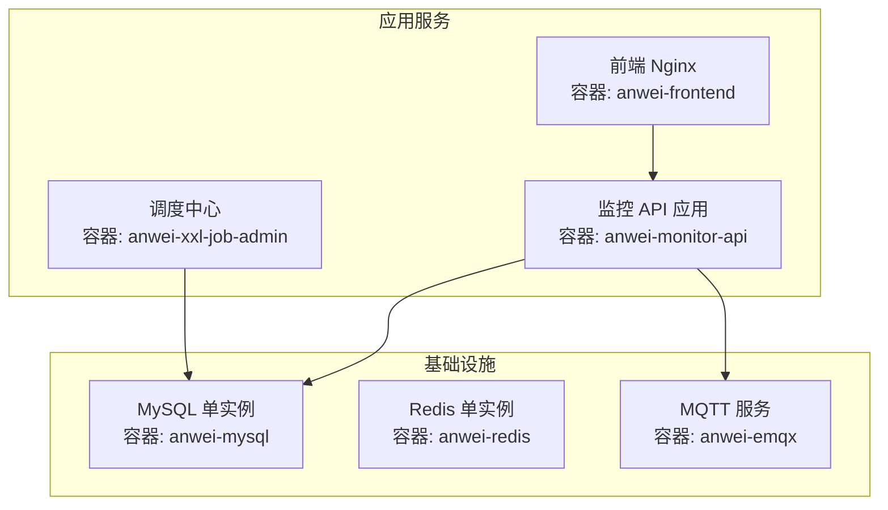
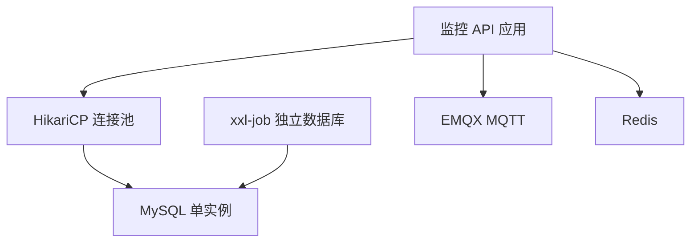
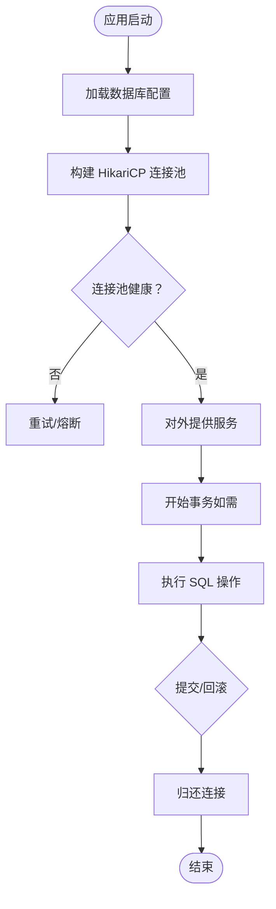
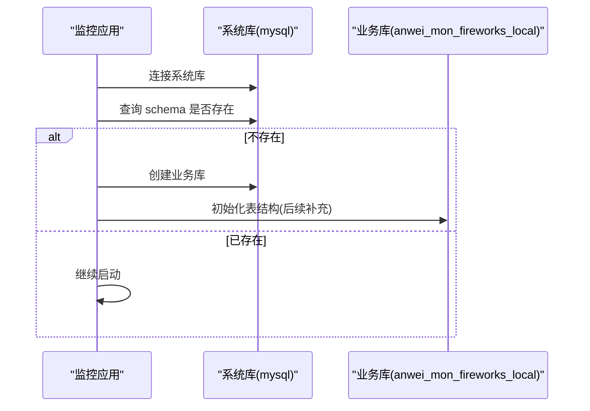
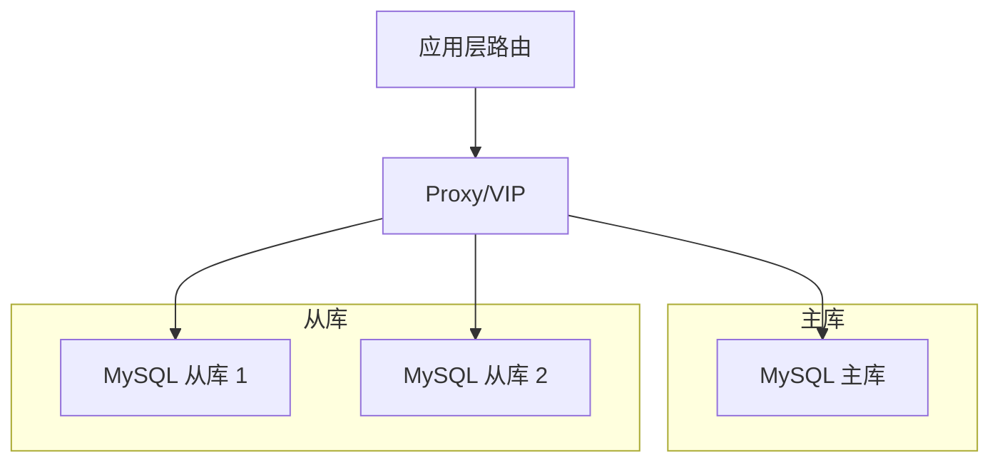
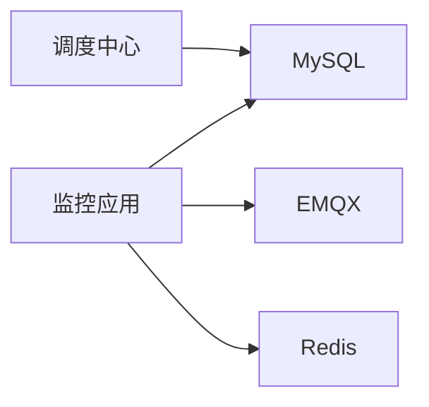

# 数据库架构

<cite>
**本文引用的文件**
- [application.yml](file://monkey-monitor-api/src/main/resources/application.yml)
- [application-dev.yml](file://monkey-monitor-api/src/main/resources/application-dev.yml)
- [application-prod.yml](file://monkey-monitor-api/src/main/resources/application-prod.yml)
- [MyDataSourceAutoConfiguration.java](file://monkey-monitor/src/main/java/com/monkey/general/config/MyDataSourceAutoConfiguration.java)
- [DatabaseInitConfig.java](file://monkey-monitor/src/main/java/com/monkey/general/config/DatabaseInitConfig.java)
- [docker-compose.yml](file://deploy/docker-compose.yml)
- [init.sql](file://deploy/init/init.sql)
- [XxlDataBaseConfig.java](file://xxl-job-admin/src/main/java/com/xxl/job/admin/core/conf/XxlDataBaseConfig.java)
- [application-prod.properties](file://xxl-job-admin/src/main/resources/application-prod.properties)
</cite>

## 目录
1. [简介](#简介)
2. [项目结构](#项目结构)
3. [核心组件](#核心组件)
4. [架构总览](#架构总览)
5. [详细组件分析](#详细组件分析)
6. [依赖分析](#依赖分析)
7. [性能考虑](#性能考虑)
8. [故障排查指南](#故障排查指南)
9. [结论](#结论)
10. [附录](#附录)

## 简介
本文件面向安威 fireworks 物联网监控平台，系统化梳理数据库架构与运维实践，覆盖以下主题：
- 整体架构设计：主从复制、读写分离、分库分表策略现状与落地建议
- 连接池与事务：HikariCP 配置、事务管理机制与连接超时设置
- 集群与高可用：基于 Docker Compose 的单实例部署与健康检查，故障切换建议
- 备份策略：全量与增量备份实施方案
- 性能监控与调优：关键指标与优化建议
- 安全配置：SSL 连接、用户权限与审计日志
- 版本升级与迁移：灰度与回滚策略
- 环境模板：开发、测试、生产数据库配置模板

## 项目结构
当前仓库采用多模块与容器编排方式组织，数据库相关能力集中在如下位置：
- 应用侧数据库配置与初始化：应用配置文件与初始化脚本
- 任务调度数据库：xxl-job 独立数据库
- 集群部署：Docker Compose 编排单节点 MySQL 实例

图表来源
- [docker-compose.yml:6-25](file://deploy/docker-compose.yml#L6-L25)
- [docker-compose.yml:56-87](file://deploy/docker-compose.yml#L56-L87)

章节来源
- [docker-compose.yml:1-103](file://deploy/docker-compose.yml#L1-L103)

## 核心组件
- 数据源自动配置与连接池
  - 应用通过 HikariCP 提供高性能连接池，支持最小空闲连接、最大连接数、连接超时等参数
  - 项目中使用了动态数据源自动装配，便于后续扩展读写分离与多租户场景
- 数据库初始化
  - 应用启动时对业务库进行存在性检查与创建，避免手工干预
  - xxl-job 独立数据库在调度中心启动时自动检测并初始化
- 配置文件
  - 开发、测试、生产三套环境配置，分别指向不同的数据库实例与参数
  - 初始化 SQL 脚本包含调度相关表结构与示例数据

章节来源
- [MyDataSourceAutoConfiguration.java:39-48](file://monkey-monitor/src/main/java/com/monkey/general/config/MyDataSourceAutoConfiguration.java#L39-L48)
- [DatabaseInitConfig.java:47-82](file://monkey-monitor/src/main/java/com/monkey/general/config/DatabaseInitConfig.java#L47-L82)
- [application.yml:1-40](file://monkey-monitor-api/src/main/resources/application.yml#L1-L40)
- [application-dev.yml:1-30](file://monkey-monitor-api/src/main/resources/application-dev.yml#L1-L30)
- [application-prod.yml:1-198](file://monkey-monitor-api/src/main/resources/application-prod.yml#L1-L198)
- [XxlDataBaseConfig.java:38-69](file://xxl-job-admin/src/main/java/com/xxl/job/admin/core/conf/XxlDataBaseConfig.java#L38-L69)
- [application-prod.properties:25-42](file://xxl-job-admin/src/main/resources/application-prod.properties#L25-L42)
- [init.sql:1-219](file://deploy/init/init.sql#L1-L219)

## 架构总览
当前数据库层以单实例 MySQL 为核心，结合 xxl-job 独立数据库与 Redis/MQTT 支撑业务与调度。整体架构强调快速交付与运维简化，尚未实现主从复制与读写分离。

图表来源
- [application-dev.yml:4-15](file://monkey-monitor-api/src/main/resources/application-dev.yml#L4-L15)
- [application-prod.yml:4-12](file://monkey-monitor-api/src/main/resources/application-prod.yml#L4-L12)
- [docker-compose.yml:6-25](file://deploy/docker-compose.yml#L6-L25)
- [application-prod.properties:25-29](file://xxl-job-admin/src/main/resources/application-prod.properties#L25-L29)

## 详细组件分析

### 数据库连接池与事务管理
- 连接池配置要点
  - 最小空闲连接、最大连接数、连接超时、空闲超时、最大生命周期、验证超时等参数均在配置文件中明确
  - 生产与开发环境参数差异明显，生产环境连接池规模更大，适合高并发场景
- 事务管理
  - 项目未显式声明全局事务管理器，常规 MyBatis Plus 事务由 Spring Boot 默认行为管理
  - 若未来引入分布式事务或跨库事务，需评估 Seata 或 XA 事务方案

图表来源
- [application-dev.yml:12-15](file://monkey-monitor-api/src/main/resources/application-dev.yml#L12-L15)
- [application-prod.yml:9-12](file://monkey-monitor-api/src/main/resources/application-prod.yml#L9-L12)
- [MyDataSourceAutoConfiguration.java:39-48](file://monkey-monitor/src/main/java/com/monkey/general/config/MyDataSourceAutoConfiguration.java#L39-L48)

章节来源
- [application-dev.yml:12-15](file://monkey-monitor-api/src/main/resources/application-dev.yml#L12-L15)
- [application-prod.yml:9-12](file://monkey-monitor-api/src/main/resources/application-prod.yml#L9-L12)
- [MyDataSourceAutoConfiguration.java:39-48](file://monkey-monitor/src/main/java/com/monkey/general/config/MyDataSourceAutoConfiguration.java#L39-L48)

### 数据库初始化与版本演进
- 业务库初始化
  - 应用启动时连接系统库，检查业务库是否存在，不存在则创建
  - 该机制简化了首次部署流程，减少人工干预
- 调度库初始化
  - 调度中心启动时检测并初始化 xxl-job 数据库，确保任务调度可用
- 版本升级与迁移
  - 建议采用“灰度发布 + 回滚”策略：先在测试环境验证 SQL 变更，再逐步在生产灰度
  - 对于结构变更，采用“在线 DDL + 双写校验”降低风险

图表来源
- [DatabaseInitConfig.java:47-82](file://monkey-monitor/src/main/java/com/monkey/general/config/DatabaseInitConfig.java#L47-L82)
- [XxlDataBaseConfig.java:38-69](file://xxl-job-admin/src/main/java/com/xxl/job/admin/core/conf/XxlDataBaseConfig.java#L38-L69)

章节来源
- [DatabaseInitConfig.java:47-82](file://monkey-monitor/src/main/java/com/monkey/general/config/DatabaseInitConfig.java#L47-L82)
- [XxlDataBaseConfig.java:38-69](file://xxl-job-admin/src/main/java/com/xxl/job/admin/core/conf/XxlDataBaseConfig.java#L38-L69)

### 高可用与故障切换
- 当前部署
  - Docker Compose 以单实例 MySQL 为主，具备健康检查与自动重启
- 高可用建议
  - 引入主从复制：一主一从或多从，配合半同步复制提升一致性
  - 读写分离：写库走主库，读库走从库，使用中间件或应用层路由
  - VIP/Proxy：通过 Proxy 或 VIP 实现故障自动切换
  - 监控与演练：定期演练故障切换，确保切换时间与数据一致性满足 SLA

图表来源
- [docker-compose.yml:6-25](file://deploy/docker-compose.yml#L6-L25)

章节来源
- [docker-compose.yml:6-25](file://deploy/docker-compose.yml#L6-L25)

### 分库分表策略
- 现状
  - 项目未见分库分表实现，当前为单库单实例
- 建议
  - 按业务域拆分：如设备、报警、日志等独立库
  - 按时间/地域/租户维度分表：结合业务增长曲线选择合适分片键
  - 采用中间件或 ORM 插件实现透明路由，保证 SQL 兼容性

章节来源
- [init.sql:1-219](file://deploy/init/init.sql#L1-L219)

### 备份策略
- 全量备份
  - 周期性执行物理/逻辑全备，保留多版本以便回滚
- 增量备份
  - 结合 binlog/redo log 实施增量备份，缩短 RPO
- 存储备份
  - 本地与异地双活存储，定期校验恢复流程
- 调度与演练
  - 通过调度中心定时触发备份任务，并定期进行恢复演练

章节来源
- [application-prod.properties:1-66](file://xxl-job-admin/src/main/resources/application-prod.properties#L1-L66)

### 安全配置
- SSL 连接
  - 配置中已禁用 SSL，建议在生产环境启用 SSL/TLS 并强制加密传输
- 用户权限
  - 为应用与调度中心分别创建专用账号，最小权限原则，禁止 root 直接使用
- 审计日志
  - 启用慢查询日志与审计日志，记录敏感操作与异常访问

章节来源
- [application-dev.yml:6-8](file://monkey-monitor-api/src/main/resources/application-dev.yml#L6-L8)
- [application-prod.yml:6-8](file://monkey-monitor-api/src/main/resources/application-prod.yml#L6-L8)
- [application-prod.properties:25-29](file://xxl-job-admin/src/main/resources/application-prod.properties#L25-L29)

### 环境配置模板
- 开发环境
  - 指向测试数据库实例，连接池较小，便于本地调试
- 测试环境
  - 与开发类似，但连接池略大，模拟真实负载
- 生产环境
  - 连接池规模较大，启用 SSL，严格权限控制与审计

章节来源
- [application-dev.yml:1-30](file://monkey-monitor-api/src/main/resources/application-dev.yml#L1-L30)
- [application-prod.yml:1-198](file://monkey-monitor-api/src/main/resources/application-prod.yml#L1-L198)

## 依赖分析
- 组件耦合
  - 监控应用依赖 MySQL 与 MQTT；调度中心依赖独立的 xxl-job 数据库
  - Redis 用于缓存与会话，非强依赖
- 外部依赖
  - Docker Compose 编排 MySQL、Redis、EMQX、应用与前端
  - 初始化脚本提供调度表结构与示例数据

图表来源
- [docker-compose.yml:6-25](file://deploy/docker-compose.yml#L6-L25)
- [application-prod.properties:25-29](file://xxl-job-admin/src/main/resources/application-prod.properties#L25-L29)

章节来源
- [docker-compose.yml:1-103](file://deploy/docker-compose.yml#L1-L103)
- [application-prod.properties:25-42](file://xxl-job-admin/src/main/resources/application-prod.properties#L25-L42)

## 性能考虑
- 连接池优化
  - 根据并发峰值调整最大连接数与空闲连接，避免连接不足或过度占用
  - 设置合理的连接超时与空闲回收时间，降低资源浪费
- SQL 优化
  - 为高频查询建立必要索引，避免全表扫描
  - 使用分页查询与 LIMIT 控制结果集大小
- 监控指标
  - 连接池活跃数、等待时间、超时次数、拒绝次数
  - 数据库 QPS、慢查询、锁等待、缓冲池命中率
- 调优建议
  - 读写分离后，将统计类查询路由至从库
  - 对热点表实施分区或分表，降低单表规模

章节来源
- [application-dev.yml:12-15](file://monkey-monitor-api/src/main/resources/application-dev.yml#L12-L15)
- [application-prod.yml:9-12](file://monkey-monitor-api/src/main/resources/application-prod.yml#L9-L12)

## 故障排查指南
- 启动失败
  - 检查数据库连通性与凭据；确认初始化脚本已正确挂载
- 连接池异常
  - 观察最大连接耗尽、等待超时、连接泄漏等问题
- 事务问题
  - 确认事务边界与隔离级别；避免长事务与死锁
- 备份恢复
  - 校验备份完整性与恢复速度；定期演练

章节来源
- [docker-compose.yml:17-22](file://deploy/docker-compose.yml#L17-L22)
- [init.sql:1-219](file://deploy/init/init.sql#L1-L219)

## 结论
当前安威 fireworks 平台数据库架构以单实例 MySQL 为基础，结合 Redis 与 MQTT 实现业务闭环。项目在连接池、初始化与调度数据库方面具备良好基础，建议在生产环境中逐步引入主从复制、读写分离与分库分表，完善高可用与灾备体系，并强化安全与监控能力，持续提升系统稳定性与可维护性。

## 附录
- 初始化脚本包含调度相关表结构与示例数据，可用于快速验证调度链路
- Docker Compose 提供一键编排，便于本地与测试环境部署

章节来源
- [init.sql:1-219](file://deploy/init/init.sql#L1-L219)
- [docker-compose.yml:1-103](file://deploy/docker-compose.yml#L1-L103)