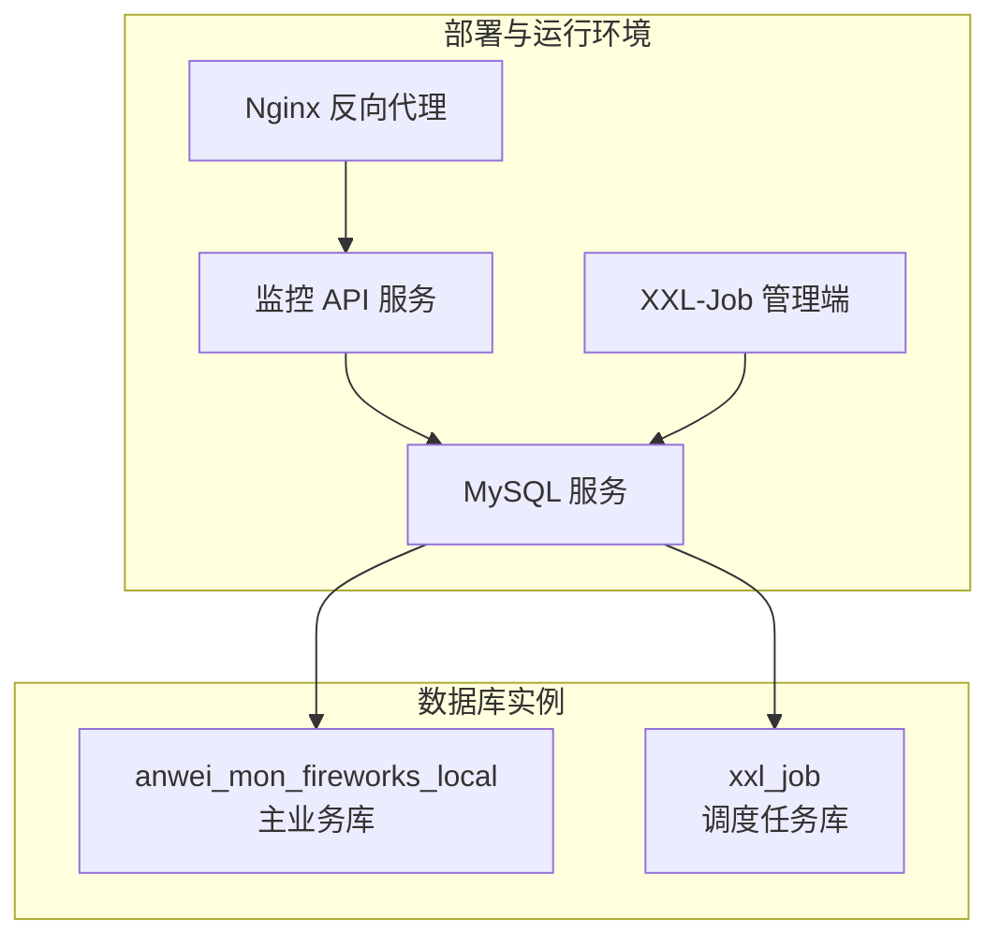
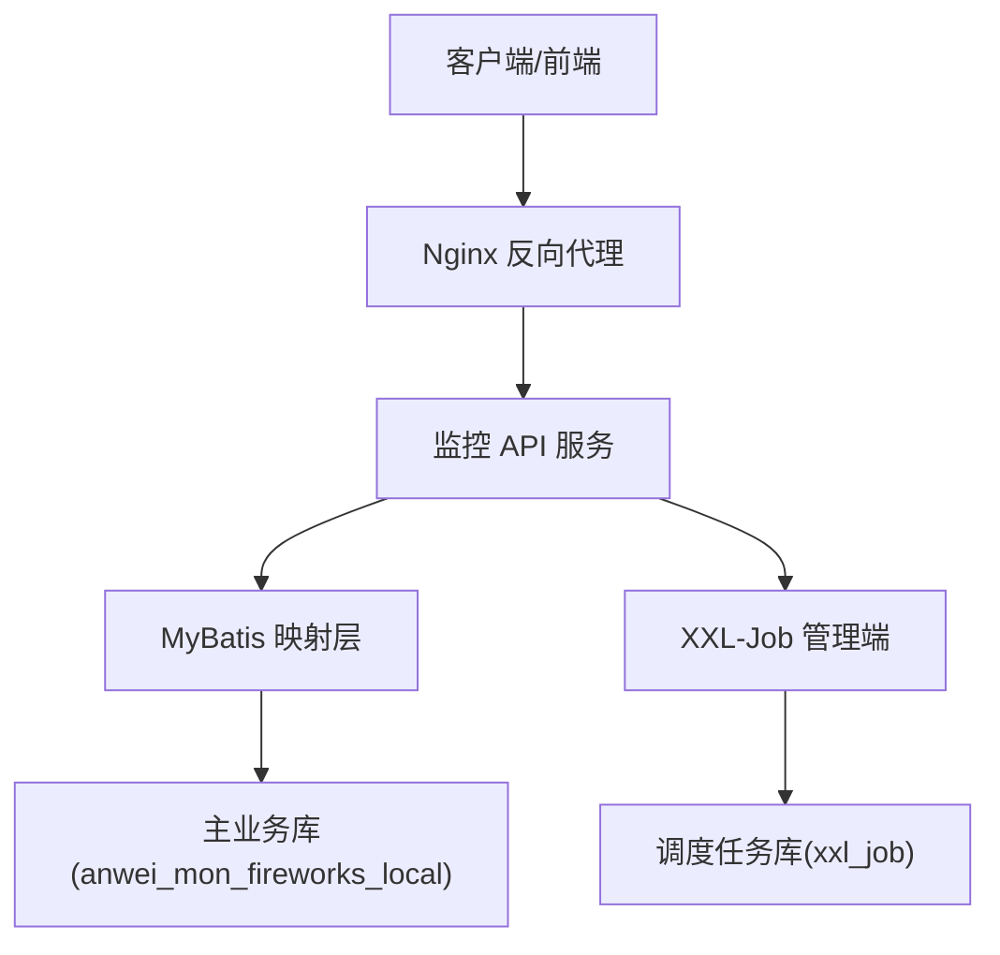
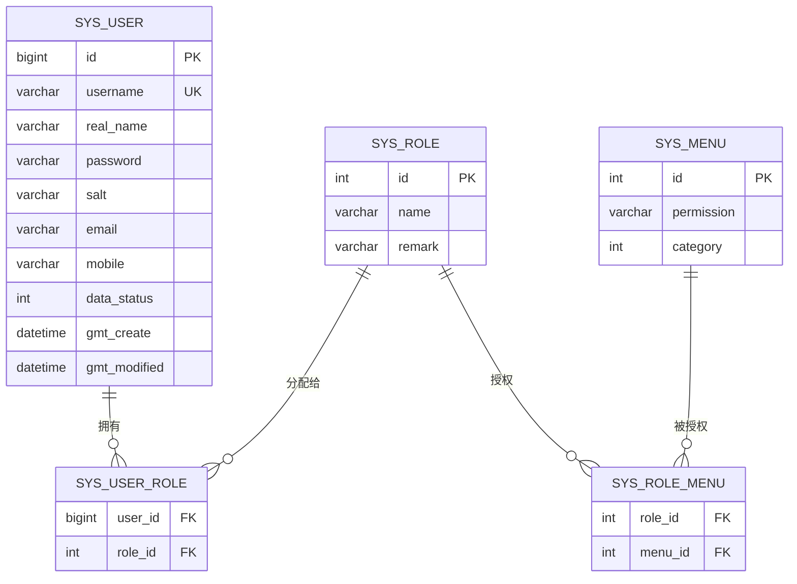
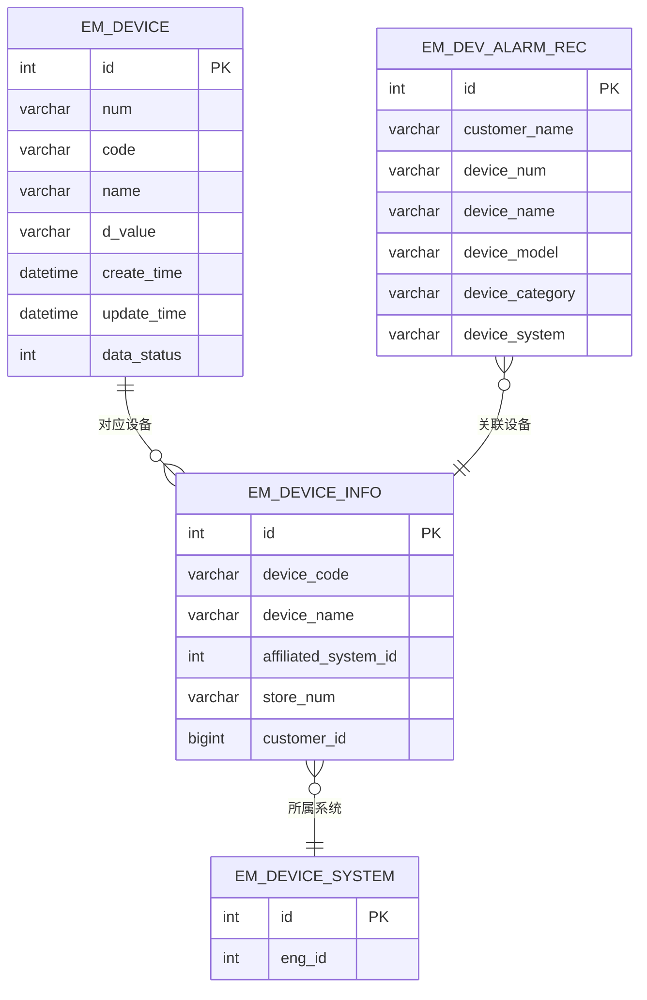
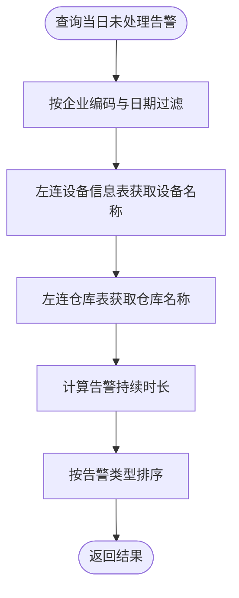
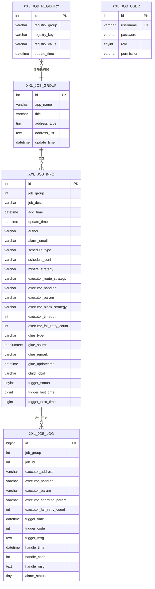
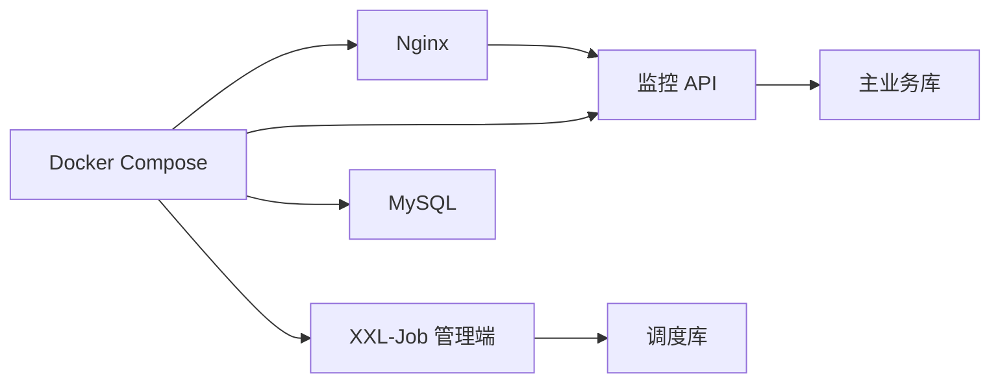

# 数据库设计

<cite>
**本文引用的文件**
- [init.sql](file://deploy/init/init.sql)
- [application-prod.yml](file://monkey-monitor-api/src/main/resources/application-prod.yml)
- [MyDataSourceAutoConfiguration.java](file://monkey-monitor/src/main/java/com/monkey/general/config/MyDataSourceAutoConfiguration.java)
- [XxlDataBaseConfig.java](file://xxl-job-admin/src/main/java/com/xxl/job/admin/core/conf/XxlDataBaseConfig.java)
- [User.java](file://monkey-service/src/main/java/com/monkey/general/modules/sys/entity/User.java)
- [Device.java](file://monkey-service/src/main/java/com/monkey/general/modules/em/entity/Device.java)
- [DevAlarmRec.java](file://monkey-service/src/main/java/com/monkey/general/modules/em/entity/DevAlarmRec.java)
- [UserMapper.xml](file://monkey-service/src/main/resources/mapper/sys/UserMapper.xml)
- [DeviceDao.xml](file://monkey-service/src/main/resources/mapper/em/DeviceDao.xml)
- [CityinfoDao.xml](file://monkey-service/src/main/resources/mapper/em/CityinfoDao.xml)
- [DevAlarmRecDao.xml](file://monkey-service/src/main/resources/mapper/em/DevAlarmRecDao.xml)
- [DeviceInfoDao.xml](file://monkey-service/src/main/resources/mapper/em/DeviceInfoDao.xml)
- [MySQLGeneratorDao.xml](file://monkey-code-generator/src/main/resources/mapper/MySQLGeneratorDao.xml)
- [SysGeneratorDao.xml](file://monkey-code-generator/src/main/resources/mapper/SysGeneratorDao.xml)
- [docker-compose.yml](file://deploy/docker-compose.yml)
- [nginx.conf](file://deploy/config/frontend/nginx.conf)
</cite>

## 目录
1. [简介](#简介)
2. [项目结构与数据库范围](#项目结构与数据库范围)
3. [核心组件与数据访问层](#核心组件与数据访问层)
4. [架构总览](#架构总览)
5. [详细组件分析](#详细组件分析)
6. [依赖关系分析](#依赖关系分析)
7. [性能与扩展性考虑](#性能与扩展性考虑)
8. [故障排查指南](#故障排查指南)
9. [结论](#结论)
10. [附录](#附录)

## 简介
本文件面向安威 fireworks 物联网监控平台，提供数据库层面的完整设计文档。内容涵盖整体架构、核心业务表与系统管理表的结构设计、表间关系与索引策略、数据访问层(MyBatis 映射与 DAO 接口)、事务管理、数据分片与性能优化、数据迁移与版本管理、数据安全与备份恢复策略，并给出关键表的使用场景与示例。

## 项目结构与数据库范围
- 平台数据库主要由两部分组成：
  - 主业务数据库：用于存放监控、设备、告警、系统管理等核心业务数据。
  - XXL-Job 调度任务数据库：用于存放调度器的任务、日志、执行器等信息。
- 数据库初始化脚本与部署编排：
  - 初始化脚本负责创建数据库与表结构。
  - Docker Compose 编排包含 MySQL、Nginx、监控 API、XXL-Job 等服务。
  - Nginx 提供前端静态资源与后端 API 的反向代理。

**图表来源**
- [docker-compose.yml:56-102](file://deploy/docker-compose.yml#L56-L102)
- [nginx.conf:1-23](file://deploy/config/frontend/nginx.conf#L1-L23)

**章节来源**
- [init.sql:1-27](file://deploy/init/init.sql#L1-L27)
- [docker-compose.yml:56-102](file://deploy/docker-compose.yml#L56-L102)
- [application-prod.yml:4-13](file://monkey-monitor-api/src/main/resources/application-prod.yml#L4-L13)

## 核心组件与数据访问层
- 数据源与连接池
  - 使用 HikariCP 作为连接池，通过自动配置类注入数据源 Bean。
  - 监控 API 的生产配置指定了 MySQL JDBC URL、用户名、密码及连接池参数。
- MyBatis 映射与 DAO
  - 实体类采用 MyBatis-Plus 注解标注表名与字段填充策略。
  - Mapper XML 文件定义 SQL 查询与关联查询，覆盖系统用户、设备、告警、行政区划树等。
- 事务管理
  - 项目中未发现显式声明式事务配置，建议在服务层使用 Spring 声明式事务以保证一致性。

**章节来源**
- [MyDataSourceAutoConfiguration.java:35-48](file://monkey-monitor/src/main/java/com/monkey/general/config/MyDataSourceAutoConfiguration.java#L35-L48)
- [application-prod.yml:4-13](file://monkey-monitor-api/src/main/resources/application-prod.yml#L4-L13)
- [User.java:22-100](file://monkey-service/src/main/java/com/monkey/general/modules/sys/entity/User.java#L22-L100)
- [Device.java:18-67](file://monkey-service/src/main/java/com/monkey/general/modules/em/entity/Device.java#L18-L67)
- [UserMapper.xml:1-42](file://monkey-service/src/main/resources/mapper/sys/UserMapper.xml#L1-L42)
- [DeviceDao.xml:1-18](file://monkey-service/src/main/resources/mapper/em/DeviceDao.xml#L1-L18)

## 架构总览
下图展示数据库层与各模块的关系：监控 API 通过 MyBatis 访问主业务库；XXL-Job 管理端独立使用调度库；Nginx 作为统一入口代理至 API。

**图表来源**
- [docker-compose.yml:71-87](file://deploy/docker-compose.yml#L71-L87)
- [nginx.conf:12-22](file://deploy/config/frontend/nginx.conf#L12-L22)

## 详细组件分析

### 系统管理表：用户与权限
- 表：sys_user（用户）、sys_menu（菜单）、sys_role（角色）、sys_user_role（用户-角色）、sys_role_menu（角色-菜单）
- 字段要点
  - 用户表包含主键、实名、用户名、密码、盐、邮箱、手机、公司编码、数据状态、创建/更新时间等。
  - 权限查询通过多表关联实现，支持按用户查询权限集合与菜单 ID 列表。
- 索引与查询优化
  - 建议对 sys_user(username) 建唯一索引；对 sys_user_role(role_id)、sys_role_menu(menu_id) 建索引以加速权限查询。
- 使用场景
  - 登录鉴权、菜单权限过滤、销售员名单查询等。

**图表来源**
- [UserMapper.xml:6-23](file://monkey-service/src/main/resources/mapper/sys/UserMapper.xml#L6-L23)

**章节来源**
- [User.java:22-126](file://monkey-service/src/main/java/com/monkey/general/modules/sys/entity/User.java#L22-L126)
- [UserMapper.xml:1-42](file://monkey-service/src/main/resources/mapper/sys/UserMapper.xml#L1-L42)

### 核心业务表：设备与监控数据
- 表：em_device（设备采集数据）、em_device_info（设备信息）、em_dev_alarm_rec（设备告警记录）
- 字段要点
  - 设备采集表包含设备编码、点位编码、点位名称、感应数据、状态与时间戳。
  - 设备信息表与设备系统关联，支持按客户与工程维度查询。
  - 告警记录表包含客户名称、设备信息、类别、型号、系统、告警详情与处理状态。
- 索引与查询优化
  - 建议对 em_device(code, create_time) 组合索引，支撑按点位与时间的最新记录查询。
  - 对 em_device_info(customer_id, affiliated_system_id) 建索引，提升关联查询效率。
- 使用场景
  - 实时监控数据聚合、设备清单与系统关联查询、告警记录分页与统计。

**图表来源**
- [Device.java:18-67](file://monkey-service/src/main/java/com/monkey/general/modules/em/entity/Device.java#L18-L67)
- [DeviceInfoDao.xml:4-11](file://monkey-service/src/main/resources/mapper/em/DeviceInfoDao.xml#L4-L11)
- [DevAlarmRec.java:17-56](file://monkey-service/src/main/java/com/monkey/general/modules/em/entity/DevAlarmRec.java#L17-L56)

**章节来源**
- [Device.java:18-67](file://monkey-service/src/main/java/com/monkey/general/modules/em/entity/Device.java#L18-L67)
- [DeviceDao.xml:4-17](file://monkey-service/src/main/resources/mapper/em/DeviceDao.xml#L4-L17)
- [DeviceInfoDao.xml:4-11](file://monkey-service/src/main/resources/mapper/em/DeviceInfoDao.xml#L4-L11)
- [DevAlarmRec.java:17-56](file://monkey-service/src/main/java/com/monkey/general/modules/em/entity/DevAlarmRec.java#L17-L56)

### 监控告警与业务报表
- 表：em_alram_info（告警信息）
- 字段要点
  - 包含设备编码、告警类型、告警图片、告警开始时间、处理状态、企业编码等。
- 索引与查询优化
  - 建议对 processing_status、company_code、warning_date 建组合索引，支撑当日未处理告警的快速筛选与统计。
- 使用场景
  - 当日告警汇总、告警持续时长计算、推送/上报流程的待办查询。

**图表来源**
- [AlramInfoMapper.xml:61-81](file://monkey-monitor/src/main/resources/mapper/em/AlramInfoMapper.xml#L61-L81)

**章节来源**
- [AlramInfoMapper.xml:61-87](file://monkey-monitor/src/main/resources/mapper/em/AlramInfoMapper.xml#L61-L87)

### 行政区划树形结构
- 表：em_cityinfo（行政区划）
- 字段要点
  - 包含 id、编号、名称、父级编号、数据状态、创建/更新时间等。
- 查询模式
  - 通过嵌套查询实现树形结构的递归加载，适合省市区层级展示。
- 使用场景
  - 下拉选择、区域权限控制、报表按区域聚合。

**章节来源**
- [CityinfoDao.xml:4-35](file://monkey-service/src/main/resources/mapper/em/CityinfoDao.xml#L4-L35)

### XXL-Job 调度任务库
- 数据库：xxl_job
- 核心表：xxl_job_group、xxl_job_info、xxl_job_log、xxl_job_registry、xxl_job_user 等
- 字段要点
  - 任务调度、执行器、日志、锁、用户等信息。
- 索引与查询优化
  - 日志表对 trigger_time、handle_code、job_id 等建立索引，支撑按时间与状态的统计与检索。
- 使用场景
  - 定时任务的启停、日志审计、执行器健康检查。

**图表来源**
- [init.sql:30-218](file://deploy/init/init.sql#L30-L218)

**章节来源**
- [init.sql:30-218](file://deploy/init/init.sql#L30-L218)

## 依赖关系分析
- 数据库依赖
  - 监控 API 依赖主业务库；XXL-Job 管理端依赖调度库。
- 运行时依赖
  - Nginx 代理 API 请求；Docker Compose 确保 MySQL、EMQX、API、Nginx 服务健康启动顺序。

**图表来源**
- [docker-compose.yml:56-102](file://deploy/docker-compose.yml#L56-L102)
- [nginx.conf:12-22](file://deploy/config/frontend/nginx.conf#L12-L22)

**章节来源**
- [docker-compose.yml:56-102](file://deploy/docker-compose.yml#L56-L102)
- [nginx.conf:1-23](file://deploy/config/frontend/nginx.conf#L1-L23)

## 性能与扩展性考虑
- 连接池与数据源
  - 生产配置已设置 HikariCP 最大连接数与最小空闲连接数，建议结合压测结果微调。
- 索引策略
  - 主业务库：对高频查询字段建立组合索引（如 em_device(code, create_time)、em_device_info(customer_id, affiliated_system_id)、em_alram_info(process_status, company_code, warning_date)）。
  - 调度库：对日志表的关键查询字段建立索引，避免全表扫描。
- 分片与分区
  - 建议对 em_device、em_alram_info 等大表按时间或企业编码进行水平分片/分区，降低单表规模。
- 缓存与异步
  - 对热点查询（如用户权限、设备清单）引入 Redis 缓存；对写密集场景采用消息队列削峰。
- 读写分离
  - 在高并发读场景下，可考虑主从复制与读写分离，将只读查询路由至从库。

[本节为通用性能指导，不直接分析特定文件]

## 故障排查指南
- 数据库连接问题
  - 检查 JDBC URL、用户名、密码与网络连通性；确认 HikariCP 连接池参数合理。
- 表结构缺失
  - XXL-Job 管理端启动时会检测数据库是否存在，不存在则自动创建并初始化表结构。
- 权限与索引
  - 若权限查询或日志检索变慢，检查相关索引是否存在且有效。
- 日志与审计
  - XXL-Job 日志表包含调度与执行状态，可用于定位任务异常。

**章节来源**
- [application-prod.yml:4-13](file://monkey-monitor-api/src/main/resources/application-prod.yml#L4-L13)
- [XxlDataBaseConfig.java:38-69](file://xxl-job-admin/src/main/java/com/xxl/job/admin/core/conf/XxlDataBaseConfig.java#L38-L69)
- [init.sql:105-143](file://deploy/init/init.sql#L105-L143)

## 结论
本设计文档基于现有代码与配置，给出了安威 fireworks 平台数据库的整体架构与关键表结构，明确了数据访问层、索引与查询优化策略，并提供了性能扩展与运维保障建议。后续可在高并发与大数据量场景下进一步实施分片/分区、缓存与异步化改造，以满足业务增长需求。

[本节为总结性内容，不直接分析特定文件]

## 附录

### 数据访问层设计要点
- 实体类注解
  - 使用 MyBatis-Plus 注解标注表名与字段填充策略，简化 CRUD 与逻辑删除。
- Mapper XML
  - 通过命名空间与 SQL 片段实现复杂关联查询与批量操作。
- 生成器与模板
  - 代码生成器支持多数据库方言，便于快速生成实体与映射文件。

**章节来源**
- [User.java:22-100](file://monkey-service/src/main/java/com/monkey/general/modules/sys/entity/User.java#L22-L100)
- [Device.java:18-67](file://monkey-service/src/main/java/com/monkey/general/modules/em/entity/Device.java#L18-L67)
- [UserMapper.xml:1-42](file://monkey-service/src/main/resources/mapper/sys/UserMapper.xml#L1-L42)
- [DeviceDao.xml:1-18](file://monkey-service/src/main/resources/mapper/em/DeviceDao.xml#L1-L18)
- [MySQLGeneratorDao.xml:4-22](file://monkey-code-generator/src/main/resources/mapper/MySQLGeneratorDao.xml#L4-L22)
- [SysGeneratorDao.xml:4-32](file://monkey-code-generator/src/main/resources/mapper/SysGeneratorDao.xml#L4-L32)

### 数据迁移与版本管理
- 建议采用数据库版本管理工具（如 Flyway/Liquibase），将初始化脚本拆分为版本化的变更脚本，确保迁移过程可追踪、可回滚。
- 对于 XXL-Job 调度库，遵循相同策略，保证任务表结构演进的一致性。

[本节为通用实践建议，不直接分析特定文件]

### 数据安全与备份恢复
- 安全
  - 强制 HTTPS 传输、最小权限原则、敏感字段加密存储。
- 备份
  - 建议采用增量+全量备份策略，定期校验恢复流程，确保 RPO/RTO 满足业务要求。
- 监控
  - 对数据库连接数、慢查询、锁等待等指标进行监控与告警。

[本节为通用实践建议，不直接分析特定文件]