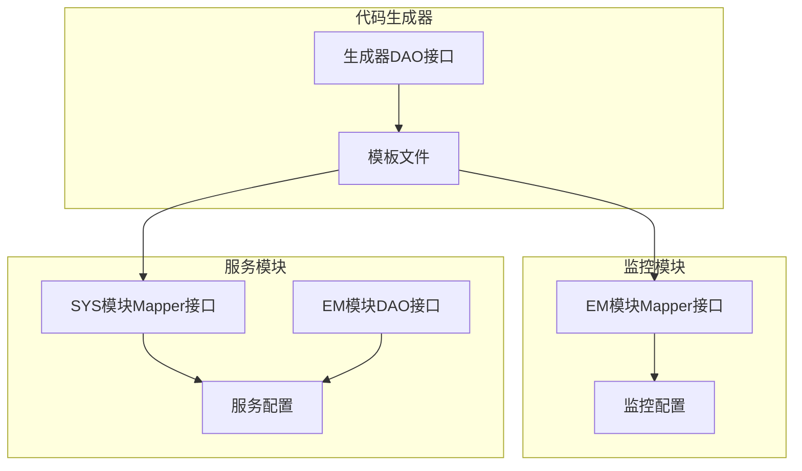
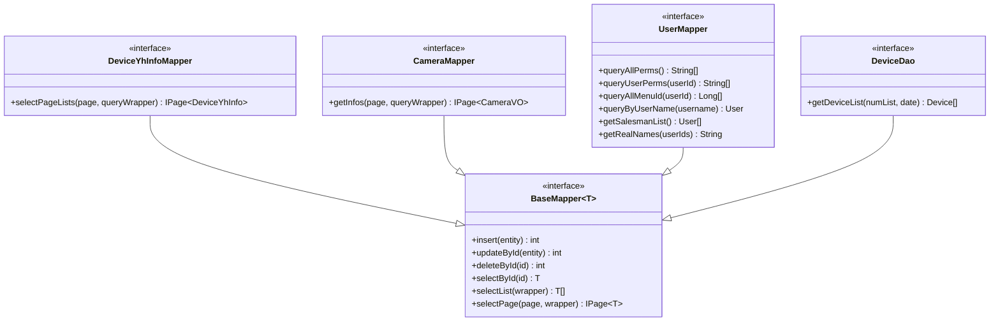
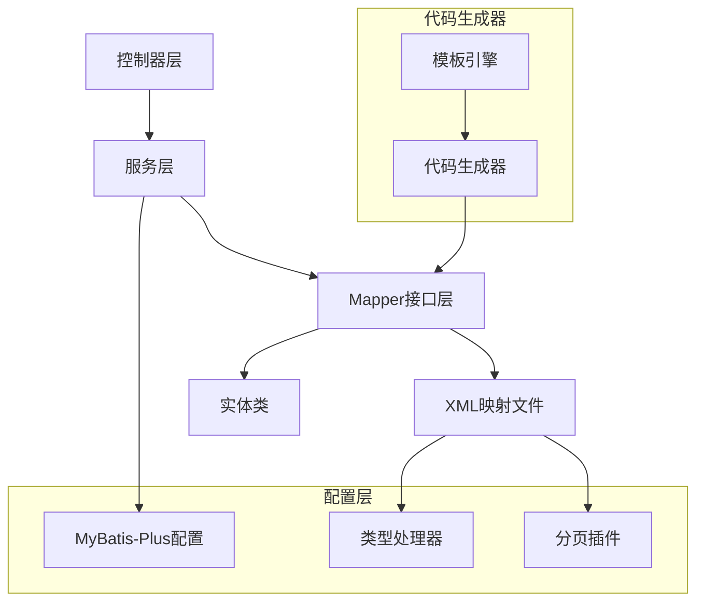
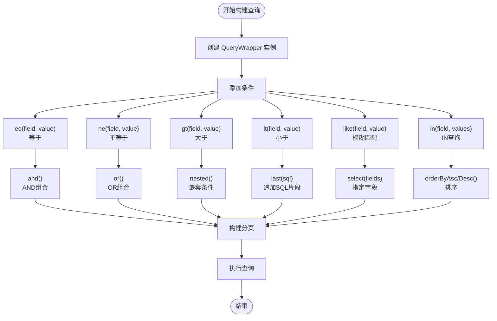
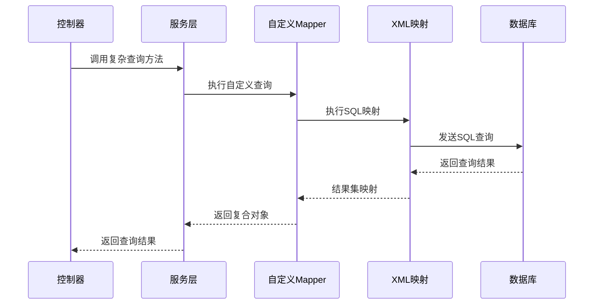
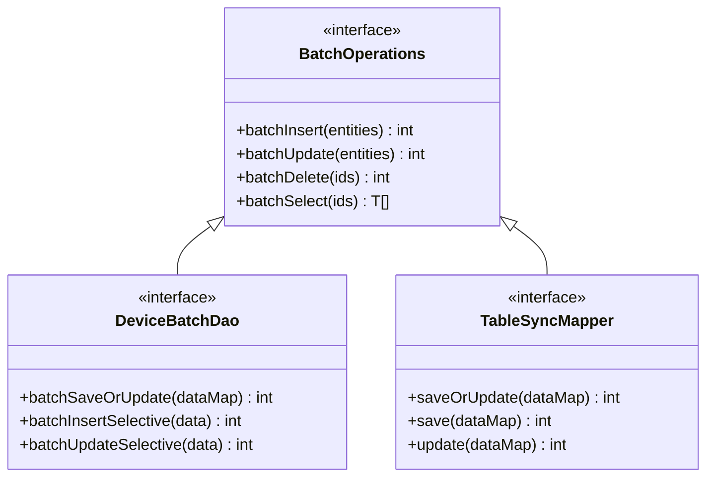
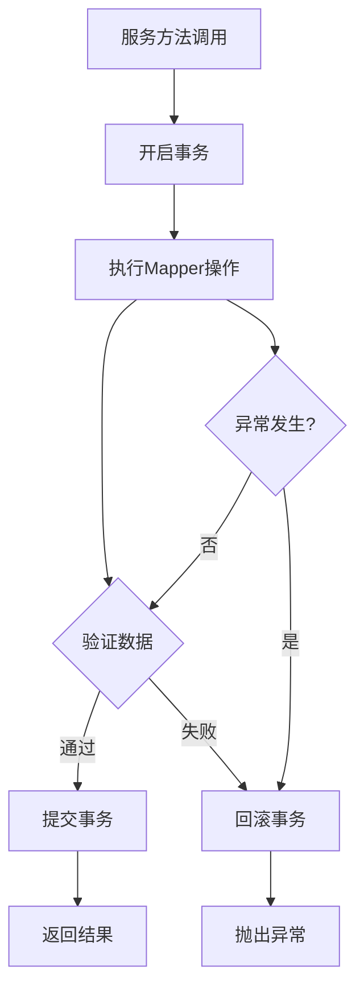
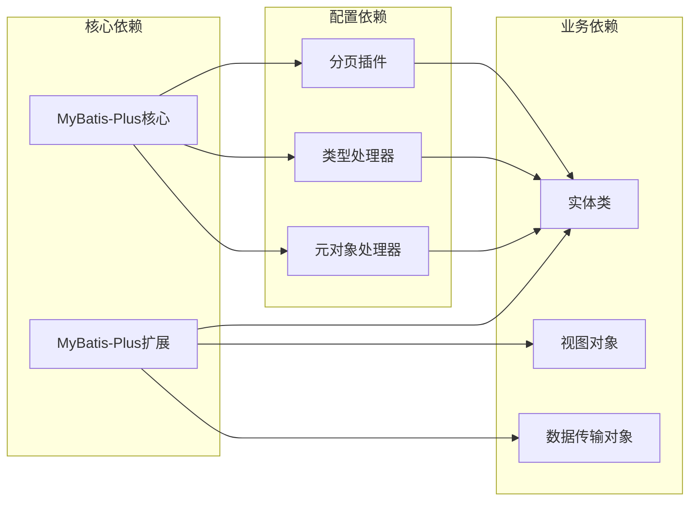
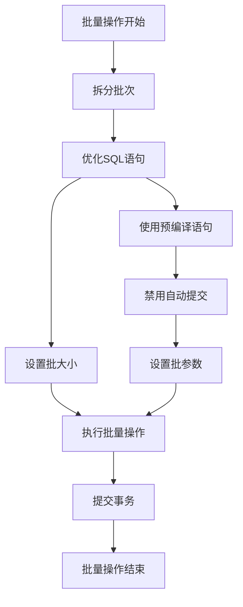
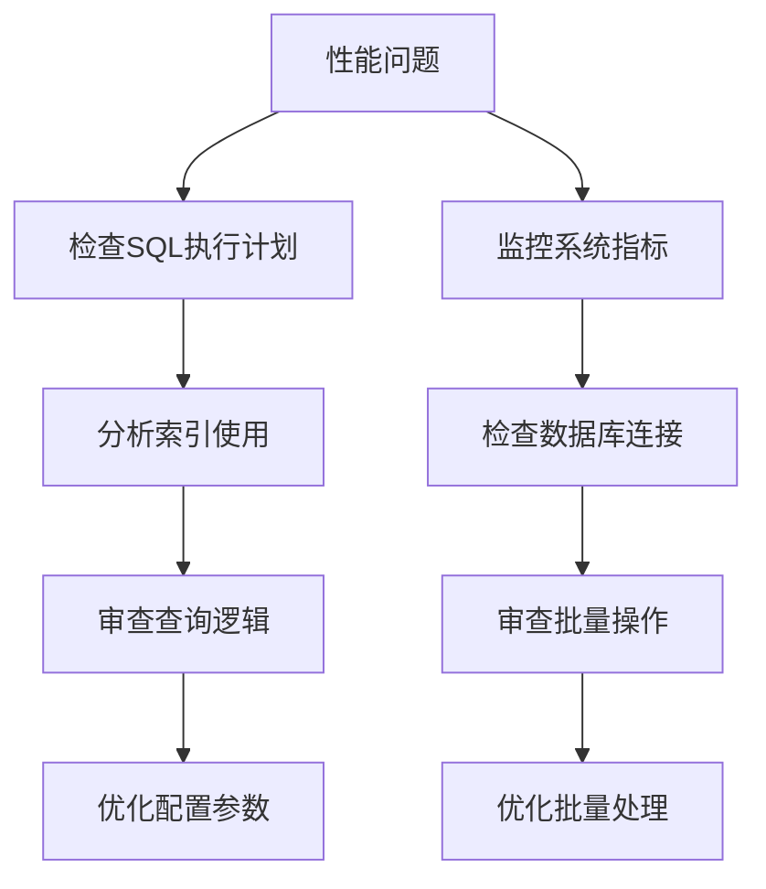

# Mapper接口设计

<cite>
**本文档引用的文件**
- [DeviceYhInfoMapper.java](file://monkey-monitor/src/main/java/com/monkey/general/modules/em/mapper/DeviceYhInfoMapper.java)
- [CameraMapper.java](file://monkey-monitor/src/main/java/com/monkey/general/modules/em/mapper/CameraMapper.java)
- [UserMapper.java](file://monkey-service/src/main/java/com/monkey/general/modules/sys/mapper/UserMapper.java)
- [DeviceDao.java](file://monkey-service/src/main/java/com/monkey/general/modules/em/dao/DeviceDao.java)
- [MybatisPlusConfig.java](file://monkey-monitor/src/main/java/com/monkey/general/config/MybatisPlusConfig.java)
- [MybatisPlusConfig.java](file://monkey-service/src/main/java/com/monkey/general/config/MybatisPlusConfig.java)
- [TableSyncMapper.xml](file://monkey-service/src/main/resources/mapper/open/TableSyncMapper.xml)
- [Query.java](file://monkey-service/src/main/java/com/monkey/general/common/utils/Query.java)
- [Device.java](file://monkey-service/src/main/java/com/monkey/general/modules/em/entity/Device.java)
- [User.java](file://monkey-service/src/main/java/com/monkey/general/modules/sys/entity/User.java)
- [DeviceYhInfo.java](file://monkey-monitor/src/main/java/com/monkey/general/modules/em/entity/DeviceYhInfo.java)
- [Dao.java.vm](file://monkey-code-generator/src/main/resources/template/Dao.java.vm)
</cite>

## 目录
1. [简介](#简介)
2. [项目结构](#项目结构)
3. [核心组件](#核心组件)
4. [架构概览](#架构概览)
5. [详细组件分析](#详细组件分析)
6. [依赖分析](#依赖分析)
7. [性能考虑](#性能考虑)
8. [故障排除指南](#故障排除指南)
9. [结论](#结论)

## 简介

安威 fireworks 物联网监控平台采用 MyBatis-Plus 框架构建，通过 BaseMapper 接口实现通用 CRUD 操作，并结合自定义 Mapper 接口满足复杂的业务查询需求。本设计文档专注于 Mapper 接口的设计模式，涵盖继承关系、通用 CRUD 方法使用、条件构造器 QueryWrapper 的应用、复杂查询方法的实现以及批量操作的处理。

## 项目结构

平台采用模块化组织方式，不同功能模块拥有独立的 Mapper 接口和 XML 映射文件：



**图表来源**
- [DeviceYhInfoMapper.java:1-23](file://monkey-monitor/src/main/java/com/monkey/general/modules/em/mapper/DeviceYhInfoMapper.java#L1-L23)
- [UserMapper.java:1-40](file://monkey-service/src/main/java/com/monkey/general/modules/sys/mapper/UserMapper.java#L1-L40)
- [DeviceDao.java:1-18](file://monkey-service/src/main/java/com/monkey/general/modules/em/dao/DeviceDao.java#L1-L18)

**章节来源**
- [DeviceYhInfoMapper.java:1-23](file://monkey-monitor/src/main/java/com/monkey/general/modules/em/mapper/DeviceYhInfoMapper.java#L1-L23)
- [UserMapper.java:1-40](file://monkey-service/src/main/java/com/monkey/general/modules/sys/mapper/UserMapper.java#L1-L40)
- [DeviceDao.java:1-18](file://monkey-service/src/main/java/com/monkey/general/modules/em/dao/DeviceDao.java#L1-L18)

## 核心组件

### BaseMapper 继承体系

所有 Mapper 接口都直接继承自 MyBatis-Plus 的 BaseMapper<T>，获得完整的通用 CRUD 能力：



**图表来源**
- [DeviceYhInfoMapper.java:18](file://monkey-monitor/src/main/java/com/monkey/general/modules/em/mapper/DeviceYhInfoMapper.java#L18)
- [CameraMapper.java:19](file://monkey-monitor/src/main/java/com/monkey/general/modules/em/mapper/CameraMapper.java#L19)
- [UserMapper.java:13](file://monkey-service/src/main/java/com/monkey/general/modules/sys/mapper/UserMapper.java#L13)
- [DeviceDao.java:14](file://monkey-service/src/main/java/com/monkey/general/modules/em/dao/DeviceDao.java#L14)

### 通用 CRUD 方法使用

基于 BaseMapper 的通用 CRUD 方法提供了标准化的数据访问能力：

| 方法 | 参数 | 返回值 | 描述 |
|------|------|--------|------|
| insert | T entity | int | 插入单条记录 |
| updateById | T entity | int | 根据ID更新记录 |
| deleteById | Serializable id | int | 根据ID删除记录 |
| selectById | Serializable id | T | 根据ID查询记录 |
| selectList | Wrapper wrapper | List<T> | 条件查询列表 |
| selectPage | IPage<T> page, Wrapper wrapper | IPage<T> | 分页查询 |

**章节来源**
- [DeviceYhInfoMapper.java:18](file://monkey-monitor/src/main/java/com/monkey/general/modules/em/mapper/DeviceYhInfoMapper.java#L18)
- [CameraMapper.java:19](file://monkey-monitor/src/main/java/com/monkey/general/modules/em/mapper/CameraMapper.java#L19)
- [UserMapper.java:13](file://monkey-service/src/main/java/com/monkey/general/modules/sys/mapper/UserMapper.java#L13)
- [DeviceDao.java:14](file://monkey-service/src/main/java/com/monkey/general/modules/em/dao/DeviceDao.java#L14)

## 架构概览

平台的 Mapper 层采用分层架构设计，结合 MyBatis-Plus 的自动配置和自定义扩展：



**图表来源**
- [MybatisPlusConfig.java:1-21](file://monkey-monitor/src/main/java/com/monkey/general/config/MybatisPlusConfig.java#L1-L21)
- [MybatisPlusConfig.java:1-23](file://monkey-service/src/main/java/com/monkey/general/config/MybatisPlusConfig.java#L1-L23)

## 详细组件分析

### 条件构造器 QueryWrapper 使用

QueryWrapper 提供了丰富的条件构建能力，支持多种比较操作符：



**图表来源**
- [DeviceYhInfoMapper.java:20](file://monkey-monitor/src/main/java/com/monkey/general/modules/em/mapper/DeviceYhInfoMapper.java#L20)
- [CameraMapper.java:21](file://monkey-monitor/src/main/java/com/monkey/general/modules/em/mapper/CameraMapper.java#L21)

### 复杂查询方法实现

#### 多表联查实现

通过自定义 Mapper 方法实现复杂查询场景：



**图表来源**
- [DeviceYhInfoMapper.java:20](file://monkey-monitor/src/main/java/com/monkey/general/modules/em/mapper/DeviceYhInfoMapper.java#L20)
- [CameraMapper.java:21](file://monkey-monitor/src/main/java/com/monkey/general/modules/em/mapper/CameraMapper.java#L21)

#### 分组统计查询

针对统计分析需求，平台提供了专门的分组查询接口：

| 查询类型 | 方法示例 | 用途 |
|----------|----------|------|
| 按设备类型分组 | `groupBy(deviceType)` | 统计各类设备数量 |
| 按企业分组 | `groupBy(companyCode)` | 分析企业设备分布 |
| 时间序列统计 | `groupBy(createTime)` | 设备数据趋势分析 |
| 多维度统计 | `groupBy(companyCode, deviceType)` | 复合维度分析 |

### 批量操作实现

平台支持多种批量操作模式：



**图表来源**
- [TableSyncMapper.xml:9-28](file://monkey-service/src/main/resources/mapper/open/TableSyncMapper.xml#L9-L28)

**章节来源**
- [TableSyncMapper.xml:9-28](file://monkey-service/src/main/resources/mapper/open/TableSyncMapper.xml#L9-L28)

### 事务管理与异常处理

#### 事务管理机制

平台采用声明式事务管理，确保数据一致性：



#### 异常处理策略

| 异常类型 | 处理策略 | 影响范围 |
|----------|----------|----------|
| 数据约束异常 | 回滚事务并返回业务错误 | 单次操作 |
| 连接超时异常 | 重试机制 + 日志记录 | 网络层 |
| 并发冲突异常 | 乐观锁重试 + 用户提示 | 并发场景 |
| 业务规则异常 | 直接返回错误信息 | 业务层 |

**章节来源**
- [MybatisPlusConfig.java:1-21](file://monkey-monitor/src/main/java/com/monkey/general/config/MybatisPlusConfig.java#L1-L21)

## 依赖分析

### 组件耦合关系



**图表来源**
- [MybatisPlusConfig.java:12-19](file://monkey-monitor/src/main/java/com/monkey/general/config/MybatisPlusConfig.java#L12-L19)
- [MybatisPlusConfig.java:1-21](file://monkey-monitor/src/main/java/com/monkey/general/config/MybatisPlusConfig.java#L1-L21)

### 外部依赖关系

平台主要依赖以下外部组件：

| 依赖组件 | 版本 | 用途 | 重要性 |
|----------|------|------|--------|
| MyBatis-Plus | 最新稳定版 | ORM框架 | 核心 |
| Spring Boot | 最新稳定版 | 应用框架 | 核心 |
| Druid | 1.2.8 | 数据源连接池 | 重要 |
| Lombok | 1.18.x | 代码简化 | 一般 |
| Swagger | 2.x | API文档 | 一般 |

**章节来源**
- [MybatisPlusConfig.java:1-21](file://monkey-monitor/src/main/java/com/monkey/general/config/MybatisPlusConfig.java#L1-L21)

## 性能考虑

### 查询优化策略

1. **索引优化**
   - 为常用查询字段建立合适索引
   - 避免在 WHERE 子句中对字段进行函数操作
   - 合理使用复合索引

2. **分页优化**
   - 使用 MyBatis-Plus 内置分页插件
   - 避免使用 `LIMIT -1` 进行全表扫描
   - 合理设置每页大小

3. **缓存策略**
   - 对热点数据实施二级缓存
   - 使用 Redis 缓存频繁查询结果
   - 合理设置缓存过期时间

### 批量操作优化



## 故障排除指南

### 常见问题诊断

#### Mapper 接口问题

| 问题症状 | 可能原因 | 解决方案 |
|----------|----------|----------|
| Mapper 无法注入 | 包扫描路径错误 | 检查 @Mapper 注解和扫描配置 |
| SQL 执行异常 | 参数类型不匹配 | 验证实体类字段类型 |
| 分页结果为空 | 查询条件过于严格 | 调整查询条件或测试数据 |
| 批量操作失败 | 事务配置不当 | 检查事务传播行为 |

#### 性能问题排查



#### 调试技巧

1. **开启 SQL 日志**
   ```yaml
   logging:
     level:
       com.monkey.general: debug
   ```

2. **使用 MyBatis-Plus 分页插件**
   - 验证分页参数传递
   - 检查分页结果集完整性

3. **异常堆栈分析**
   - 关注数据访问层异常
   - 检查事务回滚点
   - 验证业务逻辑边界

**章节来源**
- [Query.java:18-42](file://monkey-service/src/main/java/com/monkey/general/common/utils/Query.java#L18-L42)

## 结论

安威 fireworks 物联网监控平台的 Mapper 接口设计充分体现了 MyBatis-Plus 框架的优势，通过 BaseMapper 继承体系实现了标准化的数据访问层。平台在保证通用 CRUD 能力的同时，通过自定义 Mapper 接口满足了复杂的业务查询需求。

### 设计亮点

1. **标准化继承体系**：统一的 BaseMapper 继承模式确保了代码的一致性和可维护性
2. **灵活的条件查询**：QueryWrapper 提供了强大的条件构建能力
3. **完善的分页支持**：集成 MyBatis-Plus 分页插件，支持大数据量场景
4. **事务管理机制**：声明式事务确保数据一致性
5. **代码生成器集成**：提高开发效率，减少重复代码

### 最佳实践建议

1. **遵循命名规范**：接口名使用 `EntityNameMapper` 命名模式
2. **合理使用泛型**：确保类型安全和代码复用
3. **优化查询性能**：合理设计索引和查询条件
4. **异常处理策略**：统一异常处理机制，提供清晰的错误信息
5. **事务边界控制**：明确事务作用域，避免过度事务化

通过以上设计模式和最佳实践，平台能够高效地处理物联网监控场景下的各种数据访问需求，为系统的稳定运行提供了坚实的基础。