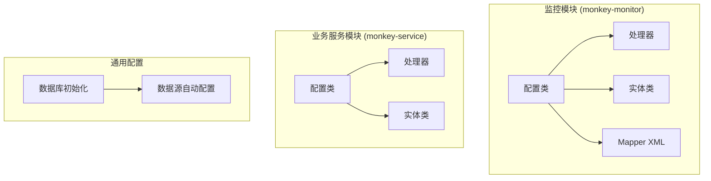
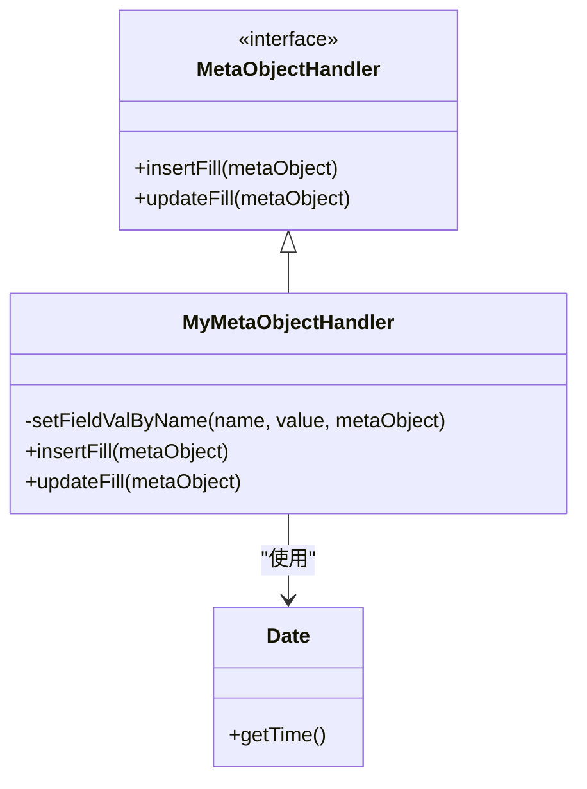
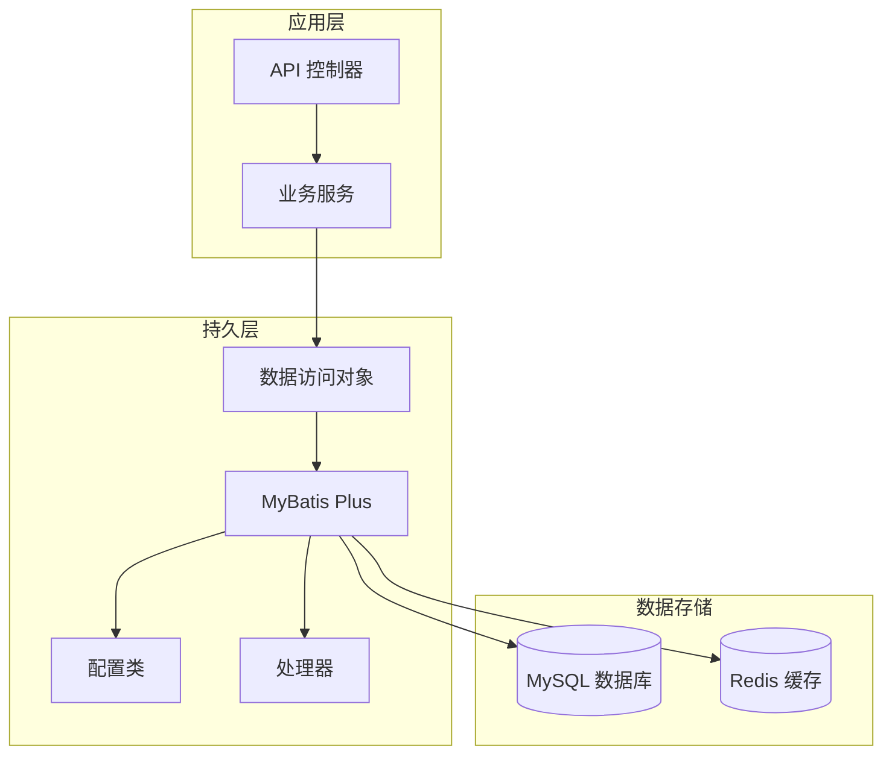
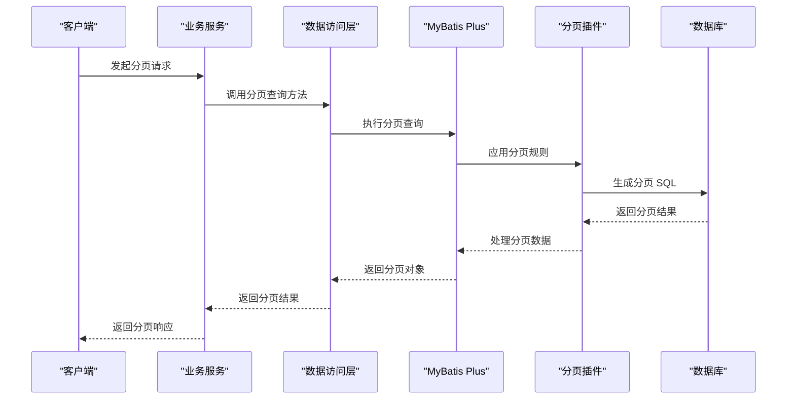
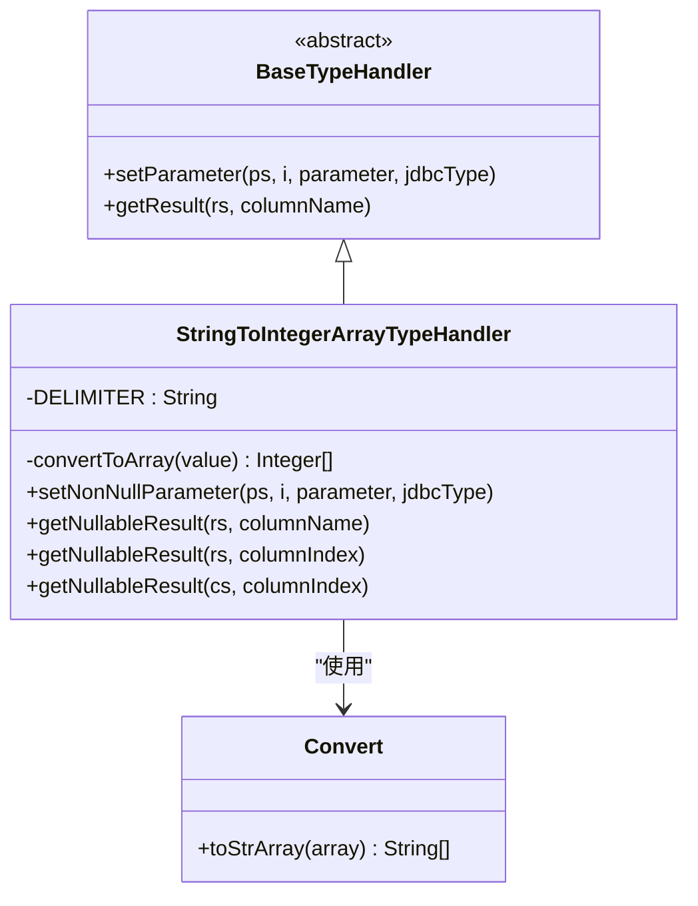
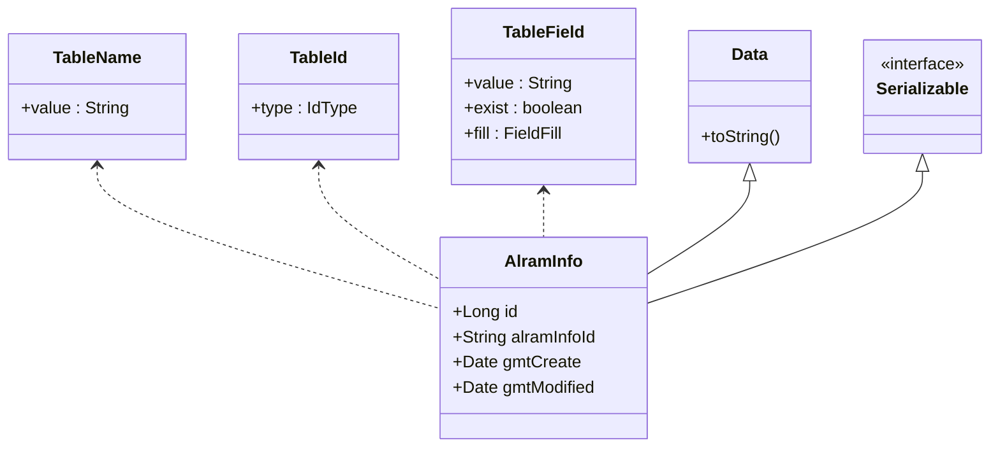
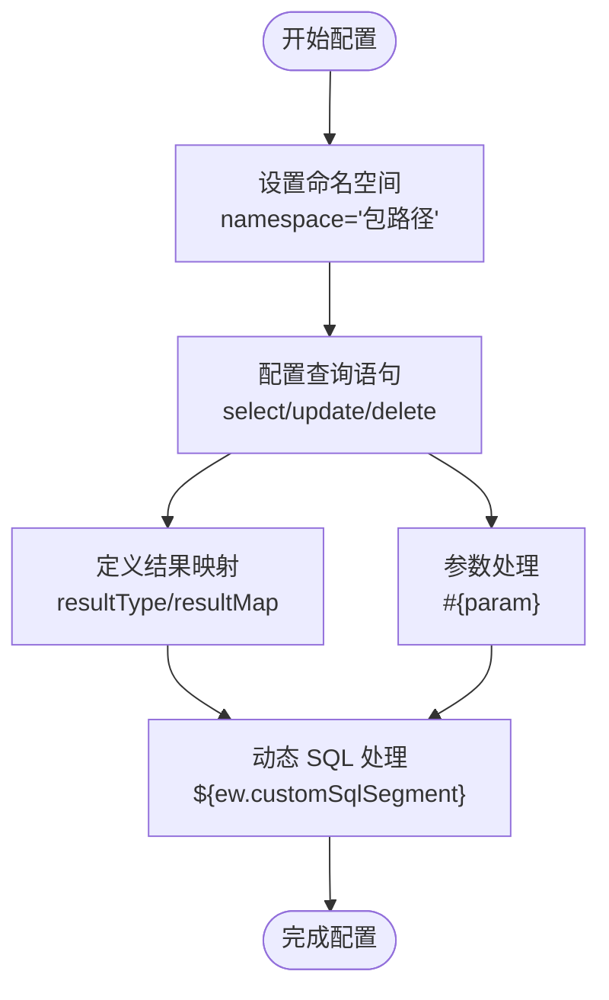
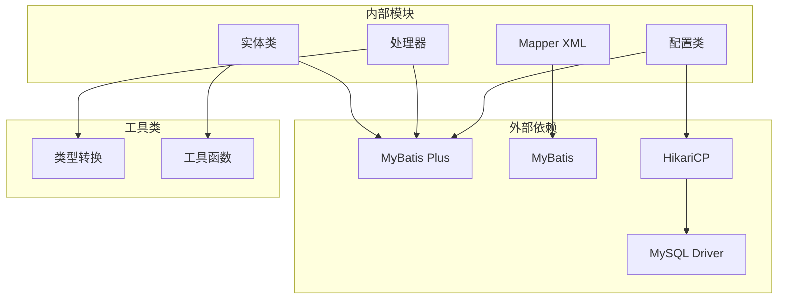

# ORM配置与初始化

<cite>
**本文档引用的文件**
- [MybatisPlusConfig.java](file://monkey-monitor/src/main/java/com/monkey/general/config/MybatisPlusConfig.java)
- [MyMetaObjectHandler.java](file://monkey-service/src/main/java/com/monkey/general/handler/MyMetaObjectHandler.java)
- [StringToIntegerArrayTypeHandler.java](file://monkey-monitor/src/main/java/com/monkey/general/handler/StringToIntegerArrayTypeHandler.java)
- [AlramInfo.java](file://monkey-monitor/src/main/java/com/monkey/general/modules/em/entity/AlramInfo.java)
- [Camera.java](file://monkey-monitor/src/main/java/com/monkey/general/modules/em/entity/Camera.java)
- [AlramInfoMapper.xml](file://monkey-monitor/src/main/resources/mapper/em/AlramInfoMapper.xml)
- [CameraMapper.xml](file://monkey-monitor/src/main/resources/mapper/em/CameraMapper.xml)
- [MybatisPlusConfig.java](file://monkey-service/src/main/java/com/monkey/general/config/MybatisPlusConfig.java)
- [DatabaseInitConfig.java](file://monkey-monitor/src/main/java/com/monkey/general/config/DatabaseInitConfig.java)
- [MyDataSourceAutoConfiguration.java](file://monkey-monitor/src/main/java/com/monkey/general/config/MyDataSourceAutoConfiguration.java)
</cite>

## 目录
1. [简介](#简介)
2. [项目结构](#项目结构)
3. [核心组件](#核心组件)
4. [架构概览](#架构概览)
5. [详细组件分析](#详细组件分析)
6. [依赖分析](#依赖分析)
7. [性能考虑](#性能考虑)
8. [故障排除指南](#故障排除指南)
9. [结论](#结论)

## 简介

本文档为安威 fireworks 物联网监控平台的 ORM 配置与初始化提供完整的技术文档。重点涵盖 MyBatis Plus 的配置类实现、分页插件配置、全局元对象处理器的作用机制、Mapper XML 文件的命名规范与配置方式，以及数据库连接配置、类型处理器注册和插件配置的最佳实践。

该平台采用 MyBatis Plus 作为持久层框架，通过注解驱动的实体类映射和 XML 配置相结合的方式，实现了高效的数据库操作和灵活的查询能力。系统在监控模块和业务服务模块分别配置了相应的 ORM 支持，确保不同业务场景下的数据访问需求得到满足。

## 项目结构

安威 fireworks 物联网监控平台的 ORM 配置分布在多个模块中，形成了清晰的层次化结构：

**图表来源**
- [MybatisPlusConfig.java:1-22](file://monkey-monitor/src/main/java/com/monkey/general/config/MybatisPlusConfig.java#L1-L22)
- [MyMetaObjectHandler.java:1-41](file://monkey-service/src/main/java/com/monkey/general/handler/MyMetaObjectHandler.java#L1-L41)

**章节来源**
- [MybatisPlusConfig.java:1-22](file://monkey-monitor/src/main/java/com/monkey/general/config/MybatisPlusConfig.java#L1-L22)
- [MyMetaObjectHandler.java:1-41](file://monkey-service/src/main/java/com/monkey/general/handler/MyMetaObjectHandler.java#L1-L41)

## 核心组件

### MyBatis Plus 配置类

系统在两个主要模块中配置了 MyBatis Plus：

1. **监控模块配置**：实现了完整的 ORM 功能，包括分页插件和自定义类型处理器
2. **业务服务模块配置**：专注于分页功能的基础配置

配置类的核心功能包括：
- 分页插件的启用和配置
- 自定义类型处理器的注册
- 全局配置的统一管理

**章节来源**
- [MybatisPlusConfig.java:1-22](file://monkey-monitor/src/main/java/com/monkey/general/config/MybatisPlusConfig.java#L1-L22)
- [MybatisPlusConfig.java:1-24](file://monkey-service/src/main/java/com/monkey/general/config/MybatisPlusConfig.java#L1-L24)

### 全局元对象处理器

MyMetaObjectHandler 实现了 MyBatis Plus 的 MetaObjectHandler 接口，负责自动填充审计字段：

**图表来源**
- [MyMetaObjectHandler.java:1-41](file://monkey-service/src/main/java/com/monkey/general/handler/MyMetaObjectHandler.java#L1-L41)

处理器支持多种字段命名策略：
- `createDate` 和 `gmtCreate` 字段的自动创建时间填充
- `gmtModified` 和 `updateDate` 字段的自动更新时间填充

**章节来源**
- [MyMetaObjectHandler.java:1-41](file://monkey-service/src/main/java/com/monkey/general/handler/MyMetaObjectHandler.java#L1-L41)

## 架构概览

系统采用分层架构设计，ORM 层位于业务逻辑层之下，为上层提供数据访问服务：

**图表来源**
- [MybatisPlusConfig.java:1-22](file://monkey-monitor/src/main/java/com/monkey/general/config/MybatisPlusConfig.java#L1-L22)
- [MyMetaObjectHandler.java:1-41](file://monkey-service/src/main/java/com/monkey/general/handler/MyMetaObjectHandler.java#L1-L41)

## 详细组件分析

### 分页插件配置

分页插件是 MyBatis Plus 的核心功能之一，提供了强大的分页查询能力：

**图表来源**
- [MybatisPlusConfig.java:17-19](file://monkey-monitor/src/main/java/com/monkey/general/config/MybatisPlusConfig.java#L17-L19)
- [MybatisPlusConfig.java:18-21](file://monkey-service/src/main/java/com/monkey/general/config/MybatisPlusConfig.java#L18-L21)

分页插件的主要特性：
- 自动处理 SQL 注入防护
- 支持多表关联查询的分页
- 提供丰富的分页信息（总记录数、页码等）
- 与 Spring Boot 自动配置无缝集成

**章节来源**
- [MybatisPlusConfig.java:17-19](file://monkey-monitor/src/main/java/com/monkey/general/config/MybatisPlusConfig.java#L17-L19)
- [MybatisPlusConfig.java:18-21](file://monkey-service/src/main/java/com/monkey/general/config/MybatisPlusConfig.java#L18-L21)

### 类型处理器注册

系统实现了自定义的数组类型处理器，专门处理整数数组类型的转换：

**图表来源**
- [StringToIntegerArrayTypeHandler.java:1-46](file://monkey-monitor/src/main/java/com/monkey/general/handler/StringToIntegerArrayTypeHandler.java#L1-L46)

类型处理器的工作流程：
1. 将整数数组转换为逗号分隔的字符串存储到数据库
2. 从数据库读取字符串后转换回整数数组
3. 支持空值和异常情况的处理

**章节来源**
- [StringToIntegerArrayTypeHandler.java:1-46](file://monkey-monitor/src/main/java/com/monkey/general/handler/StringToIntegerArrayTypeHandler.java#L1-L46)

### 实体类注解使用

系统广泛使用 MyBatis Plus 注解来实现精确的实体映射：

#### 基础注解使用

**图表来源**
- [AlramInfo.java:19-28](file://monkey-monitor/src/main/java/com/monkey/general/modules/em/entity/AlramInfo.java#L19-L28)
- [AlramInfo.java:238-244](file://monkey-monitor/src/main/java/com/monkey/general/modules/em/entity/AlramInfo.java#L238-L244)

#### 审计字段自动填充

实体类通过 `@TableField` 注解实现审计字段的自动填充：

| 字段名 | 填充时机 | 填充策略 | 用途 |
|--------|----------|----------|------|
| `gmt_create` | INSERT | FieldFill.INSERT | 记录创建时间 |
| `gmt_modified` | UPDATE | FieldFill.UPDATE | 记录最后修改时间 |
| `create_date` | INSERT | FieldFill.INSERT | 兼容性字段 |
| `update_date` | UPDATE | FieldFill.UPDATE | 兼容性字段 |

**章节来源**
- [AlramInfo.java:238-244](file://monkey-monitor/src/main/java/com/monkey/general/modules/em/entity/AlramInfo.java#L238-L244)
- [Camera.java:99-111](file://monkey-monitor/src/main/java/com/monkey/general/modules/em/entity/Camera.java#L99-L111)

### Mapper XML 文件配置

系统采用标准的 MyBatis XML 映射文件，遵循严格的命名规范：

#### 命名规范

Mapper XML 文件采用以下命名模式：
- `{EntityName}Mapper.xml` - 实体对应的 Mapper 文件
- 存放位置：`resources/mapper/{module}/` 目录下
- 示例：`AlramInfoMapper.xml`、`CameraMapper.xml`

#### 配置方式

XML 文件的核心配置要素：

**图表来源**
- [AlramInfoMapper.xml:4-27](file://monkey-monitor/src/main/resources/mapper/em/AlramInfoMapper.xml#L4-L27)
- [CameraMapper.xml:4-9](file://monkey-monitor/src/main/resources/mapper/em/CameraMapper.xml#L4-L9)

**章节来源**
- [AlramInfoMapper.xml:1-102](file://monkey-monitor/src/main/resources/mapper/em/AlramInfoMapper.xml#L1-L102)
- [CameraMapper.xml:1-11](file://monkey-monitor/src/main/resources/mapper/em/CameraMapper.xml#L1-L11)

### 数据库连接配置

系统提供了完整的数据库连接配置方案：

**图表来源**
- [DatabaseInitConfig.java:1-51](file://monkey-monitor/src/main/java/com/monkey/general/config/DatabaseInitConfig.java#L1-L51)
- [MyDataSourceAutoConfiguration.java:34-50](file://monkey-monitor/src/main/java/com/monkey/general/config/MyDataSourceAutoConfiguration.java#L34-L50)

配置特点：
- 支持自动数据库初始化和表结构创建
- 使用 HikariCP 连接池提供高性能连接管理
- 支持多环境配置切换
- 提供连接池名称自定义功能

**章节来源**
- [DatabaseInitConfig.java:1-51](file://monkey-monitor/src/main/java/com/monkey/general/config/DatabaseInitConfig.java#L1-L51)
- [MyDataSourceAutoConfiguration.java:34-50](file://monkey-monitor/src/main/java/com/monkey/general/config/MyDataSourceAutoConfiguration.java#L34-L50)

## 依赖分析

系统 ORM 层的依赖关系呈现清晰的层次结构：

**图表来源**
- [MybatisPlusConfig.java:3-5](file://monkey-monitor/src/main/java/com/monkey/general/config/MybatisPlusConfig.java#L3-L5)
- [StringToIntegerArrayTypeHandler.java:3-11](file://monkey-monitor/src/main/java/com/monkey/general/handler/StringToIntegerArrayTypeHandler.java#L3-L11)

**章节来源**
- [MybatisPlusConfig.java:1-22](file://monkey-monitor/src/main/java/com/monkey/general/config/MybatisPlusConfig.java#L1-L22)
- [StringToIntegerArrayTypeHandler.java:1-46](file://monkey-monitor/src/main/java/com/monkey/general/handler/StringToIntegerArrayTypeHandler.java#L1-L46)

## 性能考虑

### 查询优化策略

1. **索引优化**：建议在常用查询字段上建立适当索引
2. **分页优化**：避免大偏移量分页，优先使用基于索引的分页策略
3. **批量操作**：使用批量插入和更新提高数据处理效率
4. **缓存策略**：结合 Redis 缓存热点数据

### 连接池配置

- 合理设置连接池大小，避免连接过多或过少
- 配置连接超时时间和空闲连接清理
- 监控连接池使用情况，及时调整配置参数

## 故障排除指南

### 常见问题及解决方案

#### 分页功能异常

**问题症状**：分页查询结果不正确或性能异常

**排查步骤**：
1. 检查分页插件是否正确配置
2. 验证 SQL 语句是否包含必要的分页参数
3. 确认数据库索引是否合理

#### 审计字段填充失败

**问题症状**：创建时间、更新时间等字段为空

**排查步骤**：
1. 确认实体类是否正确标注 `@TableField` 注解
2. 检查元对象处理器是否被正确注册
3. 验证数据库表结构是否包含相应字段

#### 类型转换异常

**问题症状**：数组类型字段转换失败

**排查步骤**：
1. 检查自定义类型处理器是否正确注册
2. 验证数据库字段类型是否匹配
3. 确认数据格式是否符合预期

**章节来源**
- [MyMetaObjectHandler.java:20-39](file://monkey-service/src/main/java/com/monkey/general/handler/MyMetaObjectHandler.java#L20-L39)
- [StringToIntegerArrayTypeHandler.java:37-44](file://monkey-monitor/src/main/java/com/monkey/general/handler/StringToIntegerArrayTypeHandler.java#L37-L44)

## 结论

安威 fireworks 物联网监控平台的 ORM 配置展现了现代 Java 企业应用的最佳实践。通过合理的分层架构设计、完善的注解配置和灵活的 XML 映射，系统实现了高效、可维护的数据访问层。

关键优势包括：
- **配置简洁**：通过注解和自动配置减少样板代码
- **功能完善**：分页、审计、类型转换等功能一应俱全
- **扩展性强**：支持自定义处理器和插件扩展
- **性能优化**：连接池管理和查询优化策略

建议在后续开发中继续遵循现有的配置模式，保持代码风格的一致性，并根据实际业务需求不断优化配置参数。