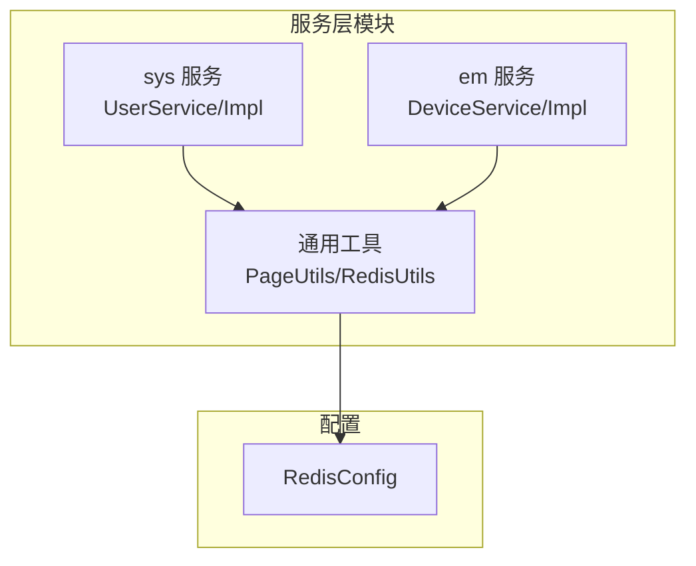
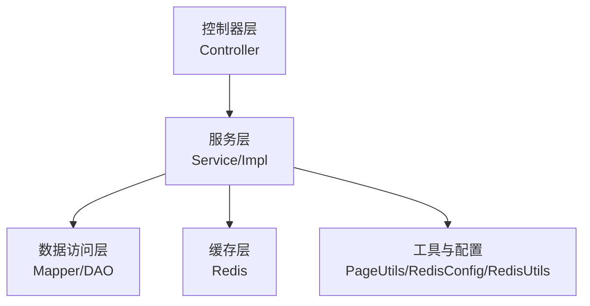
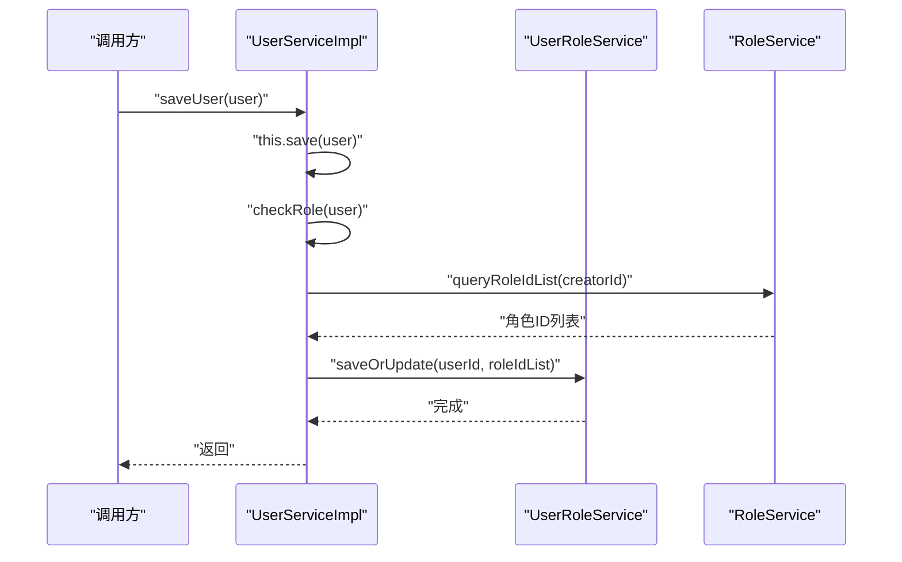
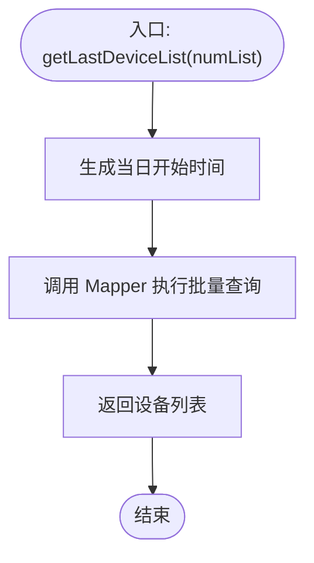
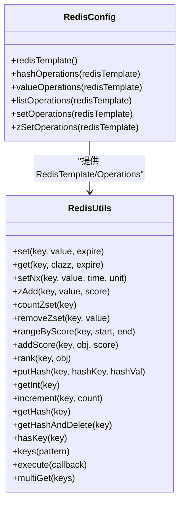
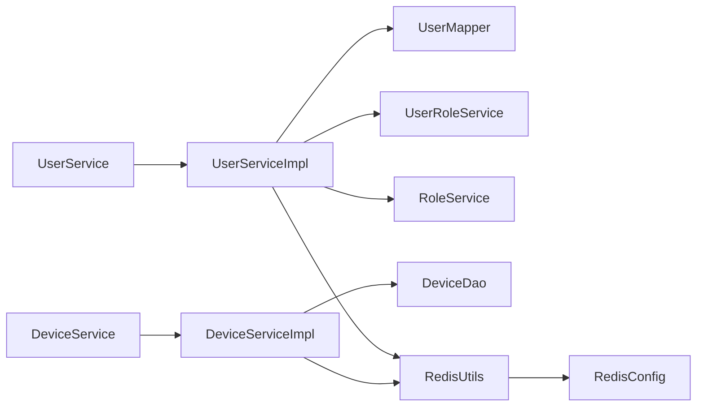

# Service层设计模式

<cite>
**本文引用的文件**
- [UserService.java](file://monkey-service/src/main/java/com/monkey/general/modules/sys/service/UserService.java)
- [UserServiceImpl.java](file://monkey-service/src/main/java/com/monkey/general/modules/sys/service/impl/UserServiceImpl.java)
- [DeviceService.java](file://monkey-service/src/main/java/com/monkey/general/modules/em/service/DeviceService.java)
- [DeviceServiceImpl.java](file://monkey-service/src/main/java/com/monkey/general/modules/em/service/impl/DeviceServiceImpl.java)
- [RedisUtils.java](file://monkey-service/src/main/java/com/monkey/general/common/utils/RedisUtils.java)
- [RedisConfig.java](file://monkey-service/src/main/java/com/monkey/general/config/RedisConfig.java)
- [PageUtils.java](file://monkey-service/src/main/java/com/monkey/general/common/utils/PageUtils.java)
- [MonkeyCustomException.java](file://monkey-common/src/main/java/com/monkey/general/common/exception/MonkeyCustomException.java)
- [CommonConstants.java](file://monkey-common/src/main/java/com/monkey/general/common/constant/CommonConstants.java)
</cite>

## 目录
1. [引言](#引言)
2. [项目结构](#项目结构)
3. [核心组件](#核心组件)
4. [架构总览](#架构总览)
5. [详细组件分析](#详细组件分析)
6. [依赖分析](#依赖分析)
7. [性能考虑](#性能考虑)
8. [故障排查指南](#故障排查指南)
9. [结论](#结论)
10. [附录](#附录)

## 引言
本文件面向安威 fireworks 物联网监控平台的 Service 层，系统化阐述通用 Service 接口设计、ServiceImpl 实现模式、复杂业务逻辑封装、批量与异步处理、异常与错误码、缓存策略（Redis）、单元测试与 Mock 数据准备，以及性能优化最佳实践。内容以实际源码为依据，辅以可视化图示帮助不同背景读者理解。

## 项目结构
Service 层主要位于 monkey-service 模块，采用按领域分包的组织方式（如 sys、em），每个领域包含 entity、mapper、dto、service 及其 impl。公共能力集中在 common 子包，如分页工具、Redis 工具、配置等。

**图表来源**
- [UserService.java:16-69](file://monkey-service/src/main/java/com/monkey/general/modules/sys/service/UserService.java#L16-L69)
- [UserServiceImpl.java:34-159](file://monkey-service/src/main/java/com/monkey/general/modules/sys/service/impl/UserServiceImpl.java#L34-L159)
- [DeviceService.java:13-18](file://monkey-service/src/main/java/com/monkey/general/modules/em/service/DeviceService.java#L13-L18)
- [DeviceServiceImpl.java:27-42](file://monkey-service/src/main/java/com/monkey/general/modules/em/service/impl/DeviceServiceImpl.java#L27-L42)
- [RedisConfig.java:16-56](file://monkey-service/src/main/java/com/monkey/general/config/RedisConfig.java#L16-L56)

**章节来源**
- [UserService.java:1-70](file://monkey-service/src/main/java/com/monkey/general/modules/sys/service/UserService.java#L1-L70)
- [DeviceService.java:1-20](file://monkey-service/src/main/java/com/monkey/general/modules/em/service/DeviceService.java#L1-L20)

## 核心组件
- 通用 Service 接口设计
  - 基于 MyBatis-Plus 的 IService 泛型接口扩展，统一 CRUD 抽象，便于复用分页、条件构造器等能力。
  - 在通用 CRUD 之上，补充业务方法签名，如分页查询、权限查询、角色菜单查询、用户密码修改等。
- ServiceImpl 实现模式
  - 继承 ServiceImpl<M, E>，直接获得基础 CRUD 能力；通过注入 Mapper 或自定义 DAO 完成数据访问。
  - 将业务逻辑封装在 Service 层，事务边界明确，典型场景包括用户新增/更新时的角色校验与关联关系维护。
- 复杂业务逻辑
  - 多表操作：用户与角色关联表的保存/更新/删除。
  - 数据校验：角色越权校验、参数非空与格式校验。
  - 业务规则：超级管理员豁免、角色创建者与使用者一致性约束。
- 批量与异步
  - 批量导入/处理：可结合分页与批处理框架（如 XXL-Job）实现定时批量任务。
  - 异步处理：通过异步配置与线程池隔离耗时任务，避免阻塞主流程。
- 缓存策略
  - 使用 Redis 工具类进行对象序列化存储、有序集合计分、哈希读取与扫描、批量获取等。
  - 通过配置类区分 RedisTemplate，确保序列化策略一致。
- 异常与错误码
  - 自定义异常类集中抛出业务异常，配合统一响应体与错误码常量，便于前端与日志定位问题。
- 单元测试与 Mock
  - 建议使用 Mockito 注入 Mock Mapper/DAO，构造最小化测试集，覆盖正常路径与边界条件。

**章节来源**
- [UserService.java:16-69](file://monkey-service/src/main/java/com/monkey/general/modules/sys/service/UserService.java#L16-L69)
- [UserServiceImpl.java:34-159](file://monkey-service/src/main/java/com/monkey/general/modules/sys/service/impl/UserServiceImpl.java#L34-L159)
- [DeviceService.java:13-18](file://monkey-service/src/main/java/com/monkey/general/modules/em/service/DeviceService.java#L13-L18)
- [DeviceServiceImpl.java:27-42](file://monkey-service/src/main/java/com/monkey/general/modules/em/service/impl/DeviceServiceImpl.java#L27-L42)
- [RedisUtils.java:18-304](file://monkey-service/src/main/java/com/monkey/general/common/utils/RedisUtils.java#L18-L304)
- [RedisConfig.java:16-56](file://monkey-service/src/main/java/com/monkey/general/config/RedisConfig.java#L16-L56)
- [PageUtils.java:13-102](file://monkey-service/src/main/java/com/monkey/general/common/utils/PageUtils.java#L13-L102)
- [MonkeyCustomException.java](file://monkey-common/src/main/java/com/monkey/general/common/exception/MonkeyCustomException.java)
- [CommonConstants.java](file://monkey-common/src/main/java/com/monkey/general/common/constant/CommonConstants.java)

## 架构总览
Service 层位于 Controller 与 Mapper 之间，承担业务编排、事务控制、缓存与校验职责。Redis 作为缓存中间件，提供高性能读写与有序集合等高级能力。

**图表来源**
- [UserServiceImpl.java:34-159](file://monkey-service/src/main/java/com/monkey/general/modules/sys/service/impl/UserServiceImpl.java#L34-L159)
- [DeviceServiceImpl.java:27-42](file://monkey-service/src/main/java/com/monkey/general/modules/em/service/impl/DeviceServiceImpl.java#L27-L42)
- [RedisUtils.java:18-304](file://monkey-service/src/main/java/com/monkey/general/common/utils/RedisUtils.java#L18-L304)
- [RedisConfig.java:16-56](file://monkey-service/src/main/java/com/monkey/general/config/RedisConfig.java#L16-L56)
- [PageUtils.java:13-102](file://monkey-service/src/main/java/com/monkey/general/common/utils/PageUtils.java#L13-L102)

## 详细组件分析

### 用户服务（UserService/Impl）
- 接口职责
  - 扩展通用 CRUD，提供分页查询、权限与菜单查询、按用户名查询、密码修改、销售员列表与角色 ID 查询等。
- 实现要点
  - 继承 ServiceImpl，直接获得分页与条件构造器能力。
  - 事务注解包裹用户新增/更新，先保存用户，再进行角色越权校验，最后维护用户-角色关联。
  - 删除用户时同步清理关联关系，保证数据一致性。
- 关键流程（新增用户）

**图表来源**
- [UserServiceImpl.java:70-95](file://monkey-service/src/main/java/com/monkey/general/modules/sys/service/impl/UserServiceImpl.java#L70-L95)
- [UserServiceImpl.java:142-158](file://monkey-service/src/main/java/com/monkey/general/modules/sys/service/impl/UserServiceImpl.java#L142-L158)

**章节来源**
- [UserService.java:16-69](file://monkey-service/src/main/java/com/monkey/general/modules/sys/service/UserService.java#L16-L69)
- [UserServiceImpl.java:34-159](file://monkey-service/src/main/java/com/monkey/general/modules/sys/service/impl/UserServiceImpl.java#L34-L159)

### 设备服务（DeviceService/Impl）
- 接口职责
  - 提供设备分页查询与“最近设备列表”查询（基于日期与编号列表）。
- 实现要点
  - 继承 ServiceImpl，直接使用分页与条件构造器。
  - 最近列表查询通过 Mapper 执行带日期过滤的批量查询。
- 关键流程（最近设备列表）

**图表来源**
- [DeviceServiceImpl.java:38-41](file://monkey-service/src/main/java/com/monkey/general/modules/em/service/impl/DeviceServiceImpl.java#L38-L41)

**章节来源**
- [DeviceService.java:13-18](file://monkey-service/src/main/java/com/monkey/general/modules/em/service/DeviceService.java#L13-L18)
- [DeviceServiceImpl.java:27-42](file://monkey-service/src/main/java/com/monkey/general/modules/em/service/impl/DeviceServiceImpl.java#L27-L42)

### 缓存工具与配置（RedisUtils/RedisConfig）
- RedisConfig
  - 定义专用 RedisTemplate（字符串序列化），并暴露多种 Operations Bean（Value/Hash/List/Set/ZSet）。
- RedisUtils
  - 提供对象序列化存储、过期设置、分布式锁（setIfAbsent）、有序集合增删改查、哈希读取与扫描、批量获取等。
  - 支持默认过期时间与永不过期策略。
- 应用建议
  - 读多写少场景优先命中缓存；写后失效或延迟更新；对热点数据设置合理 TTL。
  - 使用有序集合进行计分与排行，适合统计类场景。

**图表来源**
- [RedisConfig.java:16-56](file://monkey-service/src/main/java/com/monkey/general/config/RedisConfig.java#L16-L56)
- [RedisUtils.java:18-304](file://monkey-service/src/main/java/com/monkey/general/common/utils/RedisUtils.java#L18-L304)

**章节来源**
- [RedisConfig.java:16-56](file://monkey-service/src/main/java/com/monkey/general/config/RedisConfig.java#L16-L56)
- [RedisUtils.java:18-304](file://monkey-service/src/main/java/com/monkey/general/common/utils/RedisUtils.java#L18-L304)

### 分页工具（PageUtils）
- 作用
  - 将 MyBatis-Plus 的 IPage 转换为对外统一的分页结果对象，包含总记录数、页大小、总页数、当前页与列表数据。
- 使用
  - Service 中直接将 IPage 传入构造函数，即可得到标准分页对象返回给上层。

**章节来源**
- [PageUtils.java:13-102](file://monkey-service/src/main/java/com/monkey/general/common/utils/PageUtils.java#L13-L102)

## 依赖分析
- 组件耦合
  - ServiceImpl 依赖 Mapper/DAO 与其它 Service（如 UserRoleService、RoleService），体现领域内协作。
  - RedisUtils 依赖 RedisTemplate 与 Operations，通过配置类注入，降低耦合度。
- 外部依赖
  - MyBatis-Plus 提供分页与条件构造器能力。
  - Spring Data Redis 提供 Redis 操作支持。
- 循环依赖规避
  - 通过接口与依赖注入，避免 Impl 之间的直接循环引用；跨领域调用通过 Service 接口解耦。

**图表来源**
- [UserServiceImpl.java:34-159](file://monkey-service/src/main/java/com/monkey/general/modules/sys/service/impl/UserServiceImpl.java#L34-L159)
- [DeviceServiceImpl.java:27-42](file://monkey-service/src/main/java/com/monkey/general/modules/em/service/impl/DeviceServiceImpl.java#L27-L42)
- [RedisUtils.java:18-304](file://monkey-service/src/main/java/com/monkey/general/common/utils/RedisUtils.java#L18-L304)
- [RedisConfig.java:16-56](file://monkey-service/src/main/java/com/monkey/general/config/RedisConfig.java#L16-L56)

**章节来源**
- [UserServiceImpl.java:34-159](file://monkey-service/src/main/java/com/monkey/general/modules/sys/service/impl/UserServiceImpl.java#L34-L159)
- [DeviceServiceImpl.java:27-42](file://monkey-service/src/main/java/com/monkey/general/modules/em/service/impl/DeviceServiceImpl.java#L27-L42)
- [RedisUtils.java:18-304](file://monkey-service/src/main/java/com/monkey/general/common/utils/RedisUtils.java#L18-L304)
- [RedisConfig.java:16-56](file://monkey-service/src/main/java/com/monkey/general/config/RedisConfig.java#L16-L56)

## 性能考虑
- 读写分离与缓存
  - 对高频查询使用 Redis 缓存，设置合理 TTL；写后失效或延迟更新，避免脏读。
  - 对热点数据采用预热策略，减少冷启动抖动。
- 分页与批量
  - 使用 PageUtils 与 IPage，避免一次性加载全量数据；批量处理结合批大小与并发度。
- 事务与锁
  - 事务范围最小化，避免长事务持有数据库锁；分布式锁使用 RedisUtils 的 setIfAbsent，设置超时避免死锁。
- 异步与限流
  - 耗时任务异步化，结合线程池与队列；对外接口限流保护下游。
- 序列化与网络
  - Redis 使用字符串序列化，减少序列化开销；批量获取使用 multiGet 降低 RTT。

[本节为通用指导，无需列出章节来源]

## 故障排查指南
- 常见异常
  - 角色越权：当新增用户的角色不在创建者拥有的角色范围内时，抛出自定义异常，需检查角色授权链路。
  - 参数校验失败：用户名为空、角色列表为空等，需在 Controller 层前置校验并返回明确错误信息。
- 错误码与响应
  - 使用统一异常与错误码常量，便于前端识别与日志追踪。
- 缓存问题
  - 缓存未命中：确认 key 命中与 TTL 设置；缓存击穿：使用互斥锁或热点预热。
  - 缓存雪崩：设置随机 TTL；缓存穿透：布隆过滤器或空值缓存。
- 事务回滚
  - 确认异常类型与传播行为；必要时自定义异常触发回滚。

**章节来源**
- [UserServiceImpl.java:142-158](file://monkey-service/src/main/java/com/monkey/general/modules/sys/service/impl/UserServiceImpl.java#L142-L158)
- [MonkeyCustomException.java](file://monkey-common/src/main/java/com/monkey/general/common/exception/MonkeyCustomException.java)
- [CommonConstants.java](file://monkey-common/src/main/java/com/monkey/general/common/constant/CommonConstants.java)

## 结论
本设计以 MyBatis-Plus 为基础，Service 接口抽象 CRUD 并扩展业务方法，ServiceImpl 负责事务与业务编排，Redis 工具与配置提供高性能缓存能力。通过清晰的分层与接口契约，既保证了可维护性，也为后续的批量与异步处理、缓存治理与性能优化打下坚实基础。

[本节为总结性内容，无需列出章节来源]

## 附录

### Service 层异常处理与错误码设计
- 自定义异常类集中抛出业务异常，便于统一拦截与转换。
- 错误码常量集中管理，确保前后端一致。

**章节来源**
- [MonkeyCustomException.java](file://monkey-common/src/main/java/com/monkey/general/common/exception/MonkeyCustomException.java)
- [CommonConstants.java](file://monkey-common/src/main/java/com/monkey/general/common/constant/CommonConstants.java)

### 缓存策略与更新策略
- 写后失效：写入数据库后删除缓存，下次读取重建。
- 懒加载：读取缺失时重建缓存，适用于低频数据。
- 预热：启动或定时任务预热热点数据。
- TTL：为不同数据设置差异化过期时间，平衡一致性与性能。

**章节来源**
- [RedisUtils.java:18-304](file://monkey-service/src/main/java/com/monkey/general/common/utils/RedisUtils.java#L18-L304)
- [RedisConfig.java:16-56](file://monkey-service/src/main/java/com/monkey/general/config/RedisConfig.java#L16-L56)

### 单元测试与 Mock 数据准备
- 测试建议
  - 使用 Mockito 注入 Mock Mapper/DAO，构造最小化测试集。
  - 覆盖正常路径、边界条件与异常分支。
  - 对涉及缓存的方法，分别测试缓存命中与未命中场景。
- 示例思路
  - 用户新增：构造用户实体与角色列表，验证保存与关联关系维护。
  - 设备查询：构造分页参数与编号列表，验证分页与最近列表查询。

[本节为通用指导，无需列出章节来源]