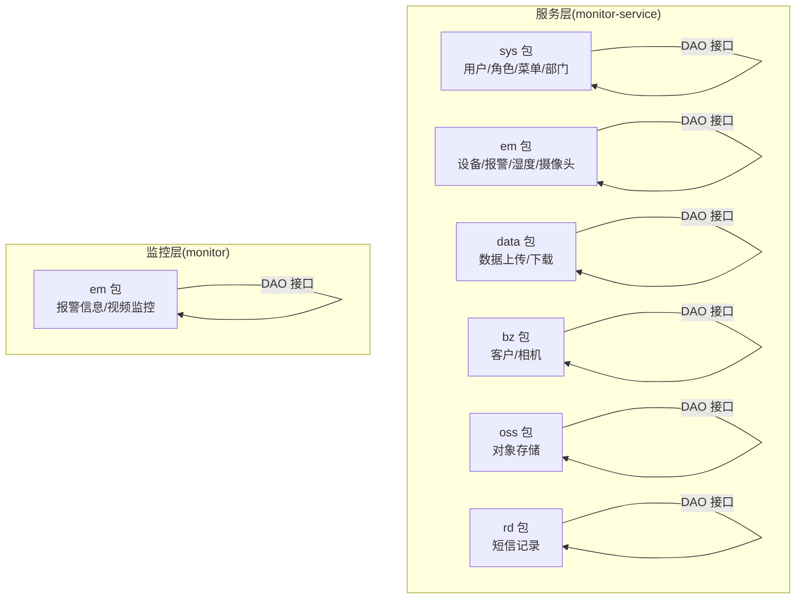
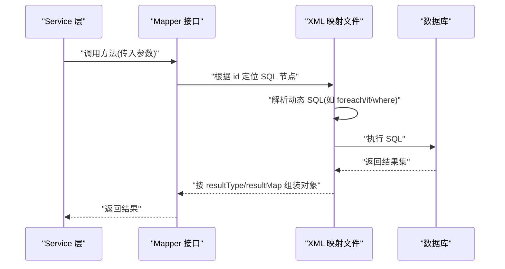
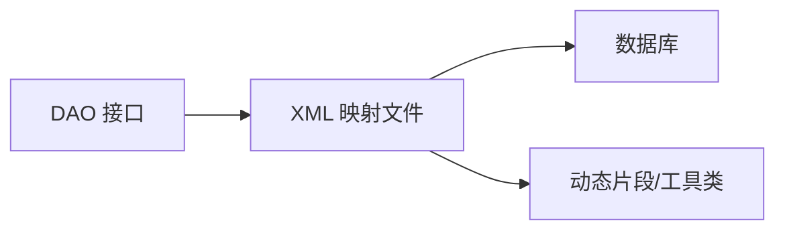

# XML映射文件设计

<cite>
**本文引用的文件**
- [DeviceDao.xml](file://monkey-service/src/main/resources/mapper/em/DeviceDao.xml)
- [UserMapper.xml](file://monkey-service/src/main/resources/mapper/sys/UserMapper.xml)
- [RoleMapper.xml](file://monkey-service/src/main/resources/mapper/sys/RoleMapper.xml)
- [MenuMapper.xml](file://monkey-service/src/main/resources/mapper/sys/MenuMapper.xml)
- [DeviceCategoryDao.xml](file://monkey-service/src/main/resources/mapper/em/DeviceCategoryDao.xml)
- [DeviceModelDao.xml](file://monkey-service/src/main/resources/mapper/em/DeviceModelDao.xml)
- [AlramInfoMapper.xml](file://monkey-monitor/src/main/resources/mapper/em/AlramInfoMapper.xml)
- [CameraMapper.xml](file://monkey-monitor/src/main/resources/mapper/em/CameraMapper.xml)
- [HumidityMapper.xml](file://monkey-monitor/src/main/resources/mapper/em/HumidityMapper.xml)
- [DevAlarmRecDao.xml](file://monkey-service/src/main/resources/mapper/em/DevAlarmRecDao.xml)
- [CustomerMapper.xml](file://monkey-service/src/main/resources/mapper/bz/CustomerMapper.xml)
- [DataUploadMapper.xml](file://monkey-service/src/main/resources/mapper/data/DataUploadMapper.xml)
- [OssMapper.xml](file://monkey-service/src/main/resources/mapper/oss/OssMapper.xml)
- [SmsRecordMapper.xml](file://monkey-service/src/main/resources/mapper/rd/SmsRecordMapper.xml)
- [DepartmentMapper.xml](file://monkey-service/src/main/resources/mapper/sys/DepartmentMapper.xml)
</cite>

## 目录
1. [简介](#简介)
2. [项目结构](#项目结构)
3. [核心组件](#核心组件)
4. [架构总览](#架构总览)
5. [详细组件分析](#详细组件分析)
6. [依赖分析](#依赖分析)
7. [性能考虑](#性能考虑)
8. [故障排查指南](#故障排查指南)
9. [结论](#结论)
10. [附录](#附录)

## 简介
本设计文档面向安威 fireworks 物联网监控平台的 MyBatis XML 映射文件，系统性阐述命名空间与文件结构、resultMap 的使用与 id/result 字段差异、嵌套结果集处理、动态 SQL 标签实践、复杂查询构建方法（多表关联、子查询、聚合函数）、SQL 注入防护与参数绑定机制、XML 文件维护与版本管理策略，以及 SQL 性能优化与索引使用指导。文档结合仓库中现有 XML 映射文件的实际实现进行说明，帮助开发者在保持一致性的同时提升可维护性与性能。

## 项目结构
- XML 映射文件主要位于两个模块：
  - monkey-service：业务服务层相关 Mapper XML，如 sys、bz、data、oss、rd、em 等包下。
  - monkey-monitor：监控模块相关 Mapper XML，如 em 包下。
- 命名空间遵循 DAO 接口所在包路径，确保与接口一一对应。
- 多数 XML 文件采用简洁结构，仅包含必要的 namespace 与若干 SQL 节点；部分文件包含动态 SQL 片段占位符，便于上层传入自定义条件。

**章节来源**
- [UserMapper.xml:1-42](file://monkey-service/src/main/resources/mapper/sys/UserMapper.xml#L1-L42)
- [AlramInfoMapper.xml:1-102](file://monkey-monitor/src/main/resources/mapper/em/AlramInfoMapper.xml#L1-L102)

## 核心组件
- 命名空间(namespace)：统一采用 DAO 接口全限定类名，确保 MyBatis 能正确解析 SQL 节点与 Java 类型映射关系。
- SQL 节点：常用 select/update/delete/insert，配合 resultType/resultMap 指定返回类型。
- 动态 SQL：广泛使用 foreach、where、trim、set、if、choose/when/otherwise 等标签实现灵活查询与更新。
- 自定义 SQL 片段：通过 ${ew.customSqlSegment} 占位符接收上层传入的条件片段，增强复用性与灵活性。

示例参考：
- [DeviceDao.xml:4-16](file://monkey-service/src/main/resources/mapper/em/DeviceDao.xml#L4-L16)
- [UserMapper.xml:25-40](file://monkey-service/src/main/resources/mapper/sys/UserMapper.xml#L25-L40)
- [DeviceCategoryDao.xml:6-17](file://monkey-service/src/main/resources/mapper/em/DeviceCategoryDao.xml#L6-L17)
- [AlramInfoMapper.xml:14-27](file://monkey-monitor/src/main/resources/mapper/em/AlramInfoMapper.xml#L14-L27)

**章节来源**
- [DeviceDao.xml:1-18](file://monkey-service/src/main/resources/mapper/em/DeviceDao.xml#L1-L18)
- [DeviceCategoryDao.xml:1-18](file://monkey-service/src/main/resources/mapper/em/DeviceCategoryDao.xml#L1-L18)
- [AlramInfoMapper.xml:1-102](file://monkey-monitor/src/main/resources/mapper/em/AlramInfoMapper.xml#L1-L102)

## 架构总览
XML 映射文件作为 MyBatis 的契约层，向上承接 Service 层调用，向下对接数据库。其关键交互如下：

**图示来源**
- [DeviceDao.xml:5-16](file://monkey-service/src/main/resources/mapper/em/DeviceDao.xml#L5-L16)
- [UserMapper.xml:11-16](file://monkey-service/src/main/resources/mapper/sys/UserMapper.xml#L11-L16)
- [AlramInfoMapper.xml:14-27](file://monkey-monitor/src/main/resources/mapper/em/AlramInfoMapper.xml#L14-L27)

## 详细组件分析

### 命名规范与文件结构
- 命名空间(namespace)：与 DAO 接口全限定类名一致，例如 com.monkey.general.modules.em.dao.DeviceDao。
- 文件命名：通常与 DAO 接口同名且位于 resources/mapper 下，如 DeviceDao.xml。
- 结构规范：
  - 必须声明 DOCTYPE 与 mapper 根节点。
  - 使用 namespace 对应 DAO 接口。
  - SQL 节点使用 id 唯一标识，resultType 指向实体或基本类型，resultMap 指向自定义映射。
  - 可选引入 sql 片段，供多处复用。

示例参考：
- [DeviceDao.xml:4](file://monkey-service/src/main/resources/mapper/em/DeviceDao.xml#L4)
- [UserMapper.xml:4](file://monkey-service/src/main/resources/mapper/sys/UserMapper.xml#L4)
- [AlramInfoMapper.xml:4](file://monkey-monitor/src/main/resources/mapper/em/AlramInfoMapper.xml#L4)

**章节来源**
- [DeviceDao.xml:1-18](file://monkey-service/src/main/resources/mapper/em/DeviceDao.xml#L1-L18)
- [UserMapper.xml:1-42](file://monkey-service/src/main/resources/mapper/sys/UserMapper.xml#L1-L42)
- [AlramInfoMapper.xml:1-102](file://monkey-monitor/src/main/resources/mapper/em/AlramInfoMapper.xml#L1-L102)

### resultMap 使用与 id/result 字段
- id 字段：用于标识主键或唯一键，MyBatis 在二级缓存与结果集去重时会优先使用 id 字段。
- result 字段：用于普通属性映射，不参与唯一性判断。
- 嵌套结果集：可通过 association 或 collection 实现一对一/一对多映射；若 XML 中未显式定义 resultMap，则通常使用 resultType 配合列别名完成简单映射。

示例参考：
- [AlramInfoMapper.xml:14-27](file://monkey-monitor/src/main/resources/mapper/em/AlramInfoMapper.xml#L14-L27) 使用 resultType 映射复杂联表查询结果。
- [DeviceCategoryDao.xml:6-10](file://monkey-service/src/main/resources/mapper/em/DeviceCategoryDao.xml#L6-L10) 通过列别名与 ${ew.customSqlSegment} 实现视图化查询。

**章节来源**
- [AlramInfoMapper.xml:14-27](file://monkey-monitor/src/main/resources/mapper/em/AlramInfoMapper.xml#L14-L27)
- [DeviceCategoryDao.xml:6-17](file://monkey-service/src/main/resources/mapper/em/DeviceCategoryDao.xml#L6-L17)

### 动态 SQL 标签实践
- 条件过滤：if、where、trim、set。
- 列表/数组：foreach。
- 分支选择：choose/when/otherwise。
- 示例要点：
  - foreach：支持 collection、item、open/close、separator 等属性，常用于 in 子句或批量参数。
  - where：自动处理前置 and/or，避免多余的 where 关键字。
  - trim：自定义前缀/后缀与去除多余字符。
  - set：动态更新字段，自动去除尾部逗号。

示例参考：
- [DeviceDao.xml:11-13](file://monkey-service/src/main/resources/mapper/em/DeviceDao.xml#L11-L13) in 子句与分组聚合。
- [UserMapper.xml:37-39](file://monkey-service/src/main/resources/mapper/sys/UserMapper.xml#L37-L39) 数组 in 子句。
- [AlramInfoMapper.xml:8-11](file://monkey-monitor/src/main/resources/mapper/em/AlramInfoMapper.xml#L8-L11) 批量更新 in 列表。

**章节来源**
- [DeviceDao.xml:5-16](file://monkey-service/src/main/resources/mapper/em/DeviceDao.xml#L5-L16)
- [UserMapper.xml:25-40](file://monkey-service/src/main/resources/mapper/sys/UserMapper.xml#L25-L40)
- [AlramInfoMapper.xml:5-12](file://monkey-monitor/src/main/resources/mapper/em/AlramInfoMapper.xml#L5-L12)

### 复杂查询构建方法
- 多表关联：LEFT JOIN/INNER JOIN，配合列别名与表前缀避免歧义。
- 子查询：在 where/from/select 中嵌套子查询，常用于去重、统计或范围限定。
- 聚合函数：COUNT、GROUP BY、CASE WHEN、COALESCE 等，用于统计与分类汇总。
- 自定义条件片段：${ew.customSqlSegment} 接收上层传入的 where/orderBy 等片段，提升复用性。

示例参考：
- [AlramInfoMapper.xml:30-58](file://monkey-monitor/src/main/resources/mapper/em/AlramInfoMapper.xml#L30-L58) 联合子查询与 CASE WHEN 统计。
- [AlramInfoMapper.xml:60-82](file://monkey-monitor/src/main/resources/mapper/em/AlramInfoMapper.xml#L60-L82) 视频监控与时间区间过滤。
- [DeviceCategoryDao.xml:7-10](file://monkey-service/src/main/resources/mapper/em/DeviceCategoryDao.xml#L7-L10) 三表关联与自定义片段。
- [HumidityMapper.xml:14-22](file://monkey-monitor/src/main/resources/mapper/em/HumidityMapper.xml#L14-L22) 子查询取每小时最后一条记录。

**章节来源**
- [AlramInfoMapper.xml:30-82](file://monkey-monitor/src/main/resources/mapper/em/AlramInfoMapper.xml#L30-L82)
- [DeviceCategoryDao.xml:6-17](file://monkey-service/src/main/resources/mapper/em/DeviceCategoryDao.xml#L6-L17)
- [HumidityMapper.xml:14-22](file://monkey-monitor/src/main/resources/mapper/em/HumidityMapper.xml#L14-L22)

### SQL 注入防护与参数绑定机制
- 参数绑定：使用 #{} 进行预编译绑定，避免字符串拼接导致的注入风险。
- 动态片段：${ew.customSqlSegment} 由上层构造并校验，不应直接拼接不可信输入；建议对传入值做白名单/范围限制。
- 建议实践：
  - 优先使用 #{} 绑定参数。
  - 对于排序/表名/列名等动态元素，严格限制枚举或白名单。
  - 使用 trim/where/set 等标签避免手写 and/or 导致的注入与语法错误。

示例参考：
- [DeviceDao.xml:9-10](file://monkey-service/src/main/resources/mapper/em/DeviceDao.xml#L9-L10) 使用 #{} 绑定日期与集合。
- [AlramInfoMapper.xml:53](file://monkey-monitor/src/main/resources/mapper/em/AlramInfoMapper.xml#L53) 使用 #{} 绑定公司编码。

**章节来源**
- [DeviceDao.xml:5-16](file://monkey-service/src/main/resources/mapper/em/DeviceDao.xml#L5-L16)
- [AlramInfoMapper.xml:50-58](file://monkey-monitor/src/main/resources/mapper/em/AlramInfoMapper.xml#L50-L58)

### XML 文件维护与版本管理策略
- 命名与组织：文件名与 DAO 接口同名，放置于 resources/mapper 下对应包；命名空间与接口全限定类名一致。
- 变更流程：
  - 新增/修改 SQL：先在本地验证语法与性能，再提交 PR。
  - 动态片段：明确约定 ${ew.customSqlSegment} 的格式与可接受范围，避免破坏性变更。
  - 兼容性：尽量不删除旧 id，新增 id 并在上层切换调用。
- 版本控制：每次提交记录变更目的、影响范围与测试结果；对涉及性能的关键 SQL 增加基准测试说明。

（本节为通用实践建议，不直接分析具体文件）

## 依赖分析
- 组件耦合：
  - XML 映射文件与 DAO 接口强耦合，需保证命名空间与接口一致。
  - 多表查询依赖表间外键关系与索引设计，否则易出现全表扫描。
- 外部依赖：
  - MyBatis 版本与方言特性会影响动态 SQL 行为。
  - 数据库驱动与连接池配置影响 SQL 执行效率与稳定性。

（本图为概念示意，不直接对应具体源码文件）

## 性能考虑
- 索引使用：
  - where 条件列、join 关联列、排序列、分组列建议建立合适索引。
  - 避免在 where 子句对列使用函数或隐式转换，防止索引失效。
- 分页与子查询：
  - 子查询去重时优先考虑使用窗口函数或临时表，减少重复扫描。
  - 大数据量分页建议基于主键 id 的游标分页，避免 deep page。
- 动态 SQL：
  - 合理使用 where/trim/set，避免生成冗余 SQL。
  - in 列表过大时考虑临时表或批处理。
- 统计与聚合：
  - 聚合查询尽量在应用层或物化视图中缓存热点数据，降低实时计算压力。

（本节为通用性能建议，不直接分析具体文件）

## 故障排查指南
- 常见问题定位：
  - SQL 语法错误：检查动态标签是否闭合、逗号与括号是否匹配。
  - 参数绑定异常：确认 #{} 与参数类型一致，避免类型转换异常。
  - 结果映射失败：核对 resultType 与列别名是否一致，必要时使用 resultMap。
  - 动态片段注入：检查 ${ew.customSqlSegment} 是否被正确构造与校验。
- 调试建议：
  - 开启 MyBatis 日志，观察最终生成 SQL。
  - 使用 EXPLAIN 分析慢查询，重点查看 key、type、rows、filtered 等指标。
  - 对大查询增加 LIMIT 与分页，逐步缩小范围。

（本节为通用排查建议，不直接分析具体文件）

## 结论
通过规范命名空间与文件结构、合理使用 resultType/resultMap、严格遵循动态 SQL 标签最佳实践、强化 SQL 注入防护与参数绑定、完善 XML 维护与版本管理策略，并结合索引与执行计划优化，可显著提升 XML 映射文件的可维护性与运行性能。建议在团队内形成统一模板与评审流程，确保跨模块一致性与可演进性。

## 附录
- 示例文件清单（含路径）：
  - [DeviceDao.xml](file://monkey-service/src/main/resources/mapper/em/DeviceDao.xml)
  - [UserMapper.xml](file://monkey-service/src/main/resources/mapper/sys/UserMapper.xml)
  - [RoleMapper.xml](file://monkey-service/src/main/resources/mapper/sys/RoleMapper.xml)
  - [MenuMapper.xml](file://monkey-service/src/main/resources/mapper/sys/MenuMapper.xml)
  - [DeviceCategoryDao.xml](file://monkey-service/src/main/resources/mapper/em/DeviceCategoryDao.xml)
  - [DeviceModelDao.xml](file://monkey-service/src/main/resources/mapper/em/DeviceModelDao.xml)
  - [AlramInfoMapper.xml](file://monkey-monitor/src/main/resources/mapper/em/AlramInfoMapper.xml)
  - [CameraMapper.xml](file://monkey-monitor/src/main/resources/mapper/em/CameraMapper.xml)
  - [HumidityMapper.xml](file://monkey-monitor/src/main/resources/mapper/em/HumidityMapper.xml)
  - [DevAlarmRecDao.xml](file://monkey-service/src/main/resources/mapper/em/DevAlarmRecDao.xml)
  - [CustomerMapper.xml](file://monkey-service/src/main/resources/mapper/bz/CustomerMapper.xml)
  - [DataUploadMapper.xml](file://monkey-service/src/main/resources/mapper/data/DataUploadMapper.xml)
  - [OssMapper.xml](file://monkey-service/src/main/resources/mapper/oss/OssMapper.xml)
  - [SmsRecordMapper.xml](file://monkey-service/src/main/resources/mapper/rd/SmsRecordMapper.xml)
  - [DepartmentMapper.xml](file://monkey-service/src/main/resources/mapper/sys/DepartmentMapper.xml)