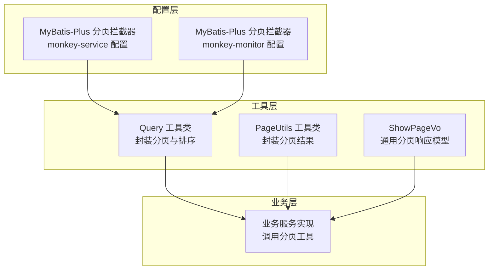
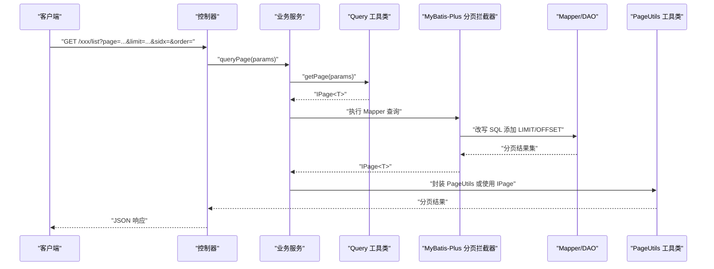
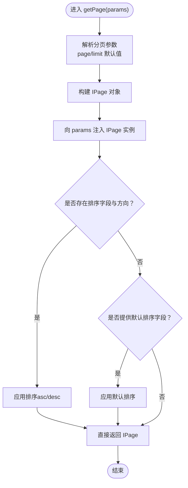
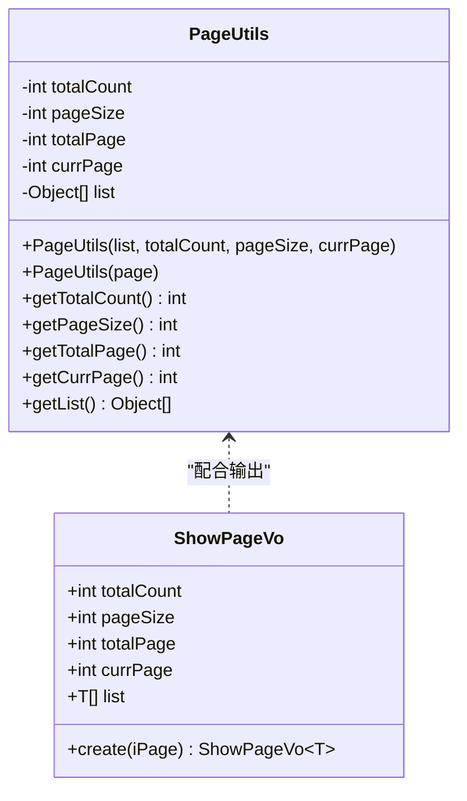
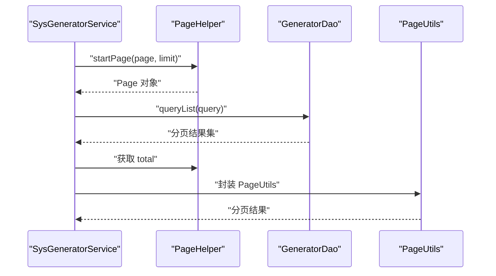
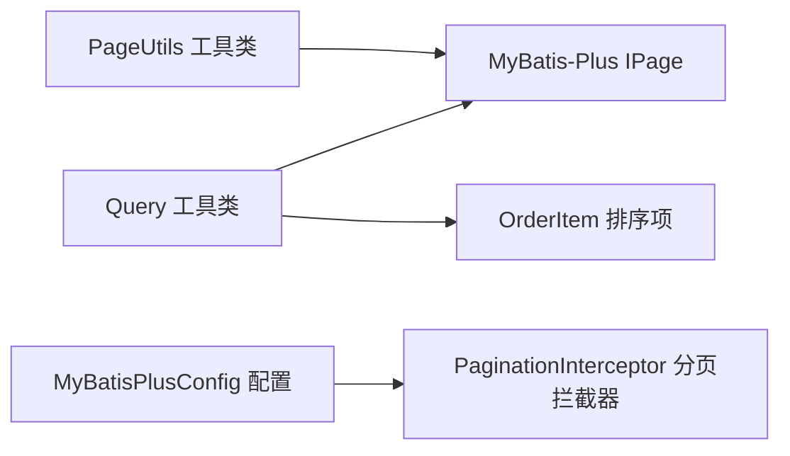

# 分页查询实现

<cite>
**本文引用的文件**
- [MybatisPlusConfig.java](file://monkey-service/src/main/java/com/monkey/general/config/MybatisPlusConfig.java)
- [MybatisPlusConfig.java](file://monkey-monitor/src/main/java/com/monkey/general/config/MybatisPlusConfig.java)
- [Query.java](file://monkey-service/src/main/java/com/monkey/general/common/utils/Query.java)
- [PageUtils.java](file://monkey-service/src/main/java/com/monkey/general/common/utils/PageUtils.java)
- [ShowPageVo.java](file://monkey-common/src/main/java/com/monkey/general/common/entity/ShowPageVo.java)
- [SysGeneratorService.java](file://monkey-code-generator/src/main/java/com/monkey/service/SysGeneratorService.java)
- [PageUtils.java](file://monkey-code-generator/src/main/java/com/monkey/utils/PageUtils.java)
- [Query.java](file://monkey-code-generator/src/main/java/com/monkey/utils/Query.java)
</cite>

## 目录
1. [简介](#简介)
2. [项目结构](#项目结构)
3. [核心组件](#核心组件)
4. [架构总览](#架构总览)
5. [详细组件分析](#详细组件分析)
6. [依赖分析](#依赖分析)
7. [性能考虑](#性能考虑)
8. [故障排查指南](#故障排查指南)
9. [结论](#结论)
10. [附录](#附录)

## 简介
本文件面向安威 fireworks 物联网监控平台，系统化阐述分页查询的实现与最佳实践，覆盖以下要点：
- PageHelper 插件在代码生成模块中的配置与使用
- Query 工具类的设计与使用：分页参数封装与排序组装
- PageUtils 分页工具的实现：结果封装与页面参数计算
- 复杂查询的分页处理：多表联查、条件过滤、排序组合
- 性能优化策略：LIMIT 优化、索引使用、查询计划分析
- 大数据量分页方案：游标分页、延迟关联分页
- 异常与边界条件处理
- 测试与性能基准测试建议

## 项目结构
分页查询能力在多个模块中协同实现：
- 配置层：MyBatis-Plus 分页拦截器在服务端配置
- 工具层：Query 封装分页与排序；PageUtils 封装分页结果
- 业务层：服务实现调用分页工具，组装响应模型
- 响应层：统一分页 VO 对象封装返回数据

图表来源
- [MybatisPlusConfig.java:18-21](file://monkey-service/src/main/java/com/monkey/general/config/MybatisPlusConfig.java#L18-L21)
- [MybatisPlusConfig.java:17-19](file://monkey-monitor/src/main/java/com/monkey/general/config/MybatisPlusConfig.java#L17-L19)
- [Query.java:18-70](file://monkey-service/src/main/java/com/monkey/general/common/utils/Query.java#L18-L70)
- [PageUtils.java:54-60](file://monkey-service/src/main/java/com/monkey/general/common/utils/PageUtils.java#L54-L60)
- [ShowPageVo.java:43-51](file://monkey-common/src/main/java/com/monkey/general/common/entity/ShowPageVo.java#L43-L51)

章节来源
- [MybatisPlusConfig.java:18-21](file://monkey-service/src/main/java/com/monkey/general/config/MybatisPlusConfig.java#L18-L21)
- [MybatisPlusConfig.java:17-19](file://monkey-monitor/src/main/java/com/monkey/general/config/MybatisPlusConfig.java#L17-L19)
- [Query.java:18-70](file://monkey-service/src/main/java/com/monkey/general/common/utils/Query.java#L18-L70)
- [PageUtils.java:54-60](file://monkey-service/src/main/java/com/monkey/general/common/utils/PageUtils.java#L54-L60)
- [ShowPageVo.java:43-51](file://monkey-common/src/main/java/com/monkey/general/common/entity/ShowPageVo.java#L43-L51)

## 核心组件
- Query 工具类：从请求参数解析分页与排序，构造 IPage 并注入排序规则，支持默认排序
- PageUtils 工具类：接收 MyBatis-Plus 的 IPage 或手动统计结果，封装分页元信息
- ShowPageVo：面向接口的分页响应模型，便于统一输出
- MyBatis-Plus 分页拦截器：在服务端启用分页能力，自动改写 SQL 以支持 LIMIT/分页

章节来源
- [Query.java:18-70](file://monkey-service/src/main/java/com/monkey/general/common/utils/Query.java#L18-L70)
- [PageUtils.java:54-60](file://monkey-service/src/main/java/com/monkey/general/common/utils/PageUtils.java#L54-L60)
- [ShowPageVo.java:43-51](file://monkey-common/src/main/java/com/monkey/general/common/entity/ShowPageVo.java#L43-L51)
- [MybatisPlusConfig.java:18-21](file://monkey-service/src/main/java/com/monkey/general/config/MybatisPlusConfig.java#L18-L21)

## 架构总览
分页查询在平台内的调用链路如下：

图表来源
- [Query.java:18-70](file://monkey-service/src/main/java/com/monkey/general/common/utils/Query.java#L18-L70)
- [MybatisPlusConfig.java:18-21](file://monkey-service/src/main/java/com/monkey/general/config/MybatisPlusConfig.java#L18-L21)
- [PageUtils.java:54-60](file://monkey-service/src/main/java/com/monkey/general/common/utils/PageUtils.java#L54-L60)

## 详细组件分析

### Query 工具类设计与使用
- 负责从请求参数中提取分页参数（页码、每页数量），构造 IPage
- 注入排序字段与方向，支持前端传参或默认排序
- 进行安全校验，避免 SQL 注入（排序字段经由 SQL 过滤器处理）

图表来源
- [Query.java:18-70](file://monkey-service/src/main/java/com/monkey/general/common/utils/Query.java#L18-L70)

章节来源
- [Query.java:18-70](file://monkey-service/src/main/java/com/monkey/general/common/utils/Query.java#L18-L70)

### PageUtils 分页工具实现
- 支持两种构造方式：基于 IPage 自动填充分页元信息；或手动传入统计总数与当前页
- 提供访问器与设置器，便于在控制器或服务层读取/修改分页状态
- 与 ShowPageVo 协作，统一对外输出格式

图表来源
- [PageUtils.java:54-60](file://monkey-service/src/main/java/com/monkey/general/common/utils/PageUtils.java#L54-L60)
- [ShowPageVo.java:43-51](file://monkey-common/src/main/java/com/monkey/general/common/entity/ShowPageVo.java#L43-L51)

章节来源
- [PageUtils.java:54-60](file://monkey-service/src/main/java/com/monkey/general/common/utils/PageUtils.java#L54-L60)
- [ShowPageVo.java:43-51](file://monkey-common/src/main/java/com/monkey/general/common/entity/ShowPageVo.java#L43-L51)

### PageHelper 插件在代码生成模块中的使用
- 在代码生成模块中引入 PageHelper，通过 startPage(page, limit) 启动分页
- 执行查询后读取 page.getTotal() 作为总记录数
- 针对 MongoDB 场景，使用工厂类获取集合总记录数

图表来源
- [SysGeneratorService.java:32-40](file://monkey-code-generator/src/main/java/com/monkey/service/SysGeneratorService.java#L32-L40)

章节来源
- [SysGeneratorService.java:32-40](file://monkey-code-generator/src/main/java/com/monkey/service/SysGeneratorService.java#L32-L40)

### 复杂查询的分页处理
- 多表联查：在 Mapper XML 中编写 JOIN 查询，结合 Query.getPage() 注入的 IPage，由分页拦截器自动改写 SQL
- 条件过滤：在 Query 中解析并注入过滤条件，确保与分页同时生效
- 排序组合：支持单字段或多字段排序，注意排序字段合法性与索引匹配

章节来源
- [Query.java:18-70](file://monkey-service/src/main/java/com/monkey/general/common/utils/Query.java#L18-L70)
- [MybatisPlusConfig.java:18-21](file://monkey-service/src/main/java/com/monkey/general/config/MybatisPlusConfig.java#L18-L21)

## 依赖分析
- Query 依赖 MyBatis-Plus 的 IPage 与 OrderItem，以及 SQL 安全校验工具
- PageUtils 依赖 IPage 以自动填充分页元信息
- MyBatis-Plus 分页拦截器在配置类中注册，全局生效

图表来源
- [Query.java:3-7](file://monkey-service/src/main/java/com/monkey/general/common/utils/Query.java#L3-L7)
- [PageUtils.java](file://monkey-service/src/main/java/com/monkey/general/common/utils/PageUtils.java#L3)
- [MybatisPlusConfig.java:18-21](file://monkey-service/src/main/java/com/monkey/general/config/MybatisPlusConfig.java#L18-L21)

章节来源
- [Query.java:3-7](file://monkey-service/src/main/java/com/monkey/general/common/utils/Query.java#L3-L7)
- [PageUtils.java](file://monkey-service/src/main/java/com/monkey/general/common/utils/PageUtils.java#L3)
- [MybatisPlusConfig.java:18-21](file://monkey-service/src/main/java/com/monkey/general/config/MybatisPlusConfig.java#L18-L21)

## 性能考虑
- LIMIT 优化
  - 使用分页拦截器自动改写 SQL，避免手写 OFFSET/LIMIT 导致的性能问题
  - 控制每页最大条数，防止超大分页导致数据库压力过大
- 索引使用
  - 排序字段尽量命中索引，避免排序导致的临时表与文件排序
  - 复合过滤条件优先使用最左前缀索引，减少全表扫描
- 查询计划分析
  - 使用 EXPLAIN 分析慢查询，关注 rows、Extra 字段，定位性能瓶颈
  - 对高频分页查询建立合适的索引与物化视图
- 大数据量分页
  - 游标分页：基于上次查询的最大主键游标进行下一页查询，避免深层偏移
  - 延迟关联分页：先查出主表 ID 列表，再回表关联，降低 JOIN 数据量
  - 增量分页：按时间或自增字段分段，提升稳定性与可预测性

## 故障排查指南
- 参数非法
  - 页码或每页数量为空时采用默认值，但需限制最大值，防止内存溢出
- 排序注入
  - Query 对排序字段进行安全过滤，确保仅允许白名单字段参与排序
- 总数不准确
  - MongoDB 等场景需单独统计总记录数，避免 count(*) 性能问题
- 响应格式不一致
  - 统一使用 ShowPageVo 或 PageUtils 输出，避免业务层重复封装

章节来源
- [Query.java:18-70](file://monkey-service/src/main/java/com/monkey/general/common/utils/Query.java#L18-L70)
- [SysGeneratorService.java:32-40](file://monkey-code-generator/src/main/java/com/monkey/service/SysGeneratorService.java#L32-L40)
- [ShowPageVo.java:43-51](file://monkey-common/src/main/java/com/monkey/general/common/entity/ShowPageVo.java#L43-L51)

## 结论
本项目通过 MyBatis-Plus 分页拦截器与 Query/PageUtils 工具类，实现了标准化、可复用的分页查询能力。在复杂查询与大数据量场景下，建议结合索引优化、查询计划分析与游标/延迟关联等策略，持续提升分页性能与稳定性。

## 附录
- 测试方法
  - 单元测试：构造不同页码与每页数量，验证分页结果与总数一致性
  - 压力测试：模拟高并发分页请求，观察数据库连接池与慢查询情况
  - 回归测试：变更排序字段与过滤条件，确保分页逻辑正确
- 性能基准测试
  - 基准指标：吞吐量、P95/P99 延迟、数据库 CPU/IO 利用率
  - 变量控制：固定数据规模、逐步增大每页数量与并发线程数
  - 优化验证：对比开启/关闭索引、游标分页前后性能差异