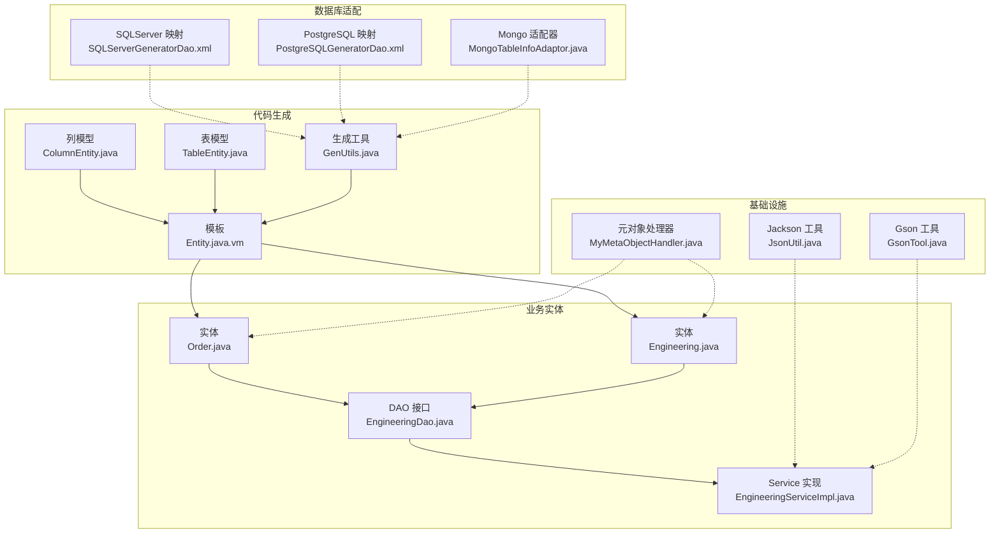
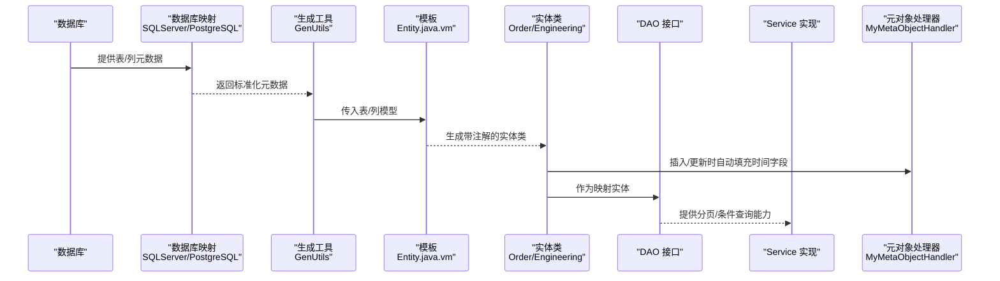
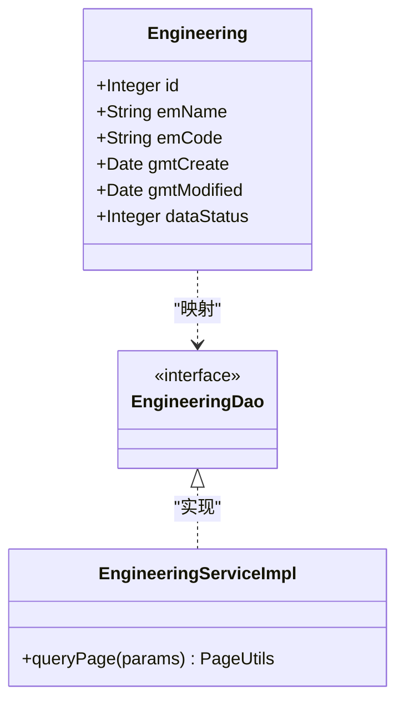
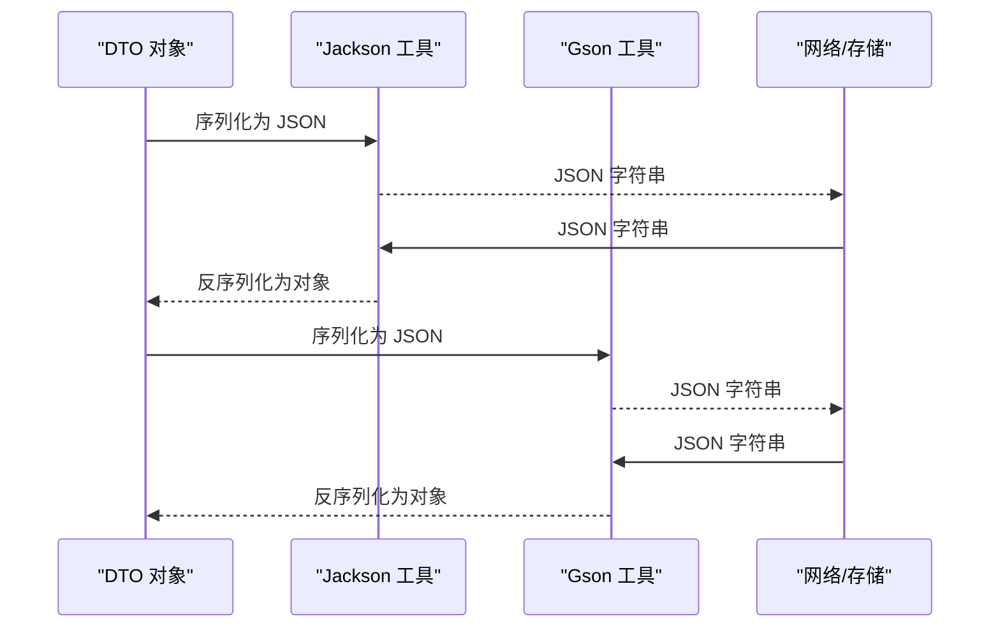
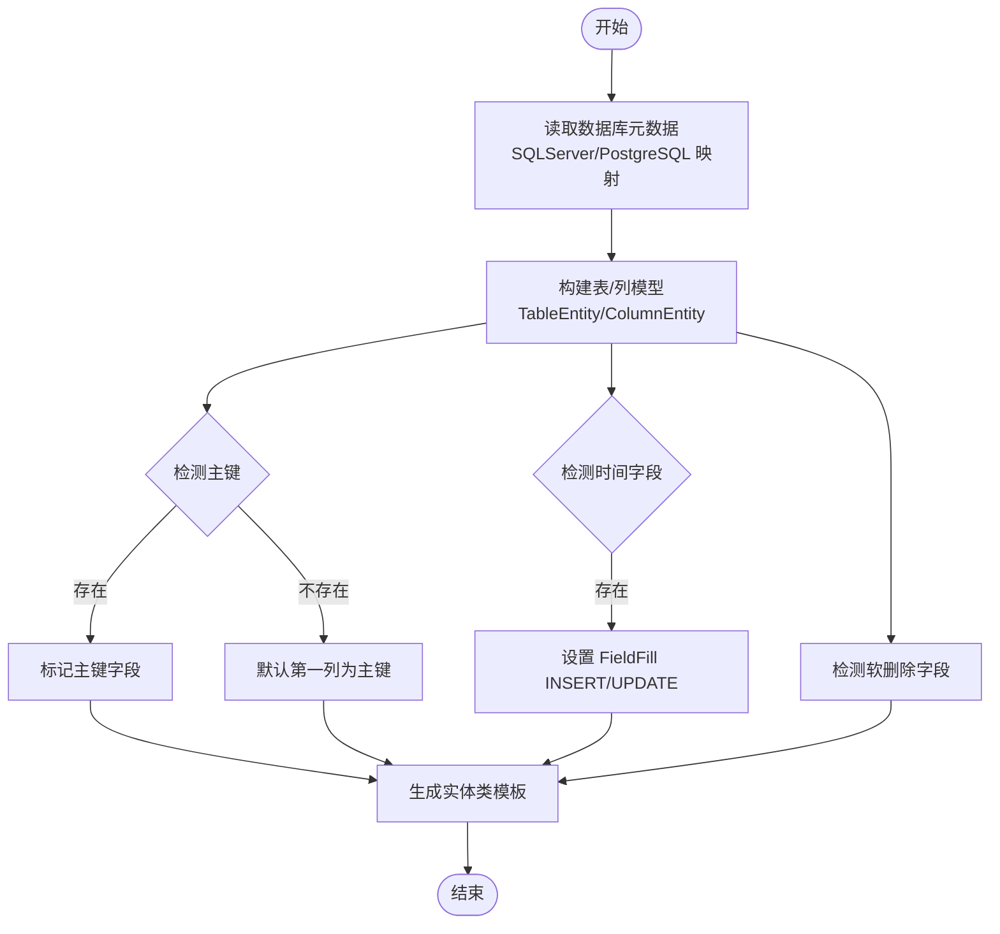
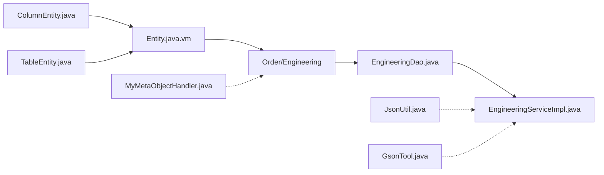

# 实体类设计规范

<cite>
**本文引用的文件**
- [Entity.java.vm](file://monkey-code-generator/src/main/resources/template/Entity.java.vm)
- [Order.java](file://monkey-service/src/main/java/com/monkey/general/modules/em/entity/Order.java)
- [Engineering.java](file://monkey-service/src/main/java/com/monkey/general/modules/em/entity/Engineering.java)
- [EngineeringDao.java](file://monkey-service/src/main/java/com/monkey/general/modules/em/dao/EngineeringDao.java)
- [EngineeringServiceImpl.java](file://monkey-service/src/main/java/com/monkey/general/modules/em/service/Impl/EngineeringServiceImpl.java)
- [MyMetaObjectHandler.java](file://monkey-service/src/main/java/com/monkey/general/handler/MyMetaObjectHandler.java)
- [TableEntity.java](file://monkey-code-generator/src/main/java/com/monkey/common/entity/TableEntity.java)
- [ColumnEntity.java](file://monkey-code-generator/src/main/java/com/monkey/common/entity/ColumnEntity.java)
- [GenUtils.java](file://monkey-code-generator/src/main/java/com/monkey/utils/GenUtils.java)
- [SQLServerGeneratorDao.xml](file://monkey-code-generator/src/main/resources/mapper/SQLServerGeneratorDao.xml)
- [PostgreSQLGeneratorDao.xml](file://monkey-code-generator/src/main/resources/mapper/PostgreSQLGeneratorDao.xml)
- [MongoTableInfoAdaptor.java](file://monkey-code-generator/src/main/java/com/monkey/adaptor/MongoTableInfoAdaptor.java)
- [JsonUtil.java](file://monkey-monitor/src/main/java/com/monkey/general/modules/third/api/util/JsonUtil.java)
- [GsonTool.java](file://xxl-job-core/src/main/java/com/xxl/job/core/util/GsonTool.java)
- [CityEventObjectDto.java](file://monkey-monitor-api/src/main/java/com/monkey/general/qst/CityEventObjectDto.java)
</cite>

## 目录
1. [引言](#引言)
2. [项目结构](#项目结构)
3. [核心组件](#核心组件)
4. [架构总览](#架构总览)
5. [详细组件分析](#详细组件分析)
6. [依赖分析](#依赖分析)
7. [性能考虑](#性能考虑)
8. [故障排查指南](#故障排查指南)
9. [结论](#结论)
10. [附录](#附录)

## 引言
本规范面向安威 fireworks 物联网监控平台的实体类设计，目标是统一实体类的命名、包结构、注解使用、字段设计、关系建模、软删除策略、序列化与反序列化以及与数据库字段的映射与命名转换规则。通过对现有代码的深入分析，提炼出一套可复用、可扩展且与 MyBatis-Plus 和代码生成模板协同工作的实体类设计标准。

## 项目结构
实体类主要分布在以下模块与路径：
- 代码生成模板与实体骨架：monkey-code-generator 模块的 Velocity 模板与通用实体模型
- 业务实体示例：monkey-service 模块下的 em 模块实体与 DAO/Service 层
- 元对象填充器：统一处理创建/更新时间字段
- JSON 序列化工具：Jackson 与 Gson 的使用示例
- 关系型数据库适配：不同数据库的列元数据查询映射
- MongoDB 适配：将非关系型结构适配为关系型实体生成所需的数据结构

图表来源
- [Entity.java.vm:1-46](file://monkey-code-generator/src/main/resources/template/Entity.java.vm#L1-L46)
- [Order.java:1-88](file://monkey-service/src/main/java/com/monkey/general/modules/em/entity/Order.java#L1-L88)
- [Engineering.java:1-69](file://monkey-service/src/main/java/com/monkey/general/modules/em/entity/Engineering.java#L1-L69)
- [EngineeringDao.java:1-13](file://monkey-service/src/main/java/com/monkey/general/modules/em/dao/EngineeringDao.java#L1-L13)
- [EngineeringServiceImpl.java:1-36](file://monkey-service/src/main/java/com/monkey/general/modules/em/service/Impl/EngineeringServiceImpl.java#L1-L36)
- [MyMetaObjectHandler.java:1-41](file://monkey-service/src/main/java/com/monkey/general/handler/MyMetaObjectHandler.java#L1-L41)
- [ColumnEntity.java:1-69](file://monkey-code-generator/src/main/java/com/monkey/common/entity/ColumnEntity.java#L1-L69)
- [TableEntity.java:1-82](file://monkey-code-generator/src/main/java/com/monkey/common/entity/TableEntity.java#L1-L82)
- [GenUtils.java:102-140](file://monkey-code-generator/src/main/java/com/monkey/utils/GenUtils.java#L102-L140)
- [SQLServerGeneratorDao.xml:1-43](file://monkey-code-generator/src/main/resources/mapper/SQLServerGeneratorDao.xml#L1-L43)
- [PostgreSQLGeneratorDao.xml:1-26](file://monkey-code-generator/src/main/resources/mapper/PostgreSQLGeneratorDao.xml#L1-L26)
- [MongoTableInfoAdaptor.java:1-44](file://monkey-code-generator/src/main/java/com/monkey/adaptor/MongoTableInfoAdaptor.java#L1-L44)
- [JsonUtil.java:1-280](file://monkey-monitor/src/main/java/com/monkey/general/modules/third/api/util/JsonUtil.java#L1-L280)
- [GsonTool.java:1-53](file://xxl-job-core/src/main/java/com/xxl/job/core/util/GsonTool.java#L1-L53)

章节来源
- [Entity.java.vm:1-46](file://monkey-code-generator/src/main/resources/template/Entity.java.vm#L1-L46)
- [Order.java:1-88](file://monkey-service/src/main/java/com/monkey/general/modules/em/entity/Order.java#L1-L88)
- [Engineering.java:1-69](file://monkey-service/src/main/java/com/monkey/general/modules/em/entity/Engineering.java#L1-L69)
- [EngineeringDao.java:1-13](file://monkey-service/src/main/java/com/monkey/general/modules/em/dao/EngineeringDao.java#L1-L13)
- [EngineeringServiceImpl.java:1-36](file://monkey-service/src/main/java/com/monkey/general/modules/em/service/Impl/EngineeringServiceImpl.java#L1-L36)
- [MyMetaObjectHandler.java:1-41](file://monkey-service/src/main/java/com/monkey/general/handler/MyMetaObjectHandler.java#L1-L41)
- [ColumnEntity.java:1-69](file://monkey-code-generator/src/main/java/com/monkey/common/entity/ColumnEntity.java#L1-L69)
- [TableEntity.java:1-82](file://monkey-code-generator/src/main/java/com/monkey/common/entity/TableEntity.java#L1-L82)
- [GenUtils.java:102-140](file://monkey-code-generator/src/main/java/com/monkey/utils/GenUtils.java#L102-L140)
- [SQLServerGeneratorDao.xml:1-43](file://monkey-code-generator/src/main/resources/mapper/SQLServerGeneratorDao.xml#L1-L43)
- [PostgreSQLGeneratorDao.xml:1-26](file://monkey-code-generator/src/main/resources/mapper/PostgreSQLGeneratorDao.xml#L1-L26)
- [MongoTableInfoAdaptor.java:1-44](file://monkey-code-generator/src/main/java/com/monkey/adaptor/MongoTableInfoAdaptor.java#L1-L44)
- [JsonUtil.java:1-280](file://monkey-monitor/src/main/java/com/monkey/general/modules/third/api/util/JsonUtil.java#L1-L280)
- [GsonTool.java:1-53](file://xxl-job-core/src/main/java/com/xxl/job/core/util/GsonTool.java#L1-L53)

## 核心组件
- 代码生成模板：通过 Velocity 模板 Entity.java.vm 输出实体类，自动标注表名、主键、创建/更新时间字段的填充策略，并引入 Swagger 注解。
- 实体示例：Order 与 Engineering 展示了标准字段、时间字段、状态字段的注解与命名实践。
- 元对象处理器：MyMetaObjectHandler 统一注入创建/更新时间字段，减少重复逻辑。
- 数据库适配：SQLServer 与 PostgreSQL 的 XML 映射用于读取表/列元数据，GenUtils 识别主键、创建/更新时间、软删除字段并写入表模型。
- JSON 工具：Jackson 与 Gson 工具类用于序列化与反序列化，支持复杂 DTO 的嵌套结构。

章节来源
- [Entity.java.vm:1-46](file://monkey-code-generator/src/main/resources/template/Entity.java.vm#L1-L46)
- [Order.java:1-88](file://monkey-service/src/main/java/com/monkey/general/modules/em/entity/Order.java#L1-L88)
- [Engineering.java:1-69](file://monkey-service/src/main/java/com/monkey/general/modules/em/entity/Engineering.java#L1-L69)
- [MyMetaObjectHandler.java:1-41](file://monkey-service/src/main/java/com/monkey/general/handler/MyMetaObjectHandler.java#L1-L41)
- [SQLServerGeneratorDao.xml:1-43](file://monkey-code-generator/src/main/resources/mapper/SQLServerGeneratorDao.xml#L1-L43)
- [PostgreSQLGeneratorDao.xml:1-26](file://monkey-code-generator/src/main/resources/mapper/PostgreSQLGeneratorDao.xml#L1-L26)
- [GenUtils.java:102-140](file://monkey-code-generator/src/main/java/com/monkey/utils/GenUtils.java#L102-L140)
- [JsonUtil.java:1-280](file://monkey-monitor/src/main/java/com/monkey/general/modules/third/api/util/JsonUtil.java#L1-L280)
- [GsonTool.java:1-53](file://xxl-job-core/src/main/java/com/xxl/job/core/util/GsonTool.java#L1-L53)

## 架构总览
实体类设计贯穿“模板生成—实体定义—持久层—服务层—序列化”的完整链路，确保从数据库到 Java 对象的一致映射与最佳实践。

图表来源
- [SQLServerGeneratorDao.xml:1-43](file://monkey-code-generator/src/main/resources/mapper/SQLServerGeneratorDao.xml#L1-L43)
- [PostgreSQLGeneratorDao.xml:1-26](file://monkey-code-generator/src/main/resources/mapper/PostgreSQLGeneratorDao.xml#L1-L26)
- [GenUtils.java:102-140](file://monkey-code-generator/src/main/java/com/monkey/utils/GenUtils.java#L102-L140)
- [Entity.java.vm:1-46](file://monkey-code-generator/src/main/resources/template/Entity.java.vm#L1-L46)
- [Order.java:1-88](file://monkey-service/src/main/java/com/monkey/general/modules/em/entity/Order.java#L1-L88)
- [Engineering.java:1-69](file://monkey-service/src/main/java/com/monkey/general/modules/em/entity/Engineering.java#L1-L69)
- [EngineeringDao.java:1-13](file://monkey-service/src/main/java/com/monkey/general/modules/em/dao/EngineeringDao.java#L1-L13)
- [EngineeringServiceImpl.java:1-36](file://monkey-service/src/main/java/com/monkey/general/modules/em/service/Impl/EngineeringServiceImpl.java#L1-L36)
- [MyMetaObjectHandler.java:1-41](file://monkey-service/src/main/java/com/monkey/general/handler/MyMetaObjectHandler.java#L1-L41)

## 详细组件分析

### 命名规范与包结构组织
- 包命名：遵循模块化分包，如 com.monkey.general.modules.em.entity，体现领域驱动设计；DAO 与 Service 分离在各自包下，保持层次清晰。
- 类命名：采用帕斯卡命名法，表名转驼峰后首字母大写；例如 em_order → EmOrder（模板生成会自动处理类名大小写）。
- 字段命名：优先使用驼峰命名；模板会将列名转换为属性名（首字母小写），如 gmt_create → gmtCreate。
- 文件命名：实体类与模板一一对应，便于维护与扩展。

章节来源
- [Entity.java.vm:1-46](file://monkey-code-generator/src/main/resources/template/Entity.java.vm#L1-L46)
- [Order.java:1-88](file://monkey-service/src/main/java/com/monkey/general/modules/em/entity/Order.java#L1-L88)
- [Engineering.java:1-69](file://monkey-service/src/main/java/com/monkey/general/modules/em/entity/Engineering.java#L1-L69)

### 实体类注解使用规范
- @TableName：声明实体对应的数据库表名，模板自动生成，避免硬编码差异。
- @TableId：声明主键字段，模板基于数据库主键识别自动标注。
- @TableField：声明字段映射与填充策略，如 gmt_create/gmt_modified 使用 FieldFill.INSERT/UPDATE 自动填充。
- @ApiModelProperty：Swagger 文档注解，模板自动生成字段描述。
- Lombok 注解：@Data/@ToString 简化 getter/setter/toString，提升可读性与开发效率。

章节来源
- [Entity.java.vm:22-46](file://monkey-code-generator/src/main/resources/template/Entity.java.vm#L22-L46)
- [Engineering.java:3-12](file://monkey-service/src/main/java/com/monkey/general/modules/em/entity/Engineering.java#L3-L12)
- [Order.java:3-13](file://monkey-service/src/main/java/com/monkey/general/modules/em/entity/Order.java#L3-L13)

### 字段设计原则
- 基本数据类型选择：整数型使用 Integer/Long；金额使用 BigDecimal；日期时间使用 Date；布尔使用 Boolean；文本使用 String。
- 字符串长度限制：模板未强制长度，建议在数据库层面约束并在 DTO/校验层增加长度与正则校验。
- 日期时间字段处理：统一使用 gmtCreate/gmtModified 并通过 @TableField(value = "...", fill = INSERT/UPDATE) 或 MyMetaObjectHandler 自动填充。
- 状态字段：dataStatus 用于软删除或启停控制，模板与实体示例均体现该字段的存在与使用。

章节来源
- [Order.java:9-11](file://monkey-service/src/main/java/com/monkey/general/modules/em/entity/Order.java#L9-L11)
- [Engineering.java:9-10](file://monkey-service/src/main/java/com/monkey/general/modules/em/entity/Engineering.java#L9-L10)
- [Entity.java.vm:36-42](file://monkey-code-generator/src/main/resources/template/Entity.java.vm#L36-L42)
- [MyMetaObjectHandler.java:14-40](file://monkey-service/src/main/java/com/monkey/general/handler/MyMetaObjectHandler.java#L14-L40)

### 复杂实体关系设计模式
- 一对多：通过 DAO/Service 分层与分页查询实现，示例中 EngineeringServiceImpl 使用 QueryWrapper 进行条件查询与分页。
- 多对多：建议通过中间表实现，实体类不直接持有集合，避免循环依赖与复杂序列化问题。
- 嵌套 DTO：CityEventObjectDto 展示了多层嵌套结构，适合对外传输的复合数据，内部类使用 @Data 简化访问。

图表来源
- [Engineering.java:1-69](file://monkey-service/src/main/java/com/monkey/general/modules/em/entity/Engineering.java#L1-L69)
- [EngineeringDao.java:1-13](file://monkey-service/src/main/java/com/monkey/general/modules/em/dao/EngineeringDao.java#L1-L13)
- [EngineeringServiceImpl.java:1-36](file://monkey-service/src/main/java/com/monkey/general/modules/em/service/Impl/EngineeringServiceImpl.java#L1-L36)

章节来源
- [EngineeringServiceImpl.java:24-35](file://monkey-service/src/main/java/com/monkey/general/modules/em/service/Impl/EngineeringServiceImpl.java#L24-L35)
- [CityEventObjectDto.java:178-214](file://monkey-monitor-api/src/main/java/com/monkey/general/qst/CityEventObjectDto.java#L178-L214)

### 软删除字段设计与使用
- 字段命名：dataStatus 用于表示启用/禁用或逻辑删除状态，模板与实体示例均识别该字段。
- 设计建议：0 表示禁用/删除，1 表示启用；查询默认过滤 dataStatus=1，删除时更新为 0。
- 与模板配合：GenUtils 识别 data_status 列并写入 TableEntity，模板 Entity.java.vm 可据此生成 dataStatus 字段。

章节来源
- [GenUtils.java:117-127](file://monkey-code-generator/src/main/java/com/monkey/utils/GenUtils.java#L117-L127)
- [TableEntity.java](file://monkey-code-generator/src/main/java/com/monkey/common/entity/TableEntity.java#L21)
- [Engineering.java](file://monkey-service/src/main/java/com/monkey/general/modules/em/entity/Engineering.java#L65)

### 序列化与反序列化注意事项
- Jackson：JsonUtil 提供对象与 JSON 的互转，支持 Map/List/Bean 等多种结构，适用于监控平台内部数据交换。
- Gson：GsonTool 提供统一的日期格式化与泛型反序列化工具，适合任务调度等场景。
- DTO 嵌套：CityEventObjectDto 展示了多层嵌套结构，注意字段命名与 JSON Key 的一致性，必要时使用 @JsonProperty 映射。

图表来源
- [JsonUtil.java:39-51](file://monkey-monitor/src/main/java/com/monkey/general/modules/third/api/util/JsonUtil.java#L39-L51)
- [GsonTool.java:27-53](file://xxl-job-core/src/main/java/com/xxl/job/core/util/GsonTool.java#L27-L53)
- [CityEventObjectDto.java:178-214](file://monkey-monitor-api/src/main/java/com/monkey/general/qst/CityEventObjectDto.java#L178-L214)

章节来源
- [JsonUtil.java:1-280](file://monkey-monitor/src/main/java/com/monkey/general/modules/third/api/util/JsonUtil.java#L1-L280)
- [GsonTool.java:1-53](file://xxl-job-core/src/main/java/com/xxl/job/core/util/GsonTool.java#L1-L53)
- [CityEventObjectDto.java:178-214](file://monkey-monitor-api/src/main/java/com/monkey/general/qst/CityEventObjectDto.java#L178-L214)

### 数据库字段对应关系与命名转换规则
- 表名映射：@TableName 指定数据库表名，模板通过数据库映射 XML 获取真实表名。
- 主键识别：GenUtils 基于列键 PRI 识别主键，若无主键则默认取第一列为主键。
- 时间字段识别：识别 gmt_create/gmt_modified 并设置 FieldFill 策略。
- 软删除识别：识别 data_status 列并生成 dataStatus 字段。
- 命名转换：列名转驼峰（首字母小写），模板自动处理类名与属性名大小写。

图表来源
- [SQLServerGeneratorDao.xml:5-18](file://monkey-code-generator/src/main/resources/mapper/SQLServerGeneratorDao.xml#L5-L18)
- [PostgreSQLGeneratorDao.xml:16-26](file://monkey-code-generator/src/main/resources/mapper/PostgreSQLGeneratorDao.xml#L16-L26)
- [GenUtils.java:113-127](file://monkey-code-generator/src/main/java/com/monkey/utils/GenUtils.java#L113-L127)
- [TableEntity.java:12-82](file://monkey-code-generator/src/main/java/com/monkey/common/entity/TableEntity.java#L12-L82)
- [ColumnEntity.java:10-69](file://monkey-code-generator/src/main/java/com/monkey/common/entity/ColumnEntity.java#L10-L69)
- [Entity.java.vm:28-43](file://monkey-code-generator/src/main/resources/template/Entity.java.vm#L28-L43)

章节来源
- [SQLServerGeneratorDao.xml:1-43](file://monkey-code-generator/src/main/resources/mapper/SQLServerGeneratorDao.xml#L1-L43)
- [PostgreSQLGeneratorDao.xml:1-26](file://monkey-code-generator/src/main/resources/mapper/PostgreSQLGeneratorDao.xml#L1-L26)
- [GenUtils.java:102-140](file://monkey-code-generator/src/main/java/com/monkey/utils/GenUtils.java#L102-L140)
- [TableEntity.java:1-82](file://monkey-code-generator/src/main/java/com/monkey/common/entity/TableEntity.java#L1-L82)
- [ColumnEntity.java:1-69](file://monkey-code-generator/src/main/java/com/monkey/common/entity/ColumnEntity.java#L1-L69)
- [Entity.java.vm:28-43](file://monkey-code-generator/src/main/resources/template/Entity.java.vm#L28-L43)

## 依赖分析
- 模板与实体：Velocity 模板依赖 ColumnEntity/ TableEntity 生成实体类；模板自动标注 @TableName、@TableId、@TableField。
- 实体与持久层：实体类作为 MyBatis-Plus 的映射对象，DAO 接口继承 BaseMapper，Service 实现基于 ServiceImpl。
- 元对象处理器：MyMetaObjectHandler 统一注入创建/更新时间字段，减少业务代码重复。
- JSON 工具：Jackson 与 Gson 工具分别用于不同场景的序列化/反序列化。

图表来源
- [Entity.java.vm:1-46](file://monkey-code-generator/src/main/resources/template/Entity.java.vm#L1-L46)
- [Order.java:1-88](file://monkey-service/src/main/java/com/monkey/general/modules/em/entity/Order.java#L1-L88)
- [Engineering.java:1-69](file://monkey-service/src/main/java/com/monkey/general/modules/em/entity/Engineering.java#L1-L69)
- [EngineeringDao.java:1-13](file://monkey-service/src/main/java/com/monkey/general/modules/em/dao/EngineeringDao.java#L1-L13)
- [EngineeringServiceImpl.java:1-36](file://monkey-service/src/main/java/com/monkey/general/modules/em/service/Impl/EngineeringServiceImpl.java#L1-L36)
- [MyMetaObjectHandler.java:1-41](file://monkey-service/src/main/java/com/monkey/general/handler/MyMetaObjectHandler.java#L1-L41)
- [JsonUtil.java:1-280](file://monkey-monitor/src/main/java/com/monkey/general/modules/third/api/util/JsonUtil.java#L1-L280)
- [GsonTool.java:1-53](file://xxl-job-core/src/main/java/com/xxl/job/core/util/GsonTool.java#L1-L53)

章节来源
- [Entity.java.vm:1-46](file://monkey-code-generator/src/main/resources/template/Entity.java.vm#L1-L46)
- [Order.java:1-88](file://monkey-service/src/main/java/com/monkey/general/modules/em/entity/Order.java#L1-L88)
- [Engineering.java:1-69](file://monkey-service/src/main/java/com/monkey/general/modules/em/entity/Engineering.java#L1-L69)
- [EngineeringDao.java:1-13](file://monkey-service/src/main/java/com/monkey/general/modules/em/dao/EngineeringDao.java#L1-L13)
- [EngineeringServiceImpl.java:1-36](file://monkey-service/src/main/java/com/monkey/general/modules/em/service/Impl/EngineeringServiceImpl.java#L1-L36)
- [MyMetaObjectHandler.java:1-41](file://monkey-service/src/main/java/com/monkey/general/handler/MyMetaObjectHandler.java#L1-L41)
- [JsonUtil.java:1-280](file://monkey-monitor/src/main/java/com/monkey/general/modules/third/api/util/JsonUtil.java#L1-L280)
- [GsonTool.java:1-53](file://xxl-job-core/src/main/java/com/xxl/job/core/util/GsonTool.java#L1-L53)

## 性能考虑
- 字段填充：通过 MyMetaObjectHandler 与 @TableField 的 FieldFill 减少手动赋值，降低出错概率并提升一致性。
- 查询优化：DAO 层使用 QueryWrapper 进行条件查询，建议在高频查询字段上建立索引，避免全表扫描。
- 序列化成本：Jackson/Gson 工具在大数据量场景下应避免不必要的深度嵌套与循环引用，必要时拆分 DTO。
- 代码生成：模板一次性生成实体类，减少手写注解与映射的工作量，提高整体开发效率。

## 故障排查指南
- 主键未识别：检查数据库映射 XML 是否正确返回列键信息，确认 GenUtils 的 PRI 判断逻辑。
- 时间字段未填充：确认实体类字段名为 gmtCreate/gmtModified 或 createDate/updateDate，且已配置 MyMetaObjectHandler。
- 软删除无效：确认 dataStatus 字段命名与查询条件一致，默认过滤启用状态。
- JSON 序列化异常：检查 DTO 嵌套结构与 @JsonProperty 映射，确保字段命名与 JSON Key 一致；必要时调整 Jackson/Gson 的日期格式。

章节来源
- [SQLServerGeneratorDao.xml:1-43](file://monkey-code-generator/src/main/resources/mapper/SQLServerGeneratorDao.xml#L1-L43)
- [PostgreSQLGeneratorDao.xml:1-26](file://monkey-code-generator/src/main/resources/mapper/PostgreSQLGeneratorDao.xml#L1-L26)
- [GenUtils.java:113-127](file://monkey-code-generator/src/main/java/com/monkey/utils/GenUtils.java#L113-L127)
- [MyMetaObjectHandler.java:21-39](file://monkey-service/src/main/java/com/monkey/general/handler/MyMetaObjectHandler.java#L21-L39)
- [JsonUtil.java:1-280](file://monkey-monitor/src/main/java/com/monkey/general/modules/third/api/util/JsonUtil.java#L1-L280)
- [GsonTool.java](file://xxl-job-core/src/main/java/com/xxl/job/core/util/GsonTool.java#L18)

## 结论
本规范总结了安威 fireworks 平台实体类设计的关键点：以模板驱动生成、以注解明确映射、以统一处理器保证一致性、以 JSON 工具支撑序列化、以数据库适配保障跨库兼容。遵循上述规范可显著提升实体类质量与开发效率，降低维护成本。

## 附录
- 快速对照清单
  - 表名：@TableName 明确映射
  - 主键：@TableId 标注，GenUtils 识别 PRI
  - 时间：gmt_create/gmt_modified 使用 @TableField(fill=INSERT/UPDATE) 或 MyMetaObjectHandler
  - 软删除：data_status 生成 dataStatus 字段并默认过滤启用
  - 序列化：Jackson/Gson 工具按场景选用，注意日期格式与嵌套结构
  - 包结构：modules.{module}.entity 保持清晰分层